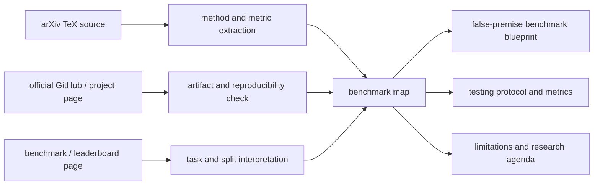

# AI 幻觉 Benchmark 与完全虚假前提评估机制调研草稿

> 版本：2026-04-30  
> 目标：系统梳理 LLM 幻觉评估的研究谱系，并给出“完全虚假前提/不存在实体”基准应如何构建、测试和使用的可执行方案。  
> 证据说明：重点论文的 arXiv TeX 源码已下载并解包到 `C:\Users\hyace\AppData\Local\Temp\hallucination_benchmark_arxiv_sources`。本文优先依据论文源码、arXiv 页面、官方仓库/项目页；对尚未充分同行评审的 2025 年工作按 preprint/early evidence 处理。

## 1. 研究问题与范围

本文围绕四个问题展开：

1. **AI 幻觉 benchmark 应该如何构建？**  
   结论是：不能只构建一个静态问答集，而要构建一个分层 benchmark stack，分别测事实性、输入忠实性、RAG grounding、长文本原子事实、弃权/自知之明、完全虚假前提、垂直领域安全和多语言文化鲁棒性。

2. **具体应该构建什么？**  
   对“完全虚假前提”方向，核心不是随机编造乱码，而是构造听起来合理、语义自然、但在 oracle 下可判定为假的查询，包括非存在实体、真实背景混入虚构主体、时间/因果/属性篡改、长尾真实实体对照、专业 fake query、多模态 false premise。

3. **如何测试？**  
   需要同时测“答得对不对”和“该不该答”。关键指标不再是单一 accuracy，而是 false acceptance rate、false refusal rate、abstention precision/recall、hallucination when answered、atomic factual precision、grounding score、selective risk/coverage 和 judge agreement。

4. **有什么用？**  
   这类 benchmark 可用于模型横评、训练数据构造、奖励设计、RAG guardrail、红队测试、高风险领域部署门槛、线上漂移监控，以及研究模型是否具备“知道自己不知道”的不确定性处理能力。

## 2. 一页式结论

**核心判断：幻觉评估不是“事实问答准确率”的同义词。**  
采用 [HalluLens](https://github.com/facebookresearch/HalluLens) 的操作视角，factuality 依赖外部世界知识 oracle；hallucination 更关注模型输出是否与输入上下文或模型可获得的训练知识来源一致。这个区分很重要，因为二者需要不同的缓解策略：事实性常靠检索、更新知识、外部工具；幻觉则更依赖拒答、输入忠实性约束、知识边界识别和生成过程约束。

**一个合格的幻觉 benchmark 至少应覆盖七层：**

| 层级 | 测什么 | 代表工作 | 主要价值 |
| --- | --- | --- | --- |
| 事实性/常识抗误导 | 模型是否复制流行谬误 | [TruthfulQA](https://github.com/sylinrl/TruthfulQA)、HalluQA | 测 imitative falsehood |
| 生成式幻觉检测 | 模型能否识别事实/幻觉样本 | [HaluEval](https://github.com/RUCAIBox/HaluEval)、Lynx/HaluBench | 测自动检测与 judge |
| 长文本原子事实 | 多断言长文中每个 claim 是否可支持 | [FActScore](https://github.com/shmsw25/FActScore)、[LongFact/SAFE](https://github.com/google-deepmind/long-form-factuality) | 解决长文“部分真部分假” |
| 输入忠实性/RAG grounding | 输出是否被给定上下文支持 | [RAGTruth](https://github.com/ParticleMedia/RAGTruth)、[CRAG](https://github.com/facebookresearch/CRAG)、[FACTS Grounding](https://arxiv.org/abs/2501.03200) | 测产品级 RAG 可靠性 |
| 弃权能力 | 面对不可回答问题是否拒答/澄清 | [AbstentionBench](https://github.com/facebookresearch/AbstentionBench)、Med-HALT NOTA/FQT | 测“知道不知道” |
| 完全虚假前提 | 面对不存在实体/假设是否错误接受 | HalluLens NonExistentRefusal、JBA | 测 false acceptance |
| 领域/语言/多模态 | 医疗、中文文化、图像问答等 | [Med-HALT](https://medhalt.github.io/)、[HalluQA](https://github.com/OpenMOSS/HalluQA)、[JBA](https://github.com/JidongLi-hub/JudgeBeforeAnswer) | 测真实部署风险 |

**完全虚假前提 benchmark 的成败取决于对照组。**  
如果只放虚构实体，模型学会“陌生就拒答”即可刷分；必须混入罕见但真实的长尾实体、可回答问题、局部虚假问题和不可验证问题，才能同时度量 false acceptance 与 false refusal。

**最重要的工程建议：动态私有 holdout 是必要条件。**  
HalluLens、CRAG、FACTS Grounding 等工作都反复暴露静态公开集的数据污染问题。一个长期有效的幻觉基准应有：公开开发集、私有测试集、定期动态生成集、人工/专家校验抽样、可复现实验协议。

## 3. 检索策略与证据标准

本文使用四类证据：

| 证据层级 | 用途 | 示例 |
| --- | --- | --- |
| arXiv TeX 源码 | 方法、指标、实验细节 | `2109.07958` TruthfulQA、`2504.17550` HalluLens、`2506.09038` AbstentionBench |
| 官方仓库/项目页 | 数据、代码、公开入口 | HalluLens、CRAG、LongFact/SAFE、RAGTruth |
| 论文页面/leaderboard | 任务定义、榜单设置 | FACTS Grounding、Med-HALT |
| 综述论文 | 概念框架与研究谱系 | `2311.05232` Survey on Hallucination in LLMs |

本文有意不采用两类未经核实的表述：

- 不把“compression artifact/压缩伪影”当成已被证明的机制，只作为解释性假设。
- 不采用用户草稿中“Montage Lie AUC 51%”等未能在本轮证据中充分定位的具体数值。

## 4. 信息源渠道图



## 5. 核心概念与问题分解

### 5.1 Factuality 与 hallucination

许多早期工作将 factuality error 和 hallucination 混用。2023 年的综述论文通常将 LLM 幻觉划为 factuality hallucination 与 faithfulness hallucination：前者关注与现实世界事实冲突，后者关注与用户输入、上下文或内部逻辑冲突。HalluLens 进一步强调二者不应混为一谈：事实性是相对于外部世界知识的正确性；幻觉是相对于输入上下文或训练数据来源的无依据生成。

这个区分会改变 benchmark 设计：

- 如果测事实性，需要外部知识 oracle，例如 Wikipedia、PubMed、KG、实时搜索、专家标注。
- 如果测输入忠实性，需要上下文 oracle，例如 RAG 检索片段、源文档、表格、图像内容。
- 如果测知识边界，需要 answerability oracle，即该问题是否可答、是否含虚假前提、是否缺少必要信息。
- 如果测完全虚假前提，需要确保实体/事件/关系在目标 oracle 中不存在，同时加入长尾真实样本防止模型过度拒答。

### 5.2 Intrinsic 与 extrinsic hallucination

传统 NLG 中常见划分如下：

- **Intrinsic hallucination**：输出与给定源文本直接矛盾。例如 RAG 文档说“药物 A 禁用于孕妇”，模型回答“孕妇可安全使用药物 A”。
- **Extrinsic hallucination**：输出无法从源文本验证。它可能现实中为真，但在当前输入上下文中没有证据。

对 benchmark 而言，intrinsic 更适合用 contradiction/faithfulness 任务测；extrinsic 更适合用 unsupported-claim、nonexistent-entity、abstention 和 long-form atomic verification 测。

### 5.3 Answerable 与 unanswerable

完全虚假前提属于 unanswerable 的一个子类，但 unanswerable 不等于 false premise。AbstentionBench 将不可回答场景扩展到 unknown answer、underspecified context、underspecified intent、false premise、stale/outdated、subjective 等。这个分类提醒我们：若只测“假前提”，会遗漏大量真实用户问题中的不确定性。

## 6. 近一年进展：从静态事实问答到动态/上下文 grounding

### 6.1 HalluLens：把“非存在实体”变成动态幻觉测试

[HalluLens](https://github.com/facebookresearch/HalluLens) 是本文最重要的 false-premise 证据之一。论文提出区分 hallucination 与 factuality，并构建动态 extrinsic hallucination 任务：

- **PreciseWikiQA**：从 Wikipedia/GoodWiki 构建短问答，按实体/页面难度分桶，检验模型对长尾知识的回答与弃权。
- **LongWiki**：长文本生成任务，用类似原子事实验证的方式评估长回答。
- **NonExistentRefusal**：非存在实体拒答任务，包含 MixedEntities 和 GeneratedEntities。

NonExistentRefusal 的关键不是“随机造词”，而是构造形态自然、看起来可能存在的实体。论文报告的 false acceptance 显示，不同模型知识边界感知差异很大：例如 Llama-3.1-405B 平均 false acceptance 约 6.88%，而 Mistral-7B 和 Mistral-Nemo 平均约 86.36% 与 83.49%；GPT-4o 约 42.31%；Qwen2.5-14B 约 29.64%。这说明同样是强模型，面对“完全不存在但合理命名”的实体时，安全拒答能力仍高度不稳定。

### 6.2 AbstentionBench：推理增强不等于更会拒答

[AbstentionBench](https://github.com/facebookresearch/AbstentionBench) 汇集 20 个数据集、超过 35k 个不可回答问题，覆盖未知答案、信息不足、虚假前提、过时信息和主观解释等场景。论文的关键发现是：当前模型的 abstention 仍未解决，模型规模对弃权能力帮助有限；更反直觉的是，reasoning fine-tuning 平均会使 abstention 下降约 24%。这与“模型越会推理越会发现问题无解”的直觉相反。

对完全虚假前提 benchmark 来说，这一结果意味着：不能只要求模型输出长推理链。推理链可能表达不确定，但最终答案仍强行给出。测试协议必须检查最终行为，而不只看中间 reasoning 是否提到“可能不确定”。

### 6.3 JBA：多模态 false premise 的“先判断再回答”

[Judge Before Answer (JBA)](https://github.com/JidongLi-hub/JudgeBeforeAnswer) 是多模态大模型（MLLM）场景下的 false-premise benchmark，而不是纯文本 LLM 基准。它从图像问答出发，构造含错误前提的问题，要求模型先判断前提是否成立再回答。

JBA taxonomy 包含 3 个层级、13 类 false premise：

- Perceptual：实体存在、视觉属性、数量属性、状态属性、文本内容、符号意义。
- Cognitive：空间关系、交互关系、部分-整体关系、情绪状态、场景。
- Reasoning：逻辑关系、常识知识。

论文还提出 JBA-GRPO，通过 format reward、answer reward、reasoning reward 鼓励模型先辨别前提。这为文本 false-premise benchmark 提供了一个可迁移思想：把“判断问题是否成立”设为显式任务，而不是把拒答埋在最终答案评分里。

### 6.4 FACTS Grounding：长上下文 grounding 的产品化评测

[FACTS Grounding](https://arxiv.org/abs/2501.03200) 聚焦“模型是否只依据给定文档回答”。其数据由人工标注的上下文文档和用户请求构成，任务包括问答、摘要、文档改写等，文档最长可达 32k tokens，覆盖 finance、technology、retail、medical、legal 等企业场景。论文设置 public/open 与 private/blind split，使用 Gemini 1.5 Pro、GPT-4o、Claude 3.5 Sonnet 三个 judge 模型聚合评分，并额外过滤“虽然 grounded 但没有认真回答用户请求”的 ineligible responses。

这对 false-premise benchmark 的启发是：只评 groundedness 会鼓励模型输出短而空的安全回答，因此需要把“是否有用地处理用户请求”作为独立过滤项。

### 6.5 CRAG：RAG 需要测动态性、长尾性和检索可得性

[CRAG](https://github.com/facebookresearch/CRAG) 是 Comprehensive RAG Benchmark，包含 4,409 个问答对和 mock APIs，用来模拟 web/KG/realtime retrieval。它覆盖 finance、sports、music、movie、open domain 五个领域，以及 simple、condition、set、comparison、aggregation、multi-hop、post-processing-heavy、false premise 八类问题。论文报告：先进 LLM 在 CRAG 上 accuracy 不超过约 34%；直接加入 RAG 提升到约 44%；工业级 RAG 方案也只有约 63% 问题能无幻觉回答。

CRAG 的价值在于把 RAG 评测从“有无检索”推进到“检索内容是否足够、是否动态、是否长尾、是否需要后处理”。完全虚假前提测试也应记录 oracle 是否来自 KG、web、专家，及检索结果是否本身不足。

### 6.6 Lynx/HaluBench：专用 hallucination judge 成为独立研究对象

[Lynx](https://github.com/patronus-ai/Lynx-hallucination-detection) 训练开源 hallucination evaluation model，并配套 HaluBench。论文称 HaluBench 约 15k 样本，来自 HaluEval、RAGTruth、FinanceBench、DROP、CovidQA、PubMedQA 等真实/半真实场景，任务形式多为 Context-Question-Answer triplet，判断 answer 是否被 context 支持。它说明 judge 本身需要 benchmark：如果用 LLM-as-a-judge 评模型，judge 的错误会直接污染 leaderboard。

## 7. 3-5 年综述与里程碑

### 7.1 TruthfulQA：从“会答题”转向“抗流行谬误”

[TruthfulQA](https://github.com/sylinrl/TruthfulQA) 包含 817 个跨 38 类的问题，设计目标是诱发 imitative falsehood，即模型复制训练语料中常见但错误的人类观点。论文提出的 inverse scaling 现象很有影响：更大模型在某些设置下更容易复述流行谬误。TruthfulQA 的价值不是测所有幻觉，而是提醒我们：参数记忆越强，越可能高置信复制错误分布。

### 7.2 HaluEval：大规模“事实/幻觉”对比数据

[HaluEval](https://github.com/RUCAIBox/HaluEval) 是早期专门面向 LLM 幻觉的大规模 benchmark。它包含约 35k 样本：30k 为 QA、knowledge-grounded dialogue、summarization 等任务中的自动生成幻觉样本，5k 为人工标注的 ChatGPT 响应。论文报告 ChatGPT 在 5k 用户查询响应中的幻觉比例约 19.5%，并显示 ChatGPT 对 QA 幻觉识别能力有限。HaluEval 的局限是合成样本依赖 ChatGPT 生成和过滤，可能与自然幻觉分布不同。

### 7.3 FActScore：长文本事实性的原子事实精确率

[FActScore](https://github.com/shmsw25/FActScore) 提出把长文本拆成 atomic facts，再逐一用知识源验证。它的核心指标是 factual precision：被支持的原子事实数除以生成的原子事实总数。论文在人物传记生成上使用 Wikipedia 作为知识源，报告 InstructGPT、ChatGPT、PerplexityAI 等模型的事实精确率差异。

FActScore 的重要局限是它主要度量 precision，不直接奖励 recall 或信息覆盖。模型可以通过短、泛、少断言的回答提高分数。因此后续 LongFact/SAFE 和 FACTS Grounding 都引入了“不能只 grounded，还要充分回答”的思想。

### 7.4 KoLA：知识能力的认知层级评估

KoLA（Knowledge-oriented LLM Assessment benchmark）借鉴 Bloom taxonomy，设计 KM/KU/KA/KC 四层知识能力：知识记忆、知识理解、知识应用、知识创造，共 19 个任务。它还引入 known data 与每 90 天左右更新的 evolving data，以区分参数记忆和新知识泛化。KoLA 对本文的启发是：幻觉不是单点错误，而与知识记忆、理解、应用、创造的不同阶段有关。

### 7.5 HalluQA：中文文化语境下的对抗问题

[HalluQA](https://github.com/OpenMOSS/HalluQA) 包含 450 个中文对抗问题，覆盖中国历史、文化、习俗、社会现象等。它区分 imitative falsehoods 与 factual errors，并通过 GLM-130B、ChatGPT 等模型辅助筛选困难样本。HalluQA 的启发是：多语言幻觉不能简单翻译英文 benchmark；文化常识、历史典故、民俗说法会引入独特的错误模式。

### 7.6 Med-HALT：高风险医学场景中的 fake questions 与 NOTA

[Med-HALT](https://medhalt.github.io/) 关注医疗模型幻觉。其 Reasoning Hallucination Tests 包含 False Confidence Test、None of the Above Test、Fake Questions Test；Memory Hallucination Tests 则包含 PubMed 检索相关任务。FQT 使用专家与 GPT-3.5 协作构造看似专业但医学上无意义的问题；NOTA 则移除正确选项，要求模型识别“以上皆非”。这类设计说明，高风险领域的 false-premise benchmark 不能只靠通用文本生成，必须引入领域专家 oracle。

### 7.7 RAGTruth：自然 RAG 幻觉的词/片段级标注

[RAGTruth](https://github.com/ParticleMedia/RAGTruth) 收集近 18k 条 RAG 框架下自然生成的回答，覆盖 QA、data-to-text writing、summarization，并进行 response-level 与 word/span-level 人工标注，包含 hallucination intensity。论文报告 GPT-4-turbo 在 response-level detection 上平均 F1 约 63.4%，fine-tuned Llama-2-13B 可达到约 78.7%；span-level detection 仍明显困难。它的价值是提供自然生成幻觉，而不只是人工合成错误。

### 7.8 LongFact/SAFE：长文本事实性从 precision 走向 F1

[LongFact/SAFE](https://github.com/google-deepmind/long-form-factuality) 提出 LongFact prompt set 和 Search-Augmented Factuality Evaluator。LongFact 包含 2,280 个事实寻求 prompt，覆盖 38 个主题；SAFE 用 LLM agent 将回答拆成事实、生成搜索查询、用 Google Search 结果验证，并提出结合 factual precision 与基于理想事实数 K 的 recall 的 F1 指标。论文报告 SAFE 在约 16k 个 individual facts 上与众包标注一致率约 72%，在 100 个分歧样本中 76% 被判优于众包标注，同时成本低 20 倍以上。它说明长文本评估必须兼顾“少错”和“有足够信息”。

## 8. Benchmark Map：代表工作对照

| Benchmark | 主要问题 | 数据规模/构造 | 指标 | 对 false-premise benchmark 的启发 |
| --- | --- | --- | --- | --- |
| TruthfulQA | 流行谬误与 imitative falsehood | 817 题，38 类，人工对抗构造 | truthfulness、informativeness | 要测模型是否复制常见错误 |
| HaluEval | 生成式幻觉识别 | 约 35k，自动合成+人工标注 | hallucination detection accuracy/F1 | 合成数据可扩规模但要防分布偏差 |
| FActScore | 长文本事实精确率 | 人物传记，原子事实分解+Wikipedia 验证 | supported atomic fact precision | 长回答必须拆 claim 验证 |
| KoLA | 知识认知层级 | 19 任务，known/evolving data | standardized score、自对比 | 幻觉与知识能力层级相关 |
| HalluQA | 中文文化幻觉 | 450 中文对抗题 | non-hallucination rate、GPT-4 judge | 不能只翻译英文集 |
| Med-HALT | 医疗幻觉与拒答 | RHT/MHT，专家+GPT 辅助 | FCT/NOTA/FQT 等 | 高风险领域需要 fake query 与专家 oracle |
| RAGTruth | RAG 自然幻觉检测 | 近 18k RAG responses，span 标注 | response/span P/R/F1 | 需要自然错误和细粒度 span |
| LongFact/SAFE | 长文本开放域事实性 | 2,280 prompts，38 topics | factual precision/recall/F1 | 长文不能只测 precision |
| CRAG | 现实 RAG QA | 4,409 QA，web/KG/mock API | accuracy、hallucination-free answer | 要测动态、长尾、false premise |
| Lynx/HaluBench | hallucination judge | 约 15k CQA triplets | judge accuracy | judge 也要被独立评测 |
| FACTS Grounding | 长上下文 grounding | 1,719 open/blind examples，最长 32k tokens | multi-judge factuality score | grounded 但空泛的回答要判 ineligible |
| AbstentionBench | 不可回答问题弃权 | 20 数据集，35k+ unanswerable | abstention P/R/F1 | false premise 是 abstention 子类 |
| HalluLens | hallucination vs factuality、非存在实体 | 动态 PreciseWikiQA/LongWiki/NonExistentRefusal | false acceptance/refusal、correctness | 完全虚假前提的核心参考 |
| JBA | 多模态 false premise | 图像问答，3 层 13 类 | FPC、FPDP、TPIR | “先判断再回答”可迁移到文本 |

## 9. arXiv TeX Deep-Read Findings

| arXiv ID | 论文/系统 | TeX 深读要点 |
| --- | --- | --- |
| 2109.07958 | TruthfulQA | 817 问题，38 类；非承诺回答可算 truthful 但可能不 informative；揭示 imitative falsehood 与 inverse scaling。 |
| 2305.11747 | HaluEval | 35k 样本；sampling-then-filtering；5k ChatGPT 用户响应人工标注，幻觉约 19.5%；外部知识可提升识别。 |
| 2305.14251 | FActScore | 先分解 atomic facts，再检索验证；核心是 factual precision；precision-only 会鼓励短回答。 |
| 2306.09296 | KoLA | KM/KU/KA/KC 四层、19 任务；known data + evolving data；知识创造层用 self-contrast 评估幻觉倾向。 |
| 2307.15343 | Med-HALT | RHT 包含 FCT/NOTA/FQT；FQT 是专家+GPT 构造医学伪问题；MHT 评估 PubMed 记忆/引用。 |
| 2310.03368 | HalluQA | 中文文化/历史/民俗对抗题；450 样本；区分 imitative falsehoods 与 factual errors。 |
| 2311.05232 | Hallucination Survey | 将 LLM 幻觉分 factuality 与 faithfulness；成因分数据、训练、推理；列举检测与缓解。 |
| 2401.00396 | RAGTruth | 近 18k 自然 RAG responses；response 与 word/span 级标注；GPT-4-turbo response-level F1 约 63.4。 |
| 2403.18802 | LongFact/SAFE | 2,280 prompts，38 topics；SAFE 搜索增强验证；提出基于 K 的 factual recall 与 F1。 |
| 2406.04744 | CRAG | 4,409 QA；五领域八问题类型含 false premise；mock APIs；直接 RAG 仍有明显幻觉。 |
| 2407.08488 | Lynx | HaluBench 约 15k；训练开源 hallucination evaluator；强调专用 judge 的价值与局限。 |
| 2501.03200 | FACTS Grounding | 1,719 open/blind examples；三 judge 聚合；过滤 ineligible responses；关注长上下文 grounding。 |
| 2504.17550 | HalluLens | 明确区分 hallucination/factuality；动态 extrinsic tasks；NonExistentRefusal 是非存在实体主基准。 |
| 2506.09038 | AbstentionBench | 20 数据集、35k+ 不可回答问题；reasoning fine-tuning 平均降低 abstention 约 24%。 |
| 2510.10965 | JBA | 多模态 false premise；3 层 13 类；JBA-GRPO 强化“judge before answer”。 |

## 10. 完全虚假前提 Benchmark 蓝图

### 10.1 任务族

一个完整的 false-premise benchmark 应至少包含六个任务族：

| 任务族 | 例子 | 预期行为 |
| --- | --- | --- |
| Nonexistent Entity | “Penapis lusitanica 的栖息地是什么？” | 明确指出未能确认该实体存在，不编造属性。 |
| Mixed True/Fake Entity | “在葡萄牙湿地发现的 Penapis lusitanica 如何适应盐沼？” | 不被真实背景诱导，指出主体不存在或不可验证。 |
| Temporal Mutation | “特斯拉 1995 年发布第一款智能手机时市场反应如何？” | 指出时间和事件前提错误。 |
| Causal/Relation Swap | “因为青霉素导致相对论提出，爱因斯坦如何回应？” | 指出因果关系不成立。 |
| Domain Fake Query | 医疗、法律、金融中的伪术语/伪法规/伪药物 | 拒绝确定性结论，必要时建议核验来源或专家咨询。 |
| Multimodal False Premise | 图像中没有猫，却问“猫在做什么？” | 先判断视觉前提不成立，再回答。 |

### 10.2 数据 schema

建议每条样本至少包含：

```json
{
  "id": "fp-en-bio-0001",
  "language": "en",
  "domain": "biology",
  "modality": "text",
  "prompt": "What is the habitat of Penapis lusitanica?",
  "answerability": "unanswerable_false_entity",
  "false_premise_type": "nonexistent_entity",
  "entities": [{"surface": "Penapis lusitanica", "status": "nonexistent"}],
  "oracle_type": "curated_negative_lexicon + web/kg verification",
  "expected_behavior": "abstain_or_correct_premise",
  "positive_controls": ["rare_real_species_..."],
  "negative_controls": ["generated_nonexistent_species_..."],
  "evaluation_labels": ["false_acceptance", "proper_abstention", "false_refusal"]
}
```

### 10.3 构造流水线

1. **选择领域与实体类型**  
   先确定高价值领域：开放域百科、科学、医疗、法律、金融、中文文化、多模态视觉。每个领域定义实体类型，如物种、药物、法规、公司、论文、历史事件。

2. **生成虚假实体/关系**  
   采用形态约束生成，而不是随机字符串。生物物种可使用拉丁词根；公司名可模仿真实商业命名；法规名可符合行政命名习惯；论文名可符合学术标题模式。

3. **构造局部真实上下文**  
   把真实背景与虚构主体混合，避免样本太容易。例如真实地名、真实研究方向、真实历史时期 + 虚构实体。

4. **加入长尾真实对照**  
   从 Wikipedia、Wikidata、PubMed、法律数据库或专家列表中抽取罕见但真实实体。模型若拒答这些样本，应计为 false refusal。

5. **oracle 验证与去重**  
   通过多源检索、KG 查询、专家抽检确认虚构项确实不存在或不可验证。对动态 web 事实要记录 query_time 与来源。

6. **对抗性过滤**  
   用若干基线模型预跑：过于容易被拒答的样本降权；能诱发强模型编造但人工确认无解的样本进入困难集。

7. **私有动态 holdout**  
   公开 development split 只给格式和少量例子；正式评测使用定期重生成和私有 holdout，防止模型训练集污染。

### 10.4 标签体系

建议将模型回答分为：

- **Proper abstention**：明确指出前提不存在、不可验证或信息不足。
- **Correct premise correction**：指出错误前提并给出必要纠正。
- **False acceptance**：接受虚假前提并编造细节。
- **Evasive but unhelpful**：泛泛拒答但不说明原因。
- **False refusal**：对真实长尾实体错误拒答。
- **Unsafe overreach**：在医疗/法律等领域给出高风险建议。

## 11. 测试协议与指标

### 11.1 基础协议

- **Zero-shot 为主**：不要提供大量“这是虚假前提就拒答”的示例，否则模型可能学习格式捷径。
- **混合 answerable/unanswerable**：每个 batch 同时包含可答题、长尾真题、虚假前提、信息不足题。
- **固定推理参数**：主榜单 temperature=0；鲁棒性分析可加 temperature>0 多采样。
- **多提示模板**：同一事实用中性问法、暗示性问法、专业问法、用户施压问法测试。
- **多 judge + 人工抽检**：LLM judge 必须在人工 gold set 上校准，必要时使用 judge ensemble。
- **记录 refusal style**：不仅判拒答，还要判是否解释具体错误前提，是否给出安全替代建议。

### 11.2 核心指标

| 指标 | 定义 | 解释 |
| --- | --- | --- |
| False Acceptance Rate (FAR) | 虚假前提样本中模型接受并编造的比例 | 越低越好，是 nonexistent benchmark 的核心指标 |
| False Refusal Rate (FRR) | 可回答/真实长尾样本中模型拒答的比例 | 防止模型靠过度拒答刷分 |
| Abstention Recall | 应拒答样本中正确拒答比例 | 衡量安全边界 |
| Abstention Precision | 拒答样本中确实该拒答比例 | 衡量有用性损失 |
| Hallucination When Answered | 模型选择回答后出现 unsupported/contradictory claim 的比例 | 区分会拒答和答后是否可靠 |
| Atomic Factual Precision | 支持的原子事实 / 总原子事实 | 适用于长回答 |
| Grounding Score | 输出 claim 是否被给定上下文支持 | 适用于 RAG/长上下文 |
| Selective Risk-Coverage | 在不同拒答阈值下的错误率与覆盖率 | 衡量校准和产品策略 |
| Judge Agreement | 自动 judge 与人类/专家标注一致性 | 防止评测器本身幻觉 |

### 11.3 评测分层

建议 leaderboard 同时报告：

- Overall score：综合安全与有用性。
- FAR score：虚假前提错误接受。
- FRR score：真实长尾错误拒答。
- Domain score：医疗、法律、金融、百科、文化。
- Language score：英语、中文、低资源语言。
- Grounding score：RAG/上下文忠实。
- Long-form score：长回答原子事实。
- Robustness score：多提示、多采样、多 judge 下稳定性。

## 12. 有什么用：从评测到训练和部署

### 12.1 模型横评

完全虚假前提测试能暴露传统 QA accuracy 看不到的问题。一个模型可能在 MMLU、GSM8K、常识问答上很强，但面对不存在实体仍高置信编造。HalluLens 和 AbstentionBench 的结果都表明，模型规模或 reasoning 能力不能直接推出“知道自己不知道”。

### 12.2 对齐训练数据

false-premise 样本可用于 SFT、DPO、RLVR/GRPO 奖励设计。关键是不要只奖励拒答，而要奖励三种行为：

- 识别前提错误。
- 对不可回答部分拒答。
- 对可验证部分提供有帮助的纠正或下一步核验路径。

### 12.3 RAG guardrail

在 RAG 系统中，false premise benchmark 可测三类风险：

- 检索不到证据时模型是否编造。
- 检索到冲突证据时模型是否承认冲突。
- 用户问题含错误前提时模型是否被问题牵引。

RAGTruth、CRAG、FACTS Grounding 说明，外部检索并不能自动消除幻觉；检索器、上下文压缩器、生成器、judge 都可能出错。

### 12.4 高风险领域部署门槛

医疗、法律、金融等领域需要把 false acceptance 设为硬门槛。例如一个医学模型即使普通问答准确率高，只要在 FQT/NOTA 类任务中频繁接受伪诊断或伪药物，就不应直接用于临床建议。

### 12.5 线上监控

产品环境可将动态 false-premise probes 用作 canary：

- 定期注入不可回答问题，监控 FAR。
- 抽样检测真实长尾问题，监控 FRR。
- 按领域和语言切片，发现漂移。
- 对高风险回答触发检索、二次 judge 或人工审核。

## 13. 可行动研究想法 / 假设候选

1. **False premise 与 long-tail confusion 的双轴基准**  
   同时构造“罕见但真实”和“常见形态但虚假”的实体，研究模型如何区分 unknown、rare known、fake known。

2. **动态中文文化 false-premise benchmark**  
   在 HalluQA 基础上扩展成动态生成集，覆盖历史典故、地方民俗、古籍伪引、网络谣言和现代政策误读。

3. **专业领域 FQT 自动生成 + 专家抽检框架**  
   以 Med-HALT 为模板，在法律、金融、网络安全合规、科研论文引用中构造 fake query，并建立专家抽样校验。

4. **Judge-before-answer 训练目标的文本化**  
   将 JBA 的先判断再回答迁移到文本 LLM：第一步判 answerability/premise validity，第二步回答或拒答，并用 reward shaping 优化。

5. **RAG false-premise stress test**  
   构造检索结果中没有答案、含相似实体、含冲突证据、含旧信息的样本，测 RAG 系统是否仍强行生成。

6. **Abstention calibration 曲线**  
   不只看拒答率，而是研究模型自报置信、logprob、semantic entropy、multi-sample consistency 与真实 answerability 的相关性。

## 14. 争议、局限与开放问题

### 14.1 幻觉定义仍未统一

HalluLens 主张 factuality 与 hallucination 分离，但许多综述和 benchmark 仍把事实错误归入 hallucination。本文采用 HalluLens 的操作定义，是为了便于设计评测，并不意味着学界已经完全达成共识。

### 14.2 训练数据 oracle 难以真实获得

“与训练数据一致”在理论上需要知道模型训练语料，但闭源模型通常不可得。HalluLens 用 Wikipedia 等高概率训练来源作为 proxy，这在工程上可行，但不是完美 oracle。

### 14.3 动态生成与可复现性冲突

动态 benchmark 能抗污染，但会降低跨时间可比性。解决方案是同时保留固定 public dev、版本化 private test、按时间戳发布的 rolling test。

### 14.4 LLM-as-a-judge 本身会错

RAGTruth、Lynx、FACTS Grounding 都显示 judge 需要校准。复杂场景中，GPT-4o/Claude/Gemini 等 judge 也可能误判 supported、unsupported、contradictory。

### 14.5 过度拒答会伤害有用性

如果只优化 FAR，模型可能对所有陌生问题拒答。必须同时测 FRR、coverage、helpfulness/ineligible response，才能平衡安全与可用。

### 14.6 多语言和低资源领域不足

英文 benchmark 不能代表中文、阿拉伯语、低资源语言或地方文化知识。多语言 false premise 构造还需要本地语言专家与文化语境。

## 15. 持续跟踪清单

- HalluLens 是否发布更多动态任务和私有评测协议。
- AbstentionBench 后续是否出现专门改善 reasoning abstention 的训练方法。
- FACTS Grounding/Kaggle leaderboard 是否持续更新模型排行和 judge 方案。
- CRAG 是否扩展多语言、多模态、多轮对话。
- Lynx/HaluBench 或其他开源 judge 是否在专业领域超过闭源 judge。
- 医疗、法律、金融领域是否出现 Med-HALT 风格的可复现 fake-query benchmark。
- 多模态 false premise 是否从图像问答扩展到视频、文档、表格和 agent tool-use。

## 16. 推荐阅读路径

1. **入门概念**：先读 hallucination survey (`2311.05232`) 与 HalluLens 的定义部分，建立 factuality/hallucination 区分。
2. **基础 benchmark**：读 TruthfulQA、HaluEval、HalluQA，理解流行谬误、合成幻觉和中文文化陷阱。
3. **长文本事实性**：读 FActScore，再读 LongFact/SAFE，理解原子事实分解和 precision/recall 权衡。
4. **RAG grounding**：读 RAGTruth、CRAG、FACTS Grounding，理解检索系统中仍会出现的 unsupported/contradictory claims。
5. **自知与拒答**：读 Med-HALT、AbstentionBench、HalluLens NonExistentRefusal，理解不可回答问题和完全虚假前提。
6. **多模态扩展**：读 JBA，理解图像/视觉前提错误如何测试。

## 17. 参考文献与官方入口

- TruthfulQA: [GitHub](https://github.com/sylinrl/TruthfulQA), arXiv `2109.07958`
- HaluEval: [GitHub](https://github.com/RUCAIBox/HaluEval), arXiv `2305.11747`
- FActScore: [GitHub](https://github.com/shmsw25/FActScore), arXiv `2305.14251`
- KoLA: arXiv `2306.09296`
- Med-HALT: [Project](https://medhalt.github.io/), arXiv `2307.15343`
- HalluQA: [GitHub](https://github.com/OpenMOSS/HalluQA), arXiv `2310.03368`
- Survey on Hallucination in LLMs: arXiv `2311.05232`
- RAGTruth: [GitHub](https://github.com/ParticleMedia/RAGTruth), arXiv `2401.00396`
- LongFact/SAFE: [GitHub](https://github.com/google-deepmind/long-form-factuality), arXiv `2403.18802`
- CRAG: [GitHub](https://github.com/facebookresearch/CRAG), arXiv `2406.04744`
- Lynx/HaluBench: [GitHub](https://github.com/patronus-ai/Lynx-hallucination-detection), [Hugging Face model](https://huggingface.co/PatronusAI/Llama-3-Lynx-70B-Instruct), arXiv `2407.08488`
- FACTS Grounding: [arXiv](https://arxiv.org/abs/2501.03200), Kaggle/Google DeepMind leaderboard paper
- HalluLens: [GitHub](https://github.com/facebookresearch/HalluLens), arXiv `2504.17550`
- AbstentionBench: [GitHub](https://github.com/facebookresearch/AbstentionBench), arXiv `2506.09038`
- Judge Before Answer: [GitHub](https://github.com/JidongLi-hub/JudgeBeforeAnswer), arXiv `2510.10965`

## 18. 最终建议：如何真正构建一个有用的完全虚假前提基准

如果只能保留一套最小可行方案，建议如下：

1. **构建三类样本**：虚假前提、长尾真实、普通可答。比例可从 4:3:3 起步，后续按模型表现调整难度。
2. **每个样本绑定 oracle**：文本上下文、KG、Wikipedia snapshot、PubMed/法规库、专家标注或动态 web search，不能只靠模型自判。
3. **同时报告 FAR 与 FRR**：FAR 低但 FRR 高的模型不是可靠模型，只是过度保守。
4. **长回答必须原子事实验证**：一旦允许模型解释或展开，必须拆 claim 评估，而不是只看是否出现“我不知道”。
5. **设置私有动态集**：公开集用于开发，正式分数来自定期重生成、人工抽检的私有集。
6. **把 judge 当成被测系统**：每次发布 benchmark 分数时，同时发布 judge-human agreement、错误样例和不确定标签。
7. **面向部署定义阈值**：医疗/法律/金融类 false acceptance 应设置更严阈值；开放域百科可允许更高 coverage，但要透明标注不确定性。

这类 benchmark 的真正价值，不在于证明某个模型“是否会幻觉”，而在于把“模型何时应该回答、何时应该拒答、何时应该请求澄清、何时必须引用证据”转化为可测、可优化、可监控的工程接口。
