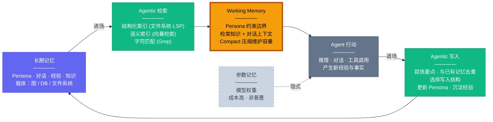

# 从 Working Memory 到长期记忆：Agent Memory 的全景图

过去一段时间，Agent Memory 很容易被讨论成过于简单的版本：比如给智能体接一个向量数据库。这抓住了局部，却错过了核心。**Memory 从来不只是一个存储层，而是一套围绕当前认知状态展开的进场、行动、退场机制。**

如果沿着我前面两篇文章的脉络看，这个问题会更清楚。在[《从智能体的认知结构到智能体框架》](/blog/2026/03/03/cognitive-architecture-to-agent-framework/)里，我借 CoALA 讨论了智能体的记忆层次；在[《Context is All You Need：智能体的上下文工程》](/blog/2026/03/06/agent-context-engineering/)里，我又从工程视角讨论了上下文管理。把这两条线合在一起，才能看见 Memory 的完整问题：它既是认知架构的一部分，也是工程系统的一部分。

这篇文章想做的，就是把 Agent Memory 目前比较零散的讨论压成一张相对完整的全景图：先解释为什么 Memory 不是数据库而是认知循环，再梳理它包含哪些类型、经历了怎样的研究演化，然后回答一个更现实的问题——为什么今天的评测仍然跟不上 Memory 的前沿推进，最后再讨论真正决定下一代 Agent Memory 上限的那些难题到底是什么。

如果只用一句话概括全文判断：**Agent Memory 的竞争点已经不再是有没有记忆库，而是"能不能把认知状态持续、正确、可治理地流转起来"。**

## Memory 不是数据库，而是认知循环

先说结论：**Memory 的核心不是"存了多少"，而是"能否围绕 Working Memory 形成稳定的进场—行动—退场闭环"。**

### 为什么它不等于 RAG

RAG 当然重要，但它解决的只是检索这一侧的问题——"当下需要什么知识"，而不是"什么值得长期保留""旧记忆如何修正""哪些内容已经过时""经验该写成规则还是写成事实"。把 Memory 直接等同于 RAG，本质上是在把整个系统压缩成一次性读取。真正的 Memory 系统至少还包含：对当前对话与行动过程的压缩、对长期经验的沉淀、对 Persona 的更新、对冲突信息的消解，以及对无效内容的遗忘。

### 为什么 Working Memory 是枢纽

长期记忆并不会直接参与行动。无论它存成向量、图、数据库还是文件，最后都必须被检索、筛选、压缩，然后进入当前决策周期的上下文里——这个位置就是 Working Memory。它像一个有限容量的工作台：Persona 约束、当前会话上下文、外部反馈、从长期记忆里召回的知识和经验，都在这里相遇。模型真正推理时面对的不是全部记忆，而是这块工作台上此刻被允许在场的信息。**Memory 是否有效，最终体现在 Working Memory 有没有被正确组织。**

### 真正难的是读写与治理

一旦把 Working Memory 放回中心，讨论的优先级就会重新排序。图结构重要，但比不上写入质量重要；检索算法重要，但比不上"什么时候该写、什么时候该改、什么时候该删"重要。Memory 问题从来不只是存储结构问题，而是生命周期管理问题——它要求系统同时处理读取、写入、更新、删除，进而还要处理 provenance、冲突消解、时间有效性和 rollback。

理解了这个前提之后，下面进入全景图的具体展开。

## Agent Memory 的全景图

### Memory 是认知循环，不是数据库

Memory 不是记忆检索和数据库，而是一套围绕 Working Memory 运转的完整认知流程。Agent 从长期记忆中检索所需的知识与经验，将其加载到 Working Memory 中形成当前上下文——这是**进场**；Agent 在此上下文中推理和行动，产生新的经验与事实；随后将这些新信息提炼、去重后写回长期记忆，同时更新 Persona——这是**退场**。进场附带检索，退场附带写入，Working Memory 是这个认知闭环的枢纽，而非某个可有可无的缓存层。

- **Working Memory**：是整个系统的枢纽：所有记忆经检索汇聚于此，所有新经验经此提炼后写回，Compact 维护其有限容量
- **长期记忆**：存储四种记忆类型，以图/DB/文件系统为载体
- **Agentic 检索/写入**：构成读写两端：检索层由 Agent 统一调度三类索引技术；写入层决定什么值得记住、以什么结构存储
- **参数记忆**：隐式影响行为，成本高，非参数记忆才是普惠路线

以上是 Memory 系统的运转骨架——认知循环定义了进场、行动、退场的流转方式。下面进入骨架的填充：Agent 的记忆到底可以被拆分成哪几种类型，它们各自承担什么职能。

### 五种记忆类型

当我们问"Agent 的记忆应该被分解为哪些部分"时，目前的实践经验指向五个层次：**Persona 记忆、Working Memory、对话记忆、经验记忆和语义知识**。这五者并非平行罗列，而是各自承担不同的认知职能：Persona 定义行为边界——Agent 是谁、该以什么姿态行动；Working Memory 是当前决策真正发生的工作台；对话记忆是工作台压缩后的持久化产物，保留交互脉络；经验记忆沉淀"下次该怎么做"的操作性知识；语义知识则回答"关于世界知道什么"。五者共同构成 Agent 的完整记忆画像。

**Persona 记忆**：是 Agent 的人格基底。它定义了 Agent 是谁——包括初始的人格设定、回复与思考的行为规范，以及在长期交互中逐渐演化出的偏好与风格。对于 Openclaw、Nanobot、世界模拟等需要拟人角色的场景，Persona 是刚需；而即便是工具型 Agent，它在长期服务中也会从用户反馈里沉淀出隐式的 Persona——用户的偏好本身就成了 Agent 行为规范的一部分。Persona 记忆在 CoALA 框架中最接近程序记忆（Procedural Memory）的概念，但它又不完全被这个框架容纳：程序记忆强调的是怎么做，而 Persona 同时还规定了以什么姿态做和什么不该做。我选择在这里单独列出来，因为它拥有工程上单独维护的价值。

**Working Memory**：是 Agent 的当前认知工作台。它不是长期存储，而是一个容量有限的活跃区域——所有从长期记忆中检索出的知识、当前对话的上下文、以及 Persona 施加的约束，都汇聚于此形成 Agent 每一步推理的输入。对话的连续性很大程度上依赖 Working Memory 的管理：通过 Compact 等压缩技术在信息不丢失的前提下维护其有限容量，使 Agent 能够在长对话中保持连贯。早期的记忆研究几乎等同于对话上下文管理，本质上就是在解决 Working Memory 的容量瓶颈问题。

**对话记忆**：是 Working Memory 压缩后写入长期记忆的持久化产物。Working Memory 是运行态的工作台，只存在于当前 session；而对话记忆则跨 session 存活，属于长期记忆的一部分。在一次长对话中，Agent 与用户会产生大量信息交换，其中一部分会被提炼写入经验或语义知识，一部分会更新 Persona，但总有相当数量的内容不属于以上任何一类——它们是讨论的脉络、用户的临时意图、尚未定论的探索方向、或者仅仅是"我们聊过这件事"这个事实本身。这些内容对用户而言可能仍有价值，却不值得被正式归档为经验或知识。当 Working Memory 因容量限制不得不压缩历史上下文时，这些内容作为压缩与提炼的产物被持久化为对话记忆，使得 Agent 在后续 session 中仍能接续先前的对话脉络。它在工程上应与语义知识分离——语义知识是关于世界的、跨会话持久有效的事实，而对话记忆是关于交互本身的、随会话生命周期而生灭的上下文快照。Memory 研究的初期几乎等同于对话连续性研究，所解决的正是这一层问题。

**经验记忆**：是 Agent 从行动中习得的操作性知识。当 Agent 不再局限于聊天而真正进入生产环境执行任务时，它在行动过程中会积累成功与失败的经验——这些经验可以自动提炼沉淀（如自动进化机制），也可以由人类手动填充（如 Claude Code 中的 Skills 和 Rules）。经验记忆是 Agent 从对话工具进化为行动实体的关键增量，它回答的是在类似场景下应该怎么做这个问题。

**语义知识**：则是 Agent 关于世界的事实性认知——实体之间的关系、领域内的概念体系、用户告知过的具体事实。它不同于经验记忆的操作导向，而是纯粹的知道什么：知道用户的地址、知道某个 API 的调用约定、知道两个概念之间的因果关系。语义知识是检索的主要对象之一，也是最容易用结构化方式（知识图谱、数据库）来组织的记忆类型。

### 存储结构选型

在讨论具体结构之前，需要先理解一个更宏观的分野：**参数记忆与非参数记忆**。参数记忆是编码在模型权重中的隐式知识——它通过训练将重复经验压缩为模型内部的适应能力，在推理时无需显式检索就能发挥作用。参数记忆的优势在于调用成本极低且响应即时，但它的写入成本极高（需要微调或持续训练），更新周期长，且不透明、不可审计。非参数记忆则是存储在模型外部的显式知识——无论是向量数据库中的文档、文件系统中的 Rules、还是知识图谱中的实体关系，它们都可以被即时写入、精确更新、按需检索，并且对人类完全可见可编辑。两者的关系不是替代，而是互补：参数记忆提供基座能力，非参数记忆提供可控的个性化与持续演化。对于绝大多数应用场景而言，非参数记忆才是可工程化、可普惠的选择，以下的存储结构讨论也主要围绕非参数记忆展开。

记忆需要结构，可能是图、结构化数据库、或者文件系统——但结构本身不是目的。**如何生长、如何修正、如何检索来获取，比结构长什么样子更重要。**一个精心设计的知识图谱如果缺乏有效的更新机制，很快就会腐化为过时的静态快照；而一个看似简陋的文件系统，只要配合良好的写入策略和检索手段，反而能持续生长。

目前实践中浮现出两条主要的结构化思路。一条是**图结构**——知识图谱天然擅长表达实体之间的关系网络，适合存储语义知识中关系密集的部分，支持多跳推理和关联发现。另一条是**文件系统的层次结构**——Agent 天生适合操作文件系统，层次化的目录和文件可以承载 Persona 定义、Skills/Rules、经验摘要等多种记忆内容，且对人类完全可读可编辑。这两条思路并无优劣之分，选择取决于记忆内容的特征：关系密集的语义知识倾向于图，操作性的经验和规范倾向于文件，而事实性记录可能更适合结构化数据库。实际系统往往混合使用多种载体，关键在于每种载体上的生长与修正机制是否健全。

### 检索与写入：记忆的读写两端

怎么从记忆中召回需要的内容，以及怎么把新的内容写回记忆，是 Memory 系统中两个同等重要的侧面。它们都应该由 Agent 自身驱动——不是被动地响应查询或接收写入指令，而是由 Agent 自主判断何时该读、读什么、何时该写、写成什么结构。同时，检索和写入的效果都高度依赖于存储结构的设计本身：结构决定了什么样的检索路径是可行的，也决定了写入时信息应该被安放在哪里。

在 Memory 研究的早期，RAG 就是核心——记忆约等于检索，关注点是从外部文档中找到相关段落。但现在 RAG 只是 Memory 的一个组件。检索侧目前可用的手段包括：

- **字符匹配（Grep/Glob）**：精确的文本模式匹配，适合已知关键词的快速定位，在非结构化数据中尤其实用
- **语义检索（RAG）**：基于向量相似度的语义匹配，擅长处理模糊意图和自然语言描述，是传统记忆检索的核心技术
- **结构化信源（文件系统/LSP）**：天生带有层次结构和类型信息的检索路径，Agent 可以利用目录结构做导航、利用 LSP 做代码级的符号跳转和引用查找
- **知识图谱遍历**：沿实体关系做多跳推理，适合回答需要关联发现和因果链路的问题

这些手段不是互斥的选择，而是由 Agent 以 Agentic 的思路统一调度——根据当前任务的特征规划检索策略，混合使用多种技术，最终将结果汇聚到控制Memory的Agent，然后再由他决定将什么引入 Working Memory 中。

和检索相对应的是**写入**——这个问题早在 LLM 之前就存在于记忆研究中，不是事后检索能完全补救的工程细节。写入侧同样由 Agent 驱动，需要回答的问题包括：

- **写什么**：从交互和行动中提炼出值得记住的要点，过滤噪声
- **写到哪里**：判断这条信息应该更新 Persona、沉淀为经验 Rule、作为语义知识写入知识库、还是压缩为对话记忆
- **怎么写**：与已有记忆去重和对齐，选择合适的结构化形式，避免冗余和矛盾
- **何时写**：在合适的时机触发写入，而非被动等待会话结束

写入质量直接决定了未来检索的质量——如果写入时就没有做好结构化和去重，再强大的检索机制也只能从一堆冗余和矛盾的记忆中徒劳地筛选。检索与写入共同构成了记忆的读写两端，Working Memory 是这个循环的枢纽。

### 评估框架

| 层级 | 评估维度 | 核心问题 | 典型失败场景 |
|:---:|---------|---------|------------|
| L1 | **写入正确性** | 写进去的内容对不对？ | 把用户的玩笑当成偏好存入 Persona |
| L2 | **更新正确性** | 已有记忆的修正对不对？ | 用户改了地址，旧地址未被覆盖 |
| L3 | **调用及时性** | 该用的时候用了没？ | 明明存过用户过敏信息却没在推荐时召回 |
| L4 | **行为一致性** | 行为是否匹配当前记忆状态？ | 记住了用户偏好却在回复中自相矛盾 |
| L5 | **经验迁移可控性** | 长期经验是否带来可控泛化？ | A 项目学到的规范错误应用到 B 项目 |
| L6 | **不确定性处理** | 不确定时是否 abstain 并留痕？ | 记忆模糊时强行编造而非标记不确定 |

> **极简替代**：丢到一个固定的复杂环境里端到端测试——能不能记住并做对该做的事。

### 总结

Agent Memory 已经从外挂检索库变成了**智能体认知状态的生命周期管理问题**。下一代强 Agent 的差异点不是谁"有 memory"，而是谁知道该写什么、什么时候更新、什么时候删，以及如何证明这段记忆可靠可控。

---

## 这张图是怎么被建立起来的

上面的全景图描述的是 Agent Memory"现在的样子"——五种记忆类型、读写两端、Working Memory 作为枢纽。但这张图不是某一天被完整发明出来的，而是在 2023–2026 年间由对话连续性、经验学习、上下文管理、时间性和治理需求几条研究线逐步拼出来的。下面按阶段梳理：每个阶段解决了什么问题、在全景图上推进了哪个节点、以及为后续工作留下了什么启发和空白。

### 第一阶段：基本语法的建立（2023–2024）

2023–2024 年是 Agent Memory 从零散探索走向共识的窗口。在这两年里，认知循环有了第一个完整实例，记忆类型从单一的对话日志中分化出经验和技能，Working Memory 作为独立约束被正式承认，评测也第一次让这个方向站稳了脚跟。

**认知循环的第一个完整实例。** 如果只选一项定义了后续讨论语言的工作，仍然是 [Generative Agents](https://arxiv.org/abs/2304.03442)。它把 Agent 的记忆流程完整串联起来：将观察写入 memory stream，用相关性、时近性和重要性检索历史，通过 reflection 形成更高层的总结，再用记忆和反思驱动 planning。这恰好对应了全景图中"进场—行动—退场"的认知闭环：memory stream 是长期记忆的雏形，retrieval 是 Agentic 检索的原型，reflection 兼具了写入提炼和 Persona 演化的角色，planning 则是 Working Memory 上的推理行动。它的历史地位不只是早，而是为后续所有方向都提供了锚点——后来的个性化记忆是在升级写入内容与检索条件，反思记忆是在升级 reflection 的质量与形式，图记忆是在升级 memory stream 的结构，长程 Agent 则是在升级 planning 与 skill reuse。

**记忆类型从同质的 observation stream 中分化。** Generative Agents 提供了骨架，但骨架上的记忆内容还是同质的——所有 observation 都以相同格式写入同一条流。2023–2024 年的关键进展之一，是不同类型的记忆逐渐从这条同质流中独立出来，各自映射到全景图中的不同位置。

对话记忆首先被 [MemoryBank](https://arxiv.org/abs/2305.10250) 系统化。它把长期对话中的若干子问题——历史对话的存储与召回、事件级总结、persona 理解、遗忘机制——放进了一个统一框架，证明对话记忆不只是把聊天记录存下来，而需要主动的总结、组织和衰减。沿着 MemoryBank 的引文往前追，对话记忆其实有一条更早的支线：Beyond Goldfish Memory（2021）较早讨论了开放域对话的长程记忆，[Long Time No See](https://arxiv.org/abs/2203.05797)（2022）把 persona consistency 显式改写为长期 persona memory，[MemoChat](https://arxiv.org/abs/2308.08239)（2023）进一步用摘要化键支持 long-range consistency。这说明对话记忆不是 2023 年突然出现的，而是从人设一致性逐步过渡到可写、可索引、可回忆的对话记忆。

经验记忆则由 [Reflexion](https://openreview.net/forum?id=vAElhFcKW6) 和 [ExpeL](https://arxiv.org/abs/2308.10144) 开辟。如果说 MemoryBank 关心的是记住我和你说过什么，这两项工作关心的是记住我从失败里学到了什么。Reflexion 把 verbal feedback 写成 episodic reflection 并在下一轮任务中取回，ExpeL 把跨任务经验总结成可检索的 insight 并配合成功轨迹复用。这条线把记忆从事实存档推进为行为改进机制——在全景图中，它直接填充了经验记忆这个位置，回答的是在类似场景下应该怎么做。

另一形式的经验记忆由 [Voyager](https://arxiv.org/abs/2305.16291) 和 [GITM](https://arxiv.org/abs/2305.17144) 带入。两者说明 Agent Memory 不只用来回答问题，更用来积累能力：Voyager 的 skill library 是典型的例子，GITM 把知识、记忆、目标分解和规划串联起来，强调长程开放世界任务需要 persistent state。如果只盯着对话记忆，就会低估 Memory 在代码代理、网页代理、游戏代理和 embodied agent 中的作用。在全景图中，这种记忆（技能记忆）横跨经验记忆与语义知识的边界——它既是怎么做，也是知道什么能做。

**Working Memory 被正式承认为独立约束。** Generative Agents 默认所有历史都可以被检索进来，MemoryBank 默认 context 足够装下需要的内容。[MemGPT](https://arxiv.org/abs/2310.08560) 第一次正面挑战了这个假设：working context 不是无限的，历史不是都应该同时在场，memory 需要分页、交换、总结和检索——Agent 要像操作系统一样管理上下文与外部存储。这对全景图的贡献是根本性的：它把 Working Memory 从一个隐含假设变成了显式的系统节点。在 MemGPT 之前，Memory 研究的焦点几乎都在长期记忆侧；MemGPT 之后，当前工作台的预算管理成为了与长期记忆同等重要的独立问题。

**记忆可以是持续改写的抽象，而不只是原始日志。** [CLIN](https://openreview.net/forum?id=xS6zx1aBI9) 是这个阶段容易被低估的一项工作。它把记忆设计成持续可更新的因果抽象文本库，强调快速任务适应和跨环境泛化。CLIN 的启发在于：记忆不必只是原始对话或轨迹的堆积，它可以是抽象后的因果知识，并且它的价值在于随试验持续改写，而不是只在推理时临时取回。这为后来 [A-MEM](https://arxiv.org/abs/2502.12110)、[RMM](https://aclanthology.org/2025.acl-long.413/) 等强调记忆演化的工作埋下了种子——在全景图的 Agentic 写入节点上，CLIN 第一次暗示写入不只是 append，也可以是对已有记忆的重写和提炼。

**评测让方向站稳脚跟。** 到 2024 年 [LoCoMo](https://aclanthology.org/2024.acl-long.747/) 出现，Agent Memory 第一次有了成熟研究方向该有的样子。它构造了非常长的多 session 对话历史，并把 QA、事件总结、多模态对话生成等任务放进统一评测。LoCoMo 的历史意义不是"又一个数据集"，而是它确立了一个原则：Agent Memory 不该只靠案例演示来验证，必须能被系统评估。在全景图的评估框架中，LoCoMo 主要覆盖了 L3（调用及时性）和 L4（行为一致性），尚未触及 L1（写入正确性）和 L5/L6（经验迁移、不确定性处理），但它为后续的评测升级奠定了基础。

**这个阶段在全景图上留下了什么。** 回看 2023–2024，每项关键工作都可以映射到全景图的一个节点：Generative Agents 给出了认知循环的第一个完整实例；MemoryBank、Reflexion/ExpeL、Voyager/GITM 分别填充了对话记忆、经验记忆和技能记忆的位置；MemGPT 将 Working Memory 从隐含假设升级为显式系统约束；CLIN 在 Agentic 写入节点上暗示了记忆可以被持续改写；LoCoMo 让评估框架成为可能。但这个阶段也留下了明显的空白：存储结构还是以扁平向量库为主，时间性几乎没有进入讨论，写入控制仍靠启发式，评测主要测的是能不能答出来而不是写得对不对、更新得准不准。这些空白，正是下一阶段开始填补的方向。

### 第二阶段：空白被填充，全景图成形（2025–2026）

第一阶段留下的空白是明确的：写入靠启发式、时间性缺席、存储以扁平向量库为主、评测只测"答没答出来"。2025–2026 年的工作沿着这些空白逐一推进，同时参数记忆作为新维度浮现。下表以全景图节点为坐标，概括每个空白的推进方式：

| 空白 | 推进方向 | 代表工作 | 全景图节点升级 |
|------|---------|---------|--------------|
| 写入靠启发式 | 写入建模为形成 / 整理 / 演化 | [A-MEM](https://arxiv.org/abs/2502.12110)、[RMM](https://aclanthology.org/2025.acl-long.413/)、[MemInsight](https://aclanthology.org/2025.emnlp-main.1683/) | WRITE: +结构链接生成 +反思修正 +语义增广 |
| 时间性缺席 | 用户模型 → 带时间线的动态画像；时间成为检索一等公民 | [Hello Again!](https://aclanthology.org/2025.naacl-long.272/)、[THEANINE](https://aclanthology.org/2025.naacl-long.435/)、[TReMu](https://aclanthology.org/2025.findings-acl.972/) | Persona: +时间线 +条件回溯；检索: +时间条件 |
| WM 管理开放 | 层级摘要 / gist+recall / 多层级 promotion-demotion | [HiAgent](https://aclanthology.org/2025.acl-long.1575/)、[ReadAgent](https://openreview.net/forum?id=y9Aic6DGY6)、[Memory OS](https://aclanthology.org/2025.emnlp-main.1318/) | WM: Compact → 系统化管理方法论 |
| 存储=扁平向量 | 时间图 / episodic-semantic 分层 / 可演化拓扑 | [Zep](https://arxiv.org/abs/2501.13956)、[AriGraph](https://arxiv.org/abs/2407.04363)、[HippoRAG](https://arxiv.org/abs/2405.14831) | 载体"图": +时间维度 +可演化 |
| (新增) 参数记忆 | 模型内部记忆成为互补第三层 | [MEMORYLLM](https://arxiv.org/abs/2402.04624)、[Titans](https://arxiv.org/abs/2501.00663)、[MemGen](https://arxiv.org/abs/2509.24704) | 参数记忆: 虚线 → 三层图景 |

以下按节点展开关键洞察。

**写入：从 append 到 active curation。** [A-MEM](https://arxiv.org/abs/2502.12110) 用类似 Zettelkasten 的原子笔记结构让 memory organization 本身成为建模对象；[RMM](https://aclanthology.org/2025.acl-long.413/)（ACL 2025）将记忆管理拆成 prospect / retrospect 两类反思，memory 不再是 passive storage 而是 active curation；[MemInsight](https://aclanthology.org/2025.emnlp-main.1683/)（EMNLP 2025）对历史交互做自动语义增广，记忆库越来越像长期维护的知识层。三者共同推进了 WRITE 节点——写入不再是认知循环中最弱的一环。

**Persona：从静态偏好到 evolving memory system。** 2025 年的个性化记忆研究正面挑战了"用户偏好是稳定的"这一假设。[Hello Again!](https://aclanthology.org/2025.naacl-long.272/)（NAACL 2025）证明个性化不是简单复述历史，而是 contextualized memory formation；[THEANINE](https://aclanthology.org/2025.naacl-long.435/)（NAACL 2025）强调旧记忆不等于噪声，关键是知道它在什么条件下仍有解释力；[TReMu](https://aclanthology.org/2025.findings-acl.972/)（Findings of ACL 2025）则把时间顺序、持续时间、更新关系和有效期独立拎出来——这些都不是普通检索能自动解决的。这条线的真正变化是**开始把 user model 看作一个可写、可压缩、可修正、可图化的 evolving memory system**。在全景图中，Persona 记忆从"初始设定 + 逐渐演化的偏好"进化为"带时间线、可追踪变化轨迹、可在特定条件下回溯旧状态的动态画像"；检索侧同步升级——时间成为了检索条件的一等公民。

**Working Memory：从显式承认到系统化管理。** MemGPT 让 Working Memory 成为显式系统节点，但"工作台怎么管"仍是开放问题。[HiAgent](https://aclanthology.org/2025.acl-long.1575/)（ACL 2025）围绕 subgoal 做层级摘要与替换；[ReadAgent](https://openreview.net/forum?id=y9Aic6DGY6)（ICLR 2025）用 gist memory + textual recall 证明当前推理不需要全部原文，只需可操作的 gist 和精确回指能力；[Memory OS](https://aclanthology.org/2025.emnlp-main.1318/)（EMNLP 2025）把 short/mid/long-term 做成层级系统并定义四类操作。Working Memory 不再只是"有限容量的工作台"这一句话，而是有了系统化的管理方法论。

**存储结构：图从理论选项走向实践路径。** [Zep](https://arxiv.org/abs/2501.13956) 把时间感知知识图谱用于 agent memory，让"喜欢喝拿铁"与"最近开始戒咖啡"不再被当成同一时刻的静态偏好；[AriGraph](https://arxiv.org/abs/2407.04363) 把 episodic memory 与 knowledge-graph world model 合在一起，使 memory 兼具世界关系表示和事件轨迹记录的双重能力；[HippoRAG](https://arxiv.org/abs/2405.14831) 用 neurobiologically inspired 的方式组织 episodic/semantic retrieval，让检索目标从"找最相关文段"变成"在关系网络上完成多跳传播与整合"。在全景图中，长期记忆载体中"图"从一个选项变成了有时间维度、有 episodic/semantic 分层、可演化的结构；检索侧的"知识图谱遍历"也从抽象能力变成了具体的 temporal-aware multi-hop retrieval。

**多记忆联合调度。** 对话不是 agent memory 的全部。[M2PA](https://aclanthology.org/2025.findings-acl.1191/)（Findings of ACL 2025）受认知理论启发，将多种记忆类型组合成 multi-memory planning agent，说明五种记忆类型不是各自独立工作，而是需要像认知系统那样联合调度。

**参数记忆：互补的第三层。** 2024–2025 年还有一条并行谱系：把经验写回模型内部。[MEMORYLLM](https://arxiv.org/abs/2402.04624) 用 layer-wise memory pool 在推理期持续写入，证明 memory 可以是可更新的 latent substrate；[Titans](https://arxiv.org/abs/2501.00663) 把问题改写为"如何在 test time 学会记住和遗忘"，核心不再是检索而是 plasticity control；[MemGen](https://arxiv.org/abs/2509.24704) 更进一步，通过 trigger + weaver 在推理中重构出当前所需的 machine-native latent memory。一种越来越清楚的三层图景正在形成：**external persistent memory** 负责系统记录与治理，**working memory** 负责当前工作台，**model-internal adaptive memory** 负责把重复经验压缩成更低成本的持续适应能力。但代价同样清楚：难以审计、难以精确删除、不适合作为 system of record。全景图的主结构（非参数记忆为主线）依然成立，参数记忆是互补层而非替代。

**这个阶段留下的新空白。** 写入控制仍没有 learned policy（仍靠 prompt 规则或手工启发式），冲突消解和选择性遗忘仍缺乏成熟方案，模型内部记忆的可审计性、可删除性远未解决，真实世界数周到数月级的长期评测仍然缺席。全景图的骨架和血肉都已到位，下一步的挑战是让这个系统在真实环境中持续、可信、可治理地运转。

---

## 评测：为什么仍然跟不上 Memory 演进

全景图的骨架和血肉都已经到位，但有一个落差越来越明显：**方法研究已经从"怎么检索"推进到"怎么写、怎么改、怎么治理"，而评测的主体仍然停留在"能不能召回、答得像不像"。** 如果评测跟不上方法的演进，我们就很难知道这些系统到底是在真正进步，还是在用更花哨的方式重复同样的事情。

### 核心评测与它们在测什么

全景图中的评估框架定义了 L1–L6 六个层级（写入正确性、更新正确性、调用及时性、行为一致性、经验迁移可控性、不确定性处理）。目前真正在推进评测的核心 benchmark 可以映射到这个框架上：

| Benchmark | 测什么 | 对应评估层级 |
|-----------|--------|-------------|
| [LoCoMo](https://aclanthology.org/2024.acl-long.747/)（ACL 2024） | 超长多 session 对话的记忆召回、事件总结、时间/因果理解 | L3 调用及时性、L4 行为一致性 |
| [LongMemEval](https://openreview.net/forum?id=LongMemEval)（ICLR 2025） | 多 session 推理、时间推理、知识更新、abstention | L2–L4，部分 L6 |
| [HaluMem](https://arxiv.org/abs/2511.03506)（2025） | 写入/更新/调用三阶段的 memory hallucination 操作级诊断 | L1 写入正确性、L2 更新正确性 |
| [LifelongAgentBench](https://arxiv.org/abs/2505.11942)（2025） | 有序任务流中的经验迁移、负迁移、skill reuse | L5 经验迁移可控性 |

评测目标在近一年经历了明显的升级：从 **recall**（能不能答出来）走向 **trustworthy write / update / use**（写得对不对、更新得准不准），再走向 **stream-level adaptation**（长期任务流里是否持续产生正迁移）。系统不再只需要"记住"，而需要正确地写、稳定地更、必要时拒答，并在长期任务流里持续产生正迁移。

### L1–L6 覆盖与缺口

| 评估层级 | 已有覆盖 | 仍然缺失 |
|---------|---------|---------|
| L1 写入正确性 | HaluMem（首次将 memory hallucination 定位到操作层） | 仅此一家，缺乏多样场景验证 |
| L2 更新正确性 | HaluMem、LongMemEval | 冲突消解的系统级诊断仍弱 |
| L3 调用及时性 | LoCoMo、LongMemEval、MemBench | 覆盖最充分的层级 |
| L4 行为一致性 | LoCoMo、LongMemEval、TeaFarm | 覆盖较好 |
| L5 经验迁移 | LifelongAgentBench | 仅模拟任务流，缺真实长周期评测 |
| L6 治理能力 | LongMemEval（abstention） | 删除 / rollback / 隐私 / provenance 基本空白 |

当前评测在 L3–L4 上密集，在 L1–L2 上刚刚起步，在 L5–L6 上严重不足——方法研究的前沿推进方向（写入控制、治理），正是评测最缺覆盖的地方。**前沿研究最关心的，恰恰是评测最缺位的。**

---

## 下一步：全景图上仍然空着的格子

评测的缺口指向的，其实就是方法本身尚未填满的空白。全景图的骨架和血肉都已到位，但真正决定长期可用性的核心难题仍然远未解决。如果沿着全景图的节点逐一检查，最值得推进的开放问题可以归为五类：

**Write policy：写入必须从启发式走向可学习的策略。** 什么信息值得持久保存、什么时候该升格为长期记忆、什么时候只该留在 Working Memory、如何避免把噪声和隐私数据写成 durable memory——这些决策今天仍靠 prompt 规则或手工条件，尚无一个系统用 downstream utility 反向监督写入策略。

**冲突消解与选择性遗忘。** 新旧偏好冲突、时间状态变化、多来源记忆合并——这些都指向同一个问题：记忆不只需要"加"，也需要"改"和"删"。遗忘不只是让 score 下降，它也是能力：为何删除、删除后如何验证、是否允许 rollback、怎样符合隐私与合规要求，都需要更成熟的问题定义。

**时间有效性。** 未来高质量 memory store 很可能要默认支持 timestamp、validity interval、superseded-by / contradicted-by 关系、time-aware retrieval 和 stale memory abstention。"喜欢喝拿铁"与"最近开始戒咖啡"不能被当成等权的静态偏好——记忆必须自带时间、版本和有效期。

**可信治理。** 真正可部署的 agent memory 至少需要 provenance（来源追踪）、confidence / uncertainty 标注、stale / conflict detection、operation-level write / update audit、poisoning robustness，以及对 model-internal memory 的 targeted overwrite / unlearning 能力。这是当前离生产最远的一环。

**真实世界长期评测。** 当前 benchmark 大多仍是模拟、时长压缩。真正缺的是数周到数月级真实交互评测、更自然的多应用切换与人类纠错、对 write / update / delete 的操作日志与审计，以及对 retention / forward transfer / backward interference 的 stream-level 指标。

这五类问题如果用一句话收束：如果把 agent 看成一个需要长期在线工作的系统，memory 不是可选外挂，而是它成为"长期智能体"的前提。未来真正强的 agent，大概率不是"上下文更长"的 agent，而是同时具备五种能力的 agent：**知道什么该写、知道什么该激活、知道什么该更新或删除、知道什么应外显保存而什么应内化成适应能力、知道一条记忆为什么可信以及何时失效。**

---

## 结语

回头看这一整条脉络，Agent Memory 已经明显不是"外挂检索库"那么简单了。它正在从一个检索问题，变成一个认知状态的生命周期管理问题：信息怎样进入当前工作台，行动后怎样被提炼，旧状态怎样被修正，冲突怎样被治理，失效内容怎样被清除。

所以，Memory 的竞争点不在有没有记忆库，而在"写得对不对、改得准不准、该用时能不能被调用、能不能被治理"。如果这个判断成立，那么 Agent Memory 的下一阶段，就不只是检索工程，而是长期认知工程。