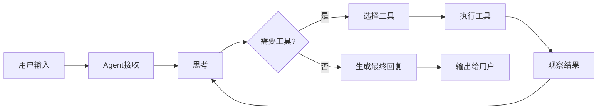

# LLM Agent 开发实践（二）：LangChain 实战

在上一篇文章中，我们介绍了LLM Agent的基本概念。今天，我们将使用LangChain框架来构建一个实际的Agent应用。

## LangChain 简介

LangChain是一个强大的框架，用于开发由语言模型驱动的应用程序。它提供了以下核心功能：

1. **Models**: 与各种语言模型的统一接口
2. **Prompts**: 提示词管理和优化
3. **Chains**: 多个组件的组合
4. **Agents**: 使用LLM做出决策并执行操作
5. **Memory**: 在多次调用之间保持状态

## 环境准备

首先安装必要的依赖：

```bash
pip install langchain langchain-openai langchain-community
```

## 构建第一个Agent

让我们从简单开始，构建一个可以搜索信息的Agent：

```python
from langchain.agents import create_openai_functions_agent, AgentExecutor
from langchain.tools import Tool
from langchain_openai import ChatOpenAI
from langchain import hub

# 初始化模型
llm = ChatOpenAI(model="gpt-4", temperature=0)

# 定义工具
def search_tool(query: str) -> str:
    """搜索工具的示例实现"""
    # 这里可以接入真实的搜索API
    return f"搜索结果：{query}"

tools = [
    Tool(
        name="Search",
        func=search_tool,
        description="用于搜索互联网上的信息"
    )
]

# 获取prompt模板
prompt = hub.pull("hwchase17/openai-functions-agent")

# 创建agent
agent = create_openai_functions_agent(llm, tools, prompt)

# 创建执行器
agent_executor = AgentExecutor(agent=agent, tools=tools, verbose=True)

# 运行agent
result = agent_executor.invoke({"input": "搜索最新的AI发展趋势"})
print(result)
```

## Agent 工作流程

Agent执行任务的基本流程：



## 实践案例：文档分析Agent

让我们构建一个更复杂的Agent，用于分析和总结文档：

```python
from langchain.text_splitter import RecursiveCharacterTextSplitter
from langchain_community.vectorstores import FAISS
from langchain_openai import OpenAIEmbeddings
from langchain.chains import RetrievalQA

# 文档加载和分割
text_splitter = RecursiveCharacterTextSplitter(
    chunk_size=1000,
    chunk_overlap=200
)

# 创建向量存储
vectorstore = FAISS.from_texts(
    texts=texts,
    embedding=OpenAIEmbeddings()
)

# 创建检索链
qa_chain = RetrievalQA.from_chain_type(
    llm=llm,
    chain_type="stuff",
    retriever=vectorstore.as_retriever()
)

# 查询文档
result = qa_chain.invoke({"query": "文档的主要内容是什么？"})
```

## 错误处理与调试

在开发Agent时，错误处理至关重要：

```python
try:
    result = agent_executor.invoke({
        "input": user_query,
        "max_iterations": 5  # 限制最大迭代次数
    })
except Exception as e:
    print(f"Agent执行失败: {str(e)}")
    # 实现回退逻辑
    fallback_result = simple_llm_chain.invoke({"input": user_query})
```

## 最佳实践

1. **清晰的工具定义**：为每个工具提供准确的描述
2. **适当的限制**：设置最大迭代次数和超时
3. **日志记录**：启用verbose模式以便调试
4. **渐进式测试**：从简单场景开始，逐步增加复杂度

## 常见问题

### Q: Agent无限循环怎么办？
A: 设置`max_iterations`参数限制迭代次数

### Q: 如何优化成本？
A: 使用更小的模型进行推理，只在必要时使用大模型

### Q: 工具调用失败如何处理？
A: 在工具函数中添加异常处理，返回友好的错误信息

## 总结

本文介绍了使用LangChain构建LLM Agent的基础知识。通过实际案例，我们了解了Agent的工作流程和开发技巧。

## 下一篇预告

在下一篇文章中，我们将探讨Agent的高级技巧与最佳实践，包括：
- 多Agent协作
- 性能优化策略
- 生产环境部署
- 安全性考虑

---

**系列文章目录**：
- [第一篇：入门与概述]({{ site.baseurl }}/blog/2025/12/20/llm-agent-series-1/)
- [第二篇：LangChain 实战]({{ site.baseurl }}/blog/2025/12/21/llm-agent-series-2/)
- 第三篇：高级技巧与最佳实践（待更新）
