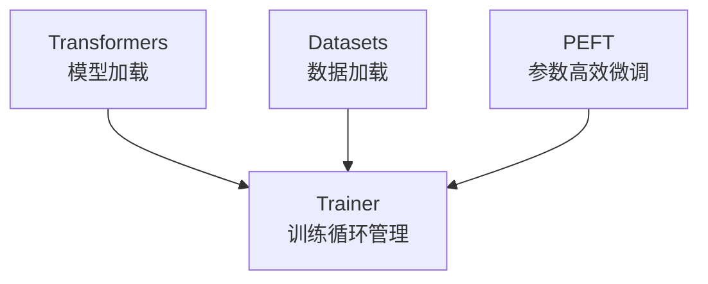

# 第一章：使用 Transformers Trainer 进行模型微调

> 配套代码：`trainer.py`
> 位于该Page项目的根目录，code文件夹

## 前言：为什么需要微调？

欢迎来到大语言模型（LLM）微调教程系列！

想象一下，你有一个非常聪明的助手（预训练的大语言模型），它读过互联网上的海量文本，知识渊博。但是：

- 它可能不知道你公司的内部规定
- 它可能不了解你特定领域的专业知识
- 它可能不会按照你期望的格式回答问题

**微调（Fine-tuning）** 就是教会这个聪明助手按照你的需求工作的过程。

## 本章学习目标

完成本章后，你将理解：

1. **Hugging Face 生态系统** 的基本组成
2. **监督微调（SFT）** 的核心概念
3. **Loss Masking** 为什么是 SFT 的关键
4. **量化** 和 **PEFT/LoRA** 如何让普通显卡也能微调大模型
5. **DataCollator** 的作用和选择

## 1. Hugging Face 生态系统概览

### 1.1 核心组件

**Hugging Face 生态系统架构**



| 组件 | 作用 | 本教程使用 |
|------|------|-----------|
| `transformers` | 加载和使用预训练模型 | ✓ |
| `datasets` | 加载和处理数据集 | ✓ |
| `peft` | 参数高效微调（LoRA等） | ✓ |
| `bitsandbytes` | 模型量化（4-bit/8-bit） | ✓ |
| `trl` | 强化学习和高级训练 | 下一章 |

### 1.2 什么是 Trainer？

`Trainer` 是 Hugging Face 提供的训练管理器，它帮你处理：

- 训练循环（前向传播、反向传播、参数更新）
- 评估和验证
- 模型保存和加载
- 日志记录
- 分布式训练

**简单来说**：你只需要准备好数据和配置，`Trainer` 帮你完成剩下的工作。

## 2. 监督微调（SFT）的核心概念

### 2.1 什么是 SFT？

**监督微调（Supervised Fine-Tuning, SFT）** 是用带标签的数据训练模型的过程。

在对话任务中，我们的数据通常是这样的：

**对话示例：**
- **用户**：请帮我总结这段对话的内容...
- **助手**：这段对话主要讨论了...

### 2.2 Loss Masking：SFT 的核心

⚠️ **这是本章最重要的概念！**

在训练时，模型需要预测下一个 token。但问题是：

- 模型应该学习**生成回答**，而不是学习**生成问题**
- 如果对整个序列计算 Loss，模型会试图"背诵"用户的问题

**解决方案：Loss Masking**

| 输入序列 | [用户问题] | [助手回答] |
|----------|------------|------------|
| 标签     | [-100]     | [实际token] |
| Loss 计算 | ❌ 不计算 | ✅ 计算     |

- `labels = -100` 表示这个位置**不计算 Loss**（PyTorch 的默认忽略值）
- 只有助手回答的部分会被用于训练

### 2.3 代码中的 Loss Masking

在 `trainer.py` 的 `process_func()` 函数中：

```python
# 1. 初始化所有 labels 为 -100（全部忽略）
labels = [-100] * len(input_ids)

# 2. 计算 prompt 长度
prompt_len = len(prompt_ids)

# 3. 只有 prompt 之后的部分设置为实际的 token ID
labels[prompt_len:] = input_ids[prompt_len:]
```

**效果**：
- 用户问题部分：`labels = [-100, -100, -100, ...]` → 不计算 Loss
- 助手回答部分：`labels = [token1, token2, token3, ...]` → 计算 Loss

## 3. 让普通显卡运行大模型：量化与 LoRA

### 3.1 量化（Quantization）

**问题**：一个 7B 参数的模型，用 FP32 存储需要 28GB 显存！

**解决方案**：将参数从高精度压缩到低精度

| 精度 | 每参数位数 | 7B模型大小 | 速度 |
|------|-----------|-----------|------|
| FP32 | 32 bit | 28 GB | 基准 |
| FP16 | 16 bit | 14 GB | 更快 |
| INT8 | 8 bit | 7 GB | 更快 |
| INT4 | 4 bit | 3.5 GB | 最快 |

在代码中使用 4-bit 量化：

```python
from transformers import BitsAndBytesConfig

quant_config = BitsAndBytesConfig(
    load_in_4bit=True,              # 使用 4-bit 量化
    bnb_4bit_quant_type="nf4",      # NF4 量化类型（性能更好）
    bnb_4bit_compute_dtype=torch.float16,  # 计算时用 FP16
)

model = AutoModelForCausalLM.from_pretrained(
    "Qwen/Qwen3-8B",
    quantization_config=quant_config,
    device_map="auto"
)
```

### 3.2 为什么量化后全参数训练仍需大量显存？

⚠️ **这是最容易被误解的概念！**

很多人认为：**"模型已经量化成 4-bit 了，训练时应该不需要很多显存才对"**

但实际上，量化只减少了模型权重的**存储空间**，而训练时需要存储的**远不止权重**！

#### 显存占用详解

以 **8B 参数模型**的全参数训练为例：

| 组成部分 | 大小 | 说明 |
|---------|------|------|
| **1. 模型权重（量化后）** | 4 GB | 8B × 0.5字节(INT4) = 4 GB |
| **2. 梯度** | 16 GB | 8B × 2字节(FP16) = 16 GB |
| **3. 优化器状态** | 64 GB | 8B × 4字节(FP32) × 2 = 64 GB |
| **4. 参数副本** | 16 GB | 8B × 2字节(FP16) = 16 GB |
| **总计** | **100 GB** | 远超普通消费级显卡！ |

#### 为什么需要这么多？

1. **梯度不能量化！**
   - 梯度用于更新参数，必须保持 FP16/FP32 精度
   - 如果梯度也是 4-bit，参数更新会严重失真，模型无法收敛

2. **优化器状态不能量化！**
   - AdamW 优化器需要存储一阶动量（m）和二阶动量（v）
   - 这些动量必须保持 FP32 精度，否则优化效果会大幅下降

3. **参数副本需要高精度！**
   - 更新参数时需要在 FP16/FP32 精度下计算
   - 不能直接在 4-bit 权重上进行数值运算

#### 结论

> **量化只是让模型"加载"更容易，但"训练"仍然需要大量显存！**
>
> 想要真正降低训练显存，必须减少可训练参数的数量 → 这就是 LoRA 的作用

### 3.3 LoRA（Low-Rank Adaptation）

**问题**：即使量化后，微调所有参数仍然需要大量显存（如上所述，约 100 GB）

**解决方案**：只训练一小部分参数

#### LoRA 的显存优势

同样的 8B 模型，使用 LoRA 训练时：

| 组成部分 | 全参数训练 | LoRA 训练 |
|---------|-----------|-----------|
| 量化权重（冻结） | 4 GB | 4 GB |
| 可训练参数 | 16 GB | 0.16 GB (1%) |
| 梯度 | 16 GB | 0.16 GB (1%) |
| 优化器状态 | 64 GB | 0.64 GB (1%) |
| **总计** | **100 GB** | **~5 GB** + 激活值 |

**结论**：LoRA 将显存需求从 100 GB 降到约 10-15 GB（含激活值），普通显卡也能训练！

**LoRA 的工作原理**：

```
原始模型权重 W（冻结，不训练）
    维度：d × d（例如 4096 × 4096）

LoRA 适配器（可训练）：
    A：d × r（例如 4096 × 64）
    B：r × d（例如 64 × 4096）

最终输出 = W·x + α·(B·A)·x
              ↑        ↑
           原始输出  LoRA调整
```

**关键点**：
- 原始权重 W 被冻结，不参与训练
- 只训练两个小矩阵 A 和 B（r << d，通常 r = 8, 16, 32, 64）
- B·A 的结果是一个低秩矩阵，作为原始权重的"调整量"
- α 是缩放因子，控制 LoRA 的影响程度

**参数量对比**：
- 原始：4096 × 4096 = 16,777,216 参数
- LoRA：4096 × 64 + 64 × 4096 = 524,288 参数（**减少 97%！**）

代码配置：

```python
from peft import LoraConfig, get_peft_model

lora_config = LoraConfig(
    r=64,           # LoRA 秩（越大参数越多）
    lora_alpha=16,  # 缩放因子
    target_modules=["q_proj", "k_proj", "v_proj", "o_proj"],  # 应用到哪些层
    lora_dropout=0.01,
    task_type="CAUSAL_LM"
)

model = get_peft_model(model, lora_config)
model.print_trainable_parameters()
# 输出：trainable params: 83,886,080 || all params: 8,108,634,112 || trainable%: 1.0346%
```

## 4. DataCollator：数据整理器

### 4.1 什么是 DataCollator？

`DataCollator` 负责将多个样本组合成一个 batch，只有填充为等长度的结构，`torch`中的矩阵运算方法才能够加速训练，每个 batch 使用样本的一维tensor组成2维的tensor，再进行后面的正向传播，损失计算和反向传播：

```
样本1: [1, 2, 3, 4]        →  padding  →  [1, 2, 3, 4, 0, 0]
样本2: [5, 6, 7, 8, 9, 10] →  不变    →  [5, 6, 7, 8, 9, 10]
                              ↓
                         组成 batch
```

### 4.2 两种关键的 DataCollator

| DataCollator | 适用场景 | labels 处理 |
|--------------|----------|-------------|
| `DataCollatorForLanguageModeling` | 预训练 | 自动复制 `input_ids` 作为 `labels` |
| `DataCollatorForSeq2Seq` | **SFT** | 保留预处理好的 `labels`，padding 用 -100 |

⚠️ **重要**：SFT 必须使用 `DataCollatorForSeq2Seq`，因为它尊重你预处理好的 `labels`（包含 Loss Masking），`DataCollatorForLanguageModeling` 则不尊重。

## 5. 完整训练流程

### 5.1 流程图

**SFT 训练完整流程**

1. **加载数据集**
   ```python
   dataset = load_dataset("数据集名称")
   ```

2. **加载模型 + 量化**
   ```python
   model = AutoModelForCausalLM.from_pretrained(
       "Qwen/Qwen3-8B",
       quantization_config=quant_config,
       device_map="auto"
   )
   ```

3. **数据预处理（Loss Masking）**
   ```python
   train_dataset = preprocess_dataset(tokenizer, max_length, seed, dataset['train'])
   ```

4. **添加 LoRA 适配器**
   ```python
   model = get_peft_model(model, lora_config)
   ```

5. **配置 Trainer**
   ```python
   trainer = Trainer(model, dataset, data_collator, args)
   ```

6. **开始训练**
   ```python
   trainer.train()
   ```

7. **保存模型**
   ```python
   trainer.save_model()
   ```

### 5.2 关键代码摘要

```python
# 1. 加载数据集
dataset = load_dataset("neil-code/dialogsum-test")

# 2. 加载量化模型
model = AutoModelForCausalLM.from_pretrained(
    "Qwen/Qwen3-8B",
    quantization_config=quant_config,
    device_map="auto"
)

# 3. 数据预处理（应用 Loss Masking，在代码文件中对此有着更加详细的解释）
train_dataset = preprocess_dataset(tokenizer, max_length, seed, dataset['train'])

# 4. 添加 LoRA
model = prepare_model_for_kbit_training(model)
model = get_peft_model(model, lora_config)

# 5. 配置训练器。在代码中包含了不同的DataCollator方便进一步对这里理解，如果只需要使用，则可以直接使用推荐配置
trainer = Trainer(
    model=model,
    train_dataset=train_dataset,
    data_collator=DataCollatorForSeq2Seq(tokenizer),
    args=training_args
)

# 6. 训练
trainer.train()
```

## 6. 运行代码

### 6.1 环境准备

```bash
pip install transformers datasets peft bitsandbytes accelerate
```

就在代码文件夹中，也有一个 `.toml` 文件，如果了解 `uv` 的使用可以根据其构建所需环境，请注意 `torch` 对 cuda 版本依赖的问题。
### 6.2 运行训练

```bash
python trainer.py
```

### 6.3 修改配置

在 `trainer.py` 底部找到配置参数：

```python
COLLATOR_TYPE = "visual_check"  # 推荐用于学习，会打印详细信息
MODEL_PATH = "Qwen/Qwen3-8B"
MAX_STEPS = 40  # 训练步数
```

## 7. 本章小结

| 概念 | 说明 |
|------|------|
| **SFT** | 用标注数据微调模型，而不是预训练中对每一个后续token计算损失 |
| **Loss Masking** | 只对助手回答计算 Loss，这是SFT和预训练的核心区别 |
| **量化** | 压缩模型参数存储空间大小，让普通显卡能放下 |
| **LoRA** | 只训练少量参数，进一步大幅减少显存需求 |
| **DataCollator** | 组合样本成 batch，理解DataCollator是本节除了Loss以外的另一核心 |

## 8. 动手练习

1. 运行 `trainer.py`，观察 `VisualCheckDataCollator` 打印的信息
2. 尝试将 `COLLATOR_TYPE` 改为 `"seq2seq"`，对比输出
3. 修改 `MAX_STEPS`，观察训练时间和效果的变化

## 下一章预告

在本章中，我们手动实现了 Loss Masking，这需要：
- 计算 prompt 长度
- 手动设置 labels
- 选择正确的 DataCollator

**问题**：能不能让这些全部自动化？

**答案**：可以！

在下一章，我们将学习 **TRL 库的 SFTTrainer**，它可以：
- ✓ 自动处理 Loss Masking
- ✓ 自动选择 DataCollator
- ✓ 支持 Flash Attention 加速
- ✓ 代码更简洁

请继续阅读 [第二章：使用 SFTTrainer 简化训练流程](02_sfttrainer_tutorial.md)

---

> **附录：常见问题**
>
> **Q: 为什么我的模型训练后说话停不下来？**  
> A: 可能是数据预处理时没有正确添加 EOS token。使用 `apply_chat_template` 会自动处理。
>
> **Q: 显存不够怎么办？**  
> A: 1) 减小 batch_size  2) 使用 gradient_accumulation  3) 减小 LoRA 的 r 值

