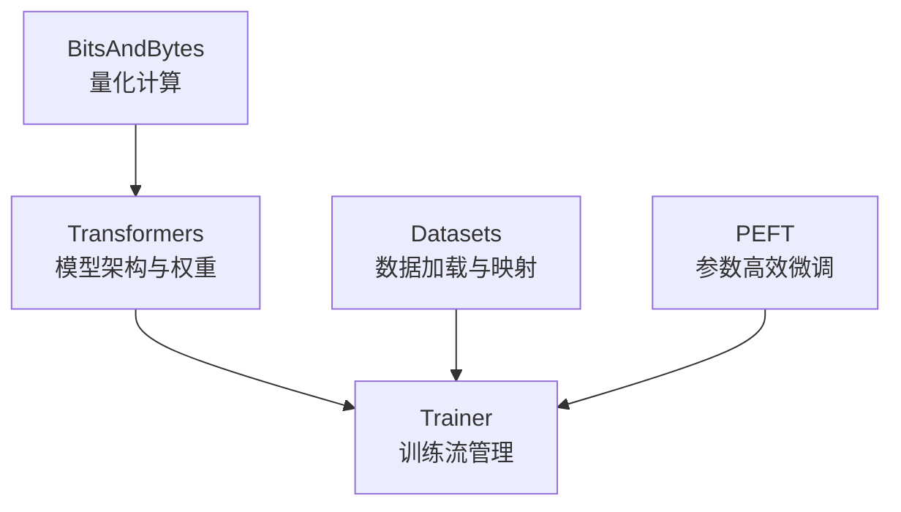

# 第一章：使用 Transformers Trainer 进行模型微调

> 配套代码：`trainer.py` 

## 前言：微调的工程意义

欢迎来到 "Re0 : 从0开始的LLM Finetuning" 系列。

在实际的工程落地中，预训练模型（Base Model）往往面临“通而不专”的困境。虽然它们在海量文本上习得了通用的语言能力，但在面对特定领域的业务需求时，常表现出以下短板：

*   **领域知识匮乏**：无法理解企业内部的特定术语、流程或私有数据。
*   **指令遵循不稳定**：难以严格按照业务系统要求的格式（如特定的 JSON Schema）输出。
*   **角色定位模糊**：容易在“续写文本”和“回答问题”两种模式间摇摆。

**微调（Fine-tuning）** 的本质，就是通过特定分布的数据集，将预训练模型从一个“通用续写者”重塑为“特定领域的专家”。本章将跳过繁琐的理论推导，直接从代码实现的角度，剖析 Hugging Face 生态下微调大模型的核心机制。

## 1. Hugging Face 生态系统架构

在开始写代码之前，我们需要理清 Hugging Face 工具链中各个库的职责边界。



*   **`transformers`**：核心库。提供标准化的模型架构（如 Llama, Qwen）和预训练权重加载接口。
*   **`datasets`**：数据管道。通过内存映射（Memory Mapping）技术，高效处理大规模数据集的加载、清洗和 Tokenization。
*   **`peft`** (Parameter-Efficient Fine-Tuning)：提供 LoRA、Prefix Tuning 等算法实现，解决全参数微调显存占用过高的问题。
*   **`bitsandbytes`**：底层优化库。为 PyTorch 提供 8-bit 和 4-bit 的矩阵乘法支持，是低显存微调的基石。

其中，**`Trainer`** 是一个高度封装的训练管理器。它将训练循环（Training Loop）、梯度累积、混合精度训练（AMP）、分布式训练（DDP/FSDP）以及日志记录等复杂的工程细节抽象化，开发者仅需关注数据和配置本身。

## 2. 监督微调（SFT）与核心机制：Loss Masking

### 2.1 什么是 SFT？

**监督微调（Supervised Fine-Tuning, SFT）** 是将预训练模型适配到指令跟随任务的关键步骤。与预训练阶段的无监督学习不同，SFT 使用的数据是成对的 `(Instruction, Response)`。

一个典型的训练样本如下：

*   **输入（User）**：`请解释量子纠缠的基本概念。`
*   **目标（Assistant）**：`量子纠缠是量子力学中的一种现象...`

### 2.2 Loss Masking：SFT 的技术核心

在 Causal Language Model（因果语言模型）的训练中，模型会对序列中的每一个 Token 计算预测损失。但在 SFT 场景下，这种默认行为是不合理的。

**核心问题**：我们希望模型学习“如何回答问题”，而不是“如何复述问题”。

如果在计算 Loss 时包含了 User Prompt 部分，模型就会尝试去拟合 Prompt 的分布。这不仅浪费了梯度更新的配额，还可能导致模型产生“复读机”倾向。

**解决方案：Loss Masking（损失掩码）**

我们需要在构建训练数据时，通过设置特殊的 `labels` 来屏蔽掉 Prompt 部分的损失计算。PyTorch 的 `CrossEntropyLoss` 默认忽略索引为 `-100` 的目标值。

| 序列片段 | [User Prompt] | [Assistant Response] |
| :--- | :--- | :--- |
| **Input IDs** | `[101, 299, ...]` | `[305, 882, ...]` |
| **Labels** | **`[-100, -100, ...]`** | `[305, 882, ...]` |
| **梯度计算** | ❌ 忽略 | ✅ 计算 |

### 2.3 代码实现详解

在 `trainer.py` 的数据预处理函数 `process_func` 中，我们手动实现了这一逻辑。这比直接调用现成工具更能让你理解其本质：

```python
def process_func(example):
    # ... Tokenizer 编码过程 ...
    
    # 1. 将 input_ids 复制一份作为 labels
    input_ids = instruction + response
    labels = input_ids.copy()
    
    # 2. 计算 Prompt (Instruction) 的长度
    instruction_len = len(instruction)
    
    # 3. 关键步骤：将 Prompt 部分的 labels 设为 -100
    # 这样 Trainer 在计算 Loss 时会自动忽略这部分
    labels[:instruction_len] = [-100] * instruction_len
    
    return {"input_ids": input_ids, "labels": labels}
```

这段代码确保了模型只能看到 User 的输入，但只对 Assistant 的输出负责。

## 3. 显存优化的基石：量化与 LoRA

微调 LLM 最大的门槛在于显存。直接全参数微调一个 8B 的模型，可能需要 80GB 以上的显存，这显然超出了大多数实验环境的承载能力。我们通过 **量化** 和 **LoRA** 的组合拳来解决这个问题。

### 3.1 量化（Quantization）：压缩模型体积

量化是指用更低的精度来存储模型权重。

*   **FP16 (16-bit)**：标准微调精度，7B 模型约需 14GB 显存。
*   **INT4 (4-bit)**：极端压缩精度，7B 模型仅需约 3.5GB 显存。

我们使用 `BitsAndBytesConfig` 来配置 4-bit 量化加载：

```python
quant_config = BitsAndBytesConfig(
    load_in_4bit=True,
    bnb_4bit_quant_type="nf4",      # NF4: 专为正态分布权重设计的量化数据类型，精度更高
    bnb_4bit_compute_dtype=torch.float16  # 计算时临时反量化为 FP16 以保证数值稳定性
)
```

### 3.2 为什么量化了显存还是不够？

这是一个常见的误区：**模型权重变小了，并不代表训练显存就小了。**

在全参数微调中，显存的大头并非来自静态的**模型权重**，而是来自动态的**训练状态**：

1.  **梯度 (Gradients)**：每个参数都需要存储对应的梯度（通常为 FP16）。
2.  **优化器状态 (Optimizer States)**：AdamW 优化器需要为每个参数维护一阶动量和二阶动量（通常为 FP32）。这是真正的“显存杀手”。

以 8B 模型为例，即使权重压到 4GB，全参数微调时的优化器状态依然会占用约 64GB 显存。

### 3.3 LoRA：低秩自适应

**LoRA (Low-Rank Adaptation)** 的出现正是为了解决上述问题。它的核心思想是：**冻结巨大的预训练权重，只训练极小的旁路矩阵。**

假设预训练权重为 \( W \)，LoRA 在其旁边并联了两个低秩矩阵 \( A \) 和 \( B \)：

$$ h = Wx + BAx $$

*   **冻结**：\( W \) (INT4 精度，约 4GB，不更新)
*   **训练**：\( A \) 和 \( B \) (FP16/FP32 精度，参数量仅为 \( W \) 的 1% 左右)

**显存收益分析**：

由于 \( A \) 和 \( B \) 非常小，它们的梯度和优化器状态占用极低。使用 LoRA 后，8B 模型的训练显存需求可以从 ~100GB 骤降至 ~10GB，使得在消费级显卡（如 RTX 3090/4090）上微调成为可能。

```python
lora_config = LoraConfig(
    r=64,           # LoRA 的秩，决定了可训练参数量的大小
    lora_alpha=16,  # 缩放系数，类似学习率的放大倍数
    target_modules=["q_proj", "k_proj", "v_proj", "o_proj"], # 指定应用 LoRA 的层
    task_type="CAUSAL_LM"
)
```

## 4. DataCollator：数据流的最后拼图

在将数据送入 GPU 前，我们需要处理 Batch 内的数据对齐问题。由于每条对话的长度不一，必须进行 Padding（填充）。

这里有一个容易踩的坑：**DataCollator 的选择**。

*   ❌ **`DataCollatorForLanguageModeling`**：这是为预训练设计的。它会机械地复制 `input_ids` 作为 `labels`，**这会覆盖掉我们之前辛苦做的 Loss Masking（即那些 -100）**，导致模型开始学习 User Prompt。
*   ✅ **`DataCollatorForSeq2Seq`**：这是 SFT 的正确选择。它能够识别并保留数据集中已有的 `labels` 字段，仅对长度不足的部分进行 Padding（填充值为 -100）。

## 5. 完整训练流程复盘

结合 `trainer.py`，一个标准的 SFT 流程如下：

1.  **加载数据**：使用 `datasets` 库加载 JSON 或 Parquet 格式的数据。
2.  **模型初始化**：加载基座模型，开启 4-bit 量化以节省显存。
3.  **数据预处理**：应用 Tokenizer，构造 `input_ids`，并手动执行 **Loss Masking**。
4.  **模型适配**：调用 `get_peft_model`，将 LoRA 适配器挂载到冻结的基座模型上。
5.  **训练执行**：实例化 `Trainer`，传入模型、数据和 `DataCollatorForSeq2Seq`，开始训练。

### 实验与验证建议

代码中预留了 `COLLATOR_TYPE` 开关。建议在首次运行时设置为 `"visual_check"`：

```python
COLLATOR_TYPE = "visual_check"  # 设为 visual_check 以打印 batch 数据
```

这将直接打印出 Batch 中的 `input_ids` 和 `labels`。你可以直观地检查：
*   User Prompt 对应的 labels 是否确实被设为了 `-100`？
*   Padding 部分是否正确处理？

这是 Debug 模型训练效果最直接有效的手段。

## 6. 总结

本章我们深入了 LLM 微调的“机房”内部，手动装配了 SFT 的每一个零件：

*   **SFT** 不仅仅是训练，更是对模型输出分布的定向引导。
*   **Loss Masking** 保证了模型专注于“生成回答”而非“记忆问题”。
*   **量化 + LoRA** 是在有限硬件资源下撬动大模型的杠杆。

在手动实现了这些步骤后，你可能会觉得数据处理部分稍显繁琐。在下一章，我们将引入 **TRL (Transformer Reinforcement Learning)** 库中的 `SFTTrainer`。它将把本章中手动处理 Loss Masking 和 Data Collator 的逻辑封装为更简洁的接口，并带来 Flash Attention 等进阶加速特性。

---

## 参考资料

- [Hugging Face Transformers: Trainer Class](https://huggingface.co/docs/transformers/main/en/main_classes/trainer)
- [LoRA: Low-Rank Adaptation of Large Language Models (Hu et al., 2021)](https://arxiv.org/abs/2106.09685)
- [QLoRA: Efficient Finetuning of Quantized LLMs (Dettmers et al., 2023)](https://arxiv.org/abs/2305.14314)
