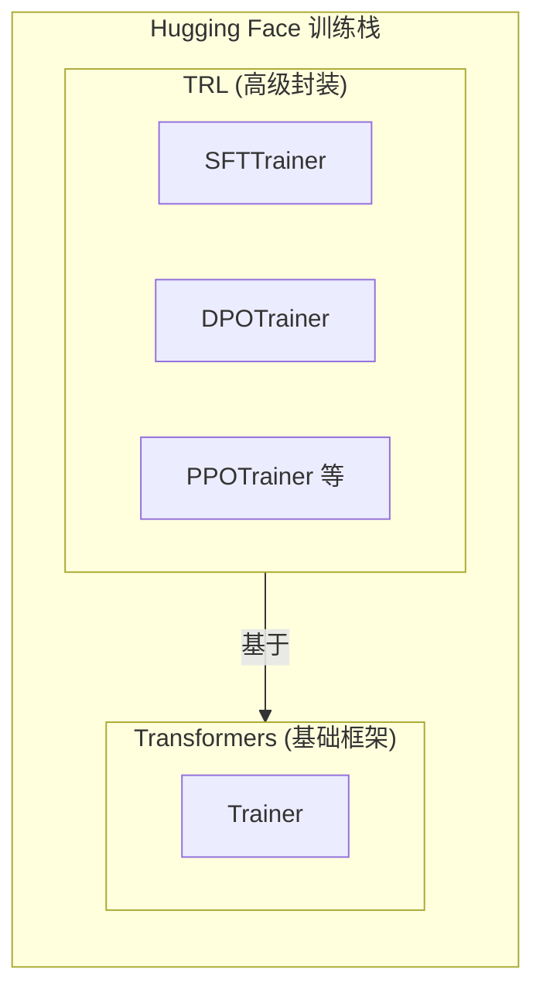
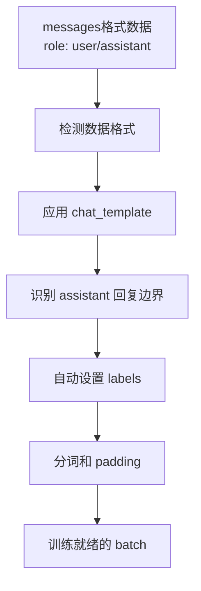

# 第二章：使用 SFTTrainer 简化训练流程

> 配套代码：`sfttrainer.py`

## 承上启下

在上一章中，我们学习了如何使用原生 `Trainer` 进行 SFT 训练。虽然功能完整，但需要：

- 手动计算 prompt 长度
- 手动设置 labels（实现 Loss Masking）
- 手动选择和配置 DataCollator
- 代码量较大，容易出错

**本章介绍 TRL 库的 SFTTrainer**——一个专门为 SFT 以及 RL 设计的训练器，让这些复杂操作全部自动化！

## 本章学习目标

完成本章后，你将理解：

1. **TRL 库** 是什么以及它的优势
2. **SFTTrainer** 如何自动化 Loss Masking
3. **SFT的四种数据格式** 的区别和适用场景
4. **Flash Attention** 如何加速训练
5. **chat_template** 的作用和自定义方法

## 1. TRL 库简介

### 1.1 什么是 TRL？

**TRL（Transformer Reinforcement Learning）** 是 Hugging Face 提供的高级训练库：



### 1.2 SFTTrainer vs Trainer 对比

| 功能 | 原生 Trainer | SFTTrainer |
|------|-------------|------------|
| Loss Masking | 手动实现 | **自动** |
| chat_template 应用 | 手动调用 | **自动** |
| DataCollator 选择 | 手动配置 | **自动** |
| PEFT 集成 | 手动调用 get_peft_model | **自动** |
| 数据格式支持 | 需要预处理 | **多种格式直接支持** |
| 代码量 | 100+ 行预处理 | 10-20 行 |

## 2. SFTTrainer 支持的四种数据格式

这是理解 SFTTrainer 的关键！

### 2.1 格式对比

**SFTTrainer 支持的四种数据格式**

#### 格式1: Standard Language Modeling
```json
{"text": "The sky is blue."}
```
- **适用场景**：预训练、续写任务
- **特点**：对所有 token 计算 Loss（无 Loss Masking）

#### 格式2: Conversational Language Modeling ⭐ **推荐**
```json
{"messages": [
    {"role": "user", "content": "问题"},
    {"role": "assistant", "content": "回答"}
]}
```
- **适用场景**：对话任务、聊天模型训练
- **特点**：自动应用 chat_template，自动 Loss Masking

#### 格式3: Standard Prompt-Completion
```json
{"prompt": "问题", "completion": "回答"}
```
- **适用场景**：简单问答任务
- **特点**：只对 completion 部分计算 Loss

#### 格式4: Conversational Prompt-Completion
```json
{"prompt": [{"role": "user", ...}],
 "completion": [{"role": "assistant", ...}]}
```
- **特点**：使用对话形式完成的Prompt-Completion

### 2.2 推荐格式：messages（格式2）

对于大多数对话任务，**格式2（messages）** 是最推荐的：

```python
def process_func_simple(example, tokenizer, max_length):
    """简化的预处理函数"""
    messages = [
        {"role": "user", "content": f"请总结: {example['dialogue']}"},
        {"role": "assistant", "content": example['summary']}
    ]
    return {"messages": messages}  # 就这么简单！
```

如果需要单纯的Prompt-Completion任务，格式3也可以接受的，除非你明确知道自己的需求，格式1以及4使用的相对较少，我们在代码中会主要介绍Conversational Language Modeling 也就是 messages ，同时补充一部分Prompt-Completion。

**对比上一章的 process_func**：
- 上一章：30+ 行代码，手动计算 prompt_len
- 本章：5 行代码，SFTTrainer 自动处理一切

## 3. SFTTrainer 的内部工作原理

### 3.1 自动化处理流程

当你使用 messages 格式时，SFTTrainer 内部会：

**处理流程**



**详细步骤**

1. **检测数据格式** → 发现是 messages 格式
2. **应用 chat_template** → 生成标准化的对话格式
3. **识别 assistant 回复边界** → 通过特殊标记自动识别
4. **自动设置 labels** → prompt 部分设为 -100，assistant 部分设为实际 token ID
5. **分词和 padding** → 处理成模型可用的格式

### 3.2 关键配置参数

```python
from trl import SFTConfig

training_args = SFTConfig(
    output_dir="./output",
    
    # 核心参数：自动化 Loss Masking
    assistant_only_loss=True,  # [重点] 只对 assistant 回复计算 Loss
    
    # 可选：自定义 chat_template
    chat_template_path="path/to/template.jinja",  
    # 并不是所有模型的chat_template 都原生支持assistant_only_loss=True，
    # 这就涉及了自定义chat_template，关于具体的区别，我们会在后面再聊到
    
    # 其他常规参数
    max_length=2048,
    per_device_train_batch_size=4,
    learning_rate=2e-4,
    ...
)
```

## 4. assistant_only_loss vs completion_only_loss

这是两个容易混淆的参数：

| 参数 | 适用格式 | 作用 |
|------|---------|------|
| `assistant_only_loss=True` | messages (格式2/4) | 只对 assistant 角色的内容计算 Loss |
| `completion_only_loss=True` | prompt-completion (格式3/4) | 只对 completion 部分计算 Loss |

**注意**：`completion_only_loss` 默认就是 `True`，通常不需要显式设置，并且无需额外设定chat_template就可以直接支持市面上的主流语言模型。相反的，`assistant_only_loss=True`默认为`False` 并且需要专门的chat_template支持。

### 4.1 使用 messages 格式（推荐）

```python
# 需要设置 assistant_only_loss=True
# 可能需要设置 chat_template_path（如果模型默认不支持）
training_args = SFTConfig(
    assistant_only_loss=True,
    chat_template_path="path/to/template.jinja",  # Qwen3 需要
    ...
)
```

### 4.2 使用 conversational_prompt_completion 格式

```python
# 不需要设置 assistant_only_loss
# 不需要设置 chat_template_path
# 使用默认配置即可（completion_only_loss=True 是默认值）
training_args = SFTConfig(
    # 默认配置就能工作
    ...
)
```

## 5. chat_template 深入理解

### 5.1 什么是 chat_template？

chat_template 一般是一个 Jinja2 模板，定义了如何将对话格式化为模型能理解的文本：

```
输入 messages:
[
    {"role": "user", "content": "你好"},
    {"role": "assistant", "content": "你好！有什么可以帮你的吗？"}
]

        ↓ 应用 chat_template ↓

输出文本:
<|im_start|>user
你好<|im_end|>
<|im_start|>assistant
你好！有什么可以帮你的吗？<|im_end|>
```

### 5.2 为什么需要自定义 chat_template？

**问题**：并非所有模型都支持 `return_assistant_tokens_mask` 功能

事实上出于稳定性的考虑，`return_assistant_tokens_mask` 功能使用的新Jinja2模板可能会导致和其他框架的不兼容，因此从未来的角度看，这个适配很可能是不会继续进行的。

这个功能让 SFTTrainer 能够自动识别 assistant 回复的边界。如果模型的默认 template 不支持，需要自定义。

**Qwen3 的情况**：
- 默认 template 不支持 `generation` 关键字
- 需要使用修改后的 template 来启用 `assistant_only_loss`

### 5.3 自定义 template 示例
本质上自定义的template就是在原始template的基础上，使用 generation 和 endgeneration 关键字包裹了助手生成的部分，从而使SFTTrainer能够通过这个关键字进行掩码。

```jinja

{#- 自定义 template 的关键部分 -#}

    
        {{- '<|im_start|>assistant\n' }}
          {# ← 这个标签告诉 SFTTrainer 这是要训练的部分 #}
            {{- message['content'] + '<|im_end|>' }}
        
    


```

## 6. Flash Attention：加速训练

### 6.1 什么是 Flash Attention？

Flash Attention 是一种优化的注意力计算实现：

| 指标 | 标准注意力 | Flash Attention |
|------|-----------|-----------------|
| 速度 | 基准 | **快 2-3 倍** |
| 显存 | 基准 | **节省 50-80%** |
| 长序列支持 | 受限 | **更长序列** |

### 6.2 启用 Flash Attention

```python
# 检查是否可用
try:
    from flash_attn import __version__
    FLASH_ATTENTION_AVAILABLE = True
except ImportError:
    FLASH_ATTENTION_AVAILABLE = False

# 加载模型时启用
model = AutoModelForCausalLM.from_pretrained(
    "Qwen/Qwen3-8B",
    attn_implementation="flash_attention_2",  # ← 启用 Flash Attention
    dtype=torch.bfloat16,
    ...
)
```

### 6.3 安装 Flash Attention

```bash
pip install flash-attn --no-build-isolation
```

**要求**：
- CUDA 支持的 GPU
- Ampere 架构或更新（A100, H100, RTX 30xx/40xx 等）
- flash-attn2 支持到 Ampere 架构，如果拥有更新架构的显卡，根据支持情况使用flash-attn 

## 7. 完整代码对比

### 7.1 上一章（原生 Trainer）

```python
# 需要手动处理很多事情
def process_func(example, tokenizer, max_length):
    messages = [...]
    text = tokenizer.apply_chat_template(messages, tokenize=False)
    tokenized = tokenizer(text, ...)
    
    # 手动计算 prompt 长度
    prompt_text = tokenizer.apply_chat_template(user_only, ...)
    prompt_len = len(tokenizer(prompt_text)["input_ids"])
    
    # 手动设置 labels
    labels = [-100] * len(input_ids)
    labels[prompt_len:] = input_ids[prompt_len:]
    
    return {"input_ids": ..., "labels": labels, ...}

# 手动选择 DataCollator
data_collator = DataCollatorForSeq2Seq(tokenizer)

# 手动应用 LoRA
model = get_peft_model(model, lora_config)

trainer = Trainer(model, data_collator=data_collator, ...)
```

### 7.2 本章（SFTTrainer）

```python
# 简化的预处理
def process_func_simple(example, tokenizer, max_length):
    messages = [
        {"role": "user", "content": ...},
        {"role": "assistant", "content": ...}
    ]
    return {"messages": messages}  # 就这么简单！

# 配置 SFTConfig
training_args = SFTConfig(
    assistant_only_loss=True,  # 自动 Loss Masking
    ...
)

# SFTTrainer 自动处理一切
trainer = SFTTrainer(
    model=model,
    args=training_args,
    peft_config=lora_config,  # 自动应用 LoRA
    train_dataset=train_dataset,
    # 不需要设置 data_collator！
)
```

## 8. 运行代码

### 8.1 选择数据格式

在 `sfttrainer.py` 底部修改：

```python
# 选项1: messages 格式（推荐，需要自定义 chat_template）
DATA_FORMAT = "messages"

# 选项2: conversational_prompt_completion 格式 （因为已经配置好 chat_template）
DATA_FORMAT = "conversational_prompt_completion"
```

### 8.2 运行训练

```bash
python sfttrainer.py
```

## 9. 本章小结

| 概念 | 说明 |
|------|------|
| **SFTTrainer** | TRL 库的专用 SFT 训练器，自动化程度高 |
| **messages 格式** | 推荐的对话数据格式，配合 assistant_only_loss |
| **assistant_only_loss** | 自动化 Loss Masking 的关键参数 |
| **chat_template** | 定义对话格式化方式，在本章可能需要自定义 |
| **Flash Attention** | 加速训练，节省显存 |

## 10. 对比总结

**从 Trainer 到 SFTTrainer：对比总结**

| 特性 | 原生 Trainer | SFTTrainer |
|------|-------------|------------|
| **灵活性** | 高，完全控制 | 专为 SFT 优化 |
| **Loss Masking** | 需要手动实现 | [是] 自动处理 |
| **DataCollator** | 需要手动配置 | [是] 自动配置 |
| **代码复杂度** | 代码量大，容易出错 | 简洁，最佳实践 |

**结论：** 在SFT的生产环境推荐使用 SFTTrainer ，标准的Trainer是为了连续预训练而设计的

## 下一章预告

SFT 让模型学会了按照指令回答问题。但是：

- 模型的回答可能不够"好"
- 用户可能有不同的偏好
- 我们想让模型的回答更符合人类期望

**问题**：如何让模型学习人类偏好？

**答案**：使用偏好对齐技术！

在下一章，我们将学习 **DPO（Direct Preference Optimization）**：

- 使用偏好数据（chosen vs rejected）训练
- 不需要训练奖励模型
- 比传统 RLHF (PPO) 更简单稳定
- 作为通向高级强化学习的桥梁

> **附录：常见问题**
>
> **Q: assistant_only_loss 不生效怎么办？**  
> A: 检查模型的 chat_template 是否支持 generation 标签。Qwen3 需要使用自定义 template。
>
> **Q: Flash Attention 安装失败？**  
> A: 确保 CUDA 版本和 PyTorch 版本兼容。尝试 `pip install flash-attn --no-build-isolation`。
>
> **Q: 两种数据格式该选哪个？**  
> A: 多轮对话选 messages + assistant_only_loss；单轮问答可以选 prompt_completion，从而避免对话模板的问题。

## 参考资料

- [TRL 文档：SFTTrainer](https://huggingface.co/docs/trl/main/en/sft_trainer)
- [Transformers 文档：Chat templates](https://huggingface.co/docs/transformers/main/en/chat_templating)
- [InstructGPT 论文：Training language models to follow instructions with human feedback](https://arxiv.org/abs/2203.02155)
- [FlashAttention 论文：Fast and Memory-Efficient Exact Attention with IO-Awareness](https://arxiv.org/abs/2205.14135)
- [flash-attention](https://github.com/Dao-AILab/flash-attention)
- [TRL](https://github.com/huggingface/trl)
