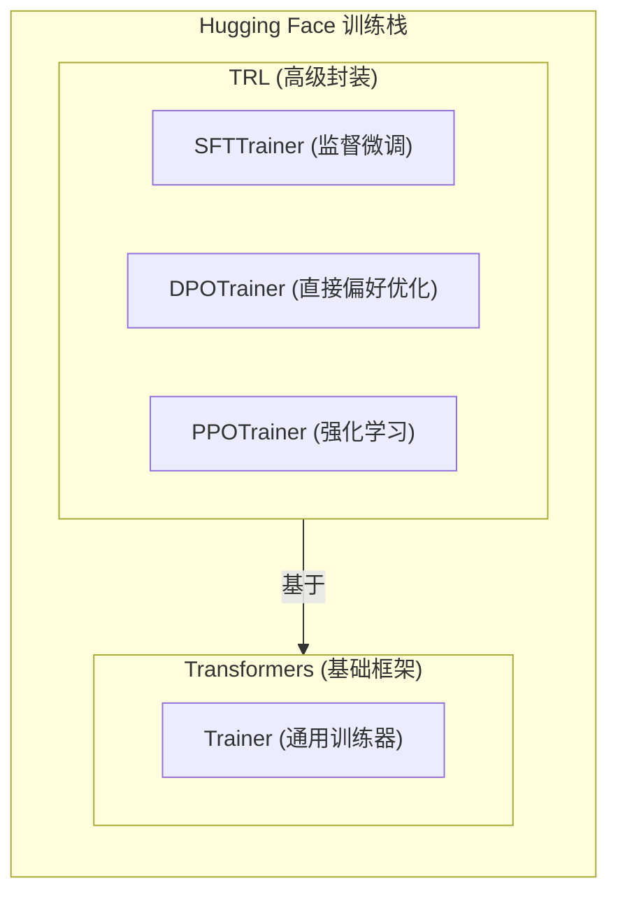

# 第二章：使用 SFTTrainer 简化训练流程

> 配套代码：`sfttrainer.py`

## 前言：工程效率的进阶

在上一章中，我们使用原生的 `Trainer` 实现了 SFT 流程。虽然这让我们理解了微调的底层逻辑，但在实际工程中，这种“手搓代码”的方式存在明显的效率瓶颈：

- **代码冗余**：需要手动实现 `process_func` 来处理 Loss Masking，不仅代码量大，而且容易在索引计算上出错。
- **模板管理复杂**：Chat Template 的应用、截断（Truncation）和填充（Padding）需要小心翼翼地配合，稍有不慎就会导致训练数据异常。
- **组件装配繁琐**：需要手动实例化 Model、Tokenizer、DataCollator 并将它们正确组合。

本章我们将引入 **TRL (Transformer Reinforcement Learning)** 库中的 `SFTTrainer`。作为一个专门为 SFT（及后续强化学习）设计的工具，它封装了上述所有繁琐细节，让我们可以用更少的代码实现更健壮的训练流程。

## 1. TRL 库与 SFTTrainer

### 1.1 TRL 库定位

TRL 是 Hugging Face 生态中位于 `transformers` 之上的高级封装库，专注于全栈式的大模型微调与对齐。



### 1.2 核心优势：自动化

相比于原生 `Trainer`，`SFTTrainer` 的核心价值在于**自动化**：

| 功能特性 | 原生 Trainer 实现方式 | SFTTrainer 实现方式 |
| :--- | :--- | :--- |
| **Loss Masking** | 手动计算索引，构造 labels | ✅ 自动识别并处理 |
| **Chat Template** | 手动调用 `apply_chat_template` | ✅ 自动应用 |
| **DataCollator** | 手动选择并实例化 | ✅ 自动配置最佳实践 |
| **PEFT 集成** | 手动调用 `get_peft_model` | ✅ 传入配置即可 |
| **数据格式** | 仅支持预处理后的 Tensor | ✅ 支持多种原始 JSON 格式 |

## 2. 数据格式标准：Messages 格式

SFTTrainer 支持多种数据格式，其中最推荐的是 **Conversational Format (Messages)**。这种格式与 OpenAI API 及 Hugging Face 的 Chat Template 标准保持一致。

### 2.1 推荐格式 (Messages)

```json
{
    "messages": [
        {"role": "user", "content": "请解释量子纠缠。"},
        {"role": "assistant", "content": "量子纠缠是量子力学中的一种现象..."}
    ]
}
```

*   **适用场景**：所有对话类微调任务。
*   **优势**：SFTTrainer 会自动解析 `role`，应用 Chat Template，并根据 `assistant` 角色自动进行 Loss Masking。

### 2.2 格式对比与选择

虽然 SFTTrainer 还支持纯文本（Text）和 Instruction-Output 格式，但在现代 LLM 开发中，**Messages 格式是绝对的主流**。它不仅支持多轮对话，还能无缝对接后续的推理和部署流程。

在代码中，我们只需将原始数据转换为包含 `messages` 字段的字典即可：

```python
def process_func_simple(example):
    """
    仅需将数据格式化为标准 messages 列表
    无需手动 Tokenize，也无需手动计算 labels
    """
    messages = [
        {"role": "user", "content": example['instruction']},
        {"role": "assistant", "content": example['output']}
    ]
    return {"messages": messages}
```

对比上一章动辄几十行的预处理代码，这里极大地降低了心智负担。

## 3. 核心机制：自动化 Loss Masking

SFTTrainer 如何知道哪些 Token 是 Prompt（不计算 Loss），哪些是 Response（计算 Loss）？

这依赖于两个关键配置的配合：`SFTConfig` 和 `Chat Template`。

### 3.1 关键参数：assistant_only_loss

在 `SFTConfig`（继承自 `TrainingArguments`）中，有一个至关重要的参数：

```python
training_args = SFTConfig(
    # ...其他参数
    dataset_text_field="messages",  # 指定数据字段
    max_seq_length=2048,            # 自动处理截断和 Padding
    assistant_only_loss=True,       # 【关键】仅对 Assistant 回复计算 Loss
)
```

当 `assistant_only_loss=True` 时，SFTTrainer 会在 Tokenization 过程中寻找 Assistant 回复的起止位置，并将其他位置的 `labels` 设为 `-100`。

### 3.2 Chat Template 的适配问题

**这里有一个潜在的坑**：SFTTrainer 需要依据特定的特殊 Token（Special Tokens）来定位 Assistant 的回复。

并非所有模型的默认 Chat Template 都显式标记了生成内容的边界。以 Qwen2.5/Qwen3 为例，其默认模板可能不支持 SFTTrainer 的自动掩码逻辑。

**解决方案**：自定义 Jinja2 模板，显式包裹生成部分。

```jinja

{#- 自定义 template 示例 -#}

    
        {{- '<|im_start|>assistant\n' }}
          {# ← SFTTrainer 识别此标签 #}
            {{- message['content'] + '<|im_end|>' }}
        
    
        {{- '<|im_start|>' + message['role'] + '\n' + message['content'] + '<|im_end|>' + '\n' }}
    


```

通过引入 `` 标签，我们明确告知 SFTTrainer：“这部分内容是 Assistant 生成的，请计算 Loss”。

## 4. 训练加速：Flash Attention 2

在微调长上下文（Long Context）模型时，Attention 计算是显存和速度的瓶颈。

**Flash Attention 2** 是一种硬件感知（IO-Aware）的精确注意力算法。相比标准 Attention：

*   **速度**：提升 2-3 倍。
*   **显存**：随序列长度线性增长（而非平方级），节省 50%-80%。

### 4.1 启用方式

在加载模型时，只需指定 `attn_implementation` 参数：

```python
model = AutoModelForCausalLM.from_pretrained(
    "Qwen/Qwen3-8B",
    attn_implementation="flash_attention_2",  # 显式启用
    torch_dtype=torch.bfloat16,               # 必须配合 fp16 或 bf16 使用
    # ...其他配置
)
```

### 4.2 硬件门槛

*   **GPU 架构**：需要 Ampere 架构（RTX 3090, A100）或更新（Hopper H100, Ada RTX 4090）。
*   **软件依赖**：需要安装 `flash-attn` 库。

```bash
pip install flash-attn --no-build-isolation
```

## 5. 代码实现重构

让我们看看使用 SFTTrainer 重构后的代码全貌。

```python
# 1. 配置参数
training_args = SFTConfig(
    output_dir="./output",
    assistant_only_loss=True,      # 自动化 Loss Masking
    max_seq_length=2048,           # 自动处理长度
    # ...
)

# 2. 实例化 SFTTrainer
trainer = SFTTrainer(
    model=model,
    args=training_args,
    train_dataset=train_dataset,   # 仅需格式化为 messages 的数据集
    peft_config=lora_config,       # 自动集成 LoRA
    tokenizer=tokenizer,           # 自动配置 DataCollator
)

# 3. 开始训练
trainer.train()
```

相比上一章，我们移除了手动实现的 `process_func`、手动配置的 `DataCollatorForSeq2Seq` 以及手动的 `get_peft_model` 调用。代码变得更加简洁且符合最佳实践。

## 6. 总结

本章我们实现了工程上的重要跃迁：从“手动造轮子”转向使用成熟的工业级工具 `TRL`。

*   **SFTTrainer** 极大地简化了代码复杂度，将 Loss Masking 等易错环节自动化。
*   **Messages 格式** 统一了数据标准，为后续的多轮对话和对齐任务打下基础。
*   **Flash Attention** 解锁了长序列训练的性能瓶颈。

至此，我们已经掌握了让模型“学会说话”（SFT）的高效方法。但 SFT 后的模型往往只能生成“正确”的回答，而不一定符合人类的“偏好”（比如有用性、安全性）。

在下一章，我们将探索如何让模型对齐人类价值观，介绍 **DPO (Direct Preference Optimization)** 技术。

---

## 参考资料

- [Hugging Face TRL Documentation](https://huggingface.co/docs/trl/index)
- [FlashAttention-2: Faster Attention with Better Parallelism](https://arxiv.org/abs/2307.08691)
- [Chat Templates in Transformers](https://huggingface.co/docs/transformers/chat_templating)
