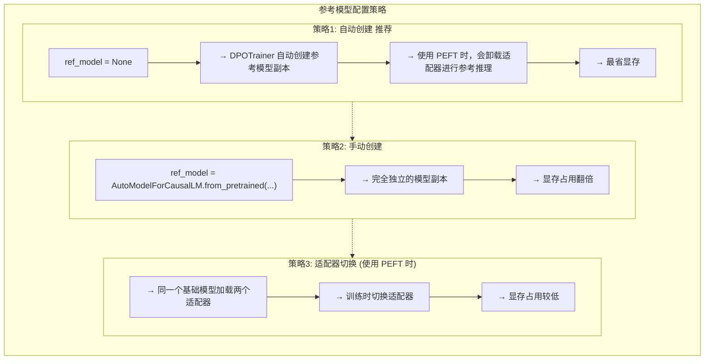

# 第三章：使用 DPO 进行偏好对齐

> 配套代码：`dpotrainer.py`

## 承上启下

在前两章中，我们学习了：

- **第一章**：使用原生 Trainer 进行 SFT，理解了 Loss Masking 的核心概念
- **第二章**：使用 SFTTrainer 简化流程，实现了自动化的 SFT 训练

通过 SFT，模型学会了：
- 按照指令格式回答问题
- 生成符合语法的响应
- 理解用户的意图

**但是**，SFT 有一个局限性：它只能让模型学习"如何回答"，却不能让模型学习"什么样的回答更好"。

**本章将介绍 DPO（Direct Preference Optimization）**——一种让模型学习人类偏好的训练方法！为了能够更好的理解DPO的数学理论，建议参考原文 https://arxiv.org/abs/2305.18290 ，下面的数学原理不会非常完整，仅仅是简单介绍。

## 本章学习目标

完成本章后，你将理解：

1. **偏好对齐** 的概念和重要性
2. **DPO** 与传统 RLHF 的区别
3. **偏好数据集** 的格式和构建
4. **DPOTrainer** 的使用方法
5. **参考模型** 的作用和配置

## 1. 为什么需要偏好对齐？

### 1.1 SFT 的局限性

**SFT 无法区分回答质量**

**用户提问：** "如何提高编程效率？"

**SFT 模型可能的回答 A（更好）：**
> 提高编程效率可以通过以下方式：
> 1. 学习快捷键
> 2. 使用代码片段
> 3. 定期休息

**SFT 模型可能的回答 B（较差）：**
> 多写代码就行了。

**问题：** 两个回答语法都正确，但 A 明显更详细、更实用！SFT 无法区分回答的"质量"差异。

### 1.2 偏好对齐的目标

让模型学习：**给定相同的问题，哪个回答更符合人类偏好？**

```
偏好数据格式:
{
    "prompt": "如何提高编程效率？",
    "chosen": "提高编程效率可以通过以下方式：1. 学习快捷键...",   ← 更好的回答
    "rejected": "多写代码就行了。"                               ← 较差的回答
}
```

## 2. RLHF vs DPO

### 2.1 传统 RLHF (PPO) 流程

**传统 RLHF (PPO) 流程**

1. **收集偏好数据** → 人类标注者标记 chosen vs rejected
2. **训练奖励模型** → 用偏好数据训练rewarder模型，为了实现baseline保证梯度稳定，还需要构建一个value模型，从而导致大量的显存开销
3. **PPO 优化策略** → 从策略模型采样，用奖励模型评分，更新策略

**需要 4 个模型：** 策略、参考、奖励、价值模型

**问题：**
- 流程复杂，需要多个模型
- 训练不稳定，需要大量调参
- 计算成本高（需要采样生成）

### 2.2 DPO：简化的偏好对齐

**DPO 流程**

1. **收集偏好数据** → 与 RLHF 相同
2. **直接优化策略** ← **关键创新！**

**只需 2 个模型：** 策略 + 参考模型

**优势：**
- 流程简单，易于实现
- 训练稳定，无需复杂调参
- 计算效率高
- 代码逻辑接近 SFT，仍旧是去优化损失

### 2.3 数学原理（从直觉到公式）

#### 2.3.1 RLHF 的核心目标

在传统 RLHF 中，我们的目标很简单：**让模型更倾向于生成人类偏好的回答**。

用数学语言说，对于一组偏好数据 $(x, y_w, y_l)$（其中 $y_w$ 是更好的回答，$y_l$ 是较差的回答），我们希望：

$$P(y_w > y_l \mid x) > 0.5$$

即：模型应该认为 chosen 回答比 rejected 回答更好。

#### 2.3.2 传统 RLHF 的做法：训练奖励模型

为了实现这个目标，传统 RLHF 分两步：

**第一步：训练奖励模型 $R(x, y)$**

奖励模型的作用是给每个回答打分。我们用偏好数据训练它，使得：

$$R(x, y_w) > R(x, y_l)$$

**第二步：用强化学习优化策略**

使用 PPO 等算法，调整策略模型 $\pi_\theta$ 的参数，让它生成的回答能获得更高奖励：

$$\text{目标：最大化 } E[R(x, y)]$$

**问题**：这需要训练一个独立的奖励模型，还要用复杂的强化学习算法，流程繁琐且不稳定。

#### 2.3.3 DPO 的洞察：奖励函数可以解析表达

DPO 的核心发现是：**如果我们知道了最优策略的奖励函数形式，就可以绕过奖励模型，直接优化策略！**

**关键定理**：在 RLHF 设置下，最优策略的奖励函数可以表示为：

$$R^*(x, y) = \beta \cdot \log\left(\frac{\pi^*(y \mid x)}{\pi_{\text{ref}}(y \mid x)}\right) + Z(x)$$

其中：
- $\pi^*(y \mid x)$ = 最优策略（我们想学到的策略）
- $\pi_{\text{ref}}(y \mid x)$ = 参考策略（SFT 后的模型，作为起点）
- $\beta$ = 温度参数，控制偏离程度
- $Z(x)$ = 归一化常数（与 $y$ 无关，优化时可忽略）

**直觉理解**：

这个公式告诉我们：**奖励的大小取决于策略模型相对于参考模型的"偏好变化"**。

- 如果 $\pi^*$ 相比 $\pi_{\text{ref}}$ 更倾向于生成某个回答 → 该回答的奖励高
- 如果 $\pi^*$ 相比 $\pi_{\text{ref}}$ 更不倾向于生成某个回答 → 该回答的奖励低

#### 2.3.4 DPO 的优化目标

有了奖励函数的表达式，我们可以直接写出优化目标。

**RLHF 的目标（用奖励模型）**：

$$\mathcal{L}_{\text{RLHF}} = \log \sigma\left(\beta \left[R(x, y_w) - R(x, y_l)\right]\right)$$

其中 $\sigma$ 是 sigmoid 函数。这个损失鼓励 $R(x, y_w) > R(x, y_l)$。

**DPO 的目标（用策略模型）**：

将奖励函数的表达式代入，消去 $Z(x)$，得到：

$$\mathcal{L}_{\text{DPO}} = \log \sigma\left(\beta \cdot \log\frac{\pi_\theta(y_w \mid x)}{\pi_{\text{ref}}(y_w \mid x)} - \beta \cdot \log\frac{\pi_\theta(y_l \mid x)}{\pi_{\text{ref}}(y_l \mid x)}\right)$$

简化后：

$$\mathcal{L}_{\text{DPO}} = \log \sigma\left(\beta \cdot \log\frac{\pi_\theta(y_w \mid x) \cdot \pi_{\text{ref}}(y_l \mid x)}{\pi_\theta(y_l \mid x) \cdot \pi_{\text{ref}}(y_w \mid x)}\right)$$

**这个损失的含义**：

- **分子**（我们想要的）：$\pi_\theta(y_w \mid x)$ 要大，$\pi_{\text{ref}}(y_l \mid x)$ 是基准
- **分母**（我们要避免的）：$\pi_\theta(y_l \mid x)$ 要小，$\pi_{\text{ref}}(y_w \mid x)$ 是基准

训练时，我们通过梯度上升最大化这个损失，使得：
-  $\pi_\theta(y_w \mid x)$ 相比参考模型上升 → 模型更倾向于生成 chosen 回答
-  $\pi_\theta(y_l \mid x)$ 相比参考模型下降 → 模型更不倾向于生成 rejected 回答

#### 2.3.5 为什么需要参考模型？

你可能会问：**为什么不能直接最大化 $\pi_\theta(y_w \mid x)$，最小化 $\pi_\theta(y_l \mid x)$？**

**问题**：这样会导致模型崩溃（Mode Collapse）

如果没有参考模型约束，模型可能学会：
- 对 chosen 回答输出极高概率（接近 1）
- 对 rejected 回答输出极低概率（接近 0）

但这会让模型：
- 忘记 SFT 阶段学到的知识
- 生成奇怪、不自然的回答
- 失去泛化能力

**参考模型的作用**：

$\pi_{\text{ref}}$ 就像一个"锚点"，确保：
- $\pi_\theta$ 不能随意偏离原始模型
- 只在偏好对齐的方向上调整
- 保持模型的语言能力和稳定性

数学上，这通过 **KL 散度正则化**实现：

$$\text{KL}(\pi_\theta \Vert \pi_{\text{ref}}) = \sum_y \pi_\theta(y \mid x) \log\frac{\pi_\theta(y \mid x)}{\pi_{\text{ref}}(y \mid x)}$$

DPO 的损失函数中已经隐式包含了 KL 约束（通过 $\beta$ 参数控制）。

#### 2.3.6 总结：DPO vs RLHF

| 方面 | 传统 RLHF (PPO) | DPO |
|------|----------------|-----|
| **第一步** | 训练奖励模型  $R(x, y)$  | ❌ 不需要 |
| **第二步** | 用强化学习优化策略 | ✅ 直接优化策略 |
| **优化目标** | 最大化 $E[R(x, y)]$ | 最大化 $\mathcal{L}_{\text{DPO}}$ |
| **参考模型** | 用于 KL 正则化 | 直接嵌入损失函数 |
| **计算复杂度** | 需要采样生成，计算量大 | 类似 SFT，计算高效 |

**核心优势**：DPO 将强化学习问题转化为了**监督学习问题**，不需要训练奖励模型，不需要复杂的 RL 算法，代码实现接近 SFT！

## 3. 偏好数据集格式

### 3.1 标准格式

```python
# 格式1: 简单格式
{
    "prompt": "The sky is",
    "chosen": " blue.",
    "rejected": " green."
}

# 格式2: 对话格式
{
    "prompt": [{"role": "user", "content": "What color is the sky?"}],
    "chosen": [{"role": "assistant", "content": "It is blue."}],
    "rejected": [{"role": "assistant", "content": "It is green."}]
}
```

### 3.2 常用偏好数据集

| 数据集 | 描述 | 大小 |
|--------|------|------|
| `trl-lib/ultrafeedback_binarized` | TRL 官方提供 | ~60k |
| `Anthropic/hh-rlhf` | Anthropic 的有用+无害数据 | ~170k |
| `argilla/ultrafeedback-binarized-preferences-cleaned` | 清洗后的 UltraFeedback | ~60k |

### 3.3 自建偏好数据集

```python
# 偏好数据的构建方式：
# 1. 人类标注：让标注者选择更好的回答
# 2. AI 辅助：用强模型（如 GPT-4）判断偏好
# 3. 启发式规则：如选择更长/更详细的回答

preference_data = {
    "prompt": "解释什么是机器学习？",
    "chosen": "机器学习是人工智能的一个分支，它使计算机系统能够从数据中学习和改进，而无需进行明确的编程。主要类型包括：监督学习、无监督学习和强化学习...",
    "rejected": "就是让机器学东西。"
}
```

## 4. DPOTrainer 使用指南

### 4.1 基本配置

```python
from trl import DPOConfig, DPOTrainer

# DPO 配置
training_args = DPOConfig(
    output_dir="./dpo-output",
    
    # DPO 核心参数
    beta=0.1,  # ★ KL 正则化强度
    loss_type="sigmoid",  # 损失函数类型
    
    # 训练参数
    num_train_epochs=1,  # DPO 通常只需 1-3 个 epoch
    per_device_train_batch_size=4,
    learning_rate=5e-7,  # DPO 通常用更小的学习率
    
    # 其他
    gradient_checkpointing=True,
    bf16=True,
)
```

### 4.2 关键参数：beta

`beta` 是 DPO 最重要的超参数：

```
beta 的作用：控制模型偏离参考模型的程度

beta 大 (如 0.5):
  └─→ 模型更保守，不敢偏离参考模型太远
  └─→ 适用于：偏好数据噪声较大时

beta 小 (如 0.05):
  └─→ 模型更激进，可能偏离参考模型较远
  └─→ 适用于：偏好数据质量高时

推荐起始值: 0.1
调整范围: 0.05 - 0.5
```

### 4.3 损失函数类型

DPO的核心就在于如何将强化学习对齐转换为简单的损失函数优化，因此有很多衍生形式，就通过这里进行选择。
```python
loss_type = "sigmoid"  # 默认，标准 DPO

# 其他可选值：
# "hinge"    - 来自 RSO 论文
# "ipo"      - 来自 IPO 论文，解决过拟合
# "robust"   - 鲁棒 DPO，处理噪声标签
```

### 4.4 创建 DPOTrainer

```python
from trl import DPOTrainer
from datasets import load_dataset

# 加载偏好数据集
dataset = load_dataset("trl-lib/ultrafeedback_binarized")

# 创建 DPOTrainer
trainer = DPOTrainer(
    model=model,                    # 策略模型
    ref_model=None,                 # 参考模型（None 则自动创建）
    args=training_args,             # DPO 配置
    train_dataset=dataset["train"],
    processing_class=tokenizer,     # 分词器
    peft_config=lora_config,        # LoRA 配置
)

# 开始训练
trainer.train()
```

## 5. 参考模型的处理

### 5.1 参考模型的作用

DPO 需要两个模型：

- **策略模型**
  - 我们要训练的模型
  - 参数会被更新

- **参考模型**
  - 用于计算 KL 散度正则化
  - 通常是 SFT 后的模型副本
  - 参数冻结，不更新

### 5.2 三种参考模型策略



### 5.3 代码示例

```python
# 策略1: 自动创建（推荐）
trainer = DPOTrainer(
    model=model,
    ref_model=None,  # ← 自动处理
    ...
)

# 策略2: 手动创建
ref_model = AutoModelForCausalLM.from_pretrained(
    "Qwen/Qwen3-8B",
    dtype=torch.bfloat16,
    device_map="auto",
)
ref_model.eval()  # 冻结

trainer = DPOTrainer(
    model=model,
    ref_model=ref_model,
    ...
)
```

## 6. 训练监控指标

### 6.1 关键指标

| 指标 | 含义 | 期望趋势 |
|------|------|----------|
| `rewards/chosen` | chosen 回答的平均奖励 | 上升 |
| `rewards/rejected` | rejected 回答的平均奖励 | 下降 |
| `rewards/margins` | chosen - rejected 的差值 | 上升 |
| `rewards/accuracies` | chosen 奖励 > rejected 奖励的比例 | 接近 1.0 |

### 6.2 监控示例

```
训练日志:
  Step 100: rewards/margins = 0.5, rewards/accuracies = 0.65
  Step 200: rewards/margins = 1.2, rewards/accuracies = 0.78
  Step 300: rewards/margins = 2.0, rewards/accuracies = 0.89
  ...
  
分析:
  margins 在上升 → 模型学会区分 chosen 和 rejected
  accuracies 接近 1.0 → 模型几乎总能正确排序偏好
```

## 7. DPO 与 SFT 的训练流程对比

**完整训练流程对比**

| 阶段 | SFT (第一、二章) | DPO (本章) |
|------|-----------------|------------|
| **目标** | 让模型学会指令遵循 | 让模型学会偏好 |
| **数据** | (prompt, response) 二元对 | (prompt, chosen, rejected) 三元组 |
| **结果** | 能回答问题，但质量不一定最优 | 回答质量显著提升 |
| **时间** | 1-3 epochs | 1-3 epochs |
| **顺序** | 先进行 | **在 SFT 之后进行** |

**重要：** DPO 应该在 SFT 之后进行！

## 8. 运行代码

### 8.1 配置参数

在 `dpotrainer.py` 中可以修改：

```python
MODEL_NAME = "Qwen/Qwen3-8B"  # 模型
DATASET_NAME = "trl-lib/ultrafeedback_binarized"  # 偏好数据集
BETA = 0.1  # KL 正则化强度
MAX_LENGTH = 2048  # 最大序列长度
```

### 8.2 运行训练

```bash
python dpotrainer.py
```

### 8.3 评估训练效果

训练后，观察：
1. `rewards/margins` 是否在上升
2. `rewards/accuracies` 是否接近 1.0
3. 生成测试：模型回答是否更符合预期

## 9. 本章小结

| 概念 | 说明 |
|------|------|
| **偏好对齐** | 让模型学习"什么回答更好" |
| **DPO** | 直接偏好优化，简化的 RLHF 替代方案 |
| **偏好数据** | (prompt, chosen, rejected) 三元组 |
| **参考模型** | 用于 KL 正则化，防止模型偏离太远 |
| **beta** | 控制保守/激进程度的关键超参数 |

## 10. DPO 的局限性与展望

### 10.1 DPO 的局限性

#### 依赖离线数据

- 只能使用预先收集的偏好数据
- 无法在线探索和学习

#### 奖励函数隐式化

- DPO 将奖励函数通过数学变换隐藏了
- 无法直接控制奖励信号
- 难以实现复杂的奖励设计

#### 只适用于偏好对齐

- 无法处理需要明确奖励信号的任务
- 如：数学推理、代码生成等需要可验证正确性的任务

### 10.2 下一步：GRPO 和可验证奖励

**问题**：如果我们的任务有明确的正确/错误判断（如数学题），能否设计更好的奖励？

**答案**：可以！这就是 GRPO 等高级 RL 方法的用武之地。


---

> **附录：常见问题**
>
> **Q: DPO 训练后模型变差了？**  
> A: 1) 检查 beta 值，可能太小导致过度偏离  2) 检查偏好数据质量  3) 减少训练 epochs
>
> **Q: rewards/accuracies 一直不提升？**  
> A: 1) 检查数据格式是否正确  2) 尝试增大学习率  3) 确保 chosen 确实比 rejected 好
>
> **Q: 显存不够怎么办？**  
> A: 1) 使用 `ref_model=None` 让 DPOTrainer 自动处理  2) 减小 batch_size  3) 启用 gradient_checkpointing

---


