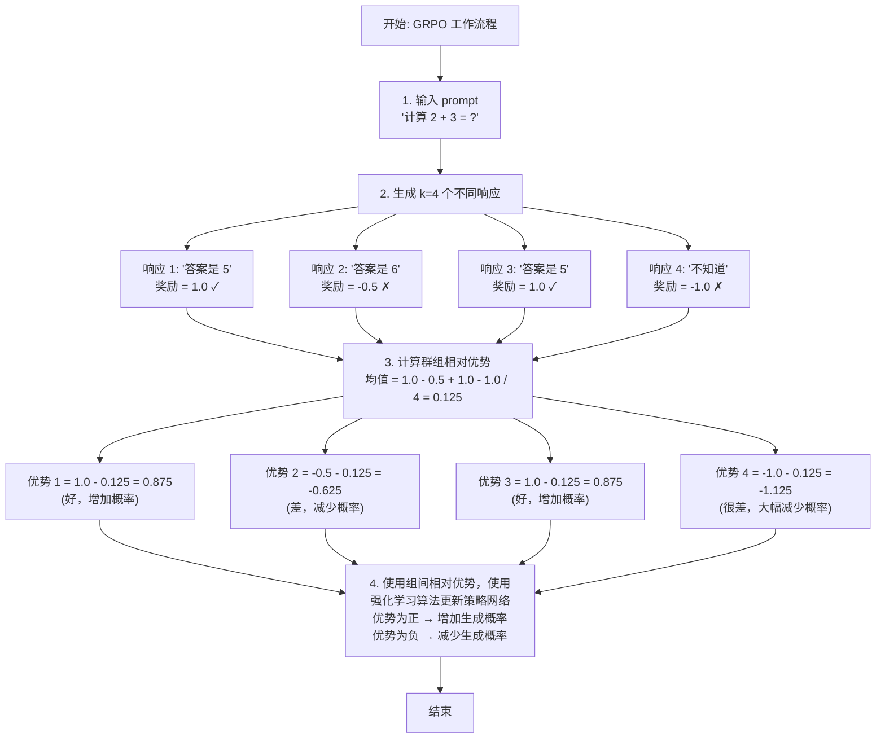
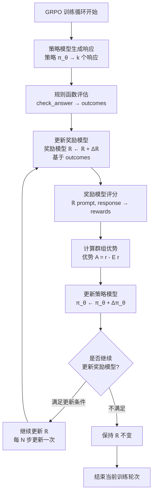

# 第四章：使用 GRPO 进行可验证奖励训练

> 配套代码：`grpotrainer.py`

## 承上启下

在前三章中，我们学习了：

- **第一章**：使用原生 Trainer 进行 SFT，理解了 Loss Masking 的核心概念
- **第二章**：使用 SFTTrainer 简化流程，实现了自动化的 SFT 训练
- **第三章**：使用 DPO 进行偏好对齐，让模型学习人类偏好

通过 DPO，我们成功让模型学习了：
- 如何区分好坏回答
- 生成更符合人类偏好的响应
- 在保持稳定性的同时提升质量

**但是**，DPO 有一个重要局限：它只能使用离线的偏好数据（chosen vs rejected 对），无法利用可验证的奖励信号（如数学题的正确性、代码的测试结果等）。

**本章将介绍 GRPO（Group Relative Policy Optimization）**——一种支持自定义奖励函数的强化学习方法！为了更好的理解GRPO算法，简易参考阅读 https://arxiv.org/abs/2402.03300 除了GRPO以外，他还介绍了相关的预训练策略以及一些理论上的讨论，我们这里也会补充一些对应的讨论，但仍旧建议阅读原文。

## 本章学习目标

完成本章后，你将理解：

1. **可验证奖励** 的概念和价值
2. **GRPO** 与 DPO/PPO 的区别
3. **在线采样** 和 **群组相对优势** 的原理
4. **奖励函数设计** 的最佳实践
5. **GRPOTrainer** 的使用方法

## 1. DPO 的局限与 GRPO 的优势

### 1.1 DPO 无法处理的场景

```
**场景 1：数学问题**

**问题**：2 + 2 = ?

**模型响应 A**："答案是 4" ✓ 正确
**模型响应 B**："答案是 5" ✗ 错误

**DPO 的问题：**
- 需要预先标注 A 为 chosen，B 为 rejected
- 无法直接利用"答案是否正确"这个可验证的信号

**场景 2：代码生成**

**问题**：实现一个排序函数

**模型响应 A**：[生成代码]
**模型响应 B**：[生成代码]

**可验证奖励：**
- 运行单元测试 → 通过 = +1，失败 = -1
```

**DPO 的问题：**
- 无法直接利用测试结果
- 需要人工标注 `chosen/rejected`

### 1.2 GRPO 的核心优势

**GRPO = 在线采样 + 自定义奖励 + 群组相对优势**

**GRPO vs DPO 对比**

**DPO:**
- 数据: 离线 (prompt, chosen, rejected) 对
- 奖励: 隐式（通过偏好对学习）
- 适用: 主观偏好任务

**GRPO:**
- 数据: 只需 prompt
- 奖励: 显式、可自定义
- 适用: 任何可验证任务（数学、代码、推理等）

### 1.3 GRPO 的应用场景

| 任务类型 | 奖励函数设计 | 示例 |
|---------|-------------|------|
| **数学推理** | 答案正确性 | GSM8K, MATH |
| **代码生成** | 单元测试通过率 | HumanEval, MBPP |
| **逻辑推理** | 推理链有效性 | ReClor, LogiQA |
| **事实性** | 外部知识库验证 | TriviaQA |
| **多目标** | 加权组合奖励 | 正确性 + 效率 + 可读性 |

## 2. GRPO 算法原理

### 2.1 核心思想：群组相对优势

**传统 PPO 的问题**：
- 需要独立的价值网络（Value Network）估计优势
- 训练不稳定，需要大量调参

**GRPO 的创新**：
- 对每个 prompt 生成 **k 个响应**（如 k=4）
- 使用群组内的相对排名来估计优势
- 无需额外的价值网络



### 2.2 数学形式与核心区别：GRPO vs PPO

为了深入理解 GRPO 的创新之处，我们需要对比 PPO（Proximal Policy Optimization）和 GRPO 的数学形式。

#### 2.2.1 PPO 的数学形式

**PPO 损失函数（完整版）：**

$$
L_{\text{PPO}}(\theta) = \mathbb{E}_t\left[L_t^{CLIP}(\theta) - c_1 L_t^{VF}(\theta) + c_2 S[\pi_\theta](s_t)\right]
$$

其中：

1. **策略损失（CLIP 损失）**：
   $$
   L_t^{CLIP}(\theta) = -\min\left(r_t(\theta)\hat{A}_t, \text{clip}(r_t(\theta), 1-\epsilon, 1+\epsilon)\hat{A}_t\right)
   $$
   - $r_t(\theta) = \frac{\pi_\theta(a_t|s_t)}{\pi_{\theta_{old}}(a_t|s_t)}$ ← 重要性采样比率
   - $\hat{A}_t$ ← 优势函数估计
   - $\epsilon$ ← 裁剪参数（通常为 0.2）

2. **价值函数损失**：
   $$
   L_t^{VF}(\theta) = \left(V_\theta(s_t) - V_t^{\text{target}}\right)^2
   $$
   - $V_\theta$ ← 价值网络（需要单独训练）
   - $V_t^{\text{target}}$ ← 目标价值

3. **熵正则化**：
   $$
   S[\pi_\theta](s_t) = -\sum_a \pi_\theta(a|s_t) \log \pi_\theta(a|s_t)
   $$

**PPO 的优势函数计算（GAE）**：

$$
\hat{A}_t^{\text{GAE}}(\gamma, \lambda) = \sum_{l=0}^{\infty} (\gamma \lambda)^l \delta_{t+l}^V
$$

其中 $\delta_t^V = r_t + \gamma V(s_{t+1}) - V(s_t)$ 是 TD 残差。

**关键观察**：
- ✗ 需要训练**价值网络** $V_\theta$（额外参数）
- ✗ 需要**广义优势估计（GAE）**计算复杂
- ✗ 依赖**重要性采样比率** $r_t(\theta)$
- ✗ 需要裁剪机制防止更新过大

#### 2.2.2 GRPO 的数学形式

**GRPO 损失函数（简化版）**：

$$
L_{\text{GRPO}}(\theta) = -\mathbb{E}_{s \sim \mathcal{D}, a_i \sim \pi_\theta(\cdot|s)}\left[\hat{A}(s, a_i) \log \pi_\theta(a_i|s)\right] + \beta \cdot \text{KL}(\pi_\theta || \pi_{\text{ref}})
$$

**其中：**

1. **群组相对优势（Group Relative Advantage）**：
   $$
   \hat{A}(s, a_i) = \frac{1}{k}\sum_{j=1}^{k} R(s, a_j) - R(s, a_i)
   $$
   等价于：
   $$
   \hat{A}(s, a_i) = \text{mean}(R(s, \cdot)) - R(s, a_i)
   $$
   - $R(s, a_i)$ ← 奖励模型对响应 $a_i$ 的评分
   - $k$ ← 群组大小（每个 prompt 生成的响应数量）
   - **关键**：优势是**相对于群组均值**的

2. **KL 散度正则化**：
   $$
   \text{KL}(\pi_\theta || \pi_{\text{ref}}) = \sum_{a} \pi_\theta(a|s) \log \frac{\pi_\theta(a|s)}{\pi_{\text{ref}}(a|s)}
   $$
   - $\pi_{\text{ref}}$ ← 参考策略（冻结的 SFT 模型）
   - $\beta$ ← KL 系数

**关键观察**：
- ✓ **无需价值网络**（节省显存和计算）
- ✓ **无需 GAE**（群组相对优势天然归一化）
- ✓ **无需重要性采样**（在线采样）
- ✓ **无需裁剪**（KL 正则化天然稳定）

#### 2.2.3 核心区别对比

| 维度 | PPO | GRPO |
|------|-----|------|
| **优势估计** | $\hat{A}_t = \sum_{l}(\gamma\lambda)^l \delta_{t+l}^V$（GAE） | $\hat{A}(s, a_i) = \text{mean}(R) - R(s, a_i)$（群组相对） |
| **价值网络** | 需要 $V_\theta$ | 不需要 |
| **采样策略** | 离线数据 + 重要性采样 | 在线生成 $k$ 个响应 |
| **稳定性机制** | 裁剪 $r_t(\theta) \in [1-\epsilon, 1+\epsilon]$ | KL 正则化 $\text{KL}(\pi_\theta \| \pi_{\text{ref}})$ |
| **显存占用** | 策略网络 + 价值网络 + 奖励模型 | 策略网络 + 奖励模型 |


#### 2.2.4 为什么群组相对优势有效？

**数学直觉**：

对于每个 prompt $s$，生成 $k$ 个响应 $\{a_1, a_2, ..., a_k\}$：

1. **零均值性质**：
   $$
   \mathbb{E}_{a_i \sim \pi_\theta}[\hat{A}(s, a_i)] = \frac{1}{k}\sum_{i=1}^{k} (\text{mean}(R) - R(s, a_i)) = 0
   $$
   - → 优势函数天然中心化
   - → 减少方差，提高训练稳定性

2. **自动归一化**：
   - 不同 prompt 的奖励尺度可能不同（有的容易，有的困难）
   - 相对优势自动消除尺度差异
   - → 无需手动调参

3. **无需绝对价值**：
   - PPO: "这个响应价值多少？" → 需要 $V(s)$
   - GRPO: "这个响应比同组其他响应好多少？" → 只需组内比较


### 2.3 为什么叫"群组相对"？

**传统 RL**：需要估计绝对价值，"这个响应好吗？" → 需要价值网络

**GRPO**：只需要相对排名"，这个响应比同组其他响应好吗？" → 直接用奖励函数

**优势：**
- 简单：无需额外网络
- 稳定：相对比较更鲁棒
- 高效：减少训练成本

## 3. GRPO 中的奖励系统

### 3.1 奖励模型：强化学习的核心组件

在 GRPO 以及现代强化学习算法中，**奖励模型** 是必不可少的组件。我们需要澄清几个关键概念：

**什么是奖励模型？**

奖励模型是一个神经网络，它的作用是：
- **输入**：prompt + response（或者任务相关的其他信息）
- **输出**：一个标量奖励值，表示响应的质量
- **本质**：一个函数 `R(prompt, response) → reward`

**关键点**：
- 在 GRPO 中，我们优化的是策略模型 $\pi_\theta$
- 但需要一个奖励模型 $\mathcal{R}$ 来告诉我们哪些响应更好
- 奖励模型的输出就是强化学习的"奖励信号"

### 3.2 奖励模型的两种训练方式

根据 GRPO 原文和 DeepSeek 的实践，奖励模型可以通过两种方式训练：

#### 方式 1：基于规则训练（Outcome Supervision）

**适用场景**：有明确正确答案的任务（如数学题）

**训练流程**：
```python
# 示例：数学题奖励模型训练
training_data = [
    {
        "prompt": "计算 2+2",
        "response": "答案是 4",
        "outcome": +1.0  # 答案正确
    },
    {
        "prompt": "计算 2+2",
        "response": "答案是 5",
        "outcome": -1.0  # 答案错误
    },
]

# 训练奖励模型：学习预测 outcome
reward_model.train(
    inputs=[(d["prompt"], d["response"]) for d in training_data],
    targets=[d["outcome"] for d in training_data]
)
```

**原理**：
- 规则函数（如 `check_answer_correct()`）生成训练标签
- 奖励模型学习模仿这个规则函数
- 训练后，模型可以泛化到类似的问题

**优势**：
- ✓ 无需人工标注：规则自动生成训练数据
- ✓ 可验证：答案正确性是客观的
- ✓ 高效：可以生成大量训练样本

**局限**：
- ✗ 需要有明确的验证规则
- ✗ 只能判断"对错"，难以评估质量

#### 方式 2：基于人工标注训练（Preference Supervision）

**适用场景**：主观性强的任务（如对话质量、写作风格）

**训练流程**：
```python
# 示例：人工偏好数据
training_data = [
    {
        "prompt": "写一首关于春天的诗",
        "response_A": "春风拂面暖人心...",
        "response_B": "春天很好...",
        "preference": "A"  # 标注者认为 A 更好
    },
]

# 训练奖励模型
# 方法 1: 成对排序损失
loss = -log(sigmoid(r_A - r_B))  # 确保 r_A > r_B

# 方法 2: Bradley-Terry 模型
P(A > B) = sigmoid(r_A - r_B)
```

**原理**：
- 人工标注者比较两个响应
- 奖励模型学习预测人类偏好
- 训练后，模型输出与人类判断对齐

**优势**：
- ✓ 捕捉复杂质量维度：流畅性、创造性、有用性
- ✓ 泛化能力强：可处理各种任务

**局限**：
- ✗ 标注成本高
- ✗ 主观性强：不同标注者可能不一致

### 3.3 GRPO 中的奖励信号：规则 vs 模型

**重要澄清**：在 GRPO 中，"奖励函数" 可以是：

**类型 A：纯规则函数**

```python
def rule_based_reward(prompt, response):
    """直接使用规则计算奖励，无需训练"""
    if check_correct(response):
        return 1.0
    else:
        return -1.0
```

- ✗ 严格来说这不是"奖励模型"（无神经网络）
- ✓ 简单高效，适合快速实验
- ✗ 缺乏泛化能力
- ✗ 我们会在后面讨论这种方法实际上在现代训练中不合适

**类型 B：预训练的奖励模型**

```python
# 预先训练好的神经网络
reward_model = load_pretrained_reward_model("path/to/model")

def model_based_reward(prompts, responses):
    """使用奖励模型推理"""
    rewards = []
    for prompt, response in zip(prompts, responses):
        reward = reward_model(prompt, response)  # 模型推理
        rewards.append(reward)
    return rewards
```

- ✓ 这是标准的"奖励模型"
- ✓ 捕捉复杂模式
- ✗ 需要预先训练
- ✗ 不会随着策略网络的改变而改变，可能无法正确评估

**类型 C：在线学习的奖励模型（GRPO 原文方法）**

```python
# 在 GRPO 训练过程中动态更新
class OnlineRewardModel:
    def __init__(self):
        self.model = NeuralNetwork()

    def update_with_outcomes(self, prompts, responses, outcomes):
        """根据规则生成的 outcomes 更新模型"""
        self.model.train(prompts, responses, outcomes)

    def compute_reward(self, prompt, response):
        """使用当前模型计算奖励"""
        return self.model(prompt, response)

# 在 GRPO 循环中
for step in training:
    # 1. 生成响应
    responses = policy_model.generate(prompts)

    # 2. 规则检查（如运行代码测试）
    outcomes = [check_correct(r) for r in responses]

    # 3. 更新奖励模型
    reward_model.update_with_outcomes(prompts, responses, outcomes)

    # 4. 使用奖励模型计算奖励
    rewards = [reward_model.compute_reward(p, r)
               for p, r in zip(prompts, responses)]

    # 5. GRPO 优化
    grpo_update(rewards)
```

- ✓ 结合规则和模型的优势
- ✓ 奖励模型随策略训练改进

### 3.4 GRPO 原文中的奖励系统

GRPO奖励系统的工作方式：

**重要：奖励模型的在线更新策略**

与传统的 RLHF 方法不同，GRPO 中的奖励模型 $\mathcal{R}$ **不是固定的**，而是随着策略模型 $\pi_\theta$ 的更新而动态更新的！只是奖励模型不会比策略网络更新的那么快，一般是策略网络更新若干轮以后再去更新一次奖励模型。



**奖励模型更新策略的核心要点**：

1. **动态更新**：奖励模型在 GRPO 训练过程中持续学习
2. **数据来源**：使用规则函数（如 `check_answer`）生成的 outcomes 作为训练信号
3. **更新频率**：通常每隔 N 个训练步更新一次奖励模型
4. **双重优化**：策略模型和奖励模型同时改进

**为什么需要动态更新奖励模型？**

- ✅ **适应分布偏移**：随着策略模型改进，生成的响应分布会变化
- ✅ **保持判别能力**：奖励模型需要能够评估越来越好的响应
- ✅ **避免 reward hacking**：固定的奖励模型容易被策略模型"利用"

**GRPO的关键设计**：
1. **Outcome supervision**：使用答案正确性训练奖励模型
2. **Process supervision**：奖励模型同时评估推理过程的质量
3. **在线更新**：奖励模型在 GRPO 训练过程中持续更新（重要！）


### 3.5 奖励模型的训练实践

#### 3.5.1 训练数据的构建

**基于规则的数据生成**：

```python
def generate_reward_model_training_data(math_dataset):
    """
    从数学题数据集生成奖励模型训练数据
    """
    training_data = []

    for sample in math_dataset:
        prompt = sample["question"]
        ground_truth = sample["answer"]

        # 生成多个响应（包含正确和错误的）
        responses = [
            generate_correct_response(prompt, ground_truth),
            generate_incorrect_responses(prompt, ground_truth, n=3),
        ]

        # 为每个响应生成标签
        for response in responses:
            outcome = check_answer_correct(response, ground_truth)
            training_data.append({
                "prompt": prompt,
                "response": response,
                "reward": 1.0 if outcome else -1.0
            })

    return training_data
```

#### 3.5.2 奖励模型架构

神经奖励模型一般会使用一个预训练的语言模型神经网络，然后去通过修改输出层的方式，让他去输出一个奖励标量，使用收集到的奖励数据对微调这个神经网络即可。

```python
import torch
import torch.nn as nn
from transformers import AutoModel

class RewardModel(nn.Module):
    """
    简单的奖励模型实现
    """
    def __init__(self, base_model_name="bert-base-uncased"):
        super().__init__()
        self.encoder = AutoModel.from_pretrained(base_model_name)
        hidden_size = self.encoder.config.hidden_size

        # 奖励头：输出单个标量
        self.reward_head = nn.Sequential(
            nn.Linear(hidden_size, hidden_size // 2),
            nn.ReLU(),
            nn.Dropout(0.1),
            nn.Linear(hidden_size // 2, 1)
        )

    def forward(self, input_ids, attention_mask):
        # 编码
        outputs = self.encoder(
            input_ids=input_ids,
            attention_mask=attention_mask
        )

        # 使用 [CLS] token 的表示
        cls_embedding = outputs.last_hidden_state[:, 0, :]

        # 计算奖励
        reward = self.reward_head(cls_embedding).squeeze(-1)

        return reward

# 训练循环
def train_reward_model(model, training_data, epochs=3):
    optimizer = torch.optim.AdamW(model.parameters(), lr=1e-5)
    loss_fn = nn.MSELoss()  # 回归损失

    for epoch in range(epochs):
        for batch in training_data:
            prompts = batch["prompt"]
            responses = batch["response"]
            targets = batch["reward"]

            # 前向传播
            rewards = model(prompts, responses)

            # 计算损失
            loss = loss_fn(rewards, targets)

            # 反向传播
            loss.backward()
            optimizer.step()
            optimizer.zero_grad()

    return model
```

#### 3.5.3 奖励模型的评估

```python
def evaluate_reward_model(reward_model, test_dataset):
    """
    评估奖励模型的质量
    """
    correct_rankings = 0
    total = 0

    for sample in test_dataset:
        prompt = sample["prompt"]
        better_response = sample["better"]
        worse_response = sample["worse"]

        # 计算奖励
        r_better = reward_model(prompt, better_response)
        r_worse = reward_model(prompt, worse_response)

        # 检查排名是否正确
        if r_better > r_worse:
            correct_rankings += 1
        total += 1

    accuracy = correct_rankings / total
    print(f"Ranking Accuracy: {accuracy:.2%}")

    return accuracy
```


### 3.6 奖励模型训练的常见陷阱

#### 陷阱 1：奖励黑客（Reward Hacking）

**问题**：模型发现奖励函数的漏洞，生成不自然但高奖励的文本

**示例**：
- 奖励函数：奖励包含数字的回答
- 模型学会：生成大量无关数字

**解决方案**：
```python
def robust_reward_function(response):
    reward = 0.0

    # 基础奖励：答案正确性
    if check_correct(response):
        reward += 0.7

    # 辅助奖励：格式规范（但要小心！）
    if has_proper_format(response):
        reward += 0.2

    # 惩罚：异常模式
    if has_repetitive_patterns(response):
        reward -= 0.5  # 严重惩罚

    if is_too_short(response):
        reward -= 0.3

    return reward
```

#### 陷阱 2：分布偏移

**问题**：训练后期，生成的响应超出奖励模型的训练分布

**解决方案**：
```python
# 定期评估奖励模型的校准性，重新微调奖励模型
def check_reward_distribution(reward_model, validation_set):
    rewards = []
    for sample in validation_set:
        r = reward_model(sample["prompt"], sample["response"])
        rewards.append(r)

    # 检查奖励分布是否异常
    if abs(np.mean(rewards)) > 10:  # 奖励值异常大
        print("Warning: Reward model may be miscalibrated!")
        return False

    return True
```

#### 陷阱 3：过度拟合训练数据

**问题**：奖励模型在训练集上表现好，但泛化性差

**解决方案**：
- 使用数据增强
- 添加正则化
- 定期在测试集上评估


## 4. GRPOTrainer 深度解析

### 4.1 GRPOTrainer 的工作原理

GRPOTrainer 是整个 GRPO 算法的实现，理解它的工作机制对于调试和优化训练至关重要。

#### 4.1.1 完整训练循环

**GRPOTrainer 单步训练流程（详细版）**

**输入**：1 个 batch 的 prompts (例如 batch_size=2)

**步骤 1：在线采样（Online Sampling）**
- 对每个 prompt：生成 k=4 个不同响应（使用当前策略模型 π_θ）
- 结果：2 prompts × 4 responses = 8 个响应

**示例：**
- **Prompt 1**："计算 5+3"
  - Response 1.1: "5+3=8"
  - Response 1.2: "首先5加3等于8，答案是8"
  - Response 1.3: "计算得出8"
  - Response 1.4: "结果为8"

- **Prompt 2**："计算 7-2"
  - Response 2.1: "7-2=5"
  - Response 2.2: "7减去2等于5"
  - Response 2.3: "答案是5"
  - Response 2.4: "计算结果5"

**步骤 2：奖励评估（Reward Evaluation）**
- 调用 `reward_function(prompts, responses)`

**示例奖励：**
- Prompt 1 的奖励：[0.5, 0.9, 0.6, 0.4]
- Prompt 2 的奖励：[0.7, 0.8, 0.5, 0.6]

**步骤 3：计算群组相对优势（Group Relative Advantage）**

对每个 prompt 的响应组：

- **Prompt 1**：
  - `mean_reward_1 = (0.5+0.9+0.6+0.4)/4 = 0.6`
  - `advantages_1 = [0.5-0.6, 0.9-0.6, 0.6-0.6, 0.4-0.6] = [-0.1, +0.3, 0.0, -0.2]`

- **Prompt 2**：
  - `mean_reward_2 = (0.7+0.8+0.5+0.6)/4 = 0.65`
  - `advantages_2 = [+0.05, +0.15, -0.15, -0.05]`

**步骤 4：计算策略损失（Policy Loss）**
- 对每个 (response, advantage)：
  - `log_prob = log π_θ(response | prompt)`
  - `policy_loss += -advantage * log_prob`

**理解：**
- `advantage > 0` → 增加生成该响应的概率
- `advantage < 0` → 减少生成该响应的概率

**步骤 5：KL 正则化（KL Regularization）**
- 计算当前模型与参考模型的 KL 散度：`kl_penalty = β * KL(π_θ || π_ref)`
- 作用：防止模型偏离参考模型太远

**步骤 6：总损失与反向传播**
- `total_loss = policy_loss + kl_penalty`
- `total_loss.backward()`
- `optimizer.step()`

**步骤 7：更新参考模型（可选）**
- 某些实现会定期更新参考模型为当前模型的 EMA

#### 4.1.2 群组相对优势的数学原理

**传统 PPO 的问题**：
- 需要价值网络估计状态价值
- 需要额外训练价值网络（计算成本高）
- 价值估计可能不准确（影响训练稳定性）
- 实现复杂

**GRPO 的创新**：
不需要价值网络！使用群组相对优势

对每个 prompt 生成 k 个响应：`{r_1, r_2, ..., r_k}`

**优势估计**：

对于每个 prompt 生成 $k$ 个响应 $\{a_1, a_2, ..., a_k\}$，优势函数定义为：

$$
A(s, a_i) = R(s, a_i) - \text{mean}(R(s, \cdot))
$$

**其中**：
- $R(s, a_i)$：响应 $i$ 的奖励
- $\text{mean}(R(s, \cdot))$：同组所有响应的平均奖励

**直觉理解**：
- "这个响应比同组其他响应好多少？"
- 不需要知道"绝对好"的标准
- 只需要相对排名
- 使用组内均值作为 baseline

**数学证明（简化）**：

$$
\begin{aligned}
\mathbb{E}[A(s,a)] &= \mathbb{E}[R(s,a) - \text{mean}(R(s,\cdot))] \\
                  &= \mathbb{E}[R(s,a)] - \mathbb{E}[\text{mean}(R(s,\cdot))] \\
                  &= \mathbb{E}[R(s,a)] - \mathbb{E}[R(s,a)] \\
                  &= 0
\end{aligned}
$$

- 优势函数是零均值的
- 减少方差，提高训练稳定性

**为什么有效？**
1. 自动归一化：不同 prompt 的奖励尺度不同，相对优势消除了这个问题
2. 减少方差：相对比较比绝对评估更稳定
3. 无需价值网络：大幅简化实现
4. 适应性强：自动适应不同难度的任务

#### 4.1.3 GRPOTrainer vs PPOTrainer 对比

| 维度 | PPOTrainer | GRPOTrainer |
|------|-----------|-------------|
| **价值网络** | 需要 |不需要 |
| **优势估计** | GAE（Generalized Advantage Estimation） | 群组相对优势 |
| **实现复杂度** | ★★★★★ 很复杂 | ★★★☆☆ 适中 |
| **训练稳定性** | ★★★☆☆ 需要调参 | ★★★★☆ 较稳定 |
| **显存占用** | ★★★★★ 很大（策略模型+价值网络） | ★★★★☆ 较大（策略模型） |
| **计算成本** | 高（需要两个网络） | 中等（只需策略网络） |

#### 4.1.4 参考模型的作用

**参考模型（Reference Model）**：
- 通常是训练前的 SFT 模型的副本
- 参数被冻结，不参与训练
- 作用：计算 KL 散度，防止模型偏离太远

**为什么需要参考模型？**

**问题：过度优化（Over-optimization）**
如果只优化奖励，模型可能会：
1. 生成奇怪的、不自然的文本
2. 利用奖励函数的漏洞（reward hacking）
3. 丧失预训练时学到的知识
4. 和DPO中的参考模型完全一样的作用，相关参数也一样

**β (kl_coef) 控制平衡**：
- β 大 → 模型更保守，接近参考模型
- β 小 → 模型更激进，追求高奖励

**实际实现**：
GRPOTrainer 会自动创建参考模型：
1. 复制当前模型的参数
2. 冻结参数（requires_grad=False）
3. 仅用于计算 KL 散度

**监控指标**：
- `objective/kl`：KL 散度值，理想范围为 0.1~5.0
- 过小（<0.1）：模型几乎没有更新
- 过大（>10）：模型偏离太远，可能不稳定


### 4.2 基本配置

```python
from trl import GRPOConfig, GRPOTrainer

# GRPO 配置
training_args = GRPOConfig(
    output_dir="./grpo-output",
    
    # GRPO 核心参数
    num_generations=4,  # ★ 每个 prompt 生成几个响应
    temperature=0.7,    # ★ 采样温度
    kl_coef=0.05,       # ★ KL 正则化系数
    
    # 生成参数
    max_new_tokens=256,       # 生成的最大 token 数
    max_prompt_length=512,    # prompt 最大长度
    
    # 训练参数
    num_train_epochs=3,       # GRPO 可能需要更多 epochs
    per_device_train_batch_size=1,  # 通常较小
    gradient_accumulation_steps=8,   # 通过累积增加有效 batch
    learning_rate=1e-6,       # GRPO 用很小的学习率
    
    # 其他
    gradient_checkpointing=True,
    bf16=True,
)
```

### 4.3 关键参数详解

#### 参数 1：num_generations

**num_generations**：每个 prompt 生成的响应数量

**影响**：
- 训练信号稳定性（越大越稳定）
- 计算成本（越大越贵）
- 优势估计质量（越大越准确）

**推荐值**：
- `num_generations = 4-8`（标准）
- `num_generations = 2-4`（快速实验）
- `num_generations = 8-16`（高质量训练）

**注意**：
- 实际 `batch_size = per_device_batch_size * num_generations`
- 需要考虑显存限制

#### 参数 2：temperature

**temperature**：采样温度，控制生成的多样性

**影响**：
- temperature 高（如 1.0）：生成更多样，探索更多可能性，但可能质量下降
- temperature 低（如 0.5）：生成更确定，利用已知好的模式，但可能缺乏探索

**推荐值**：
- `temperature = 0.7-0.9`（标准）
- `temperature = 0.5-0.7`（保守，质量优先）
- `temperature = 0.9-1.2`（激进，探索优先）

**调整策略**：
- 训练初期：较高温度（探索）
- 训练后期：较低温度（利用）

#### 参数 3：kl_coef

**kl_coef**：KL 正则化系数，类似 DPO 的 beta

**作用**：
- 防止模型偏离参考模型太远
- `KL(π_θ || π_ref)` ← 惩罚项

**影响**：
- kl_coef 大（如 0.1）：模型更保守，改进速度慢但稳定
- kl_coef 小（如 0.01）：模型更激进，改进速度快但可能不稳定

**推荐值**：
- `kl_coef = 0.05`（标准）
- `kl_coef = 0.01-0.03`（激进）
- `kl_coef = 0.1-0.2`（保守）

**监控**：
- `objective/kl` 应该保持在 < 10
- 如果 KL 过大，增加 kl_coef

### 4.4 数据集准备

```python
# GRPO 只需要 prompt，不需要 response
# 因为响应会在训练时动态生成

from datasets import Dataset

# 方式 1: 从现有数据集加载
dataset = load_dataset("gsm8k", "main")
train_dataset = dataset["train"]

# 转换为 GRPO 格式
def format_for_grpo(sample):
    return {
        "query": format_prompt(sample["question"]),
        "ground_truth": sample["answer"]  # 用于奖励计算
    }

train_dataset = train_dataset.map(format_for_grpo)

# 方式 2: 自定义数据集
data = {
    "query": [
        "Question: What is 2+2? Answer:",
        "Question: What is 3+3? Answer:",
    ],
    "ground_truth": [4, 6]
}
train_dataset = Dataset.from_dict(data)
```

### 4.5 创建 GRPOTrainer

```python
from trl import GRPOTrainer

# 定义奖励函数
def reward_function(prompts, responses):
    """
    计算响应的奖励
    
    Args:
        prompts: List[str] - prompt 列表
        responses: List[str] - 响应列表
    
    Returns:
        List[float] - 奖励列表
    """
    rewards = []
    for prompt, response in zip(prompts, responses):
        reward = compute_reward(prompt, response)
        rewards.append(reward)
    return rewards

# 创建 trainer
trainer = GRPOTrainer(
    model=model,
    args=training_args,
    train_dataset=train_dataset,
    processing_class=tokenizer,
    reward_function=reward_function,  # ★ 自定义奖励函数
    peft_config=lora_config,
)

# 开始训练
trainer.train()
```

## 5. 训练监控与调试

### 5.1 关键指标

| 指标 | 含义 | 期望趋势 |
|------|------|----------|
| `rewards/mean` | 平均奖励 | ↑ 上升 |
| `rewards/best` | 最佳奖励 | ↑ 上升 |
| `rewards/worst` | 最差奖励 | ↑ 上升（但可以较慢） |
| `objective/kl` | KL 散度 | → 保持稳定（< 10） |
| `objective/entropy` | 策略熵 | → 保持适中 |
| `loss` | 训练损失 | ↓ 下降 |

### 5.2 训练阶段分析

**典型训练曲线**：

**阶段 1：快速改进期**（Step 0-500）
- `rewards/mean`：0.2 → 0.5 → 0.7
- 现象：模型快速学习基本模式

**阶段 2：平稳提升期**（Step 500-2000）
- `rewards/mean`：0.7 → 0.8 → 0.85
- 现象：模型优化细节

**阶段 3：收敛期**（Step 2000+）
- `rewards/mean`：0.85 → 0.87 → 0.88
- 现象：改进变慢，接近上限

**警告信号**：

- `rewards/mean` 不上升 → 检查奖励函数或学习率
- `objective/kl` 过大（>20）→ 增加 `kl_coef`
- `loss` 不收敛 → 减小学习率

### 5.3 常见问题与解决方案

**问题 1：平均奖励不上升**

**可能原因**：
1. 奖励函数设计不当（所有响应奖励相同）
2. 学习率过小或过大
3. `num_generations` 太小（优势估计不准）
4. 温度设置不当

**解决方案**：
- 检查奖励函数：确保有区分度
- 调整学习率：尝试 `5e-7` 或 `2e-6`
- 增加 `num_generations` 到 8
- 调整 `temperature` 到 0.8-1.0

**问题 2：KL 散度过大**

**现象**：`objective/kl > 20`

**原因**：模型偏离参考模型太远

**解决方案**：
- 增加 `kl_coef`（如从 `0.05` → `0.1`）
- 减小学习率
- 减少训练步数

**问题 3：显存不足**

GRPO 显存占用 ≈ base_model + num_generations × batch_size

**解决方案**：
- 减小 `num_generations`（8 → 4）
- 减小 `per_device_train_batch_size`（2 → 1）
- 启用 `gradient_checkpointing`
- 使用 4-bit 量化
- 减小 `max_new_tokens`

**问题 4：训练速度慢**

**GRPO 比 SFT/DPO 慢的原因**：
1. 需要在线生成响应
2. 需要计算奖励函数
3. 生成多个响应增加计算量

**加速方案**：
- 启用 Flash Attention
- 使用 `bf16` 混合精度
- 优化奖励函数计算
- 使用更少的 `num_generations`


## 6. 完整示例：数学问题求解

### 6.1 数据准备

```python
from datasets import load_dataset

# 加载 GSM8K 数据集
dataset = load_dataset("gsm8k", "main")

# 格式化为 GRPO 格式
def format_math_problem(sample):
    prompt = f"""Question: {sample['question']}

Please solve this step by step and provide your final answer after ####.

Answer:"""
    
    # 提取正确答案
    answer = extract_number(sample['answer'])
    
    return {
        "query": prompt,
        "ground_truth": answer
    }

train_dataset = dataset["train"].map(format_math_problem)
```

### 6.2 奖励函数

```python
import re

def math_reward_function(prompts, responses):
    """数学问题奖励函数"""
    rewards = []
    
    for prompt, response in zip(prompts, responses):
        reward = 0.0
        
        # 检查格式：是否包含 ####
        if "####" in response:
            reward += 0.2
        
        # 检查推理：是否包含数学运算
        if any(op in response for op in ['+', '-', '*', '/', '=']):
            reward += 0.2
        
        # 检查答案（如果有 ground_truth）
        predicted = extract_answer(response)
        if predicted is not None:
            reward += 0.2
            
            # 这里需要从 prompt 中恢复 ground_truth
            # 实际应用中需要维护映射
            # if predicted == ground_truth:
            #     reward += 0.4
        
        rewards.append(reward)
    
    return rewards
```

### 6.3 训练配置

```python
from trl import GRPOConfig, GRPOTrainer

# 配置
config = GRPOConfig(
    output_dir="./grpo-math-output",
    num_generations=6,        # 每题生成 6 个解答
    temperature=0.8,          # 适中的温度
    kl_coef=0.05,            # 标准 KL 系数
    max_new_tokens=300,      # 数学题需要较长推理
    learning_rate=5e-7,      # 较小学习率
    num_train_epochs=3,
    per_device_train_batch_size=1,
    gradient_accumulation_steps=16,
    gradient_checkpointing=True,
    bf16=True,
    logging_steps=10,
)

# 创建 trainer
trainer = GRPOTrainer(
    model=model,
    args=config,
    train_dataset=train_dataset,
    processing_class=tokenizer,
    reward_function=math_reward_function,
    peft_config=lora_config,
)

# 训练
trainer.train()
```

## 7. GRPO vs DPO vs PPO

### 7.1 三者对比

| 维度 | DPO | GRPO | PPO |
|------|-----|------|-----|
| **数据需求** | 离线偏好对 | 只需 prompt | 只需 prompt |
| **奖励函数** | 隐式 | 显式、可自定义 | 显式、可自定义 |
| **训练稳定性** | ★★★★★ | ★★★★☆ | ★★★☆☆ |
| **实现复杂度** | ★★☆☆☆ | ★★★☆☆ | ★★★★★ |
| **显存占用** | ★★★☆☆ | ★★★★☆ | ★★★★★ |
| **适用场景** | 主观偏好 | 可验证任务 | 复杂奖励 |
| **训练速度** | 快 | 中等 | 慢 |

### 7.2 选择建议

**何时使用 DPO**：
- 有高质量偏好对数据
- 主观性强的任务（风格、偏好）
- 希望训练稳定、快速

**何时使用 GRPO**：
- 有明确的可验证标准（数学、代码）
- 需要自定义奖励函数
- 推理密集型任务
- DeepSeek-R1 风格的应用

**何时使用 PPO**：
- 需要复杂的奖励塑形
- 多目标优化
- 有足够的工程资源

## 8. 实战案例：复现 DeepSeek-R1 风格训练

### 8.1 DeepSeek-R1 的训练特点

```
DeepSeek-R1 使用强化学习进行推理能力训练:
  1. 基于 SFT 模型开始
  2. 使用 GRPO-like 算法
  3. 奖励函数：正确性 + 推理质量
  4. 鼓励 "思维链" (Chain of Thought)
```

### 8.2 奖励函数设计

```python
def deepseek_r1_reward(prompt, response, ground_truth):
    """
    模仿 DeepSeek-R1 的奖励函数
    """
    total_reward = 0.0
    
    # 主奖励：答案正确性（权重 60%）
    if check_answer_correct(response, ground_truth):
        total_reward += 0.6
    
    # 奖励 1：推理步骤数量（权重 15%）
    # 鼓励详细的推理过程
    num_steps = count_reasoning_steps(response)
    if 3 <= num_steps <= 10:
        total_reward += 0.15
    elif num_steps > 10:
        total_reward += 0.10  # 太多步骤略微惩罚
    
    # 奖励 2：逻辑连贯性（权重 15%）
    # 检查推理链是否合理
    if has_logical_flow(response):
        total_reward += 0.15
    
    # 奖励 3：自我验证（权重 10%）
    # 鼓励模型检查自己的答案
    if has_self_verification(response):
        total_reward += 0.10
    
    return total_reward

def count_reasoning_steps(text):
    """统计推理步骤数量"""
    # 简单启发式：查找 "Step", "First", "Then", "Finally" 等
    keywords = ['step', 'first', 'second', 'then', 'next', 'finally']
    count = sum(1 for kw in keywords if kw in text.lower())
    return count

def has_logical_flow(text):
    """检查是否有逻辑连接词"""
    connectors = ['therefore', 'because', 'since', 'thus', 'so']
    return any(conn in text.lower() for conn in connectors)

def has_self_verification(text):
    """检查是否有自我验证"""
    verification_phrases = ['check', 'verify', 'confirm', 'let me verify']
    return any(phrase in text.lower() for phrase in verification_phrases)
```

### 8.3 训练配置

```python
# DeepSeek-R1 风格的训练配置
config = GRPOConfig(
    output_dir="./grpo-reasoning-output",
    
    # 生成配置：鼓励探索
    num_generations=8,        # 较多生成数以稳定训练
    temperature=0.9,          # 较高温度以增加多样性
    max_new_tokens=512,       # 允许较长的推理过程
    
    # 优化配置
    kl_coef=0.03,            # 较小 KL 系数，允许更多探索
    learning_rate=1e-6,      # 很小的学习率
    
    # 训练配置
    num_train_epochs=5,      # 较多 epochs
    per_device_train_batch_size=1,
    gradient_accumulation_steps=16,
    
    # 效率配置
    gradient_checkpointing=True,
    bf16=True,
)
```

## 9. 运行代码

### 9.1 环境准备

```bash
# 安装依赖
pip install transformers datasets peft bitsandbytes accelerate trl

# 可选：安装 Flash Attention 以加速训练
pip install flash-attn --no-build-isolation
```

### 9.2 快速开始

```bash
# 运行训练
python grpotrainer.py

# 监控训练（如果使用 tensorboard）
tensorboard --logdir ./grpo-training-output/logs
```

### 9.3 自定义配置

在 `grpotrainer.py` 中修改：

```python
# 模型
MODEL_NAME = "Qwen/Qwen3-8B"

# 数据集
DATASET_NAME = "gsm8k"  # 或其他数据集

# GRPO 参数
NUM_GENERATIONS = 4     # 每个 prompt 生成数
KL_COEF = 0.05         # KL 正则化系数
TEMPERATURE = 0.7      # 采样温度

# 修改奖励函数（在代码中）
def reward_function(prompts, responses):
    # 你的自定义奖励逻辑
    ...
```

## 10. 本章小结

| 概念 | 说明 |
|------|------|
| **GRPO** | 群组相对策略优化，支持自定义奖励 |
| **可验证奖励** | 基于明确标准的奖励（如正确性） |
| **群组相对优势** | 使用同组响应的相对排名估计优势 |
| **在线采样** | 训练时动态生成响应，而非使用离线数据 |
| **num_generations** | 关键参数，控制每个 prompt 的采样数 |

## 11. 奖励函数的未来

**当前：人工设计奖励函数**
- 需要领域知识
- 可能存在漏洞
- 很多复杂问题难以被规则奖励

**未来：AI 辅助奖励设计**
- 使用强模型（如 GPT-4）作为奖励模型
- 自动发现奖励函数
- 多模态奖励（文本 + 图像 + 代码执行）
- 自我改进的奖励函数

## 12. 强化学习训练的统一范式与洞察

基于 GRPO 原文论文，我们可以从更宏观的角度理解各种强化学习训练方法的内在联系与差异。

### 12.1 统一的强化学习训练框架

GRPO 论文提出了一个统一的强化学习训练范式，将不同的训练方法（SFT、RFT、DPO、PPO、GRPO等）纳入同一分析框架。

**核心梯度公式**：

$$
\nabla_\theta J_\pi(\theta) = \mathbb{E}_{(q, o) \sim \mathcal{D}} \left[ \frac{1}{|o|} \sum_{t=1}^{|o|} GC_\pi(q, o, t, \pi_f) \nabla_\theta \log \pi_\theta(o_t|q, o_{<t}) \right]
$$

其中：
- $q$：查询（query）或提示
- $o$：输出（output）或响应
- $t$：时间步
- $\pi_f$：用于评估质量的参考策略或奖励函数
- $GC_\pi$：梯度系数（Gradient Coefficient），决定参数更新的方向和幅度

**三个关键组件**：

1. **数据源 $\mathcal{D}$**：训练数据的来源
2. **奖励函数 $r_{\pi_f}$**：提供训练奖励信号
3. **算法 $\mathcal{A}$**：处理数据与奖励信号，生成梯度系数 $GC$

### 12.2 不同训练方法的分类

根据统一范式，我们可以将常见的训练方法分为几类：

#### 离线方法（Offline Methods）

**RFT（Rejection Sampling Fine-tuning）**：
- 基于 SFT 模型采样输出
- 根据答案正确性筛选过滤
- 仅对正确响应进行微调
- 特点：简单有效，但无法利用错误响应的信息

**DPO（Direct Preference Optimization）**：
- 使用成对偏好优化损失
- 在增强输出（augmented outputs）上微调
- 无需显式奖励模型
- 特点：稳定高效，适合主观偏好任务

#### 在线方法（Online Methods）

**Online RFT**：
- 以 SFT 模型初始化策略模型
- 使用实时策略模型的增强输出进行微调
- 在线采样探索新的响应
- 特点：训练早期与 RFT 相当，后期显著优于 RFT

**PPO/GRPO**：
- 以 SFT 模型初始化策略模型
- 通过实时策略模型的输出强化策略
- 使用梯度系数进行差异化更新
- 特点：性能最优，尤其 GRPO 在效率和效果间取得良好平衡

### 12.3 核心洞察：在线 vs 离线

#### 训练动态差异

**初始阶段**：
- Actor（策略模型）与 SFT 模型高度相似
- 采样数据差异小
- 在线方法的优势不明显

**后期阶段**：
- Actor 采样数据与 SFT 数据差异显著增大
- **在线采样的优势变得明显**
- 实时数据探索带来的性能提升更加显著

#### 性能对比

实验表明：
- Online RFT 在训练后期显著优于 RFT
- GRPO 在两个基准测试中超越 Online RFT
- **迭代 RL（Iterative RL）在第一轮提升最显著**
- GRPO + PS（步感知梯度系数）优于 GRPO + OS

### 12.4 梯度系数机制的关键作用

**GRPO vs Online RFT 的核心差异**：

| 方法 | 梯度系数策略 | 特点 |
|------|------------|------|
| **Online RFT** | 统一强化所有正确响应 | 不惩罚错误响应，无差异化 |
| **GRPO** | 根据奖励值动态调整 | 差异化强化/惩罚，按响应 magnitude 区分 |

**关键洞察**：

**动态梯度系数的重要性**：
- GRPO 根据奖励模型提供的奖励值动态调整梯度系数
- 实现"差异化强化/惩罚"：高质量响应获得更大的正梯度
- 低质量响应获得负梯度（惩罚）

**细粒度梯度设计的增益**：
- GRPO + PS（步感知，Step-aware）性能优于 GRPO + OS
- 说明梯度系数的精细化设计能带来额外性能提升

**迭代训练的价值**：
- 迭代 RL 在两轮迭代中持续提升性能
- 第一轮提升最为显著
- 多轮迭代能够持续累积收益

### 12.5 数据源分类：在线采样 vs 离线采样

**在线采样（Online Sampling）**：
- 训练数据来自实时训练策略模型的探索结果
- 动态生成，持续改进
- 优势：能够探索新的、更好的响应
- 代表方法：Online RFT、PPO、GRPO

**离线采样（Offline Sampling）**：
- 训练数据来自预收集的数据集
- 静态数据，固定不变
- 优势：训练稳定，易于控制
- 代表方法：SFT、RFT、DPO

### 12.6 实践建议

基于以上洞察，在实际应用中：

**选择在线方法的场景**：
- 任务有明确的可验证标准（如数学、代码）
- 需要持续探索和改进
- 有足够的计算资源支持在线采样
- 追求最优性能

**选择离线方法的场景**：
- 有高质量预收集数据
- 任务为主观偏好（风格、语气）
- 计算资源有限
- 需要快速迭代和稳定训练

**混合策略**：
- 初期使用离线方法（SFT/DPO）建立基础能力
- 后期使用在线方法（GRPO）针对性优化
- 迭代 RL 可以持续累积提升

### 12.7 统一范式的意义

这个统一框架的价值在于：

1. **理论理解**：帮助我们理解不同方法的本质差异
2. **方法选择**：为具体任务选择合适的训练方法提供指导
3. **算法设计**：指导新算法的设计和优化方向
4. **性能分析**：解释为什么某些方法在特定场景下更有效

通过这个统一范式，我们能够更深入地理解强化学习在语言模型微调中的作用机制，为未来的研究和应用提供理论支撑。

## 小结

这四篇Blog的撰写过程是在一起完成的，他们都使用HF生态的TRL实现不同问题的Finetune。基本上从最简单的基础开始，逐步详细介绍了HF最核心的几个库的使用，并且提供了详细的代码作为参考，

LLM Finetune 还有很多值得研究的工具，无论是侧重单卡性能优化的Unsloth等工具，还是侧重使用多卡分布式训练的 DeepSpeed ， FSDP ， Accelerate等框架，以及推理工具vllm 和配套Online RL 工具 Verl。 至于会不会有更多的Blog 来讨论他们，留给后来的我再决定吧。

Ps. 我们还没有实现一个完全自定义的外部奖励API，并通过这个任意程度自定义的API去实现GRPO或者类似的RL算法，所以大概率会有下一章，应该会使用Verl？ 

**回顾**

| 章节 | 主要内容 | 核心技能 |
|------|---------|----------|
| **第一章: Trainer** | Loss Masking、量化、LoRA | ✅ 手动 SFT 实现 |
| **第二章: SFTTrainer** | TRL 库、自动化 SFT | ✅ 高效 SFT 训练 |
| **第三章: DPO** | 偏好对齐、离线 RL | ✅ 人类偏好学习 |
| **第四章: GRPO** | 可验证奖励、在线 RL | ✅ 任务特定优化 |

---

> **常见问题**
>
> **Q: GRPO 训练速度很慢怎么办？**  
> A: 1) 减小 num_generations  2) 启用 Flash Attention  3) 优化奖励函数计算  4) 使用更小的数据集快速迭代
>
> **Q: 平均奖励不上升？**  
> A: 1) 检查奖励函数是否有区分度  2) 增加 num_generations  3) 调整学习率  4) 检查温度设置
>
> **Q: GRPO 和 DPO 能否结合使用？**  
> A: 可以！推荐流程：SFT → DPO → GRPO，这样模型既有通用能力，又能针对特定任务优化
>
> **Q: 如何评估 GRPO 训练效果？**  
> A: 1) 监控 rewards/mean 上升趋势  2) 在测试集上评估任务指标（如数学题准确率）  3) 人工评估生成质量

---


