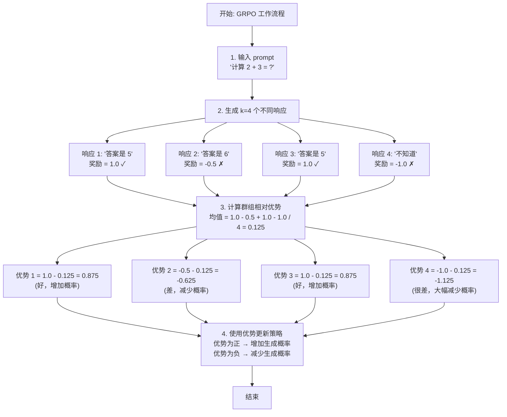

# 第四章：使用 GRPO 进行可验证奖励训练

> 配套代码：`grpotrainer.py`

## 承上启下

在前三章中，我们学习了：

- **第一章**：使用原生 Trainer 进行 SFT，理解了 Loss Masking 的核心概念
- **第二章**：使用 SFTTrainer 简化流程，实现了自动化的 SFT 训练
- **第三章**：使用 DPO 进行偏好对齐，让模型学习人类偏好

通过 DPO，我们成功让模型学习了：
- 如何区分好坏回答
- 生成更符合人类偏好的响应
- 在保持稳定性的同时提升质量

**但是**，DPO 有一个重要局限：它只能使用离线的偏好数据（chosen vs rejected 对），无法利用可验证的奖励信号（如数学题的正确性、代码的测试结果等）。

**本章将介绍 GRPO（Group Relative Policy Optimization）**——一种支持自定义奖励函数的强化学习方法！

## 本章学习目标

完成本章后，你将理解：

1. **可验证奖励** 的概念和价值
2. **GRPO** 与 DPO/PPO 的区别
3. **在线采样** 和 **群组相对优势** 的原理
4. **奖励函数设计** 的最佳实践
5. **GRPOTrainer** 的使用方法

## 1. DPO 的局限与 GRPO 的优势

### 1.1 DPO 无法处理的场景

```
**场景 1：数学问题**

**问题**：2 + 2 = ?

**模型响应 A**："答案是 4" ✓ 正确
**模型响应 B**："答案是 5" ✗ 错误

**DPO 的问题：**
- 需要预先标注 A 为 chosen，B 为 rejected
- 无法直接利用"答案是否正确"这个可验证的信号

**场景 2：代码生成**

**问题**：实现一个排序函数

**模型响应 A**：[生成代码]
**模型响应 B**：[生成代码]

**可验证奖励：**
- 运行单元测试 → 通过 = +1，失败 = -1
```

**DPO 的问题：**
- 无法直接利用测试结果
- 需要人工标注 chosen/rejected

### 1.2 GRPO 的核心优势

**GRPO = 在线采样 + 自定义奖励 + 群组相对优势**

**GRPO vs DPO 对比**

**DPO:**
- 数据: 离线 (prompt, chosen, rejected) 对
- 奖励: 隐式（通过偏好对学习）
- 适用: 主观偏好任务

**GRPO:**
- 数据: 只需 prompt
- 奖励: 显式、可自定义
- 适用: 可验证任务（数学、代码、推理等）

### 1.3 GRPO 的应用场景

| 任务类型 | 奖励函数设计 | 示例 |
|---------|-------------|------|
| **数学推理** | 答案正确性 | GSM8K, MATH |
| **代码生成** | 单元测试通过率 | HumanEval, MBPP |
| **逻辑推理** | 推理链有效性 | ReClor, LogiQA |
| **事实性** | 外部知识库验证 | TriviaQA |
| **多目标** | 加权组合奖励 | 正确性 + 效率 + 可读性 |

## 2. GRPO 算法原理

### 2.1 核心思想：群组相对优势

**传统 PPO 的问题**：
- 需要独立的价值网络（Value Network）估计优势
- 训练不稳定，需要大量调参

**GRPO 的创新**：
- 对每个 prompt 生成 **k 个响应**（如 k=4）
- 使用群组内的相对排名来估计优势
- 无需额外的价值网络



### 2.2 数学形式（简化版）

**GRPO 损失函数：**

$$
L = -\mathbb{E}[A(s,a) \cdot \log \pi_\theta(a|s)] + \beta \cdot \text{KL}(\pi_\theta || \pi_{\text{ref}})
$$

**其中：**

- $A(s,a) = r(s,a) - \text{mean}(r(s,\cdot))$ ← 群组相对优势
- $\pi_\theta$ = 策略模型（要训练的模型）
- $\pi_{\text{ref}}$ = 参考模型（冻结的 SFT 模型）
- $\beta$ = KL 正则化系数

**关键点：**

1. 优势是相对的（与同组其他响应比较）
2. 无需独立的价值函数估计
3. 包含 KL 正则化防止偏离参考模型太远

### 2.3 为什么叫"群组相对"？

**传统 RL**：需要估计绝对价值，"这个响应好吗？" → 需要价值网络

**GRPO**：只需要相对排名"，这个响应比同组其他响应好吗？" → 直接用奖励函数

**优势：**
- 简单：无需额外网络
- 稳定：相对比较更鲁棒
- 高效：减少训练成本

## 3. 奖励模型与奖励函数设计（本章核心）

### 3.1 奖励模型 vs 奖励函数：概念澄清

在 RLHF（Reinforcement Learning from Human Feedback）领域，"奖励模型"和"奖励函数"常被混用，但它们有重要区别：

**奖励函数（Reward Function）**

**定义**：基于规则和启发式的评分逻辑（代码实现）

- **输入**：prompt + response
- **输出**：reward (标量)
- **实现**：if/else 逻辑、正则表达式、规则检查

**示例**：
```python
def reward_function(prompt, response):
    if check_answer_correct(response):
        return 1.0
    else:
        return -1.0
```

**特点**：
- ✓ 可解释：每个分数都有明确理由
- ✓ 可控：可以精确调整规则
- ✓ 高效：计算速度快
- ✗ 局限：难以捕捉复杂模式
- ✗ 脆弱：可能被"规则漏洞"利用

**适用场景**：
- 有明确评估标准的任务（数学、代码测试）
- 需要可解释性的场景
- 快速原型开发

**奖励模型（Reward Model）**

**定义**：使用神经网络学习的奖励评估器

- **输入**：prompt + response
- **输出**：reward (标量)
- **实现**：神经网络（如 BERT、GPT 等）

**训练过程**：
1. 收集人工标注的偏好数据：
   - `{prompt, response_A, response_B, preference}`
   - 例如："response_A 比 response_B 好"

2. 训练奖励模型：
   - 最大化：`reward(prompt, better_response) > reward(prompt, worse_response)`

3. 使用训练好的模型打分：
   - `reward = reward_model(prompt, response)`

**特点**：
- ✓ 灵活：可以学习复杂的评估标准
- ✓ 泛化：可以处理未见过的情况
- ✗ 复杂：需要额外训练阶段
- ✗ 黑盒：不易解释为什么给出某个分数
- ✗ 成本：需要大量人工标注数据

**适用场景**：
- 主观性强的任务（风格、偏好）
- 难以形式化规则的任务
- 有充足标注资源的场景
- ChatGPT 风格的 RLHF 训练

**著名案例**：
- ChatGPT: 使用奖励模型进行 RLHF
- InstructGPT: 首次大规模应用奖励模型

**混合方法（推荐）**
```python
def hybrid_reward(prompt, response, ground_truth):
    """结合规则和模型的优势"""
    
    # 1. 基于规则的奖励（精确、可控）
    rule_reward = 0.0
    if check_answer_correct(response, ground_truth):
        rule_reward = 1.0
    
    # 2. 基于模型的奖励（捕捉细微质量差异）
    model_reward = reward_model.predict(prompt, response)
    
    # 3. 加权组合
    total_reward = 0.7 * rule_reward + 0.3 * model_reward
    
    return total_reward
```

### 3.2 奖励函数的作用与设计哲学

**奖励函数 = 告诉模型"什么是好的响应"**

这是 GRPO 训练中最关键的组件！

**输入**：prompt + response
**输出**：reward (标量，通常 [-1, 1] 或 [0, 1])

**示例：**
- `reward_function("2+2=?", "答案是4") → 1.0` ✓ 好
- `reward_function("2+2=?", "答案是5") → -1.0` ✗ 差

**关键问题**：如何设计一个好的奖励函数？

**奖励函数设计的重要性**

好的奖励函数 → 模型学到正确行为
差的奖励函数 → 模型学到错误捷径（Reward Hacking）

**真实案例 - Reward Hacking：**

❌ **案例 1**：OpenAI 的划船游戏 AI
- 目标：赢得比赛
- 奖励设计：获得分数 = +1
- 问题：AI 发现可以原地打转获得分数，而不是前进
- 结果：AI 学会了"刷分"而不是"赢得比赛"

❌ **案例 2**：代码生成任务
- 目标：生成正确的代码
- 奖励设计：代码能运行 = +1
- 问题：AI 生成了 pass 语句（总是能运行）
- 结果：AI 学会了"避免错误"而不是"解决问题"

✅ **好的奖励设计原则：**
1. 对齐真实目标（不是代理目标）
2. 防止捷径和漏洞
3. 多维度综合评估
4. 渐进式奖励塑形

### 3.3 可验证奖励设计（Verifiable Rewards）

可验证奖励是指可以通过客观标准验证的奖励信号，这是 GRPO 相对 DPO 的核心优势。

**类型 1：精确验证（Exact Verification）- 最推荐**

```python
def math_reward(prompt, response, ground_truth):
    """数学问题奖励函数"""
    predicted = extract_answer(response)
    if predicted == ground_truth:
        return 1.0  # 正确
    else:
        return -1.0  # 错误

优势: 清晰、明确、无歧义
适用: 数学、编程、事实性问答
```

**类型 2：部分分奖励**

```python
def code_reward(prompt, response, test_cases):
    """代码生成奖励函数"""
    code = extract_code(response)
    passed = run_tests(code, test_cases)
    total = len(test_cases)
    
    return passed / total  # [0, 1] 范围
    
优势: 鼓励部分正确的解决方案
适用: 复杂任务，有多个评估维度
```

**类型 3：启发式奖励**

```python
def reasoning_reward(prompt, response):
    """推理质量奖励函数"""
    reward = 0.0
    
    # 奖励 1: 长度适中
    length = len(response.split())
    if 50 <= length <= 300:
        reward += 0.3
    
    # 奖励 2: 包含推理关键词
    keywords = ['because', 'therefore', 'thus']
    if any(kw in response.lower() for kw in keywords):
        reward += 0.3
    
    # 奖励 3: 结构化（包含步骤）
    if 'step' in response.lower():
        reward += 0.4
    
    return reward

优势: 灵活，可以捕捉复杂特征
适用: 难以精确验证的任务
```

### 3.3 组合奖励设计

```python
def combined_reward(prompt, response, ground_truth):
    """多目标组合奖励"""
    
    # 主要奖励：正确性（权重 70%）
    correctness = 1.0 if check_correct(response, ground_truth) else 0.0
    
    # 次要奖励 1：效率（权重 15%）
    efficiency = compute_efficiency(response)
    
    # 次要奖励 2：可读性（权重 15%）
    readability = compute_readability(response)
    
    # 加权组合
    total_reward = (
        0.7 * correctness +
        0.15 * efficiency +
        0.15 * readability
    )
    
    return total_reward
```

### 3.4 奖励函数设计原则

**奖励函数设计的黄金法则**

**1. 明确性 (Clarity)**
- 好的响应应该获得高奖励，差的应该获得低奖励
- 避免模糊不清的奖励信号

**2. 区分度 (Discrimination)**
- 不同质量的响应应该有明显的奖励差异
- 避免所有响应都得到相似奖励

**3. 鲁棒性 (Robustness)**
- 对输入的小变化不应该导致奖励剧烈波动
- 考虑边界情况和异常输入

**4. 对齐性 (Alignment)**
- 奖励函数应该反映真实的任务目标
- 警惕奖励函数被"欺骗"（reward hacking）

**5. 可扩展性 (Scalability)**
- 对于大规模数据集，奖励计算应该高效
- 考虑批处理和并行化

### 3.5 高级话题：神经奖励模型

对于难以用规则定义的任务，可以训练一个神经网络作为奖励模型。

#### 3.5.1 奖励模型训练流程

```
第一阶段: 收集偏好数据
  1. 让模型生成多个响应
  2. 人工标注偏好:
     "Response A 比 Response B 好"
  
  数据格式:
    {
      "prompt": "写一首关于春天的诗",
      "chosen": "春风拂面暖人心...",
      "rejected": "春天很好..."
    }

第二阶段: 训练奖励模型
  模型架构:
    input: [prompt, response]
    output: scalar reward
  
  损失函数:
    L = -log(sigmoid(r_chosen - r_rejected))
  
  目标:
    让奖励模型学会: r(chosen) > r(rejected)

第三阶段: 使用奖励模型
  在 GRPO 训练中替换规则奖励函数:
    def reward_function(prompts, responses):
        return reward_model.predict(prompts, responses)
```

#### 3.5.2 实现示例（使用预训练模型）

```python
from transformers import AutoModelForSequenceClassification, AutoTokenizer

# 加载预训练的奖励模型（如 OpenAssistant 的奖励模型）
reward_model_name = "OpenAssistant/reward-model-deberta-v3-large-v2"
reward_model = AutoModelForSequenceClassification.from_pretrained(reward_model_name)
reward_tokenizer = AutoTokenizer.from_pretrained(reward_model_name)

def neural_reward_function(prompts, responses):
    """使用神经网络奖励模型"""
    rewards = []
    
    for prompt, response in zip(prompts, responses):
        # 拼接 prompt 和 response
        text = prompt + response
        
        # 编码
        inputs = reward_tokenizer(
            text,
            return_tensors="pt",
            truncation=True,
            max_length=512
        )
        
        # 预测奖励
        with torch.no_grad():
            reward = reward_model(**inputs).logits[0].item()
        
        rewards.append(reward)
    
    return rewards

# 在 GRPOTrainer 中使用
trainer = GRPOTrainer(
    model=model,
    reward_funcs=neural_reward_function,  # 使用神经奖励模型
    args=training_args,
    ...
)
```

#### 3.5.3 混合奖励策略（最佳实践）

```python
def hybrid_reward_function(prompts, responses, ground_truths):
    """
    结合规则奖励和神经奖励模型
    
    规则奖励: 确保基本正确性
    神经奖励: 捕捉细微质量差异
    """
    rewards = []
    
    for prompt, response, gt in zip(prompts, responses, ground_truths):
        # 1. 规则奖励（主要）- 权重 0.6
        rule_reward = 0.0
        
        # 检查答案正确性
        predicted = extract_answer(response)
        if predicted == gt:
            rule_reward = 1.0
        elif predicted is not None:
            rule_reward = 0.2  # 至少有尝试
        else:
            rule_reward = -0.5  # 无答案
        
        # 2. 神经奖励（次要）- 权重 0.4
        # 评估响应的流畅性、完整性等
        neural_reward = neural_reward_model(prompt, response)
        
        # 归一化到 [0, 1]
        neural_reward = (neural_reward + 1) / 2
        
        # 3. 组合
        total_reward = 0.6 * rule_reward + 0.4 * neural_reward
        rewards.append(total_reward)
    
    return rewards
```

#### 3.5.4 奖励模型的常见问题

**问题 1：奖励模型过拟合**
- **症状**：训练集奖励很高，但测试集质量差
- **原因**：模型学会了标注者的偏见
- **解决**：
  - 增加标注数据多样性
  - 使用正则化
  - 定期在测试集上评估

**问题 2：奖励黑客（Reward Hacking）**
- **症状**：模型生成不自然的文本但获得高奖励
- **原因**：奖励模型有漏洞
- **解决**：
  - 结合规则约束
  - 使用对抗训练
  - 人工定期审查

**问题 3：分布偏移（Distribution Shift）**
- **症状**：初期效果好，后期性能下降
- **原因**：生成的文本超出奖励模型训练分布
- **解决**：
  - 增加 KL 正则化
  - 使用在线更新的奖励模型
  - 混合使用规则奖励

**问题 4：计算成本高**
- **症状**：训练速度很慢
- **原因**：神经奖励模型推理耗时
- **解决**：
  - 使用更小的奖励模型
  - 批量推理
  - 量化奖励模型
  - 缓存奖励值

## 4. GRPOTrainer 深度解析

### 4.1 GRPOTrainer 的工作原理（重要！）

GRPOTrainer 是整个 GRPO 算法的实现，理解它的工作机制对于调试和优化训练至关重要。

#### 4.1.1 完整训练循环

**GRPOTrainer 单步训练流程（详细版）**

**输入**：1 个 batch 的 prompts (例如 batch_size=2)

**步骤 1：在线采样（Online Sampling）**
- 对每个 prompt：生成 k=4 个不同响应（使用当前策略模型 π_θ）
- 结果：2 prompts × 4 responses = 8 个响应

**示例：**
- **Prompt 1**："计算 5+3"
  - Response 1.1: "5+3=8"
  - Response 1.2: "首先5加3等于8，答案是8"
  - Response 1.3: "计算得出8"
  - Response 1.4: "结果为8"

- **Prompt 2**："计算 7-2"
  - Response 2.1: "7-2=5"
  - Response 2.2: "7减去2等于5"
  - Response 2.3: "答案是5"
  - Response 2.4: "计算结果5"

**步骤 2：奖励评估（Reward Evaluation）**
- 调用 `reward_function(prompts, responses)`

**示例奖励：**
- Prompt 1 的奖励：[0.5, 0.9, 0.6, 0.4]
- Prompt 2 的奖励：[0.7, 0.8, 0.5, 0.6]

**步骤 3：计算群组相对优势（Group Relative Advantage）**

对每个 prompt 的响应组：

- **Prompt 1**：
  - `mean_reward_1 = (0.5+0.9+0.6+0.4)/4 = 0.6`
  - `advantages_1 = [0.5-0.6, 0.9-0.6, 0.6-0.6, 0.4-0.6] = [-0.1, +0.3, 0.0, -0.2]`

- **Prompt 2**：
  - `mean_reward_2 = (0.7+0.8+0.5+0.6)/4 = 0.65`
  - `advantages_2 = [+0.05, +0.15, -0.15, -0.05]`

**步骤 4：计算策略损失（Policy Loss）**
- 对每个 (response, advantage)：
  - `log_prob = log π_θ(response | prompt)`
  - `policy_loss += -advantage * log_prob`

**理解：**
- `advantage > 0` → 增加生成该响应的概率
- `advantage < 0` → 减少生成该响应的概率

**步骤 5：KL 正则化（KL Regularization）**
- 计算当前模型与参考模型的 KL 散度：`kl_penalty = β * KL(π_θ || π_ref)`
- 作用：防止模型偏离参考模型太远

**步骤 6：总损失与反向传播**
- `total_loss = policy_loss + kl_penalty`
- `total_loss.backward()`
- `optimizer.step()`

**步骤 7：更新参考模型（可选）**
- 某些实现会定期更新参考模型为当前模型的 EMA

#### 4.1.2 群组相对优势的数学原理

**传统 PPO 的问题**：
- 需要价值网络 V(s) 估计状态价值
- `V(s) = E[未来累计奖励]`
- 优势函数：`A(s,a) = Q(s,a) - V(s)`
  - 其中 Q(s,a) 是动作价值（需要估计）

**问题**：
1. 需要额外训练价值网络（计算成本高）
2. 价值估计可能不准确（影响训练稳定性）
3. 实现复杂

**GRPO 的创新**：
不需要价值网络！使用群组相对优势

对每个 prompt 生成 k 个响应：`{r_1, r_2, ..., r_k}`

**优势估计**：
- `A(s, a_i) = R(s, a_i) - mean(R(s, ·))`
  - 其中：
    - `R(s, a_i)` = 响应 i 的奖励
    - `mean(R(s, ·))` = 同组所有响应的平均奖励

**直觉理解**：
- "这个响应比同组其他响应好多少？"
- → 不需要知道"绝对好"的标准
- → 只需要相对排名
- → 使用组内均值作为 baseline

**数学证明（简化）**：
```
E[A(s,a)] = E[R(s,a) - mean(R(s,·))]
          = E[R(s,a)] - E[mean(R(s,·))]
          = E[R(s,a)] - E[R(s,a)]
          = 0
```
- → 优势函数是零均值的
- → 减少方差，提高训练稳定性

**为什么有效？**
1. 自动归一化：不同 prompt 的奖励尺度不同，相对优势消除了这个问题
2. 减少方差：相对比较比绝对评估更稳定
3. 无需价值网络：大幅简化实现
4. 适应性强：自动适应不同难度的任务

#### 4.1.3 GRPOTrainer vs PPOTrainer 对比

| 维度 | PPOTrainer | GRPOTrainer |
|------|-----------|-------------|
| **价值网络** | 需要（V(s)） | ✗ 不需要 |
| **优势估计** | GAE（Generalized Advantage Estimation） | 群组相对优势 |
| **实现复杂度** | ★★★★★ 很复杂 | ★★★☆☆ 适中 |
| **训练稳定性** | ★★★☆☆ 需要调参 | ★★★★☆ 较稳定 |
| **显存占用** | ★★★★★ 很大（模型+价值网络） | ★★★★☆ 较大（模型+参考模型） |
| **计算成本** | 高（需要两个网络） | 中等（只需策略网络） |
| **适用场景** | 复杂的序列决策 | 文本生成任务 |

#### 4.1.4 参考模型的作用

**参考模型（Reference Model）π_ref**：
- 通常是训练前的 SFT 模型的副本
- 参数被冻结，不参与训练
- 作用：计算 KL 散度，防止模型偏离太远

**为什么需要参考模型？**

**问题：过度优化（Over-optimization）**
如果只优化奖励，模型可能会：
1. 生成奇怪的、不自然的文本
2. 利用奖励函数的漏洞（reward hacking）
3. 丧失预训练时学到的知识

**示例**：
- 奖励函数："包含数字 = +1"
- 过度优化后："1234567890" ← 高奖励但无意义

**解决：KL 正则化**
- `KL(π_θ || π_ref)` 衡量当前模型与参考模型的差异

**损失函数**：
```
L = -E[A * log π_θ] + β * KL(π_θ || π_ref)
     ^                    ^
     奖励优化              保持接近参考模型
```

**β (kl_coef) 控制平衡**：
- β 大 → 模型更保守，接近参考模型
- β 小 → 模型更激进，追求高奖励

**实际实现**：
GRPOTrainer 会自动创建参考模型：
1. 复制当前模型的参数
2. 冻结参数（requires_grad=False）
3. 仅用于计算 KL 散度

**监控指标**：
- `objective/kl`：KL 散度值
  - 理想范围：0.1 ~ 5.0
  - 过小 (<0.1)：模型几乎没有更新
  - 过大 (>10)：模型偏离太远，可能不稳定
```

### 4.2 基本配置

```python
from trl import GRPOConfig, GRPOTrainer

# GRPO 配置
training_args = GRPOConfig(
    output_dir="./grpo-output",
    
    # GRPO 核心参数
    num_generations=4,  # ★ 每个 prompt 生成几个响应
    temperature=0.7,    # ★ 采样温度
    kl_coef=0.05,       # ★ KL 正则化系数
    
    # 生成参数
    max_new_tokens=256,       # 生成的最大 token 数
    max_prompt_length=512,    # prompt 最大长度
    
    # 训练参数
    num_train_epochs=3,       # GRPO 可能需要更多 epochs
    per_device_train_batch_size=1,  # 通常较小
    gradient_accumulation_steps=8,   # 通过累积增加有效 batch
    learning_rate=1e-6,       # GRPO 用很小的学习率
    
    # 其他
    gradient_checkpointing=True,
    bf16=True,
)
```

### 4.2 关键参数详解

#### 参数 1：num_generations

**num_generations**：每个 prompt 生成的响应数量

**影响**：
- 训练信号稳定性（越大越稳定）
- 计算成本（越大越贵）
- 优势估计质量（越大越准确）

**推荐值**：
- `num_generations = 4-8`（标准）
- `num_generations = 2-4`（快速实验）
- `num_generations = 8-16`（高质量训练）

**注意**：
- 实际 `batch_size = per_device_batch_size * num_generations`
- 需要考虑显存限制

#### 参数 2：temperature

**temperature**：采样温度，控制生成的多样性

**影响**：
- **temperature 高**（如 1.0）：
  - → 生成更多样
  - → 探索更多可能性
  - → 但可能质量下降

- **temperature 低**（如 0.5）：
  - → 生成更确定
  - → 利用已知好的模式
  - → 但可能缺乏探索

**推荐值**：
- `temperature = 0.7-0.9`（标准）
- `temperature = 0.5-0.7`（保守，质量优先）
- `temperature = 0.9-1.2`（激进，探索优先）

**调整策略**：
- 训练初期：较高温度（探索）
- 训练后期：较低温度（利用）

#### 参数 3：kl_coef

**kl_coef**：KL 正则化系数，类似 DPO 的 beta

**作用**：
- 防止模型偏离参考模型太远
- `KL(π_θ || π_ref)` ← 惩罚项

**影响**：
- **kl_coef 大**（如 0.1）：
  - → 模型更保守
  - → 改进速度慢，但稳定

- **kl_coef 小**（如 0.01）：
  - → 模型更激进
  - → 改进速度快，但可能不稳定

**推荐值**：
- `kl_coef = 0.05`（标准）
- `kl_coef = 0.01-0.03`（激进）
- `kl_coef = 0.1-0.2`（保守）

**监控**：
- `objective/kl` 应该保持在 < 10
- 如果 KL 过大，增加 kl_coef

### 4.3 数据集准备

```python
# GRPO 只需要 prompt，不需要 response
# 因为响应会在训练时动态生成

from datasets import Dataset

# 方式 1: 从现有数据集加载
dataset = load_dataset("gsm8k", "main")
train_dataset = dataset["train"]

# 转换为 GRPO 格式
def format_for_grpo(sample):
    return {
        "query": format_prompt(sample["question"]),
        "ground_truth": sample["answer"]  # 用于奖励计算
    }

train_dataset = train_dataset.map(format_for_grpo)

# 方式 2: 自定义数据集
data = {
    "query": [
        "Question: What is 2+2? Answer:",
        "Question: What is 3+3? Answer:",
    ],
    "ground_truth": [4, 6]
}
train_dataset = Dataset.from_dict(data)
```

### 4.4 创建 GRPOTrainer

```python
from trl import GRPOTrainer

# 定义奖励函数
def reward_function(prompts, responses):
    """
    计算响应的奖励
    
    Args:
        prompts: List[str] - prompt 列表
        responses: List[str] - 响应列表
    
    Returns:
        List[float] - 奖励列表
    """
    rewards = []
    for prompt, response in zip(prompts, responses):
        reward = compute_reward(prompt, response)
        rewards.append(reward)
    return rewards

# 创建 trainer
trainer = GRPOTrainer(
    model=model,
    args=training_args,
    train_dataset=train_dataset,
    processing_class=tokenizer,
    reward_function=reward_function,  # ★ 自定义奖励函数
    peft_config=lora_config,
)

# 开始训练
trainer.train()
```

## 5. 训练监控与调试

### 5.1 关键指标

| 指标 | 含义 | 期望趋势 |
|------|------|----------|
| `rewards/mean` | 平均奖励 | ↑ 上升 |
| `rewards/best` | 最佳奖励 | ↑ 上升 |
| `rewards/worst` | 最差奖励 | ↑ 上升（但可以较慢） |
| `objective/kl` | KL 散度 | → 保持稳定（< 10） |
| `objective/entropy` | 策略熵 | → 保持适中 |
| `loss` | 训练损失 | ↓ 下降 |

### 5.2 训练阶段分析

```
典型训练曲线:

阶段 1: 快速改进期 (Step 0-500)
  rewards/mean: 0.2 → 0.5 → 0.7
  现象: 模型快速学习基本模式
  
阶段 2: 平稳提升期 (Step 500-2000)
  rewards/mean: 0.7 → 0.8 → 0.85
  现象: 模型优化细节
  
阶段 3: 收敛期 (Step 2000+)
  rewards/mean: 0.85 → 0.87 → 0.88
  现象: 改进变慢，接近上限
  
警告信号:
  ⚠️  rewards/mean 不上升 → 检查奖励函数或学习率
  ⚠️  objective/kl 过大 (>20) → 增加 kl_coef
  ⚠️  loss 不收敛 → 减小学习率
```

### 5.3 常见问题与解决方案

**问题 1: 平均奖励不上升**

```
可能原因:
  1. 奖励函数设计不当（所有响应奖励相同）
  2. 学习率过小或过大
  3. num_generations 太小（优势估计不准）
  4. 温度设置不当

解决方案:
  ✓ 检查奖励函数：确保有区分度
  ✓ 调整学习率：尝试 5e-7 或 2e-6
  ✓ 增加 num_generations 到 8
  ✓ 调整 temperature 到 0.8-1.0
```

**问题 2: KL 散度过大**

```
现象: objective/kl > 20

原因:
  模型偏离参考模型太远
  
解决方案:
  ✓ 增加 kl_coef (如从 0.05 → 0.1)
  ✓ 减小学习率
  ✓ 减少训练步数
```

**问题 3: 显存不足**

```
GRPO 显存占用 = base_model + num_generations * batch_size

解决方案:
  ✓ 减小 num_generations (8 → 4)
  ✓ 减小 per_device_train_batch_size (2 → 1)
  ✓ 启用 gradient_checkpointing
  ✓ 使用 4-bit 量化
  ✓ 减小 max_new_tokens
```

**问题 4: 训练速度慢**

```
GRPO 比 SFT/DPO 慢的原因:
  1. 需要在线生成响应
  2. 需要计算奖励函数
  3. 生成多个响应增加计算量

加速方案:
  ✓ 启用 Flash Attention
  ✓ 使用 bf16 混合精度
  ✓ 优化奖励函数计算
  ✓ 使用更少的 num_generations
```

## 6. 高级技巧

### 6.1 课程学习

```python
# 从简单任务到困难任务
def curriculum_learning():
    # 阶段 1: 简单问题（1 步推理）
    train_on_dataset(easy_dataset, epochs=2)
    
    # 阶段 2: 中等问题（2-3 步推理）
    train_on_dataset(medium_dataset, epochs=2)
    
    # 阶段 3: 困难问题（4+ 步推理）
    train_on_dataset(hard_dataset, epochs=2)

优势:
  ✓ 训练更稳定
  ✓ 最终效果更好
  ✓ 避免早期困难样本干扰
```

### 6.2 动态温度调整

```python
# 训练初期高温度（探索），后期低温度（利用）
def get_temperature(step, total_steps):
    start_temp = 1.0
    end_temp = 0.6
    progress = step / total_steps
    return start_temp - (start_temp - end_temp) * progress

# 在训练循环中：
# temperature = get_temperature(current_step, max_steps)
```

### 6.3 奖励塑形

```python
def shaped_reward(response, ground_truth):
    """渐进式奖励塑形"""
    base_reward = check_correctness(response, ground_truth)
    
    # 即使答案错误，也奖励中间步骤
    if base_reward == 0:
        # 检查是否有正确的中间步骤
        intermediate_reward = check_intermediate_steps(response)
        return 0.3 * intermediate_reward
    else:
        return 1.0

优势:
  ✓ 为部分正确的尝试提供正向信号
  ✓ 加速学习过程
```

### 6.4 多阶段训练

**推荐的完整训练流程**

**阶段 1：SFT (第一、二章)**
- → 让模型学会基本的指令遵循
- → 1-3 epochs

**阶段 2：DPO (第三章) [可选]**
- → 让模型学习人类偏好
- → 1-2 epochs

**阶段 3：GRPO (本章)**
- → 针对特定任务优化（使用可验证奖励）
- → 3-5 epochs

**结果**：既懂指令，又懂偏好，还能解决特定任务

## 7. 完整示例：数学问题求解

### 7.1 数据准备

```python
from datasets import load_dataset

# 加载 GSM8K 数据集
dataset = load_dataset("gsm8k", "main")

# 格式化为 GRPO 格式
def format_math_problem(sample):
    prompt = f"""Question: {sample['question']}

Please solve this step by step and provide your final answer after ####.

Answer:"""
    
    # 提取正确答案
    answer = extract_number(sample['answer'])
    
    return {
        "query": prompt,
        "ground_truth": answer
    }

train_dataset = dataset["train"].map(format_math_problem)
```

### 7.2 奖励函数

```python
import re

def math_reward_function(prompts, responses):
    """数学问题奖励函数"""
    rewards = []
    
    for prompt, response in zip(prompts, responses):
        reward = 0.0
        
        # 检查格式：是否包含 ####
        if "####" in response:
            reward += 0.2
        
        # 检查推理：是否包含数学运算
        if any(op in response for op in ['+', '-', '*', '/', '=']):
            reward += 0.2
        
        # 检查答案（如果有 ground_truth）
        predicted = extract_answer(response)
        if predicted is not None:
            reward += 0.2
            
            # 这里需要从 prompt 中恢复 ground_truth
            # 实际应用中需要维护映射
            # if predicted == ground_truth:
            #     reward += 0.4
        
        rewards.append(reward)
    
    return rewards
```

### 7.3 训练配置

```python
from trl import GRPOConfig, GRPOTrainer

# 配置
config = GRPOConfig(
    output_dir="./grpo-math-output",
    num_generations=6,        # 每题生成 6 个解答
    temperature=0.8,          # 适中的温度
    kl_coef=0.05,            # 标准 KL 系数
    max_new_tokens=300,      # 数学题需要较长推理
    learning_rate=5e-7,      # 较小学习率
    num_train_epochs=3,
    per_device_train_batch_size=1,
    gradient_accumulation_steps=16,
    gradient_checkpointing=True,
    bf16=True,
    logging_steps=10,
)

# 创建 trainer
trainer = GRPOTrainer(
    model=model,
    args=config,
    train_dataset=train_dataset,
    processing_class=tokenizer,
    reward_function=math_reward_function,
    peft_config=lora_config,
)

# 训练
trainer.train()
```

## 8. GRPO vs DPO vs PPO

### 8.1 三者对比

| 维度 | DPO | GRPO | PPO |
|------|-----|------|-----|
| **数据需求** | 离线偏好对 | 只需 prompt | 只需 prompt |
| **奖励函数** | 隐式 | 显式、可自定义 | 显式、可自定义 |
| **训练稳定性** | ★★★★★ | ★★★★☆ | ★★★☆☆ |
| **实现复杂度** | ★★☆☆☆ | ★★★☆☆ | ★★★★★ |
| **显存占用** | ★★★☆☆ | ★★★★☆ | ★★★★★ |
| **适用场景** | 主观偏好 | 可验证任务 | 复杂奖励 |
| **训练速度** | 快 | 中等 | 慢 |

### 8.2 选择建议

```
何时使用 DPO:
  ✓ 有高质量偏好对数据
  ✓ 主观性强的任务（风格、偏好）
  ✓ 希望训练稳定、快速

何时使用 GRPO:
  ✓ 有明确的可验证标准（数学、代码）
  ✓ 需要自定义奖励函数
  ✓ 推理密集型任务
  ✓ DeepSeek-R1 风格的应用

何时使用 PPO:
  ✓ 需要复杂的奖励塑形
  ✓ 多目标优化
  ✓ 有足够的工程资源
```

## 9. 实战案例：复现 DeepSeek-R1 风格训练

### 9.1 DeepSeek-R1 的训练特点

```
DeepSeek-R1 使用强化学习进行推理能力训练:
  1. 基于 SFT 模型开始
  2. 使用 GRPO-like 算法
  3. 奖励函数：正确性 + 推理质量
  4. 鼓励 "思维链" (Chain of Thought)
```

### 9.2 奖励函数设计

```python
def deepseek_r1_reward(prompt, response, ground_truth):
    """
    模仿 DeepSeek-R1 的奖励函数
    """
    total_reward = 0.0
    
    # 主奖励：答案正确性（权重 60%）
    if check_answer_correct(response, ground_truth):
        total_reward += 0.6
    
    # 奖励 1：推理步骤数量（权重 15%）
    # 鼓励详细的推理过程
    num_steps = count_reasoning_steps(response)
    if 3 <= num_steps <= 10:
        total_reward += 0.15
    elif num_steps > 10:
        total_reward += 0.10  # 太多步骤略微惩罚
    
    # 奖励 2：逻辑连贯性（权重 15%）
    # 检查推理链是否合理
    if has_logical_flow(response):
        total_reward += 0.15
    
    # 奖励 3：自我验证（权重 10%）
    # 鼓励模型检查自己的答案
    if has_self_verification(response):
        total_reward += 0.10
    
    return total_reward

def count_reasoning_steps(text):
    """统计推理步骤数量"""
    # 简单启发式：查找 "Step", "First", "Then", "Finally" 等
    keywords = ['step', 'first', 'second', 'then', 'next', 'finally']
    count = sum(1 for kw in keywords if kw in text.lower())
    return count

def has_logical_flow(text):
    """检查是否有逻辑连接词"""
    connectors = ['therefore', 'because', 'since', 'thus', 'so']
    return any(conn in text.lower() for conn in connectors)

def has_self_verification(text):
    """检查是否有自我验证"""
    verification_phrases = ['check', 'verify', 'confirm', 'let me verify']
    return any(phrase in text.lower() for phrase in verification_phrases)
```

### 9.3 训练配置

```python
# DeepSeek-R1 风格的训练配置
config = GRPOConfig(
    output_dir="./grpo-reasoning-output",
    
    # 生成配置：鼓励探索
    num_generations=8,        # 较多生成数以稳定训练
    temperature=0.9,          # 较高温度以增加多样性
    max_new_tokens=512,       # 允许较长的推理过程
    
    # 优化配置
    kl_coef=0.03,            # 较小 KL 系数，允许更多探索
    learning_rate=1e-6,      # 很小的学习率
    
    # 训练配置
    num_train_epochs=5,      # 较多 epochs
    per_device_train_batch_size=1,
    gradient_accumulation_steps=16,
    
    # 效率配置
    gradient_checkpointing=True,
    bf16=True,
)
```

## 10. 运行代码

### 10.1 环境准备

```bash
# 安装依赖
pip install transformers datasets peft bitsandbytes accelerate trl

# 可选：安装 Flash Attention 以加速训练
pip install flash-attn --no-build-isolation
```

### 10.2 快速开始

```bash
# 运行训练
python grpotrainer.py

# 监控训练（如果使用 tensorboard）
tensorboard --logdir ./grpo-training-output/logs
```

### 10.3 自定义配置

在 `grpotrainer.py` 中修改：

```python
# 模型
MODEL_NAME = "Qwen/Qwen3-8B"

# 数据集
DATASET_NAME = "gsm8k"  # 或其他数据集

# GRPO 参数
NUM_GENERATIONS = 4     # 每个 prompt 生成数
KL_COEF = 0.05         # KL 正则化系数
TEMPERATURE = 0.7      # 采样温度

# 修改奖励函数（在代码中）
def reward_function(prompts, responses):
    # 你的自定义奖励逻辑
    ...
```

## 11. 本章小结

| 概念 | 说明 |
|------|------|
| **GRPO** | 群组相对策略优化，支持自定义奖励 |
| **可验证奖励** | 基于明确标准的奖励（如正确性） |
| **群组相对优势** | 使用同组响应的相对排名估计优势 |
| **在线采样** | 训练时动态生成响应，而非使用离线数据 |
| **num_generations** | 关键参数，控制每个 prompt 的采样数 |

## 12. 进阶方向

### 12.1 更高级的 RL 算法

```
GRPO 之后的方向:

1. PPO (Proximal Policy Optimization)
   - 传统 RLHF 方法
   - 更复杂，但更灵活
   - 需要独立的价值网络

2. Expert Iteration
   - 结合搜索和学习
   - 适用于可搜索任务（如数学、下棋）
   
3. Constitutional AI
   - 基于规则的价值观对齐
   - Anthropic 的 Claude 使用的方法
```

### 12.2 奖励函数的未来

```
当前: 人工设计奖励函数
  └─→ 需要领域知识
  └─→ 可能存在漏洞

未来: AI 辅助奖励设计
  ├── 使用强模型（如 GPT-4）作为奖励模型
  ├── 自动发现奖励函数
  ├── 多模态奖励（文本 + 图像 + 代码执行）
  └── 自我改进的奖励函数
```

## 12. GRPOTrainer 与奖励模型协作实战

### 12.1 实现一个完整的奖励系统

本节展示如何实现一个生产级的奖励系统，包括规则奖励、启发式奖励和神经奖励模型的组合。

```python
import torch
import re
from typing import List, Dict, Tuple

class RewardSystem:
    """
    完整的奖励系统，支持多种奖励策略
    """
    
    def __init__(
        self,
        use_rule_reward=True,
        use_heuristic_reward=True,
        use_neural_reward=False,
        neural_reward_model=None,
        weights=None
    ):
        """
        Args:
            use_rule_reward: 是否使用规则奖励（基于正确性）
            use_heuristic_reward: 是否使用启发式奖励（格式、长度等）
            use_neural_reward: 是否使用神经奖励模型
            neural_reward_model: 预训练的奖励模型
            weights: 各奖励组件的权重，默认 [0.5, 0.3, 0.2]
        """
        self.use_rule_reward = use_rule_reward
        self.use_heuristic_reward = use_heuristic_reward
        self.use_neural_reward = use_neural_reward
        self.neural_reward_model = neural_reward_model
        
        # 默认权重：规则最重要，启发式次之，神经模型最后
        self.weights = weights or [0.5, 0.3, 0.2]
    
    def compute_rule_reward(self, response: str, ground_truth: float) -> float:
        """
        基于规则的奖励：验证答案正确性
        """
        predicted = self.extract_answer(response)
        
        if predicted is None:
            return -1.0
        
        try:
            if abs(predicted - ground_truth) < 1e-3:
                return 1.0  # 完全正确
            else:
                return -0.5  # 错误但有尝试
        except:
            return -1.0
    
    def compute_heuristic_reward(self, response: str) -> float:
        """
        启发式奖励：评估响应质量
        """
        reward = 0.0
        
        # 1. 格式奖励
        if "####" in response:
            reward += 0.3
        
        # 2. 长度奖励
        length = len(response.split())
        if 50 <= length <= 300:
            reward += 0.3
        elif length < 20:
            reward -= 0.2
        
        # 3. 推理奖励
        reasoning_keywords = ['because', 'so', 'therefore', 'thus', 'first', 'then']
        if any(kw in response.lower() for kw in reasoning_keywords):
            reward += 0.2
        
        # 4. 数学符号奖励
        math_symbols = ['+', '-', '*', '/', '=']
        if any(sym in response for sym in math_symbols):
            reward += 0.2
        
        return reward
    
    def compute_neural_reward(self, prompt: str, response: str) -> float:
        """
        神经奖励模型：使用预训练模型评分
        """
        if not self.use_neural_reward or self.neural_reward_model is None:
            return 0.0
        
        # 这里应该调用实际的神经奖励模型
        # 示例实现
        with torch.no_grad():
            score = self.neural_reward_model.predict(prompt, response)
        
        return float(score)
    
    def compute_total_reward(
        self,
        prompt: str,
        response: str,
        ground_truth: float = None
    ) -> Tuple[float, Dict[str, float]]:
        """
        计算总奖励（组合所有奖励）
        
        Returns:
            total_reward: 总奖励值
            reward_breakdown: 各组件奖励的详细信息
        """
        rewards = {}
        
        # 1. 规则奖励
        if self.use_rule_reward and ground_truth is not None:
            rewards['rule'] = self.compute_rule_reward(response, ground_truth)
        else:
            rewards['rule'] = 0.0
        
        # 2. 启发式奖励
        if self.use_heuristic_reward:
            rewards['heuristic'] = self.compute_heuristic_reward(response)
        else:
            rewards['heuristic'] = 0.0
        
        # 3. 神经奖励
        if self.use_neural_reward:
            rewards['neural'] = self.compute_neural_reward(prompt, response)
        else:
            rewards['neural'] = 0.0
        
        # 加权组合
        total_reward = (
            self.weights[0] * rewards['rule'] +
            self.weights[1] * rewards['heuristic'] +
            self.weights[2] * rewards['neural']
        )
        
        rewards['total'] = total_reward
        return total_reward, rewards
    
    def batch_compute_rewards(
        self,
        prompts: List[str],
        responses: List[str],
        ground_truths: List[float] = None
    ) -> Tuple[List[float], List[Dict[str, float]]]:
        """
        批量计算奖励（GRPOTrainer 接口）
        """
        rewards = []
        breakdowns = []
        
        for i, (prompt, response) in enumerate(zip(prompts, responses)):
            gt = ground_truths[i] if ground_truths else None
            reward, breakdown = self.compute_total_reward(prompt, response, gt)
            rewards.append(reward)
            breakdowns.append(breakdown)
        
        return rewards, breakdowns
    
    @staticmethod
    def extract_answer(text: str) -> float:
        """提取答案（与之前相同）"""
        match = re.search(r'####\s*(-?\d+(?:,\d+)*(?:\.\d+)?)', text)
        if match:
            answer_str = match.group(1).replace(',', '')
            try:
                return float(answer_str)
            except ValueError:
                pass
        
        numbers = re.findall(r'-?\d+(?:,\d+)*(?:\.\d+)?', text)
        if numbers:
            answer_str = numbers[-1].replace(',', '')
            try:
                return float(answer_str)
            except ValueError:
                pass
        
        return None


# 使用示例
reward_system = RewardSystem(
    use_rule_reward=True,
    use_heuristic_reward=True,
    use_neural_reward=False,  # 暂不使用神经模型
    weights=[0.6, 0.4, 0.0]  # 规则权重更高
)

# 在 GRPOTrainer 中使用
def grpo_reward_function(prompts, completions, **kwargs):
    """适配 GRPOTrainer 的奖励函数"""
    # 注意：这里没有 ground_truth，所以只能用启发式
    rewards, breakdowns = reward_system.batch_compute_rewards(
        prompts, completions, ground_truths=None
    )
    
    # 可选：记录奖励分解用于分析
    # log_reward_breakdown(breakdowns)
    
    return rewards

trainer = GRPOTrainer(
    model=model,
    reward_funcs=grpo_reward_function,
    args=training_args,
    ...
)
```

### 12.2 高级奖励策略：自适应权重

```python
class AdaptiveRewardSystem(RewardSystem):
    """
    自适应奖励系统：根据训练进度调整奖励权重
    """
    
    def __init__(self, *args, **kwargs):
        super().__init__(*args, **kwargs)
        self.training_step = 0
        self.total_steps = 1000  # 总训练步数
    
    def update_weights(self, step: int):
        """
        根据训练进度调整权重
        
        策略：
          - 初期（0-30%）：更依赖启发式（鼓励探索）
          - 中期（30-70%）：平衡规则和启发式
          - 后期（70-100%）：更依赖规则（精确优化）
        """
        progress = step / self.total_steps
        
        if progress < 0.3:
            # 初期：探索阶段
            self.weights = [0.3, 0.5, 0.2]  # 启发式权重高
        elif progress < 0.7:
            # 中期：平衡阶段
            self.weights = [0.5, 0.3, 0.2]  # 平衡
        else:
            # 后期：利用阶段
            self.weights = [0.7, 0.2, 0.1]  # 规则权重高
        
        self.training_step = step
```

### 12.3 奖励监控与可视化

```python
import numpy as np
import matplotlib.pyplot as plt
from collections import defaultdict

class RewardMonitor:
    """
    奖励监控器：跟踪和分析奖励分布
    """
    
    def __init__(self):
        self.history = defaultdict(list)
    
    def log(self, step: int, rewards: List[float], breakdowns: List[Dict]):
        """记录奖励"""
        self.history['step'].append(step)
        self.history['mean_reward'].append(np.mean(rewards))
        self.history['std_reward'].append(np.std(rewards))
        self.history['max_reward'].append(np.max(rewards))
        self.history['min_reward'].append(np.min(rewards))
        
        # 记录各组件奖励
        for component in ['rule', 'heuristic', 'neural']:
            values = [b.get(component, 0.0) for b in breakdowns]
            self.history[f'{component}_mean'].append(np.mean(values))
    
    def plot(self):
        """绘制奖励曲线"""
        fig, axes = plt.subplots(2, 2, figsize=(12, 8))
        
        # 1. 总奖励趋势
        ax = axes[0, 0]
        ax.plot(self.history['step'], self.history['mean_reward'], label='Mean')
        ax.fill_between(
            self.history['step'],
            np.array(self.history['mean_reward']) - np.array(self.history['std_reward']),
            np.array(self.history['mean_reward']) + np.array(self.history['std_reward']),
            alpha=0.3
        )
        ax.set_title('Total Reward Over Time')
        ax.set_xlabel('Step')
        ax.set_ylabel('Reward')
        ax.legend()
        ax.grid(True)
        
        # 2. 奖励组件分解
        ax = axes[0, 1]
        ax.plot(self.history['step'], self.history['rule_mean'], label='Rule')
        ax.plot(self.history['step'], self.history['heuristic_mean'], label='Heuristic')
        ax.plot(self.history['step'], self.history['neural_mean'], label='Neural')
        ax.set_title('Reward Components')
        ax.set_xlabel('Step')
        ax.set_ylabel('Component Reward')
        ax.legend()
        ax.grid(True)
        
        # 3. 奖励范围
        ax = axes[1, 0]
        ax.plot(self.history['step'], self.history['max_reward'], label='Max')
        ax.plot(self.history['step'], self.history['min_reward'], label='Min')
        ax.set_title('Reward Range')
        ax.set_xlabel('Step')
        ax.set_ylabel('Reward')
        ax.legend()
        ax.grid(True)
        
        # 4. 奖励分布
        ax = axes[1, 1]
        recent_rewards = self.history['mean_reward'][-100:]
        ax.hist(recent_rewards, bins=20, edgecolor='black')
        ax.set_title('Recent Reward Distribution')
        ax.set_xlabel('Reward')
        ax.set_ylabel('Frequency')
        ax.grid(True)
        
        plt.tight_layout()
        plt.savefig('reward_analysis.png')
        plt.close()
```

### 12.4 调试奖励函数

```python
def debug_reward_function(
    reward_system: RewardSystem,
    test_cases: List[Dict]
):
    """
    调试奖励函数：检查奖励是否符合预期
    """
    print("=" * 80)
    print("Reward Function Debug Report")
    print("=" * 80)
    
    for i, case in enumerate(test_cases):
        prompt = case['prompt']
        response = case['response']
        expected_range = case.get('expected_range', None)
        
        reward, breakdown = reward_system.compute_total_reward(
            prompt, response, ground_truth=case.get('ground_truth')
        )
        
        print(f"\nTest Case {i+1}:")
        print(f"Prompt: {prompt[:50]}...")
        print(f"Response: {response[:50]}...")
        print(f"Total Reward: {reward:.3f}")
        print(f"Breakdown:")
        for component, value in breakdown.items():
            print(f"  - {component}: {value:.3f}")
        
        if expected_range:
            low, high = expected_range
            status = "✓ PASS" if low <= reward <= high else "✗ FAIL"
            print(f"Expected Range: [{low}, {high}] - {status}")
    
    print("=" * 80)

# 使用示例
test_cases = [
    {
        'prompt': "What is 2+2?",
        'response': "2+2=4. #### 4",
        'ground_truth': 4.0,
        'expected_range': (0.8, 1.5)  # 应该获得高奖励
    },
    {
        'prompt': "What is 2+2?",
        'response': "I don't know",
        'ground_truth': 4.0,
        'expected_range': (-1.0, 0.0)  # 应该获得负奖励
    },
]

debug_reward_function(reward_system, test_cases)
```

## 系列总结

恭喜你完成了完整的 LLM 微调教程系列！

**完整学习路径回顾**

| 章节 | 主要内容 | 核心技能 |
|------|---------|----------|
| **第一章: Trainer** | Loss Masking、量化、LoRA | ✅ 手动 SFT 实现 |
| **第二章: SFTTrainer** | TRL 库、自动化 SFT | ✅ 高效 SFT 训练 |
| **第三章: DPO** | 偏好对齐、离线 RL | ✅ 人类偏好学习 |
| **第四章: GRPO** | 可验证奖励、在线 RL | ✅ 任务特定优化 |

**你现在可以：**
- ✅ 从零开始微调 LLM
- ✅ 理解不同训练方法的适用场景
- ✅ 设计自定义奖励函数
- ✅ 针对特定任务优化模型
- ✅ 复现主流模型的训练流程

## 推荐资源

### 论文

- [GRPO 原理相关：Group Relative Policy Optimization](https://arxiv.org/abs/2402.03300)
- [DeepSeek-R1: Incentivizing Reasoning Capability in LLMs](https://arxiv.org/abs/2401.02954)
- [PPO: Proximal Policy Optimization](https://arxiv.org/abs/1707.06347)

### 代码库

- [Hugging Face TRL](https://github.com/huggingface/trl) - 官方 RL 训练库
- [OpenRLHF](https://github.com/OpenLLMAI/OpenRLHF) - 开源 RLHF 框架

### 数据集

- [GSM8K](https://github.com/openai/grade-school-math) - 数学推理
- [HumanEval](https://github.com/openai/human-eval) - 代码生成
- [MATH](https://github.com/hendrycks/math) - 高难度数学

---

> **常见问题**
>
> **Q: GRPO 训练速度很慢怎么办？**  
> A: 1) 减小 num_generations  2) 启用 Flash Attention  3) 优化奖励函数计算  4) 使用更小的数据集快速迭代
>
> **Q: 平均奖励不上升？**  
> A: 1) 检查奖励函数是否有区分度  2) 增加 num_generations  3) 调整学习率  4) 检查温度设置
>
> **Q: GRPO 和 DPO 能否结合使用？**  
> A: 可以！推荐流程：SFT → DPO → GRPO，这样模型既有通用能力，又能针对特定任务优化
>
> **Q: 如何评估 GRPO 训练效果？**  
> A: 1) 监控 rewards/mean 上升趋势  2) 在测试集上评估任务指标（如数学题准确率）  3) 人工评估生成质量

---

**祝你在 LLM 微调和强化学习的道路上越走越远！** 🚀


