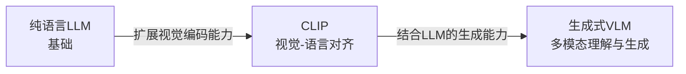

# 从 LLM 到 VLM:语言模型如何实现视觉理解

多模态大模型的发展呈现出一条清晰的技术演进路径:从纯语言LLM开始,到CLIP实现视觉-语言对齐,再到生成式VLM,以及目前百花齐放的各类架构（Lecun搞得JEAP是其中感觉很有趣的一个）。本文系统梳理这个技术脉络,分析各类模型的核心原理与架构创新。

本文包含四个主要部分:**从纯文本到多模态**(LLM→CLIP→VLM的技术演进)、**扩展话题**(扩散模型、原生多模态与幻觉问题)、**JEPA-VL**(从对比学习到联合嵌入预测)、以及**附录**(核心基础概念补充,包括Cross Attention、交叉熵、Softmax等)。

---

## 从纯文本到多模态

多模态AI的发展并非一蹴而就,而是经历了一条清晰的技术演进路线。这条路线呈现出鲜明的层次递进特征:**每一阶段都在前一阶段的基础上扩展,前者是后者的技术基础和构建基石**。

**演进路径**:

本节将深入剖析这三个阶段的技术原理,重点阐述它们之间的继承关系和演进逻辑。

---

### 阶段一:纯语言模型LLM——单一模态的智力引擎

**LLM是多模态技术演进的起点和基础**。理解LLM的能力架构,对于后续理解CLIP和VLM的设计思路至关重要。

LLM(大语言模型)是**单一模态的智力引擎**,采用Transformer Decoder-only架构,通过大规模文本预训练掌握了语言理解与生成的通用能力。其核心技术是通过自回归方式预测下一个Token(Next Token Prediction),再经过指令微调和人类对齐(RLHF/DPO)提升任务性能。

但LLM存在根本局限:**只能处理文本,无法直接感知图像、音频等多模态信息**。这个局限催生了多模态扩展的技术需求:**如何让LLM"看见"图像?** 两条技术路线由此诞生:
1. **CLIP路线**:构建视觉-语言对齐,让图像和文本嵌入到同一个向量空间
2. **VLM路线**:直接给LLM装上"眼睛",让其能看图说话

---

### 阶段二:CLIP——搭建视觉与语言的桥梁

CLIP(Contrastive Language-Image Pre-training)的诞生标志着AI首次实现了**视觉与语言的有效对齐**。它不是生成模型,而是嵌入模型,但搭建了一座桥梁,让图像和文本可以在同一个向量空间中比较。

**与LLM的关系**:
- CLIP的**文本编码器**直接继承了LLM的Transformer架构
- CLIP复用了LLM的文本理解能力,但将其迁移到视觉-语言对齐任务
- CLIP的训练目标从"预测下一个Token"转变为"对齐图文嵌入"

#### 核心定位:视觉-语言对齐模型

CLIP的本质是**嵌入模型(Embedding Model)**,其创新之处在于:将图像和文本映射到同一个低维向量空间(嵌入空间),使得语义相似的图文对在空间中距离更近。

**解决的核心问题**:
- 纯视觉模型(如ResNet)只能输出固定类别标签,无法理解自然语言
- 纯语言模型无法"看见"图像
- CLIP构建了视觉与语言之间的桥梁,实现了跨模态的语义对齐

#### 架构设计:双塔结构(Dual-Encoder)

CLIP采用的"双塔"设计具有鲜明特点——视觉编码器和文本编码器独立工作,互不干扰,仅在最后通过相似度计算进行交互。

##### 视觉编码器(Visual Encoder)

**基础架构**:通常使用 **ViT (Vision Transformer)** 系列(如ViT-L/14或ViT-g)

**工作流程**:
1. **图像分块**:将输入图像切分为 $N$ 个小方块(Patch),例如 $16 \times 16$ 像素
2. **展平与映射**:每个Patch被展平并通过线性映射变成向量
3. **添加位置编码**:为每个Patch添加位置信息
4. **Transformer处理**:通过多层Transformer进行特征提取和交互
5. **输出取样**:取特殊的 **[CLS] Token** 的输出向量作为全局视觉表示

**输出**:一个代表整张图像语义的**全局特征向量(Visual Embedding)**,维度如 $d=512$

##### 文本编码器(Text Encoder)

**基础架构**:标准的Transformer Encoder(**继承自LLM架构**)

**工作流程**:
1. **分词**:文本被Tokenizer切分为Token序列,如 `[SOS, A, dog, is, running, EOS, PAD...]`
2. **嵌入**:将每个Token转换为向量
3. **Transformer处理**:多层Self-Attention让每个Token都能"看到"上下文
4. **输出取样**:取 **[EOS] Token**(End of Sequence)位置的输出向量

**输出**:一个代表整句话语义的**全局文本向量(Text Embedding)**

##### 对齐机制

两座塔独立工作,**没有复杂的跨模态交互层**。它们仅在最后通过计算两个向量的**余弦相似度**进行交互。

$$ \text{Similarity} = \cos(\theta) = \frac{\text{Visual\_Embedding} \cdot \text{Text\_Embedding}}{\|\text{Visual\_Embedding}| \cdot |\text{Text\_Embedding}|} $$

#### 训练目标:对比学习(Contrastive Learning)

CLIP的核心创新在于训练方式——**对比学习**。其目标很明确:**让匹配的图文对距离拉近,让不匹配的图文对距离推远**。

##### InfoNCE Loss (CLIP的标准做法)

**核心思想**:在一个Batch中,将图文匹配视为一个多分类问题。

**场景设置**：假设一个Batch中有 $N$ 对(图,文),记为 $(I_1, T_1), (I_2, T_2), ..., (I_N, T_N)$。其中**正样本**是对角线上的配对 $(I_i, T_i)$,即匹配的图文对；而**负样本**则是对于图片 $I_i$,同一Batch内的其他 $N-1$ 个文本 $(T_j, j \neq i)$。

**计算过程**：首先计算所有图文向量的两两余弦相似度,构建 $N \times N$ 的相似度矩阵。对于第 $i$ 张图像,通过 Softmax 函数将其与所有文本的相似度归一化为概率分布,得到匹配正确文本 $T_i$ 的预测概率。损失函数使用经典的多分类交叉熵损失：

$$ L_i = -\log \frac{\exp(sim(I_i, T_i) / \tau)}{\sum_{j=1}^{N} \exp(sim(I_i, T_j) / \tau)} $$

**符号解释**:
- $sim(I_i, T_i)$:第 $i$ 张图和第 $i$ 段文本的相似度
- $\tau$ (Tau):**温度系数(Temperature)**,控制分布的"尖锐程度"
  - $\tau$ 很小:相似度的细微差异被放大,模型专注区分最难区分的负样本
  - $\tau$ 很大:分布变得更平滑
- $\exp(\cdot) / \sum \exp(\cdot)$:Softmax函数,把相似度数值转换成概率

**核心逻辑**:
InfoNCE强迫模型在 $N$ 个选项中"挑出"正确的那个。对于正样本对,梯度让两者靠近;对于负样本对,梯度让两者远离。

**局限性**:
InfoNCE依赖Batch Size。Batch越大,负样本越多,任务越难,模型学到的特征越好。如果Batch小,模型很容易随机猜对。

##### SigLIP (Sigmoid Loss改进)

SigLIP是谷歌提出的改进方案,其核心思想是将多分类问题转化为 $N \times N$ 个独立的二分类问题。与InfoNCE不同,SigLIP不再依赖Softmax的全局归一化,从而避免了分布式训练中计算分母全局和所带来的通信开销。

**算法原理**：对于相似度矩阵中的每个元素 $(i, j)$,根据是否为正样本对分别设定目标标签。当 $i=j$ 时为正样本对,标签 $y_{ij}=1$,期望Sigmoid输出接近1；当 $i \neq j$ 时为负样本对,标签 $y_{ij}=0$,期望Sigmoid输出接近0。损失函数定义为：

$$ L = - \frac{1}{N} \sum_{i}\sum_{j} \left[ y_{ij} \log \sigma(z_{ij}) + (1-y_{ij}) \log (1-\sigma(z_{ij})) \right] $$

**符号解释**：
- $N$: Batch中图文对的数量
- $y_{ij}$: 二分类标签，$y_{ij}=1$ 表示正样本对 $(i=j)$，$y_{ij}=0$ 表示负样本对 $(i \neq j)$
- $z_{ij}$: 第 $i$ 张图与第 $j$ 段文本的相似度分数
- $\sigma(\cdot)$: Sigmoid函数，替代了多分类的Softmax

该方法具有显著优势：其一,由于无需GPU间同步分母的全局和,可支持超大规模Batch训练(如32k规模)；其二,实验表明在同等模型规模下,SigLIP在零样本分类任务上的性能通常优于InfoNCE。

#### CLIP的嵌入空间对齐与能力边界

CLIP通过构建统一的视觉-语言嵌入空间,实现了跨模态的语义对齐。这种对齐机制赋予了模型两类核心能力:**零样本分类**与**跨模态检索**。

在零样本分类任务中,CLIP无需针对特定类别训练,只需将类别名称转化为自然语言描述(如"一张{类别}的照片"),计算图像与各类别文本描述的相似度,即可完成分类。这种跨模态检索成本极低，无论是"以图搜文"还是"以文搜图",CLIP均可在毫秒级完成向量点积计算。

然而,这种嵌入空间的表征方式也带来了固有的局限性。CLIP的编码器在对比学习驱动下,倾向于保留**全局语义**而丢弃细节信息(如OCR文字、物体数量、精确空间位置),只要图文大体匹配即可满足训练目标。

更重要的是,CLIP仅包含编码器架构,缺失解码器模块,因此无法执行"预测下一个词"的自回归生成操作——它能够判断"像不像"、"是不是",却无法"说出"图像内容、推理图像关系或描述复杂场景。这种判别式能力的局限直接催生了VLM的需求:模型需要既能"看"又能"说",在嵌入空间对齐的基础上进一步实现视觉引导的文本生成。

---

### 阶段三:生成式VLM——给LLM装上眼睛

CLIP解决了"视觉-语言对齐"问题,但它无法"说话"。生成式VLM(Visual Language Model)的诞生,正是为了弥补这个缺陷——**给LLM装上眼睛,让它不仅能"看"懂图像,还能"说"出理解**。

代表模型包括LLaVA、InstructBLIP、Qwen-VL、MiniGPT-4等,这些LVLM(Large Vision-Language Model)本质上是利用CLIP的视觉能力提取特征,再通过对齐层"翻译"给LLM,最后利用LLM的强大表达能力生成文本,从而实现对图像内容的详细描述、推理和问答。

**与LLM和CLIP的继承关系**:
- VLM的**语言底座直接复用LLM**(如Vicuna, Qwen-7B),继承其强大的语言表达能力
- VLM的**视觉编码器直接复用CLIP**(如CLIP ViT-L/14),继承其学到的视觉表征
- VLM的创新在于**对齐层**,将CLIP的视觉特征"翻译"给LLM理解

#### 架构设计:三段式结构

生成式VLM采用"视觉编码器-语言模型-模态对齐层"的三段式架构,各组件分工明确且相互配合。

**视觉编码器(Visual Encoder)**负责图像特征提取,其设计哲学是**复用预训练好的CLIP/SigLIP**(冻结参数)。CLIP通过对比学习已经掌握了极好的视觉表征,直接复用可以省去从头训练的过程,同时降低训练成本并防止灾难性遗忘。Qwen-VL早期采用基于CLIP ViT的结构,InstructBLIP使用ViT-g/14,VLM直接继承CLIP的视觉编码器而无需重新训练视觉表征能力。

**语言模型底座(LLM Backbone)**的设计哲学同样是**复用纯语言LLM**(如Vicuna、Qwen-7B)。纯LLM已经掌握了强大的语言表达、逻辑推理和世界知识,直接复用可以快速获得多模态能力并保持原有的纯文本能力。LLM接收视觉特征(作为特殊的"视觉Token")和文本Prompt,进行自回归生成以预测下一个Token。InstructBLIP使用Vicuna(微调过的Llama),Qwen-VL使用Qwen-7B,LLaVA同样使用Vicuna,VLM直接复用LLM的预训练权重,继承其语言理解和生成能力。

**模态对齐层(Adapter/Projector)** 是VLM架构的核心创新,作为"翻译官"负责将视觉特征"翻译"成LLM能理解的语言。当前存在两种主流设计理念,分别代表了简单高效与精细提取两种技术路线。

**方案一:LLaVA (Linear/MLP Projection)——简单高效派**

LLaVA采用最直接的两层MLP结构(Linear → Gelu → Linear),其核心假设是视觉特征和语言嵌入在某个线性空间可以对齐。

- **架构设计**:
  - 视觉编码器:CLIP ViT-L/14(冻结参数)
  - 对齐层:两层MLP
  - LLM:Vicuna/Llama(微调,Full Fine-tuning或LoRA)

- **正向推理流程**:
  1. 图片输入ViT,输出所有Patch特征序列$H_v$(如$576 \times 1024$)
  2. $H_v$经过对齐层MLP,维度从1024映射到LLM的4096
  3. 输出向量$H'_v$被视为"视觉Token"
  4. 文本Prompt被Tokenize并转为Embedding$H_t$
  5. 将$H'_v$和$H_t$拼接:`[Visual\_Tokens, Text\_Tokens]`
  6. 扔给LLM做Next Token Prediction

- **反向传播机制**:
  1. 计算文本生成的Cross-Entropy Loss
  2. 梯度从Loss → LLM → 对齐层MLP → 视觉编码器ViT
  3. 由于ViT冻结,梯度传到输出端停止
  4. 只更新MLP和LLM参数

**方案二:InstructBLIP (Q-Former)——精细提取派**

InstructBLIP认为直接把所有Patch扔给LLM太冗余且计算慢,因此采用Q-Former(Querying Transformer)结构实现信息压缩与动态提取。

- **架构设计**:
  - 视觉编码器:ViT-g/14(冻结)
  - 对齐层:Q-Former(轻量级BERT结构)
  - LLM:Vicuna/Flan-T5(冻结或LoRA)

- **Q-Former的工作机制**:

  Q-Former的核心是**32个可学习的Query向量**,通过两层Attention实现指令感知的特征提取:

  **步骤A:Self-Attention(混合文本与Query)**
  - 输入:`[Learned\_Queries, Text\_Tokens]`拼接
  - Learned Queries与Text Tokens交互,根据文本内容调整自己
  - 例如:文本是"找狗"时,Query向量变成"寻找狗状特征"的形状

  **步骤B:Cross-Attention(从图像提取信息)**
  - **Q(Query)**:融合了文本指令信息的Queries
  - **K(Key)**:冻结的ViT图像特征,经线性层映射
  - **V(Value)**:冻结的ViT图像特征,经线性层映射

  Cross-Attention的数学过程为:
  $$ \text{Attention}(Q, K, V) = \text{Softmax}\left(\frac{Q \cdot K^T}{\sqrt{d_k}}\right) \cdot V $$

  32个Query向量与257个Image Patches计算相似度,因Q已融合"找狗"的文本信息,代表"狗"的Image Patches获得高分,最终Query向量"吸走"了最相关的视觉信息,忽略无关背景。

#### 训练策略:多阶段训练

生成式VLM的训练分为多个阶段,逐步提升能力。**预训练对齐阶段**旨在让LLM"读懂"视觉特征,此阶段冻结视觉编码器和LLM,仅训练对齐层,使用大规模图文对(如Conceptual Captions、COCO)通过图文匹配任务,让对齐层学会将视觉特征映射到LLM能理解的嵌入空间。

**指令微调阶段**则让模型学会根据图片回答问题。此时解冻LLM(或部分层)和对齐层,使用VQA、Caption、对话等任务数据,以交叉熵损失(Next Token Prediction)进行训练。通过复杂任务数据,模型学会将视觉理解和语言生成结合,形成完整的VQA能力。

**平衡机制**方面,为防止LLM遗忘语言知识或产生幻觉,通常会在训练数据中混合纯文本数据,确保模型在获得多模态能力的同时保持原有的语言理解能力。

#### 能力与局限

生成式VLM具备强大的多模态理解能力:支持视觉问答(VQA)、图像描述、OCR文字识别,并能根据图像进行复杂推理如写代码、创作诗歌、解释科学概念等。

然而,VLM也存在显著局限:

- **推理成本高**:需要同时运行ViT和LLM,显存需求通常达16GB以上
- **幻觉问题突出**:模型可能描述图像中不存在的内容,这是由于模态对齐不充分——视觉编码器可能遗漏特征,对齐层传输信号弱化,导致LLM因"看不清"而依赖语言先验进行猜测,例如将白猫描述为"戴红帽子的白猫"
- **细节理解能力有限**:受CLIP编码器的信息损失影响,难以精确识别小字、计数和理解微小细节

---

### 演进总结:三层模型的继承与创新

通过上述分析,可以清晰地观察到LLM、CLIP、VLM三者之间的技术演进关系。

**对比表格**:

| 对比维度 | 纯语言LLM | CLIP类模型 | 生成式VLM |
|:---|:---|:---|:---|
| **输入模态** | 仅文本 | 图像+文本(独立双通道) | 图像/视频+文本(混合序列) |
| **核心架构** | 单塔Transformer Decoder | 双塔Encoder(ViT + Text Encoder) | 多塔融合(视觉Encoder + 对齐层 + LLM Decoder) |
| **训练目标** | 预测下一个Token | 图文对比学习 | 预测下一个Token(输入含视觉特征) |
| **能力范围** | 纯文本任务 | 匹配、分类、检索 | 图文理解、描述、问答 |
| **推理方式** | 逐字生成 | 一次性计算向量点积,极快 | 视觉编码(慢)+逐字生成,延迟最高 |
| **典型应用** | 翻译、摘要、逻辑推理 | 零样本分类、图文检索 | VQA、图像描述、OCR |

这三者不是割裂的,而是**层层包含**的关系:

**1. CLIP继承LLM的文本能力**:
- CLIP的**文本编码器**采用了与LLM相同的Transformer架构
- CLIP复用了LLM的文本理解和表征能力
- CLIP的创新在于将文本能力扩展到视觉-语言对齐任务

**2. VLM同时继承LLM和CLIP**:
- **从LLM继承**:VLM的**语言底座直接复用预训练好的LLM**,继承了其语言表达、逻辑推理和世界知识
- **从CLIP继承**:VLM的**视觉编码器直接复用预训练好的CLIP**,继承了其学到的视觉表征能力
- **VLM的创新**:在于设计**对齐层**,将CLIP的视觉特征"翻译"给LLM理解

**3. 三者的共性**:
- **架构同源**:核心全都是Transformer
- **表征本质相同**:都在将离散信息(像素、单词)压缩为高维稠密的语义向量(Embedding)
- **数据驱动**:都依赖大规模互联网数据的自监督/半监督预训练

---

## 进阶话题——扩散模型与原生多模态

在理解了CLIP和VLM的基础上,本节探讨两个重要的进阶话题:扩散模型中CLIP如何引导图像生成,以及从"缝合怪"架构到原生多模态的技术演进。

### 扩散模型中的CLIP:文本如何引导图像生成?

Stable Diffusion等图像生成模型的文本理解核心依然是 **CLIP Text Encoder**。

#### 文本编码(Encoding)

用户输入提示词如"A cyberpunk city",CLIP Text Encoder处理文本并输出特征。与VLM不同,**这里不是只取最后一个EOS向量**。Stable Diffusion利用的是CLIP文本编码器**最后一层的完整Token序列输出**,输出形状为$77 \times 768$(假设最大长度77,维度768),这保留了每个单词的独立语义信息。

#### 注入U-Net(Injection)

Stable Diffusion的核心是一个**U-Net**,负责预测噪声并去噪。U-Net内部布满了**Cross-Attention层**。

- **Q (Query)**:来自**U-Net当前层的图像特征**(正在生成的噪声图)
- **K (Key) & V (Value)**:来自**CLIP的文本特征序列**($77 \times 768$)

#### 生成过程的物理含义

当U-Net处理图像的某个像素区域时,它作为Query发出询问:"我这里应该画什么?"它与CLIP的77个文本Token(Keys)进行比对,如果文本里有"city"这个词,且对应的Key与当前像素区域的Query匹配,那么"city"对应的Value就会被加权注入。最终,U-Net根据CLIP提供的语义地图,一步步把随机噪声"雕刻"成了符合文本描述的图像。

**本质**:CLIP为生成模型提供"导航地图",U-Net根据CLIP Embedding的语义方向"雕刻"噪声。

### 从"缝合怪"到原生多模态

前面讨论的LLaVA、InstructBLIP属于"缝合怪"(Glue approach):拿现成的视觉模型和语言模型,用对齐层粘起来。这种方案存在两个根本局限。

**"缝合怪"的问题**:

一是**信息有损**。CLIP这种编码器是为对比学习设计的,它倾向于保留全局语义而丢弃细节(如OCR文字、物体数量、空间位置)。例如,VLM很难看清小字,因为ViT早在编码阶段就把这些信息压缩丢掉了。

二是**模态隔阂**。LLM并没有真正"看见"图像,它看到的是经过翻译的数学向量,存在天然的模态界限。

**原生多模态**(如GPT-4o、Gemini、Chameleon)采用**End-to-End Early Fusion**(端到端早期融合)理念解决这些问题。其核心做法是:不再使用CLIP,而是训练**视觉Tokenizer**(如VQ-VAE),将图像切块并转化为**离散的Token ID**(如Token #482代表一种纹理),然后将`[Text_Token, Image_Token, Text_Token]`作为混合序列,从头训练一个巨大的Transformer。

这种架构的优势在于:模型可以输出图像Token,直接生成图像(不需要外接Stable Diffusion);理解更细致,不再受限于CLIP的预训练目标;支持**交错式输入输出**(图文混排)。

### VQ-VAE:原生多模态的视觉Token化

原生多模态追求把图像变成类似文本的**Discrete Tokens(离散Token)**。

#### 核心目标

把一张$256 \times 256$的图,变成一串整数序列:`[382, 10, 998, ...]`。这样LLM就可以像预测下一个单词一样,预测下一个"图像块"。

#### VQ-VAE架构

VQ-VAE(Vector Quantized - Variational AutoEncoder)包含三个部分:

**Encoder(编码器)**:
- CNN将图像压缩成低分辨率特征图网格(如$32 \times 32$个向量)

**Codebook(码本)——关键所在**:
- 存了$K$个可学习向量(如8192个),记为$e_1, e_2, ..., e_K$
- 这是一个"字典"

**Quantization(量化-查字典)**:
- 对于特征图上的每一个向量,在Codebook里找到**最像**的那个向量$e_k$
- **核心操作**:直接用$e_k$替换编码器输出
- 记录下索引$k$——这就是**Visual Token**

**Decoder(解码器)**:
- 利用Codebook里的向量重组特征图
- 通过反卷积还原成像素图像

#### 反向传播难题:Straight-Through Estimator

**问题**:VAE的量化操作(取最近邻argmin)是**不可导**的,无法计算"取索引"这个操作的梯度。

**解决方案**:和VAE解决这个问题的方法一样 **Straight-Through Estimator (STE)**

- **前向传播时**:做量化,用Codebook向量替换编码器输出
- **反向传播时**:**欺骗梯度**——直接把Decoder传回来的梯度跳过量化层,原封不动地复制给编码器输出
- **逻辑**:虽然中间断了,但假设Codebook向量和编码器输出足够接近,所以梯度直接穿透过去

#### 结合LLM

一旦训练好了VQ-VAE:
1. 图像过Encoder → 量化 → 得到Token序列
2. Image Tokens和Text Tokens拼在一起
3. 训练Transformer预测序列
4. **生成时**:LLM预测出Image Token ID → 去Codebook查向量 → 扔给Decoder → 生成像素图

这一过程实现了真正的端到端多模态理解与生成。

---

## JEPA系列——从对比学习到联合嵌入预测的范式革新

如果说CLIP开启了视觉-语言对比学习的先河,那么图灵奖得主Yann LeCun团队提出的JEPA(联合嵌入预测架构)系列,则完成了对多模态理解的升维突破。

与传统自回归模型执着于逐Token生成、CLIP局限于静态图文匹配不同,JEPA系列以"Joint Embedding"为核心,将学习焦点放在**抽象语义嵌入的预测**上,实现了图像、视频、音频等多模态的深度融合。

### 核心理论:从对比学习到联合嵌入预测

JEPA的核心思想是让模型学习"世界的底层规律",而非仅拟合表层信息。它通过编码器将输入映射为高维抽象嵌入,由预测器基于上下文嵌入预测目标嵌入,最后通过InfoNCE损失实现"语义对齐+表征多样性"的双重优化。

相比自回归模型在离散Token空间拟合表层语言细节、逐Token生成导致速度慢和算力消耗大,JEPA直接在连续嵌入空间工作;相比CLIP仅能做判别式任务,JEPA具备生成能力。

JEPA带来三大关键优势:

- **摆脱数据增强依赖**:不需要像对比学习那样依赖大量数据增强,而是通过在嵌入空间的预测任务学习表征
- **避免表征坍缩**:传统对比学习容易遇到所有样本映射到同一个点的问题,而JEPA的预测任务天然防止了表征坍缩
- **穿透表层信息**:让模型能够穿透不同措辞、像素差异等表层信息,直抵语义本质

作为一套可扩展的元架构,JEPA已衍生出覆盖单模态与多模态的完整家族:

- **I-JEPA**:专注图像空间特征学习
- **V-JEPA / V-JEPA 2**:深耕视频时序依赖与物理预测
- **A-JEPA**:解锁音频语义理解
- **VL-JEPA**:首个将这一架构落地于通用视觉-语言任务的标杆模型

真正实现了"一架构通吃多模态"的构想。

### VL-JEPA:跨模态集大成者

VL-JEPA诠释了**"嵌入优先,Token后置"**的设计哲学,并未沿用传统VLM的编码器-解码器生成范式,而是构建了高度模块化的四组件架构:

**X-Encoder (视觉编码器)** ：以V-JEPA 2为基础,精准捕捉图像/视频的空间细节与时序动态,具备物理世界预测能力。

**Y-Encoder (文本编码器)** ：使用Llama-3,将目标文本转化为稳定的语义嵌入锚点

**Predictor (预测器)** ：接收视觉嵌入与文本查询（文本查询复用Predictor的Embedding层）,直接在**连续嵌入空间**预测目标语义的"坐标",不进行Token级别的生成。

**Y-Decoder (文本解码器)** ：是轻量级的,**仅在需要人类可读输出时按需调用**,大多数情况下模型只在嵌入空间工作,不需要解码。

VL-JEPA实现了两大关键创新。

**语义层面的强鲁棒性**:"灯灭了"与"房间变暗了"这类同义异构文本在嵌入空间高度聚集,模型无需纠结措辞差异,直抵语义本质,不受表层语言差异的影响。

**推理效率的质变**:通过**选择性解码机制**,仅在语义变化超过阈值时触发文本生成,解码操作减少**2.85倍**,完美适配实时场景需求(126ms/样本 vs 传统VLM的203ms/样本)。例如在监控视频流场景中,如果画面语义没变化(如静态场景),模型不生成文本,只在语义变化时才输出,从而实现低延迟响应,适配智能眼镜、自动驾驶等实时交互场景。

VL-JEPA采用两阶段训练策略。**预训练阶段**使用大规模无查询图文/视频-文本对(如Datacomp、YFCC-100M、Action100M等数据集),建立视觉内容与文本描述的全局语义关联,学习通用的跨模态表征。**监督微调阶段**使用含查询的三元组数据(视觉输入+任务指令+精准答案),赋予模型VQA、分类等任务适配能力,让模型学会根据具体指令生成准确回答。

### 性能表现:小而美,以少胜多

以仅**1.6B**的参数量,VL-JEPA在**零样本分类、视频检索**上全面超越CLIP与SigLIP2,在**VQA、物体幻觉检测**上比肩InstructBLIP、Qwen-VL等13B级模型,在**物理世界预测基准**上超越GPT-4o与Gemini-2.0,展现出对因果关系与动态变化的深刻理解。其核心优势在于参数量减少**40%**以上,推理速度提升**1.6倍**,性能不减甚至更强。

### 核心差异对比:CLIP vs 传统VLM vs VL-JEPA

| 对比维度 | CLIP (ViT-L) | 传统VLM (InstructBLIP-13B) | VL-JEPA (1.6B) |
|:---|:---|:---|:---|
| **核心理论基础** | 视觉-语言对比学习(InfoNCE) | 自回归Token生成(交叉熵损失) | 联合嵌入预测(InfoNCE双目标优化) |
| **核心输出形式** | 模态对齐嵌入向量 | 离散文本Token序列 | 连续语义嵌入流+按需文本生成 |
| **多模态支持范围** | 图像+文本(静态对齐) | 图像/视频+文本(时序建模薄弱) | 图像/视频/音频+文本(原生时序建模) |
| **推理效率** | 快(仅计算嵌入相似度) | 慢(203ms/样本) | 极快(126ms/样本,解码操作↓2.85×) |
| **任务覆盖范围** | 非生成类(分类、检索) | 生成类(VQA、字幕) | 生成类+非生成类(统一架构无修改) |
| **参数量与性能权衡** | 389M参数(仅支持基础任务) | 13B参数(算力消耗大) | 1.6B参数(比肩13B级VLM) |
| **语义鲁棒性(同义文本)** | 依赖文本表层匹配 | 受措辞影响大 | 强(同义文本嵌入聚集) |
| **实时视频流适配能力** | 无(静态图文) | 弱(需均匀解码) | 强(嵌入流实时监测) |
| **关键优势** | 零样本迁移能力强 | 文本生成细节丰富 | 多模态统一、效率与性能双优 |

### 应用场景:从理论到实践

基于VL-JEPA的技术特色,其在以下几个应用方向展现出独特优势。

**实时交互场景**：基于126ms低延迟和选择性解码机制,适配AR眼镜、智能头盔等穿戴设备的实时语义播报,以及自动驾驶和智能监控领域25FPS视频处理下的场景反馈与异常预警。

**端侧与边缘计算场景**：利用1.6B参数的模型高效性(显存占用降低40%),在手机端部署离线图像分类和本地VQA,在边缘设备实现工业质检和客流分析(计算量减少60%),在高并发内容平台支持百万级视频并发处理,算力成本降至传统VLM的50%。

**具身智能与物理世界预测**：依托V-JEPA 2的时序建模能力,支持服务机器人的动作规划和用户意图预判,在WorldPrediction-WM基准上达到65.7%准确率(SOTA),实现智能家居场景中基于视觉预测的设备联动触发。

**内容安全与合规场景**：借助语义鲁棒性和开放词汇分类能力,实现低误判率的违规内容审核(不受表层措辞影响),以及知识产权保护场景中的模糊匹配和跨模态检索,通过嵌入空间语义聚合忽略画面质量差异。

---

## 结语

从LLM到CLIP,从VLM到JEPA,多模态AI的演进路径清晰地展现了技术范式的升维。回顾这条发展脉络,可以观察到一条清晰的演进路径:**从纯文本语义**(LLM) **→ 到图文匹配语义**(CLIP) **→ 再到图文融合理解与生成**(VLM) **→ 最终到联合嵌入预测**(JEPA)。每一步演进都不是简单的替代,而是在前一阶段基础上的**升维突破**。

**LLM**教会了AI如何理解和生成语言,**CLIP**教会了AI如何让视觉与语言对话,**VLM**让AI能够"看"着图像"说"出理解,**JEPA**则让AI学会了在抽象语义空间预测和理解世界。

从CLIP的静态对齐到JEPA的动态预测,从Token生成到嵌入优先,VL-JEPA的出现印证了联合嵌入架构的巨大潜力。它不仅是对现有VLM技术的优化,更是对AI理解世界方式的重新定义——**当模型不再执着于"说什么",而是专注于"懂什么",多模态智能才能真正走向高效、鲁棒、贴近现实的应用场景**。

这种范式转变带来的启示是深远的:**效率优先**(非自回归+选择性解码,大幅降低推理成本);**语义鲁棒**(同义文本在嵌入空间聚集,不受表层差异干扰);**实时响应**(嵌入流实时监测,仅在必要时生成文本);**统一架构**(一架构通吃多模态,无需为不同任务设计不同模型);**物理理解**(从理解静态关联到理解动态规律和因果关系)。

展望未来,多模态AI将继续沿着五个方向演进:从"缝合怪"到原生多模态(从头训练统一的Transformer,将图像、视频、音频都Token化);从自回归到非自回归(在嵌入空间直接预测,按需生成文本);从对比学习到联合嵌入预测(学习"什么会接下来发生",理解因果律和动态变化);从通用到专用(针对医疗、遥感、工业等特殊场景的专用模型);从理解到创造(图像生成、视频生成、3D生成与文本理解深度融合)。

当模型不再执着于"说什么",而是专注于"懂什么",多模态智能才能真正走向高效、鲁棒、贴近现实的应用场景。这或许就是多模态AI的未来方向——**从表面的语言生成,到深层的语义理解;从离散的Token拼接,到连续的嵌入预测;从被动的模式匹配,到主动的规律学习**。

理解这些模型的核心原理、架构差异与内在联系,有助于把握当前的技术现状,启发对未来AI发展方向的理解。

**以上总结段落由AI根据全文直接生成**

---

## 附录:核心基础概念详解

本附录收录文中的核心基础概念,供深入学习参考。

### Cross Attention (交叉注意力)

#### 核心定义

Cross Attention是一种注意力机制,允许模型在处理一个序列时参考和融合另一个序列的信息。其数学表达为:

$$ \text{Attention}(Q, K, V) = \text{Softmax}\left(\frac{Q \cdot K^T}{\sqrt{d_k}}\right) \cdot V $$

其中查询(Query)来自一个源,键(Key)和值(Value)来自另一个源。

#### 与Self-Attention的区别

**Self-Attention**: Q、K、V全部来自同一个输入,用于捕捉序列内部的依赖关系。

**Cross-Attention**: Q来自一个序列,K和V来自另一个序列,用于实现跨序列的信息融合。

#### 应用场景

- **机器翻译**:Decoder通过Cross Attention查询Encoder的隐藏状态
- **多模态生成**:Stable Diffusion中U-Net的图像特征通过Cross Attention融合CLIP的文本特征
- **视觉问答**:问题特征查询图像特征以获取答案线索

### 交叉熵 (Cross Entropy)

#### 从信息论到损失函数

交叉熵源于信息论,用于衡量两个概率分布的差异。要理解其在深度学习中的应用,需要追溯其信息论根源。

**信息量 (Information Content)**:
对于发生概率为 $p(x)$ 的事件 $x$,其信息量定义为:
$$ I(x) = -\log(p(x)) $$

直观理解:概率越小的事件发生时,我们感到越"惊讶",获得的信息量越大。

**熵 (Entropy)**:
随机变量 $X$ 的熵是其信息量的期望:
$$ H(P) = \mathbb{E}_{P}[I(X)] = - \sum_{x} p(x) \log(p(x)) $$

熵表示使用最优编码对分布 $P$ 进行编码时的平均比特数,是信息量的下界。

**交叉熵 (Cross Entropy)**:
使用基于分布 $Q$ 的编码来编码来自分布 $P$ 的数据:
$$ H(P, Q) = - \sum_{x} p(x) \log(q(x)) $$

#### 二分类场景:二元交叉熵

对于二分类问题,标签 $y \in \{0, 1\}$,模型预测概率为 $\hat{y} = \sigma(z)$,其中 $\sigma$ 是Sigmoid函数。

**概率分布表示**:
- 真实标签 $y=1$: $P = [1-p, p]$ 其中 $p$ 为正类概率
- 真实标签 $y=0$: $P = [1, 0]$
- 模型预测: $Q = [1-\hat{y}, \hat{y}]$

**二元交叉熵损失**:
$$ L = - [y \log(\hat{y}) + (1-y) \log(1-\hat{y})] $$

这个公式可以统一处理两种情况:
- 当 $y=1$: $L = -\log(\hat{y})$ (只关注预测正类的概率)
- 当 $y=0$: $L = -\log(1-\hat{y})$ (只关注预测负类的概率)

**与Sigmoid的配合**:

Sigmoid函数将模型输出 $z$ 映射到 $(0, 1)$，符合熵的概率要求
$$ \hat{y} = \sigma(z) = \frac{1}{1 + e^{-z}} $$

#### 多分类场景:分类交叉熵

对于 $K$ 分类问题,标签采用One-hot编码 $y \in \{0, 1\}^K$,模型输出经过Softmax得到概率分布 $\hat{y} \in [0, 1]^K$。

**分类交叉熵损失**:
$$ L = - \sum_{k=1}^{K} y_k \log(\hat{y}_k) $$

由于 $y$ 是One-hot编码,只有 $y_{target} = 1$,其余为0,因此简化为:
$$ L = - \log(\hat{y}_{target}) $$

**与Softmax的配合**:

Softmax将logits $z = [z_1, ..., z_K]$ 转换为概率分布:
$$ \hat{y}_i = \frac{e^{z_i}}{\sum_{j=1}^{K} e^{z_j}} $$

#### 与均方误差(MSE)的对比

**MSE损失函数**:
$$ L_{MSE} = \frac{1}{2}(y - \hat{y})^2 $$

对预测值 $\hat{y}$ 求导:
$$ \frac{\partial L_{MSE}}{\partial \hat{y}} = \hat{y} - y $$

**关键问题**:当配合Sigmoid/Softmax使用时,梯度链式法则中的激活函数导数会导致梯度消失。

以Sigmoid为例,完整梯度为:
$$ \frac{\partial L_{MSE}}{\partial z} = \frac{\partial L_{MSE}}{\partial \hat{y}} \cdot \frac{\partial \hat{y}}{\partial z} = (\hat{y} - y) \cdot \hat{y}(1 - \hat{y}) $$

当预测接近完全错误($\hat{y} \approx 0$, $y=1$)时:
- 误差项 $(\hat{y} - y) \approx -1$
- Sigmoid导数 $\hat{y}(1-\hat{y}) \approx 0$
- **总梯度 $\approx 0$**,导致梯度消失,参数更新缓慢

**交叉熵的优雅设计**:

如前所述,交叉熵与Sigmoid/Softmax配合后,激活函数的导数项被完美抵消,最终梯度简化为:
$$ \frac{\partial L_{CE}}{\partial z} = \hat{y} - y $$

即使在预测完全错误时,梯度仍保持最大值,确保快速收敛。

### Softmax (归一化指数函数)

#### 核心定义

Softmax将任意实数向量转换为概率分布,是多分类问题中的标准激活函数。对于向量 $z = [z_1, z_2, ..., z_K]$:

$$ S_i = \frac{e^{z_i}}{\sum_{j=1}^{K} e^{z_j}} $$

#### 数学特性

- **非负性**: $e^z$ 永远为正,保证概率非负
- **归一性**: 所有输出之和为1,构成合法概率分布
- **单调性**: 保留输入分数的相对大小关系
- **差异放大**: 指数函数会放大分数间的差异,使模型预测更加"果断"

#### 为什么叫 "Soft" max?

- **Hard Max**: 直接输出 `[1, 0, 0]`,不可导
- **Softmax**: 输出平滑的概率分布如 `[0.66, 0.24, 0.10]`,可导且保留相对大小信息

#### 与Sigmoid的对比

- **Sigmoid**: 用于二分类或多标签分类,各类别独立,概率之和不一定为1
- **Softmax**: 用于互斥多分类,所有类别相互竞争,概率之和强制为1

### Transformer多头注意力中的Q、K、V、O

#### 符号说明

- $d_{model}$:模型总嵌入维度(如BERT-base为768)
- $h$:头的数量(如12)
- $d_k$:每个头的维度($d_k = d_{model} / h$)
- $X$:输入矩阵,形状 `[Batch_Size, Sequence_Length, d_model]`

#### Q, K, V 矩阵

在多头注意力中,每个头 $i$ 都有独立的权重矩阵 $W_i^Q, W_i^K, W_i^V$:

**(1) Q (Query) 矩阵**:
- 将输入投影到"查询子空间"
- 作用:生成用于匹配其他向量的查询向量
- 多头含义:每个头关注输入的不同特征维度

**(2) K (Key) 矩阵**:
- 将输入投影到"键子空间"
- 作用:生成被查询匹配的特征向量

**(3) V (Value) 矩阵**:
- 将输入投影到"值子空间"
- 作用:存储实际内容信息,Q和K匹配后提取对应的V

#### O (Output) 矩阵

- **作用**:信息融合与整合
- **过程**:将所有头的输出拼接,通过 $W^O$ 进行全维度交互
- **意义**:整合不同头提取的多样化特征

#### 设计原理

多头机制允许模型在不同的表示子空间中并行关注不同位置的信息,每个头学习不同的注意力模式。最终通过O矩阵整合这些多样化的特征表示,相比单头注意力能更丰富地捕捉序列中的复杂依赖关系。
