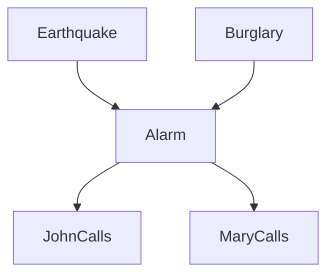

# 贝叶斯网络：从概率图到因果推断

## 引言：从相关性到结构化推断

在统计学与机器学习中，我们面临的核心挑战往往是如何有效地表示和处理多变量之间的复杂关系。当我们面对成百上千个变量时，直接对联合概率分布 $P(X_1, X_2, \dots, X_n)$ 进行建模是不可行的，因为参数空间会随着变量数量呈指数级爆炸（Curse of Dimensionality）。

**概率图模型 (Probabilistic Graphical Models, PGM)** 提供了一种优雅的解决方案。它利用图论中的**图**来表示变量间的依赖关系，利用概率论来量化这些依赖的强度。

其中，**贝叶斯网络 (Bayesian Networks)** 作为 PGM 的有向图分支，具有特殊的地位。它不仅能简化计算，更重要的是，它的**有向边**往往对应着我们认知中的**因果关系**。这使得贝叶斯网络成为了连接传统统计关联与因果推断 (Causal Inference) 的桥梁。

## 结构表示：有向无环图 (DAG)

贝叶斯网络由两部分组成：定性的图结构 $\mathcal{G}$ 和定量的参数 $\Theta$。

### 因子分解定理

贝叶斯网络的拓扑结构是一个**有向无环图 (Directed Acyclic Graph, DAG)**。图中的每个节点 $X_i$ 表示一个随机变量，有向边 $X_j \to X_i$ 表示变量间的依赖。

贝叶斯网络的核心假设是**局部马尔可夫性质 (Local Markov Property)**：
> 给定父节点 $Pa(X_i)$，节点 $X_i$ 条件独立于其所有非后代节点。

基于此性质，联合概率分布可以分解为一系列条件概率的乘积，这就是**链式法则 (Chain Rule)** 的图模型版本：

$$ 
P(X_1, \dots, X_n) = \prod_{i=1}^{n} P(X_i \mid Pa(X_i)) 
$$

这种分解极大地减少了所需的参数数量。

### 防盗报警器示例 (The Burglar Alarm Network)

经典的 Pearl (1988) 案例：
*   $E$: 地震 (Earthquake)
*   $B$: 盗窃 (Burglary)
*   $A$: 报警器响 (Alarm)
*   $J$: 邻居约翰打电话 (JohnCalls)
*   $M$: 邻居玛丽打电话 (MaryCalls)

其结构如下：

联合分布可以分解为：
$$ P(E, B, A, J, M) = P(E) \cdot P(B) \cdot P(A|E,B) \cdot P(J|A) \cdot P(M|A) $$

只需指定上述 5 个局部条件概率表 (CPT)，即可完整描述整个系统。

## 推断基础：D-划分与条件独立性

理解贝叶斯网络，核心在于理解**信息如何在图中流动**。给定某些观测证据，另一些变量之间是否独立？这取决于路径是否被“阻断”。

**D-划分 (D-Separation)** 是判断条件独立性的图形化法则。主要有三种基本结构：

### 顺连 (Serial Connection)
$$ X \to Y \to Z $$
*   **依赖性**：$X$ 影响 $Y$，$Y$ 影响 $Z$，信息可以通过。
*   **独立性**：若 $Y$ 被观测（给定），则路径被阻断，$X \perp Z \mid Y$。即知道中间结果后，起因与后续结果无关。

### 分连 (Diverging Connection)
$$ X \leftarrow Y \to Z $$
*   $Y$ 是 $X$ 和 $Z$ 的**共因 (Common Cause)**。
*   **依赖性**：未观测 $Y$ 时，$X$ 和 $Z$ 相关（由共因导致的相关）。
*   **独立性**：若 $Y$ 被观测，则路径被阻断，$X \perp Z \mid Y$。控制了共因，结果之间不再相关。

### 汇连 (Converging Connection / V-Structure)
$$ X \to Y \leftarrow Z $$
*   $X$ 和 $Z$ 是 $Y$ 的共同原因。这是最特殊的结构。
*   **独立性**：若 $Y$ **未**被观测（且其后代也未被观测），则 $X$ 和 $Z$ 边缘独立 ($X \perp Z$)。原因之间互不影响。
*   **依赖性**：若 $Y$ (或其后代) **被观测**，则路径被**激活**，$X$ 和 $Z$ 变得相关。

**因果消除 (Explaining Away)**：这是一种重要的推理模式。例如，已知报警 ($Y$ 发生)，若我们随后发现发生了地震 ($Z$ 发生)，那么盗窃 ($X$ 发生) 的概率会**降低**。因为地震已经“解释”了报警的原因，使得盗窃的必要性下降。

## 学习 (Learning)：从数据反推网络

贝叶斯网络的学习包含两个层次：
1.  **参数学习 (Parameter Learning)**：已知图结构，学习 CPT 参数。
2.  **结构学习 (Structure Learning)**：图结构未知，从数据中推断最优 DAG。

### 参数学习

假设数据 $D$ 包含 $M$ 个样本。

*   **最大似然估计 (MLE)**：
    利用频率估计概率。对于离散变量，即统计计数：
    $$ \theta_{ijk}^{MLE} = \frac{N_{ijk}}{\sum_k N_{ijk}} $$
    其中 $N_{ijk}$ 表示节点 $i$ 的父节点取第 $j$ 种组合时，节点 $i$ 取第 $k$ 个值的次数。
    *   *缺点*：数据稀疏时易过拟合，若某情况未出现，概率估计为 0。

*   **贝叶斯估计 (Bayesian Estimation)**：
    引入先验分布来平滑。通常使用 **Dirichlet 分布** 作为多项式分布的共轭先验：
    $$ \theta_{ijk}^{Bayes} = \frac{N_{ijk} + \alpha_{ijk}}{\sum_k (N_{ijk} + \alpha_{ijk})} $$
    其中 $\alpha_{ijk}$ 是超参数（伪计数）。当 $\alpha=1$ 时，对应拉普拉斯平滑。

### 结构学习 (Structure Learning)

这是一个 NP-Hard 问题。主要有三类方法：

#### 基于约束的方法 (Constraint-based)
通过统计独立性检验（如 $\chi^2$ 检验、互信息）来判断边是否存在。

代表算法：**PC 算法** (Peter-Clark)。

1.  从全连接无向图开始。
2.  移除所有边缘条件独立的边（条件集大小从 0 递增）。
3.  确定骨架 (Skeleton) 后，利用 V-结构 (Collider) 确定部分边的方向 ($X-Z-Y$ 变为 $X \to Z \leftarrow Y$)。
4.  利用规则定向剩余的边，防止产生环或新的 V-结构。

#### 基于评分的方法 (Score-based)
定义一个评分函数 $Score(\mathcal{G} \mid D)$，搜索得分最高的图。

**评分函数**：通常由似然度 (Likelihood) 和 罚项 (Penalty) 组成，以平衡拟合优度与模型复杂度。

*   **BIC (Bayesian Information Criterion)**:
    $$ BIC(\mathcal{G} \mid D) = \log P(D \mid \hat{\theta}, \mathcal{G}) - \frac{d}{2} \log M $$
    其中 $d$ 是独立参数个数，$M$ 是样本量。
*   **BDeu** (Bayesian Dirichlet equivalent uniform): 贝叶斯评分，考虑了参数的后验分布积。

**搜索策略**：由于搜索空间巨大，常用启发式搜索。
*   **爬山法 (Hill Climbing)**：每次局部进行加边、删边、转边操作，直到分数不再提升。
*   **Tabu Search**: 设置禁忌表跳出局部最优。

#### 混合方法 (Hybrid Methods)
结合上述两者。例如 **MMHC (Max-Min Hill-Climbing)**：
1.  **Max-Min Parents and Children (MMPC)**：使用约束法确定骨架（候选父子节点集合）。
2.  **Hill-Climbing**：在骨架约束下进行评分搜索定向。
这是目前处理中大规模网络的主流高效方法。

## 总结

贝叶斯网络通过图论语言清晰地描述了变量间的条件独立性，通过因子分解高效地处理了高维联合分布。它是理解更复杂模型（如 HMM、LDA、VAE）的基石。

*   **推断**是利用已知结构回答概率问题（D-划分是关键）。
*   **学习**则是从数据中恢复结构（PC 算法、BIC 评分）。

在下一篇文章中，我们将引入“时间”维度，探讨贝叶斯网络的动态形式——**隐马尔可夫模型 (HMM)**。

