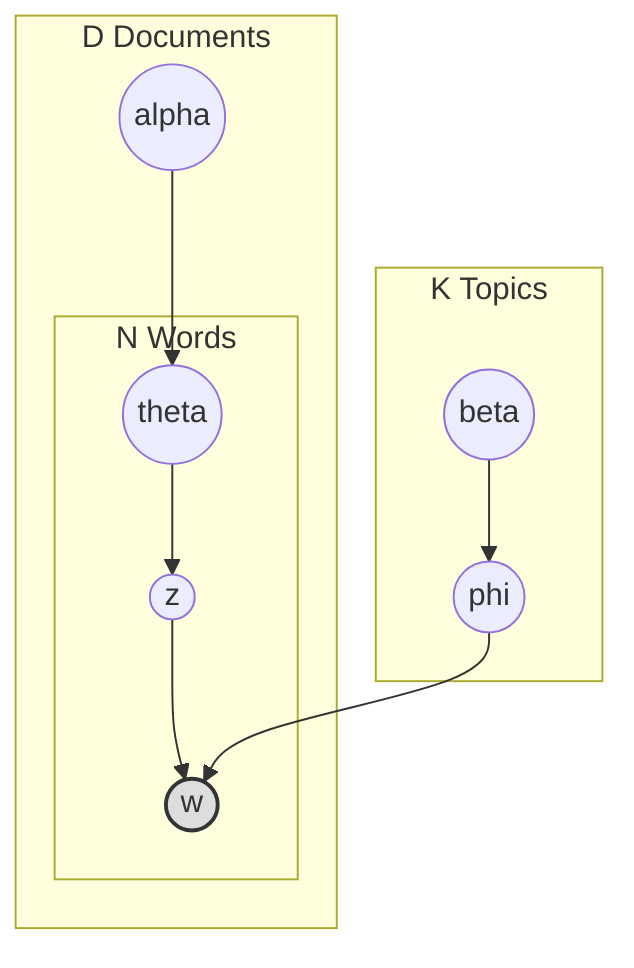

# LDA主题模型：文本数据的生成密码

## 引言：从词袋到生成式模型

在处理文本数据时，最简单的方法是**词袋模型 (Bag-of-Words, BoW)**。它忽略了词序和语法，仅仅将文档看作词汇的集合。然而，BoW 无法捕捉文档背后的语义结构。我们直觉上认为，文章是关于某些“话题”的，而词汇只是这些话题的具体表现。

**主题模型 (Topic Model)** 正是基于这种直觉。它假设文档是由隐藏的“主题”生成的。作为该领域的经典之作，**潜在狄利克雷分配 (Latent Dirichlet Allocation, LDA)** 是一个**三层贝叶斯概率图模型**。它不仅是自然语言处理的利器，也是概率图模型（结合有向图、潜变量、共轭先验）的教科书级应用。

## 贝叶斯视角：共轭先验的引入

在深入 LDA 结构之前，我们需要理解其核心数学组件：**狄利克雷分布 (Dirichlet Distribution)**。

LDA 是一个**贝叶斯模型**。在频率派的 **PLSA (Probabilistic Latent Semantic Analysis)** 中，我们直接估计参数。而在 LDA 中，我们认为参数本身也是随机变量，服从某个**先验分布**。

*   **多项式分布 (Multinomial)**：描述了“掷骰子”生成词汇的过程。
*   **狄利克雷分布 (Dirichlet)**：描述了“制造骰子”的过程。它是多项式分布的**共轭先验 (Conjugate Prior)**。

这意味着：如果先验是 Dirichlet，似然是 Multinomial，那么后验依然是 Dirichlet。这一性质使得数学推导和计算极大简化。

## 生成过程：Plate Notation

LDA 认为文档的生成过程是一个“上帝掷骰子”的游戏。

### 核心概念

*   **文档 (Document)**：$D$ 篇文档。
*   **主题 (Topic)**：$K$ 个主题。每个主题 $\phi_k$ 是词汇表 $V$ 上的一个概率分布。
*   **词 (Word)**：文档中的具体单词。

### Plate Notation

*   $w$ (灰色节点)：唯一可观测的变量（文档中的词）。
*   $z, \theta, \phi$ (白色节点)：隐含变量，需要推断。
*   $\alpha, \beta$：超参数。

### 生成故事 (Generative Story)

1.  **生成主题-词分布**：对于每个主题 $k \in \{1, \dots, K\}$：
    *   从先验分布 $\text{Dir}(\beta)$ 中采样得到该主题的词分布 $\phi_k$。
2.  **生成文档**：对于每篇文档 $d \in \{1, \dots, D\}$：
    *   **确定主题比例**：从先验分布 $\text{Dir}(\alpha)$ 中采样得到该文档的主题分布 $\theta_d$。
    *   **生成词汇**：对于文档中的第 $n$ 个词：
        *   从 $\theta_d$ 中采样一个主题指派 $z_{d,n}$。
        *   根据主题 $z_{d,n}$ 对应的词分布 $\phi_{z_{d,n}}$，采样生成具体的词 $w_{d,n}$。

联合概率分布为：
$$ P(w, z, \theta, \phi \mid \alpha, \beta) = \prod_{k=1}^K P(\phi_k \mid \beta) \prod_{d=1}^D \left( P(\theta_d \mid \alpha) \prod_{n=1}^{N_d} P(z_{d,n} \mid \theta_d) P(w_{d,n} \mid \phi_{z_{d,n}}, z_{d,n}) \right) $$

## 推断：折叠吉布斯采样 (Collapsed Gibbs Sampling)

我们要解决的问题是**逆向工程**：已知观测到的文档 $W$，反推其背后的隐含结构（主题分布 $\phi$ 和文档主题比例 $\theta$）。即计算后验概率 $P(z, \theta, \phi \mid w, \alpha, \beta)$。

由于直接计算该后验分布的分母（积分）是不可行的，我们再次通过近似推断。LDA 最常用的算法是 **Collapsed Gibbs Sampling**。

之所以叫“Collapsed (折叠)”，是因为利用共轭先验的性质，我们可以将连续变量 $\theta$ 和 $\phi$ 直接积分积掉 (Integrate out)，只对离散隐变量 $z$ 进行采样。这大大降低了采样空间的维度。

### 采样公式

我们需要计算：给定所有其他词的主题分配 $\mathbf{z}_{\neg i}$，当前词 $w_i$ 被分配给主题 $k$ 的条件概率：

$$ P(z_i = k \mid \mathbf{z}_{\neg i}, \mathbf{w}) \propto \underbrace{(n_{d,k}^{\neg i} + \alpha)}_{\text{doc-topic part}} \cdot \underbrace{\frac{n_{k,w}^{\neg i} + \beta}{\sum_{v=1}^V (n_{k,v}^{\neg i} + \beta)}}_{\text{topic-word part}} $$

*   **Doc-Topic Part**：文档 $d$ 中目前被分配给主题 $k$ 的词越多，新词属于主题 $k$ 的概率就越大。
*   **Topic-Word Part**：主题 $k$ 中包含词 $w$ 的次数越多，该词由主题 $k$ 生成的概率就越大。

### 算法流程

1.  **随机初始化**：为语料库中每个词随机分配一个主题 $z$。
2.  **迭代采样**：
    *   遍历每个文档中的每个词 $w_i$。
    *   将 $w_i$ 从当前统计量中移除（Decremental）。
    *   根据上述公式计算 $w_i$ 属于各个主题 $k$ 的概率。
    *   依照该概率分布采样新的主题 $k_{new}$。
    *   更新统计量（Incremental）。
3.  **参数估计**：
    采样收敛后，利用统计量估计 $\theta$ 和 $\phi$：
    $$ \hat{\theta}_{d,k} = \frac{n_{d,k} + \alpha}{N_d + K\alpha}, \quad \hat{\phi}_{k,w} = \frac{n_{k,w} + \beta}{N_k + V\beta} $$

## 总结与系列回顾

LDA 展示了概率图模型的强大魔力：通过合理的先验假设和结构设计，我们能够从看似杂乱无章的数据中提取出结构化的知识。

至此，我们的**概率图模型系列**涵盖了四大里程碑：
1.  **贝叶斯网络**：建立了有向图与因果推断的桥梁。
2.  **HMM**：处理了具有时间依赖的序列数据。
3.  **MRF**：捕捉了具有空间对称性的相关关系。
4.  **LDA**：展示了贝叶斯生成式模型在非结构化数据挖掘中的应用。

无论是因果推断、时间序列预测、图像处理还是文本挖掘，概率图模型都提供了一个统一的语言——**用图描述结构，用概率量化不确定性**。这正是统计学习的魅力所在。

