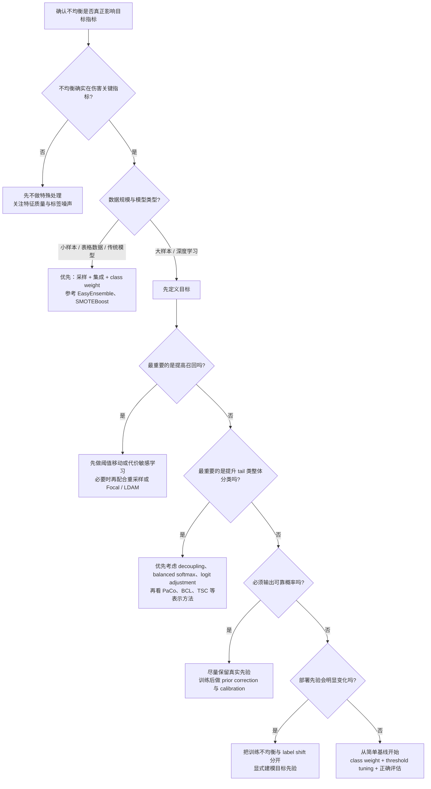

# 训练模型时的样本不均衡：从统计学习到长尾学习的处理方案

训练模型时，很多人一看到“样本不均衡”，第一反应就是“少数类太少，所以把它补多一点”。这当然不算错，但如果把问题只理解到这一步，后面往往会做出一连串代价很高、却不一定真的对业务目标有帮助的操作。

最典型的例子就是欺诈检测、故障预测和医学筛查。假设正例只占 1%，一个永远预测“负例”的模型就能拿到 99% 的 Accuracy，但这个模型在业务上几乎是废的。反过来，如果你为了追求召回率，把模型调到“几乎见谁都报阳性”，召回率也许很好，但误报成本又可能高得无法落地。

所以，样本不均衡真正困难的地方，从来不只是“类频数不平衡”，而是**训练分布、损失设计、概率估计、阈值决策、部署先验**经常同时错位。统计学习领域很早就意识到这件事，长尾深度学习则把这个问题进一步拆到了表示学习、分类头偏置、后验修正与校准层面。把这些脉络放在一起看，才更容易知道自己该先改数据、改损失，还是先改评价方式。

## 引子：为什么准确率经常把问题说轻了

Foster Provost 在 2000 年的经典文章 *Machine Learning from Imbalanced Data Sets 101* 里已经指出，很多所谓的“样本不均衡问题”，本质上是**目标函数和决策条件被默认错了**。如果真实世界里正例很稀有、误报和漏报的代价又高度不对称，那么默认用 Accuracy、默认用 0.5 阈值、默认把训练集与部署集当成同一分布，本身就会把问题说轻。

这也是为什么“类别比例”不能单独解释模型效果。Japkowicz 与 Stephen（2002）以及 Prati 等人（2004）的研究都说明，性能下降往往来自**不均衡、类别重叠、标签噪声、概念复杂度**的共同作用。换句话说，1:100 的不均衡未必一定比 1:20 难；如果少数类分布清晰、特征可分，模型可能并不难学。真正麻烦的是：少数类既少，又被多数类包围，还带噪声。

对实践者来说，这意味着一个很重要的转向：**不要先问“我该不该 SMOTE”，而要先问“我要优化的是排序、概率，还是最终决策收益”。** 这三个目标在样本不均衡场景下并不等价。

## 样本不均衡到底是什么

我更倾向于把“样本不均衡”拆成三种经常被混在一起的现象。

1. **训练集类别失衡**：最常见的场景，训练时 head class 很多，tail class 很少。
2. **稀有事件概率估计**：关注的不是“把类分对”而已，而是要稳定估计一个很小的事件概率，例如违约率、并发症风险、设备故障率。
3. **部署期先验偏移**：训练集和测试集、线上流量的类先验不同，也就是 label shift / prevalence shift。很多长尾视觉论文默认的 benchmark，并不等于真实部署环境。

这三件事重叠，但不是一回事。比如医学风险预测里，正例少只是表象，真正难点是**你需要一个可解释、可校准的概率输出**；而在长尾图像识别里，很多工作追求的是 tail class 的 top-1 / macro accuracy，此时比起概率解释，表示学习与分类头偏置反而更关键。

还有两个边界条件也很重要。

- **类别重叠比类频数更致命**。如果少数类和多数类在特征空间强烈重叠，单纯补样本往往只会把边界搅得更乱。
- **少数类内部也可能不均衡**。Bellinger、Corizzo 与 Japkowicz（2024, PMLR Workshop）进一步提醒我们，所谓“少数类”内部还可能包含多个规模悬殊的子概念；如果评估只看常规 macro 指标，模型可能只是学会了最大的那几个少数类子模式，最小、最难的那部分依旧被忽略。

还有一个经常被忽略的前提：**不均衡并不总是需要特殊处理。** 很多人一看到类别比例就焦虑，但以下情况其实可以什么都不做（或者只做最简单的调整）：

- **特征区分度足够高**。如果少数类在特征空间中与多数类几乎不重叠（例如基于签名的恶意软件检测），即使比例达到 1:10000，标准模型也能学得很好。
- **绝对样本数足够大**。当数据总量达到百万级时，即使 tail class 只占 0.1%，绝对数量仍有上千条，对很多模型来说已经足够。此时"不均衡"更多是一个相对概念，而非实际瓶颈。
- **现代 GBDT 的内置鲁棒性**。XGBoost、LightGBM 等基于树的模型对中等程度的类别不均衡已经有相当好的自适应能力，盲目加 SMOTE 或调权重反而可能引入新问题。
- **问题本身不要求 tail class 表现**。如果业务目标只关心整体排序或 head class 的精度，刻意提升 tail 反而会拉低主要目标。

换句话说，**在花时间处理不均衡之前，先验证不均衡是否真的在伤害你关心的指标。** 很多时候，问题不在比例，而在特征质量或标签噪声。

下面这张表，可以把常见方法放回它真正作用的层级上看。

| 作用层级 | 代表方法 | 适用场景 | 主要风险 | 是否影响概率解释 |
|------|------|------|------|------|
| 数据层 | 随机过采样、随机欠采样、SMOTE、M2m、CMO | 小样本二分类、数据稀缺的长尾任务 | 放大噪声、制造类重叠、如果切分前操作会数据泄漏 | 是，通常会改变训练先验 |
| 损失层 | Class Weight、Focal Loss、Class-Balanced Loss、LDAM-DRW | 更关心 tail 分类、召回率或 hard example | 对噪声敏感，可能让概率输出更不稳定 | 是，常常需要后续再校准 |
| 分类头 / 后验层 | Threshold Moving、Balanced Softmax、Logit Adjustment、LADE | 已有较好表示，但分类头受 head bias 影响；或存在先验偏移 | 容易把“目标先验”设错 | 是，直接影响决策边界与后验解释 |
| 表示层 | Decoupling、PaCo、BCL、TSC、Distributional Robustness Loss | 长尾深度学习，tail 类难点在特征几何 | 训练更复杂，超参更多 | 间接影响，但通常仍需独立校准 |
| 校准 / 决策层 | Platt / Isotonic / Temperature Scaling、后验修正、代价敏感阈值 | 风控、医疗、告警系统等必须输出可靠概率的场景 | 需要独立验证集，不能修复糟糕的排序能力 | 是，这一层本来就是在修正概率解释 |

## 经典统计学习的四条主线

He 与 Garcia（2009, IEEE TKDE）的综述是这一阶段最全面的参考文献之一，将当时的方法系统地归纳为数据层、算法层和评估层三条线。经典文献里，处理不均衡大致有四条主线：重采样、代价敏感学习、集成方法，以及稀有事件统计建模。它们到今天仍然没有过时，只是现代深度学习把这些思想换了更细的落点。

### 1. 重采样：先改数据分布

最直观的做法，是对少数类过采样、对多数类欠采样。

过采样的优点很简单：保留了全部少数类样本，不会像欠采样那样直接丢掉多数类信息。SMOTE（Chawla et al., 2002, JAIR）则进一步把“复制少数类”改成了“在少数类邻域内做插值”，希望减少简单复制带来的过拟合。

但 SMOTE 真正有效的前提，是**少数类在局部邻域里确实有可插值的流形结构**。如果少数类本来就夹在多数类里面，或者少数类样本带有标签噪声，那么合成样本很可能只会把边界区域进一步污染。Prati 等人（2004）对“类别不均衡 vs 类别重叠”的分析非常重要，因为它提醒我们：很多时候真正难的不是频数，而是几何关系。

从今天回看，Fernandez 等人 2018 年的 15 周年回顾也给出了很公允的判断：SMOTE 之所以长期成为 baseline，不是因为它万能，而是因为它在“样本很少、模型不够复杂、少数类局部结构还算稳定”的任务里，确实是一个低门槛、可解释、常常有效的起点。

### 2. 代价敏感学习：先改错误成本

Elkan（2001, IJCAI）对代价敏感学习的讨论，到今天依然是最该重读的文献之一。他的核心观点其实很朴素：**如果漏报和误报的代价不同，那么默认 0.5 阈值就没有任何天然正当性。**

这条线最重要的启发是，很多时候你根本不需要先改数据，而是应该先把损失函数或决策阈值改成更符合业务代价的形式。比如欺诈检测里，漏掉一个高风险交易的代价，可能远高于多审查几个正常交易；医学筛查里，早筛阶段往往更愿意接受较高误报来换更高召回。

如果模型已经能给出还不错的概率排序，那么**阈值移动**往往是比大规模重采样更干净的第一步。因为它不破坏原始类先验，也更容易根据部署期成本随时调整。Zadrozny、Langford 与 Abe（2003）则从 reduction 的角度说明，很多普通分类器都能通过样本加权或拒绝采样变成 cost-sensitive learner。

### 3. 集成方法：让采样和模型互相补短板

单次过采样或欠采样有个老问题：要么重复利用少数类，要么丢失多数类。于是经典文献很快走向了“采样 + 集成”的路线。

SMOTEBoost（Chawla et al., 2003）把合成少数类样本嵌进 boosting 流程，希望在每一轮里更关注难学的 tail 样本。EasyEnsemble / BalanceCascade（Liu, Wu, Zhou, 2006）则给欠采样提供了一个更优雅的版本：每一轮只抽取一部分多数类，但通过多轮集成把不同子集的信息尽量补回来。

这类方法今天依然很值得记住，尤其是当你处理的是**小样本、表格数据、基学习器不算太强**的任务。因为很多时候，复杂深度长尾方法的收益并不会稳定迁移到这些场景，反而是集成 + 合理采样更稳。

### 4. 稀有事件统计建模：当你真正关心的是概率

如果你的核心目标不是“把正负类分出来”，而是**估计稀有事件发生的概率**，那就不能只把问题当成普通分类。

King 与 Zeng（2001）在 rare-event logistic regression 中指出，标准 logistic regression 在正例非常稀少时，会系统性低估事件概率。这个结论非常重要，因为它说明：样本不均衡不仅影响分类边界，也影响参数估计本身。

后续的 local case-control sampling（Fithian & Hastie, 2014）又把这个思路推进了一步。它不是简单把数据做成“类平衡”，而是优先采样那些**在当前模型下局部更令人意外的样本**，从而更高效地利用负例，同时保留概率模型的一致性。

对今天的实践者而言，这条线有一个非常强的现实含义：**如果你做的是风控、医疗、信用评分、设备告警这类需要概率输出的任务，盲目重采样通常不是第一选择。** 你更应该先考虑：原始先验要不要保留，采样后怎么做 prior correction，最后如何做概率校准。

## 深度学习如何重新定义样本不均衡

深度学习并没有推翻经典文献，但它把问题重新拆解了。

Buda、Maki 与 Mazurowski（2018）对 CNN 中样本不均衡的系统研究，是一个非常关键的转折点。它至少让大家看到两件事：

- 在深度网络里，过采样未必像传统机器学习里那样明显导致过拟合。
- 欠采样经常比想象中更伤，因为它直接减少了表示学习可用的多数类信息。

但后续的长尾学习文献很快发现，事情也不能停在“多过采样、少欠采样”这里。真正大的变化是：研究者开始区分**表示学习阶段**和**分类头阶段**，并进一步意识到很多 head bias、prior bias 和 calibration 问题，不能只靠样本数修正。

### 第一波：重加权、边际与 hard example

这一波最具代表性的工作包括 Focal Loss（Lin et al., 2017, ICCV）、Class-Balanced Loss（Cui et al., 2019, CVPR）和 LDAM-DRW（Cao et al., 2019, NeurIPS）。

Focal Loss 最初是为目标检测里的前景 / 背景极端不均衡设计的。它的核心思想不是直接“补少数类”，而是**压低大量 easy negative 的梯度权重，把学习资源让给难样本**。这也是为什么它在 detection 领域影响极大。

Class-Balanced Loss 则指出，简单按类频数做 inverse-frequency weighting 过于粗糙，因为一类样本越多，新增一个样本带来的信息增益并不是线性增加的。于是它用“effective number of samples”来替代纯频数，给 head class 降权、给 tail class 提权，但比直接反频率更平滑。

LDAM-DRW 又往前走了一步。它不是只改权重，而是引入了与 label distribution 相关的 class-dependent margin，并把 re-weighting 延后到训练后期。这个设计背后的直觉非常深刻：**训练早期先把表示学稳，训练后期再更积极地向 tail 倾斜。**

这一波方法适合什么场景？如果你的首要目标是提高 tail class 的分类结果、提升召回、降低 easy majority example 对梯度的垄断，它们通常是强 baseline。但边界也很清楚：**它们改善 classification 不等于改善 calibrated probability**。尤其是 focal 一类 hard-example loss，经常会让置信度分布变形。

### 第二波：解耦表示学习与分类头偏置

Kang 等人（2020, ICLR）的 *Decoupling Representation and Classifier for Long-Tailed Recognition* 基本改变了整个领域的讨论方式。它最重要的结论不是“必须重平衡”，而是：**自然采样的数据往往已经足够学到不错的表示，真正最需要做 balance 的，可能只是最后的分类器。**

这个结论之所以重要，是因为它把经典的“是否该重采样”问题，改写成了一个阶段性问题：

- 表示学习阶段，多数类提供了大量视觉结构信息，盲目欠采样会伤 backbone。
- 分类头阶段，head class 的频数优势会让 classifier weight、logit 和决策边界都向 head 偏。

Balanced Meta-Softmax（Ren et al., 2020, NeurIPS）和 Logit Adjustment（Menon et al., 2021, ICLR）就是在这条线上发力的代表。它们共同强调：**softmax 训练本身就携带了训练先验的偏置**，如果不显式修正，分类头天然会更照顾 head class。

LADE（Hong et al., 2021, CVPR）更进一步，直接把长尾识别放在 label-shift 的框架里讨论。它非常值得读，因为它逼着我们正视一个经常被忽略的问题：很多论文默认在“更平衡的测试视角”下讨论长尾效果，但真实部署的类先验未必如此。如果你连目标先验是什么都没说清，就很难判断究竟该用 balanced softmax、logit adjustment，还是后验修正。

在目标检测与实例分割领域，Equalization Loss v2（Tan et al., 2021, CVPR）和 Seesaw Loss（Wang et al., 2021, CVPR）分别从梯度均衡与动态补偿的角度处理长尾类别，说明解耦思想同样可以迁移到 detection 和 segmentation 场景。RIDE（Wang et al., 2021, ICLR）则尝试用多专家路由的方式，让不同专家分别负责 head 和 tail 分布，是解耦策略的另一种变体。

这条路线还有一个很好的提醒来自 Weight Balancing（Alshammari et al., 2022, CVPR）。这篇论文告诉我们，很多看上去复杂的问题，其实相当一部分体现在**分类器权重范数不平衡**上。也就是说，先把简单 baseline 做好，例如 weight decay、norm control、classifier retraining，常常比一上来堆复杂结构更划算。

### 第三波：从“计数问题”走向“表示几何与校准问题”

到 2021 年之后，长尾学习越来越不像“样本数修修补补”，而越来越像在讨论特征空间几何、校准和多阶段训练。

MiSLAS（Zhong et al., 2021, CVPR）很有代表性。它把 long-tail recognition 的 calibration 问题单独拎出来，说明 tail accuracy 提升并不等于置信度可靠。对部署来说，这一点往往比 top-1 多提升几个点更重要。

另一条明显的趋势，是把长尾问题理解为**表示空间不够均匀**。PaCo（Cui et al., 2021, ICCV）、BCL（Zhu et al., 2022, CVPR）和 TSC（Li et al., 2022, CVPR）都属于这类工作。它们的共同点是：不再只盯着类别权重，而是试图让 tail class 在特征空间里获得更清晰、更稳定的分离结构。

这条线说明了一个非常重要的事实：**长尾问题不是只有“tail 样本太少”，而是 tail 样本在表示空间里很容易被 head class 的几何结构挤压。** 所以解决方案也不只是把 loss weight 再调大一点。

### 预训练与基础模型：长尾问题的范式变化

值得单独讨论的是，随着大规模预训练模型（CLIP、DINOv2、大语言模型等）的普及，长尾学习的很多前提假设正在被改写。

传统长尾学习的核心困难是 **tail class 的表示不稳定**——样本太少导致 backbone 难以学到可靠的特征结构。但预训练模型在海量数据上已经学到了相当通用的表示空间，即使 tail class 在下游任务中只有极少样本，预训练特征往往也能提供足够好的起点。这意味着：

- **微调阶段的长尾问题大幅降级**。如果 backbone 已经被冻结或只做轻量微调，问题回退到"分类头偏置"这个相对简单的层面，而不再需要从头解决表示学习。
- **零样本/少样本能力**直接绕过了传统长尾学习的前提。CLIP 一类的视觉语言模型甚至可以用文本描述来识别训练集中从未出现过的类别，这对某些长尾场景是降维打击。
- **VLM 辅助增强**也在改变数据层的操作方式。相比 SMOTE 这类基于局部插值的合成策略，利用生成模型或视觉语言模型为 tail class 生成多样化的增强样本，在语义丰富度上有本质提升。

当然，预训练模型并不能解决所有问题。如果下游任务的领域与预训练数据分布差距极大（如专业医学影像、工业缺陷检测），预训练表示的迁移性仍然有限，此时前面讨论的经典方法依然不可替代。此外，预训练模型的概率校准问题可能比从头训练的模型更难处理，因为预训练阶段的先验分布和下游任务通常完全不同。

与此同时，数据增强路线也在演化。M2m（Kim et al., 2020, CVPR）、MetaSAug（Li et al., 2021, CVPR）和 CMO（Park et al., 2022, CVPR）都不满足于“简单复制 tail”。它们更关注如何借助 head class 的结构信息、上下文信息或可迁移语义，去生成对 tail 更有帮助的样本。这比传统过采样更接近“在什么地方补信息，而不是只补数量”。

## 评估、阈值与校准：为什么很多方法“看起来有效”却不适合上线

如果只用一句话概括这一节，那就是：**样本不均衡下，排序质量、概率质量和决策质量必须分开谈。**

- **排序质量**：模型能不能把正例排在负例前面，例如 AUROC、AUPRC。
- **概率质量**：模型输出的 0.1、0.4、0.8 到底像不像真实频率，例如 calibration curve、Brier、ECE / TCE。
- **决策质量**：在既定成本、阈值和先验下，模型最终能不能带来更高收益。

很多论文或者业务报告的问题，不在于方法本身，而在于这三件事被混成了一件事。一个模型可能 AUROC 很高，但校准很差；也可能 macro-F1 看起来进步了，但在线上先验下收益反而更差。

### 指标不是越多越好，而是要回答对的问题

| 指标 | 回答什么问题 | 什么时候有用 | 在不均衡下何时会误导 |
|------|------|------|------|
| Accuracy | 总体预测对了多少 | 类分布接近均衡、误报漏报代价接近时 | 正例极少时会被多数类“冲高” |
| AUROC | 正例是否整体排在负例前面 | 想看排序能力、阈值尚未固定时 | 负例极多时可能看起来很好，但业务上仍会产生大量误报 |
| AUPRC / PR 曲线 | 预测为正的样本里有多少是真的，以及召回损失如何变化 | 稀有正例、检索式任务、告警系统 | 基线随 prevalence 改变，跨数据集比较时若不报告先验很容易误导 |
| PR-Gain | 在不同 prevalence 下更稳定地比较 PR 表现 | 需要跨 fold / 跨数据集比较 PR 表现时 | 如果读者不熟悉该指标，解释成本更高 |
| Balanced Accuracy | 各类 recall 的平均值 | 类别重要性接近、想避免 majority 抬高分数时 | 不反映概率校准，也不反映误报成本 |
| MCC | 混淆矩阵四格整体是否平衡（Chicco & Jurman, 2020） | 想用一个标量总结二分类整体质量时 | 仍然无法替代 per-class 指标和阈值分析 |
| Macro-F1 / Macro Recall | tail 类是否也被看见 | 多分类长尾识别 | 对阈值和小类样本数敏感，且忽略概率解释 |
| Brier / ECE / TCE | 概率输出是否可信 | 风控、医疗、排序后还要做决策时 | 排序差的模型即便校准后，也不一定可用；ECE 还受分箱影响 |

Davis 与 Goadrich（2006, ICML）以及 Saito 与 Rehmsmeier（2015, PLOS ONE）的工作被广泛引用，其核心结论是：**在强不均衡二分类里，PR 曲线往往比 ROC 曲线更能体现实际压力。** 原因很简单，ROC 把大量真负例也算进来后，很多模型会显得“挺不错”，但 PR 空间会更直接地暴露误报成本。

不过 PR 也不是万能的。Flach 与 Kull（2015, NeurIPS）提醒我们，PR 空间本身受 prevalence 约束，AUPRC 不能脱离类先验随便横向比较。也就是说，你如果要跨数据集、跨切分比较 AUPRC，必须同时报告正例比例，必要时甚至应考虑 PR-Gain 这类更稳的表示。

在多分类长尾任务里，Micro 指标也经常把问题藏起来。因为它会天然更接近 head class 的总体表现。Maxwell、Hale 与 Wilkins（2024）对多分类不均衡场景的指标选择做了系统梳理，结论和上面的表格一致：没有单一指标能全面反映 tail 表现。所以如果你的目标是看 tail class 是否真的被改善，至少要同时给出 **macro 指标、per-class 指标、混淆矩阵，以及 head / medium / tail 分层结果**。

### 0.5 阈值从来不是神圣数字

Elkan（2001）早就说明，最优决策阈值依赖错误成本与先验。换成更直白的话说，**0.5 只是“错报和漏报一样贵、类先验也没偏”的一个特殊情况。** 真实业务里，这种情况反而少。

因此，如果模型概率已经比较可靠，阈值移动往往是样本不均衡场景里最便宜、最常被低估的工具。Collell 等人（2018）专门讨论过 threshold moving 的价值：它不需要你重新破坏训练分布，也不需要一定重训模型，却能把模型推向更合适的 operating point。

反过来，如果你直接拿 validation set 上调出来的某个 F1 最优阈值当成“通用阈值”，也可能出问题。Lipton、Elkan 与 Naryanaswamy（2014）指出，F1 最优阈值本身就有一些非常反直觉的性质。在某些情况下，一个没什么信息量的分类器，甚至会因为 F1 的结构而倾向于“多预测一些正类”。这再次说明：**阈值是决策，不是默认值。**

### 为什么很多“不均衡修正”会破坏概率解释

这是最容易被忽略，但在落地时经常最痛的一点。

重采样和重加权经常能提升 recall、macro-F1 或 tail accuracy，但它们也会显式或隐式地改写训练先验。于是模型学到的分数，未必还能被直接解释成真实世界下的后验概率。Zadrozny 与 Elkan 在早期 calibration 论文里就已经在强调这个问题，Silva Filho 等人（2023）的校准综述也系统性地讨论了各种校准方法在不均衡场景下的适用性与局限。而 van den Goorbergh、van Smeden、Timmerman 与 Van Calster（2022, JAMIA）的模拟研究则更直接地展示了这一点：**即便 AUROC 几乎不变，经过 RUS、ROS 或 SMOTE 训练出来的 logistic 模型也可能严重高估少数类风险。**

这也是为什么我很认同把“样本不均衡”拆成三层目标来处理：

1. 如果你只关心排序或召回，采样、重加权、margin、contrastive 都可以大胆尝试。
2. 如果你还关心概率输出，就必须额外考虑 prior correction 和 calibration。
3. 如果部署期先验会变化，还要把 label shift 单独建模，而不是把所有问题都扔给训练损失。

Lipton、Wang 与 Smola（2018）以及 Alexandari、Kundaje 与 Shrikumar（2020）的 label shift 研究，对这一点说得非常清楚：训练不均衡和部署先验偏移不是同一件事，不能混着处理。

## 一张可执行的选型图：不同场景该怎么处理

先给一个我自己觉得最实用的决策图。

把它翻译成更具体的场景，大致可以得到下面这张表。

| 场景 | 第一选择 | 可以继续叠加什么 | 不要一上来做什么 | 建议汇报指标 |
|------|------|------|------|------|
| 小样本表格二分类 | 分层切分、class weight、阈值调优 | 训练集内适度过采样或 EasyEnsemble | 切分前先做 SMOTE；只报 Accuracy | PR-AUC、Balanced Accuracy、MCC、Recall at Precision |
| 稀有事件风险预测 | 保留原始先验，优先逻辑回归 / GBDT + 校准 | case-control sampling、prior correction、isotonic / temperature scaling；表格深度模型（TabNet、FT-Transformer）可作为备选 | 把重平衡后的分数直接当风险概率 | Brier、Calibration、PR-AUC、决策曲线 |
| 多分类长尾图像识别 | decoupling + classifier retraining | balanced softmax、logit adjustment、weight balancing、PaCo / BCL | 盲目欠采样 backbone 训练数据 | Macro-F1、per-class accuracy、head / medium / tail split |
| 需要可靠概率输出的风控 / 医疗场景 | 先定义部署先验和成本，再训练 | calibration、threshold moving、label-shift correction | 只看 tail accuracy 就上线 | Calibration curve、Brier、ECE / TCE、业务成本指标 |

如果一定要把上面的内容压缩成一句操作建议，我的默认顺序通常是这样的：

1. **先定义目标**：我要优化排序、概率还是最终收益？
2. **先守住评估**：validation / test 的先验是否接近真实部署？
3. **先做简单基线**：class weight、threshold moving、proper metric、classifier retraining。
4. **再上复杂方法**：只有当数据层、损失层、分类头层的简单方案都到头时，再考虑更复杂的表示学习和生成增强。
5. **最后补概率**：任何激进的重采样、重加权之后，只要还要输出概率，就把 calibration 单独做一遍。

如果只允许我给一个默认起手式，我会选：**保留原始切分与原始测试先验，先报 PR-AUC / macro 指标 / calibration，再尝试 class weight 或 classifier correction，最后才考虑更强的重采样或生成式增强。** 这样最不容易在一开始就把问题越改越偏。

## 常见误区与踩坑清单

### 1. 在切分训练集和测试集之前就做过采样

这是最经典的数据泄漏。尤其是 SMOTE 一类方法，如果你先合成样本再切分，训练集和测试集会共享局部邻域结构，结果往往虚高。**正确顺序永远是先切分，再只在训练集内部做采样。**

### 2. 只报 Accuracy 或 AUROC

在强不均衡场景里，这两个指标都可能过于乐观。**至少同时报告 prevalence、PR 指标、per-class 指标和阈值选择规则。** 如果是多分类长尾任务，再加上 macro 指标和 head / tail 分层结果。

### 3. 在平衡测试集上讲故事，却默认真实部署先验不变

很多论文为了更公平比较，会使用更平衡的评估视角。这没问题，但你必须明确写出来。**balanced benchmark 不是现实先验。** 如果线上流量仍然是长尾分布，那概率解释、阈值和收益都可能变掉。

### 4. 把 tail accuracy 的提升误当成 calibrated probability 的提升

这是深度长尾论文最容易被误读的地方之一。一个方法也许让 tail class top-1 提升了，但这不代表它输出的 0.8 就真的接近 80% 概率。**分类改善和概率改善必须分别验证。**

### 5. 把“样本不均衡”当成唯一问题，忽略重叠和噪声

如果少数类本来就混在多数类里，或者标签噪声集中出现在 tail，单纯提高少数类权重只会更努力地学习噪声。**先看数据几何，再决定是否补样本。**

### 6. 多分类长尾任务里只看 micro 指标

Micro 指标通常会高度贴近 head class。你看到的“整体提升”，可能只是大类更好了，小类依旧崩着。**没有 macro、per-class、head-tail 分层结果，多分类长尾的结论往往是不完整的。**

## 结语

如果把过去二十多年的研究脉络压缩成一个判断，我会这样表述：**真正稳定的样本不均衡处理方案，从来不是某一个万能 loss，而是训练目标、评价指标与部署决策之间的一致性设计。**

经典统计学习给我们的启发是，样本不均衡首先是一个决策问题和估计问题；现代长尾深度学习则进一步告诉我们，不均衡还会表现为分类头偏置、表示几何失衡和概率校准失真。把这些视角放在一起之后，很多“方法选择题”其实就变简单了：

- 关心召回和 tail 分类，就先从数据层、损失层和 classifier correction 入手。
- 关心概率输出，就把 prior correction 和 calibration 提到和训练同等重要的位置。
- 关心真实部署收益，就不要再把 balanced benchmark 误当成业务世界本身。

当你不再把“样本不均衡”理解成一个单点技巧问题，而是把它看成**从数据分布到部署决策的整条链路问题**时，方法反而更容易选对。

## 参考资料

### 经典与统计学习

- Provost (2000). [Machine Learning from Imbalanced Data Sets 101](https://cdn.aaai.org/Workshops/2000/WS-00-05/WS00-05-001.pdf). AAAI Workshop.
- Elkan (2001). [The Foundations of Cost-Sensitive Learning](https://cseweb.ucsd.edu/~elkan/rescale.pdf). IJCAI.
- King and Zeng (2001). [Logistic Regression in Rare Events Data](https://www.cambridge.org/core/services/aop-cambridge-core/content/view/1E09F0F36F89DF12A823130FDF0DA462/S1047198700003740a.pdf/logistic_regression_in_rare_events_data.pdf). Political Analysis.
- Japkowicz and Stephen (2002). [The Class Imbalance Problem: A Systematic Study](https://doi.org/10.3233/IDA-2002-6504). Intelligent Data Analysis.
- Chawla et al. (2002). [SMOTE: Synthetic Minority Over-sampling Technique](https://www.jair.org/index.php/jair/article/download/10302/24590). JAIR.
- Zadrozny, Langford, and Abe (2003). [Cost-Sensitive Learning by Cost-Proportionate Example Weighting](https://hunch.net/~jl/projects/reductions/costing/finalICDM2003.pdf). ICDM.
- Chawla et al. (2003). [SMOTEBoost: Improving Prediction of the Minority Class in Boosting](https://www3.nd.edu/~dial/publications/chawla2003smoteboost.pdf). PKDD.
- Prati, Batista, and Monard (2004). [Class Imbalances versus Class Overlapping: An Analysis of a Learning System Behavior](https://doi.org/10.1007/978-3-540-24694-7_32). MICAI.
- Liu, Wu, and Zhou (2006). [Exploratory Undersampling for Class-Imbalance Learning](https://www.lamda.nju.edu.cn/publication/icdm06d.pdf). ICDM.
- He and Garcia (2009). [Learning from Imbalanced Data](https://doi.org/10.1109/TKDE.2008.239). IEEE TKDE.
- Fithian and Hastie (2014). [Local Case-Control Sampling: Efficient Subsampling in Imbalanced Data Sets](https://pmc.ncbi.nlm.nih.gov/articles/PMC4258397/). Annals of Statistics.
- Fernandez et al. (2018). [SMOTE for Learning from Imbalanced Data: Progress and Challenges, Marking the 15-year Anniversary](https://doi.org/10.1613/jair.1.11192). JAIR.

### 深度长尾学习

- Lin et al. (2017). [Focal Loss for Dense Object Detection](https://openaccess.thecvf.com/content_iccv_2017/html/Lin_Focal_Loss_for_ICCV_2017_paper.html). ICCV.
- Buda, Maki, and Mazurowski (2018). [A Systematic Study of the Class Imbalance Problem in Convolutional Neural Networks](https://www.sciencedirect.com/science/article/pii/S0893608018302107). Neural Networks.
- Cui et al. (2019). [Class-Balanced Loss Based on Effective Number of Samples](https://openaccess.thecvf.com/content_CVPR_2019/html/Cui_Class-Balanced_Loss_Based_on_Effective_Number_of_Samples_CVPR_2019_paper.html). CVPR.
- Cao et al. (2019). [Learning Imbalanced Datasets with Label-Distribution-Aware Margin Loss](https://papers.nips.cc/paper/2019/hash/621461af90cadfdaf0e8d4cc25129f91-Abstract.html). NeurIPS.
- Kang et al. (2020). [Decoupling Representation and Classifier for Long-Tailed Recognition](https://openreview.net/forum?id=r1gRTCVFvB). ICLR.
- Ren et al. (2020). [Balanced Meta-Softmax for Long-Tailed Visual Recognition](https://papers.nips.cc/paper/2020/hash/2ba61cc3a8f44143e1f2f13b2b729ab3-Abstract.html). NeurIPS.
- Kim, Jeong, and Shin (2020). [M2m: Imbalanced Classification via Major-to-Minor Translation](https://openaccess.thecvf.com/content_CVPR_2020/papers/Kim_M2m_Imbalanced_Classification_via_Major-to-Minor_Translation_CVPR_2020_paper.pdf). CVPR.
- Menon et al. (2021). [Long-Tail Learning via Logit Adjustment](https://openreview.net/forum?id=37nvvqkCo5). ICLR.
- Hong et al. (2021). [Disentangling Label Distribution for Long-Tailed Visual Recognition](https://openaccess.thecvf.com/content/CVPR2021/html/Hong_Disentangling_Label_Distribution_for_Long-Tailed_Visual_Recognition_CVPR_2021_paper.html). CVPR.
- Zhong et al. (2021). [Improving Calibration for Long-Tailed Recognition](https://openaccess.thecvf.com/content/CVPR2021/html/Zhong_Improving_Calibration_for_Long-Tailed_Recognition_CVPR_2021_paper.html). CVPR.
- Wang et al. (2021). [Long-Tailed Recognition by Routing Diverse Distribution-Aware Experts](https://openreview.net/forum?id=D9I3drBz4UC). ICLR.
- Samuel and Chechik (2021). [Distributional Robustness Loss for Long-Tail Learning](https://openaccess.thecvf.com/content/ICCV2021/html/Samuel_Distributional_Robustness_Loss_for_Long-Tail_Learning_ICCV_2021_paper.html). ICCV.
- Cui et al. (2021). [Parametric Contrastive Learning](https://openaccess.thecvf.com/content/ICCV2021/html/Cui_Parametric_Contrastive_Learning_ICCV_2021_paper.html). ICCV.
- Li et al. (2021). [MetaSAug: Meta Semantic Augmentation for Long-Tailed Visual Recognition](https://openaccess.thecvf.com/content/CVPR2021/html/Li_MetaSAug_Meta_Semantic_Augmentation_for_Long-Tailed_Visual_Recognition_CVPR_2021_paper.html). CVPR.
- Tan et al. (2021). [Equalization Loss v2: A New Gradient Balance Approach for Long-Tailed Object Detection](https://openaccess.thecvf.com/content/CVPR2021/html/Tan_Equalization_Loss_v2_A_New_Gradient_Balance_Approach_for_Long-Tailed_CVPR_2021_paper.html). CVPR.
- Wang et al. (2021). [Seesaw Loss for Long-Tailed Instance Segmentation](https://openaccess.thecvf.com/content/CVPR2021/html/Wang_Seesaw_Loss_for_Long-Tailed_Instance_Segmentation_CVPR_2021_paper.html). CVPR.
- Alshammari et al. (2022). [Long-Tailed Recognition via Weight Balancing](https://openaccess.thecvf.com/content/CVPR2022/html/Alshammari_Long-Tailed_Recognition_via_Weight_Balancing_CVPR_2022_paper.html). CVPR.
- Li et al. (2022). [Targeted Supervised Contrastive Learning for Long-Tailed Recognition](https://openaccess.thecvf.com/content/CVPR2022/html/Li_Targeted_Supervised_Contrastive_Learning_for_Long-Tailed_Recognition_CVPR_2022_paper.html). CVPR.
- Zhu et al. (2022). [Balanced Contrastive Learning for Long-Tailed Visual Recognition](https://openaccess.thecvf.com/content/CVPR2022/html/Zhu_Balanced_Contrastive_Learning_for_Long-Tailed_Visual_Recognition_CVPR_2022_paper.html). CVPR.
- Park et al. (2022). [The Majority Can Help the Minority: Context-Rich Minority Oversampling for Long-Tailed Classification](https://openaccess.thecvf.com/content/CVPR2022/html/Park_The_Majority_Can_Help_the_Minority_Context-Rich_Minority_Oversampling_for_CVPR_2022_paper.html). CVPR.

### 评估、校准与标签偏移

- Zadrozny and Elkan (2001). [Obtaining Calibrated Probability Estimates from Decision Trees and Naive Bayesian Classifiers](https://cseweb.ucsd.edu/~elkan/calibrated.pdf). ICML.
- Zadrozny and Elkan (2002). [Transforming Classifier Scores into Accurate Multiclass Probability Estimates](https://www.cs.columbia.edu/~djhsu/ML/handouts/zadrozny2002kdd.pdf). KDD.
- Davis and Goadrich (2006). [The Relationship Between Precision-Recall and ROC Curves](https://pages.cs.wisc.edu/~jdavis/davisgoadrichcamera2.pdf). ICML.
- Lipton, Elkan, and Naryanaswamy (2014). [Optimal Thresholding of Classifiers to Maximize F1 Measure](https://pmc.ncbi.nlm.nih.gov/articles/PMC4442797/). ECML PKDD.
- Flach and Kull (2015). [Precision-Recall-Gain Curves: PR Analysis Done Right](https://papers.nips.cc/paper_files/paper/2015/file/33e8075e9970de0cfea955afd4644bb2-Paper.pdf). NeurIPS.
- Saito and Rehmsmeier (2015). [The Precision-Recall Plot Is More Informative than the ROC Plot When Evaluating Binary Classifiers on Imbalanced Datasets](https://journals.plos.org/plosone/article?id=10.1371%2Fjournal.pone.0118432). PLOS ONE.
- Collell, Prelec, and Patil (2018). [A Simple Plug-in Bagging Ensemble Based on Threshold-Moving for Classifying Binary and Multiclass Imbalanced Data](https://pmc.ncbi.nlm.nih.gov/articles/PMC5750819/). Neurocomputing.
- Lipton, Wang, and Smola (2018). [Detecting and Correcting for Label Shift with Black Box Predictors](https://proceedings.mlr.press/v80/lipton18a.html). ICML.
- Alexandari, Kundaje, and Shrikumar (2020). [Maximum Likelihood with Bias-Corrected Calibration Is Hard-To-Beat at Label Shift Adaptation](https://proceedings.mlr.press/v119/alexandari20a.html). ICML.
- Chicco and Jurman (2020). [The Advantages of the Matthews Correlation Coefficient over F1 Score and Accuracy in Binary Classification Evaluation](https://link.springer.com/article/10.1186/s12864-019-6413-7). BMC Genomics.
- van den Goorbergh et al. (2022). [The Harm of Class Imbalance Corrections for Risk Prediction Models: Illustration and Simulation Using Logistic Regression](https://academic.oup.com/jamia/article/29/9/1525/6605096). JAMIA.
- Silva Filho et al. (2023). [Classifier Calibration: A Survey on How to Assess and Improve Predicted Class Probabilities](https://link.springer.com/article/10.1007/s10994-023-06336-7). Machine Learning.
- Bellinger, Corizzo, and Japkowicz (2024). [Performance Estimation Bias in Class Imbalance with Minority Subconcepts](https://proceedings.mlr.press/v241/bellinger24a.html). PMLR Workshop on Learning with Imbalanced Domains.
- Maxwell, Hale, and Wilkins (2024). [Metrics for Multiclass Imbalanced Classification](https://www.mdpi.com/2072-4292/16/3/533). Remote Sensing.
