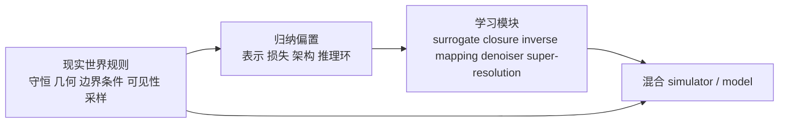

# 为什么更好的 Simulator 往往是 Learning + Rules：从 PDE、光线追踪到 DLSS

tldr ：**更好的 simulator 很少来自把规则丢掉、让模型自己理解，而更常来自把现实世界已经知道的结构写进去，让 learning 去补那些我们算得慢、建模差、或根本写不清的部分。**

很多经典计算问题，并不是被 data driven 整体替代了，而是被 **重新分解** 了。过去我们把整个系统都写成规则；现在我们更愿意把其中的一部分交给学习器，比如 closure、surrogate、逆问题、重建、降噪、超分辨、近似求解；但剩下那部分真正决定状态空间、几何关系、守恒约束、边界条件和可行解范围的结构，反而比以前更重要了。

我希望这篇文章解释清楚三个问题：

- **为什么传统 simulator 天生是 rule-heavy 的；**
- **为什么 learning 真能替代其中一部分计算；**
- **为什么最好的新系统通常不是纯学习，而是 learning + rules 的混合体。**

## Take Home Message

先把我认为最值得记住的结论放在最前面。

1. **Learning 最擅长补充的是昂贵映射、模糊规律和感知型重建，而不是从零发明世界规则。** 例如 operator learning 学的是参数到解的映射，DLSS 学的是稀疏/低分辨/带噪信号到更稳定画面的重建。
2. **Rules 的价值并没有下降，反而从手工求整个解转移成约束学习器的解空间。** 守恒、几何、边界条件、可见性、采样结构、相机模型、网格拓扑，这些都在决定什么是合理答案。
3. **Hybrid 的优势不只是折中，而是效率、泛化与一致性的共同提升。** 如果你知道一部分结构，最优策略往往不是让模型重新学一遍，而是把它变成归纳偏置，让模型只学剩下那部分。

## 前言：纯 rules vs 纯 learning是个假问题

在很多讨论里，rules 和 learning 会被描述成一种零和对立：要么你相信解析规则、数值求解、人工建模；要么你相信数据、神经网络、端到端学习。但只要认真看一眼现实中的强系统，就会发现这种划分本身就过于粗糙。

一个 simulator 真正在做的事情，不是给出一个看起来像真的结果，而是**在一个受约束的状态空间中，执行可解释的状态转移或观测生成**。这句话非常重要。因为它意味着：无论是流体模拟、材料模拟、光线追踪还是视觉重建，系统都在回答同一个问题——**什么状态是合法的，什么演化是可能的，什么观测是由这些状态生成的。**

把这个框架拆开来看：

- **流体模拟**：状态是速度场和压力场，约束来自 Navier-Stokes 方程与不可压条件，状态转移就是时间步进，观测则是可测量的流速、压力或阻力。
- **材料模拟**：状态是应力-应变场和位移场，约束来自本构关系与力平衡，状态转移是载荷路径上的演化，观测是形变、裂纹或断裂行为。
- **光线追踪**：状态是场景中光的分布，约束来自渲染方程与几何可见性，"演化"是光线在反射、折射、散射中的传播，观测是最终像素值。
- **视觉重建**（NeRF、3DGS）：状态是底层 3D 场景表示，约束来自相机模型与多视图几何一致性，观测是从各视角渲染出的图像。

一旦你接受这个统一视角，很多看似不相关的方法论争都能被还原成同一个设计问题：**你把多少约束写进系统，把多少留给数据去学？** 写进去的越多，状态空间越紧，搜索越高效，但灵活性越低；留给数据的越多，模型越灵活，但也越容易落入非法解或 OOD 失效。这才是 rules 与 learning 之间真正的张力——不是谁替代谁，而是**约束预算的分配问题**。

如果这件事完全没有结构，那么 learning 当然可以从海量数据里去学；但现实世界不是没有结构，恰恰相反，它有太多结构。守恒律、连续性、边界条件、相机投影、遮挡、反射、折射、局部性、时间一致性，都是硬约束。**当这些结构早就存在时，最聪明的做法通常不是把它们扔掉，而是把它们变成归纳偏置（bias）的一部分。**

所以我越来越不喜欢rule-based 会被 learning 全面取代这种讲法。更准确的说法应该是：**传统规则系统正在被重构成“结构化外壳 + 学习化内核”的混合系统。** 你可以把这看成一种工程分工变化：过去是 rules 负责从头到尾；现在是 rules 负责搭骨架，learning 负责填充。

## 旧世界：为什么光追和 PDE 求解本来是 rule-heavy

先看科学计算。经典 PDE 求解不是看数据像什么就输出什么，而是从一开始就写下控制方程。最抽象的写法通常像这样：

$$
\partial_t u + \mathcal{N}[u] = 0
$$

其中 $u$ 是状态，$\mathcal{N}[u]$ 是微分算子。真实工作并不止于写方程，还包括离散化、网格、数值稳定性、边界条件、时间推进、误差控制。也就是说，一个经典 solver 从设计上就在问：**什么样的解满足物理律，什么样的更新会发散，什么样的边界是不允许被破坏的。**

这类系统的强项，从来不只是精确，更是**它知道哪里不能乱来**。你可以批评它慢，批评它对复杂逆问题不友好，批评它在多次查询场景下成本太高，但你很难否认：它对合法状态空间的理解非常深。

图形学也是一样。早期 [Whitted 1980](https://cseweb.ucsd.edu/~viscomp/classes/cse274/wi26/readings/whitted.pdf) 的递归光线追踪，本质上已经把反射、折射、阴影这些几何-光学关系编码成了一套明确规则。到了 [Kajiya 1986](https://www.cs.rpi.edu/~cutler/classes/advancedgraphics/S13/papers/kajiya_rendering_equation_86.pdf)，渲染方程则把“场景中一点向某个方向的辐射亮度”写成了积分形式：

$$
L_o(x, \omega_o) = L_e(x, \omega_o) + \int_{\Omega} f_r(x, \omega_i, \omega_o) L_i(x, \omega_i) (n \cdot \omega_i) \, d\omega_i
$$

这个公式厉害的地方，不是它让渲染突然变容易了，而是它把“图像从哪里来”这件事写成了物理上自洽的问题。此后几十年的 path tracing、importance sampling、MIS、denoising，本质都在围绕它展开。

所以无论是 PDE solver 还是 ray tracer，旧世界的共同点都不是“全手工”，而是：

- **状态空间是显式定义的；**
- **合法更新由规则约束；**
- **误差分析和稳定性有理论；**
- **每个模块都知道自己在近似什么。**

这也是为什么经典 simulator 虽然慢，但它们很少出现一些奇怪的输出。它们会贵，会粗糙，会难调，但不太会把完全非法的答案输出。对很多科学和工程任务来说，这种特性本身就是资产。

| 路线 | 先验来自哪里 | 最擅长什么 | 典型短板 | 代表场景 |
| --- | --- | --- | --- | --- |
| 纯 rules | 方程、几何、解析近似、数值格式 | 可解释、稳定、约束清晰 | 慢、难逆、难覆盖复杂感知 | CFD、FEM、路径追踪 |
| 纯 learning | 数据分布、参数拟合、端到端目标 | 快、灵活、适合逆映射与重建 | OOD 脆弱、合法性难保证 | 图像重建、近似 surrogate |
| hybrid | rules 给结构，learning 学剩余误差或映射 | 兼顾效率、泛化与一致性 | 系统设计更复杂 | learned simulators、NeRF、DLSS |

## 学习真正替代了什么：从 surrogate 到 learned component

如果认真观察近十年的变化，你会发现 learning 真正替代的，通常不是整个物理过程，而是其中某类 **高成本子任务**。

第一类是 **surrogate / emulator**。原始 solver 很贵，但同一个方程族、同一类边界条件、同一种参数扫描会被反复查询。这时学习器就不再试图做“世界定律的发明者”，而更像是在学一个近似算子：给定参数、几何或初值，快速返回一个近似解。像 [DeepONet](https://arxiv.org/abs/1910.03193)、[FNO](https://arxiv.org/abs/2010.08895)、[MeshGraphNets](https://arxiv.org/abs/2010.03409) 基本都落在这条线上。

第二类是 **closure / unresolved scale modeling**。很多真实系统里，小尺度效应并不容易显式建模，比如湍流 closure、子网格参数化、复杂材料响应、地球系统中的 parameterization。这里 learning 的角色，是去学一个传统规则写得不完美、或者写出来也非常贵的闭合项。你没有抛弃方程；你是在方程里换掉那块最难写清的局部模块。

第三类是 **inverse problem**。前向模拟往往知道怎么做，但反过来“从观测恢复状态、几何、材料、参数”会非常难。这个方向上，learning 往往比纯优化更有优势，因为它天然适合从观测空间回到潜在变量空间。像 [NVDiffrec](https://arxiv.org/abs/2111.12503) 这种 inverse rendering 系统，本质就是把“从图像反推几何、材质、光照”这件事变成可微优化与学习结合的问题。

第四类是 **reconstruction / denoising / super-resolution**。这在实时图形里尤其明显。路径追踪可以给你高质量信号，但采样预算永远不够，于是图像会噪、分辨率会低、时序会抖。此时 learning 不是去接管光线传播本身，而是去学习如何从稀疏、带噪、不完整的信号中恢复出更稳定的图像。DLSS 与 Ray Reconstruction 正是这个范式。

所以，learning 替代的不是规律，而是下面这些东西：

- **昂贵但重复的查询；**
- **规则写不清的闭合项；**
- **从观测到隐变量的逆映射；**
- **从不完整信号到高质量结果的重建过程。**

这也是我觉得最重要的认知转变：**data driven 的胜利，不是证明 rules 没用了，而是说明我们终于学会把问题拆得更合理了。**

## 一个实用框架：把 rules 看成不同强度的归纳偏置

“规则作为归纳偏置”这句话很容易说得太抽象。更实用的理解方式，是把它拆成四层。

### 1. 表示层 bias：先决定状态空间长什么样

你让模型直接输出像素、直接输出网格节点、直接输出隐式场，差别非常大。表示本身就决定了模型更容易学到什么，也更难学到什么。

- 在 PDE 中，网格、点云、谱域、函数空间表示都不一样。
- 在图形学中，mesh、radiance field、Gaussian primitives 也不一样。
- 在时序系统中，显式 latent state 与纯 observation model 也完全不同。

很多所谓学习突破，其实先发生在表示层。比如 [Instant-NGP](https://research.nvidia.com/publication/2022-07_instant-neural-graphics-primitives-multiresolution-hash-encoding) 的关键不是一句更大的神经网络，而是多分辨率 hash encoding 这种高度结构化的表示；[3D Gaussian Splatting](https://repo-sam.inria.fr/fungraph/3d-gaussian-splatting/) 的关键也不是更深的网络，而是把场景表示改写成可高效渲染的 Gaussian primitive。表示学习是神经网络的关键，也是AI4S的核心，找到符合场景需求的表示并实现可能比研究算法本身更重要。

### 2. 目标层 bias：把什么算错写进 loss

PINNs 最直观的一点，就是它把 PDE residual 写进损失函数。你不是只拿数据点监督，而是显式告诉网络：**这些导数关系、这些边界、这些守恒不能违背。**

[Karniadakis 等人的综述](https://www.nature.com/articles/s42254-021-00314-5) 有一句很关键的话：physics-informed learning 不是只有数据，也不是只有数学模型，而是把 noisy data 和 physical law 一起纳入训练。这个视角非常重要，因为它说明 **loss 不是附属品，而是世界观，loss是引导模型到我们所需的空间的surrogate。**

### 3. 架构层 bias：把相互作用模式写进网络

[DeepONet](https://arxiv.org/abs/1910.03193) 用 branch/trunk 结构学习 operator；[FNO](https://arxiv.org/abs/2010.08895) 把积分核参数化搬到 Fourier 空间；[MeshGraphNets](https://arxiv.org/abs/2010.03409) 直接把 mesh 上的局部相互作用和拓扑关系写进图网络；[Geo-FNO](https://jmlr.org/beta/papers/v24/23-0064.html) 则显式处理一般几何而不只是在规则网格上做 FFT。

这些方法的共同点都是：**它们没有假装世界是一张任意表格。** 它们把局部性、拓扑、频域结构、函数到函数映射这些先验提前塞进了架构里。

### 4. 推理层 bias：让学习器嵌在 solver 或 rendering loop 里

最强的 hybrid 系统往往不是训练时有规则，推理时没规则，而是让 learning 模块直接工作在原有求解环中。比如 differentiable rendering 把可微渲染器放在优化回路里；很多 scientific ML 工作把学习器作为 emulator、closure 或预条件器，嵌进原有数值流程。

这一层特别像现实中的工程智慧：**不是把旧系统推翻，而是把最昂贵的一段换成 learned component。**

我会把这个图当成全文最核心的 mental model：**规则不是 learning 的对立面，而是 learning 的压缩先验。**

## Case 1：科学计算里的 learned simulator
如果说哪条线最能说明 learning + rules 不是一句口号，那就是 scientific machine learning。

### 从 PINNs 开始：把 PDE 直接写进训练目标

[PINNs](https://maziarraissi.github.io/PINNs/) 最经典的写法，是用网络近似 $u(t, x)$，再用自动微分构造 PDE residual，把初值、边界和方程残差一起放进损失。它的吸引力非常大：

- 不需要完全依赖大规模标注数据；
- 对 inverse problem 很友好；
- 可以直接利用控制方程；
- 在数据稀缺场景里能把先验变成有效监督。

但 PINNs 也暴露了一个很重要的事实：**把 physics 写进 loss，不等于问题自动解决。** [Nature Reviews Physics 2021 综述](https://www.nature.com/articles/s42254-021-00314-5) 已经把它的能力和限制都说得很清楚：这类方法在 forward / inverse problems 上很有潜力，但可扩展性、鲁棒性、标准化 benchmark 仍然是核心难题。换句话说，物理先验确实重要，但如果实现方式不对，训练仍然会很难。

我对 PINNs 的理解是：它像是第一代“把规则塞进 learning”的范式。它让整个领域意识到，**神经网络不是只能吃 i.i.d. 样本，它也能吃结构。** 但它还不是最终答案。

### 从单个解到解算子：DeepONet 与 FNO

接下来很关键的一步，是从学某一个 PDE 的某一个解转向学一族 PDE 问题的解算子。

[DeepONet](https://arxiv.org/abs/1910.03193) 的意义正在这里。它把问题写成函数到函数的映射，用 branch net 编码输入函数，用 trunk net 编码输出位置。它要学的不再只是一个静态近似器，而是一个 operator：

$$
\mathcal{G}: a(x) \mapsto u(x)
$$

这一步非常像把 simulator 从单次求解器升级成可复用的映射器。你不再为每个参数实例单独迭代求解，而是训练一个可反复调用的近似算子。

[FNO](https://arxiv.org/abs/2010.08895) 则更进一步。它把 kernel 参数化到 Fourier 空间，最早一批结果就已经展示出：在 Burgers、Darcy、Navier-Stokes 这类 PDE 上，它可以比传统求解器快很多，并且在某些设定下表现出 zero-shot super-resolution 的能力。这个结果的重要性，不只是“更快”，而是它说明：**如果任务本质是多次查询同一类 operator，那么学 operator 本身就可能比每次都从头数值求解更划算。**

### 从规则网格到复杂拓扑：MeshGraphNets 与 Geo-FNO

不过，现实问题很快就会告诉你：规则网格不是全部世界。真正的工程问题常常牵涉复杂边界、不规则网格、变形体和多尺度耦合。

这时候 [MeshGraphNets](https://arxiv.org/abs/2010.03409) 非常有代表性。它直接在 mesh graph 上做 message passing，并把 adaptivity 纳入 forward simulation。它的意义在于：**离散结构本身就是物理 bias。** 你不再逼着模型把一切压扁成规则 tensor，而是承认物理系统天然有拓扑。

[Geo-FNO](https://jmlr.org/beta/papers/v24/23-0064.html) 则解决了另一个关键痛点：经典 FNO 依赖 FFT，天然更适合规则网格和矩形域；Geo-FNO 明确把任意几何 deform 到 latent uniform grid，再在潜空间里应用 FNO。它说明一个很深刻的事实：**当问题不适合某种架构时，不是放弃 bias，而是重写 bias。**

### 近一年真正发生了什么：不是更像黑箱，而是更像软件组件

如果把时间窗口收窄到近一年，我觉得有三条变化尤其值得记住。

第一，领域开始更认真地讨论 **benchmark 和 OOD**。例如 [2025 年关于复杂几何流动预测的 benchmark](https://www.nature.com/articles/s44172-025-00513-3) 很直接地点出：传统 simulation 虽然准确，但昂贵；SciML 被拿来追求更快、更可扩展的方案。然而一旦几何复杂、分布外、精度要求上来，方法之间的差距会迅速暴露出来。也就是说，现在已经不是能不能学的问题，而是学出来的 surrogate 在什么边界内可靠。

第二，研究开始重新把 **solver 放回闭环**。例如 [SC-FNO](https://openreview.net/forum?id=DPzQ5n3mNm) 这类 2025 工作，不再满足于只拟合解本身，而是强调 sensitivity、inverse problems 和 differentiable numerical solvers。这个方向很说明问题：领域没有朝更纯的黑箱走，反而是在继续把数值结构引回 operator learning。

第三，emulator 开始被当成真正的软件组件，而不是论文里的 demo。像 [2026 年 climate emulator perspective](https://www.nature.com/articles/s43247-026-03238-z) 就明确提出三件事：simulator 和 emulator 要 co-design，benchmark 要 machine-learning-ready，而且 emulator 要被当作可靠的软件组件去部署和分析。我很喜欢这个判断，因为它说明 learned simulator 正在走向工程系统的一部分”。

| 方法 | 学什么 | rules 从哪里进入 | 优势 | 典型问题 | 代表来源 |
| --- | --- | --- | --- | --- | --- |
| PINNs | 单个 PDE 解或逆问题参数 | PDE residual、边界条件、守恒写进 loss | 小样本、逆问题友好 | 训练病态、尺度化难 | [PINNs](https://maziarraissi.github.io/PINNs/), [综述](https://www.nature.com/articles/s42254-021-00314-5) |
| DeepONet / FNO | 参数到解的 operator | branch-trunk 结构、频域卷积 | 多次查询快、可学函数到函数映射 | OOD 与复杂几何受限 | [DeepONet](https://arxiv.org/abs/1910.03193), [FNO](https://arxiv.org/abs/2010.08895) |
| MeshGraphNets | 网格上动力学 rollout | mesh topology、局部相互作用、adaptivity | 适合复杂拓扑和形变 | 长时稳定性、层级设计难 | [MeshGraphNets](https://arxiv.org/abs/2010.03409) |
| recent physics-informed operator variants | 在 operator learning 上继续加敏感度、几何与 solver 结构 | differentiable solvers、geometry-aware mapping、benchmark co-design | 更接近真实工程流程 | 系统复杂、验证要求高 | [Geo-FNO](https://jmlr.org/beta/papers/v24/23-0064.html), [SC-FNO](https://openreview.net/forum?id=DPzQ5n3mNm), [2025 benchmark](https://www.nature.com/articles/s44172-025-00513-3) |

如果你只记一句话，我会把 scientific ML 的主线概括为：**不是让网络替代 PDE，而是让网络学习 PDE family 里最值得被 amortize 的那部分计算。**

## Case 2：图形学里的 differentiable rendering、NeRF 与 3DGS

如果说科学计算告诉我们rules 可以变成 loss 和 operator bias，那图形学告诉我们的则是：**很多看上去最 data-driven 的方法，内部反而非常 rule-heavy。**

### Differentiable rendering：先有渲染环，再谈学习

[differentiable rendering / inverse rendering](https://arxiv.org/abs/2111.12503) 的思路其实非常朴素：我有图像观测，我想恢复几何、材质、光照，于是我构造一个可以反传梯度的渲染器，把差异通过渲染过程回传到隐变量上。

这件事一点都不learning。它依赖的是：

- 相机模型；
- 可见性与投影；
- 光照与材质参数化；
- 可微 rasterization 或可微 Monte Carlo rendering；
- 几何表示与 mesh 提取。

像 [NVDiffrec](https://arxiv.org/abs/2111.12503) 或 NVIDIA 关于 [Differentiable Slang / nvdiffrec](https://developer.nvidia.com/blog/differentiable-slang-example-applications/) 的材料就很典型：学习和优化可以恢复 shape、material、lighting，但整个问题之所以可做，是因为渲染 loop 本身极其结构化。这里 learning 的角色不是替代渲染方程，而是**利用渲染方程去解 inverse problem**。

### NeRF：看起来像神经场，实际上站在传统渲染肩膀上

[NeRF](https://arxiv.org/abs/2003.08934) 往往会被拿来当神经网络直接学 3D 世界的代表。但它的真正精妙之处，不是只靠 MLP，而是把神经表示和 classic volume rendering 紧紧绑在一起。

NeRF 输入 3D 位置和视角方向，输出密度与辐射颜色；真正把这些量变成图像的，不是神经网络单独完成，而是沿着 camera rays 采样、积分、累积透射率的 **体渲染过程**。也就是说：

- 相机姿态是已知或另行估计的；
- 射线采样是写死的几何过程；
- 颜色合成遵守体渲染积分；
- 优化目标依赖多视图几何一致性。

所以 NeRF 从来不是用网络替代渲染，而更像是：**把场景表示神经化，但保留渲染过程的结构。** 这正是我们要讨论的 hybrid。

### Instant-NGP：真正改变游戏规则的是结构化表示

NVIDIA 的 [Instant-NGP](https://research.nvidia.com/publication/2022-07_instant-neural-graphics-primitives-multiresolution-hash-encoding) 之所以重要，不只是因为它快，而是因为它告诉大家：提升 learning-based simulator / renderer 的一个关键方向，不一定是更大模型，而可能是 **更强的表示 bias**。

它用多分辨率 hash table 存 trainable feature，再配一个很小的网络。这个设计极大减少了训练与推理成本，让高质量 neural graphics primitive 的训练时间从过去的论小时/天压缩到论秒/分。这其实很像一堂关于 inductive bias 的公开课：**当你把空间结构写进编码方式，网络就不必再从头学习那份几何组织。**

### 3D Gaussian Splatting：从“让神经网络记住场景”到“让表示直接适合渲染”

[3D Gaussian Splatting](https://repo-sam.inria.fr/fungraph/3d-gaussian-splatting/) 的冲击更大。它的 project page 写得很清楚：方法通过 3D Gaussians、interleaved optimization / density control 以及 visibility-aware rendering，实现了 **1080p 下 100fps 以上** 的高质量 novel-view synthesis。

我觉得 3DGS 最值得学的，不只是“又快又好”，而是它体现出一个更普遍的趋势：**当某个问题已经有了很明确的几何与渲染结构时，研究者会越来越倾向于把网络从通用逼近器，改造成强结构化表示的一部分。**

从 NeRF 到 Instant-NGP，再到 3DGS，这条线其实在不断回答同一个问题：如果我们已经知道 camera model、sampling path、visibility、compositing 这些规则，为什么还要让一个笨重的黑箱去重新发现它们？更好的做法当然是：把它们直接保留下来，让网络只学 appearance、density、local detail 和更难写的那部分。

## Case 3：实时图形里的 ray tracing、denoiser 与 DLSS

如果前两个 case 还带一点学术味道，那么实时图形里的 DLSS 就是工程世界里最直观的例子。

### 为什么光线追踪天然需要 hybrid

光追或路径追踪的优点非常明确：它尊重几何、阴影、反射、折射、全局光照的生成机制。坏消息也同样明确：**采样预算不够时，它天然会噪。** 你当然可以继续加 sample，但实时渲染预算不会凭空变多。

于是现实的工程答案不是放弃 ray tracing 改让 AI 自己画，而是：

- 用 ray tracing 负责产生受物理约束的底层信号；
- 用 denoiser / reconstruction 负责把有限样本变成可看的图像；
- 用 super-resolution 和 frame generation 去换取实时性。

这就是一个非常纯粹的 hybrid stack：底层结构仍然是 rule-based 的，上层重建则 increasingly learned。

### DLSS 3.5：学习模块不是替代光追，而是替代一堆手工调参 denoiser

[NVIDIA 对 DLSS 3.5 Ray Reconstruction 的官方描述](https://www.nvidia.com/en-us/geforce/news/gfecnt/20238/nvidia-dlss-3-5-ray-reconstruction/) 非常有代表性：它明确说 Ray Reconstruction 通过 **single neural network** 取代多个 **hand-tuned denoisers**，以改善 ray-traced effects 的图像质量。

这句话其实点穿了整件事的本质。DLSS 3.5 不是在说AI 比物理更懂光追，而是在说：**当你已经有 ray-traced signal，但它因为预算限制而噪声很大时，统一的 learned reconstructor 比一堆人工调参数的专用 denoiser 更合适。**

这非常像科学计算里的 learned closure：底层规律还在，学习器接管的是那个最昂贵、最难手工调、也最依赖 perceptual prior 的部分。

### DLSS 4 与 4.5：学习模块继续加强，但仍站在渲染管线上工作

按我在 **2026 年 3 月 15 日** 检索到的 NVIDIA 官方资料，[DLSS 4 Technology 页面](https://www.nvidia.com/en-us/geforce/technologies/dlss/) 已明确写到：**DLSS Super Resolution、Ray Reconstruction 和 DLAA 使用 transformer AI models**。而 [2026 年 1 月 14 日的 DLSS 4.5 公告](https://www.nvidia.com/en-us/geforce/news/dlss-4-5-super-resolution-available-now/) 进一步给出更具体的信息：DLSS 4.5 的 Super Resolution 升级到 **2nd generation transformer model**。

这说明什么？说明 industrial system 的结论和学术系统的结论是同向的：**当重建问题足够复杂时，学出来的模块确实可以持续替代 hand-crafted heuristics。** 但它仍然是工作在已有渲染管线之上的：没有底层 G-buffer、ray-traced samples、时间历史、渲染约束，这些神经模块也无从着力。

所以我会把 DLSS 看成一个很好的教学案例。它告诉我们：

- 真实世界里，学习模块往往是在替代 heuristics，不是在替代物理；
- 真正可落地的 AI 渲染，通常依赖高度结构化的输入；
- 最强系统来自“signal generation by rules + signal reconstruction by learning”。

| 系统 | rules 提供什么 | learning 负责什么 | 为什么 hybrid 更强 | 代表来源 |
| --- | --- | --- | --- | --- |
| Ray tracing / path tracing | 可见性、反射折射、采样与光传输 | 通常不学核心传播，只学降噪或重建 | 底层信号可信，上层重建更高效 | [Whitted 1980](https://cseweb.ucsd.edu/~viscomp/classes/cse274/wi26/readings/whitted.pdf), [Kajiya 1986](https://www.cs.rpi.edu/~cutler/classes/advancedgraphics/S13/papers/kajiya_rendering_equation_86.pdf) |
| NeRF | 相机模型、ray sampling、volume rendering | density / radiance field 表示 | 学习场景表示，但不放弃渲染结构 | [NeRF](https://arxiv.org/abs/2003.08934) |
| 3DGS | visibility-aware rendering、Gaussian splat compositing | 场景表示与优化 | 用更适合渲染的表示替代大黑箱 | [3D Gaussian Splatting](https://repo-sam.inria.fr/fungraph/3d-gaussian-splatting/) |
| DLSS-RR | 渲染管线、ray-traced buffers、时序结构 | denoising、super-resolution、frame reconstruction | 用 learned reconstructor 替代 hand-tuned heuristics | [DLSS 3.5 RR](https://www.nvidia.com/en-us/geforce/news/gfecnt/20238/nvidia-dlss-3-5-ray-reconstruction/), [DLSS 4](https://www.nvidia.com/en-us/geforce/technologies/dlss/) |

## 什么应该交给 learning，什么仍该写进 rules

到这里，一个真正实用的问题就出来了：如果我要设计一个更好的 simulator / model，到底哪些部分该学，哪些部分该手写？

### 更适合交给 learning 的部分

- **逆问题**：从观测恢复隐变量、参数、材质、几何、状态。
- **surrogate / emulator**：同类问题要重复查询很多次时，学习 operator 非常划算。
- **closure / unresolved physics**：子网格、经验项、复杂材料响应、难显式建模的交互。
- **感知驱动的重建**：降噪、超分、插帧、缺失信息补全。
- **多模态和统计规律很强的部分**：例如复杂视觉外观、真实纹理、噪声模型。

### 更应该写进 rules 的部分

- **合法状态空间的定义**：什么是守恒、可行、稳定、无穿透、无负密度。
- **几何和拓扑约束**：网格邻接、可见性、边界条件、物体接触关系。
- **基础生成机制**：光如何传播、流体如何守恒、边界如何生效。
- **评估接口**：什么叫误差、什么叫 physically valid、什么叫视觉一致。
- **高风险硬约束**：涉及安全、科学结论、工程认证的部分。

### 最值得优先考虑的 hybrid 形态

如果一定要给一个默认推荐，我最推荐的是以下三种结构：

1. **solver outside, learner inside**：让学习器当 closure、preconditioner、sub-grid model。
2. **learner outside, solver inside**：让学习器预测参数、初值、边界或 proposal，再交给 solver 修正。
3. **structured generator + learned reconstructor**：底层用 rules 产生受约束信号，上层用 learning 做重建、补全和加速。

这三种结构几乎能覆盖本文讨论的大多数成功案例。也就是说，真正有价值的设计不是all in end-to-end，而是**找到那个既可学、又值得学、还不会破坏系统合法性的模块边界。**

## 最后的判断

如果要把全文压成一句话，我会这样写：

**更好的 simulator / model，不是把 world rules 忘掉以后再从数据里盲学一遍，而是把那些已经知道的结构——守恒、几何、边界条件、可见性、采样、拓扑——变成 bias，让 learning 去专注于真正值得学习的部分。**

这也是为什么我越来越相信：未来更强的 world model，本质上也会越来越像更强的 simulator。它不会只会接着预测下一个 token 或下一帧，而会更擅长在一个受现实规则约束的 latent state space 里演化状态。到那时，learning 和 rules 的关系也许会变得更像今天的 DLSS、NeRF 或 neural operator：**不是互相替代，而是彼此分工。**

从这个角度看，“用现实世界存在的核心规则作为归纳偏置，构建更好的 simulator / model”并不只是一个 engineering trick，它更像是通向更可靠 AI 的一条主线。因为真正值得学习的，从来不是世界已经白纸黑字写出来的那部分；而是那些写不全、算不快、却又真实存在的复杂剩余项。

## 参考资料
- J. Turner Whitted, [An Improved Illumination Model for Shaded Display](https://cseweb.ucsd.edu/~viscomp/classes/cse274/wi26/readings/whitted.pdf), 1980.
- James T. Kajiya, [The Rendering Equation](https://www.cs.rpi.edu/~cutler/classes/advancedgraphics/S13/papers/kajiya_rendering_equation_86.pdf), SIGGRAPH 1986.
- Maziar Raissi et al., [Physics Informed Deep Learning / PINNs project page](https://maziarraissi.github.io/PINNs/).
- George Em Karniadakis et al., [Physics-informed machine learning](https://www.nature.com/articles/s42254-021-00314-5), Nature Reviews Physics, 2021.
- Lu Lu et al., [DeepONet](https://arxiv.org/abs/1910.03193), 2019/2020.
- Zongyi Li et al., [Fourier Neural Operator for Parametric Partial Differential Equations](https://arxiv.org/abs/2010.08895), 2020.
- Tobias Pfaff et al., [Learning Mesh-Based Simulation with Graph Networks](https://arxiv.org/abs/2010.03409), 2020/ICLR 2021.
- Zongyi Li et al., [Fourier Neural Operator with Learned Deformations for PDEs on General Geometries](https://jmlr.org/beta/papers/v24/23-0064.html), JMLR 2023.
- Huayu Deng et al., [Sensitivity-Constrained Fourier Neural Operators for Forward and Inverse Problems in Parametric Differential Equations](https://openreview.net/forum?id=DPzQ5n3mNm), ICLR 2025.
- A. Radha et al., [Benchmarking scientific machine-learning approaches for flow prediction around complex geometries](https://www.nature.com/articles/s44172-025-00513-3), Communications Engineering, 2025.
- A. Mankin et al., [Rewiring climate modeling with machine learning emulators](https://www.nature.com/articles/s43247-026-03238-z), Communications Earth & Environment, 2026.
- Ben Mildenhall et al., [NeRF: Representing Scenes as Neural Radiance Fields for View Synthesis](https://arxiv.org/abs/2003.08934), 2020.
- Thomas Muller et al., [Instant Neural Graphics Primitives with a Multiresolution Hash Encoding](https://research.nvidia.com/publication/2022-07_instant-neural-graphics-primitives-multiresolution-hash-encoding), SIGGRAPH 2022.
- Jon Hasselgren et al., [Extracting Triangular 3D Models, Materials, and Lighting From Images](https://arxiv.org/abs/2111.12503), CVPR 2022.
- NVIDIA Developer Blog, [Differentiable Slang: Example Applications](https://developer.nvidia.com/blog/differentiable-slang-example-applications/), 2023.
- Bernhard Kerbl et al., [3D Gaussian Splatting for Real-Time Radiance Field Rendering](https://repo-sam.inria.fr/fungraph/3d-gaussian-splatting/), SIGGRAPH 2023.
- NVIDIA, [NVIDIA DLSS 3.5 Ray Reconstruction](https://www.nvidia.com/en-us/geforce/news/gfecnt/20238/nvidia-dlss-3-5-ray-reconstruction/), 2023.
- NVIDIA, [DLSS 4 Technology](https://www.nvidia.com/en-us/geforce/technologies/dlss/), accessed 2026-03-15.
- NVIDIA, [NVIDIA DLSS 4.5 Super Resolution Available Now](https://www.nvidia.com/en-us/geforce/news/dlss-4-5-super-resolution-available-now/), 2026-01-14.