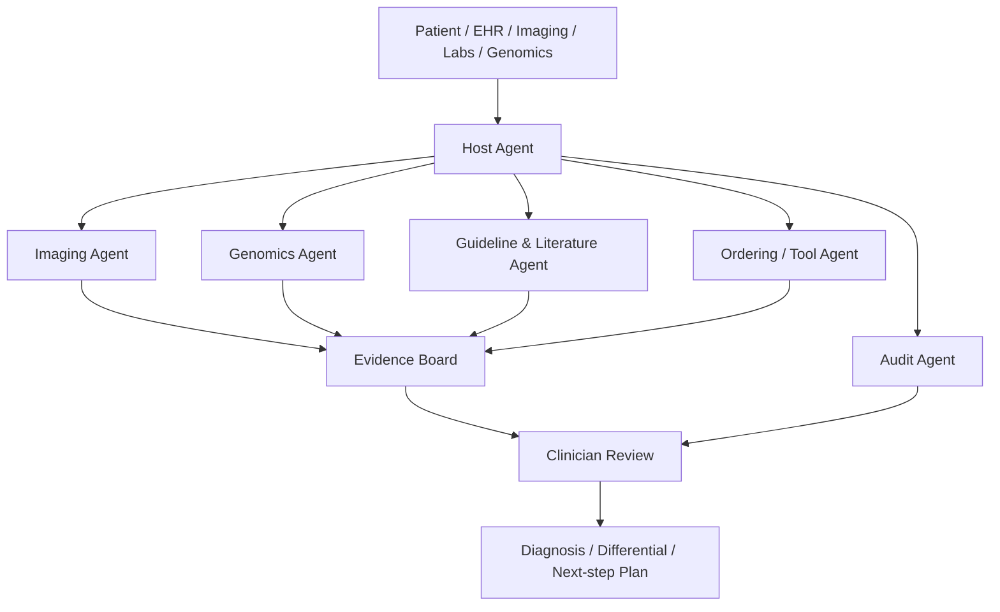

# 从黑盒预测器到可追溯医疗 Agent：医疗AI的未来

如果把过去十年的医疗 AI 压成一个最熟悉的画面，它大概是这样：你给系统一张胸片、一段 ECG、一份 EHR，模型返回一个概率值。

这个范式并没有错。恰恰相反，它曾经非常成功。[DeepPatient](https://www.nature.com/articles/srep26094)、[Gulshan et al. 的糖网筛查系统](https://jamanetwork.com/journals/jama/fullarticle/2588763)、[CheXNet](https://arxiv.org/abs/1711.05225) 这类工作都证明了一件事：只要任务边界足够清楚、标签足够稳定、评测足够干净，深度学习完全可以在医疗子任务上做出很强的预测器。

但医疗场景最缺的，从来都不只是更高一点的分数，而是可以被相信以用于临床技术。

医生真正要的，是一个可以被追问的系统：它要能解释为什么把某个病排在前面，能指出结论依赖了哪些图像区域、哪些检验指标、哪些文献证据，也要能在证据冲突时承认不确定，而不是硬给一个看起来很像答案的答案。

沿着这条演进继续看，医疗 AI 的下一条主线，更像是从黑盒预测器走向可追问、可复核、可调工具、可追溯证据链的医疗 Agent 系统。

## 黑盒预测器时代的边界

先把一个常见误解纠正掉：早期医疗深度学习并不是走错路了。

像 [DeepPatient](https://www.nature.com/articles/srep26094) 这种 2016 年 5 月 17 日发表的工作，本质上是在说：EHR 这样的高维、稀疏、脏乱的临床数据，也可以被压缩成有用的表征，然后拿去做下游疾病预测。几乎同一时期，2016 年 11 月 29 日在线发表的[糖网筛查工作](https://jamanetwork.com/journals/jama/fullarticle/2588763) 让大家看到，单任务视觉模型在特定影像任务上已经可以逼近很高的实用水平。再往后，2017 年 11 月 14 日放出的[CheXNet](https://arxiv.org/abs/1711.05225) 又把胸片 + CNN + 分类这条线推得更远。

这些系统的问题，不是它们不强，而是它们把医疗里的复杂性压得太平了。

输入一张图，输出一个病种概率；输入一段波形，输出一个异常标签；输入一份病历，输出一个风险分数。这种形式天然适合做 benchmark，也天然适合做 retrospective study，因为评测目标清楚、标签定义清楚、统计指标也清楚。

但临床推理并不长这样。

真实世界里的诊断，往往是一个持续更新的过程：先根据主诉形成初始假设，再根据问诊补全上下文，再决定是否做检查，再根据影像、检验、病理、遗传结果去重新排序候选诊断。它不是看完就答，而是边看边问、边查边改、边冲突边澄清。

也正因为如此，医疗 AI 后来的问题，其实不是模型够不够聪明，而是我们是不是一直在用过于扁平的接口描述诊断。

## 2017 年前后，问题终于被定义

[XAI](https://arxiv.org/abs/1712.09923)对可解释AI在医疗中的价值进行了全面判断。它的重要性不在于提出了哪个具体可解释性算法，而在于它把一个此前经常被弱化的问题直接摊开：**医疗不能长期容忍一个高分但不可追问的系统。** 当然作者在2017年无法想到2026年的AI Agent，可解释性也可以从原本的模型可解释变为系统可解释，但方向是一致的。

这件事一旦被说清楚，整个方向的评价标准就开始变化了。

过去大家更关心的是：AUC 是不是更高，灵敏度是不是更强，能不能在一个固定测试集上超过医生。XAI 这条线的真正作用，是把问题改写成：

- 这个系统到底看到了什么证据？
- 这些证据能不能被人复核？
- 当结论错了，我们能不能知道它错在感知、错在对齐、还是错在推理？
- 当系统建议下一项检查时，它到底是在做有根据的更新，还是只是把常见建议模板化复读？

这里必须克制一点：可解释不等于白盒，可追溯也不等于因果证明已经成立。

但医疗场景真正需要的，本来也不是一个神话式的完全透明模型，而是一个能把中间证据外化出来、让人类可以反问、可以复查、可以审计的系统。换句话说，XAI 并没有直接把医疗 AI 变成 Agent，但它先把 Agent 时代最需要的那层要求提前说出来了：**系统不只要给答案，还要留下过程。**

## 多模态基础模型改变的，不是输入数量，而是证据进入推理的方式

沿着 2022 年到 2026 年这段演进，很多人会简单概括成医疗大模型开始支持多模态。

但我觉得更准确的说法是：医疗 AI 终于开始重新尊重原始证据本身。

早期系统通常是把每个模态先做一次强压缩。图像模型先给标签，ECG 模型先给节律类别，检验指标先阈值化，最后再把这些中间结果交给另一个模块做综合判断。这个 pipeline 当然能跑，但它有两个天然问题：一是信息损失，二是错误来源难追踪。

多模态基础模型的价值，在于它尝试让影像、文本、病历、部分时序信号直接进入统一的语义空间。技术上说，就是把视觉或时序编码结果投影到语言模型可以利用的表示空间里，再让模型在生成过程中持续研究原始证据，而不是只盯着一份早已压扁的摘要。

这也是为什么像 [BioViL](https://arxiv.org/abs/2204.09817)、[LLaVA-Med](https://arxiv.org/abs/2306.00890)、[Med-PaLM M](https://arxiv.org/abs/2307.14334)、[Advancing Multimodal Medical Capabilities of Gemini](https://arxiv.org/abs/2405.03162) 以及 [MedGemma](https://huggingface.co/google/medgemma-1.5-4b-it) 这条线会越来越重要。它们不只是让模型能看图说话，而是在搭建一层新的医学接口：原始模态不再只服务于一次性分类，它开始参与后续的解释、问答、推理和工具调用。

这一步看似只是建模升级，实际上是在给医疗 Agent 铺底座。

因为只要系统未来想像医生一样连续工作，它就不能只接收离散标签。它必须能处理图像、报告、病程、生命体征、化验单、病理、基因结果之间的相互制约关系。多模态基础模型做的，正是把这些证据重新连回到语言空间和决策空间里。

当然，这里也不能讲得太满。

并非所有医疗模态都同样容易被语言化。胸片和病理图像相对还比较容易借助报告和描述对齐；ECG、动态生命体征、病程演化和纵向检验变化要难得多，因为真正关键的信息常常分布在时间轴、导联关系、上下文变化里，而不是某一块静态区域。这也是为什么我不想把多模态形成成一个已经完成的统一世界。截至 2026 年 3 月，我们只是看到了底座开始成形，而不是大一统已经实现。

## 一条够用的时间线

| 日期 | 节点 | 它真正改变了什么 |
| --- | --- | --- |
| 2008-10-23 | [HPO](https://pubmed.ncbi.nlm.nih.gov/18950739/) | 把遗传病表型变成可计算、可检索、可对齐的标准语言。 |
| 2015-11-12 | [Exomiser](https://www.nature.com/articles/gim2015137) | 把 phenotype 和 variant ranking 接起来，形成可复用的基因诊断工具链。 |
| 2016-05-17 | [DeepPatient](https://www.nature.com/articles/srep26094) | 代表黑盒预测器时代：EHR 可以直接压成风险预测。 |
| 2017-12-28 | [Medical XAI](https://arxiv.org/abs/1712.09923) | 高分但不可追问第一次被明确命名成医疗里的核心问题。 |
| 2022-04-21 | [BioViL](https://arxiv.org/abs/2204.09817) | 医疗影像与报告开始被系统性对齐，多模态基础表征成形。 |
| 2023-07-26 | [Med-PaLM M](https://arxiv.org/abs/2307.14334) | 通才式医疗多模态模型开始出现。 |
| 2024-05-05 | [Agent Hospital](https://arxiv.org/abs/2405.02957) | 研究对象从单次输出转向医院流程里的多角色系统。 |
| 2024-05-13 | [AgentClinic](https://arxiv.org/abs/2405.07960) | 静态医学问答被指出过于乐观，序贯临床决策成为更合理的评测单位。 |
| 2025-04-09 | [AMIE 的 Nature 版本](https://www.nature.com/articles/s41586-025-08866-7) | 对话式诊断系统成为真实桥梁：问诊本身开始被纳入能力定义。 |
| 2025-09-24 | [MACD](https://arxiv.org/abs/2509.20067) | 多智能体不再只是多人讨论，而开始强调可复用经验与协同流程。 |
| 2026-02-18 | [DeepRare](https://www.nature.com/articles/s41586-025-10097-9) | phenotype、genotype 和 literature 首次被较完整地组织成可追溯的罕见病 Agent 系统。 |

## 从会不会答题到会不会走流程

如果说多模态基础模型解决的是“证据能不能进来”，那么医疗 Agent 解决的就是证据进来以后，系统究竟会不会工作。

这也是为什么我会把 [AMIE](https://www.nature.com/articles/s41586-025-08866-7) 看成一个很关键的桥梁。它还不是完整意义上的多智能体系统，但它已经把一件重要的事做对了：医疗能力不应该只被理解为回答医学问题的能力，而应该包括问诊、病史采集、差异化诊断、沟通和下一步建议。

这一步一旦成立，随后 2024 年到 2025 年的很多工作就顺理成章了。

[Agent Hospital](https://arxiv.org/abs/2405.02957) 做的是把医院流程模拟出来，让“医生、护士、病人”这些角色以互动方式构成一个环境；[AgentClinic](https://arxiv.org/abs/2405.07960) 做的是把静态 MedQA 之类的题库改造成问诊、检查、工具调用、再决策的序贯任务；[MedAgents](https://aclanthology.org/2024.findings-acl.33.pdf) 则把 MDT 式的多学科讨论形式化成多角色协作流程；[MACD](https://arxiv.org/abs/2509.20067) 更进一步，开始强调多智能体之间如何沉淀可复用的临床知识，而不是每次都从头吵一遍。

这些系统真正共同推进的，不是多模型 ensemble 这么简单，而是三件更本质的事：

第一，**临床推理是序贯的**。一个系统如果不会追问，不会说我还缺哪条关键信息，那它离真实诊断还很远，只有在算法研究实验室里我们才能将全部内容一次性喂给AI，在临床上我们都不会一次性做完全部检查。

第二，**评测必须交互化**。静态 benchmark 上答对一道题，和在一个信息不完整、会不断更新、还要调工具的环境里做对同一件事，不是一回事。现有的Benchmark技术仍旧无法精准的衡量临床问诊本身的复杂度。

第三，**多智能体的价值不在于投票，而在于显式分工与互相质询**。影像、检验、病理、遗传、指南检索、病例检索，本来就不是同一种劳动。把这些职责混成一个万能模型，不一定比把它们拆开再协同更可靠。

换句话说，医疗 Agent 的出现，其实是在把诊断系统的最小单位从一个模型，改写成一个流程。

## 基因组学为什么会成为下一阶段的关键拼图

如果只看影像和病历，医疗 Agent 的轮廓已经相当清楚了。但真正让这条路线继续往前走的，很可能是基因组学这条线。

因为罕见病诊断等复杂的临床问题天然就不是一个单模型题目。

它往往至少需要三类东西同时到位。

第一类是 phenotype，也就是病人的临床表现。这里最关键的基础设施是 [HPO](https://pubmed.ncbi.nlm.nih.gov/18950739/)。HPO 的价值并不是又一个数据库，而是它把“发育迟缓”“肌张力低下”“视神经萎缩”这类原本写在病历里的描述，变成了机器可以比较、聚合、检索的标准化语言。

第二类是 genotype，也就是测序结果。对很多技术读者来说，VCF 这个词第一次出现时会显得有点抽象，但它本质上只是“病人的候选遗传变异清单”。问题不在于有没有清单，而在于清单通常太长，必须有人来回答：到底哪些变异更可疑、哪些遗传模式更合理、哪些基因和当前表型更匹配。

这时候像 [Exomiser](https://www.nature.com/articles/gim2015137) 这样的工具就非常关键了。它做的事可以粗暴理解成：把表型相似性、变异致病性、遗传模式和已有知识库一起拿来排序，帮你把一大堆候选变异压缩成更值得优先看的那一小撮。

但光有排序还不够。

医疗里最难的一步，经常不是“给我一个 top-1”，而是告诉我你为什么这么排。这也是 [LIRICAL](https://pmc.ncbi.nlm.nih.gov/articles/PMC7477017/) 很有意思的地方。它把很多 phenotype-driven diagnosis 工具里隐含的打分过程，重新表达成更接近临床直觉的 likelihood ratio 语言：每个表型证据到底把哪个诊断往前推了多少。这种思路和 2026 年这批可追溯推理讨论，其实是高度同向的。

再往后，[AMELIE](https://pubmed.ncbi.nlm.nih.gov/32434849/) 把另一件高强度人工劳动自动化了：它不只是看基因和表型，还会去把这些候选与 primary literature 对齐。也就是说，它已经在替临床遗传学工作流做一件非常Agent 化的事：把文献检索从诊断流程的外围，拉回到诊断流程本身。

看到这里，逻辑就已经很清楚了。

HPO 负责把 phenotype 说成机器能理解的话，VCF 把 genotype 带进来，Exomiser 负责初步排序，LIRICAL 负责让证据权重更可读，AMELIE 负责把最新文献持续拉进来。前面这些年看似分散的基因组学工具，其实一直在为同一个未来做铺垫：**把复杂诊断从“专家手工整合信息”改造成“系统化地编排 phenotype、genotype 和 literature”。**

这正是医疗 Agent 最天然的舞台之一。

## DeepRare：一套被真正接起来的罕见病 Agent

截至 2026 年 3 月，最能代表这种趋势的案例之一，是 2026 年 2 月 18 日发表在 Nature 的 [DeepRare](https://www.nature.com/articles/s41586-025-10097-9)。

它最值得看的地方，并不是又一个罕见病模型，而是它非常清楚地说明了：医疗 Agent 到底和传统黑盒预测器有什么结构性不同。

从工程直觉上看，DeepRare 很像一个医疗版的 MCP。

它不是让一个模型从头到尾独自完成诊断，而是把系统拆成三层：一个 central host 负责编排、规划与综合；一组 specialized agent servers 分别处理 phenotype extraction、disease normalization、knowledge search、case search、phenotype analysis 和 genotype analysis；最外层则连接 PubMed、OMIM、Orphanet、HPO、Crossref 以及通用 web search 这样的外部证据环境。

这套结构的意义非常大。

因为它等于承认了一个事实：罕见病诊断不是模型知道不知道这个病，而是系统能不能把多个证据空间组织起来。

DeepRare 的输入可以是自由文本表型、结构化 HPO，以及由 WES 产生的原始 VCF。随后，genotype analyser 会调用像 Exomiser 这样的现有工具去做变异注释与优先级排序，host 再把 phenotype、variant、gene-disease link、inheritance pattern 和 literature evidence 重新综合起来，形成可追溯的候选诊断链条。

这里最值得注意的，不是分数，而是接口。

传统系统通常给你一个最可能疾病就结束了；DeepRare 试图给你的，是 `candidate diagnosis + reasoning chain + evidence links`。更重要的是，它还会做 self-reflective diagnosis：如果当前假设都站不住脚，它会继续加深检索与分析，而不是假装第一次答案就已经足够。

这其实就是我前面一直在说的那种变化：医疗 AI 的最小单位，正在从一个输出，变成一条流程。

DeepRare 之所以特别适合作为这篇文章的收束点，是因为它把前面两条看似独立的技术线第一次真正接到了一起。

一条线是医疗 AI 本身的演进：从黑盒预测器，到多模态基础模型，到交互式与多智能体系统。

另一条线是可以被AI使用的专业工具链的演进：从 HPO 到 Exomiser、LIRICAL、AMELIE，把 phenotype、genotype 和 literature 一步步变成可计算、可排序、可解释、可更新的对象。

DeepRare 的意义，就是这两条线在 2026 年 2 月 18 日这一天终于汇合了。

当然，它并不是终点。

从论文公开的信息看，DeepRare 的很多能力仍然建立在当前工具链的覆盖边界之内。比如它对 WES/VCF 工作流非常友好，但对结构变异、重复扩增、深内含子效应、RNA 层证据、蛋白组层证据的整合，还远没到一劳永逸的程度；他支持了HPO信息以及对临床症状的纳入，但是缺少融入DR，CT，MRI，ECG等更多模态的信息。论文也明确暴露了失败模式，比如 phenotype mimic 和 evidence weighting error。这恰好说明一件事：**Agent 不是把错误消灭了，而是把错误暴露到了更可分析的位置。**

## 下一阶段更像平台，而不是单一模型

如果把这条路线继续往前推，下一阶段更像是一层新的医疗基础设施，而不是一个试图包办全部任务的万能模型。

它可能长得像这样：

这张图里最关键的不是 agent 数量，而是职责边界。一个更成熟的医疗 Agent 平台，会持续处理病例，调度影像、检验、基因、病例检索和指南检索这类专门能力，把中间证据整理成可以审阅的 evidence board，再把分歧点、不确定性和下一步建议交回临床。

从这个角度看，医疗 Agent 并不太像一个要把医生移出回路的系统，而更像一套 clinical co-pilot infrastructure。它把医生从手工搬运信息、反复查找文献和整理候选诊断的劳动里部分解放出来，但最终判断、责任承担和临床裁决仍然保留在人类回路中。

也正因为如此，医疗领域反而是最适合长出 Agent 的环境之一。这里天然就是多模态、多工具、多角色、多轮更新、强审计需求的世界。很多在别的行业里显得额外复杂的能力，在医疗里并不是装饰，而是最基本的系统要求。

## 仍然需要面对的现实边界

乐观归乐观，截至目前，这个方向离真正成熟还很远。至少有五个现实问题，谁都绕不过去。

第一，**模拟环境和真实临床之间仍然有很深的鸿沟**。无论是 Agent Hospital 还是 AgentClinic，只要主要证据还来自模拟病人、构造环境和离线 benchmark，就不能直接等价于真实临床收益。

第二，**证据权重仍然很容易错**。系统也许能找到很多相关材料，但“找得到”不等于“加权正确”。DeepRare 暴露出的 reasoning weighing error，本质上就是这个问题。

第三，**表型重叠与多模态冲突不会自然消失**。很多疾病在表型上高度相似，单靠文字和症状描述很容易走偏；加入基因信息与影像学检查能缓解，但也会引入新的冲突和解释难题。

第四，**工具链覆盖边界是真问题**。截至目前大多数系统在影像、文本和常规基因变异上看起来越来越完整，但对结构变异、纵向病程、真实医院信息系统接口、隐私隔离环境里的检索与调用，仍然远远不够。

第五，**审计和责任边界还没有被真正制度化**。可追溯推理链很重要，但它首先要成为合规、可留痕、可追责的工程对象，才可能成为临床工作流的一部分。

所以，医疗 Agent 的未来并不是模型已经可以接管诊断，而是我们终于知道下一代系统应该长成什么样。

从想法到落地的差别，非常大。

## 最后的判断

回头看这条路线，医疗 Agent 并不是突然从大模型里长出来的新概念。它更像是几条长期积累的技术线，终于在同一个时间点开始汇合：一条线来自黑盒预测器、多模态基础模型和交互式临床流程，另一条线来自 HPO、Exomiser、LIRICAL、AMELIE 这类把 phenotype、genotype 和 literature 逐步变成可计算对象的基因组学工具链。

从这个角度看，所谓下一个时代，并不只是某个模型在医学 benchmark 上又提高了几分，而是诊断系统的接口本身在发生变化。系统开始能够保留原始证据、调用外部工具、拆分专科职责、处理分歧，并把推理链和引用依据留在流程里。这比单次预测更接近真实临床，也更接近医疗场景真正需要的能力。

DeepRare 在这里之所以重要，不是因为它已经代表终局，而是因为它把这件事第一次讲得足够具体。phenotype、genotype 和 literature 不再是三块分散的材料，而是被 host、specialized agents 和外部证据环境组织成了一条可以被追问、被复核、也被继续改进的诊断链。

所以这篇文章真正想宣布的，并不是医疗 Agent 已经成熟到可以接管临床，而是下一代医疗 AI 的形状已经开始清楚了：它不再只是一次性预测器，而是在朝着一个可追问、可协作、可审计的临床系统演化。

## 参考资料与官方入口

- 黑盒预测器与 XAI
  - [DeepPatient](https://www.nature.com/articles/srep26094)
  - [Development and Validation of a Deep Learning Algorithm for Detection of Diabetic Retinopathy in Retinal Fundus Photographs](https://jamanetwork.com/journals/jama/fullarticle/2588763)
  - [CheXNet](https://arxiv.org/abs/1711.05225)
  - [What do we need to build explainable AI systems for the medical domain?](https://arxiv.org/abs/1712.09923)
- 多模态基础模型
  - [BioViL](https://arxiv.org/abs/2204.09817)
  - [LLaVA-Med](https://arxiv.org/abs/2306.00890)
  - [Towards Generalist Biomedical AI (Med-PaLM M)](https://arxiv.org/abs/2307.14334)
  - [Advancing Multimodal Medical Capabilities of Gemini](https://arxiv.org/abs/2405.03162)
  - [MedGemma 1.5 model card](https://huggingface.co/google/medgemma-1.5-4b-it)
- 交互式诊断与多智能体
  - [Towards conversational diagnostic artificial intelligence (AMIE)](https://www.nature.com/articles/s41586-025-08866-7)
  - [Agent Hospital](https://arxiv.org/abs/2405.02957)
  - [AgentClinic](https://arxiv.org/abs/2405.07960)
  - [MedAgents](https://aclanthology.org/2024.findings-acl.33.pdf)
  - [MACD](https://arxiv.org/abs/2509.20067)
- 基因组学与罕见病 Agent
  - [The Human Phenotype Ontology](https://pubmed.ncbi.nlm.nih.gov/18950739/)
  - [Exomiser](https://www.nature.com/articles/gim2015137)
  - [Interpretable Clinical Genomics with a Likelihood Ratio Paradigm](https://pmc.ncbi.nlm.nih.gov/articles/PMC7477017/)
  - [AMELIE](https://pubmed.ncbi.nlm.nih.gov/32434849/)
  - [DeepRare](https://www.nature.com/articles/s41586-025-10097-9)

