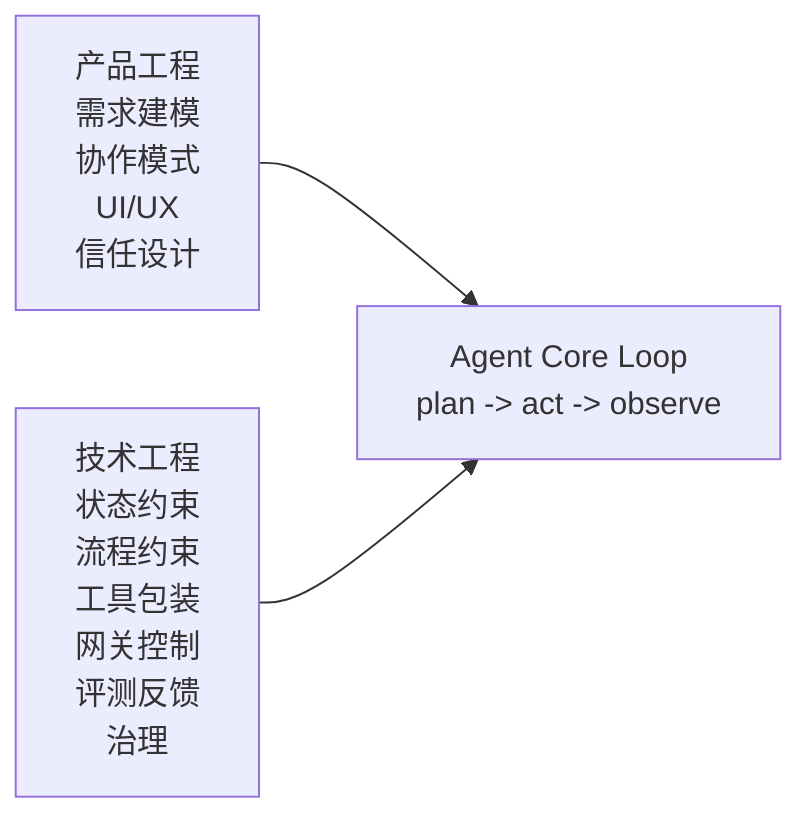
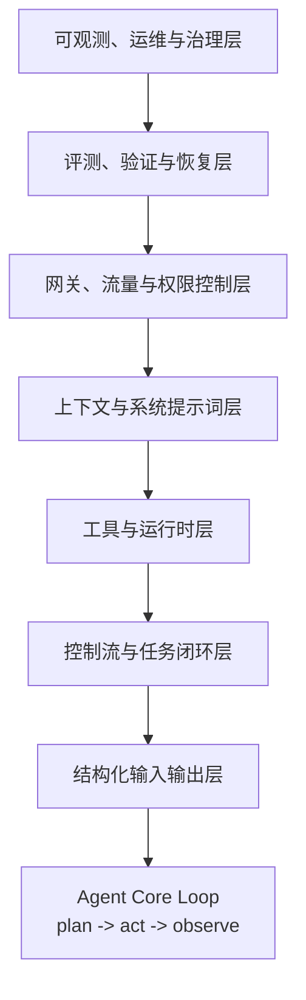

# AI Agent 的工程化：给 LLM 戴上确定性枷锁的外围工程

有些人在同时犯两个方向相反的错误。

第一种错误，是把 Agent 讨论得过于中间。一谈架构图，大家就盯着 `planning`、`memory`、`tool use`、`reflection` 这些最显眼的部分，仿佛只要把中间这颗大脑设计好了，系统就自然成立。

第二种错误，是把工程化理解得过于宽泛。工程化当然很大，既包括需求建模、交互设计、人机协作和信任建立，也包括架构、网关、评测、可观测性和治理。可一旦什么都叫工程化，真正被低估的那部分反而会重新隐身。

我同意一个很重要的区分：**工程化 = 产品工程 + 技术工程。** 前者回答“这个东西能不能被人用、被人信、被人持续用”；后者回答“这个系统能不能稳定运行、能不能规模化扩展、能不能被约束和治理”。产品工程当然重要，甚至完全值得单独写一篇。但如果把视角放回我这组Agent 时代的基础设施文章，真正还没有被单独立起来讲透的，其实是另一半：**技术工程。**

也正因为如此，这篇文章想谈的不是如何做一个更会规划的 Agent，而是另一个更容易被忽视的问题：**为什么真正把 Agent 变成可交付系统的，不是核心 loop，而是围绕 LLM 不确定性搭出来的一整套技术外壳。**

换句话说，Agent 的核心循环当然重要，但它往往只是最短的一段。最长、也最贵的一段，通常是把这个循环关进一个可控系统里。不是让它更会想，而是让它在想错、说错、调错工具、上下文漂移、连续运行几十轮之后，系统仍然不至于一起失控。

这就是我想用确定性枷锁来概括的问题：**LLM Agent 让系统第一次有能力处理开放世界的不确定性，但工程系统首先要做的，恰恰是给 LLM 本身的不确定性戴上枷锁。**

## 为什么今天工程化会被重新看见

如果把时间拨回 2023 年，大家主要还在讨论 Prompt。那时这很合理，因为大量 AI 应用本质上还是模型接进来的阶段：把一个强模型接进聊天框、搜索框、Copilot 侧边栏，已经足够带来体验跃迁。那一阶段最值钱的问题，是提示词怎么写、工作流怎么串、模型怎么选。

但到 2025 年和 2026 年，讨论重心明显开始变化。大家越来越频繁地谈 `harness`、`runtime`、`gateway`、`sandbox`、`evals`、`observability`。这并不是因为 Agent 的核心逻辑突然不重要了，而是因为**模型终于强到可以被放进更开放、更长程、更高风险的真实任务里了。**

于是问题也变了。

过去我们问的是：怎么把模型接进产品？

现在我们问的是：怎么把模型围进系统？

2026 年 2 月 11 日，OpenAI 在 [Harness engineering](https://openai.com/index/harness-engineering/) 里把这件事说得非常直接：当团队的主要工作不再是手写代码，而是设计环境、指定意图、建立反馈回路，让 agent 可靠地工作，工程重心就已经从写逻辑转向造外壳了。他们甚至把这套经验压缩成一句非常刺耳但准确的话：**“Humans steer. Agents execute.”**

Anthropic 在 2025 年 11 月的 [Effective harnesses for long-running agents](https://www.anthropic.com/engineering/effective-harnesses-for-long-running-agents) 里则从另一个角度证明了同一个问题：Agent 一旦跨越多个 context window 连续工作，真正的难点不是模型会不会写代码，而是它怎样跨会话保持增量进展、留下清晰工件、让下一轮继续接力。也就是说，**长任务的瓶颈很快就不再是单次推理，而是跨轮次的工程组织。**

这也让我更理解我在 [《Model Is Good Enough》](/blog/2026/03/18/model-is-good-enough/) 里写过的判断：模型一旦跨过够用阈值，真正稀缺的就不再只是更强的模型，而是把能力组织进真实任务的应用与工程能力。今天大家重新开始认真谈工程化，不是因为工程第一次重要，而是因为**模型能力终于高到足以把工程问题全部暴露出来了。**

## 先说清楚：本文为什么只讨论技术工程

如果从产品视角看，工程化当然不只有技术。需求到底怎么切、用户愿不愿意把任务交给 Agent、界面是否让用户感到可控、系统是否会在关键时刻暴露引用与思路，这些都非常重要。

但我这篇文要主动收缩。

原因很简单：产品工程在其实并不算被低估。相反，今天太多讨论都集中在场景包装、用户体验和工作流 demo 上（我也学了不少，确实不懂产品活不下去了，因此本文存在自相矛盾，仅供参考）。真正被系统性低估的，反而是那部分更枯燥、更像基础设施、却更决定系统能否活下去的东西：**技术工程。**

所以这篇文章不打算写成一篇AI 工程全景图，而是只盯住一个问题：当我们说Agent 进入生产，到底是哪一圈技术外壳在替核心 loop 擦屁股。

## 被低估的七层技术工程

如果把给 LLM 戴上确定性枷锁这件事拆开看，我现在更愿意把它理解为七层技术工程。它们不是某家框架的 feature list，也不是某个厂商的 marketing terminology，而是所有可靠 Agent 系统迟早都会长出来的控制层。

### 1. 结构化输入输出层：第一层枷锁，是让系统只接受可验证的状态

软件系统和 LLM 之间最先发生冲突的地方，不是在推理，而是在接口。

模型天生擅长生成看起来像答案的东西，系统需要的却是可以被消费的东西。这也是为什么我之前会单独写 [《让 Agent 变得可行，大模型结构化输出与受限解码技术》](/blog/2026/03/01/语言模型的结构化输出/)：结构化输出不是一个小优化，而是 Agent 工程最早的一条生死线。

这一层要解决的不是让模型尽量输出 JSON，而是：

- 输入是否有明确 schema
- 中间状态是否有 typed state
- 输出是否先过 parser 和 validator
- 失败时是 repair、retry 还是 fallback
- 语法合法之后，语义是否也合法

这里最容易被忽略的地方是：**结构化输出只是第一层枷锁，不是全部。** JSON 合法并不等于动作可执行，字段齐全也不等于参数语义没漂。很多 Demo 最大的问题不是模型不会答，而是下游系统把一个差不多的输出错当成了已经被验证的状态。

因此，这一层真正要建立的是一个原则：**不是让 LLM 尽量格式正确，而是让系统只接受被验证过的状态。**

### 2. 控制流与任务闭环层：Agent 不是更自由，而是被关进有终点的流程

很多人看到 Manus 这类产品，会把注意力放在自主规划四个字上。但从工程角度看，真正重要的不是它会不会规划，而是它有没有被组织成一个任务闭环：规划、执行、验证、必要时再回到上一步；中间允许人插手，但不能无限发散。

这恰好说明一个更重要的事实：**Agent 的可靠性，很大一部分来自控制流，而不是来自模型本身忽然变谨慎。**

这一层真正要写的东西包括：

- workflow / graph / state machine
- turn budget
- timeout
- termination condition
- checkpoint
- approval gate
- handoff rule

Anthropic 在 long-running harness 那篇里给出的两段式结构很有代表性：第一次运行由 initializer agent 完成环境准备，后续每轮由 coding agent 负责增量推进并为下一轮留下清晰工件。这套设计之所以重要，不是因为它优雅，而是因为它承认了一个现实：**Agent 没有天然的连续自我，它每次都可能像换班工程师一样重新接手。**

所以控制流层真正做的事情，不是在增加智能，而是在防止智能无边界地扩散。很多时候，所谓 `workflow`、`graph`、`state machine` 的本质不是更高级的 Agent 设计，而只是**把 LLM 关进一个带出口的流程。**

### 3. 工具与运行时层：不是把工具给模型，而是把工具改造成模型能安全使用的接口

Anthropic 在 [Writing effective tools for agents](https://www.anthropic.com/engineering/writing-tools-for-agents) 里有一个很准确的判断：传统函数和 API 是 deterministic systems 之间的契约，而 tool 是 deterministic systems 和 non-deterministic agents 之间的新型契约。

这句话特别重要，因为它直接解释了为什么把工具暴露给模型远远不够。

给模型一把 shell，不等于给了它能力，而是给了它毁掉仓库的可能。

给模型一个 `git`，不等于让它能改代码，而是让它可以顺手把工作区、分支和历史一起搞乱。

给模型一个 browser，不等于让它完成网页任务，而是给它一个充满副作用、登录态、跳转与外部输入的环境。

所以工具层真正要处理的，是：

- tool wrapper
- 参数命名与参数约束
- 返回上下文的粒度控制
- idempotency
- `dry-run`
- sandbox
- permission model
- 资源预算与配额

Anthropic 的 sandboxing 文章把这里说得很直白：为了减少 prompt injection 风险并减少无意义的权限弹窗，他们在 Claude Code 里强调了两条同时存在的边界：filesystem isolation 和 network isolation，并报告说这让 permission prompts 安全地下降了 84%。这说明什么？说明**工具可用性和安全边界不是两个后置问题，而是同一个运行时设计问题。**

这也正好和我在 [《AEnvironment：Agent 需要一个统一的环境层吗？》](/blog/2026/03/16/aenvironment-everything-as-environment/) 里的判断形成互文：工具不是简单的函数暴露，它背后始终站着一个环境。真正的工程难点，不在于模型能不能看到工具，而在于**它在什么环境里、以什么副作用边界、用什么失败恢复机制去碰工具。**

### 4. 上下文与系统提示词层：系统提示词不是文案，它是最早一层运行时约束

在中文讨论里，system prompt 很容易被写成提示词技巧。这当然不完全错，但如果只把它理解成文案优化，你就会低估它在工程系统里的真实地位。

系统提示词首先不是文案，它是**最早一层运行时约束。**

产品工程视角下，它决定角色、语气、协作方式和信任边界；技术工程视角下，它决定模型默认如何理解任务、可引用什么、什么时候必须收敛、哪些行为属于越界。

NotebookLM 的例子很典型。它最有价值的地方不是回答更像研究助理，而是它把约束写得非常硬：回答围绕用户上传资料展开，并且尽量带出处。这不是一句友好的角色描述，而是把可回答范围和可验证责任一起写进了系统边界。

这也是为什么这一层不能只谈 prompt，还要谈：

- `AGENTS.md`
- `WORKFLOW.md`
- repo-local docs
- progressive disclosure
- 引用规则
- 上下文压缩与召回

OpenAI 在 [Harness engineering](https://openai.com/index/harness-engineering/) 里给出的经验很值得记住：`AGENTS.md` 不应该是百科全书，而应该更像 table of contents；真正的知识库是仓库里的 `docs/`，并且要被当成 system of record。这个判断和我在 [《从 MCP 到 Agent Skills》](/blog/2026/03/10/from-mcp-to-agent-skills/) 以及 [《Context is All You Need》](/blog/2026/03/06/agent-context-engineering/) 里写过的内容其实在说同一件事：**上下文工程不是把资料全塞进去，而是决定什么信息以什么顺序进入工作记忆。**

Vercel 在 2026 年 1 月 27 日的 eval 结果更是把这个问题进一步验证：baseline 53%，skills 默认行为 53%，显式要求使用 skills 79%，而一个压缩后的 `AGENTS.md` docs index 直接做到 100%。这不是在说 skills 没价值，而是在提醒我们：**知识暴露顺序本身就是性能的一部分。**

所以这一层真正的判断是：系统提示词、仓库文档、知识暴露机制，统统不是外围润色，而是**最早进入模型上下文、最先塑造模型行为的那层软约束。**

### 5. 网关、流量与权限控制层：经典应用加 AI 后，多出来的是整套新攻击面

这是这次重写里我最想补强的一层，因为它在开源 Agent 讨论里经常被直接跳过。

很多本地 Demo 看起来之所以很顺，是因为它们默认不面对真实用户、不面对公开流量、不面对滥用、不面对成本爆炸，也不面对复杂权限边界。可一旦系统从本地脚本变成真实服务，问题立刻就换了。

经典应用接入 AI 之后，多出来的不只是一次模型调用，而是一整套新的攻击面：

- 模型本身的成本与频控
- 外部工具和 MCP server 的访问边界
- 用户身份与权限映射
- prompt injection 带来的越权调用
- 输入输出内容安全
- 缓存、重放、审计与滥用对抗

也正因此，后台逻辑确定性越不可控，流量与用户访问控制越重要，我认为是非常值得保留的判断。它说的不是某个具体网关产品，而是一个更底层的事实：**当系统的核心处理链路里引入了不确定模型，你就必须用更强的网关、权限和流量控制去对冲这种不确定性。**

所以这一层真正的工程内容是：

- rate limit
- auth
- quota
- cache
- 输入输出安全拦截
- MCP / model / agent 之间的访问边界
- 审计日志与调用追踪

这一层之所以常被低估，是因为它既不性感，也不容易在 Demo 视频里展示。但一旦没有它，所有Agent 已经可以进入真实业务的判断都会显得非常脆弱。从某种意义上讲，OpenClaw就是这一层的最大反面例子。

### 6. 评测、验证与恢复层：没有验证闭环的 Agent，本质上只是把采样结果直接暴露给用户

这是我认为当前很多 AI 应用最危险的盲区。

系统给出了一个结果，于是我们默认它完成了任务；可对 Agent 来说，真正重要的从来不是它说完成了什么，而是**环境里最后到底发生了什么。**

Anthropic 在 [Demystifying evals for AI agents](https://www.anthropic.com/engineering/demystifying-evals-for-ai-agents) 里把这个边界说得很清楚：evaluation harness 是负责端到端跑任务、记录步骤、打分和汇总结果的基础设施；agent harness 则是让模型以 agent 方式行动的系统。换句话说，当我们说在评估一个 agent时，我们评估的从来都不是裸模型，而是 **harness + model working together**。

这意味着评测、验证和恢复层必须成为系统的一等公民，而不是上线前顺手补一套 smoke test。你真正需要的是：

- tests
- critic / judge
- replay
- reference solution
- human review
- canary
- rollback
- 失败后继续推进的恢复路径

Vercel 之所以能得出 `AGENTS.md` 比 skills 更有效的判断，不是因为他们拍脑袋觉得如此，而是因为他们先把 eval suite 硬化了：去掉 task leakage、消除歧义、改成行为导向的测试，再做配置对比。这个顺序非常重要，因为它提醒我们：**很多看起来像模型问题的东西，实际上是评测和 harness 问题。**

所以我还是想重复一句更重的话：**没有验证闭环的 Agent，本质上只是把一次采样结果直接暴露给用户。** 只有当系统能够在外部环境里验证、复查、回滚、再推进时，它才真正开始像一个可交付系统，而不是一场精致的生成实验。

### 7. 可观测、运维与治理层：真正的敌人不是某次失败，而是熵增、漂移和坏模式复制

如果前六层解决的是“怎么让系统跑起来”，那么最后一层处理的就是“怎么让它别慢慢烂掉”。

AI 系统的可观测对象，从来都不只是延迟、报错率和 CPU。对 Agent 来说，真正危险的东西往往更语义化：

- 工具为什么被误用
- 上下文什么时候开始漂移
- 哪类任务在持续 over-trigger 某个动作
- 什么坏模式正在被不断复制
- 哪些所谓成功，其实只是低质量完成

所以这一层真正要做的不是普通日志，而是：

- trace
- artifact
- semantic observability
- incident debugging
- quality score
- 背景治理任务
- entropy / slop cleanup

OpenAI 在 harness engineering 里有一段非常值得所有做 Agent 的人反复看：他们一开始每周五要花 20% 的时间手工清理 “AI slop”，后来干脆把 golden principles 直接写进仓库，再让后台任务持续扫描偏差、更新质量分数、自动开 refactor PR。这套做法最打动我的地方，不是自动化本身，而是它把一个事实说透了：**Agent 最大的风险往往不是一次错，而是系统会无比忠诚地复制已有的错。**

因此，这一层的本质不是后期运维，而是**持续治理模型在工程环境里的熵增。** 你不处理它，它就会自己增长。你不尽早把治理机制编码进系统，最后就只能靠人肉周五去清理 AI slop。

## 这就是框架真正替你做掉的大头工作

当你把上面七层技术工程一层层摊开之后，框架这个词就会自动去魅。

框架并不是因为大家不会写 `while loop` 才存在，也不是因为 `planner` 特别难写才存在。框架真正替你做掉的大头工作，是把这些反复出现、极其琐碎但又绝不能缺席的外壳冻结成一套可复用约定：

- 状态如何定义
- 控制流如何限制
- 工具如何包装
- 文档如何暴露
- 权限如何切边界
- 验证如何自动发生
- 治理如何持续进行

所以我现在越来越愿意把框架理解成另一种东西：**它们不是智能本身，而是技术工程的模板化沉淀。**

这也解释了为什么不同框架看起来差异巨大，底层却总在重复类似问题。有的框架优先冻结控制流，有的优先冻结会话与工具运行时，有的优先冻结 memory、sandbox、eval 和 agent ops。你当然可以不用框架，但你不用框架，不代表这些问题会消失。更常见的现实是：**你最后还是会把它们自己补回来。**

## 如果今天让我从 0 开始，我会先搭什么

如果今天让我从 0 开始搭一个 Agent，我不会先追求多 Agent，也不会先追求复杂 graph，更不会一上来就做一个看起来像平台的东西。我会先把最小可行的技术外壳补齐。

顺序大概是这样：

1. **先定义任务边界和成功标准**  
   不先定义什么叫完成，后面所有自主规划都会变成幻觉放大器。

2. **再定义 typed state 与结构化输入输出**  
   先把系统的输入、状态和输出变成可验证对象，再谈更复杂的策略。

3. **再包装工具与权限边界**  
   工具不是自由能力，而是经过裁剪的接口；公开系统还要尽早补网关、频控与鉴权。

4. **再补验证回路与失败恢复**  
   没有 test、judge、review、replay、rollback，系统只是在赌采样。

5. **最后再补长期上下文、可观测与治理**  
   当最小闭环稳定后，再系统化处理 docs、memory、trace、quality score 和 background cleanup。

这也是为什么我现在越来越不认同先把架构图画复杂再说的开发习惯。Agent 的核心逻辑可以很晚才复杂，但**它的确定性边界必须很早就被设计。** 单 Agent 的外壳没扎实之前，多 Agent 往往只会把不确定性复制得更快。

## 结语：真正成熟的 Agent，不是更自由的 LLM，而是被精心约束后的 LLM

回到文章一开始那个问题：为什么今天工程化会被重新看见？

因为模型已经强到足以让我们把它们放进真实任务里了，而一旦真的这么做，所有原本还能被 Demo 掩盖的问题都会暴露出来。模型会不会漂、工具会不会误用、文档会不会过期、权限会不会越界、验证闭环是不是缺席、坏模式会不会在系统里持续复制——这些都不再是以后再说的问题。

**所谓外围代码，其实根本不是外围。它才是把 LLM 变成可交付 Agent 的主体工程。**

产品工程当然重要，需求建模、信任设计、人机协作也完全值得单独写。但如果只从构建可靠 Agent 的技术角度看，真正决定上限的，往往不是中间那颗聪明的大脑，而是周围这一圈是否足够坚硬、足够可验证、足够能治理的外壳。

真正成熟的 Agent，不是更自由的 LLM，而是**被精心约束后，仍然保有足够自由度的 LLM。**

## 参考资料

- 阿里云云原生, [AI Agent 的工程化被低估了](https://www.cnblogs.com/alisystemsoftware/p/18926545)
- OpenAI, [Harness engineering: leveraging Codex in an agent-first world](https://openai.com/index/harness-engineering/)
- OpenAI, [Unlocking the Codex harness: how we built the App Server](https://openai.com/index/unlocking-the-codex-harness/)
- Anthropic, [Building effective agents](https://www.anthropic.com/research/building-effective-agents/)
- Anthropic, [Writing effective tools for AI agents—using AI agents](https://www.anthropic.com/engineering/writing-tools-for-agents)
- Anthropic, [Effective harnesses for long-running agents](https://www.anthropic.com/engineering/effective-harnesses-for-long-running-agents)
- Anthropic, [Demystifying evals for AI agents](https://www.anthropic.com/engineering/demystifying-evals-for-ai-agents)
- Anthropic, [Beyond permission prompts: making Claude Code more secure and autonomous](https://www.anthropic.com/engineering/claude-code-sandboxing)
- Vercel, [AGENTS.md outperforms skills in our agent evals](https://vercel.com/blog/agents-md-outperforms-skills-in-our-agent-evals)
- [《让 Agent 变得可行，大模型结构化输出与受限解码技术》](/blog/2026/03/01/语言模型的结构化输出/)
- [《从智能体的认知结构到智能体框架》](/blog/2026/03/03/cognitive-architecture-to-agent-framework/)
- [《Context is All You Need：智能体的上下文工程》](/blog/2026/03/06/agent-context-engineering/)
- [《从 MCP 到 Agent Skills：为什么 Agent 又需要一种新的上下文工程协议？》](/blog/2026/03/10/from-mcp-to-agent-skills/)
- [《AEnvironment：Agent 需要一个统一的环境层吗？》](/blog/2026/03/16/aenvironment-everything-as-environment/)
- [《Model Is Good Enough：2026 年，AI 真正稀缺的是应用而不是更大的模型》](/blog/2026/03/18/model-is-good-enough/)

