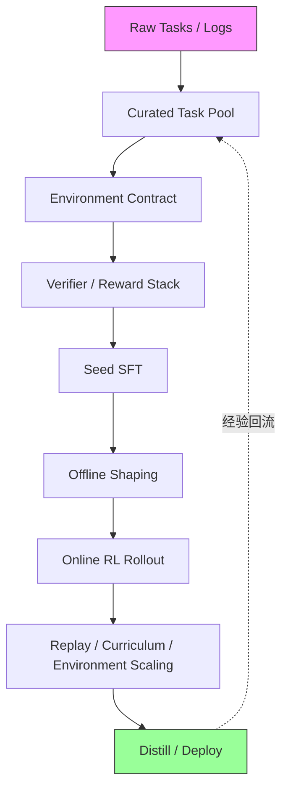

# Agentic RL：为什么训练闭环比训练算法更重要

[上一篇]()的核心结论是：reward 不是一个模型吐出来的一行分数，而是一条生产线。这一篇要追问的是——**当这条生产线真正接到 agent 的训练循环里，整个训练系统需要发生什么根本性的变化。**

过去一年里，几乎所有在 agent 方向取得实质进展的团队，都不约而同地走向了同一条路：不只是把 RL 接到工具调用上，而是从数据、环境、反馈到训练，把整条链重新接了一遍。这件事的含义比表面看起来要深：**Agentic RL 真正要解的不是某个算法问题，而是一个系统问题——你能不能把任务整理、环境合同、反馈栈、冷启动、在线探索和部署回流接成一条持续转动的飞轮。**

这篇文章画的是这条飞轮的全景地图。下一篇[《Reward 与 Training 在真实 Agent 中如何闭环》]()会在 AMAP、Agent K、PaperBench 等具体系统中展开。

## 为什么 SFT 和传统 RLHF 在 Agent 场景撞墙

先看一个具体的例子。

假设你用高质量 demonstration 做 SFT，训出了一个代码 agent。在评测集上，它的第一步工具调用准确率很高——能正确选择 `read_file`、`search_code`、`run_tests`。但一旦工具返回了非预期结果（比如测试失败了、搜索结果为空、文件不存在），它的行为立刻变得僵硬：要么重复同一个调用，要么直接跳到我来帮你总结一下而放弃了任务。

这不是能力问题。SFT 数据里确实包含了工具失败后恢复的样本，但 demonstration 给的是**路径快照**——"在这种情况下应该这样做"。模型学到的是特定情境到特定动作的映射，而不是"什么时候该换策略、什么时候该放弃当前路线去探索其他方案"这种决策过程本身。**SFT 能教会模仿，但教不会判断。**

再看 RLHF。你用偏好数据训了一个 reward model，然后用 PPO 做了一轮优化。agent 的表达确实变好了——语气更自然，格式更规范，用户满意度上升。但如果你把它放到一个需要 5-10 步工具交互才能完成的真实任务里，改善几乎消失了。为什么？因为传统 RLHF 本质上是一个 **T=1 的退化 MDP**：给一个 prompt，生成一段 response，在终点给一个偏好分数。它优化的是单次回答质量，而不是跨多步的策略质量。它既不知道第 3 步的工具选择对第 7 步的成功有多重要，也无法把终局的成败分配回中间的关键决策——这正是 credit assignment 问题。

这就是 Agentic RL 的不可替代性所在。当 agent 需要在环境中持续行动——读取状态、选择工具、根据反馈修正计划、在错误中恢复、在合适的时候停下来——训练目标就不再是"生成好文本"，而是**在环境中走好轨迹**。这不是一个可选的增强，而是 agent 训练的必经之路。

像 [DeepSeek-R1](https://www.nature.com/articles/s41586-025-09422-z) 最终的完整 recipe 也说明了这一点：它不是简单的 RL-only，而是 cold-start SFT → 筛选 → 再 SFT → RL 的多阶段闭环。单靠 SFT 到不了那个能力边界，单靠传统 RLHF 也到不了——你需要让模型在环境中真正探索，然后用环境反馈来更新策略。

## 训练对象的根本变化：从文本到轨迹

上面的例子其实已经在暗示一件更深层的事：agentic RL 和传统 post-training 的区别，不只是多了工具调用，而是**训练对象本身被重写了**。

传统的 preference-based reinforcement fine-tuning 更接近一个 `T = 1` 的退化 MDP：给一个 prompt，生成一个 answer，终点给分。而 agentic RL 则是一个**部分可观测、时序展开、带真实状态转移的 POMDP**。状态不再是静态 prompt，动作也不再只是 token；动作会改变环境，环境会产生新的 observation，reward 会沿着轨迹延迟返回，credit assignment 也会从"最后一句答对没"变成"哪一步真的推动了任务完成"。

这件事一旦说清楚，很多原本看起来像"功能增强"的东西就会自动落位。规划、工具使用、记忆、自我改进、反思，甚至不同任务域里的各种 agent 形态，并不是平白多出来的模块；它们之所以变得重要，是因为训练对象不再是"单次回答质量"，而是 **policy 在环境里走完整条轨迹时的行为质量**。

举一个更具体的例子：一个代码 agent 在修复 bug 时，先用 `search_code` 定位相关文件，然后 `read_file` 确认上下文，接着 `edit_file` 做修改，最后 `run_tests` 验证。如果测试失败了，它需要判断——是修改本身有误，还是测试环境有问题，还是需要换一个完全不同的修复策略。这整条轨迹中的每一个决策，都是 policy 需要学习的对象。而传统 post-training 只看到最后一步的对错，根本没有能力评价中间的路径质量。

Agentic RL 不是 RFT 的升级版或者工具调用时代的 RL。真正的问题不是模型会不会调用工具，而是**训练目标本身已经从回答优化，变成了环境中的策略学习**。

## 训练飞轮全景

如果把一条更接近真实世界的 agent 训练链压成最短形态：

这条链最重要的不是顺序本身有多神圣，而是它提醒我们：**reward 不是孤零零的一行分数，RL 也不是一句"后面再训一下"。** 在 agent 体系里，reward 往往先是数据筛选器，然后才是训练信号；环境不是 benchmark 的配套，而是训练对象的一部分；distillation 也不是最后的善后，而是把 rollout 中发现的高价值行为沉淀回部署策略的必要环节。

下面按这条链的顺序展开每一层。

## 数据治理：训练闭环真正的第 0 步

很多人一谈 agent 训练，默认前面已经有一批可训练数据。但对真实 agent 系统来说，这往往是最不真实的假设。因为原始世界给你的通常不是整齐的 `(prompt, response)`，而是一堆杂乱的 query、历史日志、工具调用记录、用户修正、失败轨迹和不完整的环境状态。**训练闭环的第一步，往往不是优化，而是整理。**

agentic RL 里的数据本来就不只是文本样本，而是任务空间的切法。你首先得知道：哪些请求属于同一种任务，哪些约束是这个任务的核心难点，哪些请求虽然高频但根本不该交给当前 agent，哪些失败是低价值噪声，哪些失败恰恰是最值得保留的恢复样本。没有这一步，后面的 reward、curriculum 和 online RL 很容易只是在噪声上打转。

这一层至少有四件事必须先被做掉。

**第一，先把任务池切出来。** 你需要某种 taxonomy，去区分任务类型、约束密度和能力边界。不是因为分类本身优雅，而是因为后面你要讨论覆盖度、长尾、难度分布和 curriculum，前提都是任务空间先被切成可管理的形状。

**第二，给任务写难度。** 难度不是附属标注，而是后面 curriculum 的地基。一个系统如果不知道什么叫简单、什么叫长程依赖、什么叫多工具协调、什么叫高约束低容错，它通常也很难知道该先让模型学什么、该把哪些失败当成正常探索、又该把哪些失败视作协议崩坏。

**第三，负样本和边界样本必须保留。** 很多 agent 不是不会做事，而是不会说"不该做"、不会承认信息不足、不会在超出工具边界时停下来。也正因为如此，out-of-scope 请求、不可解请求、危险请求和高价值失败样本，都不应该被简单清洗掉。它们是后面 refusal、recovery 和 trustworthiness 的一部分训练地基。

**第四，尽早统一 trajectory schema。** 一条轨迹到底按什么切，是按 utterance、tool call、code execution、environment transition，还是按更抽象的 step？这个问题如果前面不决定，后面的 verifier、masking、replay、process reward 和 credit assignment 都会跟着漂。很多系统到后面越训越乱，本质上不是 optimizer 不好，而是根本没有统一什么叫一条可回放、可验证、可学习的轨迹。

数据治理不是附属清洗流程，而是 agentic RL 的第 0 步。真正的问题不是样本够不够，而是**你有没有把原始世界整理成一个可训练的任务池，以及一套后面能够反复回放的轨迹语言。**

## 环境合同与反馈栈：Agent 训练的基础设施层

任务池被整理出来以后，下一步不是立刻上 SFT，而是先把环境合同写清楚。agentic RL 和普通 post-training 最大的分水岭之一，就在于**环境不再只是评测舞台，而是训练对象的一部分。** 从 [verl 的 agentic RL 文档](https://verl.readthedocs.io/en/latest/start/agentic_rl.html) 到各家 agent 训练 recipe，这一点已经被反复验证。

所谓环境合同，是一套最小但刚性的训练接口：模型到底能观察到什么，哪些动作只是文本，哪些动作会真正改变外部世界，tool output 怎么进入上下文，环境怎样 reset，失败码是什么，哪些 side effect 允许出现，哪些必须被 sandbox 限住。

这里有一个容易被低估的工程细节。[verl 的 agent loop 文档](https://verl.readthedocs.io/en/latest/advance/agent_loop.html) 反复强调 async rollout、sticky session、message fidelity 和 token-level consistency，本质上都在说明同一件事：**一旦 agent 开始多轮调用工具，rollout 就不再等于同步生成一段文本。** 如果轨迹边界、消息还原和 token 对齐做不稳，训练会在最基础的地方先失真。

反馈同样不该被压成一个总分，而应该写成一个分层的 stack：

- **verifier** 负责能程序化验证的部分，比如测试是否通过、答案是否满足规则、格式是否合规；
- **process signal** 负责中间步骤是否推进了任务，比如工具选择、子目标完成、局部修复是否有效；
- **judge** 负责 verifier 暂时覆盖不到、但又不得不评估的开放部分；
- **trace / audit** 负责让你在训练后知道模型到底是"不会做"、"乱做"还是"在错误的地方被奖励了"。

**很多反馈首先应该被用来定义环境边界和数据闸门，其次才应该进入优化器。**

trustworthiness 也不是最后才需要补的安全条款。agent 的攻击面从一开始就比普通 LLM 大得多——工具、记忆、外部 API、网页、数据库、跨 agent 通信，全都会变成状态转移的一部分。sandbox、权限边界、可审计 trace 和 refusal policy，从环境合同阶段就应该写进去，而不是等 RL 把危险策略学出来之后再补丁式修理。

## Cold-start SFT 与 Offline Shaping

等环境合同和反馈栈站稳以后，cold-start SFT 才真正开始有意义。它在 agent 训练里最重要的作用，不是再重复一遍模型已经会的东西，而是**先把合法动作先验、基本节奏和交互协议写进 policy。**

很多时候，大家会把 SFT 和 RL 写成一种此消彼长的关系，好像只要 online RL 足够强，前面的 demonstrations 就都不重要了。但越看真实系统，越觉得这是一种非常单轮任务的想象。对 agent 来说，SFT 压进去的不是抽象能力，而是很具体的行为习惯：什么时候先读 observation，什么时候先调用工具，什么时候该追问，工具失败时是重试还是回退，什么时候应该停止继续探索并交付结果。

[DeepSeek-R1](https://www.nature.com/articles/s41586-025-09422-z) 最终的完整 recipe 也说明了这一点——它不是简单的 RL-only 传说，而是回到了 cold-start、筛选、再 SFT、再 RL 的闭环。工具环境里的系统更是如此：如果模型连合法调用都不会，online RL 往往只会让它在稀疏噪声里浪费大量 rollout 预算。

offline shaping 也值得从 SFT 后面单独拎出来讲。很多系统真正需要的，并不是一上来就学长程探索，而是先把策略分布拉回一个更可控的区域：格式修正、局部协议遵守、调用语法稳定、事实保真、短程恢复。DPO、reward-guided filtering、rejection sampling、基于 verifier 的回流数据，都属于这一层。

如果只保留一句话：**SFT 负责把模型送进可学习区域，offline shaping 负责把这个区域清干净。** 很多"后面 RL 训得很稳"的系统，本质上不是突然学会了探索，而是前面已经把不必要的噪声和低级错误压掉了。

## Online RL：探索、恢复与时机

等到任务池、环境合同、反馈栈和 cold-start prior 都有了，online RL 才真正值得登场。它在 agent 里的职责也和单轮偏好优化不一样：不是单纯让回答更像人喜欢的文本，而是让 policy 学会**何时行动、何时追问、何时切换策略、何时停止，以及怎样在长程交互里恢复错误。**

这一层最容易被低估的，其实不是算法名，而是 rollout 本身。agent 的 rollout 不是吐一段长文本这么简单，而是一串持续和环境交换 observation、action、feedback 的交互历史。你如果没有可靠的异步执行、消息复原、状态跟踪、masking 和 trace，所谓 agentic RL 很容易只剩论文里的 loss，而没有真正可用的训练系统。

我现在越来越不把 online RL 的核心问题理解成"该用 PPO 还是 GRPO"，而是先问三件更底层的事：

- **哪些 token 或 action 真该被训练？**
- **一条成功轨迹的 credit 应该往前分到哪里？**
- **哪些中间行为值得直接给过程奖励，哪些只该在终局结算？**

这也是 agentic RL 比单轮 RFT 更难的地方。单轮任务里，终局 0/1 reward 往往还勉强够用；但在多轮 agent 里，成功很可能是若干局部决策共同造成的。一次正确的工具选择、一次及时的放弃、一次有效的错误恢复，往往比最后一句漂亮答案更重要。像 [Agent Lightning](https://arxiv.org/abs/2508.03680) 去做 trace-to-transition 的重写，或者 [GiGPO](https://arxiv.org/abs/2505.10978) 去拆更细的 group-based advantage，本质上都在回答同一个问题：**长轨迹的 credit 到底怎样才能被分回真正关键的局部动作。**

与此同时，稳定训练也不只是数值稳定。对 agent 来说，它还包括 reward stack 的稳定、工具调用吞吐的稳定、环境响应延迟的稳定、以及策略探索不要把系统推到危险区域的稳定。从 online rollout 开始，训练稳定性和安全边界就不再是可选话题——它们会直接决定训练能不能持续进行。

如果只保留一句更尖锐的判断：**online RL 真正稀缺的，不是再给模型一个更高的总分，而是让它在环境里学会探索、恢复和时机。** 只有当你的瓶颈真的落在这些地方时，online RL 才配得上它那套昂贵的系统代价。

## 飞轮的后半段：Replay、Curriculum、Environment Scaling 与 Distill Back

一旦模型开始在环境里真正学习，后半条链就会立刻出现：经验要不要回流，难度怎么调，环境要不要跟着模型一起变，最后又怎样把 rollout policy 沉淀回部署策略。也正是在这里，Agentic RL 才真正从一次训练变成一个飞轮。

**replay** 的价值不只是节省样本，而是决定成功经验、边界失败和高价值恢复路径会不会继续留在系统里。**curriculum** 的价值也不只是从易到难，而是让 agent 始终待在可学习边界附近，而不是被长程、稀疏、噪声过大的任务直接打成零奖励。

再往后一步，是 **environment scaling**。我现在越来越确信，agent 的上限经常不只被 model size 和 training steps 限制，也被它所处的训练世界限制。环境如果太贫、太静态、太不安全、太难 reset，模型很快就会学满；而可扩张、可合成、可程序化验证的环境，则会把数据和训练一起变成更持久的飞轮。像 [VeriEnv](https://arxiv.org/abs/2603.10505) 这类 environment generation 方向的工作，正在试图打开这个瓶颈。

但后半段最容易被低估的仍然是 **distill back**。很多 rollout policy 在训练时很强，却不适合直接部署：成本太高、上下文太长、对 sandbox 和 trace 依赖太重、风格太像探索中间态，或者安全边界还不够稳。所以更常见也更现实的路线，是把 online RL 中挖出来的高价值轨迹、恢复策略、停止条件和工具调用时机重新组织成更稳定的数据，再蒸馏回更便宜、更鲁棒的 deployment policy。distill back 不是善后，而是飞轮闭合的最后一环——没有它，训练中发现的高价值行为就永远停留在昂贵的 rollout policy 里，无法真正服务用户。

也就是说，Agentic RL 的后半段真正要管理的，从来不只是继续训，而是四件绑在一起的事：

- 经验回流能不能持续发生；
- 难度调度是否贴着模型能力边界；
- 环境会不会随着模型一起扩张；
- 训练时学到的高价值行为能不能沉淀回真正可部署的策略。

## 写在最后

如果只允许保留这一篇最短的一句话：**Agentic RL 真正的分水岭，不是谁先把 LLM 接上 RL，而是谁能把可训练任务池、可执行环境、可分层反馈、可回放轨迹、可持续环境扩张，以及可部署蒸馏回流同时搭起来。**

往前看，我认为这条飞轮接下来的两个最大瓶颈会落在 **environment generation** 和 **scalable verification**。前者决定 agent 能学到多广，后者决定 agent 能被信任到什么程度。当环境可以被程序化地合成和扩张，当 verifier 的覆盖率能随着任务复杂度一起增长，Agentic RL 的飞轮才会真正进入正循环。

这篇文章画的是全景地图。下一篇[《Reward 与 Training 在真实 Agent 中如何闭环》]()会在 AMAP、Agent K、PaperBench 等具体系统中，看这条链到底是怎么从第一行代码跑起来的。
