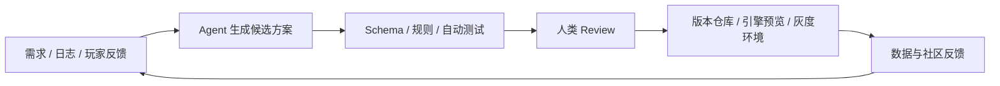

# 游戏行业如何引入 AI Agent

谈到 AI 与游戏行业，很多讨论会先落到美术资产生成、NPC 对话或者代码补全上。这些方向当然重要，但如果只把 AI 理解成某个环节里的内容生成器，就会低估它对游戏工业化流程的影响，也会高估它短期内替代创意岗位的能力。

这篇文章里说的 AI Agent，不是简单的聊天框，也不只是生成文本、图片或代码的模型。它更接近一层能读取项目上下文、调用内部工具、执行多步任务、根据反馈继续迭代的协作系统。它不应该绕过人类团队做最终决定，而是把文档、配置、日志、测试、玩家反馈和版本计划连接起来，让候选方案更快出现，也更容易被验证、回滚和审计。

因此，Agent 真正改造游戏行业的起点，不是全自动创作，而是验证、协作和反馈速度。一个已经建立标准工作流的团队（完善工业化的团队），会比一个完全依赖口头经验和个人手感的团队更容易受益。因为 Agent 需要明确的输入、规则、权限、工具接口和评价标准；这些东西越清楚，它越像生产系统，越模糊，它越像一次性的灵感助手。

Google Cloud 与 The Harris Poll 在 2025 年面向 615 名游戏开发者的调查显示，受访者中 90% 已经在工作中使用生成式 AI，87% 表示正在使用 AI agents。这个数字说明 AI 已经进入工作流，但它不等于行业已经解决了落地问题。GDC 2026 的行业调查给出了另一面：只有约三分之一的游戏行业从业者在工作中使用生成式 AI，同时超过一半认为它对行业有负面影响。游戏公司一边试用 AI，一边担心 IP、劳工、内容质量、玩家信任和合规问题，这才是今天更真实的背景。

## 内部生产：先从可验证流程开始

游戏研发是一个高度复杂的协作系统。策划、程序、美术、音频、关卡、QA 和运营持续交换中间产物。Agent 进入研发管线后，优先级最高的不是让每个环节都自动生成，而是让信息流动更顺畅，让结果更可检查。

在策划侧，最适合先接入 Agent 的不是“从零写一个完整系统”，而是配置表、任务链、技能描述、怪物行为草案和数值初稿这类结构化产物。它们天然有 Schema、ID、依赖关系和校验规则。Agent 生成候选内容后，机器可以先检查字段是否缺失，道具 ID 是否存在，奖励是否破坏经济系统，任务前置条件是否形成死锁，剧情文本是否和世界观设定冲突。人类策划再判断它是否有趣、是否符合目标玩家和版本节奏。

这意味着策划工具不能只是一个聊天框。它需要连接项目数据库、配置仓库、规则校验器、版本管理和引擎预览环境。生成只是第一步，真正重要的是候选配置能否被自动校验、被人类审阅、被引擎预览，并且在出错时可以回滚。

在程序侧，Agentic Coding 已经能承担样板代码、历史模块解释、崩溃日志归因、Code Review 辅助、单元测试补充和性能回归分析。但游戏开发比一般应用开发多了实时性能、内存、渲染、网络同步和跨平台适配约束。战斗结算、付费系统、反作弊、客户端与服务器联动这类模块，不能只看代码“像不像能跑”，还要进入 CI、自动化测试、性能基准、灰度验证和权限审批流程。这里的核心不是相信模型，而是把模型输出放进已有工程约束里。

在美术、音频和关卡侧，Agent 更像生产管理和质量筛选工具。它可以协助探索风格方向、标注资产、检查命名、尺寸、贴图通道、面数、骨骼绑定和导入规范；也可以分析关卡中的路径连通性、不可达区域、空跑路径、战斗遭遇节奏和教学风险。Unity 把 Unity AI 定位为面向 Unity 开发流程的 AI 工具，Sentis 则继续承担在 Unity Runtime 中运行神经网络模型的能力，这类平台化工具说明厂商正在把 AI 放进引擎和工具链，而不是只提供离线生成器。

QA 可能是短期最直接的落点。游戏系统越复杂，人工穷举测试越不现实。用虚拟测试 bot 探索关卡、触发操作、报告崩溃和错误，并把测试过程生成报告可以成为现实。它不能替代测试人员对体验、平衡和严重程度的判断，但可以承担大量重复路径探索、回归检查和异常捕捉工作。对研发团队来说，这比“让 Agent 自动做游戏”更实际。

## 运营反馈：把玩家声音变成产品假设

如果把视角从单个功能拉回到游戏生命周期，立项、发行和长线运营其实都在处理同一个问题：团队如何更快、更准确地理解玩家反馈，并把它转化为可以被批判、排序和验证的产品判断。

项目早期，Agent 可以持续整理玩家评论、社区帖子、直播弹幕、竞品更新日志、应用商店评价和媒体测评，提炼玩家集中关心的问题：某类玩法是否疲劳，某种付费设计是否被反感，某个题材是否升温，玩家对某类系统的期待到底是深度、爽感、社交，还是低负担的日常陪伴。

但这类分析不能停在“正面评价占比多少”。更有价值的是把玩家声音拆成可行动的产品假设。玩家抱怨“肝”，可能不是内容太多，而是奖励节奏不透明；玩家说战斗无聊，可能不是技能数量少，而是敌人行为和关卡节奏缺少变化；玩家说剧情出戏，可能是角色动机、任务目标和玩法行为没有对齐。

上线之后，同一套机制会进入更高频状态。社区评论、客服工单、应用商店评分、直播反馈、短视频舆情、数据看板和版本更新同时涌来。Agent 适合承担持续感知层，把不同渠道的玩家声音合并、去重、聚类和归因，区分情绪表达、可复现 Bug、数值体验问题、商业化信任问题和沟通不足的问题，再把这些反馈和真实行为数据放在一起看，避免团队被单一舆论带偏。

例如玩家抱怨某个副本太难，团队需要看的不是一句“玩家觉得难”，而是通关率、失败节点、队伍构成、装备分布、攻略传播情况和改动后的留存变化（优秀的埋点才能让 AI 更好的参与这些工作）。玩家吐槽活动奖励差，也不只是在评价奖励数量，而是在反馈参与率、付费转化、时间成本、竞品活动节奏和信任感。Agent 的作用是把这些信号整理成候选判断和版本建议，但最终优先级仍然属于制作人、运营和数据团队。

因此，反馈闭环应该长成这样：玩家信号被捕获，反馈被拆成产品假设，候选方案被生成和反向批评，修复或改动进入版本计划，上线后继续观察数据与情绪变化。Agent 不是自动决定版本方向的“制作人替代品”，而是让团队更快进入可讨论、可验证的状态。

## 玩家体验：越靠近玩家，边界越重要

AI Agent 进入游戏内体验后，最容易被想到的是 NPC 对话。更自然的回应、稳定的人设、长期交互记忆，确实会提升沉浸感。但游戏内 Agent 的价值不应该停留在“会聊天的 NPC”。NVIDIA ACE 与 KRAFTON 的 PUBG Ally、NetEase 的 NARAKA AI Teammate 都指向一个更具体的方向：AI 角色不只是说话，而是理解战场状态、给出建议、寻找物资、协同行动，甚至成为可共同游玩的队友。

在 RPG、开放世界、模拟经营和 UGC 游戏中，Agent 可以成为系统与玩家之间的动态接口。新手玩家需要的可能不是更多教程弹窗，而是在错误行为发生时得到贴近场景的解释；回流玩家需要的可能不是一屏活动入口，而是知道自己离开后世界发生了什么、现在应该先做什么；高玩需要的则可能是更细的机制解释、构筑建议和挑战路径。游戏内容本身未必改变，但玩家理解系统和进入循环的方式会改变。

UGC 场景也很适合引入 Agent。它可以帮助玩家创建地图、任务、角色和规则，把复杂编辑器的一部分能力变成自然语言和半结构化操作。多人游戏中，它还可以辅助识别消极行为、总结战局表现、生成复盘建议；模拟经营游戏中，它可以让虚拟居民或顾问拥有更清楚的目标和反馈方式，让系统不再只通过数值面板说话。

但越靠近玩家体验，风险越高。NPC 不能随意承诺不存在的任务奖励，客服型助手不能误导玩家付费，剧情角色不能说出破坏世界观的内容，竞技游戏中的建议不能变成事实上的外挂。Steamworks 对 AI 内容已经区分了预生成内容和运行时生成内容，并要求开发者说明 live-generated AI 的保护措施，这说明平台方也在把游戏内 AI 视为需要披露和约束的生产能力。

玩家侧 Agent 的评估标准也更严。它不仅要回答对，还要低延迟、低成本、稳定符合人设，能处理越狱和恶意输入，不泄露玩家隐私，不破坏游戏经济和竞技公平。内部流程出错可以回滚，玩家体验出错会直接变成信任损失。因此，玩家侧功能应该晚于内部生产和运营反馈成熟之后再扩展，而不是成为最早的大规模落点。

## 为什么不是所有团队都会立刻受益

Agent 对游戏公司的帮助，取决于团队已经把多少工作沉淀成了系统。如果策划案只存在于聊天记录里，配置规则没有 Schema，资产命名靠人肉约定，测试用例不稳定，版本决策没有指标记录，权限和日志也不清楚，那么 Agent 很难可靠工作。它只能生成一堆看起来合理、却无法进入生产链路的候选内容。

真正决定收益的前置条件包括六件事：文档化程度、数据质量、工具链成熟度、权限体系、自动测试覆盖和审计日志。文档化决定 Agent 能不能理解上下文；数据质量决定反馈分析是否可信；工具链决定它能否执行任务；权限体系决定它能碰哪些资源；自动测试决定输出能不能被机器先筛一遍；审计日志决定事故发生后能否追踪责任和恢复现场。

这也是为什么小团队和大团队的路径可能不同。小团队可以从低风险、高重复任务开始，比如社区反馈聚类、策划案检查、自动 QA 报告、版本公告草稿和本地工具脚本。大团队则更需要统一平台、权限边界、模型网关、日志审计、评测体系和跨部门流程，否则每个部门各自接一个 AI 工具，最后只会形成新的信息孤岛。

人仍然是这个系统里不可缺少的一环。Human in the loop 不是一句安全口号，而是当前 Agent 系统进入生产的必要条件。越是高级的自动化，越需要明确谁提出目标、谁批准执行、谁承担结果、谁在指标异常时叫停。

## 结语：竞争力在系统，而不在单个模型

AI Agent 会进入游戏行业的多个环节，但它最有价值的形态未必是某个炫目的单点功能。更现实的做法，是把 Agent 放进真实的工业化生产管线：让它理解项目上下文，连接内部工具，读取玩家反馈，生成可检查的候选方案，并在人的监督下推动迭代。

对多数团队来说，合理起点不是全自动 NPC，也不是全自动研发，而是分三步走：先选择低风险、高重复的场景，例如反馈收集、策划案检查或自动 QA；再把 Agent 接入现有工具链和验证层，而不是停留在聊天窗口；最后用人工审核、日志审计和版本指标衡量它是否真的缩短了迭代周期。

我的判断是，游戏公司的长期竞争力会来自谁能把 AI 变成稳定的研发和运营能力。创意仍然来自人，审美仍然来自人，对玩家关系的判断也仍然来自人。Agent 的作用是放大这些能力：让团队更快看见问题，更快探索方案，更快验证假设，也更容易把玩家反馈带回产品本身。

游戏是技术、艺术、商业和社区共同构成的系统。AI Agent 如果要改变这个行业，就不能只停在生成几段文本、几张图或几行代码上。它需要进入立项、生产、测试、发行、运营和体验的循环里。但这件事能否成立，最终看的不是模型参数，而是团队有没有把创意流程变成可验证、可回滚、可审计的系统能力。

## 参考资料

- Google Cloud / The Harris Poll, [Global AI Meets the Games Industry](https://services.google.com/fh/files/misc/global_ai_meets_the_games_industry.pdf)
- GDC, [2026 State of the Game Industry](https://gdconf.com/article/gdc-2026-state-of-the-game-industry-reveals-impact-of-layoffs-generative-ai-and-more/)
- Unity, [Unity AI](https://unity.com/features/ai)
- Unity, [Sentis overview](https://docs.unity.cn/Packages/com.unity.sentis%402.1/manual/index.html)
- NVIDIA, [ACE Autonomous Game Characters](https://www.nvidia.com/en-eu/geforce/news/nvidia-ace-autonomous-ai-companions-pubg-naraka-bladepoint/)
- Steamworks, [Content Survey: AI Generated Content](https://partner.steamgames.com/doc/gettingstarted/contentsurvey)
- modl.ai, [modl:test FAQ](https://docs.modl.ai/documentation/html/modltestFAQ.html)
