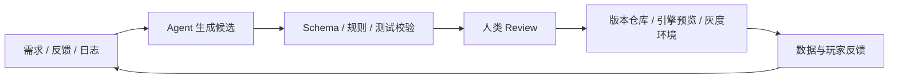

# 游戏行业如何引入 AI Agent

谈到 AI 与游戏行业，很多讨论会先落到美术资产生成、NPC 对话或者代码补全上。这些方向是目前的AI Agent 接入游戏领域的主要思路之一，但如果只把 AI 理解成某个环节里的内容生成器，就低估了它对游戏工业化流程的影响。

更值得关注的变化，是 AI Agent 会逐渐成为公司内部的一层智能协作系统。能读取项目文档、调用工具、分析日志、整理玩家反馈、生成候选方案，并把结果交给人类团队审核、选择和继续迭代。换句话说，Agent 的价值不在于替代某个岗位，成为目前人类协作系统的一部分，让游戏研发和运营从线性的人工流程，变成更快、更可验证的循环。

游戏行业讨论游戏工业化已经非常久了，在之前我们一直希望游戏能够像工业品生产一样趋向于标品和稳定生产，而用来推进游戏工业化的是一套严格的工程管理体系与生产管线，从而稳定的将创意变为产品。而 AI Agent 对于游戏行业的介入可能是游戏工业化的下一个阶段，一个建立标准工作流程的游戏工作将更多的从 AI Agent 中受益，而依赖于人与人的经验的制作团队，将更难融入这一轮 AI 浪潮。

这篇文章尝试从游戏行业的完整链路出发，讨论 AI Agent 可以如何融入研发、测试、玩家体验，以及由玩家反馈驱动的创意判断与版本迭代。

## 研发管线：从单点工具到协作网络

游戏研发是高度复杂的协作系统。策划、程序、美术、音频、关卡、测试和运营都在不断交换中间产物。AI Agent 进入研发管线后，最重要的不是让每个环节都自动生成（现有的生成结果只能作为对人的辅助而非取代人），而是让这些环节之间的信息流动更顺畅、更可检查。

在策划侧，Agent 可以协助生成配置表、任务链、技能描述、怪物行为草案和数值初稿。更关键的是，它可以围绕明确的 Schema 和规则做检查：字段是否缺失，道具 ID 是否存在，数值是否越界，奖励是否破坏经济系统，任务前置条件是否形成死锁，剧情文本是否和世界观设定冲突。

这意味着策划工具不应该只是一个聊天框，而应该和项目数据库、配置仓库、规则校验器、版本管理和引擎预览环境连接起来。Agent 生成的配置必须能被机器校验，也必须能被人类策划审阅和回滚。只有这样，它才是研发工具链，而不是一次性的文本助手。

在程序侧，Agent 的作用会更接近今天的 Agentic Coding，但游戏开发有自己的特殊性。它可以帮助生成样板代码、解释历史模块、定位崩溃日志、辅助 Code Review、补充单元测试、分析性能回归，也可以根据引擎日志和提交记录推测一个 Bug 可能来自资源、脚本、网络同步还是底层系统。

不过，游戏代码通常牵涉实时性能、内存、渲染、网络同步和跨平台适配。Agent 不能只追求代码看起来能跑，还要进入持续集成、自动化测试、性能基准和灰度验证流程。尤其是客户端和服务器联动、战斗结算、付费系统、反作弊系统等模块，任何自动修改都必须经过更严格的权限控制和人工审核。就这一点而言，Agentic Coding 还不够强。

在美术和音频侧，AI 的价值不只是生成一张图或一段声音，而是帮助团队探索风格、管理批量资产和做质量筛选。Agent 可以根据项目美术规范生成概念方向，批量标注资产，检查命名、尺寸、贴图通道、面数、骨骼绑定和导入规范，也可以用多模态模型辅助判断一批素材是否符合既定风格。

在关卡侧，Agent 可以参与灰盒生成、路径连通性检查、战斗遭遇节奏分析和玩家路线模拟。关卡设计很依赖经验，但很多基础检查可以被工具化：是否存在不可达区域，是否有过长的空跑路径，是否在关键教学前放入过强敌人，是否有视线引导不足的问题。Agent 可以把这些问题整理成可读报告，帮助关卡设计师更快定位风险。

在 QA 侧，Agent 可能带来较直接的效率提升。它可以自动跑图、执行脚本化操作、复现玩家路径、分析异常日志、聚类相似 Bug、从崩溃堆栈里生成初步归因，也可以把测试反馈转写为研发团队更容易处理的缺陷报告。长期看，QA Agent 会成为游戏研发中非常重要的一层，因为游戏系统越复杂，人工穷举测试越不现实。

游戏处于工业产品和艺术产品的叠加态，而 AI 能否带来其中艺术的一部分仍旧存疑，他更可能的是处在游戏工业化的流水线的一部分，让这个流水线能够更快的工作。

## 玩家体验：从静态内容到动态陪伴

AI Agent 进入游戏内体验后，最容易被想到的是 NPC 对话。更自然的对话、更符合角色性格的回应、长期的与用户交互的记忆，确实会提升沉浸感。但游戏内 Agent 的价值不应该只停留在会聊天的 NPC。（我模糊的印象表示，早在 LLM 发展的早期，逆水寒就考虑丢几个所谓 AI NPC，但是完全没有对游戏体验产生影响，这不是我们想要的。）

在 RPG、开放世界、模拟经营和 UGC 游戏中，Agent 可以成为系统与玩家之间的动态接口。它可以理解玩家当前目标，判断玩家卡在哪里，提供不破坏探索感的提示；也可以根据玩家偏好调整任务推荐、难度节奏和资源引导，让不同类型玩家都能找到合适的推进方式。（FPS TPS 的 AI 队友算是一个不错的尝试）

新手玩家真正需要的可能不是更多教程弹窗，而是在错误行为发生时得到更贴近场景的解释；回流玩家需要的可能不是一屏活动入口，而是知道自己离开后世界发生了什么、现在应该先做什么；高玩需要的则可能是更细的机制解释、构筑建议和挑战路径。游戏内容本身不因为引导发生变化，但游戏体验变了。

Agent 也可以服务于游戏内生态。UGC 游戏可以用 Agent 辅助玩家创建地图、任务、角色和规则；多人游戏可以用 Agent 帮助识别消极行为、总结战局表现、生成复盘建议；模拟经营游戏可以让 Agent 扮演更有目标感的虚拟居民或顾问，让系统反馈不再只是冷冰冰的数值变化。

但游戏内 Agent 必须被严格约束。NPC 不能随意承诺不存在的任务奖励，客服型助手不能误导玩家付费，剧情角色不能说出破坏世界观的内容，竞技游戏中的辅助建议也不能变成事实上的外挂。越靠近玩家体验，越需要稳定的人设、可控的知识边界、低延迟响应和明确的责任机制。

平衡游戏的 AI NPC 或者 AI 即时生成内容的灵活性和合规性将是生产环境中引入的全新问题。

## 玩家反馈闭环：从创意判断到版本迭代

如果把视角从单个功能拉回到游戏生命周期，立项和发行其实在处理同一个核心问题：团队如何更快、更准确地理解玩家反馈，并把它转化为可以被批判、排序和迭代的产品判断。

在项目早期，Agent 可以持续整理玩家评论、社区帖子、直播弹幕、竞品更新日志、应用商店评价和媒体测评，从中提炼玩家集中关心的问题：某类玩法是否疲劳，某种付费设计是否被反感，某个题材是否正在升温，玩家对某类系统的期待到底是深度、爽感、社交，还是低负担的日常陪伴。

这类分析不能停留在“正面评价占比多少”。更有价值的是把玩家声音拆成可行动的产品假设：玩家抱怨肝，可能不是内容太多，而是奖励节奏不透明；玩家说战斗无聊，可能不是技能数量少，而是敌人行为和关卡节奏没有变化；玩家说剧情出戏，可能是角色动机、任务目标和玩法行为没有对齐。

有了这些假设，Agent 才能真正帮助团队迭代创意。它可以围绕一个核心玩法生成多套世界观包装、角色关系、任务结构、商业化入口和新手引导草案，也可以对这些草案做反向批评：目标用户是否清楚，首日体验是否足够明确，长线留存靠什么支撑，核心循环有没有被过早的系统复杂度冲散。它不会替代制作人的判断，但能让早期讨论不再只依赖少数人的经验和灵感，而是把外部玩家信号、竞品变化和团队创意放到同一个工作台上反复推敲。

游戏上线之后，同一套机制会进入更高频的运行状态。社区评论、客服工单、应用商店评分、直播反馈、短视频舆情、数据看板和版本更新会同时涌来。Agent 可以承担持续感知层，把不同渠道的玩家声音合并、去重、聚类和归因，识别哪些是情绪表达，哪些是可复现 Bug，哪些是数值体验问题，哪些是商业化设计引发的信任问题，并把反馈和真实行为数据放在一起看，避免团队被舆论带偏。

比如，玩家抱怨某个副本太难，Agent 可以进一步检查通关率、失败节点、队伍构成、装备分布和攻略传播情况；玩家抱怨活动奖励差，Agent 可以对比参与率、付费转化、留存变化和竞品活动节奏；玩家集中吐槽新角色强度，Agent 可以分析对战数据、抽取意愿、社区情绪和后续平衡风险。

这些分析最终应该进入版本优先级排序。哪些问题必须热修，哪些问题应该进入下个版本，哪些只是沟通不足，哪些需要补偿或公告解释，Agent 可以提供结构化建议，也可以辅助生成公告草稿、活动文案、客服回复和内部复盘报告。但关键仍然不是让 Agent 自动决定版本方向，而是形成稳定的闭环：玩家信号被捕获，反馈被拆成产品假设，候选方案被生成和反向批评，修复或改动进入版本计划，上线后再观察数据和情绪变化，并把新一轮反馈带回下一次迭代。

**人永远是这个系统中不可缺少的，最重要的一环，一项看起来高级的技术偶尔会被非技术出身的人员奉为真理，但 Human in the loop 是现有所有智能体的必然。**

## 结语：未来的竞争力在系统，而不在单个模型

AI Agent 将会推进游戏工业化乃至人类社会进入一个新阶段，它会进入游戏行业的每一个环节，但它最重要的形态不一定是某个炫目的单点功能。真正有价值的，是把 Agent 加入真实的工业化生产管线：让它理解项目上下文，连接内部工具，读取玩家反馈，生成可检查的候选方案，并在人的监督下推动迭代。

对多数团队来说，合理的起点不是直接做全自动 NPC 或全自动研发，而是分三步走：先选择一个低风险、高重复的场景，例如反馈意见收集、策划案检查或自动QA；再把 Agent 接入现有工具链和验证层，而不是让它停留在聊天窗口；最后用人工审核、日志审计和版本指标衡量它是否真的缩短了迭代周期。

我的判断是，游戏公司以及未来的全部互联网公司的竞争力会来自谁能把 AI 变成稳定的研发和运营能力。创意仍然来自人，审美仍然来自人，对玩家关系的判断也仍然来自人。AI Agent 更像是一套放大系统：它让团队更快地看见问题，更快地探索方案，更快地验证假设，也更容易把玩家反馈带回产品本身。直到 AI 带来下一个爆款应用。

游戏是技术、艺术、商业和社区共同构成的复杂系统。AI Agent 如果要真正改变这个行业，就不能只停在生成几段文本、几张图或几行代码上。它需要进入立项、生产、测试、发行、运营和体验的完整循环中，成为游戏工业化下一阶段的协作基础设施。
