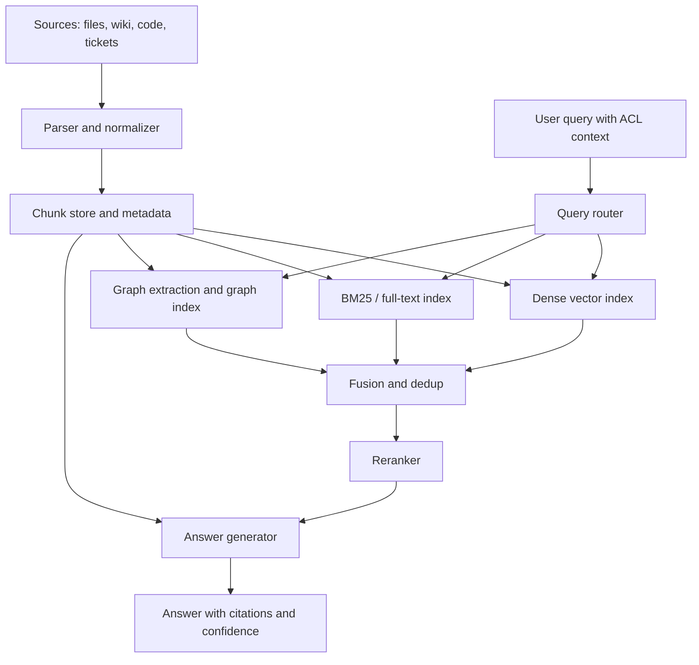

# 小规模企业内部知识库 RAG 技术选型比较

更新时间：2026-06-11

这份文档用于讨论一个内部综合知识库系统的技术选型。目标不是追求单项数据库的极限性能，而是在开发便利、部署复杂度、可定制性、检索效果、权限控制和未来迁移之间找到合理平衡。

本文重点场景是：小规模企业或团队知识库、本地 Agent、内部服务化、未来可能产品化。系统需要混合检索，包括 dense vector、BM25/全文检索、知识图谱/GraphRAG，并希望复用成熟包和服务降低开发成本。

## 1. 执行摘要

### 1.1 核心判断

1. **LightRAG 值得纳入 PoC，但更适合作为 GraphRAG 检索通道，而不是整个知识库系统的唯一底座。** LightRAG 当前明确支持 `global`、`local`、`hybrid`、`naive`、`mix` 五种查询模式，其中 `naive` 是传统 chunk 向量检索，`mix` 会合并 local、global 和 naive 检索结果。它也支持多种后端存储，但默认文件/内存型存储更偏开发调试，生产应换成 PostgreSQL、MongoDB、OpenSearch、Qdrant、Milvus、Neo4j 或 Memgraph 等后端。参考 [LightRAG README](https://github.com/HKUDS/LightRAG) 和 [LightRAG PyPI](https://pypi.org/project/lightrag-hku/)。

2. **不要过早把 Neo4j、Milvus、OpenSearch 作为首版强依赖。** 它们能力强，但部署、建模、运维、权限和备份成本也高。首版目标是小规模企业知识库，开发速度和可替换性比极限性能更值钱。

3. **首版应先做可替换的检索编排层。** dense、BM25、GraphRAG、reranker、权限过滤、引用溯源都通过统一协议接入。这样本地版可以用 SQLite，服务版可以换 LanceDB/Chroma/Postgres/Qdrant，图谱复杂后再接 Neo4j。

4. **本地 Agent 场景可以认真考虑 SQLite。** SQLite FTS5 自带全文检索和 `bm25()` 排序函数；向量检索可以用第三方 `sqlite-vec`，也可以关注 SQLite 官方新的 `vec1` 扩展。它们适合本地、单用户、小团队、嵌入式知识库，但不应该被当成高并发多租户向量数据库。

5. **Chroma 是很好的传统 RAG 组件，但如果目标是 dense + BM25 + hybrid 的统一本地能力，LanceDB 也许更值得优先 PoC。** Chroma 的优势是 RAG 生态、API 简单、client/server 方便；LanceDB 的优势是本地嵌入、向量检索、全文检索、hybrid search 和 rerank 路线比较直接。

### 1.2 推荐路线

| 阶段 | 默认方案 | 为什么 |
|---|---|---|
| 本地/小规模 V1 | SQLite + FTS5 + sqlite-vec + LightRAG 可选通道 | 零服务或极少服务，方便随本地 Agent 分发；能覆盖 BM25、dense、基础元数据、轻量 GraphRAG |
| 小团队服务化 V1.5 | Postgres + LanceDB 或 Chroma + LightRAG/LlamaIndex | Postgres 管业务、权限、任务和审计；向量/全文检索组件独立；GraphRAG 插拔 |
| 中大规模 V2 | Postgres + Qdrant + 独立 GraphRAG 通道 | Qdrant 对 dense/sparse/hybrid 更生产化，Postgres 保持业务事实源，图谱按需升级 |
| 图查询复杂后 | Neo4j 或 Memgraph | 当用户真的需要 Cypher、强关系遍历、图可视化、图算法时再引入 |
| 企业搜索规模后 | OpenSearch 或 Elasticsearch | 当关键词搜索、权限过滤、搜索运维、审计、规模和团队经验变得更重要时再引入 |

### 1.3 最简最终建议

首版不要让数据库决定系统形状。先定义：

- 文档和 chunk 的事实源。
- 检索器统一返回协议。
- 融合排序和 rerank 策略。
- 权限过滤位置。
- 引用溯源标准。
- 评估集和验收指标。

数据库和框架只是可替换实现。

## 2. 需求画像与选型原则

### 2.1 需求画像

你的目标系统更像一个“内部知识操作系统”，而不是一个简单的 PDF 聊天工具。它需要：

- 支持内部文档、网页、Markdown、代码说明、会议纪要、FAQ、制度、流程、产品资料。
- 支持自然语言问题，也支持精确名词、编号、版本、项目名、人名、客户名、工单号等关键词问题。
- 支持密集向量召回，也支持 BM25/全文检索，还要有知识图谱能力处理关系型、多跳、跨文档问题。
- 支持小规模本地部署，未来可服务化、多租户、产品化。
- 保留足够定制空间，不被 Dify、RAGFlow、Neo4j、Chroma 或 LightRAG 任意一个平台完全锁死。

### 2.2 选型原则

1. **便利性是生产力。** 如果一个数据库能节省两个月工程成本，即使单次查询慢几十毫秒，也可能更适合首版。

2. **不要把混合检索等同于“一个数据库原生支持所有能力”。** 更现实的方式是多个检索器并行召回，然后用 RRF、加权融合或 reranker 合并。

3. **权限控制优先级高于检索炫技。** 企业知识库最大风险不是慢，而是把不该看的文档召回给了不该看的用户。

4. **先评估再上图谱。** GraphRAG 对多跳和关系问题有价值，但它引入实体抽取、关系抽取、图谱清洗、增量更新、错误修正和解释成本。

5. **保留迁移通道。** embedding 模型、向量库、图数据库、chunk 策略都会变化。系统设计上要假设它们以后会换。

6. **把文档解析当成一等问题。** 很多 RAG 失败不是向量库失败，而是 PDF 表格、页眉页脚、扫描件、标题层级、代码块、图片和表格解析失败。

## 3. 整体架构建议

### 3.1 推荐模块

一个可演进的知识库 RAG 系统建议拆成这些模块：

- **连接器**：本地文件、网盘、Git、Wiki、Notion、飞书、Confluence、网页、数据库导出。
- **文档解析**：PDF、Office、HTML、Markdown、图片 OCR、表格、代码块。
- **规范化与 chunk 管理**：保留标题路径、段落层级、页码、表格结构、代码语言、来源 URL、更新时间。
- **元数据与权限库**：tenant、workspace、doc_id、chunk_id、source_uri、ACL、版本、删除状态。
- **dense 检索器**：embedding + vector search。
- **BM25/全文检索器**：关键词、精确编号、人名、产品名、异常码。
- **GraphRAG 检索器**：实体、关系、社区摘要、多跳路径、Text-to-Cypher 或模板查询。
- **融合排序**：RRF、加权 RRF、score normalization、query routing。
- **reranker**：跨编码器或 LLM rerank，对候选 chunk 做精排。
- **答案生成**：带引用、带不确定性、禁止无来源断言。
- **评估与观测**：query log、召回命中、引用命中、失败案例、权限审计、索引耗时。

### 3.2 数据流



### 3.3 统一检索接口

建议所有检索器都返回同一种结构，而不是让业务层直接依赖 Chroma、LanceDB、Qdrant、Neo4j 或 LightRAG 的返回值。

```json
{
  "query_id": "q_20260611_001",
  "retriever": "dense|bm25|graph|wiki",
  "tenant_id": "tenant_a",
  "doc_id": "doc_123",
  "chunk_id": "chunk_456",
  "source_uri": "file://policy/leave_policy.pdf#page=3",
  "title_path": ["人事制度", "休假政策", "年假"],
  "text": "召回文本...",
  "snippet": "高亮片段...",
  "score": 0.83,
  "rank": 4,
  "acl_tags": ["hr", "cn-office"],
  "provenance": {
    "indexed_at": "2026-06-11T10:00:00+08:00",
    "source_updated_at": "2026-06-10T18:00:00+08:00",
    "parser": "docling|ragflow|custom"
  }
}
```

这个协议的价值是：

- BM25、dense、graph 可以并行召回。
- 后续可以把 Chroma 换 LanceDB，把 LanceDB 换 Qdrant。
- 可以统一做权限过滤、去重、rerank 和引用。
- 可以记录每个答案到底来自哪个检索通道。

### 3.4 三阶段架构

#### Local-first

适合本地 Agent、单用户、个人知识库、小团队离线工具。

- SQLite 存文档、chunk、任务、权限标签和索引状态。
- SQLite FTS5 做全文检索和 BM25。
- sqlite-vec 或 SQLite 官方 vec1 做向量检索。
- LightRAG 或 LlamaIndex PropertyGraphIndex 做可选图谱通道。
- 使用本地文件目录保存原文和解析产物。

优点是分发和部署简单，缺点是并发、多租户、集中审计和横向扩展弱。

#### Team service

适合公司内部服务、几十到几百用户、部门知识库。

- Postgres 管业务事实源、用户、租户、权限、任务、审计。
- LanceDB、Chroma 或 Qdrant 做向量和 hybrid 检索。
- GraphRAG 作为独立索引和检索器。
- API 层负责权限过滤、检索融合、rerank、答案生成。
- 文件对象存储或内部 NAS 保存原文和解析中间件。

优点是工程边界清晰，缺点是组件变多，需要做好索引一致性。

#### Scale-out

适合百万级 chunk、多租户、企业搜索、严格 SLA。

- Postgres 或专用元数据服务保存业务事实。
- Qdrant、Milvus、Weaviate 或 OpenSearch/Elasticsearch 承担核心检索。
- Neo4j/Memgraph 只在图查询成为核心需求后引入。
- 需要异步索引队列、增量更新、删除传播、快照恢复、权限审计、灰度索引。

优点是上限高，缺点是团队需要搜索工程和数据平台能力。

## 4. 核心候选技术对比

评分约定：1 = 低/弱，5 = 高/强。部署复杂度是反向指标，数值越高表示越重。

| 技术 | 适合阶段 | 开发便利 | 部署复杂度 | 混合检索原生度 | 图谱能力 | 规模上限 | 首版推荐度 |
|---|---|---:|---:|---:|---:|---:|---:|
| SQLite + FTS5 + sqlite-vec | 本地、小团队 | 5 | 1 | 3 | 1 | 2 | 5 |
| LanceDB | 本地、小中规模 | 5 | 1-2 | 5 | 1 | 3-4 | 5 |
| Chroma | 原型、小中规模 | 5 | 1-2 | 3-4 | 1 | 3 | 4 |
| Postgres + pgvector + FTS | 内部服务 | 4 | 2-3 | 3 | 1 | 4 | 5 |
| Qdrant | 中等生产 | 4 | 2-3 | 5 | 1 | 4-5 | 4 |
| Weaviate | 搜索平台化 | 3 | 3 | 5 | 2 | 4 | 3 |
| Milvus | 大规模向量 | 3 | 4 | 4 | 1 | 5 | 2 |
| Redis / RediSearch | 缓存加搜索 | 3 | 3 | 4 | 1 | 4 | 2 |
| OpenSearch / Elasticsearch | 企业搜索 | 3 | 4 | 5 | 1 | 5 | 2-3 |
| Typesense | 轻量搜索 | 4 | 2 | 4 | 1 | 3-4 | 3 |
| Meilisearch | 简单搜索 | 4 | 2 | 3 | 1 | 3 | 2-3 |
| Neo4j | 图谱核心 | 3 | 3-4 | 2-3 | 5 | 4 | 2 |
| Memgraph / FalkorDB | 图谱备选 | 3 | 2-3 | 2 | 4 | 3-4 | 2-3 |

### 4.1 SQLite + FTS5 + sqlite-vec / sqlite-vss / vec1

**定位**：本地知识库、桌面 Agent、单用户或小团队嵌入式数据库。

SQLite FTS5 是官方全文检索扩展，内置 `bm25()` 辅助函数，可用 `ORDER BY bm25(table)` 做 BM25 排序。参考 [SQLite FTS5](https://sqlite.org/fts5.html)。

向量方面有三个值得区分的方向：

- `sqlite-vec`：第三方 SQLite 向量扩展，纯 C、无依赖、可存 float/int8/binary vectors，作者明确称它是 `sqlite-vss` 的 successor，但仍是 pre-v1，可能有破坏性变化。参考 [sqlite-vec README](https://github.com/asg017/sqlite-vec) 和 [sqlite-vec docs](https://alexgarcia.xyz/sqlite-vec/)。
- `sqlite-vss`：基于 Faiss 的旧扩展，作者已说明不再 active development，精力转向 `sqlite-vec`。参考 [sqlite-vss README](https://github.com/asg017/sqlite-vss)。
- `vec1`：SQLite 官方新的向量扩展，值得关注，但作为较新的官方扩展，首版采用前要验证语言绑定、发布节奏、索引能力和包分发体验。参考 [SQLite vec1](https://sqlite.org/vec1.html)。

**优点**

- 几乎零运维，可随应用一起分发。
- 文档、chunk、权限标签、任务状态、全文索引、向量索引可以放在一个本地数据库附近。
- 适合本地 Agent 每个用户一个库。
- FTS5 对精确词、编号、产品名、异常码、制度条款非常有用。

**短板**

- 不适合作为高并发、多租户、集中权限审计的主检索服务。
- 向量扩展生态仍在快速变化，需要接受版本变化和平台打包问题。
- 混合检索需要自己编排：FTS5 返回一组结果，sqlite-vec 返回一组结果，再自己做 RRF 或 rerank。
- 图谱能力弱，只能存三元组表或 JSON，复杂图遍历不舒服。

**适合**

- 本地 Agent。
- 小团队离线知识库。
- 产品早期验证。
- 隐私和本地部署优先的场景。

**不适合**

- 多租户 SaaS。
- 大规模并发。
- 复杂图查询。
- 需要强搜索运维能力的企业搜索。

### 4.2 Chroma

**定位**：RAG 原型和中小规模向量检索组件。

Chroma 自称 open-source data infrastructure for AI，Python/JS 接入简单，支持本地原型、持久化、client/server 模式。README 中也说明 client-server 可通过 `chroma run --path /chroma_db_path` 启动。参考 [Chroma GitHub](https://github.com/chroma-core/chroma) 和 [Chroma Client-Server Mode](https://docs.trychroma.com/docs/run-chroma/client-server)。

Chroma 近年也在推进 sparse、BM25、full-text、hybrid 方向。官方 README 提到 Chroma Cloud 提供 vector、hybrid、full-text search；文档中也有 [Chroma BM25 sparse embedding helper](https://docs.trychroma.com/integrations/embedding-models/chroma-bm25) 和 [Sparse Vector Search](https://docs.trychroma.com/cloud/schema/sparse-vector-search)。

**需要特别注意**

Chroma 的传统优势是 dense vector RAG。BM25/sparse/hybrid 文档中有一部分和 Chroma Cloud、新 Search API 或 sparse embedding helper 相关。若你要使用 OSS 本地部署，必须在 PoC 中验证：

- 本地版本是否支持你需要的 sparse schema。
- dense + sparse 是否能在同一查询路径中原生融合。
- BM25 是作为 sparse embedding helper 使用，还是等价于传统倒排 BM25 搜索。
- 权限过滤和元数据过滤是否满足企业知识库需求。

**优点**

- 上手快，RAG 社区熟悉。
- 本地、server、Docker、Cloud 路径都有。
- collection、metadata filter、embedding function 等概念适合 RAG 原型。
- 如果你主要想控制传统 chunk 向量 RAG，Chroma 很顺手。

**短板**

- 业务元数据、权限、任务状态仍建议放在 Postgres/SQLite。
- 对 BM25/hybrid 的 OSS 本地能力不能只看 Cloud 文档，需要实测。
- 不是图数据库，也不是完整企业搜索引擎。

**适合**

- 快速搭建传统 RAG。
- 小团队向量检索服务。
- 与自研 BM25 检索器组合。

**不适合**

- 想把 dense、BM25、GraphRAG、权限和审计都塞进一个系统。
- 需要复杂全文搜索语法、同义词、搜索运营和 ranking 调参的企业搜索。

### 4.3 LanceDB

**定位**：本地友好、开发便利、同时覆盖向量和全文/混合检索的候选。

LanceDB 官方 hybrid search 文档说明它可以组合 vector search 和 full-text search，并通过 reranking 算法融合；默认可用 RRF 类 reranker，也支持自定义 reranker。参考 [LanceDB Hybrid Search](https://docs.lancedb.com/search/hybrid-search/)。

**优点**

- 本地目录即可运行，适合 local-first。
- 向量、全文、hybrid、rerank 路线清晰。
- 对多模态和列式数据也友好。
- 从原型到小中规模服务的迁移体验相对平滑。

**短板**

- 企业级权限、审计、多租户仍需业务层或 Postgres。
- 大规模生产经验和团队熟悉度可能不如 Elasticsearch/Postgres/Qdrant。
- 图谱能力不是重点。

**适合**

- 想要比 SQLite 更强的检索能力，但又不想一开始上重服务。
- 小团队内部知识库。
- 本地 Agent 和服务化之间的过渡层。

**不适合**

- 搜索团队已经深度使用 Elasticsearch/OpenSearch。
- 业务数据强依赖 SQL 事务，且希望一库到底。

### 4.4 Postgres + pgvector + FTS / ParadeDB

**定位**：中小企业内部服务最稳妥的一体化底座。

`pgvector` 是 PostgreSQL 的开源向量相似度扩展，支持 exact 和 approximate search，包含 HNSW、IVFFlat 等索引能力。参考 [pgvector GitHub](https://github.com/pgvector/pgvector)。Postgres 自带全文检索能力，参考 [PostgreSQL Text Search](https://www.postgresql.org/docs/current/textsearch.html)。

如果希望 Postgres 内部有更接近搜索引擎的 BM25 能力，可以看 ParadeDB 的 `pg_search`，它是面向 Postgres 的搜索扩展路线。参考 [ParadeDB pg_search](https://github.com/paradedb/paradedb)。

**优点**

- 业务数据、权限、文档元数据、任务、审计、向量可以放在同一个可靠数据库生态内。
- 团队通常更熟 Postgres，备份、迁移、权限、监控都成熟。
- 对内部服务非常稳，不容易过早引入复杂基础设施。
- 与 RLS、多租户、事务一致性结合方便。

**短板**

- 传统 FTS 不是完整 Elasticsearch 级搜索体验。
- dense + BM25 的融合通常要自己写 SQL 或业务编排。
- 超大规模向量检索性能和运维边界不如专用向量库。

**适合**

- 内部服务第一版。
- 需要强权限、审计、业务元数据一致性。
- 团队已有 Postgres。

**不适合**

- 搜索量非常大、需要复杂 ranking pipeline。
- 多模态向量、复杂 ANN 调优是核心需求。

### 4.5 Qdrant

**定位**：生产友好的专用向量数据库，适合作为中等规模后的升级目标。

Qdrant 官方 hybrid query 文档说明可以通过 prefetch 召回 dense、sparse 或 multivector 结果，再用 RRF 或 DBSF 等方式融合。参考 [Qdrant Hybrid Queries](https://qdrant.tech/documentation/search/hybrid-queries/)。

**优点**

- dense/sparse/hybrid 能力强，API 清晰。
- Rust 实现，部署比 Milvus/OpenSearch 更轻。
- payload filter 适合和权限、元数据结合。
- 有 Docker、Cloud、SDK，生产化路径明确。

**短板**

- 业务事实源仍需要 Postgres/SQLite 等旁路数据库。
- 图谱不是它的目标。
- 对纯本地每用户嵌入式场景仍比 SQLite/LanceDB 重。

**适合**

- 中等规模内部服务。
- 需要稳定向量检索和 hybrid query。
- 希望未来可扩展，但不想一开始上 Milvus。

**不适合**

- 极简本地 Agent。
- 想把文档、权限、任务、图谱全部放进一个库。

### 4.6 Weaviate

**定位**：带 BM25、vector、hybrid 和 schema 概念的向量搜索平台。

Weaviate 官方文档说明 hybrid search 会并行执行 vector search 和 BM25 search，再融合结果。参考 [Weaviate Hybrid Search](https://docs.weaviate.io/weaviate/search/hybrid)。

**优点**

- hybrid 概念成熟。
- schema、模块、Cloud、生态都比较完整。
- 比单纯向量库更接近语义搜索平台。

**短板**

- 平台感更重，学习和运维成本高于 Chroma/LanceDB/Qdrant。
- 如果你希望完全自研编排，Weaviate 可能显得“替你决定太多”。

**适合**

- 想要一体化语义搜索平台。
- 团队接受 schema-first 和平台化工作流。

**不适合**

- 极简本地部署。
- 首版重点是低成本自研编排。

### 4.7 Milvus

**定位**：大规模向量数据库。

Milvus 官方文档包含 hybrid search、sparse vector、BM25 function 等能力。参考 [Milvus Hybrid Search](https://milvus.io/docs/hybrid_search_with_milvus.md) 和 [Milvus BM25](https://milvus.io/docs/full-text-search.md)。

**优点**

- 大规模向量检索能力强。
- 社区和生态成熟。
- 适合千万级、亿级向量或多集合管理。

**短板**

- 部署和运维明显重。
- 对小规模知识库来说容易过度设计。
- 业务数据、权限和全文检索仍需整体架构配合。

**适合**

- 已经明确有大规模向量检索需求。
- 有数据平台或搜索基础设施团队。

**不适合**

- 首版小规模企业知识库。
- 单机、本地、低运维目标。

### 4.8 Redis / RediSearch

**定位**：内存型搜索和向量检索能力，适合已有 Redis Stack 体系的团队。

Redis Query Engine/RediSearch 支持全文搜索、过滤、向量相似度查询等能力。参考 [Redis vector search](https://redis.io/docs/latest/develop/ai/search-and-query/vectors/) 和 [RediSearch GitHub](https://github.com/RediSearch/RediSearch)。

**优点**

- 如果团队已有 Redis 运维体系，接入方便。
- 向量、全文、过滤可在一个查询引擎里做。
- 延迟低。

**短板**

- 内存成本和持久化模型需要认真评估。
- 对企业知识库的文档事实源、审计、复杂权限并不是天然最优。
- 如果只是为了 RAG 检索引入 Redis Stack，可能偏重。

**适合**

- 已经深度使用 Redis Stack。
- 需要低延迟搜索或缓存型检索。

**不适合**

- 首版追求低运维和低成本。
- 文档量增长快但预算有限。

### 4.9 OpenSearch / Elasticsearch

**定位**：企业搜索、日志搜索、复杂全文检索和大规模搜索平台。

OpenSearch 支持 hybrid search 和 neural search，可以通过 search pipeline 对 keyword 和 semantic search 做归一化与融合。参考 [OpenSearch Hybrid Search](https://docs.opensearch.org/latest/vector-search/ai-search/hybrid-search/index/)。Elasticsearch 支持 BM25、向量检索和 RRF 等混合检索工具。参考 [Elasticsearch RRF](https://www.elastic.co/docs/reference/elasticsearch/rest-apis/reciprocal-rank-fusion)。

**优点**

- 全文检索、filter、聚合、排序、同义词、查询 DSL 很强。
- 企业搜索经验丰富。
- 大规模和可观测性生态成熟。

**短板**

- 运维复杂度高。
- 对小规模 RAG 首版太重。
- 需要搜索工程经验，否则 ranking 调参会变成长期成本。

**适合**

- 企业已有 OpenSearch/Elasticsearch。
- 关键词搜索、复杂过滤、审计和大规模是核心。

**不适合**

- 本地 Agent。
- 小团队首版。

### 4.10 Typesense / Meilisearch

**定位**：更轻量的搜索引擎，适合做关键词搜索和轻量 hybrid。

Typesense 支持 vector search，并提供 keyword + vector 组合能力。参考 [Typesense Vector Search](https://typesense.org/docs/29.0/api/vector-search.html)。Meilisearch 提供 AI-powered search 和 hybrid search 相关能力。参考 [Meilisearch Hybrid Search](https://www.meilisearch.com/docs/learn/ai_powered_search/hybrid_search)。

**优点**

- 比 Elasticsearch/OpenSearch 轻。
- 开发体验好。
- 适合产品内搜索、文档搜索、简单 hybrid。

**短板**

- 对复杂企业搜索和大规模 RAG 的上限不如 OpenSearch/Qdrant/Milvus。
- 图谱不是目标。
- 权限和业务事实源仍需旁路系统。

**适合**

- 快速做搜索体验。
- 中小规模产品内搜索。

**不适合**

- 希望首版就深度 GraphRAG。
- 高度定制化 ranking pipeline。

### 4.11 Neo4j

**定位**：成熟图数据库，适合复杂关系建模和 Cypher 查询。

Neo4j 支持图数据建模、Cypher 查询、图算法、可视化和向量索引能力。Neo4j 也有官方 GraphRAG Python 包，提供 VectorRetriever、HybridRetriever、Text2CypherRetriever 等能力。参考 [Neo4j GraphRAG Python](https://neo4j.com/docs/neo4j-graphrag-python/current/) 和 [Neo4j Vector Indexes](https://neo4j.com/docs/cypher-manual/current/indexes/semantic-indexes/vector-indexes/)。

**优点**

- 图查询和关系建模能力强。
- Cypher 表达力高。
- 图可视化、图算法、社区生态成熟。
- 适合实体关系是核心资产的场景。

**短板**

- 建模成本高。
- 运维、备份、权限、增量同步都比轻量方案重。
- 如果图谱只是 RAG 的一个辅助召回通道，Neo4j 可能过重。

**适合**

- 组织、人、项目、系统、客户、合同、服务之间关系非常重要。
- 需要可解释图路径和图查询。
- 图谱会被多个业务系统复用。

**不适合**

- 首版只是想提升 RAG 召回。
- 文档规模小、图问题不明确。

### 4.12 Kuzu / Memgraph / FalkorDB

**定位**：Neo4j 之外的图数据库或 GraphRAG 图存储候选。

- **Kuzu**：嵌入式 property graph database 的思路非常适合 local-first 图查询，但截至本文更新时间，公开 GitHub 页面显示 Kuzu 相关仓库有 archive 状态提示，正式选型前必须重新核实维护路线。参考 [Kuzu GitHub](https://github.com/kuzudb/kuzu)。
- **Memgraph**：开源图数据库，兼容部分 Cypher 生态，可作为 Neo4j 之外的图数据库候选。参考 [Memgraph Docs](https://memgraph.com/docs)。
- **FalkorDB**：由 RedisGraph 演进而来的图数据库路线，提供 GraphRAG 相关 SDK/示例，适合关注轻量图服务的团队。参考 [FalkorDB](https://www.falkordb.com/)。

**建议**

这些更适合做专项 PoC，不建议在首版默认押注。除非你们明确要做本地图数据库或不想引入 Neo4j。

## 5. GraphRAG 专项

### 5.1 为什么需要 GraphRAG

dense vector 和 BM25 解决的是“找到相关文本”。GraphRAG 更适合：

- 多跳关系：A 项目负责人是谁，他同时负责哪些客户。
- 跨文档聚合：多个制度里对同一流程的约束如何关联。
- 实体中心问题：某客户、系统、合同、产品线相关的全部事实。
- 全局主题：一批文档主要在讲什么，主题之间有什么关系。
- 可解释路径：答案为什么从实体 X 走到实体 Y。

但 GraphRAG 也带来额外成本：

- LLM 抽取实体和关系会出错。
- 同名实体、别名、缩写、版本需要归一。
- 增量更新和删除要同步图。
- 图谱太脏时，图检索会制造更多噪声。
- 不是所有问题都需要图。

### 5.2 LightRAG

**是否支持传统 RAG**

支持。LightRAG 的 `naive` 模式就是不使用知识图谱，直接基于原始 text chunks 做向量相似度检索。`mix` 模式会合并 local、global 和 naive，因此也包含传统 chunk 检索。参考 [LightRAG README](https://github.com/HKUDS/LightRAG)。

**GraphRAG 能力**

LightRAG 提供：

- `local`：偏实体邻域和局部关系。
- `global`：偏宏观主题、跨文档关系和全局上下文。
- `hybrid`：合并 local 和 global。
- `naive`：传统向量 RAG。
- `mix`：合并 local、global、naive。

当前 README 显示默认查询模式为 `mix`，并说明 `mix` 通常结果最理想，但比 `naive` 略慢。

**后端存储**

LightRAG 需要四类存储：

- KV_STORAGE：LLM 缓存、chunk 结果、实体关系抽取结果。
- VECTOR_STORAGE：文本块、实体、关系的向量。
- GRAPH_STORAGE：知识图谱。
- DOC_STATUS_STORAGE：文档列表和状态。

默认存储适合开发调试，不适合生产。生产可选择 PostgreSQL、MongoDB、OpenSearch 作为统一后端，也可以 Qdrant/Milvus 做向量，Neo4j/Memgraph 做图。参考 [LightRAG README](https://github.com/HKUDS/LightRAG)。

**社区主要用法**

从 README、PyPI 和项目更新看，LightRAG 更像一个自包含 GraphRAG 引擎和研究/工程框架：

- 快速把文档构造成轻量知识图谱。
- 使用 WebUI 插入、查询、可视化知识。
- 作为 GraphRAG 与传统 RAG 的对比基线。
- 通过不同存储后端迁移到生产。
- 结合 reranker、Langfuse、RAGAS、引用功能、文档删除等增强。

**风险**

- 如果把 LightRAG 接管整个系统，业务权限、文档治理、检索评估、UI、审计、租户隔离会受到它的框架边界影响。
- embedding 模型变化通常需要重建向量和相关索引。
- GraphRAG 抽取质量取决于 LLM、prompt、文档质量和实体归一策略。

**建议用法**

把 LightRAG 包装成一个 `GraphRetriever`：

```text
query + tenant_acl -> LightRAG graph/mix query -> normalized retrieval results -> fusion/rerank
```

不要让业务层直接依赖 LightRAG 的内部存储和返回结构。

### 5.3 Microsoft GraphRAG

Microsoft GraphRAG 更适合“全局理解”和“社区摘要”类问题。它会从语料中构建图、社区层级和摘要，适合问：

- 这批文档有哪些主要主题。
- 某类事件或风险如何在文档集中分布。
- 组织知识之间有哪些宏观关系。

参考 [Microsoft GraphRAG](https://microsoft.github.io/graphrag/)。

**适合**

- 离线分析。
- 研究型知识库。
- 大量文档的主题归纳。
- 与普通 RAG 做效果基线。

**不适合**

- 轻量首版默认。
- 高频实时增量更新。
- 对成本非常敏感的场景。

### 5.4 LlamaIndex PropertyGraphIndex

LlamaIndex 的 PropertyGraphIndex 适合自研系统，因为它把图构建和检索组件化。官方文档列出多类 retriever，包括 LLMSynonymRetriever、VectorContextRetriever、TextToCypherRetriever、CypherTemplateRetriever 和 CustomPGRetriever。参考 [LlamaIndex PropertyGraphIndex](https://docs.llamaindex.ai/en/stable/module_guides/indexing/lpg_index_guide/)。

**适合**

- 想自研编排层。
- 想在 Neo4j、Qdrant、其他 graph/vector store 之间切换。
- 想把图检索与传统 RAG、rerank、agent pipeline 组合。

**风险**

- 需要工程整合能力。
- Text-to-Cypher 在生产中必须加只读权限、模板约束和安全校验。

### 5.5 Neo4j GraphRAG Python

如果未来明确选择 Neo4j，Neo4j GraphRAG Python 是自然路线。它提供面向 Neo4j 的 retriever、Text2Cypher、hybrid 检索等能力。参考 [Neo4j GraphRAG Python](https://neo4j.com/docs/neo4j-graphrag-python/current/)。

**建议**

不要因为想做 GraphRAG 就先上 Neo4j。应先用 LightRAG/LlamaIndex 在小数据上证明图谱带来的收益，再决定是否把图谱变成基础设施。

### 5.6 Graphiti/Zep、Cognee

Graphiti/Zep 更偏 temporal knowledge graph 和 Agent memory。它适合记录事实随时间变化、用户长期偏好、对话历史中的实体关系。参考 [Graphiti docs](https://help.getzep.com/graphiti/getting-started/welcome)。

Cognee 也偏 AI memory、知识图谱、RAG 结合的方向。参考 [Cognee GitHub](https://github.com/topoteretes/cognee)。

**建议**

这些项目适合后续做 Agent memory 层，不建议作为企业静态文档知识库的首版唯一底座。

### 5.7 什么时候值得引入图谱

值得引入图谱的信号：

- 用户经常问关系型问题，而非只问某段制度原文。
- 文档中有稳定实体：人、团队、项目、客户、系统、产品、合同、流程、风险、指标。
- 答案需要跨文档、多跳、可解释路径。
- 知识会被可视化或被其他业务系统复用。
- GraphRAG 在评估集上对关系型问题有明显提升。

不该引入图谱的信号：

- 90% 问题都能由 BM25 + dense + reranker 解决。
- 文档很少，实体关系不稳定。
- 组织还没有文档治理和权限治理。
- 图谱没人维护，抽错了也没人修。
- 只是因为“GraphRAG 听起来先进”。

## 6. LLM Wiki 与知识沉淀层

LLM Wiki 不是一个标准数据库，而是一种知识沉淀模式：让 LLM 把原始资料、对话、文档、研究记录整理成结构化、可审阅、可版本化的 Markdown/wiki 页面。可以参考 Andrej Karpathy 的 [LLM Wiki gist](https://gist.github.com/karpathy/442a6bf555914893e9891c11519de94f)。

### 6.1 它解决什么问题

普通 RAG 每次都从原始 chunk 中临时拼答案。LLM Wiki 则把高频和稳定知识沉淀下来：

- FAQ。
- 术语表。
- 产品规则。
- 系统架构说明。
- 故障排查手册。
- 客户项目背景。
- 内部流程。
- 研究综述。

这让知识库从“检索一堆片段”变成“逐渐形成可维护知识资产”。

### 6.2 它与 RAG 的关系

LLM Wiki 不替代 RAG。更好的结构是：

```text
原始文档 -> RAG 索引
高价值问题 -> LLM 生成 Wiki 草稿 -> 人工审阅 -> Wiki 页面入库 -> 再被 RAG 检索
```

也就是说，RAG 负责召回事实来源，LLM Wiki 负责沉淀稳定知识。

### 6.3 风险

- 摘要会过期。
- LLM 可能把临时事实写成长期事实。
- 如果没有 source links，Wiki 会失去可追溯性。
- 如果没有人工审阅，内部知识可能被错误固化。

### 6.4 建议

首版可以把 LLM Wiki 做成“生成草稿”功能，而不是自动改写知识库：

- 每个 Wiki 页面必须有来源列表。
- 每个页面必须有 `last_verified_at`。
- 页面变更进入 review 队列。
- Wiki 页面本身也作为文档重新索引。

## 7. 成熟产品与项目参考

这些项目不一定适合作为底座，但很值得借鉴产品形态、文档解析、权限设计和用户体验。

### 7.1 可直接试用或作为产品原型

| 项目 | 定位 | 借鉴点 | 风险 |
|---|---|---|---|
| RAGFlow | 开源 RAG 引擎，强调深度文档理解 | 文档解析、引用、工作流、企业文档体验 | 平台较完整，自研定制要看边界 |
| Dify | LLM 应用平台，含知识库/RAG | 应用编排、工作流、非工程用户体验 | 平台锁定感较强 |
| AnythingLLM | 本地/服务端知识库聊天 | 快速产品化、本地体验 | 深度定制和复杂检索需评估 |
| Open WebUI Knowledge | LLM WebUI + 知识库 | 本地模型和用户入口 | 知识库能力不是最深 |
| Kotaemon | 开源文档聊天/RAG UI | 清爽 RAG UI、本地文档问答 | 企业权限和规模需自补 |
| Onyx/Danswer | 企业内部搜索和 AI 助手 | 连接器、企业搜索、团队知识入口 | 作为平台采用时定制边界需评估 |

来源参考：[RAGFlow](https://github.com/infiniflow/ragflow)、[Dify](https://github.com/langgenius/dify)、[AnythingLLM](https://github.com/Mintplex-Labs/anything-llm)、[Open WebUI](https://github.com/open-webui/open-webui)、[Kotaemon](https://github.com/Cinnamon/kotaemon)、[Onyx](https://github.com/onyx-dot-app/onyx)。

### 7.2 适合借鉴的库和服务

| 项目 | 定位 | 借鉴点 |
|---|---|---|
| LlamaIndex | RAG/Agent 数据框架 | PropertyGraphIndex、retriever 编排、文档索引 |
| Haystack | RAG pipeline 框架 | pipeline、retriever、ranker、generator 组合 |
| LangChain | LLM 应用框架 | 连接器、工具、agent 生态 |
| LlamaParse / LlamaCloud | 文档解析和托管 RAG 能力 | 复杂 PDF、表格、文档结构处理 |
| Docling | 文档解析和格式转换 | 本地解析、PDF/Office/HTML 到结构化表示 |
| Unstructured | 文档 partition 和解析 | 企业文档 ingestion |
| RAGAS / DeepEval / TruLens | RAG 评估 | 自动评估、回归测试、错误分析 |
| Langfuse / Phoenix | 观测与 tracing | query trace、成本、召回上下文记录 |

参考：[LlamaIndex](https://github.com/run-llama/llama_index)、[Haystack](https://github.com/deepset-ai/haystack)、[LangChain](https://github.com/langchain-ai/langchain)、[LlamaParse](https://docs.cloud.llamaindex.ai/llamaparse/getting_started)、[Docling](https://github.com/docling-project/docling)、[Unstructured](https://github.com/Unstructured-IO/unstructured)、[RAGAS](https://github.com/explodinggradients/ragas)、[DeepEval](https://github.com/confident-ai/deepeval)、[TruLens](https://github.com/truera/trulens)、[Langfuse](https://github.com/langfuse/langfuse)、[Phoenix](https://github.com/Arize-ai/phoenix)。

### 7.3 为什么仍建议“库 + 自研编排”

你的需求不是单个聊天机器人，而是可演进知识库系统。平台类项目可以快速验证产品形态，但核心检索链路最好自己掌握：

- 你需要混合检索策略，而不是平台默认策略。
- 你需要企业权限和审计。
- 你需要替换数据库和 embedding 模型。
- 你需要 GraphRAG 只是一个通道，而不是平台强绑定。
- 你需要把 LLM Wiki、文档治理、评估集逐步纳入系统。

因此建议：平台项目用于参考和原型，核心系统采用库和服务自研编排。

## 8. 推荐决策矩阵

### 8.1 按规模选择

| 场景 | 推荐组合 | 备选 | 不建议首选 |
|---|---|---|---|
| 每用户本地 Agent | SQLite + FTS5 + sqlite-vec + local files | LanceDB local | Neo4j、Milvus、OpenSearch |
| 小团队内部知识库 | Postgres + LanceDB 或 Chroma + LightRAG | SQLite 服务化、Qdrant | Milvus、Neo4j 强依赖 |
| 中等规模内部服务 | Postgres + Qdrant + 独立 GraphRAG | Weaviate、LanceDB Cloud/Server | 单 SQLite、纯 Chroma |
| 企业搜索型知识库 | OpenSearch/Elasticsearch + vector/hybrid + Postgres | Weaviate、Qdrant + search engine | 只用向量库 |
| 图谱是核心资产 | Neo4j + LlamaIndex/Neo4j GraphRAG + Postgres | Memgraph、FalkorDB | LightRAG 默认文件存储 |
| 快速产品验证 | RAGFlow/Dify/Kotaemon/AnythingLLM | Chroma + 简单 UI | 从零写全平台 |

### 8.2 按能力选择

| 能力优先级 | 最优先候选 | 理由 |
|---|---|---|
| 本地分发 | SQLite、LanceDB | 文件级部署，少服务 |
| 传统 RAG 控制 | Chroma、LanceDB、Postgres + pgvector | 开发体验好，易控制 chunk 和 metadata |
| BM25/关键词 | SQLite FTS5、LanceDB、OpenSearch、Postgres FTS | 精确词和编号问题必须靠它 |
| dense+sparse hybrid | LanceDB、Qdrant、Weaviate、OpenSearch | hybrid 路线更直接 |
| 权限和业务一致性 | Postgres | 企业内部服务最稳 |
| 图谱检索 | LightRAG、LlamaIndex、Neo4j GraphRAG | 从轻到重逐步升级 |
| 图数据库 | Neo4j、Memgraph | 复杂图查询和图可视化 |
| 大规模向量 | Qdrant、Milvus | 专用向量基础设施 |
| 企业搜索 | OpenSearch、Elasticsearch | 搜索 DSL、聚合、运营和规模 |

### 8.3 我的默认推荐

#### 推荐一：Local-first PoC

```text
SQLite
  - documents
  - chunks
  - metadata
  - ACL tags
  - FTS5 index
sqlite-vec 或 vec1
  - dense vector index
LightRAG
  - optional graph retriever
Fusion
  - RRF + rerank
```

适合验证：

- 本地 Agent 是否可行。
- SQLite 是否能满足每用户知识库。
- BM25 + dense 是否已经覆盖大部分问题。
- LightRAG 是否带来额外收益。

#### 推荐二：Team service PoC

```text
Postgres
  - users / tenants / permissions
  - documents / chunks / index states
LanceDB or Chroma
  - vector / hybrid retrieval
LightRAG or LlamaIndex
  - GraphRAG channel
API service
  - ACL filter
  - fusion
  - rerank
  - answer generation
```

适合验证：

- 多用户和团队共享。
- 权限过滤。
- 增量更新和删除。
- 检索评估和 tracing。

#### 推荐三：Production evolution

```text
Postgres + Qdrant + GraphRAG service
```

当数据量、并发、稳定性要求上来后，把 LanceDB/Chroma 替换为 Qdrant。GraphRAG 保持独立通道。如果图谱成为核心，再把图存储升级到 Neo4j/Memgraph。

## 9. PoC 计划

### 9.1 PoC A：Local-first

**目标**

验证 SQLite + FTS5 + sqlite-vec + LightRAG 是否足够支持小规模本地知识库。

**数据规模**

- 500 到 5,000 份文档。
- 10,000 到 100,000 个 chunk。
- 包含 PDF、Markdown、网页、Office、代码说明。

**实现**

- SQLite 存文档、chunk、metadata、ACL。
- FTS5 建全文索引。
- sqlite-vec 建向量索引。
- LightRAG 对同一批文档建图谱索引。
- 查询时并行跑 BM25、dense、LightRAG，再做 RRF 和 rerank。

**验收**

- 普通语义问题：dense + rerank 能稳定召回正确来源。
- 精确名词问题：BM25 明显补足 dense。
- 关系问题：LightRAG 至少在多跳问题上有可观察提升。
- 删除文档后，BM25、dense、graph 都不再召回该文档。
- 单机索引和查询体验可接受。

### 9.2 PoC B：Team service

**目标**

验证服务化架构、权限过滤、增量更新和组件替换边界。

**数据规模**

- 5,000 到 50,000 份文档。
- 100,000 到 1,000,000 个 chunk。
- 至少 3 类权限空间：公开、部门、个人/项目。

**实现**

- Postgres 保存业务事实源和权限。
- LanceDB 或 Chroma 做向量/混合检索。
- LightRAG 或 LlamaIndex 做 GraphRAG 通道。
- 所有检索结果统一成标准 `RetrievalResult`。
- API 层统一做 ACL filter、fusion、rerank、citation。

**验收**

- 权限测试 100% 通过。
- 删除和更新在所有索引中最终一致。
- 能输出每个答案引用的 source_uri、页码或标题路径。
- 能记录每个 query 的 retriever 命中和 rerank 前后结果。
- 可在不改业务 API 的情况下替换 Chroma/LanceDB/Qdrant。

### 9.3 测试集设计

至少准备 80 到 150 个问题，分成：

- **精确事实**：制度条款、编号、日期、金额、异常码。
- **语义改写**：用户不用原文措辞提问。
- **多跳关系**：人、项目、客户、系统之间的关系。
- **跨文档总结**：多个文档共同回答。
- **否定问题**：知识库没有答案时必须拒答。
- **权限问题**：不同用户看到不同答案或拒答。
- **时效问题**：旧版本和新版本同时存在。
- **表格问题**：答案来自表格单元格。
- **代码/配置问题**：答案来自代码块、YAML、日志。

### 9.4 指标

| 指标 | 说明 |
|---|---|
| Recall@k | 正确 chunk 是否进入前 k |
| MRR / nDCG | 正确结果排名是否靠前 |
| Answer correctness | 答案是否正确 |
| Citation correctness | 引用是否真的支持答案 |
| Refusal correctness | 无答案时是否拒答 |
| ACL correctness | 是否泄露无权限内容 |
| Index latency | 新文档可检索耗时 |
| Delete consistency | 删除后是否仍可召回 |
| P50/P95 latency | 查询延迟 |
| Cost per query | embedding、rerank、LLM 成本 |
| Operational effort | 部署、备份、监控、人力 |

### 9.5 GraphRAG 是否上线的门槛

建议设置一个朴素门槛：

- 如果 BM25 + dense + reranker 已覆盖 80% 以上高频问题，GraphRAG 不必进入首版主链路。
- 如果 GraphRAG 对关系型、多跳、跨文档问题带来 10% 到 15% 以上的可重复提升，才进入默认召回。
- 如果 GraphRAG 只在少数 demo 问题上表现好，保留为实验通道。
- 如果图谱结果不可解释或经常引入错误实体，先修抽取和实体归一，不要盲目上线。

## 10. 最终建议

### 10.1 首版默认

首版建议从两个 PoC 开始：

1. **Local-first PoC**：SQLite + FTS5 + sqlite-vec + LightRAG。
2. **Team service PoC**：Postgres + LanceDB/Chroma + LightRAG/LlamaIndex。

这两个 PoC 可以共享同一套检索接口、chunk schema、评估集和 answer generation 层。

### 10.2 不建议首版默认

首版不建议把这些作为强依赖：

- Neo4j：除非图查询是核心产品价值。
- Milvus：除非明确有大规模向量检索压力。
- OpenSearch/Elasticsearch：除非已有搜索运维体系或关键词搜索是核心。
- Redis/RediSearch：除非已经有 Redis Stack，并且内存成本可接受。
- 任何完整平台：除非目标是快速上线标准化产品，而不是保留自研控制。

### 10.3 最可能的技术路线

```text
阶段 1：SQLite/LanceDB/Chroma 快速验证
阶段 2：Postgres 固化业务事实源和权限
阶段 3：Qdrant 承担生产向量与 hybrid 检索
阶段 4：GraphRAG 通道从 LightRAG 演进到 LlamaIndex/Neo4j
阶段 5：LLM Wiki 成为人工可审阅的知识沉淀层
```

### 10.4 最重要的工程边界

无论选择哪个数据库，都要保留下面这些边界：

- `DocumentStore`：事实源和元数据。
- `ChunkStore`：chunk 文本、层级、来源、版本。
- `DenseRetriever`：向量召回。
- `LexicalRetriever`：BM25/FTS 召回。
- `GraphRetriever`：GraphRAG 召回。
- `WikiRetriever`：人工/半自动沉淀知识页召回。
- `FusionRanker`：融合和去重。
- `Reranker`：精排。
- `CitationBuilder`：引用和证据。
- `EvaluationHarness`：评估和回归测试。

这样你既可以先用轻量方案快速前进，又不会在后续被某个数据库或平台锁死。

## 资料来源

### SQLite 与本地检索

- [SQLite FTS5](https://sqlite.org/fts5.html)
- [SQLite vec1](https://sqlite.org/vec1.html)
- [sqlite-vec GitHub](https://github.com/asg017/sqlite-vec)
- [sqlite-vec Docs](https://alexgarcia.xyz/sqlite-vec/)
- [sqlite-vss GitHub](https://github.com/asg017/sqlite-vss)

### 向量数据库与搜索系统

- [Chroma GitHub](https://github.com/chroma-core/chroma)
- [Chroma Client-Server Mode](https://docs.trychroma.com/docs/run-chroma/client-server)
- [Chroma BM25](https://docs.trychroma.com/integrations/embedding-models/chroma-bm25)
- [Chroma Sparse Vector Search](https://docs.trychroma.com/cloud/schema/sparse-vector-search)
- [LanceDB Hybrid Search](https://docs.lancedb.com/search/hybrid-search/)
- [Qdrant Hybrid Queries](https://qdrant.tech/documentation/search/hybrid-queries/)
- [pgvector GitHub](https://github.com/pgvector/pgvector)
- [PostgreSQL Text Search](https://www.postgresql.org/docs/current/textsearch.html)
- [ParadeDB GitHub](https://github.com/paradedb/paradedb)
- [Weaviate Hybrid Search](https://docs.weaviate.io/weaviate/search/hybrid)
- [Milvus Hybrid Search](https://milvus.io/docs/hybrid_search_with_milvus.md)
- [Milvus Full Text Search / BM25](https://milvus.io/docs/full-text-search.md)
- [Redis Vector Search](https://redis.io/docs/latest/develop/ai/search-and-query/vectors/)
- [RediSearch GitHub](https://github.com/RediSearch/RediSearch)
- [OpenSearch Hybrid Search](https://docs.opensearch.org/latest/vector-search/ai-search/hybrid-search/index/)
- [Elasticsearch RRF](https://www.elastic.co/docs/reference/elasticsearch/rest-apis/reciprocal-rank-fusion)
- [Typesense Vector Search](https://typesense.org/docs/29.0/api/vector-search.html)
- [Meilisearch Hybrid Search](https://www.meilisearch.com/docs/learn/ai_powered_search/hybrid_search)

### GraphRAG 与图数据库

- [LightRAG GitHub](https://github.com/HKUDS/LightRAG)
- [LightRAG PyPI](https://pypi.org/project/lightrag-hku/)
- [Microsoft GraphRAG](https://microsoft.github.io/graphrag/)
- [LlamaIndex PropertyGraphIndex](https://docs.llamaindex.ai/en/stable/module_guides/indexing/lpg_index_guide/)
- [Neo4j GraphRAG Python](https://neo4j.com/docs/neo4j-graphrag-python/current/)
- [Neo4j Vector Indexes](https://neo4j.com/docs/cypher-manual/current/indexes/semantic-indexes/vector-indexes/)
- [Graphiti Docs](https://help.getzep.com/graphiti/getting-started/welcome)
- [Cognee GitHub](https://github.com/topoteretes/cognee)
- [Kuzu GitHub](https://github.com/kuzudb/kuzu)
- [Memgraph Docs](https://memgraph.com/docs)
- [FalkorDB](https://www.falkordb.com/)

### 产品与框架参考

- [RAGFlow GitHub](https://github.com/infiniflow/ragflow)
- [Dify GitHub](https://github.com/langgenius/dify)
- [Kotaemon GitHub](https://github.com/Cinnamon/kotaemon)
- [AnythingLLM GitHub](https://github.com/Mintplex-Labs/anything-llm)
- [Open WebUI GitHub](https://github.com/open-webui/open-webui)
- [Onyx GitHub](https://github.com/onyx-dot-app/onyx)
- [LlamaIndex GitHub](https://github.com/run-llama/llama_index)
- [Haystack GitHub](https://github.com/deepset-ai/haystack)
- [LangChain GitHub](https://github.com/langchain-ai/langchain)
- [LlamaParse Docs](https://docs.cloud.llamaindex.ai/llamaparse/getting_started)
- [Docling GitHub](https://github.com/docling-project/docling)
- [Unstructured GitHub](https://github.com/Unstructured-IO/unstructured)
- [RAGAS GitHub](https://github.com/explodinggradients/ragas)
- [DeepEval GitHub](https://github.com/confident-ai/deepeval)
- [TruLens GitHub](https://github.com/truera/trulens)
- [Langfuse GitHub](https://github.com/langfuse/langfuse)
- [Phoenix GitHub](https://github.com/Arize-ai/phoenix)
- [LLM Wiki gist](https://gist.github.com/karpathy/442a6bf555914893e9891c11519de94f)
