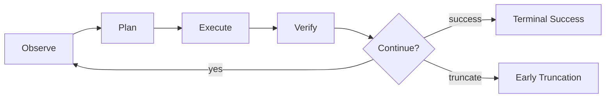

前面几篇文章里，我已经分别讲过三件事：[Reward 自己是怎样被生产出来的](/blog/2026/03/19/reward-design-evolution-from-rlhf-to-rlvr/)、[为什么 Agentic RL 真正重要的是训练闭环而不是单个算法](/blog/2026/03/21/from-sft-to-agentic-rl-training-loop/)，以及[真实系统里的数据治理、环境与 feedback stack 怎样长出来](/blog/2026/03/22/reward-and-training-in-agent-k-paperbench-amap/)。但如果你是从 Agent 进入这个方向，而不是从强化学习算法进入，读到这里通常还会卡住一个非常现实的问题：

**这些概念我都知道了，可我手里已经有一个会调用工具的 Agent，我到底要怎样把它整理成“可训练对象”？**

这篇文章就是专门回答这个问题的。它不从 `PPO`、`GAE` 或 loss 推导开始，而是用一个最小代码修复 Agent，把 `ART`、`AgentFlow`、`Verlog`、`RULER` 和 `ARPO` 重新拆解为五个工程问题：怎么收原料、怎么拆模块、怎么切长轨迹、怎么搭 feedback stack、怎么把探索预算花在关键节点上。

如果只先记一句话，那就是：**对 Agent 研究者来说，训练的第一步不是换 optimizer，而是先把系统改写成有环境合同、有轨迹语言、有反馈接口的学习对象。**

## 为什么这篇实战不从 PPO 开始

如果你的研究重心在 `Agent`，那你真正先要解决的通常不是“哪种 RL 算法更先进”，而是下面三个更靠前的问题：

- `Environment Contract`：任务目标、可见状态、允许动作、终止条件、失败条件到底是什么？
- `Trajectory Schema`：一条 episode 究竟怎样切成 step，哪些状态转移和工具返回必须被记录？
- `Feedback Stack`：哪些信号来自硬 verifier，哪些来自过程反馈，哪些必须退回到相对排序或 judge？

也正因为如此，我更愿意把 `ART / AgentFlow / Verlog / RULER / ARPO` 先看成五种代表性思路，而不是五个需要逐篇背诵的名词。它们在本文里的位置如下：

| 材料 | 在本文里的角色 | 真正解决的问题 | 落点 |
| --- | --- | --- | --- |
| `ART` | 给现有 Agent 补训练可观测层 | 系统会运行，但没有统一日志、无法回放 | `Trajectory Schema` |
| `AgentFlow` | 划定可学习边界 | 哪些模块该学，哪些模块先保持确定性 | `Environment Contract` |
| `Verlog` | 组织长轨迹与早截断 | 多轮 rollout 容易失真、浪费预算 | `Trajectory Schema` |
| `RULER` | 设计分层反馈接口 | 只有终局成功/失败时，reward 太稀疏 | `Feedback Stack` |
| `ARPO` | 在关键节点上分支探索 | 探索预算不该在每一步平均燃烧 | 关键节点探索 |

这张表也隐含了本文的立场：**不是先有 trainer，后面再想办法喂数据；而是先把 Agent 系统整理成一个可以被 trainer 消费的对象。**

## 把问题固定在一个最小代码修复 Agent 上

为了避免整篇文章飘成抽象方法论，我先把任务定死：给一个有 failing tests 的小仓库，让 Agent 在有限步数内定位并修复 bug。

我选这个例子，不是因为代码任务最“高级”，而是因为它刚好同时具备四个优点：

- 工具边界清晰，天然有 `search/read/edit/run_tests` 这种可枚举动作；
- 成功标准相对客观，至少有测试和语法检查这一层硬 verifier；
- 失败轨迹和恢复轨迹都很典型，容易展示“原料”从哪里来；
- 它足够接近很多现实 Agent 系统，但又不至于大到把问题搅浑。

一个最小 `TaskSpec` 可以先写成这样：

```yaml
task_id: bugfix_014
goal: 修复 parser 在空输入下抛出的异常
workspace: sandboxed_repo

allowed_tools:
  - search_code
  - read_file
  - edit_file
  - run_tests

constraints:
  max_steps: 10
  network_access: false
  editable_paths:
    - src/**
  protected_paths:
    - tests/**
  repeated_uninformative_calls: 2

termination:
  success:
    - target_tests_pass
    - patch_applies_cleanly
  failure:
    - step_budget_exceeded
    - unrecoverable_tool_error
    - invalid_patch
    - repeated_uninformative_calls
```

这个 `TaskSpec` 看起来很朴素，但它已经把很多后面会反复用到的训练前提钉住了：什么叫合法动作、什么叫越界、什么叫终止、什么叫“继续探索已经不值了”。

## 先用 ART 的思路，加一层可回放观测

很多 Agent 系统“暂时不能训练”，并不是因为它们不会调 RL，而是因为它们根本没有统一的轨迹记录层。系统当然在跑，也会产生一堆 log，但这些 log 往往是面向调试、不是面向学习：有的只记最终答案，有的只记工具 stdout，有的把整轮上下文混成一段文本，最后谁也不知道哪一步到底发生了什么。

这就是为什么我会先借 `ART` 的思路看问题。本文里我不把它理解成某个特定框架，而是理解成一种很务实的动作：**先给现有 Agent 补一层训练可观测性。**

最小化的做法不是重写整个系统，而是在 Agent loop 外面包一层统一记录器。至少先把这些字段记下来：

- `task_id`
- `step_id`
- `observation`
- `action_type`
- `action_args`
- `tool_result`
- `local_verdict`
- `done_reason`

比如，一条最小 `TrajectoryRecord` 可以长成这样：

```json
{
  "task_id": "bugfix_014",
  "episode_id": "bugfix_014_run_003",
  "steps": [
    {
      "step_id": 1,
      "observation": "pytest reports ValueError in parser.py when the input line is empty",
      "action_type": "search_code",
      "action_args": {
        "query": "parse_line empty input ValueError"
      },
      "tool_result": "src/parser.py:12 def parse_line(raw_line): ...",
      "local_verdict": "useful_hit",
      "done_reason": null
    },
    {
      "step_id": 2,
      "observation": "parser.py looks relevant; empty string reaches split(':')[1]",
      "action_type": "read_file",
      "action_args": {
        "path": "src/parser.py"
      },
      "tool_result": "function body with unchecked split(':')[1]",
      "local_verdict": "root_cause_narrowed",
      "done_reason": null
    }
  ],
  "terminal_status": "in_progress"
}
```

这里最重要的不是 JSON 语法，而是它背后的约束：**每一步都必须同时留下 observation、action、environment response 和局部判断。** 没有这四件东西，后面无论你做 SFT、ranking 还是 online RL，都会卡在“轨迹不可回放”。

所以 `ART` 在这篇文章里的真正位置，不是“又一个训练器”，而是：**让普通 Agent 第一次开始留下可训练痕迹。**

## 再用 AgentFlow 的思路，拆出可学习边界

原始的 Agent 很容易被写成一个大黑盒：读上下文、想一步、调工具、再想一步、最后总结。这样的系统当然能跑，但一旦你想训练，就会遇到一个麻烦问题：**到底哪些东西应该成为 policy 的一部分，哪些东西应该先保持稳定？**

这就是 `AgentFlow` 给我的启发。它最值得借来的地方，不是“四模块名字”，而是那种把 agent 工程结构改写成训练结构的意识。

对这个最小代码修复任务，我会先把系统拆成四层：

| 模块 | 职责 | 默认处理方式 |
| --- | --- | --- |
| `Planner` | 决定下一步是搜索、读文件、编辑还是跑测试 | 作为主要学习对象 |
| `Executor` | 负责把动作翻译成真实工具调用 | 保持确定性 |
| `Verifier` | 检查 patch、测试结果、语法状态 | 保持确定性 |
| `Reporter` | 向用户汇报结果或失败原因 | 暂时不放进 RL 主体 |

为什么不一上来把所有模块都一起学？因为那样会把本来就难的策略学习问题再揉得更糊。

| 原因 | 如果所有模块一起学 | 只先学 `Planner` 的好处 |
| --- | --- | --- |
| 降低目标漂移 | 工具协议、解释风格、策略选择一起变化 | 先固定工具层和验证层，策略目标更稳定 |
| 减少工具协议崩坏 | Agent 可能学会“用更花哨的语言”掩盖错误调用 | 动作接口保持刚性，更容易审计 |
| 避免混淆语言质量与策略质量 | 最终回答写得漂亮不等于路径走得对 | 把“是否选对动作”从“是否会写总结”里拆出来 |

所以 `AgentFlow` 在本文里的价值，不是告诉你一定要有四个类，而是提醒你：**训练之前先把可学习边界划出来。** 在这个最小系统里，我宁可先只让 `Planner` 受 RL 影响，也不愿意让整个 Agent 一起漂。

## 用 Verlog 的思路，重写长轨迹和 early truncation

一旦 Agent 不再是单轮回答，而是要连续读文件、改代码、跑测试、再回退，你就已经不在处理“一段长文本”了，而是在处理一条会展开、会失败、会提前终止的交互轨迹。

`Verlog` 对我最有帮助的地方，恰恰是这种对长轨迹的系统感：**step 边界要切清楚，继续滚动是否值得要尽早判断。**

对这个最小代码修复 Agent，我会把一条轨迹的 step 明确切成下面五段：

1. 看到当前 `observation`
2. `Planner` 选择动作
3. `Executor` 真正执行工具
4. `Verifier` 或环境返回结果
5. 把结果写回状态，决定继续还是终止

这个结构可以用一个很简单的流程图表示：



在这个框架下，`early truncation` 不是一个“系统优化小技巧”，而是一条训练纪律。比如下面这些情况，我就不会再继续 rollout：

- `patch` 无法应用，且修复原因已经明确；
- 连续两次出现无信息、重复性的工具调用；
- 工具返回不可恢复错误，比如关键文件不存在且任务依赖它；
- 已经超过步数预算，继续滚动只是在制造低质量噪声。

为什么这很关键？因为长轨迹里最贵的东西不是 token，而是**错误状态被继续传播**。如果你没有统一的 step 语言，也没有清楚的截断规则，最后收上来的不是“多轮智能体数据”，而是一堆无法学习的长日志。

所以 `Verlog` 在本文里真正要教新手的，不是底层并行引擎怎么写，而是：**长轨迹首先要被正确切开，然后在不值得继续时及时停下。**

## 用 RULER 的思路，搭一个三层 Feedback Stack

在[前一篇关于 reward 演化的文章](/blog/2026/03/19/reward-design-evolution-from-rlhf-to-rlvr/)里，我已经说过很多次：reward 不是一个孤零零的总分，而是一条生产线。到了这个最小代码修复 Agent 里，这件事会变得更具体。

如果你只给一个终局二元奖励，比如“测试通过记 1，不通过记 0”，那当然最干净，但也会立刻遇到两个问题：

- 很多轨迹明明在逼近正确答案，却和完全瞎改一样都记成 `0`；
- 开放任务里的中间质量完全被抹平，后面既没法筛原料，也没法做 ranking。

所以这里更稳妥的做法，是借 `RULER` 的思路，把 feedback 设计成一个三层栈：

| signal source | example | 用途 | 风险 |
| --- | --- | --- | --- |
| 硬 verifier | 测试通过、语法正确、patch 可应用 | 给最核心的 outcome 判断 | 太稀疏，覆盖不了中间质量 |
| 过程信号 | failing tests 数量下降、定位到正确文件、错误信息更聚焦 | 给 trajectory 中间阶段提供弱反馈 | 容易被局部最优误导 |
| 相对排序 / judge | 多个 patch 都没完全成功时，比较谁更接近正确 | 把开放行为改成可比较结构 | judge 自身可能有偏差 |

我会把这三层的默认优先级写得非常硬：

```text
verifier > process signal > judge/ranking
```

意思不是后两层不重要，而是**只要能验证，就先让 verifier 说话；只有 verifier 覆盖不到的部分，才交给过程信号和相对排序。**

一个很典型的例子是：同一个任务下，候选 patch A 让 5 个 failing tests 降到 1 个，patch B 依旧 5 个全挂，patch C 直接改了受保护的测试文件。此时即便三者最终都没有“完全成功”，你仍然能得到一个相对稳定的顺序：`A > B > C`。这就是 `RULER` 在本文里的价值：**不是替代 verifier，而是在 verifier 不足时，把开放行为改写成相对结构。**

## 用 ARPO 的思路，只在关键节点上探索

新手一听“探索”，最容易犯的错误之一，就是以为每一步都应该多采样、多分支。但对真正的 Agent 系统来说，预算往往不是被“探索太少”花掉的，而是被“在不值得的地方探索太多”花掉的。

`ARPO` 给我的最大启发，不是那套算法名字本身，而是一个非常朴素的原则：**把分支采样留给真正高不确定的节点。**

在这个最小代码修复 Agent 里，我只会重点盯三类节点：

- 该改哪个文件；
- 该改核心逻辑，还是先补一层 guard；
- 测试失败以后，是回退重来，还是沿着当前方向继续。

也就是说，默认策略不是“全程树搜索”，而是下面这种节奏：

- 普通步骤：单路径前进；
- 关键节点：采样 `2-3` 条候选分支；
- 分支结束后：用 verifier 和 ranking 选优，再继续主线。

举个最小例子。假设 Agent 已经定位到 `parser.py`，并发现空输入导致 `split(':')[1]` 越界。此时其实会出现两条很典型的支线：

| 分支 | 动作 | 可能收益 | 可能风险 |
| --- | --- | --- | --- |
| A | 修改 parser 主逻辑，让空输入直接返回空结构 | 更接近根因修复 | 可能影响正常输入路径 |
| B | 先在入口补一个 guard，拦截空字符串 | 改动小、失败成本低 | 容易变成临时补丁 |

如果每一步都做分支采样，你的 rollout 成本会爆炸；但如果在这种真正影响后续轨迹形状的节点完全不分支，你又会错过高价值探索。`ARPO` 在本文里的作用，就是帮你把探索预算集中在这种“分岔口”上。

## 最后把原料流向讲清楚

等你有了 `Environment Contract`、`Trajectory Schema` 和 `Feedback Stack` 以后，真正重要的问题就变成了：**这些原料分别流向哪里？**

我更推荐把它们显式分流，而不是一股脑全部扔给 trainer：

| 原料类型 | 去向 | 作用 |
| --- | --- | --- |
| 成功轨迹 | cold-start SFT | 先写入合法动作先验和基本节奏 |
| 恢复良好的失败轨迹 | process supervision / SFT 补样本 | 教模型学会恢复，而不只是模仿成功 |
| 同任务多候选轨迹 | ranking / preference data | 让相对优劣进入优化器 |
| 关键节点上的分支 rollout | online RL | 把探索预算放在最值钱的决策点 |
| 协议崩坏、重复空转、无信息调用 | filtering / bad case library | 先做数据闸门，再决定要不要反向利用 |

这里最值得强调的一点是：**失败轨迹不是天然垃圾。** 真正低价值的是“无信息失败”和“协议崩坏失败”；而那种测试失败后成功回退、重新定位、最后逼近正确答案的轨迹，恰恰是最好的恢复原料。

换句话说，你真正做的不是“把 log 攒多一点”，而是在建一套原料分流系统。不同类型的轨迹，天然就该进入不同的后续阶段。

## 一个训不起来的最小反例

最后，反过来看一个最常见的失败版本。假设你也有一个代码修复 Agent，但它的训练前置设计长这样：

- 没有 step 边界，整轮交互最后只保存成一段长文本；
- 只保留最终成功和最终失败，不记录中间工具调用；
- reward 只有一个黑盒总分，没有 verifier、过程信号和 ranking 分层；
- 没有 early truncation，Agent 在错误方向上会一直空转；
- 所有模块一起学，连工具调用协议和最终汇报风格都跟着漂。

这样的系统当然也能“开始训”，但大概率会出现下面这些症状：

- 你不知道模型到底是在错误定位、错误编辑，还是错误验证；
- 你没法从失败中提取恢复样本，因为中间信息已经丢了；
- 你会把大量 rollout 预算浪费在重复调用和无效路径上；
- 你很难判断性能下降是 reward 设计的问题，还是模块边界的问题。

所以很多 Agent 训不起来，首先不是 RL 算法不行，而是**系统本身还没有被整理成可训练对象。**

全文最后一句话就是：

**对 Agent 研究者来说，真正的第一步不是“挑一个更强的 RL 算法”，而是先把普通 Agent 改写成一个有环境合同、有轨迹语言、有反馈分层、能在关键节点探索的训练系统。** 只有做到这一步，后面的 SFT、ranking、online RL 和更复杂的 trainer，才有地方落脚。
