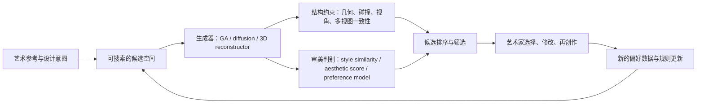

最近读到一篇很有意思的交叉学科文章：[A Machine Learning Application Based on Giorgio Morandi Still-Life Paintings to Assist Artists in the Choice of 3D Compositions](https://research.gold.ac.uk/id/eprint/31665/)。它发表在 *Leonardo* 55(1)，作者是 Guido Salimbeni、Frederic Fol Leymarie 和 William Latham，DOI 是 [10.1162/leon_a_02073](https://doi.org/10.1162/leon_a_02073)。这篇文章不算今天意义上的大模型论文，规模也不大，但它很好地抓住了一个到现在仍然关键的问题：**AI 在艺术创作里到底应该负责什么？**

如果只看表面，它像是在做“莫兰迪风格的 3D 静物构图生成”。但我觉得它真正有价值的地方，是把艺术创作拆成了一条很清楚的生成管线：

1. 先用人类艺术经验构造一个可学习的参考空间。
2. 再用程序生成大量候选构图。
3. 然后用机器学习模型判断哪些候选更接近目标美学。
4. 最后把高分结果交还给艺术家，而不是替艺术家完成最终作品。

这和今天很多生成式 AI 系统其实是同一个结构。无论是文本生成图像、图像生成 3D、还是游戏资产生成，真正困难的地方都不只是“生成”。生成只是把候选空间放大。更难的是：**什么样的候选值得保留？什么样的风格算符合意图？什么样的结构在几何上可用、在视觉上可信、在创作上有价值？**

所以这篇文章可以当作一个小型切片：从莫兰迪静物出发，看 AI 如何进入包含美学价值判断的生成管线。

## 这篇莫兰迪论文到底做了什么

乔治·莫兰迪的静物画很适合作为这个实验的对象。莫兰迪画的不是复杂叙事，而是瓶子、罐子、盒子、桌面、空间留白、前后遮挡和微妙的体积关系。它们看起来安静，但构图非常讲究：物体之间的距离、重叠、遮挡、深度、边界、整体重心，都构成了画面的稳定感。

论文的目标不是让 AI 直接画一张“莫兰迪风格新画”。它做的是更早一步的事情：**在 Unity3D 里自动排列一组 3D 静物模型，生成可供画家参考的构图方案，并用机器学习模型为这些构图打分。**

这点很重要。它不是把艺术创作理解成“一步出图”，而是把 AI 放在构思阶段。系统生成的是构图原型，而不是最终作品。艺术家仍然可以根据这些原型去画、修改、拒绝、吸收或重组。

论文里的基础数据集也很小，但设计得很明确：作者构建了 300 组 3D 模型构图，把瓶子、花瓶等静物模型放在类似莫兰迪画面中的桌面上，并根据莫兰迪原作里物体的位置手工摆放。这 300 组构图不是为了覆盖世界上所有静物画，而是为了把“莫兰迪式构图经验”压缩成一个局部的、可学习的参考空间。

接下来，系统用遗传算法在 Unity3D 中搜索新的摆放方案。每一个候选构图都可以被编码为一组空间参数，比如物体的位置、旋转、前后关系和相互距离。遗传算法做的事很直接：保留高分构图，让它们交叉、变异，再产生新一代候选。这里的关键是 fitness function，也就是“这个构图好不好”的自动评分函数。

这篇论文最容易被误读的地方也在这里。它不是用了一个单一的深度学习评分器，而是用 **Unity3D + 遗传算法 + 四个独立训练的神经网络** 组成了一个混合系统。游戏引擎负责提供真实的 3D 空间信息，遗传算法负责扩大搜索，神经网络负责把多个构图信号合成审美评分。

## 四个神经网络组成的 fitness function

论文的神经网络架构可以分成四路。前三个网络分别评估构图的不同侧面，第四个网络再把前三者的输出合成为最终评分。根据论文附录，四个网络都独立训练，但共享同一个目标变量，也就是数据库中预先赋予的构图审美标签。

| 组件 | 输入 | 它在判断什么 | 作用 |
| --- | --- | --- | --- |
| FCN 1 | Unity3D 中前视图和顶视图的组合图像 | 物体体积、位置、前后深度关系 | 从 3D 投影中判断空间布局 |
| CNN 2 | Unity3D 主摄像机的透视图像 | 当前构图与原始数据库图像的相似性 | 学习“像不像莫兰迪式构图” |
| FCN 3 | Unity3D 直接生成的四类分数 | 对称性、统一性、孤立感、视觉平衡，以及物体相交和屏幕占比 | 把几何与构图规则显式送入模型 |
| NN 4 | 前三个网络的输出 | 综合评分 | 输出 0 到 1 的最终 fitness，供 GA 使用 |

这个设计的聪明之处在于，它没有假装纯图像网络可以理解所有空间问题。Unity3D 本来就知道物体的坐标、体积、碰撞和相机关系。与其让 CNN 从 2D 图像里硬猜“两个瓶子有没有相交”，不如直接让 3D 引擎提供结构化信号。换句话说，系统把审美判断拆成了两层：

第一层是可验证或可计算的几何约束，比如物体不能穿模、不能完全孤立、屏幕占比不能失衡、深度轴上要有可见层次。

第二层是学习到的风格偏好，比如某个布局是否接近莫兰迪原作中的空间组织方式。

这也是它和普通 GAN 对照实验的差别。论文用 DCGAN 生成结果做比较，并用系统中的 CNN 对 100 张本系统生成图和 100 张 DCGAN 生成图进行风格相似性预测：本系统生成结果的平均预测值是 95%，DCGAN 生成结果是 28%。这个数字不能被理解成“本系统的美学水平是 DCGAN 的三倍”。它更稳妥的解释是：在作者定义的评价器和数据分布下，本系统生成的构图更接近初始数据库里的莫兰迪式构图样本。

这点非常关键。审美分数不是审美真理，它只是一个代理信号。它来自数据集、标签方式、模型结构和评价协议。一个系统得分高，只说明它更符合这个评价器的偏好，而不是证明它“客观更美”。

## 为什么 Unity3D 在这里不是装饰

如果这套系统只是在二维平面上移动几个图形，那它的意义会小很多。Unity3D 的价值在于，它让构图不再只是像素排列，而是一个真正的三维场景。

莫兰迪式静物并不是只有左右上下关系。它有深度，有遮挡，有桌面，有体积，有瓶口、瓶身、盒子边缘之间微妙的前后秩序。二维生成模型可以生成一张看起来像静物画的图，但它不一定知道里面的物体是不是在空间上合理，不一定知道一个瓶子是否穿进了另一个瓶子，也不一定能稳定控制同一个物体在不同视角下的形状。

论文指出，基于 Unity3D 的系统能避免 3D 物体相互交叉，也能沿透视轴调整模型的位置，还能围绕垂直轴旋转物体。这些能力对静物构图很重要，因为它们对应的是可操控的空间对象，而不是一次性生成的平面纹理。

这一点放到今天的 3D 生成里仍然成立。很多文本到 3D 系统的问题，不是单张渲染图不好看，而是多视角不一致、几何结构混乱、背面崩坏、纹理烘焙进光照、局部拓扑不可用。换句话说，**3D 生成的判别器不能只看“像不像一张好图”，还必须看“是不是一个可用的空间对象”。**

这也是我认为这篇 2022 年 Leonardo 论文仍然值得看的原因。它虽然不是今天最先进的生成模型，但它已经把 AI 创作里最重要的结构说清楚了：生成系统必须同时处理候选搜索、空间约束、风格偏好和最终的人类选择。

## 这条管线可以抽象成什么

如果把莫兰迪系统抽象出来，它其实就是一个很典型的“生成 + 判别 + 人类选择”管线。

这里面最重要的不是某一个模型，而是角色分工：

生成器负责扩大可能性。它不需要一次就给出完美答案，但要能快速产出足够多、足够多样的候选。

约束层负责过滤明显不可用的结果。比如几何穿模、物体破碎、文本不对齐、多视角不一致、材质不可用、版权或安全问题。

偏好模型负责对开放式质量进行排序。它不能证明“美”，但可以学习“在某个数据集和用户群体里，哪些结果更可能被喜欢”。

人类创作者负责最终判断。尤其在艺术任务里，系统不能把自己的代理分数伪装成艺术判断本身。最好的位置是做一个会快速打样、会推荐、会暴露候选差异的助手。

## 从计算美学到神经审美评分

莫兰迪论文属于更广义的 computational aesthetics，也就是用计算方法研究、预测或辅助审美判断。早期图像美学研究关心的是：能不能让模型判断一张照片的构图、曝光、色彩、清晰度、主体安排是否更容易被人类认为“好看”。

这里最重要的里程碑之一是 [AVA: A Large-Scale Database for Aesthetic Visual Analysis](https://projet.liris.cnrs.fr/imagine/pub/proceedings/CVPR2012/data/papers/304_P2C-42.pdf)。AVA 来自摄影社区 dpchallenge，包含超过 25 万张图像，每张图有大量 1 到 10 分的人类审美评分，还带有语义类别和摄影风格标签。它让审美判断第一次有了比较大规模、比较多样的训练和测试场。

之后，[AADB / Photo Aesthetics Ranking Network](https://arxiv.org/abs/1606.01621) 进一步强调了“排序”而不是单纯分类。审美判断往往不是把图像粗暴分成好/坏，而是比较两张图谁更好、好在哪里、不同标注者的偏好是否一致。AADB 还记录了评分者身份，使模型可以利用同一评分者内部偏好的一致性。

[NIMA: Neural Image Assessment](https://arxiv.org/abs/1709.05424) 则把问题推进到“预测评分分布”。它不只预测平均分，而是预测人类打分的分布。这对审美任务特别重要，因为审美分歧本身就是信息。如果一张图有人打 10 分、有人打 2 分，它和所有人都打 6 分的图像不一样，即使平均分接近。

这条线对今天的生成式 AI 有一个直接启发：**审美评价不该被过早压成一个绝对分数。** 很多时候，更有价值的是分布、排序、维度分数和分歧来源。

## 现代图像生成里的审美判别器

到了文本到图像时代，审美判别器变成了生成管线中的关键组件。它不再只是论文里的一个评测模型，而开始影响数据筛选、模型训练、候选 rerank 和用户体验。

[LAION-Aesthetics](https://laion.ai/blog/laion-aesthetics/) 是一个很典型的例子。LAION 用 CLIP 图像嵌入训练轻量审美预测器，目标是预测人类对图像 1 到 10 分的喜欢程度，然后从 LAION-5B 中筛出不同审美阈值的子集。这个思路后来影响了 Stable Diffusion 训练数据选择：不是所有图文对都等价，高审美、高质量、低噪声的数据会显著改变生成模型的输出气质。

再往后，问题从“筛数据”变成了“对生成结果学习人类偏好”。[ImageReward](https://arxiv.org/abs/2304.05977) 把文本到图像结果和人类偏好联系起来，训练 reward model 来评估生成图像是否符合人类偏好。[Pick-a-Pic](https://arxiv.org/abs/2305.01569) 则通过真实用户在 Web 应用中对生成图像做成对选择，构建开放的偏好数据集，并训练 PickScore 来预测人类更喜欢哪张图。[HPS v2](https://arxiv.org/abs/2306.09341) 进一步构造大规模人类偏好数据，试图让文本到图像模型的评价更接近真实人类选择。

这时，审美模型的角色已经发生变化。它不再只是“评价生成器”，而开始变成生成器的训练信号。[Diffusion-DPO](https://arxiv.org/abs/2311.12908) 把 DPO 改写到扩散模型上，直接用成对偏好数据对 SDXL 进行偏好对齐。[AlignProp](https://arxiv.org/abs/2310.03739) 这一线则尝试把可微 reward 的梯度通过去噪过程反传来优化扩散模型；需要注意的是，该 arXiv 版本后来标注为 withdrawn，并说明被后续视频扩散 reward gradient 工作吸收，但它代表的方向仍然重要：如果 reward 可以微分，生成模型就不只是被评估，而是可以被 reward 直接塑形。

这和莫兰迪论文里的 GA fitness 很像，只是规模和模型换了。莫兰迪系统是：GA 生成候选，NN fitness 选择更好的构图。现代扩散系统是：扩散模型生成候选，偏好模型或 reward model 评价，再通过 rerank、RL、DPO 或 reward backprop 改变模型行为。

## 3D 生成为什么更需要判别器

文本到图像的审美判断已经很难，3D 生成更难。因为 3D 结果至少有三层质量：

第一层是单视角好不好看。渲染图是否清晰，轮廓是否漂亮，材质是否像用户要求的风格。

第二层是多视角是否一致。正面像一个角色，背面不能变成另一种结构；左视图和右视图不能互相矛盾。

第三层是资产是否可用。网格是否干净，UV 是否合理，法线是否稳定，纹理是否可编辑，导入 Blender、Unity、Unreal 后是否能继续工作。

[DreamFusion](https://arxiv.org/abs/2209.14988) 是文本到 3D 的关键节点。它不需要大规模 3D 文本配对数据，而是用预训练 2D 文本到图像扩散模型作为 prior，通过 Score Distillation Sampling 优化 NeRF，使不同视角渲染出来的图像都能被 2D diffusion prior 认为符合文本。这是一个很漂亮的借力：既然 3D 数据难得，那就把 2D 生成模型学到的视觉知识蒸馏到 3D 表示里。

但 DreamFusion 也暴露了这条路线的典型问题：慢、多视角一致性难、几何和纹理容易出现不稳定。[Magic3D](https://arxiv.org/abs/2211.10440) 用两阶段方式改进，先得到粗模型，再优化高分辨率纹理网格。论文摘要中提到它能在约 40 分钟生成高质量 3D mesh，比 DreamFusion 更快且分辨率更高。[ProlificDreamer](https://arxiv.org/abs/2305.16213) 进一步提出 VSD，把 3D 参数建模为随机变量，试图缓解 SDS 的过饱和、过平滑和低多样性问题。

另一条路线是 feed-forward 生成。[Shap-E](https://arxiv.org/abs/2305.02463) 直接生成可渲染为 textured mesh 和 NeRF 的隐式函数参数，目标是几秒级生成复杂 3D 资产。[Instant3D](https://arxiv.org/abs/2311.06214) 则先生成四个结构化稀疏视图，再用大型重建模型回归 NeRF，论文声称可以在 20 秒内得到高质量多样的 3D 资产。这类方法牺牲了一部分逐例优化空间，换来更接近产品需要的速度。

评价端也开始变复杂。[T3Bench](https://arxiv.org/abs/2310.02977) 指出，文本到 3D 的开放性使得许多工作仍然依赖 case study 和用户实验。它提出从 3D 内容渲染出的多视图图像出发，分别评估主观质量和文本对齐，并指出当前方法在复杂环境、多物体场景和 2D guidance 到 3D 的瓶颈上仍有困难。

这其实又回到了莫兰迪论文的问题：不能只问“一张图像像不像”，还要问“这个空间对象是否成立”。

## 工程实践：今天的 AI 3D 产品在做什么

从产业实践看，AI 3D 生成已经不再只是论文 demo。它正在被包装成面向游戏、影视预演、电商、AR/VR、产品概念设计和 3D 打印的工具链。

[Meshy](https://www.meshy.ai/features/text-to-3d) 的官方页面把工作流写得很清楚：文本生成 3D、图像生成 3D、AI texturing、内置 3D viewer、wireframe/statistics/printability 检查、remesh、导出 FBX/OBJ/GLB/USDZ/STL/BLEND/3MF，并提供 Blender、Unity、Unreal、Godot 等插件入口。它强调的不是单次生成，而是从 prompt、候选、检查、再纹理、再导出的连续流程。

[Tripo](https://www.tripo3d.ai/) 也采用类似定位：文本或图片生成 3D，随后接智能分割、4K PBR-ready texturing、自动 rigging 和动画。它的页面直接把 text-to-3D、image-to-3D、texturing、segmentation、rigging 放在同一条创作链里，这说明产品层已经默认“3D 生成不是终点，后处理和可编辑性同样重要”。

[Hyper3D Rodin](https://hyper3d.io/) 则强调从文本或参考图像到 3D 资产，并提供 PBR 材质、通用导出和参数化调整。它把“refine & export”作为第三步，说明即使模型生成了网格，仍然需要人类或工具继续调参。

[Stable Fast 3D](https://stability.ai/news-updates/introducing-stable-fast-3d) 是另一个值得看的方向。Stability AI 官方介绍称，它可以从单张图像在 0.5 秒内生成 3D asset，输出 UV unwrapped mesh、material parameters、albedo colors，并可选 quad/triangle remeshing。它基于 TripoSR 方向继续改进，重点是速度、材质和可部署性。

这些产品表面上都在卖“AI 生成 3D”，但真正的工程问题是下面这些：

| 工程环节 | 关键问题 | 为什么它和美学判断有关 |
| --- | --- | --- |
| Prompt / reference 输入 | 用户意图通常含糊，风格词不稳定 | “好看”经常依赖语境，不能只靠字面文本 |
| 多候选生成 | 一次生成很难命中 | 审美创作更像挑选和迭代，而不是单发命中 |
| 自动评分 / rerank | 需要过滤破碎、跑题、低质量候选 | 判别器决定用户先看到什么 |
| 几何检查 | 拓扑、UV、法线、穿模、打印性 | 视觉上能看不等于资产可用 |
| 后处理 | 重拓扑、重纹理、分割、rigging | 资产必须进入真实生产流程 |
| 人类选择 | 创作者保留最终决定权 | 审美偏好有个体性，不能完全外包给分数 |

这里最值得注意的是，产品不会只靠一个 aesthetic score。真实工程管线通常会混合多类评价：图像质量分、文本对齐分、几何可用性检查、风格一致性检查、用户点击/下载/保留偏好、以及人工审核。单一分数很方便训练，但它通常不是最终系统。

## 生成任务里的“美学判别”到底是什么

如果把以上研究和产品放在一起看，AI 参与美学任务大概有四类判别信号。

第一类是规则与物理约束。比如莫兰迪系统里的物体不能相交、屏幕占比不能过度失衡；3D 资产里的 mesh 必须能导出、UV 必须存在、法线不能乱掉。这类信号不是审美本身，但它们决定候选是否有资格进入审美判断。

第二类是风格相似性。比如莫兰迪论文中的 CNN 判断当前构图和数据库样本是否相似；图像生成里也常用 CLIP、DINO 或特定风格编码器判断结果是否贴近参考风格。它的风险是过拟合：太追求相似，可能只会复制表面特征。

第三类是人类偏好模型。ImageReward、PickScore、HPS v2 都属于这一层。它们比简单 aesthetic predictor 更贴近“用户会选哪个”，但也会继承数据来源的偏差。训练数据来自摄影社区、AI 生成用户、众包标注者还是某个产品的活跃用户，最后学到的审美都会不同。

第四类是创作者的意图判断。它很难规模化，却是艺术任务最重要的部分。很多时候，系统认为高分的候选可能太平庸，创作者反而会选择一个评分没那么高但有张力、有陌生感、有继续加工空间的方案。

所以我更愿意把审美判别器理解成 **search assistant**，而不是 **truth oracle**。它的作用不是宣布什么是美，而是在巨大候选空间里帮人更快找到值得看的区域。

## 对 AI 美学生成管线的一个通用框架

如果今天要设计一个包含美学价值判断的生成系统，我会把它拆成五层。

第一层是参考空间。它可以是莫兰迪原作、品牌视觉规范、摄影数据集、用户收藏夹、游戏美术设定集，也可以是少量专家选出的好样本。没有参考空间，模型只能学到平均审美。

第二层是候选生成。早期可以是 GA、进化艺术、参数化设计；今天更多是 diffusion、3D reconstruction、multi-view generation、Gaussian splatting、mesh generator。生成器最重要的能力不是一次完美，而是可控、多样、可迭代。

第三层是硬约束。任何能明确验证的东西都不要交给审美模型猜。3D 里尤其如此：碰撞、尺度、拓扑、导出格式、材质通道、视图一致性，都应该尽量程序化检查。

第四层是偏好排序。开放式美学目标很难写成规则，所以需要 learned reward、aesthetic predictor、pairwise preference model、LLM/VLM judge 或多模型 ensemble。这里最好保留维度分数和不确定性，而不是只输出一个总分。

第五层是人类闭环。艺术家选择、用户点击、编辑保留、下载、二次修改，这些都是比单次标注更真实的偏好信号。系统应该把这些反馈回流到 prompt 建议、候选生成和 rerank 模型里。

对应到实现上，一条实用管线可能长这样：

1. 用参考图、风格板或历史作品构造一个小型偏好集。
2. 生成多组候选，而不是只生成一个结果。
3. 用规则过滤不可用候选，比如几何错误、格式错误、明显不对齐。
4. 用 aesthetic / preference model 做 rerank。
5. 把前若干候选呈现给创作者，保留用户选择和修改轨迹。
6. 定期用这些真实选择更新排序器，而不是直接相信初始模型。

莫兰迪论文的版本很小，但它已经包含了这六步中的大部分。它的历史意义不在于模型规模，而在于系统思路。

## 这类系统的局限

第一，审美标签很脆弱。300 组莫兰迪式构图足以支撑一个实验原型，但很难代表莫兰迪艺术的全部结构，更不可能代表所有静物审美。现代大规模偏好数据也一样，只是偏差被放大到了更大规模。

第二，代理分数容易被优化器利用。只要生成器反复追逐某个 reward，它就可能找到 reward 的漏洞。图像模型可能生成“评分器喜欢但人觉得油腻”的风格，3D 模型可能生成“某个视角很好看但背面崩坏”的资产。GA、RL、DPO、reward backprop 都会遇到这个问题。

第三，艺术价值不等于平均偏好。许多真正有意思的创作并不符合多数人即时偏好。它可能怪、冷、破碎、不舒服，甚至故意违背平衡原则。审美判别器很容易奖励熟悉、流畅、漂亮和安全的东西，却压低有风险的创新。

第四，3D 的生产价值不能只靠视觉模型判断。一个看起来漂亮的角色，如果拓扑不可控、材质不可编辑、骨骼绑定困难、游戏引擎里性能很差，它就不是一个好的生产资产。

因此，AI 美学生成系统最稳的定位不是“自动艺术家”，而是“审美搜索引擎”：它在巨大的创作空间里生成、过滤、排序、解释，让人更快地进入有价值的选择区。

## 回到莫兰迪：为什么这篇论文仍然值得读

现在回看这篇 Leonardo 文章，它的技术当然已经不是最新的。今天的扩散模型、3D reconstruction model、VLM judge、偏好优化方法都比它强太多。但它留下了一个非常清楚的问题形式：

**当创作任务包含美学价值判断时，AI 不能只负责生成，也必须参与检测、排序和反馈。**

莫兰迪系统的价值不是“机器学会了莫兰迪”，而是它把莫兰迪式静物构图变成了一个可搜索空间。Unity3D 提供空间结构，GA 扩展候选，四个 NN 构成 fitness function，艺术家最终选择。这个结构几乎就是今天 AI 创作工具的缩影。

真正值得延伸的问题也在这里：未来的 AI 艺术工具，不应该只问“能不能生成更漂亮的图”。它应该问：

1. 能不能理解创作者正在探索的风格空间？
2. 能不能生成足够多样但仍然可控的候选？
3. 能不能把可验证约束和审美偏好分开处理？
4. 能不能解释为什么某个候选值得看？
5. 能不能从艺术家的选择、修改和拒绝中学习，而不是用一个固定分数替代判断？

如果答案是肯定的，那 AI 在艺术里的角色就会更清楚：它不是替人完成美学判断，而是让美学判断面对更大的可能性空间。

## 推荐阅读路径

如果你想沿着这条线继续看，我建议按下面的顺序读。

第一组看“AI 如何辅助构图与生成设计”：

- [A Machine Learning Application Based on Giorgio Morandi Still-Life Paintings to Assist Artists in the Choice of 3D Compositions](https://research.gold.ac.uk/id/eprint/31665/)
- [论文 PDF：Goldsmiths Research Online accepted version](https://research.gold.ac.uk/id/eprint/31665/1/A_Machine_Learning_application_based_on_Giorgio_Morandi_Still_Life_Paintings_to_Assist_Artists_in_the_Choice_of_3D_Compositions.pdf)

第二组看“图像审美评分如何形成”：

- [AVA: A Large-Scale Database for Aesthetic Visual Analysis](https://projet.liris.cnrs.fr/imagine/pub/proceedings/CVPR2012/data/papers/304_P2C-42.pdf)
- [Photo Aesthetics Ranking Network with Attributes and Content Adaptation](https://arxiv.org/abs/1606.01621)
- [NIMA: Neural Image Assessment](https://arxiv.org/abs/1709.05424)

第三组看“偏好模型如何进入生成图像”：

- [LAION-Aesthetics](https://laion.ai/blog/laion-aesthetics/)
- [ImageReward](https://arxiv.org/abs/2304.05977)
- [Pick-a-Pic / PickScore](https://arxiv.org/abs/2305.01569)
- [Human Preference Score v2](https://arxiv.org/abs/2306.09341)
- [Diffusion Model Alignment Using Direct Preference Optimization](https://arxiv.org/abs/2311.12908)
- [Aligning Text-to-Image Diffusion Models with Reward Backpropagation](https://arxiv.org/abs/2310.03739)

第四组看“AI 3D 生成与评价”：

- [DreamFusion: Text-to-3D using 2D Diffusion](https://arxiv.org/abs/2209.14988)
- [Magic3D: High-Resolution Text-to-3D Content Creation](https://arxiv.org/abs/2211.10440)
- [ProlificDreamer: High-Fidelity and Diverse Text-to-3D Generation with Variational Score Distillation](https://arxiv.org/abs/2305.16213)
- [Shap-E: Generating Conditional 3D Implicit Functions](https://arxiv.org/abs/2305.02463)
- [Instant3D: Fast Text-to-3D with Sparse-View Generation and Large Reconstruction Model](https://arxiv.org/abs/2311.06214)
- [T3Bench: Benchmarking Current Progress in Text-to-3D Generation](https://arxiv.org/abs/2310.02977)

第五组看“工程产品现在怎么落地”：

- [Meshy Text to 3D](https://www.meshy.ai/features/text-to-3d)
- [Tripo](https://www.tripo3d.ai/)
- [Hyper3D Rodin](https://hyper3d.io/)
- [Stable Fast 3D](https://stability.ai/news-updates/introducing-stable-fast-3d)

## 参考资料

- Guido Salimbeni, Frederic Fol Leymarie, William Latham. [A Machine Learning Application Based on Giorgio Morandi Still-Life Paintings to Assist Artists in the Choice of 3D Compositions](https://research.gold.ac.uk/id/eprint/31665/). *Leonardo*, 55(1), 57-61, 2022.
- Goldsmiths Research Online. [Accepted version PDF](https://research.gold.ac.uk/id/eprint/31665/1/A_Machine_Learning_application_based_on_Giorgio_Morandi_Still_Life_Paintings_to_Assist_Artists_in_the_Choice_of_3D_Compositions.pdf).
- Naila Murray, Luca Marchesotti, Florent Perronnin. [AVA: A Large-Scale Database for Aesthetic Visual Analysis](https://projet.liris.cnrs.fr/imagine/pub/proceedings/CVPR2012/data/papers/304_P2C-42.pdf). CVPR 2012.
- Shu Kong et al. [Photo Aesthetics Ranking Network with Attributes and Content Adaptation](https://arxiv.org/abs/1606.01621). arXiv 2016.
- Hossein Talebi, Peyman Milanfar. [NIMA: Neural Image Assessment](https://arxiv.org/abs/1709.05424). IEEE TIP 2018.
- LAION. [LAION-Aesthetics](https://laion.ai/blog/laion-aesthetics/).
- Jiazheng Xu et al. [ImageReward: Learning and Evaluating Human Preferences for Text-to-Image Generation](https://arxiv.org/abs/2304.05977). arXiv 2023.
- Yuval Kirstain et al. [Pick-a-Pic: An Open Dataset of User Preferences for Text-to-Image Generation](https://arxiv.org/abs/2305.01569). arXiv 2023.
- Xiaoshi Wu et al. [Human Preference Score v2](https://arxiv.org/abs/2306.09341). arXiv 2023.
- Bram Wallace et al. [Diffusion Model Alignment Using Direct Preference Optimization](https://arxiv.org/abs/2311.12908). arXiv 2023.
- Ben Poole et al. [DreamFusion: Text-to-3D using 2D Diffusion](https://arxiv.org/abs/2209.14988). arXiv 2022.
- Chen-Hsuan Lin et al. [Magic3D: High-Resolution Text-to-3D Content Creation](https://arxiv.org/abs/2211.10440). CVPR 2023.
- Zhengyi Wang et al. [ProlificDreamer](https://arxiv.org/abs/2305.16213). NeurIPS 2023.
- Heewoo Jun, Alex Nichol. [Shap-E](https://arxiv.org/abs/2305.02463). arXiv 2023.
- Jiahao Li et al. [Instant3D](https://arxiv.org/abs/2311.06214). arXiv 2023.
- Yuze He et al. [T3Bench](https://arxiv.org/abs/2310.02977). arXiv 2023/2024.
- Stability AI. [Introducing Stable Fast 3D](https://stability.ai/news-updates/introducing-stable-fast-3d).
