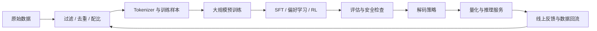

## 先把生命周期画完整

我最早整理 LLM 基础知识时，把发展历史、预训练数据和解码部署拆成了三篇。这样写适合逐章做笔记，却很容易让几个阶段失去联系：数据清洗为什么会影响后训练，分词器为什么会限制推理服务，量化究竟发生在训练还是部署阶段，也很难在一张图里看清。

这篇文章重新按模型生命周期组织这些内容。它不是训练手册，也不会追逐每个月变化一次的模型榜单。这里想回答的是一个更稳定的问题：**一批原始数据怎样变成可以被调用的模型，每个阶段又要做哪些决定。**

这条链并不是严格的单行道。评估失败会让团队回到数据和训练配方，线上反馈会进入下一轮后训练，部署限制也可能反过来改变模型尺寸、上下文长度和 tokenizer 的选择。所谓生命周期，重点就在这种前后约束，而不是把训练、推理和应用分别看成三套工程。

## 数据：模型首先学习的是数据分布

预训练通常把海量文本、代码或多模态序列整理成 token，再让模型预测下一个 token。目标函数看起来很简单，数据却决定了模型能看到什么语言、知识、代码风格和行为模式。参数规模再大，也无法补回训练分布里根本不存在的东西。

### 数据来源不是越多越好

常见来源包括网页、书籍、论文、代码、多语言语料和经过授权的业务数据。它们各有偏差：网页覆盖广，但模板、广告和重复内容很多；书籍和论文结构完整，却可能集中在少数领域；代码数据可执行、可验证，也会混入自动生成文件、许可证问题和安全缺陷。

数据清单列得再长，也替代不了数据混合。团队要先决定模型希望覆盖哪些语言和能力，再给各类数据分配采样权重。高质量的小数据可以被重复采样，体量很大的低质量来源反而需要降权。训练后期也可能提高代码、数学或目标领域数据的占比，但这种调度会改变能力分布，也可能带来遗忘。

### 清洗至少要守住四条线

1. **质量过滤**：处理乱码、模板页、关键词堆叠、异常符号比例和缺少语义内容的文本。规则、分类器和模型评分可以组合使用，但过滤器自身也会引入偏差。
2. **去重**：精确重复浪费计算，近似重复还会让模型记住固定表达。更麻烦的是训练集与评测集重叠，它会让评测结果看起来比真实能力好得多。
3. **安全与合规**：隐私、许可证、有害内容和来源记录不是训练结束后再补的说明。数据从进入管线开始就需要 provenance，知道它来自哪里、经过了哪些处理、能否删除。
4. **分布检查**：总 token 数并不能说明数据是否健康。语言比例、领域覆盖、文档长度、时间范围和不同来源的重复率都需要单独看。

[Deduplicating Training Data Makes Language Models Better](https://arxiv.org/abs/2107.06499) 讨论了重复数据对记忆与泛化的影响。近年的大规模数据工程仍在反复验证同一件事：过滤规则本身不是护城河，能够追踪数据、复现实验并根据评估结果重新配比，才是一条可用的数据管线。

### Tokenizer 是模型的一部分

Tokenizer 把字符串映射为离散 token ID。BPE、WordPiece、Unigram 等方法的细节不同，但都在处理同一组取舍：词表多大，常见片段是否能用较少 token 表示，罕见词和多语言文本会被切得多碎。

[BPE](https://arxiv.org/abs/1508.07909) 从字符或字节单元开始反复合并高频片段；[SentencePiece](https://arxiv.org/abs/1808.06226) 则提供了直接在原始文本上训练 BPE 或 Unigram tokenizer 的实现。实际系统里，比算法名字更重要的是下面几件事：

- tokenizer 必须和模型权重配套，随意更换会改变整个输入空间；
- 不同语言的 token 压缩率会直接影响可用上下文和推理成本；
- 特殊 token、聊天模板与工具调用格式要在训练和推理阶段保持一致；
- 数据清洗必须发生在 tokenization 前后两个视角，字符正常不代表 token 分布正常。

一个模型宣称支持很长的上下文，不代表每种语言都能放进同样多的信息。tokenizer 切得更碎，同一份材料就会更早占满窗口。这是数据工程和推理服务之间很容易被忽略的一条连接。

## 预训练：用简单目标消化复杂分布

今天常见的生成式 LLM 多采用 decoder-only Transformer。对于 token 序列 $x_1, x_2, \ldots, x_T$，模型学习条件概率：

$$
p(x_{1:T}) = \prod_{t=1}^{T} p(x_t \mid x_{<t})
$$

训练时最常见的目标是最小化下一个 token 的交叉熵。模型并没有被逐项教授“语法”“常识”或“编程”，而是在大量序列上压低预测误差。哪些能力最终形成，取决于架构、数据、计算预算和优化过程共同作用，不能简单归因于参数数量。

### Decoder-only 为什么成为主流

[Transformer](https://arxiv.org/abs/1706.03762) 用注意力机制替代循环结构，使序列计算更容易并行。decoder-only 模型使用因果掩码，每个位置只能看到它之前的 token，因此训练目标与生成时逐 token 解码天然一致。

这不意味着 encoder、encoder-decoder 或其他架构已经失去价值。检索编码、分类、翻译和多模态系统仍会使用不同结构。这里只是在讨论通用生成模型时，decoder-only 已经形成了最成熟的训练与推理生态。注意力和 Transformer 本身的推导可以参考[《自注意力机制与 Transformer 架构》](/blog/2024/11/14/self-attention-and-transformer-architecture/)。

### Scaling Law 是预算工具，不是智能公式

[Kaplan 等人的工作](https://arxiv.org/abs/2001.08361)展示了语言模型损失与参数量、数据量和计算量之间的经验幂律关系；[Chinchilla](https://arxiv.org/abs/2203.15556) 又说明，在固定计算预算下，模型参数与训练 token 需要更平衡地增长。相关推导与争议可以参考站内的[《Neural Scaling Laws：从 Kaplan 到 Chinchilla》](/blog/2026/01/26/neural-scaling-laws/)。

Scaling Law 的实际价值，是帮助团队估计“多给一倍计算，损失大概还能下降多少”“模型是不是太大、数据却没喂够”。它不保证某项能力会在某个参数规模突然出现，更不能直接推出通用智能。离散评测、提示模板和评分阈值也可能把连续提升表现成所谓的能力跃迁。

### 规模上去以后，训练变成系统工程

单张 GPU 无法容纳模型权重、梯度、优化器状态和激活值时，需要组合多种并行策略：

- 数据并行让多张卡处理不同 batch，再同步梯度；
- 张量并行把单层矩阵运算拆到多张卡；
- 流水线并行把不同层分到不同设备；
- ZeRO/FSDP 分片权重、梯度和优化器状态，减少每张卡的复制；
- 混合精度、激活重计算和 FlashAttention 一类内核优化，用数值精度或额外计算换显存与吞吐。

[Megatron-LM](https://arxiv.org/abs/1909.08053) 和 [ZeRO](https://arxiv.org/abs/1910.02054) 是理解这套工程分工的两个经典入口。进入真实训练后，还要处理数据断点、优化器状态恢复、梯度异常、loss spike、硬件故障和跨节点通信。模型能不能收敛，常常取决于这些不太上镜的细节。

## 后训练：把基座模型变成可使用的模型

预训练优化的是序列概率，并不会自动得到稳定的指令遵循、拒答边界和对话格式。后训练会使用监督数据、偏好数据或环境反馈，重新塑造模型面对用户请求时的行为。

常见路径包括持续预训练、监督微调（SFT）、参数高效微调（PEFT）、直接偏好优化和基于奖励的强化学习。它们解决的问题不同：持续预训练调整知识与领域分布，SFT 教模型模仿目标回答，偏好学习和 RL 则在多个可行回答之间改变模型的选择倾向。

这部分已经足够形成另一篇完整文章，详见[《大语言模型后训练与微调实践：从 SFT、LoRA 到人类对齐》](/blog/2024/11/01/llm-post-training-and-finetuning/)。这里保留这个入口，是为了提醒一件事：应用里看到的“模型能力”，通常是预训练能力与后训练行为共同作用的结果。

## 解码：同一组概率可以生成完全不同的文本

训练结束后，模型每一步都会给出下一个 token 的概率分布。解码器要做的，是从这个分布里选出一个 token，再把它放回上下文继续生成。模型权重没有变化，解码策略却足以显著改变输出的确定性、重复率和多样性。

### 确定性搜索

Greedy decoding 每一步都选择概率最高的 token。它快、可复现，适合分类标签、短答案和一些结构明确的任务，但局部最优不等于整段序列最优，也容易进入重复模式。

Beam search 同时保留若干条候选序列，比较累计概率后继续扩展。它在机器翻译等目标相对封闭的任务中很常见，但开放式对话并不总能从更高的序列概率中获益。beam 太大时，输出反而可能更保守、更相似。

### 概率采样

温度会重新缩放 logits。若原始 logits 为 $z_i$，温度为 $T$，采样概率为：

$$
p_i = \frac{\exp(z_i / T)}{\sum_j \exp(z_j / T)}
$$

$T$ 较低时分布更尖锐，输出更稳定；较高时低概率 token 获得更多机会，但错误和跑题也会增加。温度接近零通常按 greedy 处理，并不是一个适合直接代入公式的普通采样点。

Top-k 只在概率最高的 $k$ 个 token 中采样；Top-p（nucleus sampling）则选取累计概率达到阈值 $p$ 的最小候选集合。前者候选数固定，后者会随上下文变化。两者可以与温度组合，但参数越多不代表控制越精细，很多时候只是在同时扭动几个相互影响的旋钮。

[Transformers 的生成策略文档](https://huggingface.co/docs/transformers/main/en/generation_strategies)整理了常见解码方式。实际选型最好从任务出发：需要可复现的结构化字段，就降低随机性；需要多个创意候选，再提高采样多样性并在后面增加筛选。

### 停止、长度和重复控制

解码还有几组看似次要、线上却很常见的参数：

- `max_new_tokens` 控制最多生成多少 token，不能替代正确的停止条件；
- EOS 和 stop sequence 决定何时终止，聊天模板与工具协议必须和它们匹配；
- repetition penalty、frequency penalty 等机制可以抑制重复，但过强会破坏术语、代码和固定格式；
- 长度惩罚主要服务于候选序列比较，不适合被理解为“回答越长越好”。

提示词能要求模型输出 JSON，却不能保证每一个括号都合法。需要机器稳定消费结果时，应把解码阶段的语法约束纳入系统设计。受限解码与 JSON Schema 的实现见[《让 Agent 变得可行：大模型结构化输出与受限解码技术》](/blog/2026/03/01/structured-output-and-constrained-decoding/)。

## 部署：参数能装下，只是开始

推理时最直观的开销是模型权重。若参数量为 $N$，每个参数使用 $b$ bit，权重的理论存储量约为：

$$
M_{weights} = N \times \frac{b}{8}
$$

7B 参数在 FP16/BF16 下仅权重约为 14 GB，INT8 约为 7 GB，INT4 约为 3.5 GB。真实部署还需要 KV cache、临时张量、运行时缓冲区和框架开销。长上下文、高并发和较大的 batch 会让 KV cache 很快成为主要限制，所以“权重能塞进显存”并不等于服务跑得动。

### 量化：先问量化了什么

量化把权重或激活映射到更低精度表示。常见路线包括训练后量化（PTQ）和量化感知训练（QAT）。LLM 部署中更常见的是 PTQ，因为它不需要重新进行完整训练，但不同方法会在校准数据、分组方式、异常值处理和硬件内核上做不同取舍。

[LLM.int8()](https://arxiv.org/abs/2208.07339)、[GPTQ](https://arxiv.org/abs/2210.17323) 和 [AWQ](https://arxiv.org/abs/2306.00978) 分别代表了几条有影响力的低比特路线。量化效果必须在目标硬件和目标任务上评估：文件变小不一定带来同等比例的延迟下降，某种格式能加载也不代表推理内核真正加速。

QLoRA 容易被放错位置。[QLoRA](https://arxiv.org/abs/2305.14314) 的重点是把冻结的基座模型以 4 bit 形式存储，再训练高精度 LoRA 参数，从而降低微调显存。它是一种训练方案，不是通用的推理量化算法。训练结束后究竟以什么格式部署，还需要单独决定。

### 蒸馏与剪枝改变的是模型本身

蒸馏让较小的学生模型学习教师模型的输出、分布或推理轨迹。它可能降低推理成本，也可能把教师的错误和风格一起复制过去。剪枝则删除权重、通道、层或注意力头；非结构化稀疏只有在硬件和内核支持时才会转化为真实速度收益。[SparseGPT](https://arxiv.org/abs/2301.00774) 是 LLM 训练后剪枝的代表工作之一。

量化主要改变数值表示，蒸馏重新训练一个学生，剪枝减少模型结构或有效参数。三者都被叫作模型压缩，但工程路径并不相同。

### 推理服务还要看吞吐

线上服务还要处理 continuous batching、请求调度、KV cache 复用、prefill/decode 分离、并发隔离和失败恢复。输入 token 通常可以并行完成 prefill，输出 token 却必须逐步 decode，两者的计算形态不同。关于 KV cache 与 token 成本的关系，可以继续读[《为什么 Output Token 更贵：从 KV Cache 到 Agent 成本工程》](/blog/2026/04/26/output-token-pricing-kv-cache-agent-cost/)。

部署阶段最容易出现的误区，是只用离线准确率或单请求速度选方案。一个真实服务至少要同时测显存、首 token 延迟、每 token 延迟、并发吞吐、长上下文退化和输出质量。

## 用一张表回看整个生命周期

| 阶段 | 主要对象 | 需要做的决定 | 适合继续阅读 |
| --- | --- | --- | --- |
| 数据准备 | 文档、代码、元数据 | 来源、过滤、去重、许可、数据混合 | 本文“数据”部分 |
| Tokenization | 字符串与 token ID | 词表、语言覆盖、特殊 token、聊天模板 | [SentencePiece](https://arxiv.org/abs/1808.06226) |
| 预训练 | 模型参数与优化器 | 架构、数据/参数/算力配比、并行策略 | [Neural Scaling Laws](/blog/2026/01/26/neural-scaling-laws/) |
| 后训练 | 指令、偏好与环境反馈 | SFT、PEFT、偏好优化、RL、评估 | [后训练与微调实践](/blog/2024/11/01/llm-post-training-and-finetuning/) |
| Prompt 与上下文 | 当前请求和参考材料 | 指令、示例、上下文选择、输出契约 | [提示工程与上下文学习](/blog/2024/09/20/prompt-engineering-and-in-context-learning/) |
| 解码 | 下一个 token 的概率分布 | greedy、sampling、停止条件、语法约束 | [结构化输出与受限解码](/blog/2026/03/01/structured-output-and-constrained-decoding/) |
| 部署 | 权重、KV cache、请求队列 | 精度、量化、批处理、并发、硬件 | [KV Cache 与 Agent 成本](/blog/2026/04/26/output-token-pricing-kv-cache-agent-cost/) |

把这些阶段连起来以后，很多争论会简单一些。模型效果差，不一定该立刻换架构；它可能是数据分布、后训练目标、提示上下文或解码策略出了问题。部署成本高，也不一定只能量化；缩短输出、改善 batching 和减少无效上下文有时更直接。先判断问题发生在哪一层，再选择工具，这比追逐一个万能技术名词可靠得多。

## 参考资料

- [Attention Is All You Need](https://arxiv.org/abs/1706.03762)
- [Scaling Laws for Neural Language Models](https://arxiv.org/abs/2001.08361)
- [Training Compute-Optimal Large Language Models](https://arxiv.org/abs/2203.15556)
- [Efficient Large-Scale Language Model Training on GPU Clusters Using Megatron-LM](https://arxiv.org/abs/2104.04473)
- [ZeRO: Memory Optimizations Toward Training Trillion Parameter Models](https://arxiv.org/abs/1910.02054)
- [Deduplicating Training Data Makes Language Models Better](https://arxiv.org/abs/2107.06499)
- [QLoRA: Efficient Finetuning of Quantized LLMs](https://arxiv.org/abs/2305.14314)
