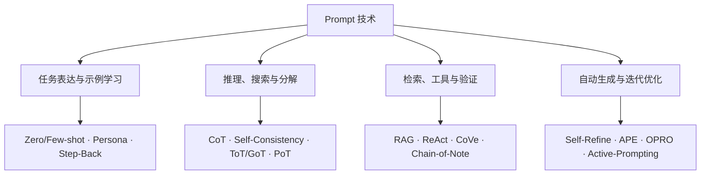

## Prompt 是接口，不是咒语

我以前把提示学习、提示工程综述和 Google 的实践指南分成了三篇。后来再看，三篇其实在讨论同一件事的不同切面：基础文章讲输入怎么写，综述收集了大量方法名，实践指南则告诉普通用户怎样把任务交代清楚。分开以后，基础、技术谱系和场景之间反而断了。

这篇文章从一个朴素判断开始：**Prompt 是模型当前推理过程的输入接口。** 它能改变模型看到的信息、任务表达和输出约束，却不会修改参数，也不会凭空补上模型没有学过的知识和能力。把这个边界想清楚，很多“提示技巧”就不再神秘。

一份可用的提示通常包含五类信息：

1. **任务**：模型要完成什么动作，成功标准是什么。
2. **输入**：本次要处理的数据、问题或材料。
3. **上下文**：完成任务所需的背景、参考文档和约束条件。
4. **示例**：希望模型模仿的输入输出关系。
5. **输出契约**：结果的格式、长度、字段、受众和不可做的事。

它们不需要每次全部出现。一个“把这句话翻译成英文”的请求，任务和输入已经够了；一份要交给程序消费的分析结果，则需要更明确的字段、类型和失败处理。提示词写得长不等于信息更充分，关键是每一段是否真的影响任务。

## 一份基础提示怎样写

Google 的 [Gemini for Workspace Prompting Guide](https://services.google.com/fh/files/misc/gemini_for_workspace_prompt_guide_october_2024_digital_final.pdf) 使用 Persona（角色）、Task、Context、Format 四个部分组织办公场景提示。这个框架很实用，但 Persona 并不是必须项；在不少任务里，明确受众、材料和判断标准，比要求模型“扮演顶级专家”更有用。

下面是一份更适合技术任务的骨架：

```text
任务：根据给定事故记录，整理一份故障复盘摘要。

输入：
<incident>
{{事故记录}}
</incident>

上下文与边界：
- 读者是参与值班的后端工程师。
- 只使用记录中出现的事实；无法确认的内容标记为“待核实”。
- 区分直接原因、促成因素和后续风险。

输出：
1. 事件时间线
2. 影响范围
3. 原因分析
4. 已完成和待完成的行动项
```

这里没有特殊口诀。标签用于分隔材料，项目符号把判断标准写清楚，输出部分让模型知道结果怎样被使用。如果记录很长，还要说明哪些字段最重要、允许引用哪些来源，以及材料不足时该怎样返回。

### 先写动作，再写修饰

“分析这份报告”仍然很宽。分析可以指概括、找风险、核对数字、比较版本，也可以是提出决策建议。更好的任务描述会使用具体动作：

- 提取报告中的三项关键假设，并引用对应段落；
- 比较两个方案的成本、依赖和失败模式；
- 找出结论与表格数据不一致的地方；
- 将原文改写给不了解背景的读者，不增加新事实。

动词越明确，后面的评估越容易。反过来，如果连人都说不清什么结果算好，继续堆角色、语气和“请认真思考”通常也救不了这个任务。

### 把材料和指令分开

长文档、用户输入、代码和网页内容最好放进明确的分隔区。这样既方便模型区分“要遵守的指令”和“要处理的数据”，也方便程序替换变量。

分隔符不是安全边界。外部材料可能包含与系统目标冲突的文字，真实应用仍需权限、内容过滤和 prompt injection 防护。提示结构只能减少歧义，不能代替系统层的信任边界。

### 输出格式要和下游一致

给人看的结果可以要求标题、表格或简短结论；交给程序的结果则应定义字段、类型、枚举和缺失值。仅在 prompt 中写“返回 JSON”仍可能产生不合法输出。对格式正确率有硬要求时，需要 JSON Schema、函数调用或受限解码，详见[《大模型结构化输出与受限解码技术》](/blog/2026/03/01/structured-output-and-constrained-decoding/)。

## 上下文学习：示例也是一种临时训练信号

上下文学习（In-Context Learning，ICL）是在不更新模型参数的情况下，通过当前上下文里的指令和示例让模型识别任务。只有任务描述时常被称为 zero-shot；加入一个或多个输入输出示例，则是 one-shot 或 few-shot。

它看起来像“现场教学”，但模型并没有真的完成梯度更新。示例只是当前序列的一部分，离开这次上下文后不会自动保留。这个特点让 ICL 很适合快速适配格式和标签，也让它受上下文长度、示例顺序和模型本身能力限制。

### 示例选择比示例数量重要

Few-shot 示例至少要同时满足三件事：

- 与真实输入使用相同字段和输出格式；
- 覆盖容易混淆的边界，而不只是最简单的正例；
- 答案本身正确，解释方式与最终任务一致。

如果做情感分类，只给三个明显正面样本，模型并没有学到讽刺、混合评价或中性陈述怎样处理。示例越多也会挤占真实输入的空间，并可能让模型机械模仿偶然细节。更稳的做法是从验证集里找失败类型，再补能区分这些类型的示例。

示例顺序同样会影响结果。标签分布、最近示例和表述形式都可能形成偏置。需要稳定性时，可以改变顺序重复评估，而不是只测试一个看起来不错的排列。

### RAG 不等于 Few-shot

Few-shot 示例告诉模型“这个任务怎样做”；RAG 检索到的文档通常告诉模型“这次回答应该依据什么事实”。两者都把信息放进上下文，但承担的角色不同。RAG 还包含切分、索引、检索、重排、引用和权限等工程问题，不能被压缩成“多放几段资料”。

上下文窗口也不是一个可以随意塞满的仓库。材料越多，相关信息越可能被噪声淹没。怎样选择、压缩、隔离和更新上下文，已经从单次 prompt 写作发展成独立的上下文工程问题，参见[《Context is All You Need：智能体的上下文工程》](/blog/2026/06/11/agent-context-engineering/)。

## 提示技术图谱：先按解决的问题分类

提示工程论文里有大量 `Chain-of-X`。有些方法提出了可复用结构，有些只在特定数据集和模型上成立，还有一些已经更接近推理系统或 Agent 框架。与其按缩写记忆，不如先问它试图改变什么。



### 任务表达与示例学习

这类方法主要改善任务如何被表示。Zero-shot 和 few-shot 决定是否给示例；role、场景、格式和分隔符减少语义歧义；Rephrase and Respond、Step-Back 等方法则先改写问题或抽象出高层原则，再处理具体请求。

它们最适合任务意图不够清楚、输入表述变化很大或输出形式不稳定的情况。若问题来自知识缺失、工具不可用或模型能力不足，继续润色同一段文字通常只会得到更流畅的错误。

### 推理、搜索与问题分解

[Chain-of-Thought](https://arxiv.org/abs/2201.11903) 在示例中加入中间推理步骤，让模型模仿从问题到答案的过程；[Zero-shot-CoT](https://arxiv.org/abs/2205.11916) 证明简单的逐步推理指令也可能改善部分任务。它们对数学、符号和多步推理有影响，但收益依赖模型、任务和评测方式。简单事实提取或固定分类不需要先生成一大段推理。

在产品中，我更关心可验证的中间产物，而不是要求模型展示一切“思考过程”。可以让模型列出使用了哪些证据、给出计算式、生成可运行代码或返回检查清单。这样既能帮助调试，也比一段听起来合理却无法核对的解释更有用。

[Self-Consistency](https://arxiv.org/abs/2203.11171) 对同一问题采样多条推理路径，再按最终答案聚合。它用额外推理成本换稳定性，适合答案可归一化、可以投票的任务。如果输出是开放式方案或长文，所谓“多数答案”往往很难定义。

[Tree of Thoughts](https://arxiv.org/abs/2305.10601) 和 [Graph of Thoughts](https://arxiv.org/abs/2308.09687) 把单条推理链扩展为搜索结构：生成候选、评价状态、保留或回退，再继续展开。这已经不只是写一句 prompt，而是在设计推理控制器。没有状态表示、评价函数和搜索预算，单纯要求模型“使用思维树”通常只会生成一篇树状说明。

[Program of Thoughts](https://arxiv.org/abs/2211.12588) 把计算交给程序解释器，[Chain of Draft](https://arxiv.org/abs/2502.18600) 则压缩中间步骤以降低 token 开销。它们分别提醒了两件事：可以验证的计算不必全靠语言模型心算，推理文本也不是越长越可靠。

### 检索、工具调用与结果验证

[RAG](https://arxiv.org/abs/2005.11401) 先检索外部材料，再基于材料生成回答；[ReAct](https://arxiv.org/abs/2210.03629) 让推理与行动交错进行，模型可以搜索、调用工具、读取结果后继续处理。这些方法减少了模型只靠参数记忆回答问题的压力，也引入了新的失败点：检索可能漏掉证据，工具可能返回错误，模型也可能错误解释观察结果。

[Chain-of-Verification](https://arxiv.org/abs/2309.11495) 让模型先起草答案，再生成验证问题并独立检查。它适合能拆成具体事实的回答，但“让同一个模型检查自己”并不自动等于独立证据。更可靠的验证来自原始文档、规则、测试、计算器或另一条不同的数据路径。

如果任务要求严格语法，验证最好发生在 token 生成过程中，而不是等整段文本写完后再祈祷解析成功。这就是受限解码与普通提示工程的分界。Prompt 描述意图，解码器保证语法，两者可以一起用，但不该互相冒充。

### 自动生成、迭代优化与自适应提示

[Self-Refine](https://arxiv.org/abs/2303.17651) 使用“生成—反馈—修改”的循环改进结果；[APE](https://arxiv.org/abs/2211.01910) 和 [OPRO](https://arxiv.org/abs/2309.03409) 则让模型生成候选指令，再用任务表现选择或迭代。Active-Prompting 会优先选择模型不确定的样本进行标注，Instance-adaptive Prompting 则为不同输入调整提示。

这类方法离不开评估集。只看一个案例，很容易把偶然输出当成提示改进。比较候选 prompt 时应固定模型和解码参数，在覆盖真实分布的数据上记录准确率、格式通过率、成本与失败类型。若没有可重复的评分，自动优化只是自动改写。

## 场景实践：从一轮生成变成可检查的工作流

Google 的指南覆盖行政、沟通、营销、项目管理和销售等场景。具体职业会变，写法背后的模式比较稳定：给材料，说明动作，定义受众和格式，再基于结果继续修改。下面只保留四类常见任务。

### 写作与总结

```text
任务：把下面的技术说明改写成发布说明。

读者：已经使用旧版本、但不了解内部实现的开发者。

要求：
- 先说明用户能观察到的变化，再说明迁移注意事项。
- 保留版本号、命令和兼容性限定。
- 不写“重大升级”“全面赋能”等宣传性结论。
- 控制在 400 字以内。

原始材料：
<source>
{{技术说明}}
</source>
```

设计重点不在“你是一名专业技术作家”，而在读者、保真要求和禁用表达。若原始材料缺少兼容性信息，模型应指出缺口，而不是自己补一条看起来合理的迁移建议。

### 信息提取与结构化结果

```text
从合同文本中提取以下字段：合同主体、生效日期、终止日期、自动续约、付款周期。

规则：
- 字段没有出现时返回 null。
- 日期统一为 YYYY-MM-DD；原文无法确定具体日期时保留原始表达。
- 每个非空字段附带原文证据。
- 不根据常见合同惯例推断。

返回字段：
parties, effective_date, termination_date, auto_renewal, payment_cycle, evidence
```

这类提示的关键是缺失值和证据，而不是一句“请准确提取”。如果结果直接进入数据库，还应使用 schema 校验和受限解码；Prompt 负责语义，程序负责拒绝不合法对象。

### 分析与规划

```text
根据提供的需求、人员和截止日期，生成一份两周实施计划。

先列出你从材料中确认的约束，再输出任务依赖图和每日计划。
不要假设未提供的人员可用性。若计划无法在截止日期内完成，指出最小缺口并给出两个调整方案。
```

规划任务最怕模型为了给出完整答案而悄悄补条件。让它先列约束、显式报告不可行之处，比要求“制定一份全面计划”可靠。复杂计划还需要日历、代码库、工单系统或求解器，不能只停在一段自然语言里。

### 多轮迭代

多轮对话适合逐步缩小问题，但不要依赖模型永远记得前面说过什么。每一轮修改都应明确保留项和变化项，例如：

```text
保留上一版的事实、引用和章节顺序，只修改下面三点：
1. 把开头缩短到两段。
2. 将第二节的示例替换为给定的新案例。
3. 删除没有来源的效果判断。

修改后附一份变更清单，不要改动其他部分。
```

当对话已经积累了大量废稿和互相冲突的要求，整理一份新的任务说明通常比继续追加一句“再改一下”更稳。这也是上下文工程里 compaction 和 reset 会成为正式操作的原因。

Google 官方英文手册可直接阅读 [Gemini for Workspace Prompting Guide](https://services.google.com/fh/files/misc/gemini_for_workspace_prompt_guide_october_2024_digital_final.pdf)。本站还保留了一份配套的 [Gemini 提示词双语手册](/assets/Gemini_Prompt.pdf)，适合快速查看原有场景示例。

## Prompt 解决什么，不解决什么

| 问题 | Prompt 能做什么 | 还需要什么 |
| --- | --- | --- |
| 任务理解不清 | 补充动作、边界、示例和成功标准 | 真实用户需求与评估样本 |
| 缺少当前事实 | 告诉模型只基于给定材料回答 | 检索、数据库、搜索与引用 |
| 复杂计算容易错 | 要求生成公式、代码或检查步骤 | 计算器、解释器、测试与验证器 |
| JSON 经常解析失败 | 描述字段、类型和缺失值 | Schema、函数调用或受限解码 |
| 长任务中遗忘约束 | 重述关键规则、压缩上下文 | Context management、memory、checkpoint |
| 模型根本不会任务 | 提供少量示例进行临时适配 | 更合适的模型、SFT、工具或流程重构 |

提示工程最舒服的位置，是把一个已有能力变成可调用、可评估的任务。它可以减少歧义，不能替代数据、训练、检索、工具和程序约束。知道什么时候该停止改 prompt，往往比再学一个缩写更重要。

## 方法索引

下面的表保留旧综述中出现的方法名，但不再给每项安排一个短小、重复的章节。很多方法有明确的任务边界，论文结果也依赖当时使用的模型与数据集。使用前先看原论文和代码，不要只凭名字判断它是否适合当前系统。

| 方法 | 类别 | 一句话定位 | 原始材料 |
| --- | --- | --- | --- |
| Zero-shot / Few-shot | 基础表达 | 通过任务描述或少量示例让模型识别新任务 | [GPT-3](https://arxiv.org/abs/2005.14165) |
| Chain-of-Thought（CoT） | 推理 | 在示例中加入中间推理步骤 | [Wei et al.](https://arxiv.org/abs/2201.11903) |
| Zero-shot-CoT | 推理 | 用简单的逐步推理指令触发中间步骤 | [Kojima et al.](https://arxiv.org/abs/2205.11916) |
| Auto-CoT | 自动优化 | 聚类问题并自动生成 CoT 示例 | [Zhang et al.](https://arxiv.org/abs/2210.03493) |
| Self-Consistency | 推理与解码 | 采样多条推理路径后聚合答案 | [Wang et al.](https://arxiv.org/abs/2203.11171) |
| LogiCoT | 训练与推理 | 通过 instruction tuning 学习逻辑 CoT，并加入检查过程 | [Zhao et al.](https://arxiv.org/abs/2305.12147) |
| Chain-of-Symbol（CoS） | 推理 | 用紧凑符号表示空间关系与规划步骤 | [Hu et al.](https://arxiv.org/abs/2305.10276) |
| Tree of Thoughts（ToT） | 搜索 | 在树结构中生成、评价和回退候选思路 | [Yao et al.](https://arxiv.org/abs/2305.10601) |
| Graph of Thoughts（GoT） | 搜索 | 用图结构组合、聚合和改进中间思路 | [Besta et al.](https://arxiv.org/abs/2308.09687) |
| System 2 Attention（S2A） | 上下文处理 | 先重写上下文，减少无关信息对回答的影响 | [Weston & Sukhbaatar](https://arxiv.org/abs/2311.11829) |
| Thread of Thought（ThoT） | 上下文处理 | 对冗长或混乱上下文分段总结后再回答 | [Zhou et al.](https://arxiv.org/abs/2311.08734) |
| Chain-of-Table | 专用推理 | 通过连续表格操作完成表格问答 | [Wang et al.](https://arxiv.org/abs/2401.04398) |
| Self-Refine | 自动优化 | 使用模型生成的反馈循环修改初稿 | [Madaan et al.](https://arxiv.org/abs/2303.17651) |
| Code Prompting | 推理表示 | 把自然语言问题改写为代码形式以辅助条件推理 | [Madaan et al.](https://arxiv.org/abs/2401.10065) |
| ECHO | 自动优化 | 聚类并反复协调自动生成的 CoT 示例 | [Self-Harmonized CoT](https://arxiv.org/abs/2409.04057) |
| Instance-adaptive Prompting（IAP） | 自适应 | 根据当前实例选择或重组 zero-shot CoT 提示 | [Zhang et al.](https://arxiv.org/abs/2409.20441) |
| Layer-of-Thoughts（LoT） | 专用检索 | 用约束层级组织法律检索中的候选筛选 | [Choi et al.](https://arxiv.org/abs/2410.12153) |
| Narrative-of-Thought（NoT） | 专用推理 | 用叙事结构与程序表示处理时间推理 | [Kim et al.](https://arxiv.org/abs/2410.17607) |
| Buffer of Thoughts（BoT） | 推理复用 | 保存并检索可复用的高层思维模板 | [Yang et al.](https://arxiv.org/abs/2406.04271) |
| CD-CoT | 鲁棒推理 | 对带噪 CoT 示例进行改写、选择和投票 | [Zhou et al.](https://arxiv.org/abs/2410.23856) |
| Chain of Draft（CoD） | 高效推理 | 用极短中间步骤降低推理 token 与延迟 | [Xu et al.](https://arxiv.org/abs/2502.18600) |
| Retrieval-Augmented Generation（RAG） | 检索 | 检索外部证据后再生成答案 | [Lewis et al.](https://arxiv.org/abs/2005.11401) |
| ReAct | 工具调用 | 让推理、行动和环境观察交错进行 | [Yao et al.](https://arxiv.org/abs/2210.03629) |
| Chain-of-Verification（CoVe） | 验证 | 为初稿生成验证问题并独立回答 | [Dhuliawala et al.](https://arxiv.org/abs/2309.11495) |
| Chain-of-Note（CoN） | 检索与验证 | 为检索文档生成笔记，过滤无关或冲突材料 | [Yu et al.](https://arxiv.org/abs/2311.09210) |
| Chain-of-Knowledge（CoK） | 知识整合 | 分阶段准备、获取并适配外部知识 | [Li et al.](https://arxiv.org/abs/2305.13269) |
| Scratchpad Prompting | 推理 | 在最终答案前生成任意中间计算字符 | [Nye et al.](https://arxiv.org/abs/2112.00114) |
| Program of Thoughts（PoT） | 工具与推理 | 用程序表达计算，并交给解释器执行 | [Chen et al.](https://arxiv.org/abs/2211.12588) |
| Structured CoT（SCoT） | 代码生成 | 按顺序、分支和循环结构规划代码 | [Li et al.](https://arxiv.org/abs/2305.06599) |
| Chain of Code（CoC） | 代码推理 | 生成伪代码，并用语言模型增强的解释器执行 | [Li et al.](https://arxiv.org/abs/2312.04474) |
| Active-Prompting | 自动优化 | 优先选择模型最不确定的问题进行 CoT 标注 | [Diao et al.](https://arxiv.org/abs/2302.12246) |
| Automatic Prompt Engineer（APE） | 自动优化 | 生成候选指令并按任务表现搜索提示 | [Zhou et al.](https://arxiv.org/abs/2211.01910) |
| Automatic Reasoning and Tool-use（ART） | 工具调用 | 从任务库检索示例并自动组合推理与工具步骤 | [Paranjape et al.](https://arxiv.org/abs/2303.09014) |
| Contrastive CoT（CCoT） | 示例学习 | 同时提供正确与错误推理作为对比示例 | [Chia et al.](https://arxiv.org/abs/2311.09277) |
| EmotionPrompt | 任务表达 | 在提示中加入情绪刺激语句并测量任务表现 | [Li et al.](https://arxiv.org/abs/2307.11760) |
| Optimization by PROmpting（OPRO） | 自动优化 | 让 LLM 根据历史候选与得分继续提出解 | [Yang et al.](https://arxiv.org/abs/2309.03409) |
| Rephrase and Respond（RaR） | 任务表达 | 先改写和扩展问题，再生成最终回答 | [Deng et al.](https://arxiv.org/abs/2311.04205) |
| Step-Back Prompting | 任务表达 | 先抽象高层概念和原则，再处理具体实例 | [Zheng et al.](https://arxiv.org/abs/2310.06117) |

## 参考资料

- [The Prompt Report: A Systematic Survey of Prompting Techniques](https://arxiv.org/abs/2406.06608)
- [A Systematic Survey of Prompt Engineering in Large Language Models](https://arxiv.org/abs/2402.07927)
- [Gemini for Workspace Prompting Guide](https://services.google.com/fh/files/misc/gemini_for_workspace_prompt_guide_october_2024_digital_final.pdf)
- [Language Models are Few-Shot Learners](https://arxiv.org/abs/2005.14165)
- [Chain-of-Thought Prompting Elicits Reasoning in Large Language Models](https://arxiv.org/abs/2201.11903)

这些方法里，有些已经成为通用工程组件，有些仍是特定论文里的实验设计。技术目录的作用是帮助定位，不是暗示所有方法都应该进入同一条 prompt。面对具体任务，先从清楚的任务、可靠的上下文和可执行的验证开始，通常已经能解决大部分问题。
