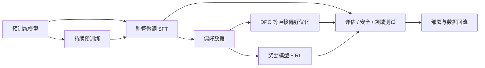

## 后训练不是一个算法名

预训练结束时，我们得到的是一个擅长预测下一个 token 的基座模型。它可能掌握了大量语言与代码模式，却不一定会按用户期待的方式回答：格式不稳定，任务边界模糊，遇到冲突指令时也未必知道该优先遵守什么。后训练要做的，是用更小、更有目标的数据重新塑造这种行为。

我早期把指令微调、人类对齐、显存估算、数据格式和框架选择分成了两篇。问题是，训练方法和工程条件被拆开以后，很容易出现一些奇怪结论：只讨论 LoRA 不讨论激活值，只比较数据格式却不看 chat template，或者把 QLoRA 当成部署量化。现在把它们放回同一条链里看。



这几条路线改变的对象并不相同：

- **持续预训练**继续学习领域文本分布，适合补语言、知识和代码风格；
- **SFT**模仿高质量输入输出对，建立指令遵循、格式和任务行为；
- **PEFT**决定哪些参数参与更新，是训练资源方案，不是独立的数据目标；
- **偏好优化**比较多个回答，让模型更倾向于被选择的行为；
- **强化学习**把奖励或环境反馈转成策略更新，适合可交互、可验证或需要探索的问题。

后训练没有固定流水线。一个领域补全模型可能只需要持续预训练，一个分类器可能只做 SFT，Agent 则可能依次使用 SFT 轨迹和环境奖励。先确认要改变什么行为，再决定数据与算法，顺序不能反过来。

## 数据工程：先定义训练对象

训练脚本最后看到的是 token 序列和 loss mask，团队日常维护的却应该是结构化样本。比较常见的对象有三类。

### 持续预训练文本

持续预训练通常保留自然文本或代码的连续结构：

```json
{"text": "领域文档、代码或其他连续语料……"}
```

这类数据没有天然的 instruction 和 answer。训练目标仍然是预测下一个 token，因此它更接近预训练，只是数据分布和计算规模更集中。若目标是教模型稳定遵守某个输出格式，单靠持续预训练通常不够直接。

### 指令与单轮样本

Alpaca 风格常用 `instruction`、`input`、`output` 表示单轮任务：

```json
{
  "instruction": "找出日志中的直接故障原因",
  "input": "{{日志内容}}",
  "output": "连接池耗尽导致请求持续排队。"
}
```

它适合数据制作和人工审阅，但这些字段不是模型最终读取的格式。训练前仍要把它们渲染成目标模型的 token 序列。

### 多轮消息

现代对话数据通常使用消息数组：

```json
{
  "messages": [
    {"role": "system", "content": "只依据给定材料回答。"},
    {"role": "user", "content": "这次故障影响了哪些服务？"},
    {"role": "assistant", "content": "记录确认支付和订单查询受到影响。"}
  ]
}
```

ChatML、ShareGPT、Alpaca 是常见约定，不是跨模型统一标准。ShareGPT 常用 `conversations/from/value`，消息格式常用 `messages/role/content`，不同训练框架还会接受自己的列名。数据进入 tokenizer 前，应先转换成内部统一 schema，再由模型对应的 chat template 渲染。

### Chat template 决定模型实际看到什么

Chat template 会把角色、消息和特殊 token 拼成模型训练时使用的字符串。下面两个消息对象语义相同，经过不同 tokenizer 后可能得到完全不同的起止符和 role token。模板不匹配时，模型会看到训练阶段从未见过的控制符，表现往往比数据内容本身的问题更隐蔽。

Hugging Face 的 [Chat Templates](https://huggingface.co/docs/transformers/main/en/chat_templating) 文档给出了 `apply_chat_template` 的使用方式。训练和推理应复用同一个模板，并明确是否添加 generation prompt、EOS 放在哪里、工具消息怎样编码。不要手工猜一个“看起来像该模型”的格式。

### Loss mask 决定模型模仿谁

一段对话可以对所有 token 计算 loss，也可以只训练 assistant 回复。后者常被称为 response-only 或 assistant-only loss：system 和 user token 仍作为条件输入，却不要求模型去预测它们。

这里没有对所有任务都正确的答案。只训练 assistant 更符合“根据请求生成回答”的目标，也能避免模型浪费容量复述用户；对某些需要学习完整交互结构或特殊控制 token 的训练，团队也可能保留更多位置的 loss。重要的是把 mask 明确记录下来。两份文本完全相同的数据，只要 loss mask 不同，训练目标就已经不同。

### Packing 提高利用率，也改变样本边界

大量短样本如果逐条 padding，会浪费很大一部分计算。Packing 把多条样本拼进同一序列，提高有效 token 比例。实现时要确认注意力是否允许跨样本、位置 ID 怎样处理、EOS 是否正确插入，以及 loss mask 是否在边界处错位。

Packing 是吞吐优化，不该改变数据语义。若训练后出现模型把上一条答案接到下一条问题上的现象，先检查样本边界和模板，而不是立刻调学习率。

### 高质量不是一个模型评分

后训练数据至少要检查：

- 指令是否可执行，输入是否包含完成任务所需的信息；
- 回答是否正确、完整，并符合希望模型学习的风格；
- 多轮对话中角色、工具调用和环境状态是否前后一致；
- 是否混入评测集、模板泄漏、错误引用和无法复现的外部状态；
- 数据来源、生成模型、过滤规则和修改历史能否追踪。

合成数据降低了写样本的成本，也更容易规模化复制同一种错误。更完整的数据合成流程见[《数据合成正在成为一门工程：从 Terminal-Corpus 说起》](/blog/2026/07/03/2026-07-03-sft-synthetic-data-engineering/)。那篇文章讨论的是怎样从任务世界、环境和 verifier 反推训练数据；这里关心的是数据进入训练器后怎样被编码和计算 loss。

## 显存估算：先拆账，再谈能不能训练

“7B 模型需要多少显存”没有脱离配置的固定答案。全参数还是 LoRA、权重精度、优化器、序列长度、batch size、是否保存 master weights、是否使用 checkpointing 和分片，都会改变结果。比较稳的做法是先把显存拆成几本账。

### 权重

参数量为 $N$、存储精度为 $b$ bit 时，权重的理论大小为：

$$
M_{weights} = N \times \frac{b}{8}
$$

7B 参数使用 BF16/FP16 时约为 14 GB，INT8 约 7 GB，4 bit 约 3.5 GB。这只是参数数据本身，量化 scale、zero point、分组元数据和运行时缓冲会增加额外占用。

### 梯度与优化器状态

如果可训练参数量为 $P$，梯度显存近似为：

$$
M_{grad} = P \times bytes_{grad}
$$

AdamW 通常为每个可训练参数保存一阶和二阶矩，若两者都用 FP32，仅这部分就是 $8P$ bytes。有些混合精度实现还会保留 FP32 master weights，再增加 $4P$ bytes。框架、优化器和分片策略不同，不能把某个“每参数固定字节数”当成通用常量。

以 7B 全参数 BF16 训练为例，不考虑分片与激活：权重约 14 GB，BF16 梯度约 14 GB，两份 FP32 Adam 状态约 56 GB；若另存 FP32 master weights，再增加约 28 GB。也就是说，光这些状态就可能是 84 GB 或 112 GB，激活值、通信缓冲和 CUDA workspace 还没开始算。

LoRA 的差别在这里很明显：基座权重仍需加载，但只有低秩参数参与梯度和优化器更新，因此 $P \ll N$。不过“梯度和优化器变小”不代表激活值消失，长序列和大 batch 仍可能把显存吃满。

### 激活值

激活值与 batch size、序列长度、隐藏维度、层数、注意力实现和保存哪些中间结果有关。它不会由参数量单独决定，也很难用一个固定系数跨架构估算。

实践中常用这些手段控制激活显存：

- gradient checkpointing 不保存全部中间结果，反向传播时重新计算；
- FlashAttention 一类实现减少注意力中间矩阵的物化；
- sequence packing 提高有效 token 比例，但总 token 增加后激活也会增加；
- gradient accumulation 用多次小 micro-batch 模拟较大的有效 batch；
- 缩短序列长度通常比微调几个 LoRA rank 更直接地降低激活开销。

### 分片与框架开销

FSDP、ZeRO 会把参数、梯度和优化器状态分片到多张卡。它们降低单卡占用，却增加通信、调度和配置复杂度。CUDA context、kernel workspace、临时张量、dataloader 预取和显存碎片也需要留余量。

所以显存估算应该写成区间，并通过一次目标配置的短跑验证。能够完成 forward/backward 还不够，要观察峰值显存、吞吐、是否频繁 offload，以及保存 checkpoint 时会不会再次 OOM。

## SFT：让模型模仿目标行为

监督微调使用输入和目标输出计算交叉熵，让模型提高目标 token 的概率。[InstructGPT](https://arxiv.org/abs/2203.02155)、[FLAN](https://arxiv.org/abs/2109.01652) 和 [Self-Instruct](https://arxiv.org/abs/2212.10560) 分别展示了人工指令、任务混合与合成指令在 instruction tuning 中的作用。

SFT 最适合学习可示范的行为：回答结构、工具调用轨迹、领域术语、拒答方式、代码修改模式和对话风格。它不保证把训练样本里的事实可靠写进模型，也不能让模型稳定完成基座模型完全不会的任务。若训练数据本身在猜，模型只会更熟练地模仿这种猜法。

### 学习率、batch 和 epoch 没有脱离数据的答案

后训练通常使用比预训练更低的学习率，但具体范围受模型规模、全参数/PEFT、数据量、优化器和目标任务影响。比背一组默认参数更有用的是观察：

- 训练 loss 是否下降而验证任务没有改善；
- 模型是否快速丢失原有通用能力；
- 少数模板是否占据输出，造成风格坍缩；
- 长回答和短回答是否因为 token 数差异获得不同权重；
- 多个数据源混合后，哪一类样本主导了梯度。

小数据重复多个 epoch 很容易过拟合。数据规模大时，训练一部分 epoch 也可能足够。最终选择应由留出的任务集、格式通过率和回归测试决定，而不是只看训练 loss。

## PEFT：减少更新参数，不改变训练目标

参数高效微调（PEFT）冻结大部分基座参数，只训练少量附加参数或被选择的参数。它降低梯度和优化器状态的显存，也方便为多个任务分别保存 adapter。更完整的技术谱系见[《参数高效微调（PEFT）：从 Adapter 到 LoRA 的技术演进》](/blog/2026/03/05/peft-parameter-efficient-fine-tuning/)。

### LoRA

[LoRA](https://arxiv.org/abs/2106.09685) 假设下游适配所需的权重更新具有较低的内在秩。对于原始权重 $W_0$，它冻结 $W_0$，用两个低秩矩阵表示更新：

$$
W = W_0 + \Delta W, \qquad \Delta W = BA
$$

若 $W_0 \in \mathbb{R}^{d_{out} \times d_{in}}$，秩为 $r$，则 $A \in \mathbb{R}^{r \times d_{in}}$、$B \in \mathbb{R}^{d_{out} \times r}$。当 $r$ 远小于输入输出维度时，可训练参数显著减少。

LoRA 的主要决策包括 target modules、rank、alpha、dropout，以及是否训练 embedding、lm head 或 bias。只写“使用 LoRA”仍然缺少足够信息。对注意力投影加 adapter 和对所有线性层加 adapter，参数量与效果可能差很多。

Adapter 可以在推理前合并进基座权重，也可以保持独立加载。合并后通常不会增加额外矩阵计算，但失去运行时切换多个 adapter 的便利；不合并则更灵活，也需要推理框架正确支持。

### QLoRA

[QLoRA](https://arxiv.org/abs/2305.14314) 把冻结的基座权重以 4 bit 形式存储和计算，同时训练较高精度的 LoRA 参数。它进一步压低权重显存，但训练时仍需反量化计算、激活值和 LoRA 优化器状态。

QLoRA 不是“用 INT4 训练全部参数”，也不是部署量化格式的统称。它解决的是低资源微调；训练完成后要不要合并 adapter、用什么精度导出、目标服务是否支持对应量化内核，仍是另一组决定。

### Adapter 和参数选择

经典 adapter 在 Transformer 层中插入小型瓶颈网络；prompt tuning、prefix tuning 则训练连续向量，把可学习信息放进输入或注意力前缀。另一类方法直接选择部分层或参数更新。它们都在减少 $P$，但插入位置、推理开销和多任务组合方式不同。

PEFT 节省的是训练状态，不会自动修复数据问题。若 full fine-tuning 学不到目标行为，换成 LoRA 通常也不会凭空解决；反过来，任务只需要轻量行为适配时，全参数更新可能只是增加成本和遗忘风险。

## 框架选择：按职责组合，而不是选一个万能框架

微调工具经常被放在同一张排名表里，但它们处在不同层。比较它们之前，先看各自负责什么。

| 组件 | 主要职责 | 官方入口 |
| --- | --- | --- |
| Transformers | 模型、tokenizer、chat template、训练基础接口 | [Transformers](https://huggingface.co/docs/transformers/main/en/training) |
| Datasets | 数据加载、映射、流式处理与缓存 | [Datasets](https://huggingface.co/docs/datasets) |
| PEFT | LoRA、IA3、prompt/prefix tuning 等参数高效方法 | [PEFT](https://huggingface.co/docs/peft) |
| TRL | SFT、DPO、奖励模型、PPO/GRPO 等后训练器 | [TRL](https://huggingface.co/docs/trl) |
| Accelerate | 单机多卡、混合精度和分布式启动 | [Accelerate](https://huggingface.co/docs/accelerate) |
| PyTorch FSDP | 参数、梯度和优化器状态分片 | [FSDP](https://docs.pytorch.org/docs/stable/fsdp.html) |
| DeepSpeed | ZeRO、offload、并行训练与推理组件 | [ZeRO](https://www.deepspeed.ai/tutorials/zero/) |
| Unsloth | 针对常见模型与 LoRA/RL 工作流的性能优化封装 | [Unsloth Docs](https://docs.unsloth.ai/) |

一个常见组合是 Transformers 负责模型和 tokenizer，Datasets 负责数据，PEFT 注入 LoRA，TRL 提供 SFTTrainer 或偏好训练器，再由 Accelerate、FSDP 或 DeepSpeed 处理设备和分片。Unsloth 会在这套生态上提供优化过的模型加载、kernel 和训练入口。

选择框架时要看目标模型是否支持、chat template 是否正确、训练器是否能表达 loss mask 和 packing、分布式 checkpoint 能否恢复，以及最终权重能否被部署框架读取。API 写得短只是体验的一部分。遇到新模型和特殊 loss 时，抽象层越高，越需要准备回到底层确认它究竟做了什么。

### Base 还是已经 instruction-tuned 的模型

Base 模型保留更原始的预训练分布，适合拥有足够数据、希望重新定义交互行为的团队；instruction-tuned 模型已经具备对话和指令遵循，少量领域数据通常更容易得到可用结果，也可能继承原有模板、拒答和风格偏好。

不存在“超过多少条数据就必须选 Base”的通用阈值。更实际的做法是用同一批验证任务比较两个起点：若 instruction 模型已经会任务，只需补领域行为，继续微调它通常更省；若原有对齐严重干扰目标格式或语言分布，再评估 Base 模型与更完整的数据配方。

## 人类对齐：从模仿答案到比较行为

SFT 数据告诉模型“这里有一个目标回答”。偏好数据则给出同一 prompt 下的多个回答及其相对选择，让训练目标从模仿单一答案变成调整回答之间的概率关系。

### 经典 RLHF

[InstructGPT](https://arxiv.org/abs/2203.02155) 中常被引用的流程包括三个阶段：

1. 用人工示范做 SFT，得到可以遵循指令的初始策略；
2. 对多个模型回答进行排序，训练奖励模型；
3. 使用 PPO 优化策略，使回答获得更高奖励，同时用 KL 约束避免策略偏离参考模型过远。

奖励模型不是“人类价值观函数”。它学习的是特定标注规范、样本和模型分布下的偏好代理。策略持续针对它优化时，可能利用奖励漏洞，因此需要保留人工评估、独立任务集和行为约束。

PPO 的难点也不只在算法公式。生成样本、计算奖励、估计 advantage、训练 value model、控制 KL、处理长度偏差和维持多机吞吐，都会让系统复杂起来。关于 reward、baseline、advantage 和 normalization 的完整讨论，见[《LLM 对齐中的强化学习：从奖励信号到优势估计》](/blog/2026/03/16/rl-alignment-from-reward-to-advantage/)。

### 直接偏好优化

[DPO](https://arxiv.org/abs/2305.18290) 把偏好建模改写成直接优化策略与参考模型的目标，不需要单独训练奖励模型并运行在线 PPO。它让偏好训练更接近普通监督学习，但并没有消除数据问题：chosen/rejected 的差异是否表达了标注者想要的偏好、回答长度是否形成捷径、训练分布是否覆盖上线请求，仍然决定最终效果。

DPO、KTO、ORPO 等名称会继续增加。阅读这些方法时，可以先问三个问题：使用什么反馈数据，参考模型或隐式奖励怎样进入 loss，训练是离线比较还是需要在线采样。这样比按“是不是 RL”简单分组更容易看出工程差异。

### SFT、偏好优化和 RL 怎样分工

- 有明确标准答案或示范轨迹时，先做 SFT；
- 多个回答都可用，但需要学习风格、安全性或质量排序时，使用偏好数据；
- 奖励来自环境、测试或交互结果，并且需要探索不同策略时，再考虑在线 RL；
- 无论采用哪种算法，都要保留独立评估，防止只对训练信号变得更熟练。

不少项目太早进入复杂偏好训练，实际问题却是 SFT 数据格式错、chat template 不一致或评估集太弱。后训练方法越复杂，越应该先证明前一阶段已经稳定。

## 一份实施检查表

| 问题 | 需要记录的决定 |
| --- | --- |
| 目标 | 希望改变哪类行为，哪些能力必须保持不退化 |
| 基座 | Base 还是 instruction model，许可证与 tokenizer 是否匹配 |
| 数据 | schema、来源、比例、去重、质量门和评估集怎样定义 |
| 模板 | chat template、特殊 token、EOS 和工具消息如何编码 |
| Loss | 哪些 token 计算 loss，长短样本怎样加权 |
| 训练 | full/LoRA/QLoRA，target modules、精度、batch、序列长度 |
| 显存 | 权重、梯度、优化器、激活、分片和余量分别是多少 |
| 评估 | 任务质量、格式通过率、安全性、回归、延迟和成本 |
| 导出 | adapter 是否合并，最终精度与部署框架是否兼容 |
| 回滚 | checkpoint、数据版本和训练配置能否完整复现 |

后训练经常被描述成选择一个框架、准备一份 JSONL、启动训练。实际结果取决于目标、数据、模板、loss、资源和评估是否彼此一致。LoRA 可以减少参数更新，不能替你定义任务；RLHF 可以使用偏好信号，也不能把不可靠标注变成可靠价值观。

如果只保留一个工作顺序，我会选：先写评估，再整理数据；先跑通 SFT，再决定是否需要偏好优化；先拆显存账，再选择框架。这样做不够花哨，但能让大部分失败更早暴露。

## 参考资料

- [Training Language Models to Follow Instructions with Human Feedback](https://arxiv.org/abs/2203.02155)
- [LoRA: Low-Rank Adaptation of Large Language Models](https://arxiv.org/abs/2106.09685)
- [QLoRA: Efficient Finetuning of Quantized LLMs](https://arxiv.org/abs/2305.14314)
- [Direct Preference Optimization: Your Language Model is Secretly a Reward Model](https://arxiv.org/abs/2305.18290)
- [Self-Instruct: Aligning Language Models with Self-Generated Instructions](https://arxiv.org/abs/2212.10560)
- [Finetuned Language Models Are Zero-Shot Learners](https://arxiv.org/abs/2109.01652)
