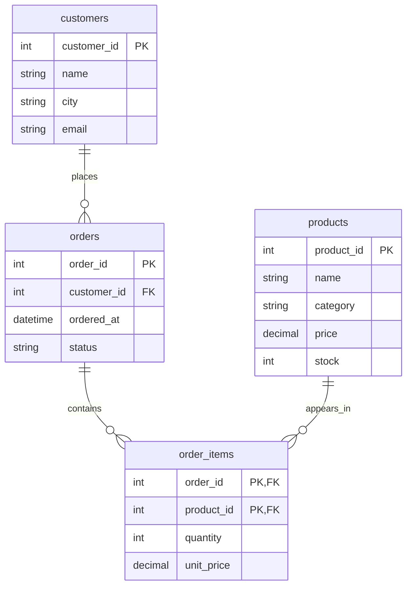

后端能接住请求以后，数据还得有地方保存。先把客户和订单放进 Python 列表，或者写成一个 JSON 文件，当然可以跑通：收到订单就追加一条，查询时再把文件读回来。如何让这件事情变得更加高效和稳定，这就是数据库希望解决的问题了。

这些问题比“怎样把数据写到磁盘”多了一层。我们需要知道哪些信息属于同一个对象，哪些信息可以重复，哪些关系必须始终成立。这一篇从一个小型订单系统出发，先把数据怎样组织想清楚。具体 SQL 写法放在配套的[《SQL 基础：查询、聚合、JOIN 与窗口函数》](/blog/2024/07/29/sql-learning-notes/)里。

## 文件能保存数据，数据库还要管理规则

**数据库（database）** 是按一定结构组织的数据；**数据库管理系统（DBMS）** 是管理这些数据的软件。我们保存的订单数据属于数据库，MySQL 则是一种 DBMS。数据库不只有关系型这一种模型，文档、键值和图模型也各有用途；这里先讨论使用表来组织数据的关系型数据库。

文件并不是不能做这些事情，只是规则需要我们自己实现。多个文件复制同一份客户资料，会带来冗余和不一致；每次查询都写遍历代码，会让数据访问越来越复杂；多个请求同时修改文件，还要协调谁先写、写到一半失败怎么办。DBMS 提供查询、约束、事务、并发控制和权限等机制，让程序有一个共同的数据管理入口。

这里也有几个不同的观察层次。业务代码关心表里有哪些字段及联系，这是逻辑结构；数据库怎样安排磁盘页面和访问路径，是物理实现；某个用户只能看到自己的订单，则涉及对外视图和权限。客户端发出 SQL，数据库服务器处理请求，管理员负责配置、权限与维护。我们先学习逻辑层，后面再进入索引和事务的内部实现。

## 一个订单系统的例子

假设一个客户可以下多张订单，一张订单可以包含多种商品。同一种商品在同一张订单中合并成一条明细，用数量表示买了几件。先把这些事实写成四张表的轮廓：

| 表 | 每一行代表什么 | 主要字段 |
| --- | --- | --- |
| `customers` | 一个客户 | `customer_id`、`name`、`city`、`email` |
| `products` | 一种商品 | `product_id`、`name`、`category`、`price`、`stock` |
| `orders` | 一张订单 | `order_id`、`customer_id`、`ordered_at`、`status` |
| `order_items` | 某张订单中的一种商品 | `order_id`、`product_id`、`quantity`、`unit_price` |

比如客户 1 下了订单 1001，买了一把键盘和两个鼠标。`orders` 只需要一行记录“客户 1 的订单 1001”；`order_items` 用两行记录买了哪些商品。客户叫什么由 `customers` 保存，商品现在卖多少钱由 `products` 保存，不必全部重复写在订单里。

注意“每行代表什么”要先于字段列表。假如一行有时代表订单、有时又代表商品明细，后面很难给它选择稳定的主键，也很难解释一条查询究竟在数什么，确定一个表中一行内容的语义然后选取他的主键是构建一个数据库过程中很关键的问题。

## 关系模型中的几个词，对应到表上怎样理解

在关系模型中，一张表的结构可以看作**关系模式（relation schema）**；某个时刻符合这个结构的整组元组，是**关系实例（relation instance）**。关系实例不是其中的一行。单行对应**元组（tuple）**，列对应**属性（attribute）**，属性允许的取值集合叫作**域（domain）**。

比如 `products(product_id, name, category, price, stock)` 描述模式；四种商品的全部记录构成一个实例；其中“键盘”那一行是一个元组。价格列的域不只是“看起来像数字”，还包括我们选择的类型与业务限制，比如非负的金额。

理论中的关系是元组的集合，没有重复元组，也没有行顺序。实际 SQL 表和查询结果并不自动满足这些特点：没有约束时可以保存重复行，普通 `SELECT` 通常保留重复结果，最终顺序需要 `ORDER BY` 明确指定。后面学习 `DISTINCT`、`UNION ALL` 和排序时，要记住模型与实现之间的这点差别。

关系运算也可以先用日常查询理解。筛出库存大于零的商品，是选择；只取商品名与价格，是投影；把订单和客户信息按 ID 接起来，是连接；两个查询结果还可以做并、交、差。关系运算的结果仍然是关系，所以这些操作能够组合。SQL 是表达这种数据需求的语言，数据库再决定具体怎样执行。

SQL 还引入了 `NULL` 来表示缺失或未知的信息。它不是数字零，也不是空字符串；比较结果可能是 UNKNOWN。这套三值逻辑会影响筛选和聚合，SQL 篇会给出实际例子。

## 键标识对象，约束守住数据的边界

假设我们想找到一位客户，仅凭名字并不可靠，因为两个人可能同名。`customer_id` 被设计为唯一标识，就能把“名字叫 Alice 的人”变成“客户 1”。

**超键（superkey）**是能唯一标识元组的一组属性。若 `customer_id` 本身唯一，`{customer_id, name}` 也是超键，不过多带了一个不必要的属性。删掉任何属性就不能再保证唯一的最小超键，叫作**候选键（candidate key）**；我们从候选键中选一个作为**主键（primary key）**。候选键中的“最小”指属性集合不能继续缩减，不是选取值最小的那一列。

如果业务保证每位客户都有一个非空且唯一的邮箱，邮箱也可能成为候选键。但本例允许邮箱缺失，所以不把它作为候选键。订单有单列主键 `order_id`。订单明细则用 `(order_id, product_id)` 作为联合主键：同一张订单里，同一种商品只能出现一次。如果业务需要同一种商品分成多条明细，比如不同定制规格，就要重新定义明细身份。

`orders.customer_id` 指向 `customers.customer_id`，这就是 **外键（foreign key）** 的一个例子。它维护引用关系，避免订单指向不存在的客户；是否允许空值、删除客户时阻止还是级联删除，都要单独设计。本文要求订单必须有客户，采用阻止删除被引用记录的方式。

约束还包括 `NOT NULL`、`UNIQUE` 和 `CHECK`。`quantity > 0` 是一条明细的规则，`stock >= 0` 是商品库存的规则。`DEFAULT` 则提供省略字段时的值，不能替代这些约束。数据库能检查的规则尽量在数据库声明；“订单总额不能超过客户额度”这种跨行、跨表规则，不能只靠给某一列加一个简单 `CHECK` 就完成。

## 从实体和联系，推导四张表

前面的客户、商品、订单都是可区分的业务对象，可以作为**实体**；名字、价格、下单时间是属性。E-R 建模先描述对象之间的联系，再把它转换成关系模式。

一个客户可以有零张或多张订单，每张订单属于一个客户，所以把客户 ID 放在订单表中。一张订单有多条明细，每条明细属于一张订单；一种商品也可以出现在多条明细里。这两条一对多关系，把订单与商品原本的多对多关系拆开了：



`quantity` 和 `unit_price` 属于“某个订单买了某种商品”这个联系，不能只放在商品表上。不同订单可以买不同数量，也可以拿到不同折扣。图中允许订单暂时没有明细，因为单靠这套外键并不能保证每张订单至少有一条明细。业务可以允许先创建草稿订单，再添加商品；如果规定提交订单时不能为空，就需要在提交流程中检查。

属性也可能是组合的或多值的。若地址需要按省市检索，可以把它拆成相关字段；若客户可以登记多个电话号码，通常可以另建联系方式表。在本例中没有展开这两种需求，先保留四张核心表。

## 一张大表为什么会越来越难修改

如果把所有东西合并成 `order_lines`，它可能长这样：

| order_id | product_id | customer_id | customer_name | product_name | quantity | unit_price |
| --- | --- | --- | --- | --- | --- | --- |
| 1001 | 101 | 1 | Alice | 键盘 | 1 | 180.00 |
| 1001 | 102 | 1 | Alice | 鼠标 | 2 | 90.00 |
| 1002 | 103 | 1 | Alice | 图书 | 1 | 100.00 |

查一张订单时确实方便，但修改资料时就不方便了。Alice 改名要更新多行，漏掉一行就产生矛盾，这是**更新异常**。新商品没有订单时不能自然地存进这张表，这是**插入异常**。删掉某种商品最后一条订单记录时，还可能丢掉它的商品资料，这是**删除异常**。

这些异常不是数据量大以后才出现。它们来自把不同事实放在同一个位置：客户资料随客户变化，商品资料随商品变化，明细数量随订单与商品的组合变化，不过在这个大表中我们没有体现出这样的事实关系，导致查询轻松，但任何的修改都会非常痛苦。

## 函数依赖把“属于谁”写得更准确

如果相同的 X 值必须对应相同的 Y 值，就说存在函数依赖 `X → Y`，这里的“必须”来自业务规则。换句话说，只要 X 确定了，根据业务规则，Y 就必须确定。

在这个系统中，我们可以写下：

```text
customer_id → name, city, email
product_id → name, category, price, stock
order_id → customer_id, ordered_at, status
(order_id, product_id) → quantity, unit_price
```

在那张混杂的大表中，联合键可以确定一条明细，但商品资料只依赖 `product_id`，订单资料只依赖 `order_id`，客户资料又经由 `customer_id` 确定。这说明它们的归属并不一样。规范化就是利用这些依赖，检查表结构是否把不同事实混在一起。根据“谁决定谁”，把属于不同事实的数据搬回自己的家，比如上面的四张表，每一张都是因为一个键可以确定很多其他的元素，那他们就应该数据单独的表，然后通过那个主键进行索引。

### 1NF：先让每个位置存一个约定的值

第一范式要求属性取原子值。不要在明细的 `product_id` 里塞入 `"101,102,103"`，再让程序拆字符串；应该用多条明细表示多个商品。听起来有点抽象？

一种错误设计如下：
```text
orders
------------------------------------------------
order_id | products
1001     | "P01,P02,P03"
```
在这种场景下，如果我们想要针对某种商品进行查询，就会变得每次都要解析字符串，非常的痛苦。此时正确的设计就应该是让`orders`作为一个单独的表。同时使用一个`orders item`表，用来存储每一条商品的记录。

```text
order_items
-------------------
order_id product_id
1001     P01
1001     P02
1001     P03
```
“原子”也和建模方式有关。字符串内部当然有字符，但把一个商品编号作为整体标识，并不因为它能拆成字符就违反 1NF。需要独立检索和维护的信息，应当显式建模，不能只靠“数据库能存下这个字符串”判断设计是否合理，不要偷偷把“多条数据”塞进一个字段里。

### 2NF：非主属性不要只依赖联合键的一部分

在 1NF 的基础上，第二范式要求非主属性完全依赖每个候选键，不能存在对候选键真子集的部分依赖。非主属性指不属于任何候选键的属性，不是简单地指“不在所选主键中”。

对大表的联合键 `(order_id, product_id)` 而言，`product_name` 只依赖 `product_id`，因此应该随商品移到 `products`。订单时间只依赖 `order_id`，应当移到 `orders`。明细中的数量和成交单价，则依赖整组键。2NF 希望做到，如果我们现在认为A,B能够确认C，那么就应该去思考是否A或者B只需要单独一个就可以确认C。如果是的话，那它就应该被放到单独的表中，而不是应该放在这个联合建模里。

### 3NF：继续分开通过其他属性确定的信息

如果订单表同时保存 `customer_id`、`customer_name` 和 `city`，就有 `order_id → customer_id → customer_name, city`。订单虽然能确定客户资料，但这份资料实际由客户身份决定，因此客户资料应当移到 `customers`。

这是理解第三范式很直观的例子。更严格地说，对每个非平凡依赖 `X → A`，3NF 要求 X 是超键，或者 A 是主属性。非平凡表示 A 不在 X 中。这就是消除传递依赖，这样放是符合前两条要求的，但是我们可以做到进一步拆分，因为依赖经由  `customer_id` 发生了传递 。

## 拆表还要能接回来，也要能检查规则

表不是越多越好。**无损分解**要求把拆出的关系按相应联系连接后，恰好恢复原关系，不丢事实，也不凭空多出组合。无损的“损”并不只指少了行，多出错误行同样是问题。

把客户资料拆到 `customers` 后，因为 `customer_id` 能唯一确定客户，订单通过这个 ID 找回对应资料。反过来，如果只把“订单与商品”拆成“订单与类别”“类别与商品”，同类别有两种商品时，再按类别连接可能误以为订单买过两种商品。连接列选择错了，列都保留着也不代表无损。

**依赖保持**则关心拆表后能否仅检查各表上的依赖，就保证原来的函数依赖都成立，避免每次检查都先做连接。它与无损是两个不同要求。在前面的 `R(A,B,C)` 例子中，按 `C → B` 拆成 `CB` 与 `AC` 可以无损，但 `AB → C` 不能仅靠这两张表上的依赖保证。继续追求 BCNF，可能要付出不能保持全部依赖的代价。这里先理解取舍，不展开分解算法。

实际建表还需要把函数依赖落实到键和约束上，并用代码处理数据库不能直接表达的规则。范式帮助发现结构问题，但不会自动完成所有业务设计。

## 从表设计，走到一次可靠的修改

现在创建订单要写入订单表和明细表，也可能要扣减库存。如果扣了库存，订单却没有保存成功，这组数据就没有共同完成它代表的业务动作。事务提供把一组操作组织成一个整体的机制，还要处理并发与失败后的结果，不能把它理解为“等测试完代码再提交”。

SQL 篇会先展示 `START TRANSACTION`、`COMMIT`、`ROLLBACK` 和自动提交。至于两个请求同时修改库存时会看到什么、锁为什么等待、崩溃后怎样恢复，后面学习事务实现时再展开。

读到这里，可以先试着不看图回答：为什么需要订单明细表？为什么客户名字不直接放在每条明细里？主键、外键和 `CHECK` 各自保证了什么？商品价格变化后，旧订单金额为什么应该保持原样？能解释这些问题，再去写 SQL，表与查询就能真正接起来。
