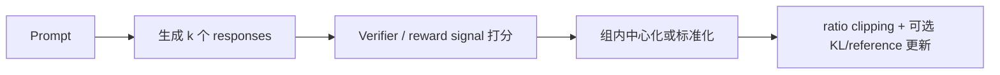
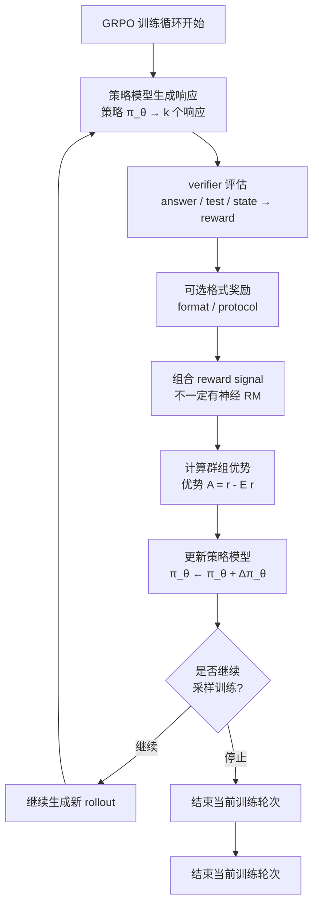

> 配套代码：`grpotrainer.py`

## 承上启下

前三章已经完成：

- **第一章**：使用原生 Trainer 进行 SFT，梳理 Loss Masking 的基本概念
- **第二章**：使用 SFTTrainer 简化流程，实现了自动化的 SFT 训练
- **第三章**：使用 DPO 进行偏好对齐，让模型学习人类偏好

通过 DPO，模型可以学习：
- 如何区分好坏回答
- 生成更符合人类偏好的响应
- 在保持稳定性的同时提升质量

**但是**，原始 / 离线 DPO 的限制也很明确：它消费的是离线偏好对（chosen vs rejected）。如果你手里只有数学题正确性、代码测试结果这类可验证信号，通常还要先把结果转成偏好对，或者改用在线 / 可验证奖励方法。

**本章介绍 GRPO（Group Relative Policy Optimization）**——一种支持自定义奖励函数的强化学习方法。若要系统理解 GRPO 算法，仍应阅读原文；本文重点解释 GRPOTrainer 需要理解的 reward signal、group advantage、KL / reference 约束与在线采样。

本文的主线是：GRPOTrainer 如何把 prompt 在线采样成一组 responses，再用 reward signal 计算 group advantage，并在 ratio clipping 与可选 KL / reference 约束下更新策略。

## 本章学习目标

本章覆盖：

1. **可验证奖励** 的概念和价值
2. **GRPO** 与 DPO/PPO 的区别
3. **在线采样** 和 **群组相对优势** 的原理
4. **奖励函数设计** 的实践要点
5. **GRPOTrainer** 的使用思路（实战见[下一篇](/blog/2025/12/31/Re0HF-05/)）

> 注：本文为原理篇；GRPOTrainer 的使用、训练监控与完整示例见[下一篇（实战篇）](/blog/2025/12/31/Re0HF-05/)。

## 1. DPO 的局限与 GRPO 的优势

### 1.1 DPO 无法处理的场景

先用两个典型场景看：DPO 的输入是离线偏好对，而 GRPO 能直接消费在线生成后的验证结果。

- **数学问题**：可验证信号是答案是否正确。DPO 需要预先构造 `chosen/rejected`，GRPO 则可以对同一 prompt 采样多条回答，把正确性直接转成 reward。
- **代码生成**：可验证信号是单元测试是否通过。测试结果不能直接进入 DPO 数据格式，但可以给每条候选代码打 reward，再做组内 advantage。

**DPO 的问题：**
- 无法直接利用测试结果
- 需要人工标注 `chosen/rejected`

### 1.2 GRPO 的核心优势

**GRPO = 在线采样 + 自定义奖励 + 群组相对优势**

**GRPO vs DPO 对比**

**DPO:**
- 数据: 离线 (prompt, chosen, rejected) 对
- 奖励: 隐式（通过偏好对学习）
- 适用: 主观偏好任务

**GRPO:**
- 数据: 只需 prompt
- 奖励: 显式、可自定义
- 适用: 任何可验证任务（数学、代码、推理等）

### 1.3 GRPO 的应用场景

| 任务类型 | 奖励函数设计 | 示例 |
|---------|-------------|------|
| **数学推理** | 答案正确性 | GSM8K, MATH |
| **代码生成** | 单元测试通过率 | HumanEval, MBPP |
| **逻辑推理** | 最终答案正确性| ReClor, LogiQA |
| **事实性** | 外部知识库验证 | TriviaQA |
| **多目标** | 加权组合奖励 | 正确性 + 效率 + 可读性 |

## 2. GRPO 算法原理

### 2.1 核心思想：群组相对优势

上一节解决的是“为什么需要 GRPO”：DPO 不能直接消费在线验证信号。接下来要解决的是“GRPO 如何消费这个信号”：它不是给单个回答打绝对分后直接训练，而是对同一 prompt 采样一组回答，并把每个回答放回组内比较。

**传统 PPO 的问题**：
- 需要独立的价值网络（Value Network / Critic），并与奖励信号结合才能估计优势
- 训练链路更重，对 critic、KL、rollout 与 batch 组织更敏感

**GRPO 的创新**：
- 对每个 prompt 生成 **k 个响应**（如 k=4）
- 使用组内中心化 / 标准化 reward 来估计优势
- 无需额外的价值网络



用同一个例子看数值会更清楚。对 prompt “计算 2 + 3 = ?” 采样 4 条回答，reward 均值是 0.125：

| 响应 | reward | advantage = reward - mean | 更新方向 |
| --- | ---: | ---: | --- |
| 答案是 5 | 1.0 | 0.875 | 增加概率 |
| 答案是 6 | -0.5 | -0.625 | 降低概率 |
| 答案是 5 | 1.0 | 0.875 | 增加概率 |
| 不知道 | -1.0 | -1.125 | 降低概率 |

### 2.2 可选背景：数学形式与核心区别

为了深入理解 GRPO 的创新之处，我们需要对比 PPO（Proximal Policy Optimization）和 GRPO 的数学形式。

如果只是想使用 GRPOTrainer，可以先抓住本节的三个结论：GRPO 不需要 critic/GAE；优势来自同一 prompt 的组内 reward 对比；多次更新同一批 rollout 时仍要理解 old-policy ratio、clipping 和可选 KL/reference 约束。下面的公式是为了帮助读者把这些结论放回 PPO 语境。

#### 2.2.1 PPO 的数学形式

**PPO 损失函数（完整版）：**

$$
L_{\text{PPO}}(\theta) = \mathbb{E}_t\left[L_t^{CLIP}(\theta) - c_1 L_t^{VF}(\theta) + c_2 S[\pi_\theta](s_t)\right]
$$

其中：

**策略损失（CLIP 损失）**：
   $$
   L_t^{CLIP}(\theta) = -\min\left(r_t(\theta)\hat{A}_t, \text{clip}(r_t(\theta), 1-\epsilon, 1+\epsilon)\hat{A}_t\right)
   $$

- $r_t(\theta) = \frac{\pi_\theta(a_t \mid s_t)}{\pi_{\theta_{old}}(a_t \mid s_t)}$ ← 重要性采样比率
- $\hat{A}_t$ ← 优势函数估计
- $\epsilon$ ← 裁剪参数（通常为 0.2）

**价值函数损失**：
   $$
   L_t^{VF}(\theta) = \left(V_\theta(s_t) - V_t^{\text{target}}\right)^2
   $$
- $V_\theta$ ← 价值网络（需要单独训练）
- $V_t^{\text{target}}$ ← 目标价值

**熵正则化**：
   $$
   S[\pi_\theta](s_t) = -\sum_a \pi_\theta(a \mid s_t) \log \pi_\theta(a \mid s_t)
   $$

**PPO 的优势函数计算（GAE）**：

$$
\hat{A}_t^{\text{GAE}}(\gamma, \lambda) = \sum_{l=0}^{\infty} (\gamma \lambda)^l \delta_{t+l}^V
$$

其中 $\delta_t^V = r_t + \gamma V(s_{t+1}) - V(s_t)$ 是 TD 残差。

**关键观察**：
- [缺点] 需要训练**价值网络** $V_\theta$（额外参数）
- [缺点] 需要**广义优势估计（GAE）**计算复杂
- [缺点] 依赖**重要性采样比率** $r_t(\theta)$
- [缺点] 需要裁剪机制防止更新过大

#### 2.2.2 GRPO 的数学形式

**GRPO 损失函数（直觉版）**：

$$
L_{\text{GRPO}}(\theta) = -\mathbb{E}_{s \sim \mathcal{D}, a_i \sim \pi_\theta(\cdot \mid s)}\left[\hat{A}(s, a_i) \log \pi_\theta(a_i \mid s)\right] + \beta \cdot \text{KL}(\pi_\theta \Vert \pi_{\text{ref}})
$$

**其中：**

这里先写成 policy-gradient 直觉，方便看清 reward 如何进入更新；实际实现需要看具体 trainer。原始 DeepSeekMath GRPO 使用 clipped surrogate 与 KL 项；截至 2026-05-05，TRL `GRPOTrainer` 默认 `beta=0.0`、`loss_type="dapo"`、`scale_rewards="group"`、`num_iterations=1`，reference/KL、loss 形式、reward scaling 和多轮 clipped update 都应以 `GRPOConfig` 为准。

**群组相对优势（Group Relative Advantage）**：
   $$
   \hat{A}(s, a_i) = \frac{R(s, a_i) - \frac{1}{k}\sum_{j=1}^{k} R(s, a_j)}{\operatorname{std}(\{R(s, a_j)\}_{j=1}^{k}) + \epsilon}
   $$
   如果不做标准差缩放，也可以理解为：
   $$
   \hat{A}(s, a_i) = R(s, a_i) - \text{mean}(R(s, \cdot))
   $$
- $R(s, a_i)$ ← 奖励函数或奖励信号对响应 $a_i$ 的评分
- $k$ ← 群组大小（每个 prompt 生成的响应数量）
- **关键**：优势是**相对于群组均值**的；高于同组均值为正，低于同组均值为负

**KL 散度正则化**：
   $$
   \text{KL}(\pi_\theta \Vert \pi_{\text{ref}}) = \sum_{a} \pi_\theta(a \mid s) \log \frac{\pi_\theta(a \mid s)}{\pi_{\text{ref}}(a \mid s)}
   $$
- $\pi_{\text{ref}}$ ← 参考策略（冻结的 SFT 模型）
- $\beta$ ← KL 系数
- 概念上它约束 policy 不要远离 reference；在 DeepSeekMath / TRL 这类实现中，常见估计式是 $\frac{\pi_{\text{ref}}}{\pi_\theta} - \log \frac{\pi_{\text{ref}}}{\pi_\theta} - 1$，并不一定显式枚举整个分布。

**关键观察**：
- **无需价值网络**（节省显存和计算）
- **无需 GAE / 价值网络**（用组内奖励直接构造中心化 advantage；std 缩放是常见实现选项）
- **仍可能使用 old-policy ratio 和裁剪**（多次更新同一批 rollout 时尤其重要）
- **KL / reference 约束是稳定性工具之一**（具体实现可配置，不能把它写成唯一稳定机制）

#### 2.2.3 核心区别对比

PPO 的优势估计通常依赖 GAE：

$$
\hat{A_t} = \sum_l(\gamma \lambda)^l \delta_{t+l}^V
$$

GRPO 的优势来自同一 prompt 下的组内 reward：

$$
\hat{A}(s, a_i) = R(s, a_i) - \text{mean}(R)
$$

常见实现还会除以组内 std，让不同 prompt 的 reward 尺度更接近。

- **价值网络**：PPO 需要 $V_\theta$；GRPO 不需要额外 value head。
- **采样策略**：PPO 使用 rollout 和 old-policy ratio；GRPO 在线生成 $k$ 个响应，多次更新同一批 rollout 时仍可能使用 ratio / clipping。
- **稳定性机制**：PPO 常见组合是 ratio clipping + KL；GRPO 可使用 ratio clipping，也可按实现配置 KL / reference 约束。
- **显存占用**：PPO 是策略网络 + 价值网络 + 奖励信号 / 奖励模型；GRPO 是策略网络 + 奖励信号，不需要额外价值网络。


#### 2.2.4 为什么群组相对优势有效？

**数学直觉**：

对于每个 prompt $s$，生成 $k$ 个响应 $\{a_1, a_2, ..., a_k\}$：

**零均值性质**：
   $$
   \mathbb{E}_{a_i \sim \pi_\theta}[\hat{A}(s, a_i)] = \frac{1}{k}\sum_{i=1}^{k} (R(s, a_i) - \text{mean}(R)) = 0
   $$
- 优势函数天然中心化
- 减少方差，提高训练稳定性

**组内中心化 / 缩放**：
- 不同 prompt 的奖励尺度可能不同（有的容易，有的困难）
- 组内中心化和 std 缩放有助于稳定训练
- 但它不能保证跨 prompt 尺度天然可比；TRL 里的 `scale_rewards` 可选 `group`、`batch` 或 `none`，具体选择需要按任务和 reward 分布验证

**无需绝对价值**：
- PPO: "这个响应价值多少？" → 需要 $V(s)$
- GRPO: "这个响应比同组其他响应好多少？" → 只需组内比较


### 2.3 为什么叫"群组相对"？

**传统 RL**：需要估计绝对价值，"这个响应好吗？" → 需要价值网络

**GRPO**：只需要相对比较，"这个响应比同组其他响应好吗？" → 直接用奖励函数

**优势：**
- 简单：无需额外网络
- 稳定：相对比较更鲁棒
- 高效：减少训练成本

## 3. GRPO 中的奖励系统

### 3.1 奖励信号：强化学习的核心组件

在 GRPO 以及现代强化学习算法中，必须提供的是 **奖励信号（reward signal）**，不一定是神经网络形式的 **奖励模型（reward model）**。这点很重要：DeepSeek-R1-Zero 使用 accuracy reward + format reward，且不使用 neural RM；完整 DeepSeek-R1 后续 RL 阶段面向更一般数据时也会加入 reward model / preference reward，论文还提到 preference reward 只在最后 400 steps 引入，以降低 reward hacking 风险。

**什么是奖励信号？**

奖励信号的作用是：
- **输入**：prompt + response（或者任务相关的其他信息）
- **输出**：一个标量奖励值，表示响应的质量
- **形式**：一个函数 `R(prompt, response, context) → reward`

这个函数可以有很多实现方式：

- 规则函数或 verifier：比如答案匹配、单元测试、SQL 执行结果、数据库终态；
- LLM / rubric judge：让强模型按 rubric 或 pairwise comparison 给出评价；
- 神经奖励模型：训练一个专门的 RM 来预测人类偏好或任务质量；
- 混合奖励：把 verifier、judge、RM、成本和安全约束组合起来。

**关键点**：
- 在 GRPO 中，我们优化的是策略模型 $\pi_\theta$
- 但需要一个奖励信号 $R$ 来告诉我们同组响应里哪些更好
- 神经 RM 只是 reward signal 的一种实现，不是 GRPO 的必要条件

### 3.2 神经奖励模型的两种训练方式

如果选择把奖励信号做成神经 RM，那么奖励模型通常可以通过两种方式训练：

#### 方式 1：基于规则训练（Outcome Supervision）

**适用场景**：有明确正确答案的任务（如数学题）

**训练流程**：
```python
# 示例：数学题奖励模型训练
training_data = [
    {
        "prompt": "计算 2+2",
        "response": "答案是 4",
        "outcome": +1.0  # 答案正确
    },
    {
        "prompt": "计算 2+2",
        "response": "答案是 5",
        "outcome": -1.0  # 答案错误
    },
]

# 训练奖励模型：学习预测 outcome
reward_model.train(
    inputs=[(d["prompt"], d["response"]) for d in training_data],
    targets=[d["outcome"] for d in training_data]
)
```

**原理**：
- 规则函数（如 `check_answer_correct()`）生成训练标签
- 奖励模型学习模仿这个规则函数
- 训练后，模型可以泛化到类似的问题

**优势**：
- [优点] 无需人工标注：规则自动生成训练数据
- [优点] 可验证：答案正确性是客观的
- [优点] 高效：可以生成大量训练样本

**局限**：
- [缺点] 需要有明确的验证规则
- [缺点] 只能判断"对错"，难以评估质量

#### 方式 2：基于人工标注训练（Preference Supervision）

**适用场景**：主观性强的任务（如对话质量、写作风格）

**训练流程**：
```python
# 示例：人工偏好数据
training_data = [
    {
        "prompt": "写一首关于春天的诗",
        "response_A": "春风拂面暖人心...",
        "response_B": "春天很好...",
        "preference": "A"  # 标注者认为 A 更好
    },
]

# 训练奖励模型
# 方法 1: 成对排序损失
loss = -log(sigmoid(r_A - r_B))  # 确保 r_A > r_B

# 方法 2: Bradley-Terry 模型
P(A > B) = sigmoid(r_A - r_B)
```

**原理**：
- 人工标注者比较两个响应
- 奖励模型学习预测人类偏好
- 训练后，模型输出与人类判断对齐

**优势**：
- [优点] 捕捉复杂质量维度：流畅性、创造性、有用性
- [优点] 泛化能力强：可处理各种任务

**局限**：
- [缺点] 标注成本高
- [缺点] 主观性强：不同标注者可能不一致

### 3.3 GRPO 中的奖励信号：规则 vs 模型

**重要澄清**：在 GRPO 中，"奖励函数" 可以是：

**类型 A：纯规则函数 / verifier**

```python
def rule_based_reward(prompt, response):
    """直接使用规则计算奖励，无需训练"""
    if check_correct(response):
        return 1.0
    else:
        return -1.0
```

- [优点] 简单高效，适合快速实验
- [优点] 可复现、可审计，适合数学、代码、SQL、工具终态这类可验证任务
- [缺点] 覆盖范围取决于规则本身，开放任务里容易被字面 exploit
- [注意] 这不是神经"奖励模型"，但它完全可以作为 GRPO 的 reward signal

**类型 B：预训练的奖励模型**

```python
# 预先训练好的神经网络
reward_model = load_pretrained_reward_model("path/to/model")

def model_based_reward(prompts, responses):
    """使用奖励模型推理"""
    rewards = []
    for prompt, response in zip(prompts, responses):
        reward = reward_model(prompt, response)  # 模型推理
        rewards.append(reward)
    return rewards
```

- [优点] 这是标准的"奖励模型"
- [优点] 捕捉复杂模式
- [缺点] 需要预先训练
- [缺点] 固定 RM 在强在线优化下可能被 policy 利用，出现 reward hacking

**类型 C：LLM / Rubric Judge**

```python
def rubric_judge_reward(prompt, response, rubric):
    """让 LLM judge 按 rubric 输出评分"""
    score = llm_judge.evaluate(
        prompt=prompt,
        response=response,
        rubric=rubric,
    )
    return score
```

- [优点] 适合开放问答、写作、复杂 agent 轨迹等难以直接验证的任务
- [优点] 可以通过 rubric、pairwise comparison、双向评分缓解绝对分数漂移
- [缺点] 可能有 verbosity bias、position bias、self-preference 等系统性偏差

**类型 D：混合奖励**

```python
def hybrid_reward(rule_score, judge_score, cost, has_hard_violation):
    """先处理红线，再聚合软指标"""
    if has_hard_violation:
        return 0.0
    return 0.7 * rule_score + 0.3 * judge_score - 0.05 * cost
```

- [优点] 更接近真实工业系统，可以同时处理正确性、表达、成本和安全边界
- [缺点] 如果所有项都线性加权，模型可能用某些加分项抵消关键错误
- [建议] hard constraints 应该先 veto，再谈加权总分

### 3.4 DeepSeek/RLVR 风格的奖励系统

在 DeepSeek-R1-Zero 这类可验证 reasoning 设置中，GRPO 的奖励系统可以非常朴素：直接用规则奖励评估答案正确性，并可加入格式奖励。这里没有必要先训练 outcome / process neural RM，因为数学、代码等任务的核心结果本来就可以验证。完整 R1 pipeline 面向更一般的数据时仍可能使用 model-based reward / preference reward；这里讨论的是可验证任务里的 RLVR 主线。



**这套写法的核心要点**：

1. **reward signal 可以直接来自 verifier**：数学答案、单元测试、SQL 执行结果、数据库终态都可以直接给分。
2. **格式奖励只能辅助**：格式约束可以帮助模型形成可解析输出，但权重过高时也会被 hack。
3. **神经 RM 是可选项，不是 GRPO 必需项**：开放任务或主观偏好任务可能需要 RM/judge；可验证任务优先直接验证。
4. **防 reward hacking 的重点是接口设计**：能做 hard veto 的错误不要放进平均分；能用 objective outcome 的地方不要全交给黑盒 judge。
5. **奖励模型的动态更新**：奖励模型在 GRPO 训练过程中持续更新，适应策略模型分布偏移。


### 3.5 当 reward signal 是神经 RM 时

本节不是 GRPO / RLVR 的必需流程。可验证任务优先使用规则或验证器直接给出 reward signal；只有当任务开放、主观或难以直接验证时，才需要把奖励信号做成神经 RM 或 LLM judge。

如果只是为了读懂 GRPOTrainer，可以先跳到第 4 节；下面几段只保留神经 RM 的背景，避免把“GRPO 必须训练奖励模型”误读成主线。


#### 3.5.1 训练数据的构建

**基于规则的数据生成**：

```python
def generate_reward_model_training_data(math_dataset):
    """
    从数学题数据集生成奖励模型训练数据
    """
    training_data = []

    for sample in math_dataset:
        prompt = sample["question"]
        ground_truth = sample["answer"]

        # 生成多个响应（包含正确和错误的）
        responses = [
            generate_correct_response(prompt, ground_truth),
            generate_incorrect_responses(prompt, ground_truth, n=3),
        ]

        # 为每个响应生成标签
        for response in responses:
            outcome = check_answer_correct(response, ground_truth)
            training_data.append({
                "prompt": prompt,
                "response": response,
                "reward": 1.0 if outcome else -1.0
            })

    return training_data
```

#### 3.5.2 奖励模型架构

神经奖励模型通常会在预训练语言模型上增加奖励头，使其输出一个标量奖励，再用收集到的奖励数据进行微调。下面是一个玩具级示例，用来说明结构，不代表 LLM RLHF / RLVR 中唯一或标准的 RM 实现。

```python
import torch
import torch.nn as nn
from transformers import AutoModel

class RewardModel(nn.Module):
    """
    简单的奖励模型实现
    """
    def __init__(self, base_model_name="bert-base-uncased"):
        super().__init__()
        self.encoder = AutoModel.from_pretrained(base_model_name)
        hidden_size = self.encoder.config.hidden_size

        # 奖励头：输出单个标量
        self.reward_head = nn.Sequential(
            nn.Linear(hidden_size, hidden_size // 2),
            nn.ReLU(),
            nn.Dropout(0.1),
            nn.Linear(hidden_size // 2, 1)
        )

    def forward(self, input_ids, attention_mask):
        # 编码
        outputs = self.encoder(
            input_ids=input_ids,
            attention_mask=attention_mask
        )

        # 使用 [CLS] token 的表示
        cls_embedding = outputs.last_hidden_state[:, 0, :]

        # 计算奖励
        reward = self.reward_head(cls_embedding).squeeze(-1)

        return reward

# 训练循环
def train_reward_model(model, training_data, epochs=3):
    optimizer = torch.optim.AdamW(model.parameters(), lr=1e-5)
    loss_fn = nn.MSELoss()  # 回归损失

    for epoch in range(epochs):
        for batch in training_data:
            prompts = batch["prompt"]
            responses = batch["response"]
            targets = batch["reward"]

            # 前向传播
            rewards = model(prompts, responses)

            # 计算损失
            loss = loss_fn(rewards, targets)

            # 反向传播
            loss.backward()
            optimizer.step()
            optimizer.zero_grad()

    return model
```

#### 3.5.3 奖励模型的评估

```python
def evaluate_reward_model(reward_model, test_dataset):
    """
    评估奖励模型的质量
    """
    correct_rankings = 0
    total = 0

    for sample in test_dataset:
        prompt = sample["prompt"]
        better_response = sample["better"]
        worse_response = sample["worse"]

        # 计算奖励
        r_better = reward_model(prompt, better_response)
        r_worse = reward_model(prompt, worse_response)

        # 检查排名是否正确
        if r_better > r_worse:
            correct_rankings += 1
        total += 1

    accuracy = correct_rankings / total
    print(f"Ranking Accuracy: {accuracy:.2%}")

    return accuracy
```


### 3.6 奖励模型训练的常见陷阱

#### 陷阱 1：奖励黑客（Reward Hacking）

**问题**：模型发现奖励函数的漏洞，生成不自然但高奖励的文本

**示例**：
- 奖励函数：奖励包含数字的回答
- 模型学会：生成大量无关数字

**解决方案**：
```python
def robust_reward_function(response):
    reward = 0.0

    # 基础奖励：答案正确性
    if check_correct(response):
        reward += 0.7

    # 辅助奖励：格式规范（但要小心！）
    if has_proper_format(response):
        reward += 0.2

    # 惩罚：异常模式
    if has_repetitive_patterns(response):
        reward -= 0.5  # 严重惩罚

    if is_too_short(response):
        reward -= 0.3

    return reward
```

#### 陷阱 2：分布偏移

**问题**：训练后期，生成的响应超出奖励模型的训练分布

**解决方案**：
```python
# 定期评估奖励模型的校准性，重新微调奖励模型
def check_reward_distribution(reward_model, validation_set):
    rewards = []
    for sample in validation_set:
        r = reward_model(sample["prompt"], sample["response"])
        rewards.append(r)

    # 检查奖励分布是否异常
    if abs(np.mean(rewards)) > 10:  # 奖励值异常大
        print("Warning: Reward model may be miscalibrated!")
        return False

    return True
```

#### 陷阱 3：过度拟合训练数据

**问题**：奖励模型在训练集上表现好，但泛化性差

**解决方案**：
- 使用数据增强
- 添加正则化
- 定期在测试集上评估

</details>

## 4. GRPO vs DPO vs PPO

### 4.1 三者对比

下表是工程选型的粗粒度启发式，不是跨实现、跨硬件和跨任务都成立的固定排名；实际显存、速度和稳定性会受 trainer、batch 组织、reference/RM 是否加载、并行策略和 reward 形态影响。

| 维度 | DPO | GRPO | PPO |
|------|-----|------|-----|
| **数据需求** | 离线偏好对 | 只需 prompt | 只需 prompt |
| **奖励函数** | 隐式 | 显式、可自定义 | 显式、可自定义 |
| **训练稳定性** | [高] | [较高] | [中] |
| **实现复杂度** | [低] | [中] | [高] |
| **显存占用** | [低] | [较高] | [高] |
| **适用场景** | 主观偏好 | 可验证任务 | 复杂奖励 |
| **训练速度** | 快 | 中等 | 慢 |

### 4.2 选择建议

**何时使用 DPO**：
- 有高质量偏好对数据
- 主观性强的任务（风格、偏好）
- 希望训练稳定、快速

**何时使用 GRPO**：
- 有明确的可验证标准（数学、代码）
- 需要自定义奖励函数
- 推理密集型任务
- DeepSeek-R1 风格的应用

**何时使用 PPO**：
- 需要复杂的奖励塑形
- 多目标优化
- 有足够的工程资源

## 5. 奖励函数与统一范式

到这里，GRPOTrainer 原理篇的主线已经结束：在线采样、reward signal、group advantage、ratio/clipping 与可选 KL/reference 约束。下面是更宽的研究延伸，用来帮助读者理解 reward 设计和在线 RL 的发展方向，不是下一篇实战所必需的前置知识。


**当前：人工设计奖励函数**
- 需要领域知识
- 可能存在漏洞
- 很多复杂问题难以被规则奖励

**未来：AI 辅助奖励设计**
- 使用强模型（如 GPT-4）作为奖励模型
- 自动发现奖励函数
- 多模态奖励（文本 + 图像 + 代码执行）
- 自我改进的奖励函数

### 强化学习训练的统一范式与洞察

基于 GRPO 原文论文，我们可以从更宏观的角度理解各种强化学习训练方法的内在联系与差异。

#### 统一的强化学习训练框架

GRPO 论文提出了一个统一的强化学习训练框架，将不同的训练方法（SFT、RFT、DPO、PPO、GRPO等）纳入同一分析框架。

**核心梯度公式**：

$$
\nabla_\theta J_\pi(\theta) = \mathbb{E}_{(q, o) \sim \mathcal{D}} \left[ \frac{1}{\lvert o \rvert} \sum_{t=1}^{\lvert o \rvert} GC_\pi(q, o, t, \pi_f) \nabla_\theta \log \pi_\theta(o_t \mid q, o_{<t}) \right]
$$

其中：
- $q$：查询（query）或提示
- $o$：输出（output）或响应
- $t$：时间步
- $\pi_f$：用于评估质量的参考策略或奖励函数
- $GC_\pi$：梯度系数（Gradient Coefficient），决定参数更新的方向和幅度

**三个关键组件**：

1. **数据源 $\mathcal{D}$**：训练数据的来源
2. **奖励函数 $r_{\pi_f}$**：提供训练奖励信号
3. **算法 $\mathcal{A}$**：处理数据与奖励信号，生成梯度系数 $GC$

#### 不同训练方法的分类

根据这个统一框架，我们可以将常见的训练方法分为几类：

#### 离线方法（Offline Methods）

**RFT（Rejection Sampling Fine-tuning）**：
- 基于 SFT 模型采样输出
- 根据答案正确性筛选过滤
- 仅对正确响应进行微调
- 特点：简单有效，但无法利用错误响应的信息

**DPO（Direct Preference Optimization）**：
- 使用成对偏好优化损失
- 在增强输出（augmented outputs）上微调
- 无需显式奖励模型
- 特点：稳定高效，适合主观偏好任务

#### 在线方法（Online Methods）

**Online RFT**：
- 以 SFT 模型初始化策略模型
- 使用实时策略模型的增强输出进行微调
- 在线采样探索新的响应
- 特点：训练早期与 RFT 相当，后期显著优于 RFT

**PPO/GRPO**：
- 以 SFT 模型初始化策略模型
- 通过实时策略模型的输出强化策略
- 使用梯度系数进行差异化更新
- 特点：在相关实验设置中表现较强，尤其 GRPO 在效率和效果间取得良好平衡

#### 核心洞察：在线 vs 离线

#### 训练动态差异

**初始阶段**：
- Actor（策略模型）与 SFT 模型高度相似
- 采样数据差异小
- 在线方法的优势不明显

**后期阶段**：
- Actor 采样数据与 SFT 数据差异显著增大
- **在线采样的优势变得明显**
- 实时数据探索带来的性能提升更加显著

#### 性能对比

在 DeepSeekMath 1.3B 的 GSM8K / MATH 实验设置中，论文报告了几条训练动态：
- Online RFT 在训练后期显著优于 RFT
- GRPO 在两个基准测试中超越 Online RFT
- **迭代 RL（Iterative RL）在第一轮提升最显著**
- GRPO + PS（步感知梯度系数）优于 GRPO + OS

#### 梯度系数机制的关键作用

**GRPO vs Online RFT 的核心差异**：

| 方法 | 梯度系数策略 | 特点 |
|------|------------|------|
| **Online RFT** | 统一强化所有正确响应 | 不惩罚错误响应，无差异化 |
| **GRPO** | 根据奖励值动态调整 | 差异化强化/惩罚，按响应 magnitude 区分 |

**关键洞察**：

**动态梯度系数的重要性**：
- GRPO 根据奖励函数或奖励信号提供的奖励值动态调整梯度系数
- 实现"差异化强化/惩罚"：高质量响应获得更大的正梯度
- 低质量响应获得负梯度（惩罚）

**细粒度梯度设计的增益**：
- GRPO + PS（步感知，Step-aware）性能优于 GRPO + OS
- 说明梯度系数的精细化设计能带来额外性能提升

**迭代训练的价值**：
- 迭代 RL 在两轮迭代中持续提升性能
- 第一轮提升最为显著
- 多轮迭代能够持续累积收益

#### 数据源分类：在线采样 vs 离线采样

**在线采样（Online Sampling）**：
- 训练数据来自实时训练策略模型的探索结果
- 动态生成，持续改进
- 优势：能够探索新的、更好的响应
- 代表方法：Online RFT、PPO、GRPO

**离线采样（Offline Sampling）**：
- 训练数据来自预收集的数据集
- 静态数据，固定不变
- 优势：训练稳定，易于控制
- 代表方法：SFT、RFT、DPO

#### 实践建议

基于以上洞察，在实际应用中：

**选择在线方法的场景**：
- 任务有明确的可验证标准（如数学、代码）
- 需要持续探索和改进
- 有足够的计算资源支持在线采样
- 追求更高性能

**选择离线方法的场景**：
- 有高质量预收集数据
- 任务为主观偏好（风格、语气）
- 计算资源有限
- 需要快速迭代和稳定训练

**混合策略**：
- 初期使用离线方法（SFT/DPO）建立基础能力
- 后期使用在线方法（GRPO）针对性优化
- 迭代 RL 可以持续累积提升

#### 统一框架的作用

这个统一框架主要有几类用途：

1. **理论理解**：帮助我们理解不同方法的结构差异
2. **方法选择**：为具体任务选择合适的训练方法提供指导
3. **算法设计**：指导新算法的设计和优化方向
4. **性能分析**：解释为什么某些方法在特定场景下更有效

通过这个框架，可以更清楚地比较强化学习在语言模型微调中的几种用法，也方便把后续新方法放回同一套坐标里理解。

</details>

## 本章小结

本文完成了 GRPOTrainer 所需的原理铺垫：在线采样、reward signal、group advantage、ratio clipping 与可选 KL / reference 约束。下一篇将进入 [GRPOTrainer 实战篇](/blog/2025/12/31/Re0HF-05/)，用代码跑通训练、监控和调试。

## 参考资料

- [TRL 文档：GRPOTrainer](https://huggingface.co/docs/trl/main/en/grpo_trainer)
- [GRPO 论文：DeepSeekMath](https://arxiv.org/abs/2402.03300)
- [DeepSeek-R1：rule-based reward 与 GRPO](https://arxiv.org/abs/2501.12948)
- [PPO 论文：Proximal Policy Optimization Algorithms](https://arxiv.org/abs/1707.06347)
- [DPO 论文：Direct Preference Optimization: Your Language Model is Secretly a Reward Model](https://arxiv.org/abs/2305.18290)
- [TRL](https://github.com/huggingface/trl)
