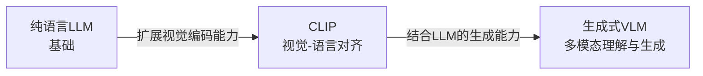

多模态大模型的发展大致沿着一条技术路径展开：从纯语言 LLM 开始，到 CLIP 实现视觉-语言对齐，再到生成式 VLM，以及更原生的多模态建模方式。本文梳理这条技术脉络，分析各类模型的基本原理与架构差异。

本文包含三个主要部分：**从纯文本到多模态**(LLM→CLIP→VLM 的技术演进)、**进阶话题**(扩散模型与原生多模态)，以及**附录**(基础概念补充，包括 Cross Attention、交叉熵、Softmax 等)。

## 从纯文本到多模态

多模态 AI 的发展不是一次性完成的。更常见的路线是先把文本模型训练好，再引入视觉编码器、跨模态对齐层和生成接口。**每一阶段都复用了上一阶段的一部分能力，同时也暴露出新的接口问题。**

**演进路径**:

本节将拆解这三个阶段的技术原理,重点说明它们之间的继承关系和演进逻辑。

### 阶段一:纯语言模型LLM——单一模态的智力引擎

**LLM 是理解后续多模态架构的起点**。先看清语言模型怎样处理 token、怎样生成文本，后面再看 CLIP 和 VLM 的视觉接入方式会更顺。

LLM(大语言模型)是**只处理文本模态的生成模型**,采用 Transformer Decoder-only 架构，通过大规模文本预训练学习语言分布。常见训练目标是自回归预测下一个 Token(Next Token Prediction)，后续再经过指令微调和人类对齐(RLHF/DPO)改善任务表现。

但 LLM 的输入接口限制很明显：**它只能直接处理文本，不能原生接收图像、音频等多模态信息**。所以多模态扩展首先要回答一个工程问题：**如何让 LLM "看见"图像?** 两条技术路线由此出现:
1. **CLIP路线**:构建视觉-语言对齐,让图像和文本嵌入到同一个向量空间
2. **VLM路线**:直接给LLM装上"眼睛",让其能看图说话

### 阶段二:CLIP——搭建视觉与语言的桥梁

CLIP(Contrastive Language-Image Pre-training)把**视觉与语言的对齐**做成了一个可复用的嵌入问题。它不是生成模型，而是嵌入模型：图像和文本被映射到同一个向量空间中，再通过相似度进行比较。

**与LLM的关系**:
- CLIP的**文本编码器**直接继承了LLM的Transformer架构
- CLIP复用了LLM的文本理解能力,但将其迁移到视觉-语言对齐任务
- CLIP的训练目标从"预测下一个Token"转变为"对齐图文嵌入"

#### 核心定位:视觉-语言对齐模型

CLIP可以理解为**嵌入模型(Embedding Model)**。它把图像和文本映射到同一个低维向量空间(嵌入空间)，让语义相近的图文对在空间中距离更近。

**解决的问题**:
- 纯视觉模型(如ResNet)只能输出固定类别标签,无法理解自然语言
- 纯语言模型无法"看见"图像
- CLIP提供了视觉与语言之间的嵌入接口，实现了跨模态的语义对齐

#### 架构设计:双塔结构(Dual-Encoder)

CLIP采用的"双塔"设计很直接——视觉编码器和文本编码器独立工作,互不干扰,仅在最后通过相似度计算进行交互。

##### 视觉编码器(Visual Encoder)

**基础架构**:通常使用 **ViT (Vision Transformer)** 系列(如ViT-L/14或ViT-g)

**工作流程**:
1. **图像分块**:将输入图像切分为 $N$ 个小方块(Patch),例如 $16 \times 16$ 像素
2. **展平与映射**:每个Patch被展平并通过线性映射变成向量
3. **添加位置编码**:为每个Patch添加位置信息
4. **Transformer处理**:通过多层Transformer进行特征提取和交互
5. **输出取样**:取特殊的 **[CLS] Token** 的输出向量作为全局视觉表示

**输出**:一个代表整张图像语义的**全局特征向量(Visual Embedding)**,维度如 $d=512$

##### 文本编码器(Text Encoder)

**基础架构**:标准的Transformer Encoder(**继承自LLM架构**)

**工作流程**:
1. **分词**:文本被Tokenizer切分为Token序列,如 `[SOS, A, dog, is, running, EOS, PAD...]`
2. **嵌入**:将每个Token转换为向量
3. **Transformer处理**:多层Self-Attention让每个Token都能"看到"上下文
4. **输出取样**:取 **[EOS] Token**(End of Sequence)位置的输出向量

**输出**:一个代表整句话语义的**全局文本向量(Text Embedding)**

##### 对齐机制

两座塔独立工作,**没有复杂的跨模态交互层**。它们仅在最后通过计算两个向量的**余弦相似度**进行交互。

$$ \text{Similarity} = \cos(\theta) = \frac{v \cdot t}{\|v\| \cdot \|t\|} $$

其中 $v$ 表示视觉嵌入向量(Visual Embedding)，$t$ 表示文本嵌入向量(Text Embedding)。

#### 训练目标:对比学习(Contrastive Learning)

CLIP 的主要改动在于训练方式：**对比学习**。其目标很明确：**让匹配的图文对距离拉近，让不匹配的图文对距离推远**。

##### InfoNCE Loss (CLIP的标准做法)

**基本思想**:在一个 Batch 中，将图文匹配视为一个多分类问题。

**场景设置**：假设一个Batch中有 $N$ 对(图,文),记为 $(I_1, T_1), (I_2, T_2), ..., (I_N, T_N)$。其中**正样本**是对角线上的配对 $(I_i, T_i)$,即匹配的图文对；而**负样本**则是对于图片 $I_i$,同一Batch内的其他 $N-1$ 个文本 $(T_j, j \neq i)$。

**计算过程**：首先计算所有图文向量的两两余弦相似度,构建 $N \times N$ 的相似度矩阵。对于第 $i$ 张图像,通过 Softmax 函数将其与所有文本的相似度归一化为概率分布,得到匹配正确文本 $T_i$ 的预测概率。损失函数使用经典的多分类交叉熵损失：

$$ L_i = -\log \frac{\exp(sim(I_i, T_i) / \tau)}{\sum_{j=1}^{N} \exp(sim(I_i, T_j) / \tau)} $$

**符号解释**:
- $sim(I_i, T_i)$:第 $i$ 张图和第 $i$ 段文本的相似度
- $\tau$ (Tau):**温度系数(Temperature)**,控制分布的"尖锐程度"
  - $\tau$ 很小:相似度的细微差异被放大,模型专注区分最难区分的负样本
  - $\tau$ 很大:分布变得更平滑
- $\exp(\cdot) / \sum \exp(\cdot)$:Softmax函数,把相似度数值转换成概率

**基本逻辑**:
InfoNCE强迫模型在 $N$ 个选项中"挑出"正确的那个。对于正样本对,梯度让两者靠近;对于负样本对,梯度让两者远离。

**局限性**:
InfoNCE依赖Batch Size。Batch越大,负样本越多,任务越难,模型学到的特征越好。如果Batch小,模型很容易随机猜对。

##### SigLIP (Sigmoid Loss改进)

SigLIP 是谷歌提出的改进方案，其基本思路是将多分类问题转化为 $N \times N$ 个独立的二分类问题。与 InfoNCE 不同，SigLIP 不再依赖 Softmax 的全局归一化，从而避免了分布式训练中计算分母全局和所带来的通信开销。

**算法原理**：对于相似度矩阵中的每个元素 $(i, j)$,根据是否为正样本对分别设定目标标签。当 $i=j$ 时为正样本对,标签 $y_{ij}=1$,期望Sigmoid输出接近1；当 $i \neq j$ 时为负样本对,标签 $y_{ij}=0$,期望Sigmoid输出接近0。损失函数定义为：

$$ L = - \frac{1}{N} \sum_{i}\sum_{j} \left[ y_{ij} \log \sigma(z_{ij}) + (1-y_{ij}) \log (1-\sigma(z_{ij})) \right] $$

**符号解释**：
- $N$: Batch中图文对的数量
- $y_{ij}$: 二分类标签，$y_{ij}=1$ 表示正样本对 $(i=j)$，$y_{ij}=0$ 表示负样本对 $(i \neq j)$
- $z_{ij}$: 第 $i$ 张图与第 $j$ 段文本的相似度分数
- $\sigma(\cdot)$: Sigmoid函数，替代了多分类的Softmax

这种做法有两个直接好处：其一，由于无需在 GPU 间同步分母的全局和，可支持超大规模 Batch 训练(如 32k 规模)；其二，实验中在同等模型规模下，SigLIP 在零样本分类任务上的性能通常优于 InfoNCE。

#### CLIP的嵌入空间对齐与能力边界

CLIP通过构建统一的视觉-语言嵌入空间，获得了两类常用能力：**零样本分类**与**跨模态检索**。

在零样本分类任务中,CLIP无需针对特定类别训练,只需将类别名称转化为自然语言描述(如"一张{类别}的照片"),计算图像与各类别文本描述的相似度,即可完成分类。这种跨模态检索成本极低，无论是"以图搜文"还是"以文搜图",CLIP均可在毫秒级完成向量点积计算。

不过，这种嵌入空间也有代价。CLIP 的编码器在对比学习驱动下，倾向于保留**全局语义**，同时丢掉一部分细节信息(如 OCR 文字、物体数量、精确空间位置)。只要图文大体匹配，就已经能满足训练目标。

另一个限制是，CLIP 只有编码器，没有解码器，因此无法执行"预测下一个词"的自回归生成。它能够判断"像不像"、"是不是"，却不能直接"说出"图像内容，也不擅长生成复杂场景描述。VLM 要解决的就是这个接口缺口：在视觉特征对齐之后，把这些特征送进语言模型，让模型生成文本。

### 阶段三:生成式VLM——给LLM装上眼睛

CLIP解决了"视觉-语言对齐"问题，但它无法"说话"。生成式 VLM(Visual Language Model)补上的是生成接口：**给 LLM 接入视觉特征，让它能围绕图像生成文本回答**。

代表模型包括LLaVA、InstructBLIP、Qwen-VL、MiniGPT-4等,这些LVLM(Large Vision-Language Model)通常利用CLIP的视觉能力提取特征,再通过对齐层"翻译"给LLM,最后借助LLM的表达能力生成文本,从而实现对图像内容的详细描述、推理和问答。

**与LLM和CLIP的继承关系**:
- VLM的**语言底座直接复用LLM**(如Vicuna, Qwen-7B),继承其强大的语言表达能力
- VLM的**视觉编码器直接复用CLIP**(如CLIP ViT-L/14),继承其学到的视觉表征
- VLM的创新在于**对齐层**,将CLIP的视觉特征"翻译"给LLM理解

#### 架构设计:三段式结构

生成式VLM采用"视觉编码器-语言模型-模态对齐层"的三段式架构,各组件分工明确且相互配合。

**视觉编码器(Visual Encoder)**负责图像特征提取,其设计哲学是**复用预训练好的CLIP/SigLIP**(冻结参数)。CLIP通过对比学习已经掌握了极好的视觉表征,直接复用可以省去从头训练的过程,同时降低训练成本并防止灾难性遗忘。Qwen-VL早期采用基于CLIP ViT的结构,InstructBLIP使用ViT-g/14,VLM直接继承CLIP的视觉编码器而无需重新训练视觉表征能力。

**语言模型底座(LLM Backbone)**的设计哲学同样是**复用纯语言LLM**(如Vicuna、Qwen-7B)。纯LLM已经掌握了强大的语言表达、逻辑推理和世界知识,直接复用可以快速获得多模态能力并保持原有的纯文本能力。LLM接收视觉特征(作为特殊的"视觉Token")和文本Prompt,进行自回归生成以预测下一个Token。InstructBLIP使用Vicuna(微调过的Llama),Qwen-VL使用Qwen-7B,LLaVA同样使用Vicuna,VLM直接复用LLM的预训练权重,继承其语言理解和生成能力。

**模态对齐层(Adapter/Projector)** 是 VLM 架构里的重要接口，作为"翻译官"负责将视觉特征"翻译"成 LLM 能理解的语言。当前存在两种主流设计理念，分别代表直接映射与精细提取两种技术路线。

**方案一:LLaVA (Linear/MLP Projection)——简单高效派**

LLaVA 采用最直接的两层 MLP 结构(Linear → Gelu → Linear)，其基本假设是视觉特征和语言嵌入在某个线性空间可以对齐。

- **架构设计**:
  - 视觉编码器:CLIP ViT-L/14(冻结参数)
  - 对齐层:两层MLP
  - LLM:Vicuna/Llama(微调,Full Fine-tuning或LoRA)

- **正向推理流程**:
  1. 图片输入ViT,输出所有Patch特征序列$H_v$(如$576 \times 1024$)
  2. $H_v$经过对齐层MLP,维度从1024映射到LLM的4096
  3. 输出向量$H'_v$被视为"视觉Token"
  4. 文本Prompt被Tokenize并转为Embedding$H_t$
  5. 将$H'_v$和$H_t$拼接：$[\text{Token}_{\text{Visual}}, \text{Token}_{\text{Text}}]$
  6. 扔给LLM做Next Token Prediction

- **反向传播机制**:
  1. 计算文本生成的Cross-Entropy Loss
  2. 梯度从Loss → LLM → 对齐层MLP → 视觉编码器ViT
  3. 由于ViT冻结,梯度传到输出端停止
  4. 只更新MLP和LLM参数

**方案二:InstructBLIP (Q-Former)——精细提取派**

InstructBLIP认为直接把所有Patch扔给LLM太冗余且计算慢,因此采用Q-Former(Querying Transformer)结构实现信息压缩与动态提取。

- **架构设计**:
  - 视觉编码器:ViT-g/14(冻结)
  - 对齐层:Q-Former(轻量级BERT结构)
  - LLM:Vicuna/Flan-T5(冻结或LoRA)

- **Q-Former的工作机制**:

  Q-Former的核心是**32个可学习的Query向量**,通过两层Attention实现指令感知的特征提取:

  **步骤A:Self-Attention(混合文本与Query)**
  - 输入：$[\text{Query}_{\text{Learned}}, \text{Token}_{\text{Text}}]$ 拼接
  - Learned Queries与Text Tokens交互,根据文本内容调整自己
  - 例如:文本是"找狗"时,Query向量变成"寻找狗状特征"的形状

  **步骤B:Cross-Attention(从图像提取信息)**
  - **Q(Query)**:融合了文本指令信息的Queries
  - **K(Key)**:冻结的ViT图像特征,经线性层映射
  - **V(Value)**:冻结的ViT图像特征,经线性层映射

  Cross-Attention的数学过程为:
  $$ \text{Attention}(Q, K, V) = \text{Softmax}\left(\frac{Q \cdot K^T}{\sqrt{d_k}}\right) \cdot V $$

  32个Query向量与257个Image Patches计算相似度,因Q已融合"找狗"的文本信息,代表"狗"的Image Patches获得高分,最终Query向量"吸走"了最相关的视觉信息,忽略无关背景。

#### 训练策略:多阶段训练

生成式VLM的训练分为多个阶段,逐步提升能力。**预训练对齐阶段**旨在让LLM"读懂"视觉特征,此阶段冻结视觉编码器和LLM,仅训练对齐层,使用大规模图文对(如Conceptual Captions、COCO)通过图文匹配任务,让对齐层学会将视觉特征映射到LLM能理解的嵌入空间。

**指令微调阶段**则让模型学会根据图片回答问题。此时解冻LLM(或部分层)和对齐层,使用VQA、Caption、对话等任务数据,以交叉熵损失(Next Token Prediction)进行训练。通过多任务数据,模型学会将视觉理解和语言生成结合,形成完整的VQA能力。

**平衡机制**方面,为防止LLM遗忘语言知识或产生幻觉,通常会在训练数据中混合纯文本数据,确保模型在获得多模态能力的同时保持原有的语言理解能力。

#### 能力与局限

生成式VLM具备较强的多模态理解能力:支持视觉问答(VQA)、图像描述、OCR文字识别,并能根据图像进行推理,如写代码、创作诗歌、解释科学概念等。

然而,VLM也存在显著局限:

- **推理成本高**:需要同时运行ViT和LLM,显存需求通常达16GB以上
- **幻觉问题突出**:模型可能描述图像中不存在的内容,这是由于模态对齐不充分——视觉编码器可能遗漏特征,对齐层传输信号弱化,导致LLM因"看不清"而依赖语言先验进行猜测,例如将白猫描述为"戴红帽子的白猫"
- **细节理解能力有限**:受CLIP编码器的信息损失影响,难以精确识别小字、计数和理解微小细节

### 演进总结:三层模型的继承与创新

把上面的内容放在一起看，LLM、CLIP、VLM 三者的关系可以整理成下面这张表。

**对比表格**:

| 对比维度 | 纯语言LLM | CLIP类模型 | 生成式VLM |
|:---|:---|:---|:---|
| **输入模态** | 仅文本 | 图像+文本(独立双通道) | 图像/视频+文本(混合序列) |
| **基本架构** | 单塔Transformer Decoder | 双塔Encoder(ViT + Text Encoder) | 多塔融合(视觉Encoder + 对齐层 + LLM Decoder) |
| **训练目标** | 预测下一个Token | 图文对比学习 | 预测下一个Token(输入含视觉特征) |
| **能力范围** | 纯文本任务 | 匹配、分类、检索 | 图文理解、描述、问答 |
| **推理方式** | 逐字生成 | 一次性计算向量点积,极快 | 视觉编码(慢)+逐字生成,延迟最高 |
| **典型应用** | 翻译、摘要、逻辑推理 | 零样本分类、图文检索 | VQA、图像描述、OCR |

这三者不是彼此替代，而是**复用和补足**的关系:

**1. CLIP继承LLM的文本能力**:
- CLIP的**文本编码器**采用了与LLM相同的Transformer架构
- CLIP复用了LLM的文本理解和表征能力
- CLIP的创新在于将文本能力扩展到视觉-语言对齐任务

**2. VLM同时继承LLM和CLIP**:
- **从LLM继承**:VLM的**语言底座直接复用预训练好的LLM**,继承了其语言表达、逻辑推理和世界知识
- **从CLIP继承**:VLM的**视觉编码器直接复用预训练好的CLIP**,继承了其学到的视觉表征能力
- **VLM的创新**:在于设计**对齐层**,将CLIP的视觉特征"翻译"给LLM理解

**3. 三者的共性**:
- **架构同源**:主体结构都来自 Transformer
- **表征方式相近**:都在将离散信息(像素、单词)压缩为高维稠密的语义向量(Embedding)
- **数据驱动**:都依赖大规模互联网数据的自监督/半监督预训练

## 进阶话题——扩散模型与原生多模态

在理解了CLIP和VLM的基础上,本节讨论两个进阶话题:扩散模型中CLIP如何引导图像生成,以及从"缝合怪"架构到原生多模态的技术演进。

### 扩散模型中的CLIP:文本如何引导图像生成?

Stable Diffusion等图像生成模型的文本理解核心依然是 **CLIP Text Encoder**。

#### 文本编码(Encoding)

用户输入提示词如"A cyberpunk city",CLIP Text Encoder处理文本并输出特征。与VLM不同,**这里不是只取最后一个EOS向量**。Stable Diffusion利用的是CLIP文本编码器**最后一层的完整Token序列输出**,输出形状为$77 \times 768$(假设最大长度77,维度768),这保留了每个单词的独立语义信息。

#### 注入U-Net(Injection)

Stable Diffusion的核心是一个**U-Net**,负责预测噪声并去噪。U-Net内部布满了**Cross-Attention层**。

- **Q (Query)**:来自**U-Net当前层的图像特征**(正在生成的噪声图)
- **K (Key) & V (Value)**:来自**CLIP的文本特征序列**($77 \times 768$)

#### 生成过程的物理含义

当U-Net处理图像的某个像素区域时,它作为Query发出询问:"我这里应该画什么?"它与CLIP的77个文本Token(Keys)进行比对,如果文本里有"city"这个词,且对应的Key与当前像素区域的Query匹配,那么"city"对应的Value就会被加权注入。最终,U-Net根据CLIP提供的语义地图,一步步把随机噪声"雕刻"成了符合文本描述的图像。

**作用**:CLIP 为生成模型提供"导航地图"，U-Net 根据 CLIP Embedding 的语义方向逐步调整噪声。

### 从"缝合怪"到原生多模态

前面讨论的 LLaVA、InstructBLIP 属于"缝合怪"(Glue approach)：拿现成的视觉模型和语言模型，用对齐层粘起来。这种方案存在两个明显局限。

**"缝合怪"的问题**:

一是**信息有损**。CLIP这种编码器是为对比学习设计的,它倾向于保留全局语义而丢弃细节(如OCR文字、物体数量、空间位置)。例如,VLM很难看清小字,因为ViT早在编码阶段就把这些信息压缩丢掉了。

二是**模态隔阂**。LLM并没有直接"看见"图像,它看到的是经过翻译的数学向量,存在天然的模态界限。

**原生多模态**(如GPT-4o、Gemini、Chameleon)采用**End-to-End Early Fusion**(端到端早期融合)理念解决这些问题。其核心做法是:不再使用CLIP,而是训练**视觉Tokenizer**(如VQ-VAE),将图像切块并转化为**离散的Token ID**(如Token #482代表一种纹理),然后将$[\text{Token}_{\text{Text}}, \text{Token}_{\text{Image}}, \text{Token}_{\text{Text}}]$作为混合序列,从头训练一个巨大的Transformer。

这种架构的优势在于:模型可以输出图像Token,直接生成图像(不需要外接Stable Diffusion);理解更细致,不再受限于CLIP的预训练目标;支持**交错式输入输出**(图文混排)。

### VQ-VAE:原生多模态的视觉Token化

原生多模态追求把图像变成类似文本的**Discrete Tokens(离散Token)**。

#### 核心目标

把一张$256 \times 256$的图,变成一串整数序列:`[382, 10, 998, ...]`。这样LLM就可以像预测下一个单词一样,预测下一个"图像块"。

#### VQ-VAE架构

VQ-VAE(Vector Quantized - Variational AutoEncoder)包含三个部分:

**Encoder(编码器)**:
- CNN将图像压缩成低分辨率特征图网格(如$32 \times 32$个向量)

**Codebook(码本)——关键所在**:
- 存了$K$个可学习向量(如8192个),记为$e_1, e_2, ..., e_K$
- 这是一个"字典"

**Quantization(量化-查字典)**:
- 对于特征图上的每一个向量,在Codebook里找到**最像**的那个向量$e_k$
- **核心操作**:直接用$e_k$替换编码器输出
- 记录下索引$k$——这就是**Visual Token**

**Decoder(解码器)**:
- 利用Codebook里的向量重组特征图
- 通过反卷积还原成像素图像

#### 反向传播难题:Straight-Through Estimator

**问题**:VAE的量化操作(取最近邻argmin)是**不可导**的,无法计算"取索引"这个操作的梯度。

**解决方案**:和VAE解决这个问题的方法一样 **Straight-Through Estimator (STE)**

- **前向传播时**:做量化,用Codebook向量替换编码器输出
- **反向传播时**:**欺骗梯度**——直接把Decoder传回来的梯度跳过量化层,原封不动地复制给编码器输出
- **逻辑**:虽然中间断了,但假设Codebook向量和编码器输出足够接近,所以梯度直接穿透过去

#### 结合LLM

一旦训练好了VQ-VAE:
1. 图像过Encoder → 量化 → 得到Token序列
2. Image Tokens和Text Tokens拼在一起
3. 训练Transformer预测序列
4. **生成时**:LLM预测出Image Token ID → 去Codebook查向量 → 扔给Decoder → 生成像素图

这一过程让多模态理解与生成进入同一套端到端训练流程。

## 结语

从 LLM 到 CLIP，再到生成式 VLM，变化主要发生在两个位置：输入如何表示，以及不同模态如何对齐。**LLM**提供文本生成底座，**CLIP**提供图文嵌入对齐，**VLM**把视觉特征接入语言生成；扩散模型则借助文本编码器把语言提示注入图像生成过程，原生多模态路线进一步尝试把图像也转化为可被 Transformer 统一处理的 Token 序列。

这些路线没有谁完全替代谁。CLIP 适合检索和匹配，生成式 VLM 适合围绕图像生成回答，扩散模型适合文本到图像生成，原生多模态则试图把理解与生成放进同一套端到端训练流程。做系统时，选择哪条路线取决于任务需要的是检索、问答、生成，还是更细粒度的跨模态交互。

理解这些模型的原理、架构差异和适用边界，有助于判断一篇新论文到底是在改视觉编码器、改对齐接口、改生成方式，还是在调整训练目标。

## 附录:核心基础概念详解

本附录收录文中的核心基础概念,供深入学习参考。

### Cross Attention (交叉注意力)

#### 核心定义

Cross Attention是一种注意力机制,允许模型在处理一个序列时参考和融合另一个序列的信息。其数学表达为:

$$ \text{Attention}(Q, K, V) = \text{Softmax}\left(\frac{Q \cdot K^T}{\sqrt{d_k}}\right) \cdot V $$

其中查询(Query)来自一个源,键(Key)和值(Value)来自另一个源。

#### 与Self-Attention的区别

**Self-Attention**: Q、K、V全部来自同一个输入,用于捕捉序列内部的依赖关系。

**Cross-Attention**: Q来自一个序列,K和V来自另一个序列,用于实现跨序列的信息融合。

#### 应用场景

- **机器翻译**:Decoder通过Cross Attention查询Encoder的隐藏状态
- **多模态生成**:Stable Diffusion中U-Net的图像特征通过Cross Attention融合CLIP的文本特征
- **视觉问答**:问题特征查询图像特征以获取答案线索

### 交叉熵 (Cross Entropy)

#### 从信息论到损失函数

交叉熵源于信息论,用于衡量两个概率分布的差异。要理解其在深度学习中的应用,需要追溯其信息论根源。

**信息量 (Information Content)**:
对于发生概率为 $p(x)$ 的事件 $x$,其信息量定义为:
$$ I(x) = -\log(p(x)) $$

直观理解:概率越小的事件发生时,我们感到越"惊讶",获得的信息量越大。

**熵 (Entropy)**:
随机变量 $X$ 的熵是其信息量的期望:
$$ H(P) = \mathbb{E}_{P}[I(X)] = - \sum_{x} p(x) \log(p(x)) $$

熵表示使用最优编码对分布 $P$ 进行编码时的平均比特数,是信息量的下界。

**交叉熵 (Cross Entropy)**:
使用基于分布 $Q$ 的编码来编码来自分布 $P$ 的数据:
$$ H(P, Q) = - \sum_{x} p(x) \log(q(x)) $$

#### 二分类场景:二元交叉熵

对于二分类问题,标签 $y \in \{0, 1\}$,模型预测概率为 $\hat{y} = \sigma(z)$,其中 $\sigma$ 是Sigmoid函数。

**概率分布表示**:
- 真实标签 $y=1$: $P = [1-p, p]$ 其中 $p$ 为正类概率
- 真实标签 $y=0$: $P = [1, 0]$
- 模型预测: $Q = [1-\hat{y}, \hat{y}]$

**二元交叉熵损失**:
$$ L = - [y \log(\hat{y}) + (1-y) \log(1-\hat{y})] $$

这个公式可以统一处理两种情况:
- 当 $y=1$: $L = -\log(\hat{y})$ (只关注预测正类的概率)
- 当 $y=0$: $L = -\log(1-\hat{y})$ (只关注预测负类的概率)

**与Sigmoid的配合**:

Sigmoid函数将模型输出 $z$ 映射到 $(0, 1)$，符合熵的概率要求
$$ \hat{y} = \sigma(z) = \frac{1}{1 + e^{-z}} $$

#### 多分类场景:分类交叉熵

对于 $K$ 分类问题,标签采用One-hot编码 $y \in \{0, 1\}^K$,模型输出经过Softmax得到概率分布 $\hat{y} \in [0, 1]^K$。

**分类交叉熵损失**:
$$ L = - \sum_{k=1}^{K} y_k \log(\hat{y}_k) $$

由于 $y$ 是One-hot编码,只有 $y_{target} = 1$,其余为0,因此简化为:
$$ L = - \log(\hat{y}_{target}) $$

**与Softmax的配合**:

Softmax将logits $z = [z_1, ..., z_K]$ 转换为概率分布:
$$ \hat{y}_i = \frac{e^{z_i}}{\sum_{j=1}^{K} e^{z_j}} $$

#### 与均方误差(MSE)的对比

**MSE损失函数**:
$$ L_{MSE} = \frac{1}{2}(y - \hat{y})^2 $$

对预测值 $\hat{y}$ 求导:
$$ \frac{\partial L_{MSE}}{\partial \hat{y}} = \hat{y} - y $$

**关键问题**:当配合Sigmoid/Softmax使用时,梯度链式法则中的激活函数导数会导致梯度消失。

以Sigmoid为例,完整梯度为:
$$ \frac{\partial L_{MSE}}{\partial z} = \frac{\partial L_{MSE}}{\partial \hat{y}} \cdot \frac{\partial \hat{y}}{\partial z} = (\hat{y} - y) \cdot \hat{y}(1 - \hat{y}) $$

当预测接近完全错误($\hat{y} \approx 0$, $y=1$)时:
- 误差项 $(\hat{y} - y) \approx -1$
- Sigmoid导数 $\hat{y}(1-\hat{y}) \approx 0$
- **总梯度 $\approx 0$**,导致梯度消失,参数更新缓慢

**交叉熵的优雅设计**:

如前所述,交叉熵与Sigmoid/Softmax配合后,激活函数的导数项被完美抵消,最终梯度简化为:
$$ \frac{\partial L_{CE}}{\partial z} = \hat{y} - y $$

即使在预测完全错误时,梯度仍保持最大值,确保快速收敛。

### Softmax (归一化指数函数)

#### 核心定义

Softmax将任意实数向量转换为概率分布,是多分类问题中的标准激活函数。对于向量 $z = [z_1, z_2, ..., z_K]$:

$$ S_i = \frac{e^{z_i}}{\sum_{j=1}^{K} e^{z_j}} $$

#### 数学特性

- **非负性**: $e^z$ 永远为正,保证概率非负
- **归一性**: 所有输出之和为1,构成合法概率分布
- **单调性**: 保留输入分数的相对大小关系
- **差异放大**: 指数函数会放大分数间的差异,使模型预测更加"果断"

#### 为什么叫 "Soft" max?

- **Hard Max**: 直接输出 `[1, 0, 0]`,不可导
- **Softmax**: 输出平滑的概率分布如 `[0.66, 0.24, 0.10]`,可导且保留相对大小信息

#### 与Sigmoid的对比

- **Sigmoid**: 用于二分类或多标签分类,各类别独立,概率之和不一定为1
- **Softmax**: 用于互斥多分类,所有类别相互竞争,概率之和强制为1

### Transformer多头注意力中的Q、K、V、O

#### 符号说明

- $d_{model}$:模型总嵌入维度(如BERT-base为768)
- $h$:头的数量(如12)
- $d_k$:每个头的维度($d_k = d_{model} / h$)
- $X$:输入矩阵,形状 $[\text{Size}_{\text{Batch}}, \text{Length}_{\text{Sequence}}, d_{\text{model}}]$

#### Q, K, V 矩阵

在多头注意力中,每个头 $i$ 都有独立的权重矩阵 $W_i^Q, W_i^K, W_i^V$:

**(1) Q (Query) 矩阵**:
- 将输入投影到"查询子空间"
- 作用:生成用于匹配其他向量的查询向量
- 多头含义:每个头关注输入的不同特征维度

**(2) K (Key) 矩阵**:
- 将输入投影到"键子空间"
- 作用:生成被查询匹配的特征向量

**(3) V (Value) 矩阵**:
- 将输入投影到"值子空间"
- 作用:存储实际内容信息,Q和K匹配后提取对应的V

#### O (Output) 矩阵

- **作用**:信息融合与整合
- **过程**:将所有头的输出拼接,通过 $W^O$ 进行全维度交互
- **意义**:整合不同头提取的多样化特征

#### 设计原理

多头机制允许模型在不同的表示子空间中并行关注不同位置的信息,每个头学习不同的注意力模式。最终通过O矩阵整合这些多样化的特征表示,相比单头注意力能更丰富地捕捉序列中的复杂依赖关系。
