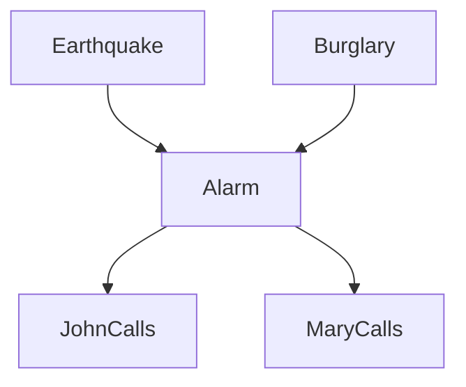

## 引言：用图表达概率结构

当变量达到成百上千个时，直接建模联合概率分布 $P(X_1, X_2, \dots, X_n)$ 往往不可行：参数数量会随变量数呈指数增长。**概率图模型**（Probabilistic Graphical Models, PGM）用图表达变量间的结构，用概率量化依赖强度，从而把高维联合分布拆成局部、可解释的部分。

如果想先从分类任务中的条件独立假设进入这个主题，可回顾[机器学习导论与监督学习：贝叶斯分类器](/blog/2024/03/28/machine-learning-introduction-supervised-learning/)。朴素贝叶斯、半朴素贝叶斯到贝叶斯网络，正是一条逐步放松属性独立性假设的路线。

本文把三个基础模型放到同一框架中：

| 模型 | 图结构 | 主要处理对象 | 条件独立性的表达 |
| --- | --- | --- | --- |
| 贝叶斯网络（BN） | 有向无环图（DAG） | 静态的变量依赖 | 给定父节点后的局部独立性 |
| 隐马尔可夫模型（HMM） | 沿时间展开的有向图 | 序列与隐状态 | 当前状态只依赖前一状态 |
| 马尔可夫随机场（MRF） | 无向图 | 对称的空间或邻域关系 | 图分离后的条件独立性 |

三者共享“图结构决定如何分解概率分布”的思想，但图中的边不具有同一种语义。特别是，**DAG 中的一条有向边首先表示建模中的条件依赖与分解方向；只有加入结构因果模型、干预语义和足够的领域假设后，才可以把它解释为因果关系。**

## 有向静态图：贝叶斯网络

### 结构与因子分解

贝叶斯网络（Bayesian Network）也称信念网络（Belief Network），由定性的图结构 $\mathcal{G}$ 和定量的参数 $\Theta$ 组成。图是一个**有向无环图**（Directed Acyclic Graph, DAG）：每个节点 $X_i$ 是随机变量，边 $X_j \to X_i$ 表示 $X_j$ 是 $X_i$ 的父节点之一。

其核心是假设**局部马尔可夫性质**：给定父节点 $Pa(X_i)$ 后，节点 $X_i$ 与所有非后代节点条件独立。

因此，联合分布可以写成局部条件分布的乘积：

$$
P(X_1, \dots, X_n) = \prod_{i=1}^{n} P(X_i \mid Pa(X_i)).
$$

这种因子分解把难以直接表示的高维联合分布，转化为若干条件概率表（Conditional Probability Table, CPT）或条件密度函数。

### 防盗报警器示例

经典的防盗报警器网络可用五个变量描述：地震 $E$、盗窃 $B$、报警器 $A$、约翰来电 $J$ 与玛丽来电 $M$。

这个网络的联合分布为：

$$
P(E, B, A, J, M) = P(E)P(B)P(A \mid E, B)P(J \mid A)P(M \mid A).
$$

只要指定五组局部概率，就能刻画整个系统。更重要的是，图还告诉我们哪些变量可以在给定证据后被忽略。

### D-划分与条件独立性

**D-划分**（D-Separation）是 DAG 中判断条件独立性的图形规则。它围绕三种基本结构展开：

#### 顺连

$$X \to Y \to Z$$

未给定 $Y$ 时，信息可以沿路径传递；给定 $Y$ 后，路径被阻断，因此 $X \perp Z \mid Y$。

#### 分连

$$X \leftarrow Y \to Z$$

$Y$ 是 $X$ 与 $Z$ 的共同原因。未观测 $Y$ 时，两者通常相关；控制 $Y$ 后，$X \perp Z \mid Y$。

#### 汇连

$$X \to Y \leftarrow Z$$

在没有观测 $Y$ 及其后代时，$X$ 和 $Z$ 边缘独立；一旦观测到 $Y$，路径反而被激活，两个原因会相关。这种现象称为**因果消除**（Explaining Away）：例如已知报警发生后，如果发现地震已经发生，盗窃导致报警的必要性就会下降。

### 学习与推断

贝叶斯网络的学习分为两层：

1. **参数学习**：已知图结构时，估计每个节点的条件概率表。离散变量可通过计数得到最大似然估计：

   $$
   \theta_{ijk}^{MLE}=\frac{N_{ijk}}{\sum_k N_{ijk}}.
   $$

   数据稀疏时，可用 Dirichlet 先验平滑：

   $$
   \theta_{ijk}^{Bayes}=\frac{N_{ijk}+\alpha_{ijk}}{\sum_k(N_{ijk}+\alpha_{ijk})}.
   $$

2. **结构学习**：图结构未知时，从数据中寻找合适的 DAG。这是 NP-Hard 问题，常见路线包括：
   - 基于约束的方法：利用条件独立检验构造骨架，例如 PC 算法；
   - 基于评分的方法：用 BIC、BDeu 等评分函数配合爬山法或 Tabu Search 搜索；
   - 混合方法：先用约束法缩小候选边集合，再用评分法定向，例如 MMHC。

在推断阶段，目标通常是计算证据条件下的查询概率，例如 $P(\mathbf{Q}=\mathbf{q}\mid\mathbf{E}=\mathbf{e})$。网络较小时可精确求解；网络稠密或规模较大时，常用 Gibbs 采样等近似方法。

## 有向动态图：隐马尔可夫模型

静态贝叶斯网络把一组变量放在同一时刻讨论，而许多数据天然具有时间顺序。**隐马尔可夫模型**（Hidden Markov Model, HMM）是动态贝叶斯网络最经典、最受限的形式：它用一条隐状态链生成观测序列。

### 模型定义

HMM 包含两层随机过程：

1. **隐状态序列** $Q=\{q_1,q_2,\dots,q_T\}$：系统的真实状态，通常不可直接观测；
2. **观测序列** $O=\{o_1,o_2,\dots,o_T\}$：每个时刻可以看到的数据。

一个离散 HMM 通常记为 $\lambda=(N,M,A,B,\pi)$：

- 状态集合 $S=\{s_1,\dots,s_N\}$；
- 观测集合 $V=\{v_1,\dots,v_M\}$；
- 状态转移矩阵 $A=[a_{ij}]$，其中

  $$a_{ij}=P(q_{t+1}=s_j\mid q_t=s_i);$$

- 发射概率矩阵 $B=[b_j(k)]$，其中

  $$b_j(k)=P(o_t=v_k\mid q_t=s_j);$$

- 初始状态分布 $\pi=[\pi_i]$，其中 $\pi_i=P(q_1=s_i)$。

它依赖两个关键假设：

1. **齐次马尔可夫假设**：当前隐状态只依赖前一时刻的隐状态，

   $$
   P(q_t\mid q_{t-1},o_{t-1},\dots,q_1,o_1)=P(q_t\mid q_{t-1});
   $$

2. **观测独立性假设**：当前观测只依赖当前隐状态，

   $$
   P(o_t\mid q_T,o_T,\dots,q_1,o_1)=P(o_t\mid q_t).
   $$

### 三个核心问题

#### 概率计算：前向算法

给定模型和观测序列，计算 $P(O\mid\lambda)$。直接枚举所有隐状态序列的复杂度为 $O(N^T\cdot T)$，前向算法将其降至 $O(N^2\cdot T)$。

定义前向概率：

$$
\alpha_t(i)=P(o_1,\dots,o_t,q_t=s_i\mid\lambda).
$$

递推为：

$$
\alpha_1(i)=\pi_i b_i(o_1),
$$

$$
\alpha_{t+1}(j)=\left[\sum_{i=1}^N\alpha_t(i)a_{ij}\right]b_j(o_{t+1}),
$$

$$
P(O\mid\lambda)=\sum_{i=1}^N\alpha_T(i).
$$

#### 解码：维特比算法

给定观测序列，寻找最可能的隐状态路径：

$$
Q^*=\arg\max_Q P(Q\mid O,\lambda).
$$

维特比算法保留到达每个状态的最优路径。令 $\delta_t(i)$ 表示在时刻 $t$ 处于 $s_i$ 的最大路径概率，则：

$$
\delta_1(i)=\pi_i b_i(o_1),
$$

$$
\delta_t(j)=\max_{1\le i\le N}[\delta_{t-1}(i)a_{ij}]b_j(o_t).
$$

同时记录每一步的最优前驱 $\psi_t(j)$，在终点取得最大值后回溯，就能恢复整条状态序列。

#### 学习：Baum-Welch 算法

如果只有观测序列而没有隐状态标注，需要估计 $A$、$B$ 与 $\pi$。由于模型含有隐变量，无法直接完成普通的极大似然估计；HMM 使用 EM 算法的特例——**Baum-Welch 算法**。

E 步计算：

- $\xi_t(i,j)$：时刻 $t$ 为状态 $i$ 且 $t+1$ 为状态 $j$ 的后验概率；
- $\gamma_t(i)=\sum_j\xi_t(i,j)$：时刻 $t$ 处于状态 $i$ 的后验概率。

M 步按期望计数更新转移概率与发射概率：

$$
\hat{a}_{ij}=\frac{\sum_{t=1}^{T-1}\xi_t(i,j)}{\sum_{t=1}^{T-1}\gamma_t(i)},
$$

$$
\hat{b}_j(k)=\frac{\sum_{t=1,o_t=v_k}^{T}\gamma_t(j)}{\sum_{t=1}^{T}\gamma_t(j)}.
$$

### 例子：词性标注

在词性标注中，单词序列是观测值，词性标签是隐状态。训练时估计词性之间的转移概率和词性产生单词的概率；预测时，使用维特比算法从句子中恢复最可能的词性序列。虽然许多现代任务已使用 RNN、LSTM 或 Transformer，HMM 仍然是理解序列概率建模、动态规划与隐变量学习的重要起点。

## 无向图：马尔可夫随机场

当变量关系是对称的、没有明确的因果方向时，无向图更自然。**马尔可夫随机场**（Markov Random Field, MRF）尤其适合表达图像像素、空间单元或网络邻居之间的局部相关性。

### 图分离与全局马尔可夫性

MRF 使用无向图 $G=(V,E)$。对节点集合 $A$、$B$、$C$，如果 $C$ 阻断了图中从 $A$ 到 $B$ 的所有路径，那么：

$$
A\perp B\mid C.
$$

这称为**全局马尔可夫性质**。与 DAG 的 D-划分不同，无向图中不需要处理 V 型结构是否被观测的问题；图分离本身就给出条件独立性。

### 团、势函数与 Gibbs 分布

无向图通过**团**（Clique）表达局部交互。若一个严格正的分布满足图的马尔可夫性质，Hammersley-Clifford 定理保证它可以写为极大团势函数的乘积：

$$
P(X)=\frac{1}{Z}\prod_{C\in\mathcal{C}}\psi_C(x_C).
$$

其中：

- $\mathcal{C}$ 是极大团集合；
- $\psi_C(x_C)\ge0$ 是势函数，衡量团内变量状态的相容性；
- $Z$ 是配分函数，负责归一化：

  $$
  Z=\sum_x\prod_{C\in\mathcal{C}}\psi_C(x_C).
  $$

若令 $\psi_C(x_C)=\exp(-E_C(x_C))$，便得到能量形式的 Gibbs 分布：

$$
P(X)=\frac{1}{Z}\exp(-E(x)).
$$

能量更低的状态具有更高概率，这也连接了概率图模型与统计物理。

### Ising 模型与图像去噪

Ising 模型是最简单的成对 MRF。令每个节点 $x_i\in\{-1,+1\}$，其能量函数可写为：

$$
E(x)=-\sum_{(i,j)\in E}J_{ij}x_ix_j-\sum_{i\in V}h_ix_i.
$$

第一项鼓励相邻节点取一致的值，第二项表达单个节点受外部信息影响。用于二值图像去噪时，可令 $y_i$ 为带噪像素、$x_i$ 为待恢复像素：

$$
E(x,y)=-\beta\sum_{(i,j)\in E}x_ix_j-\eta\sum_{i\in V}x_iy_i.
$$

最小化能量等价于寻找最大后验概率（MAP）解：既保留图像的局部平滑性，又不脱离观察到的像素。

### 推断与 Gibbs 采样

MRF 的难点在于配分函数 $Z$ 通常需要枚举全部变量配置。若有 $N$ 个二值变量，求和规模为 $2^N$，精确推断很快变得不可行。

MCMC 可以避开直接计算 $Z$。特别是 Gibbs 采样中，一个变量的完全条件概率只依赖其邻居：

$$
P(x_i\mid x_{-i})=P(x_i\mid x_{\text{neighbors}})=\frac{\exp(-E(x_i,x_{\text{neighbors}}))}{\sum_{x_i'\in Val(x_i)}\exp(-E(x_i',x_{\text{neighbors}}))}.
$$

配分函数在分子与分母中抵消。实际采样时，从随机初值出发，反复按条件分布更新每个节点；在链收敛后，样本便可近似目标分布。

## 总结

概率图模型的统一思想是：**用图描述结构，用概率量化不确定性**。

- 贝叶斯网络用 DAG 表达静态的有向依赖，并通过 D-划分研究证据如何改变独立关系；
- HMM 把有向结构沿时间展开，用隐状态描述序列生成过程；
- MRF 用无向图与势函数表达对称的局部相互作用。

它们既是不同模型，也为后续的主题模型、状态估计、视觉模型和大量生成式方法提供共同语言。

### 延伸阅读

- [机器学习导论与监督学习：贝叶斯分类器](/blog/2024/03/28/machine-learning-introduction-supervised-learning/)：从朴素/半朴素贝叶斯理解图模型为何要表达属性依赖。
- [LDA主题模型：文本数据的生成密码](/blog/2026/02/12/topic-model-lda/)：概率图模型在文本主题建模中的典型应用。
- [卡尔曼滤波家族：KF、EKF、UKF 与 EnKF](/blog/2026/02/19/kalman-filter/)：连续状态空间中的递归估计与滤波路线。
