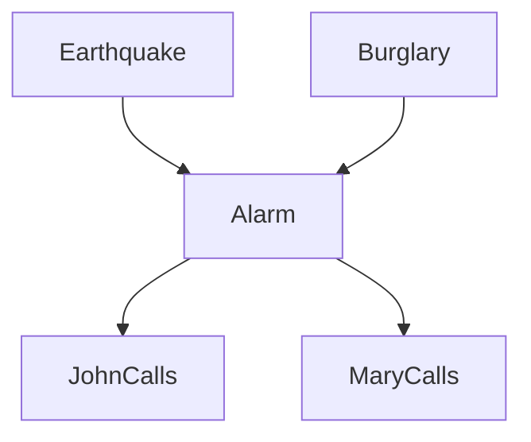
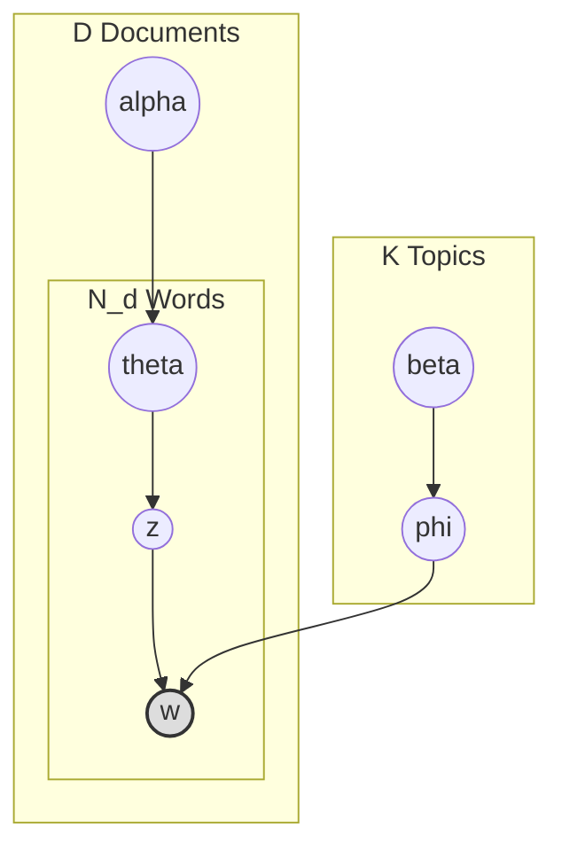

## 引言：用图表达概率结构

当变量达到成百上千个时，直接建模联合概率分布 $P(X_1, X_2, \dots, X_n)$ 往往不可行：参数数量会随变量数呈指数增长。**概率图模型**（Probabilistic Graphical Models, PGM）用图表达变量间的结构，用概率量化依赖强度，从而把高维联合分布拆成局部、可解释的部分。

如果想先从分类任务中的条件独立假设进入这个主题，可回顾[机器学习导论与监督学习：贝叶斯分类器](/blog/2024/03/28/machine-learning-introduction-supervised-learning/)。朴素贝叶斯、半朴素贝叶斯到贝叶斯网络，正是一条逐步放松属性独立性假设的路线。

本文把四个代表性模型放到同一框架中：

| 模型 | 图结构 | 主要处理对象 | 条件独立性的表达 |
| --- | --- | --- | --- |
| 贝叶斯网络（BN） | 有向无环图（DAG） | 静态的变量依赖 | 给定父节点后的局部独立性 |
| 隐马尔可夫模型（HMM） | 沿时间展开的有向图 | 序列与隐状态 | 当前状态只依赖前一状态 |
| 马尔可夫随机场（MRF） | 无向图 | 对称的空间或邻域关系 | 图分离后的条件独立性 |
| 潜在狄利克雷分配（LDA） | 带 Plate 的有向生成图 | 文档与潜在主题 | 给定主题指派后，词只依赖对应主题 |

四者共享“图结构决定如何分解概率分布”的思想，但图中的边不具有同一种语义。特别是，**DAG 中的一条有向边首先表示建模中的条件依赖与分解方向；只有加入结构因果模型、干预语义和足够的领域假设后，才可以把它解释为因果关系。**

## 有向静态图：贝叶斯网络

### 结构与因子分解

贝叶斯网络（Bayesian Network）也称信念网络（Belief Network），由定性的图结构 $\mathcal{G}$ 和定量的参数 $\Theta$ 组成。图是一个**有向无环图**（Directed Acyclic Graph, DAG）：每个节点 $X_i$ 是随机变量，边 $X_j \to X_i$ 表示 $X_j$ 是 $X_i$ 的父节点之一。

其核心是假设**局部马尔可夫性质**：给定父节点 $Pa(X_i)$ 后，节点 $X_i$ 与所有非后代节点条件独立。

因此，联合分布可以写成局部条件分布的乘积：

$$
P(X_1, \dots, X_n) = \prod_{i=1}^{n} P(X_i \mid Pa(X_i)).
$$

这种因子分解把难以直接表示的高维联合分布，转化为若干条件概率表（Conditional Probability Table, CPT）或条件密度函数。

### 防盗报警器示例

经典的防盗报警器网络可用五个变量描述：地震 $E$、盗窃 $B$、报警器 $A$、约翰来电 $J$ 与玛丽来电 $M$。

这个网络的联合分布为：

$$
P(E, B, A, J, M) = P(E)P(B)P(A \mid E, B)P(J \mid A)P(M \mid A).
$$

只要指定五组局部概率，就能刻画整个系统。更重要的是，图还告诉我们哪些变量可以在给定证据后被忽略。

### D-划分与条件独立性

**D-划分**（D-Separation）是 DAG 中判断条件独立性的图形规则。它围绕三种基本结构展开：

#### 顺连

$$X \to Y \to Z$$

未给定 $Y$ 时，信息可以沿路径传递；给定 $Y$ 后，路径被阻断，因此 $X \perp Z \mid Y$。

#### 分连

$$X \leftarrow Y \to Z$$

$Y$ 是 $X$ 与 $Z$ 的共同原因。未观测 $Y$ 时，两者通常相关；控制 $Y$ 后，$X \perp Z \mid Y$。

#### 汇连

$$X \to Y \leftarrow Z$$

在没有观测 $Y$ 及其后代时，$X$ 和 $Z$ 边缘独立；一旦观测到 $Y$，路径反而被激活，两个原因会相关。这种现象称为**因果消除**（Explaining Away）：例如已知报警发生后，如果发现地震已经发生，盗窃导致报警的必要性就会下降。

### 学习与推断

贝叶斯网络的学习分为两层：

1. **参数学习**：已知图结构时，估计每个节点的条件概率表。离散变量可通过计数得到最大似然估计：

   $$
   \theta_{ijk}^{MLE}=\frac{N_{ijk}}{\sum_k N_{ijk}}.
   $$

   数据稀疏时，可用 Dirichlet 先验平滑：

   $$
   \theta_{ijk}^{Bayes}=\frac{N_{ijk}+\alpha_{ijk}}{\sum_k(N_{ijk}+\alpha_{ijk})}.
   $$

2. **结构学习**：图结构未知时，从数据中寻找合适的 DAG。这是 NP-Hard 问题，常见路线包括：
   - 基于约束的方法：利用条件独立检验构造骨架，例如 PC 算法；
   - 基于评分的方法：用 BIC、BDeu 等评分函数配合爬山法或 Tabu Search 搜索；
   - 混合方法：先用约束法缩小候选边集合，再用评分法定向，例如 MMHC。

在推断阶段，目标通常是计算证据条件下的查询概率，例如 $P(\mathbf{Q}=\mathbf{q}\mid\mathbf{E}=\mathbf{e})$。网络较小时可精确求解；网络稠密或规模较大时，常用 Gibbs 采样等近似方法。

## 有向动态图：隐马尔可夫模型

静态贝叶斯网络把一组变量放在同一时刻讨论，而许多数据天然具有时间顺序。**隐马尔可夫模型**（Hidden Markov Model, HMM）是动态贝叶斯网络最经典、最受限的形式：它用一条隐状态链生成观测序列。

### 模型定义

HMM 包含两层随机过程：

1. **隐状态序列** $Q=\{q_1,q_2,\dots,q_T\}$：系统的真实状态，通常不可直接观测；
2. **观测序列** $O=\{o_1,o_2,\dots,o_T\}$：每个时刻可以看到的数据。

一个离散 HMM 通常记为 $\lambda=(N,M,A,B,\pi)$：

- 状态集合 $S=\{s_1,\dots,s_N\}$；
- 观测集合 $V=\{v_1,\dots,v_M\}$；
- 状态转移矩阵 $A=[a_{ij}]$，其中

  $$a_{ij}=P(q_{t+1}=s_j\mid q_t=s_i);$$

- 发射概率矩阵 $B=[b_j(k)]$，其中

  $$b_j(k)=P(o_t=v_k\mid q_t=s_j);$$

- 初始状态分布 $\pi=[\pi_i]$，其中 $\pi_i=P(q_1=s_i)$。

它依赖两个关键假设：

1. **齐次马尔可夫假设**：当前隐状态只依赖前一时刻的隐状态，

   $$
   P(q_t\mid q_{t-1},o_{t-1},\dots,q_1,o_1)=P(q_t\mid q_{t-1});
   $$

2. **观测独立性假设**：当前观测只依赖当前隐状态，

   $$
   P(o_t\mid q_T,o_T,\dots,q_1,o_1)=P(o_t\mid q_t).
   $$

### 三个核心问题

#### 概率计算：前向算法

给定模型和观测序列，计算 $P(O\mid\lambda)$。直接枚举所有隐状态序列的复杂度为 $O(N^T\cdot T)$，前向算法将其降至 $O(N^2\cdot T)$。

定义前向概率：

$$
\alpha_t(i)=P(o_1,\dots,o_t,q_t=s_i\mid\lambda).
$$

递推为：

$$
\alpha_1(i)=\pi_i b_i(o_1),
$$

$$
\alpha_{t+1}(j)=\left[\sum_{i=1}^N\alpha_t(i)a_{ij}\right]b_j(o_{t+1}),
$$

$$
P(O\mid\lambda)=\sum_{i=1}^N\alpha_T(i).
$$

#### 解码：维特比算法

给定观测序列，寻找最可能的隐状态路径：

$$
Q^*=\arg\max_Q P(Q\mid O,\lambda).
$$

维特比算法保留到达每个状态的最优路径。令 $\delta_t(i)$ 表示在时刻 $t$ 处于 $s_i$ 的最大路径概率，则：

$$
\delta_1(i)=\pi_i b_i(o_1),
$$

$$
\delta_t(j)=\max_{1\le i\le N}[\delta_{t-1}(i)a_{ij}]b_j(o_t).
$$

同时记录每一步的最优前驱 $\psi_t(j)$，在终点取得最大值后回溯，就能恢复整条状态序列。

#### 学习：Baum-Welch 算法

如果只有观测序列而没有隐状态标注，需要估计 $A$、$B$ 与 $\pi$。由于模型含有隐变量，无法直接完成普通的极大似然估计；HMM 使用 EM 算法的特例——**Baum-Welch 算法**。

E 步计算：

- $\xi_t(i,j)$：时刻 $t$ 为状态 $i$ 且 $t+1$ 为状态 $j$ 的后验概率；
- $\gamma_t(i)=\sum_j\xi_t(i,j)$：时刻 $t$ 处于状态 $i$ 的后验概率。

M 步按期望计数更新转移概率与发射概率：

$$
\hat{a}_{ij}=\frac{\sum_{t=1}^{T-1}\xi_t(i,j)}{\sum_{t=1}^{T-1}\gamma_t(i)},
$$

$$
\hat{b}_j(k)=\frac{\sum_{t=1,o_t=v_k}^{T}\gamma_t(j)}{\sum_{t=1}^{T}\gamma_t(j)}.
$$

### 例子：词性标注

在词性标注中，单词序列是观测值，词性标签是隐状态。训练时估计词性之间的转移概率和词性产生单词的概率；预测时，使用维特比算法从句子中恢复最可能的词性序列。虽然许多现代任务已使用 RNN、LSTM 或 Transformer，HMM 仍然是理解序列概率建模、动态规划与隐变量学习的重要起点。

## 无向图：马尔可夫随机场

当变量关系是对称的、没有明确的因果方向时，无向图更自然。**马尔可夫随机场**（Markov Random Field, MRF）尤其适合表达图像像素、空间单元或网络邻居之间的局部相关性。

### 图分离与全局马尔可夫性

MRF 使用无向图 $G=(V,E)$。对节点集合 $A$、$B$、$C$，如果 $C$ 阻断了图中从 $A$ 到 $B$ 的所有路径，那么：

$$
A\perp B\mid C.
$$

这称为**全局马尔可夫性质**。与 DAG 的 D-划分不同，无向图中不需要处理 V 型结构是否被观测的问题；图分离本身就给出条件独立性。

### 团、势函数与 Gibbs 分布

无向图通过**团**（Clique）表达局部交互。若一个严格正的分布满足图的马尔可夫性质，Hammersley-Clifford 定理保证它可以写为极大团势函数的乘积：

$$
P(X)=\frac{1}{Z}\prod_{C\in\mathcal{C}}\psi_C(x_C).
$$

其中：

- $\mathcal{C}$ 是极大团集合；
- $\psi_C(x_C)\ge0$ 是势函数，衡量团内变量状态的相容性；
- $Z$ 是配分函数，负责归一化：

  $$
  Z=\sum_x\prod_{C\in\mathcal{C}}\psi_C(x_C).
  $$

若令 $\psi_C(x_C)=\exp(-E_C(x_C))$，便得到能量形式的 Gibbs 分布：

$$
P(X)=\frac{1}{Z}\exp(-E(x)).
$$

能量更低的状态具有更高概率，这也连接了概率图模型与统计物理。

### Ising 模型与图像去噪

Ising 模型是最简单的成对 MRF。令每个节点 $x_i\in\{-1,+1\}$，其能量函数可写为：

$$
E(x)=-\sum_{(i,j)\in E}J_{ij}x_ix_j-\sum_{i\in V}h_ix_i.
$$

第一项鼓励相邻节点取一致的值，第二项表达单个节点受外部信息影响。用于二值图像去噪时，可令 $y_i$ 为带噪像素、$x_i$ 为待恢复像素：

$$
E(x,y)=-\beta\sum_{(i,j)\in E}x_ix_j-\eta\sum_{i\in V}x_iy_i.
$$

最小化能量等价于寻找最大后验概率（MAP）解：既保留图像的局部平滑性，又不脱离观察到的像素。

### 推断与 Gibbs 采样

MRF 的难点在于配分函数 $Z$ 通常需要枚举全部变量配置。若有 $N$ 个二值变量，求和规模为 $2^N$，精确推断很快变得不可行。

MCMC 可以避开直接计算 $Z$。特别是 Gibbs 采样中，一个变量的完全条件概率只依赖其邻居：

$$
P(x_i\mid x_{-i})=P(x_i\mid x_{\text{neighbors}})=\frac{\exp(-E(x_i,x_{\text{neighbors}}))}{\sum_{x_i'\in Val(x_i)}\exp(-E(x_i',x_{\text{neighbors}}))}.
$$

配分函数在分子与分母中抵消。实际采样时，从随机初值出发，反复按条件分布更新每个节点；在链收敛后，样本便可近似目标分布。

## 文本生成图：LDA 主题模型

前面的三个模型分别展示了静态有向依赖、时间依赖与无向局部相互作用。它们也铺好了理解更复杂生成模型所需的工具：用图分解联合分布，用隐变量表达看不见的结构，再用近似推断恢复这些变量。**潜在狄利克雷分配**（Latent Dirichlet Allocation, LDA）把这些思想带到文本中，也自然构成这条概率图模型路线的最后一站。

### 从词袋到生成式模型

处理文本数据时，最简单的方法是**词袋模型**（Bag-of-Words, BoW）。它忽略词序和语法，只记录文档中出现了哪些词以及各自的频次。BoW 可以把文本转成向量，却无法直接解释文档背后的语义结构。直觉上，一篇文章会同时围绕若干主题展开，而每个主题又倾向于使用一组特定词汇。

**主题模型**（Topic Model）把这种直觉写成生成过程：文档先选择主题，主题再生成词。LDA 是其中的经典模型。它用有向图表示变量间的生成关系，用潜变量承载文档中不可直接观测的主题结构，并用重复板块（Plate）压缩表示整批文档与词的位置。

### 贝叶斯视角：Dirichlet 共轭先验

在进入 LDA 的图结构之前，需要先理解它使用的概率组件。对单个位置的主题或词进行一次采样时，可以使用分类分布（Categorical Distribution）；把多次采样的计数放在一起看，则对应多项式分布（Multinomial Distribution）。两者背后的概率向量都可以使用 **Dirichlet 分布**作为先验。

在 PLSA（Probabilistic Latent Semantic Analysis）中，文档的主题比例通常被当作待估计参数。LDA 则进一步采用贝叶斯建模：文档-主题分布 $\theta_d$ 和主题-词分布 $\phi_k$ 本身也是随机变量，分别服从 Dirichlet 先验。

- **分类/多项式分布**描述在一组离散类别中进行选择，以及多次选择后得到的计数；
- **Dirichlet 分布**描述这些离散类别所对应的概率向量；
- Dirichlet 是分类/多项式分布的**共轭先验**，因此后验仍属于 Dirichlet 分布族。

共轭关系并不会让所有后验计算自动变得简单，但它允许我们解析地积分掉部分连续变量，为后面的折叠 Gibbs 采样提供了条件。

### 生成过程与 Plate Notation

LDA 将语料库描述成一个从主题比例到具体词汇的分层生成过程。

#### 核心变量

- **文档**：语料库包含 $D$ 篇文档，第 $d$ 篇文档有 $N_d$ 个词；
- **主题**：共有 $K$ 个主题，每个主题的词分布 $\phi_k$ 定义在大小为 $V$ 的词汇表上；
- **文档主题比例**：$\theta_d$ 表示文档 $d$ 对 $K$ 个主题的混合比例；
- **主题指派**：$z_{d,n}$ 表示文档 $d$ 中第 $n$ 个词位置选择的主题；
- **观测词**：$w_{d,n}$ 是该位置实际观察到的词。

#### 图结构

- $w$ 是观测变量，对应语料库中实际出现的词；
- $z$、$\theta$ 与 $\phi$ 是需要推断的潜变量或未知随机量；
- $\alpha$ 与 $\beta$ 是控制 Dirichlet 先验的超参数；
- 两层 Plate 分别表示“对每篇文档”和“对文档中的每个词位置”重复相同的生成步骤。

#### 生成故事

1. 对每个主题 $k \in \{1, \dots, K\}$，从先验 $\operatorname{Dir}(\boldsymbol{\beta})$ 中采样主题-词分布 $\phi_k$。
2. 对每篇文档 $d \in \{1, \dots, D\}$，从先验 $\operatorname{Dir}(\boldsymbol{\alpha})$ 中采样文档-主题分布 $\theta_d$。
3. 对文档 $d$ 中的每个词位置 $n$：
   - 从 $\theta_d$ 中采样主题指派 $z_{d,n}$；
   - 从该主题对应的词分布 $\phi_{z_{d,n}}$ 中采样观测词 $w_{d,n}$。

由图中的条件依赖关系，完整联合分布可以分解为：

$$
P(\mathbf{w}, \mathbf{z}, \boldsymbol{\theta}, \boldsymbol{\phi} \mid \boldsymbol{\alpha}, \boldsymbol{\beta})
= \prod_{k=1}^K P(\phi_k \mid \boldsymbol{\beta})
  \prod_{d=1}^D \left[
    P(\theta_d \mid \boldsymbol{\alpha})
    \prod_{n=1}^{N_d}
      P(z_{d,n} \mid \theta_d)
      P(w_{d,n} \mid \phi_{z_{d,n}})
  \right].
$$

这里不需要把每个条件关系逐一写进自然语言描述：图和因子分解已经共同给出了生成过程。

### 推断：折叠 Gibbs 采样

训练 LDA 时，真正观察到的只有词 $\mathbf{w}$。目标是根据语料库反推主题指派 $\mathbf{z}$、文档主题比例 $\boldsymbol{\theta}$ 和主题词分布 $\boldsymbol{\phi}$，也就是求后验：

$$
P(\mathbf{z}, \boldsymbol{\theta}, \boldsymbol{\phi} \mid \mathbf{w}, \boldsymbol{\alpha}, \boldsymbol{\beta}).
$$

这个后验的归一化常数需要对大量隐变量求和或积分，无法直接计算。与前面 MRF 中的推断类似，LDA 通常依赖近似方法。利用 Dirichlet 共轭关系，可以把连续变量 $\boldsymbol{\theta}$ 和 $\boldsymbol{\phi}$ 解析积分掉，只对离散主题指派 $\mathbf{z}$ 采样，因此称为**折叠 Gibbs 采样**（Collapsed Gibbs Sampling）。

#### 采样公式

为简化记号，假设 $\alpha$ 和 $\beta$ 是对称 Dirichlet 先验的标量参数。给定其他所有词位置的主题指派，当前词 $w_{d,n}$ 被分配给主题 $k$ 的条件概率为：

$$
P(z_{d,n}=k \mid \mathbf{z}_{\neg(d,n)}, \mathbf{w}, \alpha, \beta)
\propto
\left(n_{d,k}^{\neg(d,n)}+\alpha\right)
\frac{n_{k,w_{d,n}}^{\neg(d,n)}+\beta}
{n_k^{\neg(d,n)}+V\beta}.
$$

其中：

- $n_{d,k}^{\neg(d,n)}$ 是排除当前位置后，文档 $d$ 中分配给主题 $k$ 的词数；
- $n_{k,w_{d,n}}^{\neg(d,n)}$ 是排除当前位置后，词 $w_{d,n}$ 被分配给主题 $k$ 的次数；
- $n_k^{\neg(d,n)}$ 是排除当前位置后，所有分配给主题 $k$ 的词数；
- 第一项偏向文档中已经常见的主题，第二项偏向经常生成当前词的主题。

文档侧的完整概率还包含分母 $N_d-1+K\alpha$，但它对所有候选主题 $k$ 都相同，因此在这个正比式中被约去。

#### 算法流程与参数恢复

1. 为语料库中的每个词位置随机分配一个初始主题。
2. 反复遍历所有词位置：
   - 从计数中移除当前位置原来的主题指派；
   - 根据上面的条件概率计算它属于各主题的权重；
   - 按归一化后的权重采样新主题，并更新计数。
3. 丢弃尚未收敛的预热样本，再使用后续样本估计主题结构。

采样稳定后，可以由平滑计数恢复文档-主题分布与主题-词分布：

$$
\hat{\theta}_{d,k}=\frac{n_{d,k}+\alpha}{N_d+K\alpha},
\qquad
\hat{\phi}_{k,v}=\frac{n_{k,v}+\beta}{n_k+V\beta}.
$$

因此，LDA 的结果不只是给每篇文档贴一个主题标签，而是得到文档在多个主题上的混合比例，以及每个主题对词汇表的概率分布。

## 总结：从图结构到生成模型

概率图模型的统一思想是：**用图描述结构，用概率量化不确定性**。

- **贝叶斯网络**用 DAG 表达静态的条件依赖与联合分布的分解方向，并通过 D-划分研究证据如何改变独立关系；
- **HMM**把有向结构沿时间展开，用隐状态描述序列的生成与演化；
- **MRF**用无向图、团和势函数表达对称的局部相互作用；
- **LDA**用 Plate 展开重复的有向生成结构，把潜变量、共轭先验与近似推断组合到文本主题建模中。

这四个模型不是彼此替代的升级版本，而是同一种建模语言在不同数据结构上的展开：静态变量、时间序列、空间邻域和文本集合，都可以先确定条件独立关系，再据此分解联合分布并选择推断算法。

走到 LDA，这条路线也形成了完整的闭环。读懂图、联合分布与后验推断之间的对应关系后，面对新的概率模型，就不必只记住算法名称，而可以追问三个更稳定的问题：哪些变量能够观测，哪些结构被隐藏，数据又是按怎样的依赖关系生成的。LDA 之所以适合作为结尾，正因为它不只是另一个主题算法，而是把概率图模型的核心组件集中放进了同一个例子。

### 延伸阅读

- [机器学习导论与监督学习：贝叶斯分类器](/blog/2024/03/28/machine-learning-introduction-supervised-learning/)：从朴素/半朴素贝叶斯理解图模型为何要表达属性依赖。
- [卡尔曼滤波家族：KF、EKF、UKF 与 EnKF](/blog/2026/02/19/kalman-filter/)：连续状态空间中的递归估计与滤波路线。
