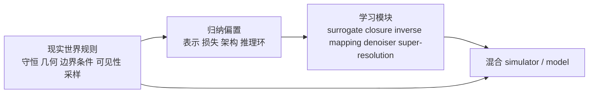

tldr：更好的 simulator 通常保留已知的世界结构，再让 learning 处理求解慢、建模不完整，或难以直接表达的环节。

## 在开始之前：纯 rules 与纯 learning 的对立是个假问题

很多讨论把 rules 与 learning 放在零和对立的两端：一边是解析规则、数值求解和人工建模，另一边是数据、神经网络和端到端学习。现实里的强系统通常没有这么整齐的边界，它们会把两边各自擅长的部分拼在一起。

Simulator 的工作可以概括为：在受约束的状态空间里完成可解释的状态转移，或根据状态生成观测。流体模拟、材料模拟、光线追踪和视觉重建问的其实是同一类问题：哪些状态合法，系统可以如何演化，观测又如何由这些状态产生。

把这个框架拆开来看：

- 流体模拟：状态是速度场和压力场，约束来自 Navier-Stokes 方程与不可压条件，状态转移就是时间步进，观测则是可测量的流速、压力或阻力。
- 材料模拟：状态是应力-应变场和位移场，约束来自本构关系与力平衡，状态转移是载荷路径上的演化，观测是形变、裂纹或断裂行为。
- 光线追踪：状态是场景中光的分布，约束来自渲染方程与几何可见性，“演化”是光线在反射、折射、散射中的传播，观测是最终像素值。
- 视觉重建（NeRF、3DGS）：状态是底层 3D 场景表示，约束来自相机模型与多视图几何一致性，观测是从各视角渲染出的图像。

这个视角会把许多方法之争落到一个更具体的设计问题上：**哪些约束应当写进系统，哪些部分可以留给数据学习。** 约束越多，状态空间越窄，搜索通常越高效，但建模弹性也会降低；交给数据的部分越多，模型越灵活，也越容易出现非法解或 OOD 失效。系统设计本质上是在分配这份约束预算。

现实世界并不缺结构。守恒律、连续性、边界条件、相机投影、遮挡、反射、折射、局部性和时间一致性都是硬约束。既然它们已经存在，直接把它们写成归纳偏置（bias）通常更划算。

我不太认同“rule-based 会被 learning 全面取代”的说法。更贴近工程实践的描述是：规则系统正在演化为带有结构化外壳和学习模块的混合系统。rules 搭骨架，learning 补足昂贵、模糊或难以手工建模的部分。

这也解释了近年的变化：经典计算问题没有被 data driven 方法整体替换。过去的主流做法更倾向于用规则覆盖整套系统；现在，closure、surrogate、逆问题、重建、降噪、超分辨和近似求解等局部任务可以交给学习器。状态空间、几何关系、守恒约束、边界条件和可行解范围也因此更重要，它们限定了学习器可以工作的范围。

顺着这个分工看，我们将在后面讨论三个问题：

- 传统 simulator 为什么天然是 rule-heavy 的？因为 rules 定义了学习器的解空间：守恒、几何、边界条件、可见性、采样结构、相机模型和网格拓扑共同决定什么答案可以接受。
- learning 实际接替了哪些计算？它更适合昂贵的映射、难以写清的局部规律和感知型重建。operator learning 学的是参数到解的映射；DLSS 学的是如何由稀疏、低分辨或带噪信号重建稳定画面。
- learning + rules 为什么往往能组成更强的系统？把已知结构写成归纳偏置后，模型可以将能力集中在剩余部分，同时兼顾效率、泛化和一致性。

注： YC 第一次发布的 RFS，也就是 2024 Summer 提到了此问题。

## 规则系统先解决了什么

先看科学计算。经典 PDE 求解从控制方程出发，再处理离散化、网格和数值稳定性；它的目标从来不是根据相似数据直接给出一个答案。最抽象的写法通常像这样：

$$
\partial_t u + \mathcal{N}[u] = 0
$$

其中 $u$ 是状态，$\mathcal{N}[u]$ 是微分算子。实际求解还要处理离散化、网格、数值稳定性、边界条件、时间推进和误差控制。经典 solver 在设计时已经回答了几个关键问题：哪些解满足物理规律，哪些更新会发散，哪些边界不能被破坏。

这类系统的价值不仅在精度，也在于它清楚哪些操作不能做。它们可能很慢，对复杂逆问题不够友好，在多次查询时成本也高，但能强力约束合法状态空间。

图形学也是一样。早期 [Whitted 1980](https://cseweb.ucsd.edu/~viscomp/classes/cse274/wi26/readings/whitted.pdf) 的递归光线追踪，本质上已经把反射、折射、阴影这些几何-光学关系编码成了一套明确规则。到了 [Kajiya 1986](https://www.cs.rpi.edu/~cutler/classes/advancedgraphics/S13/papers/kajiya_rendering_equation_86.pdf)，渲染方程则把“场景中一点向某个方向的辐射亮度”写成了积分形式：

$$
L_o(x, \omega_o) = L_e(x, \omega_o) + \int_{\Omega} f_r(x, \omega_i, \omega_o) L_i(x, \omega_i) (n \cdot \omega_i) \, d\omega_i
$$

这个公式没有让渲染突然变简单，但它把“图像从哪里来”变成了一个物理上自洽的问题。此后几十年的 path tracing、importance sampling、MIS 和 denoising，基本都围绕这一问题发展。

PDE solver 和 ray tracer 的共同点并不是全手工，而是都把关键结构显式写进了系统：

- 状态空间是显式定义的；
- 合法更新由规则约束；
- 误差分析和稳定性有理论；
- 每个模块都知道自己在近似什么。

这也是为什么经典 simulator 虽然慢，但很少给出奇怪输出。它们会贵，会粗糙，会难调，但不太会输出完全非法的答案。对很多科学和工程任务来说，这种特性本身就是资产。

| 路线 | 先验来自哪里 | 最擅长什么 | 典型短板 | 代表场景 |
| --- | --- | --- | --- | --- |
| 纯 rules | 方程、几何、解析近似、数值格式 | 可解释、稳定、约束清晰 | 慢、难逆、难覆盖复杂感知 | CFD、FEM、路径追踪 |
| 纯 learning | 数据分布、参数拟合、端到端目标 | 快、灵活、适合逆映射与重建 | OOD 脆弱、合法性难保证 | 图像重建、近似 surrogate |
| hybrid | rules 给结构，learning 学剩余误差或映射 | 兼顾效率、泛化与一致性 | 系统设计更复杂 | learned simulators、NeRF、DLSS |

## Learning 接手的是哪些部分

近十年的实践里，learning 最常接手的是物理流程中成本高、但又能稳定复用的局部任务。

第一类是 surrogate / emulator。原始 solver 很贵，而同一个方程族、边界条件或参数扫描会被反复查询。学习器在这里学习的是近似算子：给定参数、几何或初值，快速返回近似解。 [DeepONet](https://arxiv.org/abs/1910.03193)、[FNO](https://arxiv.org/abs/2010.08895) 和 [MeshGraphNets](https://arxiv.org/abs/2010.03409) 都属于这一路线。

第二类是 closure / unresolved scale modeling。许多真实系统里，小尺度效应并不容易显式建模，比如湍流 closure、子网格参数化、复杂材料响应、地球系统中的 parameterization。这里 learning 的角色，是去学一个传统规则写得不完美、或者写出来也很贵的闭合项。你没有抛弃方程；你是在方程里换掉那块最难写清的局部模块。

第三类是 inverse problem。前向模拟往往知道怎么做，但反过来“从观测恢复状态、几何、材料、参数”会很难。这个方向上，learning 往往比纯优化更有优势，因为它天然适合从观测空间回到潜在变量空间。像 [NVDiffrec](https://arxiv.org/abs/2111.12503) 这种 inverse rendering 系统，就是把“从图像反推几何、材质、光照”这件事变成可微优化与学习结合的问题。

第四类是 reconstruction / denoising / super-resolution。这在实时图形里尤其明显。路径追踪可以给你高质量信号，但采样预算永远不够，于是图像会噪、分辨率会低、时序会抖。此时 learning 不是去接管光线传播本身，而是去学习如何从稀疏、带噪、不完整的信号中恢复出更稳定的图像。DLSS 与 Ray Reconstruction 正是这个范式。

因此，learning 常被用于四类工作：昂贵但重复的查询，难以写清的闭合项，从观测到隐变量的逆映射，以及从不完整信号到高质量结果的重建。

Data driven 方法的发展没有削弱 rules 的作用。它更像是在提醒我们：先把问题拆对，再决定哪些部分值得学习。

## 规则怎样进入学习系统

“规则作为归纳偏置”很容易被说成一句抽象口号。把它拆成表示、目标、架构和推理四层，会更容易落到具体设计上。

### 1. 表示层 bias：先决定状态空间长什么样

让模型直接输出像素、直接输出网格节点、直接输出隐式场，差别很大。表示本身就决定了模型更容易学到什么，也更难学到什么。

- 在 PDE 中，网格、点云、谱域、函数空间表示都不一样。
- 在图形学中，mesh、radiance field、Gaussian primitives 也不一样。
- 在时序系统中，显式 latent state 与纯 observation model 也完全不同。

不少进展先发生在表示层。 [Instant-NGP](https://research.nvidia.com/publication/2022-07_instant-neural-graphics-primitives-multiresolution-hash-encoding) 的关键是多分辨率 hash encoding，而不是更大的网络；[3D Gaussian Splatting](https://repo-sam.inria.fr/fungraph/3d-gaussian-splatting/) 则把场景改写为可高效渲染的 Gaussian primitive。对神经图形和 AI4S 而言，选对表示往往比单纯加深网络更重要。**表征学习依旧重要，或者是深度学习中最重要的问题。**

### 2. 目标层 bias：把什么算错写进 loss

PINNs 最直观的一点，就是它把 PDE residual 写进损失函数。你不是只拿数据点监督，而是显式告诉网络：这些导数关系、这些边界、这些守恒不能违背。

[Karniadakis 等人的综述](https://www.nature.com/articles/s42254-021-00314-5) 将 physics-informed learning 描述为把 noisy data 与 physical law 一起纳入训练。对系统设计来说，重点在于 loss 的定义会决定模型朝哪个可行空间优化；它不是训练末尾才补上的附属项，而是非常重要的 surrogate。

### 3. 架构层 bias：把相互作用模式写进网络

[DeepONet](https://arxiv.org/abs/1910.03193) 用 branch/trunk 结构学习 operator；[FNO](https://arxiv.org/abs/2010.08895) 把积分核参数化搬到 Fourier 空间；[MeshGraphNets](https://arxiv.org/abs/2010.03409) 直接把 mesh 上的局部相互作用和拓扑关系写进图网络；[Geo-FNO](https://jmlr.org/beta/papers/v24/23-0064.html) 则显式处理一般几何而不只是在规则网格上做 FFT。

这些方法的共同点都是：它们没有假装世界是一张任意表格。它们把局部性、拓扑、频域结构、函数到函数映射这些先验提前塞进了架构里。

### 4. 推理层 bias：让学习器嵌在 solver 或 rendering loop 里

最强的 hybrid 系统往往会让 learning 模块直接工作在原有求解环中。比如 differentiable rendering 把可微渲染器放在优化回路里；很多 scientific ML 工作把学习器作为 emulator、closure 或预条件器，嵌进原有数值流程。

这一层特别像现实中的工程智慧：保留旧系统里可靠的部分，把最昂贵的一段换成 learned component。

我会把这个图当成全文最核心的 mental model：规则不是 learning 的对立面，而是 learning 的压缩先验。

## Case 1：科学计算中的 learned simulator

Scientific machine learning 最能说明 learning + rules 是怎样落到具体系统里的。

### 从 PINNs 开始：把 PDE 直接写进训练目标

[PINNs](https://maziarraissi.github.io/PINNs/) 最经典的写法，是用网络近似 $u(t, x)$，再用自动微分构造 PDE residual，把初值、边界和方程残差一起放进损失。它的吸引力非常大：

- 不需要完全依赖大规模标注数据；
- 对 inverse problem 很友好；
- 可以直接利用控制方程；
- 在数据稀缺场景里能把先验变成有效监督。

PINNs 也说明，把 physics 加进 loss 并不会自动让问题变简单。 [Nature Reviews Physics 2021 综述](https://www.nature.com/articles/s42254-021-00314-5) 对其能力和限制都有清楚总结：这类方法在 forward / inverse problems 上很有潜力，但可扩展性、鲁棒性和标准化 benchmark 仍是核心难题。物理先验很重要，训练方式同样重要。

在我看来，PINNs 是较早一类把规则直接放进 learning 的方法。它让整个领域看到，神经网络可以利用的不只是 i.i.d. 样本，也可以是问题结构；但这条路远没有结束。

### 从单个解到解算子：DeepONet 与 FNO

接下来很关键的一步，是从学某一个 PDE 的某一个解转向学一族 PDE 问题的解算子。

[DeepONet](https://arxiv.org/abs/1910.03193) 的意义正在这里。它把问题写成函数到函数的映射，用 branch net 编码输入函数，用 trunk net 编码输出位置。它要学的不再只是一个静态近似器，而是一个 operator：

$$
\mathcal{G}: a(x) \mapsto u(x)
$$

这一步很像把 simulator 从单次求解器升级成可复用的映射器。你不再为每个参数实例单独迭代求解，而是训练一个可反复调用的近似算子。

[FNO](https://arxiv.org/abs/2010.08895) 更进一步，把 kernel 参数化到 Fourier 空间。最早一批结果已经显示：在 Burgers、Darcy、Navier-Stokes 等 PDE 上，它可以比传统求解器快很多，并在某些设定下表现出 zero-shot super-resolution 的能力。对于需要反复查询同一类 operator 的任务，先学习 operator 往往比每次从头进行数值求解更划算。

### 从规则网格到复杂拓扑：MeshGraphNets 与 Geo-FNO

不过，现实问题很快就会告诉你：规则网格不是全部世界。工程问题常常牵涉复杂边界、不规则网格、变形体和多尺度耦合。

[MeshGraphNets](https://arxiv.org/abs/2010.03409) 很有代表性。它直接在 mesh graph 上做 message passing，并把 adaptivity 纳入 forward simulation。离散结构本身就是物理 bias：模型不必把一切展平为规则 tensor，而可以利用系统原有的拓扑。

[Geo-FNO](https://jmlr.org/beta/papers/v24/23-0064.html) 处理了另一项限制。经典 FNO 依赖 FFT，更适合规则网格和矩形域；Geo-FNO 把任意几何 deform 到 latent uniform grid，再在潜空间里应用 FNO。当问题不适合原有架构时，常见的做法是重写 bias，而不是放弃 bias。

### 近一年的方向：更强调验证，也更强调系统协作

近一年里，有三项变化尤其值得注意。

首先，领域开始更认真地讨论 benchmark 和 OOD。 [2025 年关于复杂几何流动预测的 benchmark](https://www.nature.com/articles/s44172-025-00513-3) 指出，传统 simulation 准确但昂贵，SciML 被用来追求更快、更可扩展的方案；几何变复杂、分布发生偏移或精度要求提高后，方法之间的差距会迅速显现。问题已经从“能不能学”转向“学出的 surrogate 在什么边界内可靠”。

其次，研究重新把 solver 放回闭环。 [SC-FNO](https://openreview.net/forum?id=DPzQ5n3mNm) 等 2025 年工作不只拟合解本身，还强调 sensitivity、inverse problems 和 differentiable numerical solvers。数值结构正在被重新引入 operator learning。

最后，emulator 开始被当作软件组件，而不是论文里的 demo。 [2026 年 climate emulator perspective](https://www.nature.com/articles/s43247-026-03238-z) 提出 simulator 与 emulator 要 co-design，benchmark 要 machine-learning-ready，emulator 也应作为可靠的软件组件部署和分析。这给 learned simulator 的工程化提出了更清楚的标准。

| 方法 | 学什么 | rules 从哪里进入 | 优势 | 典型问题 | 代表来源 |
| --- | --- | --- | --- | --- | --- |
| PINNs | 单个 PDE 解或逆问题参数 | PDE residual、边界条件、守恒写进 loss | 小样本、逆问题友好 | 训练病态、尺度化难 | [PINNs](https://maziarraissi.github.io/PINNs/), [综述](https://www.nature.com/articles/s42254-021-00314-5) |
| DeepONet / FNO | 参数到解的 operator | branch-trunk 结构、频域卷积 | 多次查询快、可学函数到函数映射 | OOD 与复杂几何受限 | [DeepONet](https://arxiv.org/abs/1910.03193), [FNO](https://arxiv.org/abs/2010.08895) |
| MeshGraphNets | 网格上动力学 rollout | mesh topology、局部相互作用、adaptivity | 适合复杂拓扑和形变 | 长时稳定性、层级设计难 | [MeshGraphNets](https://arxiv.org/abs/2010.03409) |
| recent physics-informed operator variants | 在 operator learning 上继续加敏感度、几何与 solver 结构 | differentiable solvers、geometry-aware mapping、benchmark co-design | 更接近真实工程流程 | 系统复杂、验证要求高 | [Geo-FNO](https://jmlr.org/beta/papers/v24/23-0064.html), [SC-FNO](https://openreview.net/forum?id=DPzQ5n3mNm), [2025 benchmark](https://www.nature.com/articles/s44172-025-00513-3) |

Scientific ML 的主线可以概括为：在 PDE family 中找出最值得 amortize 的计算，再让网络学习这一部分。

## Case 2：图形学中的 differentiable rendering、NeRF 与 3DGS

科学计算说明 rules 可以进入 loss 和 operator bias；图形学进一步说明，许多看上去 data-driven 的方法，仍完整保留了渲染规则。

### Differentiable rendering：先有渲染环，再谈学习

[differentiable rendering / inverse rendering](https://arxiv.org/abs/2111.12503) 的思路很朴素：我有图像观测，我想恢复几何、材质、光照，于是我构造一个可以反传梯度的渲染器，把差异通过渲染过程回传到隐变量上。

这个流程的基础并不是 learning，而是以下显式结构：

- 相机模型；
- 可见性与投影；
- 光照与材质参数化；
- 可微 rasterization 或可微 Monte Carlo rendering；
- 几何表示与 mesh 提取。

[NVDiffrec](https://arxiv.org/abs/2111.12503) 以及 NVIDIA 关于 [Differentiable Slang / nvdiffrec](https://developer.nvidia.com/blog/differentiable-slang-example-applications/) 的材料都很典型：学习和优化可以恢复 shape、material、lighting，但前提是渲染 loop 本身高度结构化。learning 利用渲染方程求解 inverse problem。

### NeRF：看起来像神经场，实际上站在传统渲染肩膀上

[NeRF](https://arxiv.org/abs/2003.08934) 常被当作神经网络直接学习 3D 世界的代表，但它把神经表示与 classic volume rendering 紧紧绑在一起。

NeRF 输入 3D 位置和视角方向，输出密度与辐射颜色；图像由沿 camera rays 的采样、积分和透射率累积生成，这是一套明确的体渲染过程。分工如下：

- 相机姿态是已知或另行估计的；
- 射线采样是写死的几何过程；
- 颜色合成遵守体渲染积分；
- 优化目标依赖多视图几何一致性。

NeRF 将场景表示神经化，同时保留了渲染过程的结构，这正是 hybrid 的典型形式。

### Instant-NGP：结构化表示带来的速度

NVIDIA 的 [Instant-NGP](https://research.nvidia.com/publication/2022-07_instant-neural-graphics-primitives-multiresolution-hash-encoding) 重要的不只是速度。它说明，提升 learning-based simulator / renderer 不一定要依赖更大的模型，更强的表示 bias 也能改变成本结构。

它用多分辨率 hash table 存储 trainable feature，再配一个很小的网络。这个设计显著减少了训练和推理成本，把高质量 neural graphics primitive 的训练时间从论小时或天压缩到论秒或分。当空间结构进入编码方式，网络就不必从头学习那份几何组织。

### 3D Gaussian Splatting：选择能直接渲染的场景表示

[3D Gaussian Splatting](https://repo-sam.inria.fr/fungraph/3d-gaussian-splatting/) 的 project page 给出了很直接的结果：方法结合 3D Gaussians、interleaved optimization / density control 和 visibility-aware rendering，实现了 1080p 下 100fps 以上的高质量 novel-view synthesis。

3DGS 提供的启发不只是“又快又好”。当问题已有明确的几何和渲染结构时，把网络从通用逼近器转为强结构化表示的一部分，往往更符合计算路径。

从 NeRF 到 Instant-NGP，再到 3DGS，规则始终没有离场。camera model、sampling path、visibility 和 compositing 被保留下来；网络只学习 appearance、density、local detail 和更难写清的部分。

## Case 3：实时图形里的 ray tracing、denoiser 与 DLSS

实时图形里的 DLSS 则把这种分工放到了更容易观察的工程场景中。

### 为什么光线追踪天然需要 hybrid

光追或路径追踪遵守几何、阴影、反射、折射和全局光照的生成机制。代价也很直接：采样预算不够时，结果会有明显噪声。实时渲染的预算有限，单纯增加 sample 不是可持续的办法。

工程上的处理方式通常是：

- 用 ray tracing 负责产生受物理约束的底层信号；
- 用 denoiser / reconstruction 负责把有限样本变成可看的图像；
- 用 super-resolution 和 frame generation 去换取实时性。

这就是一个很清晰的 hybrid stack：底层结构仍然是 rule-based 的，上层重建则 increasingly learned。

### DLSS 3.5：用统一的 learned reconstructor 取代一组 denoisers

[NVIDIA 对 DLSS 3.5 Ray Reconstruction 的官方描述](https://www.nvidia.com/en-us/geforce/news/gfecnt/20238/nvidia-dlss-3-5-ray-reconstruction/) 指出，Ray Reconstruction 通过 single neural network 取代多个 hand-tuned denoisers，以改善 ray-traced effects 的图像质量。

DLSS 3.5 的重点并不是 AI 比物理更懂光追，而是它能在已有 ray-traced signal 因预算受限而噪声很大时，用统一的 learned reconstructor 替换一组依赖手工调参的专用 denoiser。

这很像科学计算里的 learned closure：底层规律还在，学习器接管的是那个最昂贵、最难手工调、也最依赖 perceptual prior 的部分。

### DLSS 4 与 4.5：学习模块仍依赖渲染管线

截至 2026 年 3 月 15 日的 NVIDIA 官方资料，[DLSS 4 Technology 页面](https://www.nvidia.com/en-us/geforce/technologies/dlss/) 写明 DLSS Super Resolution、Ray Reconstruction 和 DLAA 使用 transformer AI models；[2026 年 1 月 14 日的 DLSS 4.5 公告](https://www.nvidia.com/en-us/geforce/news/dlss-4-5-super-resolution-available-now/) 则说明，其 Super Resolution 已升级到 2nd generation transformer model。

工业系统与学术系统的结论一致：复杂重建任务可以持续用 learned module 替换 hand-crafted heuristics。它们仍依赖既有渲染管线。没有底层 G-buffer、ray-traced samples、时间历史和渲染约束，神经模块也无从着力。

DLSS 很适合作为这个分工的教学案例：

- 真实世界里，学习模块往往是在替代 heuristics，不是在替代物理；
- 可落地的 AI 渲染，通常依赖高度结构化的输入；
- 最强系统来自“signal generation by rules + signal reconstruction by learning”。

| 系统 | rules 提供什么 | learning 负责什么 | 为什么 hybrid 更强 | 代表来源 |
| --- | --- | --- | --- | --- |
| Ray tracing / path tracing | 可见性、反射折射、采样与光传输 | 通常不学核心传播，只学降噪或重建 | 底层信号可信，上层重建更高效 | [Whitted 1980](https://cseweb.ucsd.edu/~viscomp/classes/cse274/wi26/readings/whitted.pdf), [Kajiya 1986](https://www.cs.rpi.edu/~cutler/classes/advancedgraphics/S13/papers/kajiya_rendering_equation_86.pdf) |
| NeRF | 相机模型、ray sampling、volume rendering | density / radiance field 表示 | 学习场景表示，但不放弃渲染结构 | [NeRF](https://arxiv.org/abs/2003.08934) |
| 3DGS | visibility-aware rendering、Gaussian splat compositing | 场景表示与优化 | 用更适合渲染的表示替代大黑箱 | [3D Gaussian Splatting](https://repo-sam.inria.fr/fungraph/3d-gaussian-splatting/) |
| DLSS-RR | 渲染管线、ray-traced buffers、时序结构 | denoising、super-resolution、frame reconstruction | 用 learned reconstructor 替代 hand-tuned heuristics | [DLSS 3.5 RR](https://www.nvidia.com/en-us/geforce/news/gfecnt/20238/nvidia-dlss-3-5-ray-reconstruction/), [DLSS 4](https://www.nvidia.com/en-us/geforce/technologies/dlss/) |

## 给 simulator 划分学习与规则的边界

落到系统设计时，问题会更具体：哪些部分值得学习，哪些部分必须由规则守住？

### 更适合交给 learning 的部分

- 逆问题：从观测恢复隐变量、参数、材质、几何、状态。
- surrogate / emulator：同类问题要重复查询很多次时，学习 operator 很划算。
- closure / unresolved physics：子网格、经验项、复杂材料响应、难显式建模的交互。
- 感知驱动的重建：降噪、超分、插帧、缺失信息补全。
- 多模态和统计规律很强的部分：例如复杂视觉外观、真实纹理、噪声模型。

### 更应该写进 rules 的部分

- 合法状态空间的定义：什么是守恒、可行、稳定、无穿透、无负密度。
- 几何和拓扑约束：网格邻接、可见性、边界条件、物体接触关系。
- 基础生成机制：光如何传播、流体如何守恒、边界如何生效。
- 评估接口：什么叫误差、什么叫 physically valid、什么叫视觉一致。
- 高风险硬约束：涉及安全、科学结论、工程认证的部分。

### 最值得优先考虑的 hybrid 形态

如果需要一个默认起点，可以优先考虑三种结构：

1. solver outside, learner inside：让学习器当 closure、preconditioner、sub-grid model。
2. learner outside, solver inside：让学习器预测参数、初值、边界或 proposal，再交给 solver 修正。
3. structured generator + learned reconstructor：底层用 rules 产生受约束信号，上层用 learning 做重建、补全和加速。

这三种结构覆盖了本文的大多数成功案例。设计时最重要的是划清模块边界：它应当可学、值得学，并且不会破坏系统的合法性。

## 结语

更好的 simulator / model 会把已经确定的结构——守恒、几何、边界条件、可见性、采样和拓扑——写成 bias，再让 learning 处理那些昂贵、模糊或难以显式建模的剩余部分。

这也是我对 world model 的判断。更强的系统不应只接着预测下一个 token 或下一帧；它还需要在受现实规则约束的 latent state space 中演化状态。DLSS、NeRF 和 neural operator 已经展示了一种可行的分工：规则产生约束，学习处理重建、近似或局部误差。

把现实世界的核心规则转化为归纳偏置，是构建更可靠 AI 的实用途径。对具体系统而言，顺序也很明确：先确定不能被破坏的约束，再判断哪些复杂剩余项值得交给 learning。

## 参考资料
- J. Turner Whitted, [An Improved Illumination Model for Shaded Display](https://cseweb.ucsd.edu/~viscomp/classes/cse274/wi26/readings/whitted.pdf), 1980.
- James T. Kajiya, [The Rendering Equation](https://www.cs.rpi.edu/~cutler/classes/advancedgraphics/S13/papers/kajiya_rendering_equation_86.pdf), SIGGRAPH 1986.
- Maziar Raissi et al., [Physics Informed Deep Learning / PINNs project page](https://maziarraissi.github.io/PINNs/).
- George Em Karniadakis et al., [Physics-informed machine learning](https://www.nature.com/articles/s42254-021-00314-5), Nature Reviews Physics, 2021.
- Lu Lu et al., [DeepONet](https://arxiv.org/abs/1910.03193), 2019/2020.
- Zongyi Li et al., [Fourier Neural Operator for Parametric Partial Differential Equations](https://arxiv.org/abs/2010.08895), 2020.
- Tobias Pfaff et al., [Learning Mesh-Based Simulation with Graph Networks](https://arxiv.org/abs/2010.03409), 2020/ICLR 2021.
- Zongyi Li et al., [Fourier Neural Operator with Learned Deformations for PDEs on General Geometries](https://jmlr.org/beta/papers/v24/23-0064.html), JMLR 2023.
- Huayu Deng et al., [Sensitivity-Constrained Fourier Neural Operators for Forward and Inverse Problems in Parametric Differential Equations](https://openreview.net/forum?id=DPzQ5n3mNm), ICLR 2025.
- A. Radha et al., [Benchmarking scientific machine-learning approaches for flow prediction around complex geometries](https://www.nature.com/articles/s44172-025-00513-3), Communications Engineering, 2025.
- A. Mankin et al., [Rewiring climate modeling with machine learning emulators](https://www.nature.com/articles/s43247-026-03238-z), Communications Earth & Environment, 2026.
- Ben Mildenhall et al., [NeRF: Representing Scenes as Neural Radiance Fields for View Synthesis](https://arxiv.org/abs/2003.08934), 2020.
- Thomas Muller et al., [Instant Neural Graphics Primitives with a Multiresolution Hash Encoding](https://research.nvidia.com/publication/2022-07_instant-neural-graphics-primitives-multiresolution-hash-encoding), SIGGRAPH 2022.
- Jon Hasselgren et al., [Extracting Triangular 3D Models, Materials, and Lighting From Images](https://arxiv.org/abs/2111.12503), CVPR 2022.
- NVIDIA Developer Blog, [Differentiable Slang: Example Applications](https://developer.nvidia.com/blog/differentiable-slang-example-applications/), 2023.
- Bernhard Kerbl et al., [3D Gaussian Splatting for Real-Time Radiance Field Rendering](https://repo-sam.inria.fr/fungraph/3d-gaussian-splatting/), SIGGRAPH 2023.
- NVIDIA, [NVIDIA DLSS 3.5 Ray Reconstruction](https://www.nvidia.com/en-us/geforce/news/gfecnt/20238/nvidia-dlss-3-5-ray-reconstruction/), 2023.
- NVIDIA, [DLSS 4 Technology](https://www.nvidia.com/en-us/geforce/technologies/dlss/), accessed 2026-03-15.
- NVIDIA, [NVIDIA DLSS 4.5 Super Resolution Available Now](https://www.nvidia.com/en-us/geforce/news/dlss-4-5-super-resolution-available-now/), 2026-01-14.
