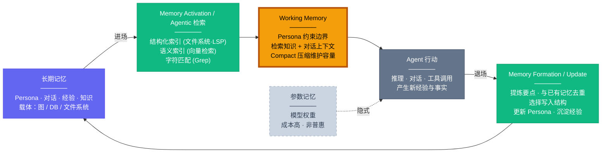

长期记忆不是简单存档，它更接近持续学习的工程入口。

很长一段时间里，Agent Memory 总是被等价于一个外接数据库问题。这抓住了局部，却错过了重点。Memory 从来不只是存储层，而是一套让长期认知状态形成、激活、行动后再更新的循环机制。

如果沿着我前面那篇文章的脉络看，这个问题会更清楚。在[《从智能体的认知结构到智能体框架》](/blog/2026/03/03/cognitive-architecture-to-agent-framework/)里，我借 CoALA 讨论了智能体的记忆层次——Memory 正是从那里引出的一个关键问题：它既是认知架构的一部分，也是一套需要长期运转的工程系统。

这篇文章想把 Agent Memory 目前比较零散的讨论整理成一张相对完整的全景图。行文会分四步走：先澄清几个常见误解——尤其是把记忆按成本结构拆成全上下文、外部记忆、参数记忆三层，说清楚本文主体落在哪一层；再描述这套记忆系统的解剖结构（有哪些记忆类型、怎么激活与写入）；接着回顾这张图是怎么被一步步建立起来的；最后落到评测——先给出评估框架，再说明为什么今天的评测仍然跟不上 Memory 的前沿推进，并尝试设计一套系统化的评测蓝图。

这里先划清边界：本文讨论的是长期记忆如何形成、组织、更新、失效和评估；Working Memory 在本文中是长期记忆影响行动的运行时入口，而不是本文要展开的对象。当前推理现场如何选择、压缩、隔离和调度信息，是另一条独立的线，我放在[《Context is All You Need：智能体的上下文工程》](/blog/2026/06/11/agent-context-engineering/)里专门展开，本文不赘述。

如果只用一句话概括全文判断：Agent Memory 的竞争点已经不再是有没有记忆库，而是能不能把长期认知状态持续、正确、可治理地流转起来。

## Memory 不是数据库，而是认知循环

先说结论：Memory 的重点不是“存了多少”，而是长期记忆能否形成稳定的进场、行动、退场机制：什么被留下来，什么时候被激活，行动之后又如何被修正和治理。

### 为什么它不等于 RAG

RAG 当然重要，但它解决的只是检索这一侧的问题——"当下需要什么知识"，而不是"什么值得长期保留""旧记忆如何修正""哪些内容已经过时""经验该写成规则还是写成事实"。把 Memory 直接等同于 RAG，会把整个系统简化为一次性读取。一个 Memory 系统至少还包含：对当前对话与行动过程的压缩、对长期经验的沉淀、对 Persona 的更新、对冲突信息的消解，以及对无效内容的遗忘。

### 为什么长期记忆必须经过 Working Memory 才能生效

长期记忆并不会直接参与行动。无论它存成向量、图、数据库还是文件，最后都必须被检索、筛选、压缩，然后进入当前决策周期的上下文里。这个位置就是 Working Memory。它像一个有限容量的工作台：Persona 约束、当前会话上下文、外部反馈、从长期记忆里召回的知识和经验，都在这里相遇。模型推理时面对的不是全部记忆，而是这块工作台上此刻被允许在场的信息。Memory 是否有效，最终体现在长期记忆能否在合适的时刻被正确激活，并以足够克制的形式进入 Working Memory。

### 三层记忆与成本结构

在进入主体之前，有一个最容易被混淆的分野需要先讲清楚：当我们说"给 Agent 加记忆"时，知识到底住在哪里？按照"知识存放的位置 + 写入与调用的成本结构"，记忆可以分成三层，它们互补而非替代，孰优孰劣取决于场景。

- **L1 全上下文（Full Context）**：知识直接住在当前上下文窗口里，代表技术是长上下文与 KV-cache / prompt caching。它的成本结构是**零训练、推理期按 token 持续付费、且随历史增长而退化**（context rot）。它本质上是 Working Memory 的物理基底——决定了工作台能放下多少、放多久。这一层属于运行时上下文调度的范畴，不是本文的展开对象。
- **L2 外部记忆 / 非参数记忆（RAG-like）**：知识以显式形式存放在模型外部——向量库中的文档、文件系统中的 Rules、知识图谱中的实体关系。它可以被即时写入、精确更新、按需检索，并且对人类完全可见可编辑。**这一层是本文的主角**。
- **L3 参数记忆（Parametric Memory）**：知识被编码进模型权重，通过训练把重复经验压缩成模型内部的适应能力，推理时无需显式检索就能发挥作用。它的调用成本极低且响应即时，但写入成本极高（需要微调或持续训练）、更新周期长，且不透明、不可审计。

把三层并排看，参数记忆与外部记忆的关系，本质上是一场**推理成本与训练成本之间的权衡**：L3 把成本前移到训练阶段，换取推理期近乎零成本的即时调用；L2 把成本留在推理期（检索 + 上下文占用），换取写入和更新的即时与可控；L1 则完全放弃可逐步加载，依靠更好的长上下文技术与缓存来避免成本失控。因此哪一层划算完全取决于场景——高频、稳定、大规模复用的知识倾向于沉淀进 L3，需要即时写入、精确更新、可审计、强个性化的知识倾向于留在 L2。可能只用到一次的就留在 L1。前面那张认知循环图里用虚线画出的参数记忆节点，对应的就是 L3：它隐式影响行为，但不是普惠路线。

值得单独说两句的是 L3 的**训练路线**，因为这里有一个常见的错误直觉：既然想让模型"记住"一批新知识，直接拿这些文档做持续预训练（continued pretraining）不就行了？实际上这条路很差——小规模语料里每个事实往往只出现一两次，而大规模预训练之所以能让模型吸收一个事实，靠的是该事实以多种措辞反复出现；直接续训既低效又容易灾难性遗忘。更可行的路线是**先从源文档/问题出发合成一批针对性的训练数据，再做后训练**。[Synthetic Continued Pretraining](https://arxiv.org/abs/2409.07431)（EntiGraph）就是这个思路的代表：它从小源语料中抽取显著实体，再通过在实体之间反复连边生成一个更大、更多样、更易学习的合成语料，在其上继续训练；训练后模型无需原文就能回答相关问题，而当原文在推理时可用，参数化的知识还能与 RAG **复利叠加**。至于具体的参数化写入手段，[LoRA](https://arxiv.org/abs/2106.09685) 与 [Prefix-Tuning](https://arxiv.org/abs/2101.00190) 的机制我在[《PEFT：参数高效微调》](/blog/2026/03/05/peft-parameter-efficient-fine-tuning/)里已经展开过，这里只点出它们在 Memory 语境下的特殊价值：在 KV-cache 已经普及的今天，Prefix-Tuning 训练出的连续前缀与被缓存复用的前缀天然对齐，可以低成本地挂载一段参数记忆；LoRA 则提供可插拔、可叠加的低秩增量，契合"按场景切换不同参数记忆"的需求。

但要强调的是，参数记忆同样绕不开**时间性**这道坎：记忆会随时间被修正、被推翻，参数化的知识也必须能跟着改写，这意味着合成训练数据时就要把时间有效性纳入进来——而这非常难，目前远谈不上解决。事实上，**时间性是横跨三层的共性难题**：L1 表现为旧上下文失效与 context rot，L2 表现为旧记忆与新事实的冲突消解，L3 则表现为 weight-level 的记忆编辑极难精确。后文会反复回到这个问题。

### 真正难的是读写与治理

一旦把长期记忆放回生命周期里，讨论的优先级就会重新排序。图结构要看，写入质量更要看；检索算法要看，"什么时候该写、什么时候该改、什么时候该删"也要看。Memory 问题从来不只是存储结构问题，而是生命周期管理问题——它要求系统同时处理激活、写入、更新、删除，进而还要处理 provenance、冲突消解、时间有效性和 rollback。

理解了这个前提之后，下面进入全景图的具体展开。

## Agent Memory 的全景图

### Memory 是认知循环，不是数据库

Memory 不是记忆检索加数据库，而是一套让长期记忆在行动中持续生长和修正的完整认知流程。Agent 从长期记忆中检索所需的知识与经验，将其加载到 Working Memory 中形成当前上下文——这是**进场**；Agent 在此上下文中推理和行动，产生新的经验与事实；随后将这些新信息提炼、去重后写回长期记忆，同时更新 Persona——这是**退场**。进场附带记忆激活，退场附带写入与更新，Working Memory 是这个认知闭环的运行时入口，而非某个可有可无的缓存层。

- **Working Memory**：是整个系统的枢纽。所有记忆经检索汇聚于此，所有新经验经此提炼后写回，Compact 维护其有限容量
- **长期记忆**：存储长期记忆类型，以图/DB/文件系统为载体
- **Agentic 检索/写入**：构成读写两端。检索层由 Agent 统一调度三类索引技术；写入层决定什么值得记住、以什么结构存储
- **参数记忆**：隐式影响行为，成本高，非参数记忆才是普惠路线

以上是 Memory 系统的运转骨架——认知循环定义了进场、行动、退场的流转方式。下面进入骨架的填充：Agent 的记忆到底可以被拆分成哪几种类型，它们各自承担什么职能。

### 五种记忆类型

当我们问"Agent 的记忆应该被分解为哪些部分"时，目前的实践经验指向五个层次：**Persona 记忆、Working Memory、情景记忆、经验记忆和语义知识**。这五者并非平行罗列，而是各自承担不同的认知职能：Persona 定义行为边界——Agent 是谁、该以什么姿态行动；Working Memory 是当前决策发生的运行态入口；对话记忆是工作台压缩后的持久化产物，保留交互脉络；经验记忆沉淀"下次该怎么做"的操作性知识；语义知识则回答"关于世界知道什么"。其中 Working Memory 更接近运行态接口，Persona、情景记忆、经验记忆和语义知识则构成长期记忆管理的主体。

**Persona Memory**：是 Agent 的人格基底。它定义了 Agent 是谁——包括初始的人格设定、回复与思考的行为规范，以及在长期交互中逐渐演化出的偏好与风格。对于 Openclaw、Nanobot、世界模拟等需要拟人角色的场景，Persona 是刚需；而即便是工具型 Agent，它在长期服务中也会从用户反馈里沉淀出隐式的 Persona——用户的偏好本身就成了 Agent 行为规范的一部分。Persona 记忆在 CoALA 框架中最接近程序记忆（Procedural Memory）的概念，但它又不完全被这个框架容纳：程序记忆强调的是怎么做，而 Persona 同时还规定了以什么姿态做和什么不该做。我选择在这里单独列出来，因为它拥有工程上单独维护的价值。

**Working Memory**：是 Agent 的当前认知工作台。它不是长期存储，而是一个容量有限的活跃区域——所有从长期记忆中检索出的知识、当前对话的上下文、以及 Persona 施加的约束，都汇聚于此形成 Agent 每一步推理的输入。对话的连续性很大程度上依赖 Working Memory 的管理：通过 Compact 等压缩技术在信息不丢失的前提下维护其有限容量，使 Agent 能够在长对话中保持连贯。早期的记忆研究几乎等同于对话上下文管理，本质上就是在解决 Working Memory 的容量瓶颈问题；但在本文里，它主要被当作长期记忆生效的入口，而不是单独展开的工程对象。

**Episodic Memory**：是 Working Memory 压缩后写入长期记忆的持久化产物，是时间序列形式的记忆。Working Memory 是运行态的工作台，只存在于当前 session；而情景记忆则跨 session 存活，属于长期记忆的一部分。在一次长对话中，Agent 与用户会产生大量信息交换，其中一部分会被提炼写入经验或语义知识，一部分会更新 Persona，但总有相当数量的内容不属于以上任何一类——它们是讨论的脉络、用户的临时意图、尚未定论的探索方向、或者仅仅是"我们聊过这件事"这个事实本身。这些内容对用户而言可能仍有价值，却不值得被正式归档为经验或知识。当 Working Memory 因容量限制不得不压缩历史上下文时，这些内容作为压缩与提炼的产物被持久化为对话记忆，使得 Agent 在后续 session 中仍能接续先前的对话脉络。它在工程上应与语义知识分离——语义知识是关于世界的、跨会话持久有效的事实，而情景记忆是关于交互本身的、随会话生命周期而生灭的上下文快照。Memory 研究的初期几乎等同于对话连续性研究，所解决的正是这一层问题。

**Experience Memory**：是 Agent 从行动中习得的操作性知识。当 Agent 不再局限于聊天而真正进入生产环境执行任务时，它在行动过程中会积累成功与失败的经验——这些经验可以自动提炼沉淀（如自动进化机制），也可以由人类手动填充（如 Claude Code 中的 Skills 和 Rules）。经验记忆是 Agent 从对话工具进化为行动实体的关键增量，它回答的是在类似场景下应该怎么做这个问题。

**Semantic Memory**：则是 Agent 关于世界的事实性认知——实体之间的关系、领域内的概念体系、用户告知过的具体事实。它不同于经验记忆的操作导向，而是纯粹的知道什么：知道用户的地址、知道某个 API 的调用约定、知道两个概念之间的因果关系。语义知识是检索的主要对象之一，也是最容易用结构化方式（知识图谱、数据库）来组织的记忆类型。

### 存储结构选型

前面的三层框架已经界定了参数记忆与非参数记忆的边界，也说明了本文主体落在非参数记忆这一层。这里要进一步追问的是：非参数记忆内部，应该用什么结构来组织？

记忆需要结构，可能是图、结构化数据库、或者文件系统——但结构本身不是目的。**如何生长、如何修正、如何检索来获取，比结构长什么样子更重要。**一个精心设计的知识图谱如果缺乏有效的更新机制，很快就会腐化为过时的静态快照；而一个看似简陋的文件系统，只要配合良好的写入策略和检索手段，反而能持续生长。

目前实践中浮现出两条主要的结构化思路。一条是**图结构**——知识图谱天然擅长表达实体之间的关系网络，适合存储语义知识中关系密集的部分，支持多跳推理和关联发现。另一条是**文件系统的层次结构**——Agent 天生适合操作文件系统，层次化的目录和文件可以承载 Persona 定义、Skills/Rules、经验摘要等多种记忆内容，且对人类完全可读可编辑。这两条思路并无优劣之分，选择取决于记忆内容的特征：关系密集的语义知识倾向于图，操作性的经验和规范倾向于文件，而事实性记录可能更适合结构化数据库。实际系统往往混合使用多种载体，关键在于每种载体上的生长与修正机制是否健全。

### 激活与写入：长期记忆的两端

怎么让长期记忆在需要时被激活，以及怎么把新的内容写回长期记忆，是 Memory 系统中两个同等重要的侧面。它们都应该由 Agent 自身驱动——不是被动地响应查询或接收写入指令，而是由 Agent 自主判断何时该激活、激活什么、何时该写、写成什么结构。同时，激活和写入的效果都高度依赖于存储结构的设计本身：结构决定了什么样的召回路径是可行的，也决定了写入时信息应该被安放在哪里。更进一步说，agency 其实不必停在"决定何时读、何时写"这一层——记忆的**组织结构本身**（怎么链接、怎么归类、怎么随新经验重组）同样可以交给 Agent 来维护，而不是由一套预先写死的控制流去编排。

在 Memory 研究的早期，RAG 就是核心——记忆约等于检索，关注点是从外部文档中找到相关段落。但现在 RAG 只是 Memory 的一个组件。长期记忆可以有不同的激活路径：

- **字符匹配（Grep/Glob/BM25）**：精确的文本模式匹配，适合已知关键词的快速定位，在非结构化数据中尤其实用
- **语义检索（RAG）**：基于向量相似度的语义匹配，擅长处理模糊意图和自然语言描述，是传统记忆检索的核心技术
- **结构化信源（文件系统/LSP）**：天生带有层次结构和类型信息的检索路径，Agent 可以利用目录结构做导航、利用 LSP 做代码级的符号跳转和引用查找
- **知识图谱遍历**：沿实体关系做多跳推理，适合回答需要关联发现和因果链路的问题

这些手段不是互斥的选择，而是对应不同记忆载体和不同问题类型。文本型记忆适合关键词和语义召回，代码与规则适合结构化索引，关系密集的语义知识适合图遍历。这里关心的不是把它们展开成一套工程 pipeline，而是说明长期记忆不是静态仓库：它必须能在当前任务需要时被正确激活，并以合适的粒度进入 Working Memory。

和激活相对应的是**写入**——这个问题早在 LLM 之前就存在于记忆研究中，不是事后检索能完全补救的工程细节。写入侧同样由 Agent 驱动，需要回答的问题包括：

- **写什么**：从交互和行动中提炼出值得记住的要点，过滤噪声
- **写到哪里**：判断这条信息应该更新 Persona、沉淀为经验 Rule、作为语义知识写入知识库、还是压缩为对话记忆
- **怎么写**：与已有记忆去重和对齐，选择合适的结构化形式，避免冗余和矛盾
- **如何更新**：新信息出现时，是 merge、supersede、标记冲突，还是保留多版本
- **何时失效**：哪些记忆应该降级、过期、删除，或者在不确定时停止默认召回
- **何时写**：在合适的时机触发写入，而非被动等待会话结束

写入质量直接决定了未来激活的质量——如果写入时就没有做好结构化、去重和版本关系，再强大的检索机制也只能从一堆冗余和矛盾的记忆中徒劳地筛选。激活与写入共同构成了长期记忆的两端，Working Memory 是这个循环进入行动的运行时入口。

### 多智能体的共享记忆

到目前为止，全景图描述的都是单个 Agent 的记忆循环。但当多个 Agent 协作完成任务时，记忆与通信会变得显著更复杂——它们往往需要在彼此之间协同维护一份**共享记忆**，而不只是各管各的私有记忆。

这里的难点是单体问题被放大了一个维度。**并发写入**会带来冲突：两个 Agent 同时更新同一条记忆该如何裁决？**provenance 要跨 Agent 追踪**：一条记忆是谁写的、基于谁的观察，决定了它的可信度与可否被覆盖。**共享与私有的边界**需要被显式管理：哪些记忆属于团队共识、哪些只是某个 Agent 的局部视图，混在一起会污染全局状态。还有**通信本身就是一种写入**：Agent 之间的消息是否要沉淀进共享记忆、如何去重、如何避免把临时协商当成定论。单体记忆里"读写治理"的全部难题，在多智能体场景里都要重新回答一遍，而且还要额外处理一致性与协调开销。本文不展开多智能体这条线，但它在评测设计上需要被单独对待，后文的评测蓝图会再回到这一点。

### 小结

以上就是 Agent Memory 的解剖结构：五种记忆类型、激活与写入两端、Working Memory 作为运行时入口，以及多智能体场景下被放大的共享记忆问题。Agent Memory 已经从外挂检索库变成了**智能体认知状态的生命周期管理问题**——差异点不是谁"有 memory"，而是谁知道该写什么、什么时候更新、什么时候删。解剖学讲到这里，接下来两章分别回答两个问题：这张图是怎么被一步步建立起来的，以及它该如何被评测。

## 这张图是怎么被建立起来的

上面的全景图描述的是 Agent Memory"现在的样子"——五种记忆类型、激活与写入两端、Working Memory 作为运行时入口。但这张图不是某一天被完整发明出来的，而是在 2023–2026 年间由对话连续性、经验学习、上下文边界、时间性和治理需求几条研究线逐步拼出来的。下面按阶段梳理：每个阶段解决了什么问题、在全景图上推进了哪个节点、以及为后续工作留下了什么启发和空白。

### 第一阶段：基本语法的建立（2023–2024）

2023–2024 年是 Agent Memory 从零散探索走向共识的窗口。在这两年里，认知循环有了第一个完整实例，记忆类型从单一的对话日志中分化出经验和技能，Working Memory 作为长期记忆的运行时入口被正式承认，评测也第一次让这个方向站稳了脚跟。

**认知循环的第一个完整实例。** 如果只选一项定义了后续讨论语言的工作，仍然是 [Generative Agents](https://arxiv.org/abs/2304.03442)。它把 Agent 的记忆流程完整串联起来：将观察写入 memory stream，用相关性、时近性和重要性检索历史，通过 reflection 形成更高层的总结，再用记忆和反思驱动 planning。这恰好对应了全景图中"进场—行动—退场"的认知闭环：memory stream 是长期记忆的雏形，retrieval 是记忆激活的原型，reflection 兼具了写入提炼和 Persona 演化的角色，planning 则是 Working Memory 上的推理行动。它的历史地位不只是早，而是为后续所有方向都提供了锚点——后来的个性化记忆是在升级写入内容与检索条件，反思记忆是在升级 reflection 的质量与形式，图记忆是在升级 memory stream 的结构，长程 Agent 则是在升级 planning 与 skill reuse。

**记忆类型从同质的 observation stream 中分化。** Generative Agents 提供了骨架，但骨架上的记忆内容还是同质的——所有 observation 都以相同格式写入同一条流。2023–2024 年的关键进展之一，是不同类型的记忆逐渐从这条同质流中独立出来，各自映射到全景图中的不同位置。

对话记忆首先被 [MemoryBank](https://arxiv.org/abs/2305.10250) 系统化。它把长期对话中的若干子问题——历史对话的存储与召回、事件级总结、persona 理解、遗忘机制——放进了一个统一框架，证明对话记忆不只是把聊天记录存下来，而需要主动的总结、组织和衰减。沿着 MemoryBank 的引文往前追，对话记忆其实有一条更早的支线：Beyond Goldfish Memory（2021）较早讨论了开放域对话的长程记忆，[Long Time No See](https://arxiv.org/abs/2203.05797)（2022）把 persona consistency 显式改写为长期 persona memory，[MemoChat](https://arxiv.org/abs/2308.08239)（2023）进一步用摘要化键支持 long-range consistency。这说明对话记忆不是 2023 年突然出现的，而是从人设一致性逐步过渡到可写、可索引、可回忆的对话记忆。

经验记忆则由 [Reflexion](https://openreview.net/forum?id=vAElhFcKW6) 和 [ExpeL](https://arxiv.org/abs/2308.10144) 开辟。如果说 MemoryBank 关心的是记住我和你说过什么，这两项工作关心的是记住我从失败里学到了什么。Reflexion 把 verbal feedback 写成 episodic reflection 并在下一轮任务中取回，ExpeL 把跨任务经验总结成可检索的 insight 并配合成功轨迹复用。这条线把记忆从事实存档推进为行为改进机制——在全景图中，它直接填充了经验记忆这个位置，回答的是在类似场景下应该怎么做。

另一形式的经验记忆由 [Voyager](https://arxiv.org/abs/2305.16291) 和 [GITM](https://arxiv.org/abs/2305.17144) 带入。两者说明 Agent Memory 不只用来回答问题，更用来积累能力：Voyager 的 skill library 是典型的例子，GITM 把知识、记忆、目标分解和规划串联起来，强调长程开放世界任务需要 persistent state。如果只盯着对话记忆，就会低估 Memory 在代码代理、网页代理、游戏代理和 embodied agent 中的作用。在全景图中，这种记忆（技能记忆）横跨经验记忆与语义知识的边界——它既是怎么做，也是知道什么能做。

经验记忆还有一条更聚焦的支线值得单独点出：[Agent Workflow Memory](https://arxiv.org/abs/2409.07429)（AWM，2024）把"从行动中学习"具体化为对**可复用工作流（workflow）**的归纳。它从成功轨迹里抽取反复出现的子流程，并刻意做两件事：一是**抽象**——用变量名替换示例特定值（把"买猫粮"抽象为"在 Amazon 搜索 {product-name}"），归纳出去具体化、可跨任务/网站/域迁移的子流程，而不是照搬整条范例；二是**在线、无监督地积累**——用一个 evaluator 判断轨迹是否成功，把成功轨迹即时归纳并写回记忆，于是"归纳—整合—复用"形成滚雪球效应，仅靠数十个测试样本就能显著超越不会自适应的基线（WebArena、Mind2Web 上相对成功率分别提升 51.1% 和 24.6%，且步数更少）。在全景图中，AWM 把经验记忆收窄到"可复用的程序性 workflow"这一具体形态，并第一次让经验的**在线积累闭环**真正跑起来。但它也只触到了 learning 的一个侧面：workflow 只增不改、彼此独立，并不处理冲突消解、失效与治理。这条"在线归纳可复用经验"的思路，正是后来 Dynamic Cheatsheet 与 ACE 要进一步一般化的对象。

**长期记忆的运行时入口被正式承认为独立约束。** Generative Agents 默认所有历史都可以被检索进来，MemoryBank 默认 context 足够装下需要的内容。[MemGPT](https://arxiv.org/abs/2310.08560) 第一次正面挑战了这个假设：working context 不是无限的，历史不是都应该同时在场，memory 需要分页、交换、总结和检索——Agent 要像操作系统一样管理上下文与外部存储。这对全景图的贡献是根本性的：它把 Working Memory 从一个隐含假设变成了显式的系统节点。在 MemGPT 之前，Memory 研究的焦点几乎都在长期记忆侧；MemGPT 之后，长期记忆如何进入当前工作台、以什么粒度进入、什么时候退回外部存储，成为了不可回避的边界问题。

**记忆可以是持续改写的抽象，而不只是原始日志。** [CLIN](https://openreview.net/forum?id=xS6zx1aBI9) 是这个阶段容易被低估的一项工作。它把记忆设计成持续可更新的因果抽象文本库，强调快速任务适应和跨环境泛化。CLIN 的启发在于：记忆不必只是原始对话或轨迹的堆积，它可以是抽象后的因果知识，并且它的价值在于随试验持续改写，而不是只在推理时临时取回。这为后来 [A-MEM](https://arxiv.org/abs/2502.12110)、[RMM](https://aclanthology.org/2025.acl-long.413/) 等强调记忆演化的工作埋下了种子——在全景图的写入节点上，CLIN 第一次暗示写入不只是 append，也可以是对已有记忆的重写和提炼。

**评测让方向站稳脚跟。** 到 2024 年 [LoCoMo](https://aclanthology.org/2024.acl-long.747/) 出现，Agent Memory 第一次有了成熟研究方向该有的样子。它构造了非常长的多 session 对话历史，并把 QA、事件总结、多模态对话生成等任务放进统一评测。LoCoMo 的历史意义不是"又一个数据集"，而是它确立了一个原则：Agent Memory 不该只靠案例演示来验证，必须能被系统评估。用后文评测章给出的 L1–L6 评估框架来对位（框架的完整定义见后文「评测」一章），LoCoMo 主要覆盖了调用 / 激活及时性（L3）和行为一致性（L4），尚未触及写入正确性（L1）和经验迁移、不确定性处理（L5/L6），但它为后续的评测升级奠定了基础。

**这个阶段在全景图上留下了什么。** 回看 2023–2024，每项关键工作都可以映射到全景图的一个节点：Generative Agents 给出了认知循环的第一个完整实例；MemoryBank、Reflexion/ExpeL、Voyager/GITM/AWM 分别填充了对话记忆、经验记忆、技能记忆和可复用 workflow 的位置；MemGPT 将 Working Memory 从隐含假设升级为显式运行时入口；CLIN 在 Agentic 写入节点上暗示了记忆可以被持续改写；LoCoMo 让评估框架成为可能。但这个阶段也留下了明显的空白：存储结构还是以扁平向量库为主，时间性几乎没有进入讨论，写入控制仍靠启发式，评测主要测的是能不能答出来而不是写得对不对、更新得准不准。这些空白，正是下一阶段开始填补的方向。

### 第二阶段：空白被填充，全景图成形（2025–2026）

第一阶段留下的空白是明确的：写入靠启发式、时间性缺席、存储以扁平向量库为主、长期记忆与 Working Memory 之间的边界缺乏系统化处理，而且 memory framework 与真实可部署的 memory layer 之间还有明显断层。2025–2026 年的工作沿着这些空白逐一推进，同时参数记忆作为新维度浮现。下表以全景图节点为坐标，概括每个空白的推进方式：

| 空白 | 推进方向 | 代表工作 | 全景图节点升级 |
|------|---------|---------|--------------|
| 写入靠启发式 | 写入建模为形成 / 整理 / 演化 / 可学习操作 | [A-MEM](https://arxiv.org/abs/2502.12110)、[RMM](https://aclanthology.org/2025.acl-long.413/)、[MemInsight](https://aclanthology.org/2025.emnlp-main.1683/)、[Memory-R1](https://arxiv.org/abs/2508.19828) | WRITE: +结构链接生成 +反思修正 +自主属性结构化 +learned CRUD |
| 时间性缺席 | 用户模型 → 带时间线的动态画像；时间成为检索一等公民 | [Hello Again!](https://aclanthology.org/2025.naacl-long.272/)、[THEANINE](https://aclanthology.org/2025.naacl-long.435/)、[TReMu](https://aclanthology.org/2025.findings-acl.972/) | Persona: +时间线 +条件回溯；检索: +时间条件 |
| 运行时入口开放 | 层级摘要 / gist+recall / promotion-demotion / 测试时适应 | [HiAgent](https://aclanthology.org/2025.acl-long.1575/)、[ReadAgent](https://openreview.net/forum?id=y9Aic6DGY6)、[Memory OS](https://aclanthology.org/2025.emnlp-main.1318/)、[Dynamic Cheatsheet](https://arxiv.org/abs/2504.07952)、[ACE](https://arxiv.org/abs/2510.04618) | WM: Compact → adaptive playbook |
| 存储=扁平向量 | 时间图 / episodic-semantic 分层 / hierarchical schemata / 可演化拓扑 | [Zep](https://arxiv.org/abs/2501.13956) / [Graphiti](https://github.com/getzep/graphiti)、[AriGraph](https://arxiv.org/abs/2407.04363)、[HippoRAG](https://arxiv.org/abs/2405.14831)、[CAM](https://arxiv.org/abs/2510.05520) | 载体"图": +时间维度 +层次化图式 +可增量组织 |
| 基础设施化/服务化 | 提取-更新管线 / 持久画像 / 生产接入 | [Mem0](https://arxiv.org/abs/2504.19413) | Memory: 研究原型 → 可部署 memory layer |
| (新增) 参数记忆 | 模型内部记忆成为互补第三层 | [MEMORYLLM](https://arxiv.org/abs/2402.04624)、[Titans](https://arxiv.org/abs/2501.00663)、[MemGen](https://arxiv.org/abs/2509.24704) | 参数记忆: 虚线 → 三层图景 |

以下按节点展开关键洞察。

**写入：从 append 到 active curation，再到 learned CRUD。** 这条线上最值得展开的是 [A-MEM](https://arxiv.org/abs/2502.12110)，因为它把前文「激活与写入」里埋下的那条线——记忆的组织结构本身也可以交给 Agent 维护——第一次做成了完整系统。A-MEM 借用卡片盒（Zettelkasten）的思路，把每条记忆写成一个**原子笔记单元**：除了原始内容和时间戳，还由 LLM 现场生成关键词、标签和一段上下文描述，再配上向量嵌入，以及一组指向相关记忆的链接。新笔记写入时，系统先用嵌入相似度召回 top-k 历史笔记，再交给 LLM 在这些候选里分析语义关联、**自主决定**该和谁建立链接——相关记忆由此聚成一个个"盒子"（box），而且同一条记忆可以同时落进多个盒子，比传统卡片盒更灵活。最关键的一步是 **memory evolution**：新笔记的加入会**反向触发**对已有相关笔记的改写——更新它们的上下文描述、关键词和标签，让整张记忆网络随着交互持续精炼。这正好兑现了前面 CLIN 埋下的那个种子——写入不只是 append，也可以是对已有记忆的重写。检索侧也相应升级：命中一条记忆时，它所在盒子里链接的记忆会被一并带出，于是召回同时用上了嵌入、链接和 LLM 分析三种线索。把 A-MEM 和 agentic RAG 放在一起看，升级阶梯就很清楚了：像 [Self-RAG](https://arxiv.org/abs/2310.11511) 这样的工作让 agency 发生在**检索**阶段——自主决定何时检索、检索什么、要不要采信；而 A-MEM 把 agency 推进到了**记忆结构本身**——组织、链接、演化都由 LLM 驱动，而不是由开发者预设的 schema 和固定工作流去框定。它移除了 MemGPT / MemoryBank / ReadAgent 那种需要预先设定存储结构、写入时机和检索路径的僵化控制层，让记忆系统第一次有了"整套交给 Agent 管理"的雏形。沿着同一节点继续看：[RMM](https://aclanthology.org/2025.acl-long.413/)（ACL 2025）将记忆管理拆成 prospect / retrospect 两类反思；[MemInsight](https://aclanthology.org/2025.emnlp-main.1683/)（EMNLP 2025）则把视角对准写入时的结构化：与 A-MEM 依赖人工定义的笔记模板不同，它让 backbone LLM **自主**从历史交互中挖掘语义属性——既包括实体维度（导演、年份、类型），也包括对话维度（用户意图、偏好、情绪），并可在 turn 级或 session 级两种粒度上标注。这层自动生成的属性把非结构化对话沉淀为一层结构化注解，使同一份记忆同时支持"基于属性的结构化过滤检索"和"基于属性嵌入的语义检索"，在写入侧把前文"激活与写入"里分开讨论的结构化信源与语义检索 (RAG) 统一了起来；在对话推荐、问答、事件摘要三类任务上都有验证（LoCoMo 检索召回率较 RAG/DPR 基线提升约 34%）。更进一步，[Memory-R1](https://arxiv.org/abs/2508.19828) 把记忆管理显式建模为可学习的动作空间：Memory Manager 学习执行 ADD / UPDATE / DELETE / NOOP，Answer Agent 再对召回结果做 memory distillation。它的意义不在于问题已经被解决，而在于 WRITE 节点第一次出现了从 prompt 规则走向 learned policy 的明确路线。

**Persona：从静态偏好到 evolving memory system。** 2025 年的个性化记忆研究正面挑战了"用户偏好是稳定的"这一假设。[Hello Again!](https://aclanthology.org/2025.naacl-long.272/)（NAACL 2025）证明个性化不是简单复述历史，而是 contextualized memory formation；[THEANINE](https://aclanthology.org/2025.naacl-long.435/)（NAACL 2025）强调旧记忆不等于噪声，关键是知道它在什么条件下仍有解释力；[TReMu](https://aclanthology.org/2025.findings-acl.972/)（Findings of ACL 2025）则把时间顺序、持续时间、更新关系和有效期独立拎出来——这些都不是普通检索能自动解决的。这条线的真正变化是**开始把 user model 看作一个可写、可压缩、可修正、可图化的 evolving memory system**。在全景图中，Persona 记忆从"初始设定 + 逐渐演化的偏好"进化为"带时间线、可追踪变化轨迹、可在特定条件下回溯旧状态的动态画像"；检索侧同步升级——时间成为了检索条件的一等公民。需要补一句的是，这条线推进的只是外部记忆层的时间性，而时间性其实是横跨三层的共性难题：全上下文层表现为旧上下文失效与 context rot，外部记忆层正是这些工作在推进，参数记忆层则表现为 weight-level 的记忆编辑极难精确——三层都还远未把"记忆会随时间改变"这件事处理干净。

**运行时入口：从容量约束到在线适应。** MemGPT 让 Working Memory 成为显式系统节点，但长期记忆如何进入当前工作台、如何被压缩、如何在任务推进中被替换，仍是开放问题。[HiAgent](https://aclanthology.org/2025.acl-long.1575/)（ACL 2025）围绕 subgoal 做层级摘要与替换；[ReadAgent](https://openreview.net/forum?id=y9Aic6DGY6)（ICLR 2025）用 gist memory + textual recall 证明当前推理不需要全部原文，只需可操作的 gist 和精确回指能力；[Memory OS](https://aclanthology.org/2025.emnlp-main.1318/)（EMNLP 2025）把 short/mid/long-term 做成层级系统并定义四类操作。与此同时，[Dynamic Cheatsheet](https://arxiv.org/abs/2504.07952) 证明黑盒 LLM 也可以在测试时持续积累外部 cheatsheet，[ACE](https://arxiv.org/abs/2510.04618) 则把这种思路系统化为 playbook 式的 Generator / Reflector / Curator 循环，让记忆不再只是累积，而是可以随着系统运行、任务反馈和时间流逝进行动态更新与遗忘——如果说前一阶段的 AWM 只是把成功轨迹归纳成只增不改的 workflow，ACE 就把它扩展为可反思、可增删修订的 playbook 维护循环。这些工作真正暴露的是长期记忆与运行时入口之间的边界问题：只有记忆库本身保持高质量，才谈得上为 Agent 提供足够而不过量的信息。

**存储结构：图从理论选项走向实践路径。** [Zep](https://arxiv.org/abs/2501.13956) 这篇论文放在这里很合适，因为它讲的不是"把记忆接到图数据库里"这么简单。Zep 背后的开源项目 [Graphiti](https://github.com/getzep/graphiti) 把记忆拆成 episode、semantic entity、community 三层：原始消息、文本或 JSON 先作为 episode 留下来，实体和关系再从这些 episode 里抽取出来，所以图上的事实仍然能追回来源。真正关键的是时间。Graphiti 会把事实写成带有效期的边，同时区分事实发生的时间和系统摄入的时间；新事实进入时，它不是粗暴覆盖旧事实，而是尝试在相关边之间做去重、判断冲突，并把被推翻的旧边标成失效。这样，"用户喜欢拿铁"和"用户最近开始戒咖啡"不必互相抹掉：前者仍然是历史，后者才是当前更该被召回的状态。这也是 Zep 最值得聊的地方。它把 memory store 从一堆越堆越乱的记录，往一个能持续修补、保留出处、按时间回看的状态系统推了一步；[AriGraph](https://arxiv.org/abs/2407.04363) 把 episodic memory 与 knowledge-graph world model 合在一起，使 memory 兼具世界关系表示和事件轨迹记录的双重能力；[HippoRAG](https://arxiv.org/abs/2405.14831) 用 neurobiologically inspired 的方式组织 episodic/semantic retrieval。[CAM](https://arxiv.org/abs/2510.05520) 更进一步，把建构主义里的 assimilation / accommodation 映射为层次化 schemata 的增量组织机制，并配合联想式 prune-and-grow 检索，把图从"关系表示载体"推进为"可持续生长的结构化记忆图式"。在全景图中，长期记忆载体中"图"已经不只是一个选项，而是有时间维度、有分层抽象、可随新经验重组的结构。

**基础设施化：从研究原型到可部署 memory layer。** [Mem0](https://arxiv.org/abs/2504.19413) 的意义不在于再提出一种 memory benchmark trick，而在于把 memory 明确包装成一层独立基础设施：用户只需要使用一些简单的工具去调用，而无需关注后台的记忆实现细节。虽然Mem0只做到了最简单的Naive RAG形式，但是这种解耦合的设计允许在此基础上进一步升级为 graph memory。它把很多研究工作里零散出现的抽取、去重、更新、召回四个动作组织成开发者可接入的 memory layer，代表着 Agent Memory 从实验型架构走向生产级服务的关键一步。

**参数记忆：互补的第三层。** 2024–2025 年还有一条并行谱系：把经验写回模型内部。这条线的成本权衡与训练路线（为什么不能直接续训、该如何合成数据后训练）已经在开篇的三层框架里展开过，这里只标记它在历史脉络中的位置。[MEMORYLLM](https://arxiv.org/abs/2402.04624) 用 layer-wise memory pool 在推理期持续写入，证明 memory 可以是可更新的 latent substrate；[Titans](https://arxiv.org/abs/2501.00663) 把问题改写为"如何在 test time 学会记住和遗忘"，核心不再是检索而是 plasticity control；[MemGen](https://arxiv.org/abs/2509.24704) 更进一步，通过 trigger + weaver 在推理中重构出当前所需的 machine-native latent memory。它们共同把开篇那张三层图景填实：external persistent memory 负责系统记录与治理，working memory 负责当前工作台，model-internal adaptive memory 负责把重复经验沉淀为更低成本的持续适应能力——而参数记忆始终是互补层而非替代，全景图的主结构（非参数记忆为主线）依然成立。

**这个阶段留下的新空白。** 写入控制已经出现了初步 learned policy（如 Memory-R1），但还远不通用：动作空间仍然有限，训练信号和场景覆盖仍然稀疏，也没有覆盖多类型记忆与治理需求。冲突消解和选择性遗忘仍缺乏成熟方案，模型内部记忆的可审计性、可删除性远未解决；与此同时，Dynamic Cheatsheet / ACE 已经让在线上下文演化出现了明确路线，但 contamination control、可靠反思和长期评测覆盖仍然不足。全景图的骨架和血肉都已到位，下一步的挑战是让这个系统在真实环境中持续、可信、可治理地运转。

---

## 评测：为什么仍然跟不上 Memory 演进

全景图的骨架和血肉都已经到位，但一个落差越来越明显：**方法研究已经从"怎么检索"推进到"怎么写、怎么改、怎么治理"，而评测的主体仍然停留在"能不能召回、答得像不像"。** 如果评测跟不上方法的演进，我们就很难知道这些系统是在进步，还是在用更花哨的方式重复同样的事情。这一章把全文散落的评测讨论收拢到一处：先确立评估框架，再看现有 benchmark 测到了哪、缺在哪，最后尝试设计一套真正系统化的记忆评测。

### 评估框架：L1–L6

要判断一个 Memory 系统好不好，先得有一套维度。把记忆放回"形成—激活—行动—修正"的生命周期里，评估至少要覆盖六个层级：

| 层级 | 评估维度 | 核心问题 | 典型失败场景 |
|:---:|---------|---------|------------|
| L1 | **写入正确性** | 写进去的内容对不对？ | 把用户的玩笑当成偏好存入 Persona |
| L2 | **更新正确性** | 已有记忆的修正对不对？ | 用户改了地址，旧地址未被覆盖 |
| L3 | **调用 / 激活及时性** | 该用的时候用了没？ | 明明存过用户过敏信息却没在推荐时召回 |
| L4 | **行为一致性** | 行为是否匹配当前记忆状态？ | 记住了用户偏好却在回复中自相矛盾 |
| L5 | **经验迁移可控性** | 长期经验是否带来可控泛化？ | A 项目学到的规范错误应用到 B 项目 |
| L6 | **不确定性处理** | 不确定时是否 abstain 并留痕？ | 记忆模糊时强行编造而非标记不确定 |

> **极简替代**：如果不想拆这么细，可以丢到一个固定的复杂环境里端到端测试——能不能记住并做对该做的事。但端到端测试只告诉你"行不行"，拆成 L1–L6 才能告诉你"错在哪一环"。

### 核心评测与它们在测什么

有了 L1–L6 这把尺子，就能看清目前正在推进的 benchmark 各自落在哪：

| Benchmark | 测什么 | 对应评估层级 |
|-----------|--------|-------------|
| [LoCoMo](https://aclanthology.org/2024.acl-long.747/)（ACL 2024） | 超长多 session 对话的记忆召回、事件总结、时间/因果理解 | L3 调用 / 激活及时性、L4 行为一致性 |
| [LongMemEval](https://openreview.net/forum?id=LongMemEval)（ICLR 2025） | 多 session 推理、时间推理、知识更新、abstention | L2–L4，部分 L6 |
| [HaluMem](https://arxiv.org/abs/2511.03506)（2025） | 写入/更新/调用三阶段的 memory hallucination 操作级诊断 | L1 写入正确性、L2 更新正确性 |
| [LifelongAgentBench](https://arxiv.org/abs/2505.11942)（2025） | 有序任务流中的经验迁移、负迁移、skill reuse | L5 经验迁移可控性 |

评测目标在近一年经历了明显的升级：从 **recall**（能不能答出来）走向 **trustworthy write / update / use**（写得对不对、更新得准不准），再走向 **stream-level adaptation**（长期任务流里是否持续产生正迁移）。系统不再只需要"记住"，而需要正确地写、稳定地更、必要时拒答，并在长期任务流里持续产生正迁移。

### L1–L6 覆盖与缺口

| 评估层级 | 已有覆盖 | 仍然缺失 |
|---------|---------|---------|
| L1 写入正确性 | HaluMem（首次将 memory hallucination 定位到操作层） | 仅此一家，缺乏多样场景验证 |
| L2 更新正确性 | HaluMem、LongMemEval | 冲突消解的系统级诊断仍弱 |
| L3 调用 / 激活及时性 | LoCoMo、LongMemEval、MemBench | 覆盖最充分的层级 |
| L4 行为一致性 | LoCoMo、LongMemEval、TeaFarm | 覆盖较好 |
| L5 经验迁移 | LifelongAgentBench | 仅模拟任务流，缺真实长周期评测 |
| L6 治理能力 | LongMemEval（abstention） | 删除 / rollback / 隐私 / provenance 基本空白 |

当前评测在 L3–L4 上密集，在 L1–L2 上刚刚起步，在 L5–L6 上严重不足——方法研究的前沿推进方向（写入控制、治理），正是评测最缺覆盖的地方。**前沿研究最关心的，恰恰是评测最缺位的。**

### 一套系统化的 non-IID 记忆评测应该怎么设计

L1–L6 告诉我们要测哪些维度，benchmark 现状告诉我们哪里缺。但还有一个更根本的方法论前提常被忽略：**记忆评测必须是 non-IID 的——它考的是整个记忆系统在多轮交互中的运转，而不是一批相互独立的 QA 题。** 传统评测把每道题当成独立同分布的样本，给定固定语料、一次性检索作答；但记忆系统的本质是有状态的：它在多轮对话里自行决定写入什么、沉淀什么、更新什么，而这些决定又塑造了它之后能回答什么。因此正确的做法是让记忆系统在一段连续的、彼此依赖的交互轨迹中自行工作，评测点建立在它先前累积的记忆状态之上——前一轮记错了，后一轮就会受影响。这才能测出"系统级的记忆能力"，而不是"在固定语料上检索得准不准"。围绕这个前提，一套全面的记忆评测应该覆盖以下七个方向：

1. **记忆无关问题的正确作答（context rot 基线）**：在注入大量记忆或超长上下文之后，先测一批与记忆完全无关的问题。如果这些本该稳定答对的问题开始退化，说明上下文已经"腐化"——这是一切能力的地基，地基塌了，后面的召回再准也没意义。

2. **参考记忆的正确召回**：对外部数据库或先前对话里的内容，能否在需要时精确取回。这既包括经典的 needle-in-haystack（在海量无关内容里捞出那一根针），也包括**测试时从经验中学习**的能力——系统能否把当下交互里得到的反馈即时沉淀、并在后续复用（前文的 Dynamic Cheatsheet / ACE 正是这条路线）。

3. **ReAct 式多源问答**：把记忆系统接进一个需要多步推理、多信源整合的问答流程，看它能否综合不同来源的信息，**尤其是当多个来源彼此矛盾时能否调和**——是识别冲突、按时间/可信度取舍，还是不加判断地胡乱拼接。这一项直接对应 L2 的更新正确性，也是冲突消解能力的试金石。

4. **终身学习与记忆压缩**：在一条长任务流上持续累积记忆，同时考察压缩后的记忆是否仍可召回。难点在于设计出能同时度量"持续吸收"和"压缩不失真"的任务——记忆既要不断长大，又要在压缩之后不丢失关键可召回信息（呼应 ReadAgent 的 gist memory、Memory OS 的分层，以及 L5）。

5. **跨场景的记忆消融**：对所有配备记忆模块的 Agent 做 memory-on / memory-off 对照，用最终效用的差值来量化记忆模块到底值多少。覆盖面要广：角色扮演、聊天机器人、个人助理、游戏型 Agent（如 Minecraft，呼应 Voyager / GITM）、代码生成（如 SWE-bench）。消融是检验记忆"有没有用"最直接的手段——如果开关记忆对结果毫无影响，那这套记忆系统就是摆设。

6. **分别评测记忆的纳入（intake）与清理（cleanup）**：这是最关键也最被忽视的一项。低质量记忆对最终系统是**灾难性**的——一条错误记忆被反复召回，比没有记忆更糟。因此纳入与清理必须作为两个独立指标分开评测，而不是混在召回率里。清理可以从**末端效用**入手判定：如果某条记忆被实际用到了、但用了之后结果反而变差，那就证明这条记忆不该留。这个判据对经验性记忆（操作经验、Rule）和语言/语义性知识（事实、关系）同样适用。

7. **多智能体协同记忆**：前文提到多智能体的共享记忆比单体更复杂，评测也要专门设计——测共享记忆在并发写入下的一致性、跨 Agent 的 provenance 是否可追、冲突裁决是否合理，以及通信开销与记忆质量之间的权衡。

把这七项收束起来，一套合格的记忆评测应当守住三条设计原则：**坚持 non-IID**（把记忆当作有状态的系统，在多轮交互中让它自行沉淀、并在依赖先前状态的轨迹上持续考察，而不是用一批独立的 QA 题）、**分离 intake 与 cleanup**（纳入对不对和清理干不干净是两回事）、**跨场景做消融**（用效用差值证明记忆的真实价值）。这三条恰好对准了本章开头那个落差——方法已经在写、在改、在治理，评测也得跟上去测这些，而不是停在"答得像不像"。

---

## 下一步：全景图上仍然空着的格子

评测的缺口，指向方法本身尚未填满的空白。全景图的骨架和血肉都已到位，但决定长期可用性的难题仍然远未解决。如果沿着全景图的节点逐一检查，最值得推进的开放问题可以归为五类：

Write policy 要从启发式走向更稳健、可迁移的学习策略。[Memory-R1](https://arxiv.org/abs/2508.19828) 已经证明 learned ADD / UPDATE / DELETE / NOOP 是可能的，但今天的 learned policy 仍然停留在早期阶段：动作空间有限、训练数据稀缺、跨任务泛化和治理约束尚未被很好建模。难点不是证明“能学”，而是让它在多类型记忆、多来源冲突和真实长期交互里依然稳定可控。

冲突消解与选择性遗忘也还没有被充分定义。新旧偏好冲突、时间状态变化、多来源记忆合并，都指向同一个问题：记忆不只需要“加”，也需要“改”和“删”。为何删除、删除后如何验证、是否允许 rollback、怎样符合隐私与合规要求，都需要更成熟的问题定义。

时间有效性需要成为默认字段。高质量 memory store 很可能要支持 timestamp、validity interval、superseded-by / contradicted-by 关系、time-aware retrieval 和 stale memory abstention。“喜欢喝拿铁”与“最近开始戒咖啡”不能被当成等权的静态偏好，记忆必须自带时间、版本和有效期。前面已经反复强调，时间性是横跨全上下文、外部记忆、参数记忆三层的共性难题——它在哪一层都没被真正解决。

可信治理离生产最远。可部署的 agent memory 至少需要 provenance（来源追踪）、confidence / uncertainty 标注、stale / conflict detection、operation-level write / update audit、poisoning robustness，以及对 model-internal memory 的 targeted overwrite / unlearning 能力。

真实世界长期评测仍然稀缺。当前 benchmark 大多仍是模拟、时长压缩。缺的是数周到数月级真实交互评测、更自然的多应用切换与人类纠错、对 write / update / delete 的操作日志与审计，以及对 retention / forward transfer / backward interference 的 stream-level 指标。这正是上一章那套评测蓝图想补上的方向——坚持 non-IID、分离纳入与清理、跨场景消融，并把多智能体协同记忆纳入考量。

这五类问题可以收束成一个判断：如果把 agent 看成一个需要长期在线工作的系统，memory 就不是可选外挂，而是它成为”长期智能体”的前提。更强的 agent 不只是窗口更长。它要能说明什么该写、什么该激活、什么该更新或删除、什么应外显保存、什么应内化成适应能力，以及一条记忆为什么可信、何时失效。

把这些能力摆在一起还能看出一个方向：与其用一套预先写死的控制流去**外部编排**记忆——MemGPT 式的分页交换、MemoryBank 式的固定框架——不如顺着 A-MEM 的思路再推一步，让记忆的读写、组织、链接、演化和治理统统由 **Agent 自身**来承担：用提示词和 Skill 去规约这些行为，激进一点甚至专设一个记忆 Agent，让整套记忆系统从僵化的控制结构里解放出来。需要补一句设计取向：这套结构未必要照搬人脑的记忆分区，反而更应该从**文件系统的组织方式**出发——Agent 天生擅长操作文件、目录和链接，可读可编辑、可被工具直接索引，这比把记忆硬塞进拟人化的分层模型更顺手，也更接近”让记忆系统本身成为智能体”这件事的工程本相。

## 结语

回头看这一整条脉络，Agent Memory 已经不只是“外挂检索库”。它正在从一个检索问题，变成一个长期认知状态的生命周期管理问题：记忆怎样形成，什么时候被激活，行动后怎样被提炼，旧状态怎样被修正，冲突怎样被治理，失效内容怎样被清除。本文先用全上下文、外部记忆、参数记忆这三层把"记忆住在哪里、成本怎么算"讲清楚——它本质是推理成本与训练成本的权衡，而外部记忆这条主线正是当下最可工程化的选择；再沿着解剖、历史、评测一路展开，最后落到一套坚持 non-IID、分离纳入与清理、跨场景消融的评测蓝图。

所以，Memory 的竞争点不在有没有记忆库，而在“写得对不对、改得准不准、该用时能不能被激活、失效时能不能被治理”，以及我们能不能设计出真正测得出这些差异的评测。如果这个判断成立，Agent Memory 的下一阶段就不是单纯检索工程，也不是单纯上下文管理，而是长期记忆能否被正确形成、持续修正、按需激活、可信治理。
