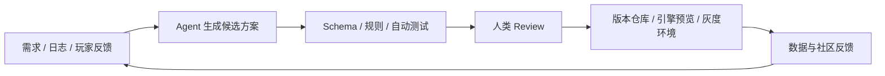

一谈到 AI 和游戏行业，大家通常先想到美术资产、NPC 对话和代码补全。这些方向当然重要，但它们只是生产流程中的几个点。如果只把 AI 当成内容生成器，我们一方面会低估它对游戏工业化流程的影响，另一方面又容易高估它在短期内替代创意岗位的能力。

本文讨论的 AI Agent 不是聊天框，也不只是一个生成文本、图片或代码的模型。它更像是游戏 AI 进入生产管线后的一层协作系统：读取项目上下文，调用内部工具，执行多步任务，再根据反馈继续修改。云端 LLM、端侧轻量模型、PCG 工具、资产生成器、测试 bot 和数据分析流程，都可以由它调度。最终决定仍由团队做，Agent 负责把文档、配置、日志、测试、玩家反馈和版本计划串起来，让候选方案更快出现，也让验证、回滚和审计有迹可循。这是一个全流程的优化，涉及不同环节的 Agent 构成一个完整的系统。

所以我更愿意把 Agent 的起点放在验证、协作和反馈速度上。已经建立标准工作流的团队，往往比依赖口头经验和个人手感的团队更容易从中受益。Agent 需要清楚的输入、规则、权限、工具接口和评价标准。这些条件明确时，它才像一个生产系统；条件模糊时，它通常只能充当一次性的灵感助手。游戏 AI 的能力还会继续增加，但一种能力能否真正进入项目，最终仍取决于团队有没有办法检查它的工作过程和结果。

Google Cloud 与 The Harris Poll 在 2025 年面向 615 名游戏开发者的调查显示，90% 的受访者已经在工作中使用生成式 AI，87% 表示正在使用 AI agents。这组数字说明 AI 已经进入不少团队的工作流，却不能说明落地问题已经解决。GDC 2026 的行业调查呈现了另一面：只有约三分之一的游戏行业从业者在工作中使用生成式 AI，同时超过一半认为它对行业产生了负面影响。游戏公司正在试用 AI，也在担心 IP、劳工、内容质量、玩家信任和合规。这种一边采用、一边警惕的状态，更接近行业目前的真实处境。

## 研发生产：先从可验证流程开始

游戏研发本来就是一套复杂的协作流程。策划、程序、美术、音频、关卡、QA 和运营会不断交换中间产物。Agent 进入研发管线后，最先值得处理的是信息怎样流动、结果怎样检查，而不是让每个环节都自动生成内容。

在策划侧，配置表、任务链、技能描述、怪物行为草案和数值初稿，比“从零写一个完整系统”更适合作为接入点。这些产物本身就有 Schema、ID、依赖关系和校验规则。Agent 生成候选内容后，机器可以先检查字段是否缺失、道具 ID 是否存在、奖励投放是否合理，以及任务前置条件和剧情设定有没有冲突。策划再判断内容是否有趣，是否符合目标玩家和当前版本的节奏。

PCG 和 UGC 也可以放在这套流程里理解。传统 PCG 擅长在明确规则下批量生成关卡、地图、掉落、敌人组合和任务变体；生成式模型则适合把自然语言需求转成草案、描述、规则片段或可编辑素材。Agent 可以把两者接起来，让生成结果接受策划约束，并进入版本目标和引擎预览。比如，策划可以快速试出一个副本的三种节奏版本，或者一组更适合新手期的任务链，也可以先生成某个 UGC 模板的规则草案。生成之后，数值、叙事、经济系统和可玩性检查一个都不能少。

这也意味着策划工具不能停在聊天框。它要连接项目数据库、配置仓库、规则校验器、版本管理和引擎预览环境。生成只是起点。候选配置能否自动校验、能否交给人审、能否在引擎中预览，出错后又能否回滚，才决定它有没有生产价值。UGC 工具面对的要求更高。编辑器门槛降低了，规则边界仍然存在；玩家生成的地图、任务、角色和玩法规则，照样要经过权限、审核、运行时约束和内容安全流程。

在程序侧，Agentic Coding 已经可以处理样板代码、历史模块解释、崩溃日志归因、Code Review 辅助、单元测试补充和性能回归分析。不过，游戏开发比一般应用开发多了实时性能、内存、渲染、网络同步和跨平台适配等约束。战斗结算、付费系统、反作弊、客户端与服务器联动这类模块，不能只看代码表面上能不能跑。它们仍要进入 CI、自动化测试、性能基准、灰度验证和权限审批流程。模型输出必须接受这些工程规则的检查，单靠信任不够。

游戏里的 LLM 应用也不能只看 prompt 效果。一个能改配置、写脚本、查日志、调用引擎命令或生成测试用例的 Agent，已经是工程系统的一部分。团队需要为它设置最小权限，记录工具调用和执行轨迹，并准备失败回滚与代码审查入口。遇到性能回归、内存泄漏、帧率波动或网络同步错误时，Agent 可以帮助定位问题、整理线索和解释日志，但结论仍要由 profiler、自动化测试和真实设备数据来验证。

到了美术、音频和关卡侧，Agent 更像生产管理与质量筛选工具。它可以协助探索风格方向、标注资产，检查命名、尺寸、贴图通道、面数、骨骼绑定和导入规范；在关卡中，它也能分析路径连通性、不可达区域、空跑路径、战斗遭遇节奏和教学风险。Unity 将 Unity AI 定位为面向 Unity 开发流程的 AI 工具，Sentis 则用于在 Unity Runtime 中运行神经网络模型。厂商正在把 AI 接进引擎和工具链，而不只是提供一个离线生成器。

美术资产生成同样不能只看最后“出了一张图”或“出了一个模型”。进入生产后，Agent 还要检查资产是否符合项目的命名、尺寸、材质、版权来源、风格参考、LOD、骨骼、碰撞体和导入规范，并把结果送进 DCC 工具、资产库和引擎预览。美术、TA 和关卡设计需要在同一个流程中判断资产能否使用。否则，前端生成得越快，后续清理、返工和版权风险也会积得越快。

QA 可能是短期内最直接的落点。游戏系统越复杂，人工穷举测试越不现实。虚拟测试 bot 可以探索关卡、触发操作、报告崩溃，再把测试过程整理成报告。测试人员仍要判断体验、平衡和问题严重程度，但大量重复的路径探索、回归检查和异常捕捉可以交给 Agent。它还可以根据版本 diff 生成回归路径，复现玩家上报的异常步骤，模拟不同水平玩家的行为模式，再把崩溃日志、录像、操作序列和疑似原因整理给 QA 与程序。相比“让 Agent 自动做游戏”，这条路离生产近得多。

## 运营反馈：把玩家声音变成产品假设

把视角拉回游戏的整个生命周期，立项、发行和长线运营一直在处理同一个难题：团队怎样更快、更准确地理解玩家反馈，再把反馈转成可以讨论、排序和验证的产品判断。

在项目早期，Agent 可以持续整理玩家评论、社区帖子、直播弹幕、竞品更新日志、应用商店评价和媒体测评，提炼玩家集中关心的问题。某类玩法是否让人疲劳，某种付费设计是否引起反感，某个题材是否正在升温，玩家对一套系统期待的究竟是深度、爽感、社交，还是低负担的日常陪伴，这些都可以先形成待验证的判断。

但分析不能停在“正面评价占比多少”。更有用的做法，是把玩家的话拆成可以验证的产品假设。玩家抱怨“肝”时，团队可以先检查奖励节奏是否透明，而不是直接归因于内容太多。玩家觉得战斗无聊，也要看看敌人行为和关卡节奏是否缺少变化，不能只统计技能数量。剧情让人出戏，则可能是角色动机、任务目标和玩法行为没有对齐。Agent 能整理这些解释，但团队仍要用设计分析和数据去逐一排除。

游戏上线后，反馈会来得更快，也更杂。社区评论、客服工单、应用商店评分、直播反馈、短视频舆情、数据看板和版本更新会同时涌进来。Agent 适合承担持续整理的工作，把不同渠道的玩家声音合并、去重、聚类，再尝试归因。团队需要先分清情绪表达、可复现 Bug，以及指向数值体验、商业化信任或沟通不足的问题，再把这些信息与真实行为数据放在一起看。否则，一阵声音很大的舆论就可能带偏版本判断。

比如玩家抱怨某个副本太难，团队要看的不只是一句“玩家觉得难”，还包括通关率、失败节点、队伍构成、装备分布、攻略传播情况和改动后的留存变化。埋点做得越清楚，AI 越容易参与分析。玩家吐槽活动奖励差，背后也可能牵涉参与率、付费转化、时间成本、竞品活动节奏和信任感。Agent 可以把这些信号整理成候选判断和版本建议，但优先级仍由制作人、运营和数据团队决定。

我更倾向于这样的反馈流程：先捕获玩家信号，把反馈拆成产品假设；再生成候选方案，并主动找出方案里的问题；确定改动后，将它放进版本计划，上线后继续观察数据和玩家情绪。Agent 不负责替制作人决定方向。它的作用，是让团队更快拿到一组值得讨论、也能够验证的选项。

## 玩家体验：越靠近玩家，边界越重要

AI Agent 进入游戏内体验后，最容易想到的还是 AI Chatbot。自然的回应、稳定的人设和长期交互记忆，确实有助于沉浸感从而提升游戏体验。不过，游戏内 Agent 还能做得更具体。NVIDIA ACE 与 KRAFTON 的 PUBG Ally、NetEase 的 NARAKA AI Teammate 都在尝试让 AI 角色理解战场状态、给出建议、寻找物资，甚至作为队友参与游戏，而不只是陪玩家聊天。至于更进一步的问题，让我们留给以后有机会了再单独讲，比如 AI Naive Game、情感陪伴与自我演化的世界，他们都是 AI 时代为游戏开发带来的新机会。

这类功能通常会涉及端云协同。云端 LLM 适合复杂推理、长上下文、多工具调用、运营助手和创作工具；端侧或轻量化模型更适合低延迟、隐私敏感、网络不稳定的场景，也适合运行时 NPC、AI 队友、教程助手和部分离线功能。端侧模型是 Agent 可以调度的一种能力。简单的状态判断、本地意图识别、短文本回复、动作选择和安全过滤，可以尽量靠近玩家执行；复杂剧情生成、长期记忆整理和跨系统规划，则可以放到能力更强的云端模型或后台流程中。

在 RPG、开放世界、模拟经营和 UGC 游戏里，Agent 可以成为系统与玩家之间的动态接口。新手未必需要更多教程弹窗，他们更需要在做错操作时得到贴近当前场景的解释。回流玩家面对一屏活动入口，往往只想先弄明白自己离开后发生了什么、现在该做什么。高玩关心的又是更细的机制解释、构筑建议和挑战路径。游戏内容可能没有变化，但玩家理解系统、重新进入循环的方式会改变。

UGC 也是适合引入 Agent 的场景。它可以帮助玩家创建地图、任务、角色和规则，把复杂编辑器中的一部分操作转成自然语言或半结构化指令。在多人游戏中，它可以辅助识别消极行为、总结战局表现和生成复盘建议；在模拟经营游戏中，它也能让虚拟居民或顾问拥有更清楚的目标和反馈方式，让玩家不用只盯着数值面板理解系统。与此同时，玩家侧 UGC 仍要处理规则解释、内容审核、资产权限、运行时性能和多人公平性。这里的 Agent 应该是受约束的创作协作者，不能成为没有边界的内容入口。

功能越靠近玩家，风险越难补救。NPC 不能承诺不存在的任务奖励，客服型助手不能误导玩家付费，剧情角色不能随意说出破坏世界观的内容，竞技游戏里的建议也不能演变成事实上的外挂。Steamworks 已经区分预生成内容和运行时生成内容，并要求开发者说明 live-generated AI 的保护措施。平台方显然也把游戏内 AI 当成一种需要披露、管理和约束的生产能力。

玩家侧 Agent 的评估标准自然也更严。回答要准确，延迟和成本要可控，人设还得稳定；同时，它要应对越狱和恶意输入，保护玩家隐私，也不能破坏游戏经济与竞技公平。内部流程出错后通常还有回滚机会，玩家体验一旦出错，损失的是信任。因此，团队更适合先把内部生产和运营反馈做成熟，再逐步扩展到玩家侧，而不是一开始就大规模铺开。

## 为什么不是所有团队都会立刻受益

Agent 能帮到什么程度，取决于团队已经把多少工作沉淀成了系统。如果策划案只散落在聊天记录里，配置规则没有 Schema，资产命名靠口头约定，测试用例不稳定，版本决策没有指标记录，权限和日志也不清楚，Agent 就很难可靠工作。它或许能生成不少看起来合理的内容，却很难把这些内容送进生产链路。

决定收益的前置条件其实很具体：文档化程度、数据质量、工具链成熟度、权限体系、自动测试覆盖和审计日志。文档让 Agent 理解上下文，数据质量影响反馈分析是否可信，工具链决定它能不能真正执行任务。权限体系划定资源边界，自动测试负责先筛掉一部分错误，审计日志则让团队在事故发生后还能追踪过程、恢复现场。游戏团队还要处理模型网关、端云协同策略、资产权限、内容审核和评测体系。缺少统一治理时，各种 AI 能力只会散落在不同工具中，越接越乱。

小团队和大团队也不必走同一条路。小团队可以从低风险、高重复的任务开始，例如社区反馈聚类、策划案检查、自动 QA 报告、版本公告草稿、本地工具脚本和资产规范检查。大团队面对的是另一类问题：统一平台、权限边界、模型网关、端云模型选择、日志审计、评测体系和跨部门流程都需要有人负责。否则，各部门各接一套 AI 工具，最后只是多出一批新的信息孤岛。

人仍然是系统中不可缺少的一环。Human in the loop 不能只写在方案文档里，它需要落到具体责任上。自动化程度越高，团队越要说清楚谁提出目标、谁批准执行、谁承担结果，以及指标异常时谁有权叫停。

## 结语：竞争力在系统，而不在单个模型

AI Agent 会进入游戏行业的许多环节，但最有价值的形态未必是某个显眼的单点功能。更实际的做法，是把 Agent 放进已有的生产管线，让它读取项目上下文、连接内部工具，调度端侧模型、生成模型、PCG 工具和测试 bot，再把玩家反馈整理成可以检查的候选方案。每一步都留下记录，并由人决定是否继续。

对多数团队来说，起点不必是全自动 NPC 或全自动研发。可以先挑反馈收集、策划案检查、自动 QA 这类低风险且重复度高的工作，再让 Agent 接入现有工具链和验证流程，而不是把它留在聊天窗口里。随后用人工审核、日志审计和版本指标判断它有没有真正缩短迭代周期。

我的判断是，游戏公司的长期竞争力取决于能否把 AI 变成稳定的研发和运营能力。创意、审美以及对玩家关系的判断仍然来自人。Agent 能做的是放大这些能力：接通生产、测试、运营和玩家反馈，让团队更早发现问题，更快试出方案，也更容易验证自己的判断。

游戏由技术、艺术、商业和社区共同构成。AI Agent 想真正进入这个行业，就要走进立项、生产、测试、发行、运营和玩家体验这些具体环节。到最后，模型参数并不是最重要的指标。更值得看的，是团队能不能把创意工作变成一套可验证、可回滚、可审计的生产能力。**在2026年，或许我们要再谈游戏工业化，并让生成式人工智能成为工业产线上的最重要一环**
## 参考资料

- Google Cloud / The Harris Poll, [Global AI Meets the Games Industry](https://services.google.com/fh/files/misc/global_ai_meets_the_games_industry.pdf)
- GDC, [2026 State of the Game Industry](https://gdconf.com/article/gdc-2026-state-of-the-game-industry-reveals-impact-of-layoffs-generative-ai-and-more/)
- Unity, [Unity AI](https://unity.com/features/ai)
- Unity, [Sentis overview](https://docs.unity.cn/Packages/com.unity.sentis%402.1/manual/index.html)
- NVIDIA, [ACE Autonomous Game Characters](https://www.nvidia.com/en-eu/geforce/news/nvidia-ace-autonomous-ai-companions-pubg-naraka-bladepoint/)
- Steamworks, [Content Survey: AI Generated Content](https://partner.steamgames.com/doc/gettingstarted/contentsurvey)
- modl.ai, [modl:test FAQ](https://docs.modl.ai/documentation/html/modltestFAQ.html)
