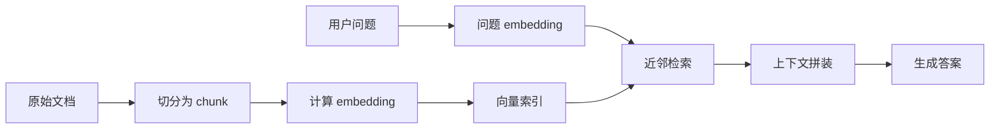
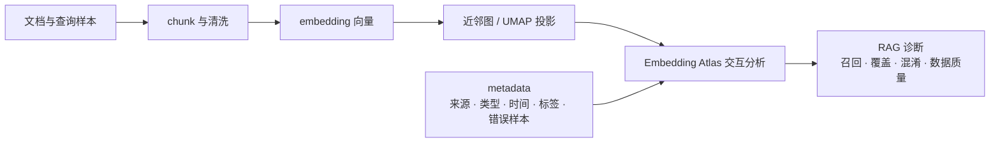
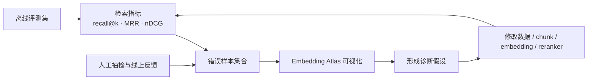

RAG 系统出错时，我们很容易先把锅甩给生成模型：模型是不是不够强，提示词是不是写得不够好，是不是还缺一个更复杂的 agent loop。这个反应很自然，因为最后说错话的是模型。但在很多真实问题里，答案在更早的地方就坏了。模型拿到的上下文本来就不对，后面再怎么生成，也只是在错误材料上做语言组织。

早期的 [RAG](https://arxiv.org/abs/2005.11401) 和 [DPR](https://arxiv.org/abs/2004.04906) 研究已经把这个分工讲得很清楚：生成质量依赖检索阶段提供的外部证据。到了工程实践里，这句话会落到一堆更具体的麻烦上。检索失败往往不是一个单点故障，而是一组空间问题：查询没有靠近正确文档，正确文档被切得太碎，语义相近但业务上不同的内容挤在一起，长尾知识变成孤岛，某些来源的数据污染了整个邻域，或者 embedding 模型把表面相似误当成了任务相似。

我关注 [Embedding Atlas](https://github.com/apple/embedding-atlas)，也是因为它处理的正是这个问题。它不是又一个“把向量降到二维然后画散点图”的小工具。它把 embedding、metadata、搜索、过滤、近邻和聚类放进同一个交互界面里，让人可以真的翻一批文本、图片或其他对象在表示空间里的组织方式。它的论文 [Embedding Atlas: Low-Friction, Interactive Embedding Visualization](https://arxiv.org/abs/2505.06386) 强调“低摩擦”和“交互式分析”。这对 RAG 开发者很重要：我们需要的通常不是一张漂亮截图，而是一个能反复追问的诊断入口。

对 RAG 来说，我真正想问的问题很朴素：

**这套向量空间到底把什么东西放近了，又把什么东西放远了？**

## RAG 的检索问题，是空间组织问题

最朴素的 RAG 流程可以写成：



从工程上看，这里面有很多步骤：解析、清洗、切分、向量化、索引、召回、重排、拼上下文、生成。但只看 embedding 这一层，动作反而很简单：把文档块和查询都变成高维空间里的点，然后用距离或相似度决定谁应该进入上下文。

设文档块向量为

$$
d_i \in \mathbb{R}^m
$$

查询向量为

$$
q \in \mathbb{R}^m
$$

如果做了 `L2` 归一化，那么余弦相似度可以直接写成点积：

$$
s(q,d_i)=q^\top d_i
$$

向量检索做的事，就是找到相似度最高的前 $k$ 个文档块：

$$
\operatorname{TopK}_{d_i} \ s(q,d_i)
$$

公式很干净，真实语料却从来不干净。文档里有重复段落、模板文本、版本差异、广告噪音、短句标题、长表格、代码片段、跨语言内容、过时内容和权限边界。查询也不总是长得像文档。它可能是口语化问题、错误术语、隐含需求，甚至只是一个不完整的任务指令。

RAG 的难点不在于“接一个向量数据库就能检索”。真正难的是：**embedding 空间是否真的把任务所需的语义关系组织出来了。**

检索基础设施也不该停在“把 Query 丢给向量库，再返回 Top-K”。开发者需要知道哪些内容被召回、哪些内容被漏掉、噪声来自切块还是数据源、错误样本是否成簇，以及业务边界有没有进入向量空间。只有这些问题能被看见，召回过程才算得上可诊断、可干预。

可视化的作用，就是给这个问题一个观察窗口。

## Embedding Atlas 更适合拿来做诊断

[Embedding Atlas](https://apple.github.io/embedding-atlas/) 是 Apple 开源的 embedding 可视化工具。它可以作为命令行工具使用，也可以嵌入 Notebook 或 Streamlit；当前 PyPI 版本为 `0.20.0`，要求 Python `>=3.11`。

最小启动方式很直接：

```bash
pip install embedding-atlas
embedding-atlas path_to_dataset.parquet
```

如果你已经提前算好了高维 embedding，可以指定向量列：

```bash
embedding-atlas path_to_dataset.parquet --vector embedding_vectors
```

如果你已经提前算好了二维投影，也可以直接指定坐标列：

```bash
embedding-atlas path_to_dataset.parquet --x projection_x --y projection_y
```

它也支持从 Hugging Face dataset 读取数据，还可以提供预计算 nearest neighbors。后者对 RAG 诊断尤其有用，因为我们不只想看点在二维图上的位置，也想知道每个点在原始向量空间里真正的邻居是谁。

这就是 Embedding Atlas 和普通静态散点图的差异。静态图最多告诉你“这批点大概分成几团”；交互界面还能让你继续往下问：

- 这一团里具体是什么文本？
- 换成按来源、标签、时间、chunk 长度、召回结果着色后，结构还成立吗？
- 某个错误样本的最近邻到底是谁？
- 搜索一个关键词后，命中的点是分散的，还是集中在某个区域？
- 某类 metadata 是否正在污染一个邻域？
- query 和它应该命中的 document 是否真的处在同一个局部空间里？

这些问题靠一张图回答不了。它们需要把 embedding 空间、原始文本和 metadata 绑在一起看。

## 相关研究与工具脉络

把 embedding 投影成一张可浏览地图，并不是 Embedding Atlas 才有的想法。[TensorFlow Embedding Projector](https://projector.tensorflow.org/) 很早就把 PCA、t-SNE、UMAP 和 metadata 过滤做成了交互式界面；[Nomic Atlas 的 data mapping 系列](https://home.nomic.ai/blog/posts/data-mapping) 也一直在讲，非结构化数据地图不只是装饰，它本身就是探索和治理数据的界面。

Embedding Atlas 的增量，更像是把这条路线拉回开发者日常。它不只关心投影算法，也关心大规模点云、密度聚类、自动标签，以及能不能低成本接进现有数据工作流。换句话说，它把 embedding 可视化从“偶尔做一张分析图”，推向了“随手打开一批向量看一看”。

RAG 方向也有类似的工具脉络。[Arize Phoenix](https://arize.com/docs/phoenix/retrieval/overview-retrieval) 把 retrieval troubleshooting、trace、eval 和 UMAP 视图连在一起，用来分析坏响应聚类、无近邻查询和检索相关性。[Renumics RAG](https://github.com/Renumics/renumics-rag) 及其文章 [Visualize your RAG Data](https://medium.com/data-science/visualize-your-rag-data-evaluate-your-retrieval-augmented-generation-system-with-ragas-fc2486308557)，则把问题、文档片段和 RAGAS 分数放进同一个 UMAP 视图里。再往 RAG 系统内部看，[RAGViz](https://arxiv.org/abs/2411.01751) 关注 token 与 document 层面的注意力可视化，[RAGExplorer](https://arxiv.org/abs/2601.12991) 则把不同 RAG 配置放在一起做对比诊断。

所以，“可视化 RAG”不是一件事，至少可以拆成三层。第一层是 embedding 空间可视化，看 query、document、metadata 和错误样本的分布；第二层是检索链路可观测性，看 trace、检索结果和上下文相关性；第三层是生成过程可视化，看模型在生成时到底注意了哪些文档。本文主要讨论第一层，但它最好不要和后两层割裂开。

## 从向量到图：可视化背后的几层结构

Embedding 可视化通常会经历四层转换：高维向量、近邻图、二维投影和可解释标签。

第一层是高维向量。embedding 模型把文本、图片或其他对象映射成向量。这里的距离不是普通空间里的物理距离，而是模型学到的表示关系。它可能捕捉主题、实体、语气、格式、语言、来源，也可能把一些对业务没那么重要的表面特征放大。

第二层是近邻图。对每个点找到 top-k 近邻，就能得到一张图：

$$
G=(V,E)
$$

其中每个样本是节点，足够相近的样本之间连边。RAG 的很多现象其实更适合放在这张图上理解：重复内容会形成密集团，孤立知识会变成边缘点，跨主题污染会表现为不该出现的桥接边，语义混淆会表现为两个业务类别在近邻图里纠缠。

第三层是二维投影。UMAP、t-SNE、PCA 等方法把高维点压到二维，方便人眼观察。Embedding Atlas 文档中提到可以基于已有向量计算 UMAP，也可以直接读取预计算的二维坐标。[UMAP](https://arxiv.org/abs/1802.03426) 的直觉是尽量保留局部邻域结构，让高维空间里相近的点在二维图里仍然相近。它适合观察局部团块、桥接区域和离群点。

第四层是标签与 metadata。没有 metadata 的 embedding 图很容易变成“看起来挺有结构”的幻觉。只有把来源、类别、时间、文档类型、chunk 长度、召回次数、人工标注、错误类型这些字段叠上去，空间结构才开始变成诊断线索。

我更倾向于把 RAG 的观察流程画成这样：



在这里，可视化不是最后拿来展示的图，而是夹在数据构建和系统评估之间的诊断层。

## 第一种诊断：query 和正确文档有没有靠近

最直接的 RAG 诊断，是把评测集里的 query 也放进同一个 embedding 空间。

如果一个问题有人工标注的正确文档，或者有点击、采纳、引用等弱监督信号，就可以把 query 和 positive document 同时可视化。理想情况下，query 应该靠近它的 positive document，至少应该进入同一个局部邻域。

一旦它们没有靠近，就值得停下来读原文。

有时问题出在 query-document mismatch。用户说的是任务语言，文档写的是说明书语言。比如用户问“为什么这里一直超时”，文档写的是“默认请求等待时间为 30 秒”。两者语义相关，但字面表达不近。这时可能需要 query rewriting、HyDE、领域微调 embedding，或者在索引里加入 FAQ 式标题。

有时问题出在 chunk。正确答案跨越多个段落，但切分后每个 chunk 都只保留了局部信息，导致单个 chunk 和 query 都不够近。这时问题不在向量库，而在 chunk 策略。可视化时你会看到同一文档的多个 chunk 分散在不同区域，或者 query 落在几个相关 chunk 的中间，却没有任何一个 chunk 足够接近。

还有一些时候，是 embedding 模型本身没有对齐任务。通用 embedding 可能更擅长主题相似，而你的 RAG 任务需要区分因果、步骤、API 约束、错误码、权限边界或版本差异。图上看起来“主题差不多”的内容挤在一起，但真正应该召回的操作性文档并不突出。

这种诊断会把抽象的 recall failure 变成一个能观察的问题：query 是落错团了，落在团边界，还是正确团内部本身就很混乱？

## 第二种诊断：错误召回是否成簇

单个错误案例通常不够说明问题。一个 query 没召回正确文档，可能只是偶然；但如果许多错误召回聚成一团，就说明系统在稳定地犯同一种错。

比如一个企业内部知识库里，同时有“报销流程”“合同审批”“采购申请”“付款申请”。这些文档都会出现申请、审批、金额、发票、负责人等词。通用 embedding 很容易把它们放到同一个大团里。RAG 一旦遇到“怎么申请付款”这类问题，就可能召回报销流程或采购审批。

如果只看线上日志，这些错误会散落在不同 query 下，很难形成直觉。放到 embedding 图里，它们会呈现为一个混杂区域：不同业务类型的 chunk 互相穿插，错误召回边大量跨越业务标签。

这时可以考虑几种改法：

- 在 chunk 前增加业务域标题，让向量包含更明确的上下文；
- 把检索拆成两段：先做 domain routing，再在域内向量检索；
- 引入 metadata filter，例如部门、文档类型、产品线、版本；
- 对容易混淆的类别构造 hard negatives，微调 embedding 或 reranker；
- 用 reranker 补充向量检索无法区分的细粒度约束。

但这里不要太急着“看到混在一起就改模型”。有些混合只是主题相近，并不一定错；有些混合才说明业务边界被破坏。可视化只提供线索，最后还是要回到评测样本和业务语义里确认。

## 第三种诊断：长尾知识是否变成孤岛

RAG 的一个常见目标，是让模型能利用长尾知识：冷门功能、旧版本说明、少见错误码、低频客户问题、内部流程细节。麻烦在于，长尾知识在 embedding 空间里经常表现为孤岛。

孤岛不一定是坏事。某些内容本来就特殊，应该远离主团。但如果一个孤岛里的内容经常被问到，却很少被召回，那就说明系统对它的可达性不好。

在 Embedding Atlas 里，可以把点按访问频率、召回频率、人工问题覆盖情况或线上失败率着色。这样会看到几种不同形态：

- 高频访问区域：应该被重点维护，错误会带来高影响；
- 低频但高价值孤岛：需要评测集专门覆盖，不能被平均指标淹没；
- 完全无人访问的孤岛：可能是冷知识，也可能是过时、重复或噪音；
- 位于主团边缘的桥接点：常常是跨主题文档，既可能提供连接，也可能制造误召回。

这会改变我们理解 RAG 评估的方式。平均 recall@k 只能告诉你总体召回率，空间视角会提醒你：错误不是均匀分布的。系统可能在主流问题上表现很好，却系统性忽略边缘区域。

## 第四种诊断：chunk 是过碎、过粗，还是带错上下文

RAG 里最容易被低估的是 chunk。切分策略不只是文本预处理，它直接决定 embedding 空间里的基本单位。

chunk 过碎时，很多点会变成语义残片。它们可能只有半个步骤、一句定义、一个表格行或一个代码片段。这样的点在空间里很容易被表面词吸走，靠近一些并不真正回答问题的内容。

chunk 过粗时，另一个问题会出现：一个点内部同时包含多个主题。它可能在二维图上处在几个团之间，成为“桥”。这种桥有时能帮助跨主题召回，但也可能把不相关邻域连起来，造成误召回。

还有一种更隐蔽的情况：chunk 本身不算短，但缺少标题、路径、产品名、版本号等上下文。比如“点击设置后选择高级选项”这句话本身没有说明属于哪个产品、哪个页面、哪个版本。embedding 只看 chunk 内容时，很可能把不同产品的相似步骤混在一起。

分析 chunk 时不应该只看长度分布，还应该在可视化里叠加几个字段：

- `chunk_length`：过短点是否集中在噪音区域；
- `document_id`：同一文档的 chunk 是否被过度打散；
- `section_title`：标题是否帮助 chunk 聚回正确主题；
- `source`：某些来源是否形成异常团块；
- `version`：新旧版本是否被混在同一邻域。

如果同一篇文档的 chunk 在空间里完全散开，不一定是错，因为文档可能本来就多主题。但如果某些重要文档的答案段落被打散到无法被 query 命中，就应该重新考虑切分、标题注入或父子 chunk 检索。

## 第五种诊断：数据质量问题会在空间里显形

Embedding 空间也能暴露数据清洗问题。

重复文本会形成极密集的小团。模板化页面会因为共享页眉、页脚、导航文案而靠近。机器翻译或 OCR 噪音可能形成奇怪的边缘区域。过时文档可能和新文档高度相似，却在 metadata 上属于不同版本。爬虫抓到的错误页、登录页、目录页也可能形成明显团块。

这些问题对 RAG 的影响很现实。重复内容会浪费 top-k 名额；模板文本会污染相似度；旧版本文档会和新版本竞争召回；目录页会因为关键词覆盖广而被误召回；错误页一旦进入上下文，模型就可能顺着它生成错误答案。

如果把数据来源、爬取时间、文档类型和版本叠加到 embedding 图上，很多清洗问题会比在表格里更早暴露。你可能会发现：

- 某个来源形成一个巨大但内容低价值的团；
- 不同版本的同一文档几乎重叠；
- 空白页、错误页和导航页聚成一小团；
- 某些高召回 chunk 其实只是模板文本；
- 大量短 chunk 被标题或固定话术主导。

这时 Embedding Atlas 更像数据体检工具，而不只是 RAG 调参工具。它能帮你决定哪些内容该去重、降权、过滤、重切或补充 metadata。

## 可视化如何进入一个严肃的 RAG 评估流程

可视化最大的风险，是让人过度相信图像。二维投影很有说服力，但它不是高维空间本身。UMAP 和 t-SNE 都会为了保留某些结构而牺牲另一些结构。图上两个团离得远，不一定代表它们在原始向量空间也远；图上看起来分开，也不代表检索时不会互相命中。

所以 embedding 可视化不应该替代指标，而应该和指标形成循环。[BEIR](https://arxiv.org/abs/2104.08663) 和 [MTEB](https://arxiv.org/abs/2210.07316) 提醒我们，检索和 embedding 需要跨任务评估；[RAGAS](https://arxiv.org/abs/2309.15217) 进一步把 RAG 拆成 context、faithfulness、answer quality 等维度；[RAG 评估综述](https://arxiv.org/abs/2405.07437) 和中文基准 [CRUD-RAG](https://arxiv.org/abs/2401.17043) 则说明，retriever、context length、knowledge base construction 和 LLM 本身都会影响结果。



在这个循环里，指标回答“有没有变好”，可视化回答“为什么可能变好或变坏”。这两个问题都不能省。

一个实用流程可以是：

1. 准备一批 query、positive document、negative document 和线上错误样本；
2. 把 query 与 document chunk 放入同一个数据表；
3. 加入字段：`type`、`source`、`doc_id`、`section`、`chunk_length`、`label`、`retrieval_result`、`error_type`；
4. 计算 embedding，并保留向量列；
5. 用 Embedding Atlas 打开数据，按不同 metadata 着色和过滤；
6. 对错误区域抽样阅读原文，形成具体假设；
7. 修改 chunk、metadata filter、reranker 或 embedding 策略；
8. 回到离线指标和人工评测验证。

这里最重要的是第 6 步。可视化只能让你找到“值得读的地方”，不能替你判断原因。真正的诊断还是要回到原文、任务和用户意图。

## 嵌入可视化带来的理解变化

我觉得 embedding 可视化最有趣的地方，是它会改变我们对 RAG 的直觉。

第一，它让“知识库”从文件集合变成了几何对象。过去我们说知识库质量，常常想到文档完整不完整、格式干不干净、有没有更新。可视化之后，你会开始问：这些知识在空间里是否有好的覆盖？哪些区域过密，哪些区域空洞？哪些边界模糊，哪些孤岛没人能到达？

第二，它让“召回错误”从个案变成结构。一个错误 query 可能只是偶然，一片错误区域则说明系统有稳定偏差。RAG 优化不应该只追逐个别 bad case，而应该找到错误的空间模式。

第三，它让“embedding 模型好不好”变得更具体。不是抽象地说某个模型分数更高，而是看它有没有把你的任务边界表达出来。对客服 RAG，产品线边界可能很重要；对论文 RAG，方法、任务和数据集之间的关系可能更重要；对代码 RAG，API 名称、调用约束和版本差异可能比主题相似更重要。

第四，它提醒我们 RAG 不只是检索算法，也是数据设计。很多检索问题最后不是换 ANN 索引解决的，而是通过数据清洗、chunk 重构、标题注入、metadata filter、分层路由和 hard negative 训练解决的。

所以我会关注 Embedding Atlas 这样的工具。它把 embedding 从一个藏在向量数据库里的中间产物，变成了可以被观察、讨论和改造的工程对象。

## 但不要把图当成答案

最后还是要把边界讲清楚：不要把图当成答案。

二维投影不是原始高维空间。可视化里的团块不自动等于真实类别，离群点不自动等于坏数据，混在一起也不自动等于错误。UMAP 的参数、采样方式、归一化、向量模型、metadata 选择，都会影响你看到的图。

可视化更适合做三件事：

- 发现异常区域；
- 形成诊断假设；
- 选择人工抽检样本。

它不适合单独做最终结论。最终仍要看 recall@k、MRR、nDCG、answer correctness、context precision、faithfulness、人工偏好、线上点击、用户反馈和业务成本。中文实践文章里也有类似提醒：比如 [RAG 可观测性](https://jimmysong.io/book/ai-handbook/rag/observability/) 会把检索指标、语义质量、日志和 trace 放在一起讨论，而不是只看二维图。

Embedding Atlas 提供的是一种可观察性。它不会自动让 RAG 变好，也不会替你决定该换模型、换 chunk，还是加 reranker。但它会让 RAG 的一部分失败从黑盒里浮出来：哪些是模型问题，哪些是 chunk 问题，哪些是数据问题，哪些是业务边界没有进入向量空间。

当我们说“更好的 RAG”时，不应该只想到更大的生成模型、更强的 reranker 或更复杂的 agent。很多时候，更好的 RAG 来自几件更朴素的事：知道自己的语料长什么样，查询落在哪里，错误如何成簇，长尾知识有没有被覆盖。

Embedding 可视化的意义就在这里。它不替系统做决定，但它让我们终于能观察向量空间本身。

## 参考资料

**项目与官方文档**

- [apple/embedding-atlas](https://github.com/apple/embedding-atlas)
- [Embedding Atlas Documentation](https://apple.github.io/embedding-atlas/)
- [Embedding Atlas PyPI](https://pypi.org/project/embedding-atlas/)
- [TensorFlow Embedding Projector](https://projector.tensorflow.org/)
- [Nomic Atlas Data Mapping](https://home.nomic.ai/blog/posts/data-mapping)

**论文与基准**

- [Embedding Atlas: Low-Friction, Interactive Embedding Visualization](https://arxiv.org/abs/2505.06386)
- [UMAP: Uniform Manifold Approximation and Projection for Dimension Reduction](https://arxiv.org/abs/1802.03426)
- [Retrieval-Augmented Generation for Knowledge-Intensive NLP Tasks](https://arxiv.org/abs/2005.11401)
- [Dense Passage Retrieval for Open-Domain Question Answering](https://arxiv.org/abs/2004.04906)
- [BEIR: A Heterogeneous Benchmark for Zero-shot Evaluation of Information Retrieval Models](https://arxiv.org/abs/2104.08663)
- [MTEB: Massive Text Embedding Benchmark](https://arxiv.org/abs/2210.07316)
- [Ragas: Automated Evaluation of Retrieval Augmented Generation](https://arxiv.org/abs/2309.15217)
- [Evaluation of Retrieval-Augmented Generation: A Survey](https://arxiv.org/abs/2405.07437)
- [CRUD-RAG: A Comprehensive Chinese Benchmark for Retrieval-Augmented Generation of Large Language Models](https://arxiv.org/abs/2401.17043)
- [RAGViz: Diagnose and Visualize Retrieval-Augmented Generation](https://arxiv.org/abs/2411.01751)
- [RAGExplorer: A Visual Analytics System for the Comparative Diagnosis of RAG Systems](https://arxiv.org/abs/2601.12991)

**工具实践**

- [Arize Phoenix Retrieval Overview](https://arize.com/docs/phoenix/retrieval/overview-retrieval)
- [Renumics RAG](https://github.com/Renumics/renumics-rag)
- [Visualize your RAG Data: Evaluate your Retrieval-Augmented Generation System with Ragas](https://medium.com/data-science/visualize-your-rag-data-evaluate-your-retrieval-augmented-generation-system-with-ragas-fc2486308557)

**中文实践与译介**

- [使用 UMAP 降维可视化 RAG 嵌入](https://blog.csdn.net/deephub/article/details/136094642)
- [RAG 分块大小指南：找到最佳设置](https://llamaindex.org.cn/blog/evaluating-the-ideal-chunk-size-for-a-rag-system-using-llamaindex-6207e5d3fec5)
- [RAG 的可观测性：如何监控检索增强生成系统](https://jimmysong.io/book/ai-handbook/rag/observability/)
