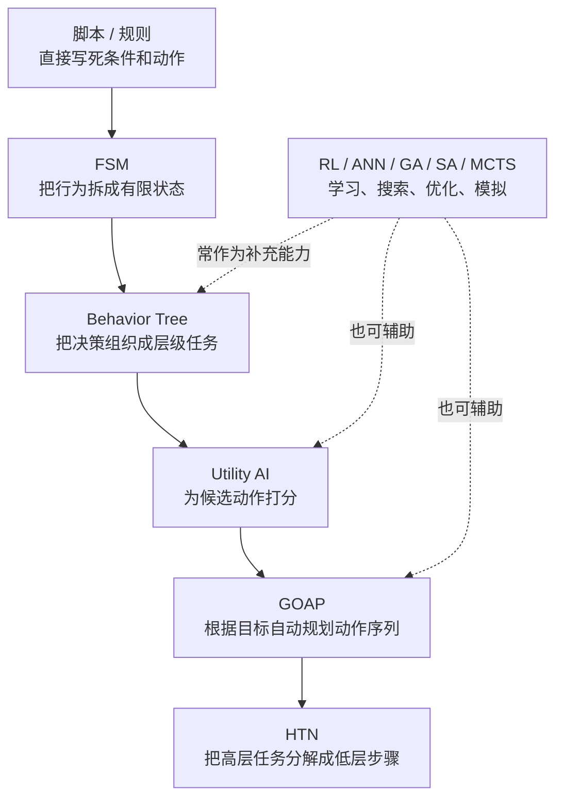

最近聊 NPC 智能时，很多人的第一反应已经变成了 LLM 对话、角色扮演、长期记忆、会自己接任务的数字伙伴。这符合最近的流行趋势，我想大部分研究游戏 NPC 的人目前应该都在做这个。但如果把视角稍微往前挪一点，游戏行业很早就已经在做一种非常经典的 Agent 系统：一个 NPC 观察世界，维护自己的内部状态，选择下一步行动，再通过移动、攻击、交易、对话、逃跑或协作去改变世界。LLM 才出来几年，但游戏 AI 至少已经十几年了。

只是这套传统游戏 AI 通常不叫 Agent。它可能叫敌人 AI、战斗 AI、队友 AI、怪物行为、Boss 逻辑、NPC Brain，或者干脆叫行为树。但从系统结构上看，它非常符合 Agent 的基本定义：它被放在一个环境里，有可观察的信息，有目标或偏好，有可执行动作，也会因为环境反馈而改变下一步行为。

这篇文章不讨论“让 NPC 接入大模型聊天”这一类新问题，而是从生成式模型出现之前的游戏 AI 讲起。我们会把 NPC 看成一种传统 Agent，看看它是怎样被拆成感知、状态、决策、行为和动作的；再用小白能读懂的方式解释脚本、有限状态机、行为树、效用 AI、GOAP 和 HTN。最后再回到今天的 LLM Agent，看看新旧两种 Agent 到底像在哪里，又不一样在哪里。回顾历史，才能更好的去理解现在应该做什么。

## 先把 NPC 想成一个循环

游戏里的 NPC 不是一段静止的设定文案，也不是一张会播放动画的皮肤。它存在于游戏循环里。游戏引擎不断推进时间，场景里的玩家、怪物、道具、声音、子弹、任务状态都在变化。NPC 的智能不是一次性算出来的，而是在每一帧或每隔几帧反复更新。

一个最朴素的 NPC Agent 循环大概是这样：


这张图里有几个关键词。

第一是感知。NPC 不应该知道整个宇宙的一切。一个守卫可能只能看到视野锥里的玩家，听到附近的脚步声，记住刚才被攻击的方向。即使程序员在内存里能拿到全部对象，设计上也会故意限制 NPC 的信息来源。信息来源决定了他能做到什么，而 NPC 能做到什么和玩家体验息息相关。

第二是状态。NPC 需要把感知到的信息整理成自己能用的形式。玩家在不在视野里，最后一次看到玩家的位置在哪里，当前血量是否危险，队友是否正在求援，任务目标是否已经完成，这些信息会被写入一个局部状态。有些项目会把它叫黑板，意思是很多模块都可以在上面读写临时信息。

第三是决策。决策层回答现在该做什么。如果玩家很近就攻击，如果玩家消失就搜索，如果血量太低就撤退，如果队友需要支援就过去。这听起来像几条 if-else，但真实项目一复杂，决策就会变成一个专门的问题。

第四是行为。行为不是一个瞬间按钮，而是一段持续过程。追击需要寻路、转向、避障、保持距离；攻击需要瞄准、等待前摇、播放动画、结算伤害、进入冷却。决策层只说“我要攻击”，行为层负责把这个意图变成一串可以执行的步骤。

第五是动作。动作是最贴近引擎的一层，涉及动画、物理、寻路、技能、声音、特效、网络同步。动作是一切的基础，一个决策看起来很聪明，但如果动画接不上、寻路卡住、技能前摇不合理，玩家看到的仍然是一个很笨的 NPC。

所以，传统游戏 NPC AI 的核心是把一个持续行动的实体放进可控的闭环里。它必须能跑得动，能被调试，能被策划修改，能在不同机器上表现稳定，还要在玩家看来合理。

## 决策技术的谱系

不同游戏对 NPC 的要求差异很大。一个 2D 平台跳跃游戏里的巡逻怪，可能只需要左右移动和碰到玩家后攻击。一个潜行游戏里的守卫，需要巡逻、听声、搜查、呼叫支援、丢失目标后回到岗位。一个开放世界 RPG 的同伴，需要跟随玩家、参与战斗、治疗队友、避免挡路、响应剧情。一个策略游戏里的 AI，还要考虑资源、科技、兵种、地图控制和长期计划。

因此游戏 AI 没有一种万能技术。更常见的是技术谱系：越往左越直接、越可控；越往右越抽象、越能表达复杂目标，但实现和调试成本也更高。



接下来我们按这条线看。每种方法都先讲它解决什么问题，再用一个虚构游戏场景说明它怎么工作。

## 感知和黑板：决策之前先有世界

在讲具体决策算法之前，还有一层经常被忽略：NPC 到底怎样知道世界。很多新手会把 AI NPC 理解成写一个聪明的选择函数，但真实游戏里，选择函数吃到什么信息，往往比选择函数本身更重要。

先看感知。感知不是简单地读取玩家坐标。一个更像人的守卫需要视野、听觉、触觉和事件通知。视野会考虑距离、角度、遮挡、光照和玩家姿态；听觉会考虑声音强度、传播距离、材质和环境噪声；事件通知可能来自队友呼救、警报器、任务脚本或玩家刚刚触发的机关。设计者会刻意让这些信息不完整，因为不完整才会产生悬念。玩家躲在箱子后面时，守卫不该直接知道玩家位置，而是只知道刚才那边有声音或最后一次看见玩家在拐角处。

再看记忆。NPC 通常不应该每一帧都把感知结果清空。它需要记住最后一次看到玩家的位置，记住刚才听到的声音来源，记住某个门已经被打开，记住自己刚刚被哪个敌人攻击。这个记忆可以很短，只持续几秒；也可以更长，比如模拟经营游戏里的居民记住某个角色和自己的关系。记忆让 NPC 不至于像失忆机器，也让玩家能理解它为什么继续搜索、为什么怀疑某个区域、为什么追着一个方向跑。

黑板就是把这些信息集中放置的一种常见方式。行为树节点、Utility 评分、GOAP 动作、寻路模块都可以读取黑板。比如黑板上可能有：

- `enemy_visible`: 当前是否看见敌人。
- `last_enemy_position`: 最后一次看见敌人的位置。
- `health_ratio`: 当前血量比例。
- `cover_position`: 推荐掩体位置。
- `current_goal`: 当前高层目标。
- `suspicion_level`: 警戒或怀疑程度。

黑板的好处是解耦。感知系统负责写入我看到了什么，决策系统负责读取现在我相信什么，动作系统负责执行我要去哪里。但黑板也可能变成垃圾堆。如果任何模块都随便写变量，变量命名不清、生命周期不明、谁覆盖谁说不清，问题就会非常难查。因此成熟项目通常会给黑板变量定义类型、默认值、过期时间、写入权限和调试显示，不能让每一个开发者都随便的去写黑板。

还有一个关键点：NPC 的世界状态不等于真实世界状态。真实世界里玩家可能躲在门后，但 NPC 的黑板里只记录玩家最后出现在门口。这种差异正是游戏 AI 的表现空间。优秀的 NPC 不是知道真相，而是根据有限信息做出合理反应。潜行游戏、恐怖游戏、战术射击都很依赖这一点。玩家会观察 NPC 的信息边界，并利用这些边界制定策略。

所以，传统 Agent 的智能不只在决策层。感知给它输入，黑板给它记忆，决策算法只是基于这些信息做选择。一个很普通的 FSM，如果配上合理的视野、听觉、记忆和搜索行为，也会显得可信；一个很复杂的规划器，如果拿到的是作弊式全局信息，反而会破坏体验。无论是开发传统的决策系统还是开发基于 LLM 的 NPC，控制信息的感知与记忆都是我们要考虑的问题，只是角度可能不同。

## 脚本：最直觉的 NPC 智能

最早、也最容易理解的 游戏 AI 是脚本。脚本的意思很简单：在特定条件下执行特定动作。玩家进入房间，敌人刷出来；玩家靠近商人，商人转身说话；Boss 血量低于一半，进入第二阶段；玩家拿到钥匙，门口守卫改口放行。

脚本的优点是清楚、便宜、稳定。它很适合做剧情事件、一次性演出、教学关卡、机关触发和简单怪物逻辑。策划想要一个确定效果，脚本往往最直接。

问题是脚本一多，行为之间的关系会变得难以维护。比如一个守卫既要巡逻，又要看见玩家后追击，还要听到声音后调查，还要血量低时逃跑，还要在队长死亡后士气崩溃。如果所有逻辑都写成 if-else，就很快变成一团互相覆盖的条件。

一个简单脚本可能长这样：

```text
每次更新守卫（随游戏时间流逝决策）:
  如果守卫死亡:
    播放死亡动画
    停止更新

  如果看见玩家:
    朝玩家移动
    如果距离足够近:
      攻击玩家
  否则如果听到可疑声音:
    移动到声音来源
  否则:
    沿巡逻路线移动
```

这种写法适合入门，但它把“当前正在做什么”藏在条件顺序里。假设守卫正在调查声音，下一帧突然又看见玩家，脚本会马上切到追击，这也许合理。可如果守卫正在播放一个无法中断的开门动画呢？如果它刚刚丢失玩家，应该搜索几秒，而不是立刻回巡逻呢？脚本本身没有给这些状态持续性一个清晰位置，不同的状态理应带来不同的决策逻辑，而脚本只能把这一切放到 if-else 里，这处理不了复杂的逻辑，而只能处理一个确定性的效果。

于是有限状态机出现了。

## FSM：把 NPC 拆成几个明确状态

FSM 是 Finite State Machine，有限状态机。它的核心思想是：一个 NPC 在任意时刻只处于有限个状态之一，每个状态负责一类行为，状态之间通过条件切换。

还是守卫例子。我们可以给它五个状态：

- `Patrol`：巡逻。
- `Investigate`：调查。
- `Chase`：追击玩家。
- `Attack`：攻击玩家。
- `Flee`：逃跑或求援。

这样一来，NPC 当前到底在做什么就清楚了。每个状态有自己的进入逻辑、更新逻辑和退出逻辑并配合行为与动作。比如进入 `Attack` 时播放拔刀动画，更新时检查攻击距离和冷却，退出时停止攻击特效。

伪代码可以写成这样：

```text
状态 Patrol:
  沿路线移动
  如果听到声音: 切换到 Investigate
  如果看见玩家: 切换到 Chase
  如果血量过低: 切换到 Flee

状态 Chase:
  向玩家最后位置移动
  如果进入攻击距离: 切换到 Attack
  如果丢失玩家超过 5 秒: 切换到 Investigate
  如果血量过低: 切换到 Flee

状态 Attack:
  面向玩家并攻击
  如果玩家离开攻击距离: 切换到 Chase
  如果血量过低: 切换到 Flee
```

FSM 的好处在于简单、明确、成本低。它很适合处理小规模行为：状态数量有限，转换条件清楚，后续增量需求也不多。比如简单小兵、机关、载具、页面流程，或者不太复杂的对话和交付逻辑，都可以用 FSM 做。它可解释、可调试，也容易画成状态图；运行时通常只需要检查当前状态和少量转换条件，性能开销也比较低。

它的典型问题是状态爆炸。假设我们又加了“中毒”“被冰冻”“受到嘲讽”“携带旗帜”“保护 VIP”“夜间警戒增强”等条件，原来的几个状态就会被迫和这些条件组合。你可能开始写 `ChaseWhilePoisoned`、`AttackWhileProtectingVIP`、`FleeWithFlag`。状态越来越多，切换规则越来越乱，最后谁也不敢改。也就是说，FSM 和脚本一样，适合边界清楚的小问题；一旦问题本身持续变复杂，状态数量和状态转换会急剧增加，维护成本会很快超过它一开始带来的简洁性。

另一个问题是层级表达不足。比如战斗本身可以包含追击、攻击、躲避、换弹、找掩体；非战斗  又可以包含巡逻、闲聊、看风景、修理设备。普通 FSM 很难自然表达这种嵌套结构，只能把层级关系压平成更多状态和更多转换。虽然可以继续发展成分层 FSM，但很多游戏项目会选择另一种更适合层级组织的形式：行为树。

## Behavior Tree：把决策组织成一棵任务树

Behavior Tree，行为树，常被用在游戏 AI 里。它把 NPC 的行为拆成很多小节点，再用树结构组合起来。每个节点运行后返回三种状态之一：

- `Success`：成功。
- `Failure`：失败。
- `Running`：还在执行。

行为树里常见两类组合节点。`Selector` 像“从左到右找一个能做的方案”，只要某个子节点成功或正在运行，它就停止尝试后面的节点。`Sequence` 像“按顺序完成一组步骤”，只要某个子节点失败，整个序列就失败。

一个守卫行为树可以这样理解：

```text
根节点 Selector:
  Sequence: 处理危险
    条件: 血量过低?
    动作: 寻找掩体
    动作: 呼叫支援

  Sequence: 战斗
    条件: 看见玩家?
    动作: 移动到攻击距离
    动作: 攻击玩家

  Sequence: 调查
    条件: 听到声音?
    动作: 移动到声音来源
    动作: 搜索附近区域

  动作: 巡逻
```

这棵树的意思是：先看是否处于危险，如果危险就优先处理；否则如果能战斗就战斗；否则如果有可疑声音就调查；都没有就巡逻。它比一大坨 if-else 更清楚，因为每个行为被拆成节点，组合关系也显式写在树上。

行为树特别适合游戏开发有几个原因。

第一，它能表达优先级。把紧急行为放在树的左边，普通行为放在右边，就可以形成一种自然的抢占逻辑。血量低时逃跑比巡逻优先，玩家进入攻击范围比闲聊优先。

第二，它适合复用。`移动到目标`、`检查距离`、`播放动画`、`等待冷却` 都可以做成节点，在不同敌人之间复用。

第三，它适合工具化。行为树可以做成可视化编辑器，让策划和程序一起调整。策划不一定要写代码，也能看懂“这个敌人先判断血量，再判断视野，再决定攻击或巡逻”。

第四，它天然支持持续行为。一个动作节点可以返回 `Running`，表示这个行为还没有完成。比如移动到目标点需要多帧才能完成，行为树下一帧继续 tick 这个节点即可。

行为树也不是银弹。树越大，阅读成本越高。优先级如果都靠节点顺序表达，后期可能出现为什么这个行为老是抢走控制权的问题。很多复杂行为还需要共享黑板变量，而黑板写得太随意，又会变成另一种隐形耦合。

行为树最适合的问题是把复杂行为拆成层级任务。但它不擅长回答另一个问题：如果有很多可选动作，每个动作都不是绝对对错，只是有不同程度的好坏，该怎么选？

这就是 Utility AI 关心的问题。

## Utility AI：不问能不能做，而问值不值得做

Utility AI 可以翻译成效用 AI。它的想法很像人类做选择：不是简单判断能不能做，而是给每个候选行为打分，选择当前最有价值的行为。如果你是传统统计/ ML 出身的，可以参考类似 SHAP 的效用来理解。

例如一个队友 NPC 可能有这些选择：

- 攻击最近敌人。
- 治疗玩家。
- 治疗自己。
- 躲到掩体后。
- 捡起附近弹药。
- 复活倒地队友。

这些行为通常都能做，但重要程度会随场景变化。玩家血量只剩 10%，治疗玩家分数很高；NPC 自己快死了，躲掩体或自救分数很高；敌人残血且离得很近，攻击分数可能更高；弹药快没了，捡弹药分数升高。

一个很小的 Utility AI 可以这样写：

```text
候选行为:
  治疗玩家:
    分数 = 玩家受伤程度 * 距离可达性 * 治疗技能可用

  攻击敌人:
    分数 = 敌人威胁度 * 命中概率 * 武器弹药充足度

  躲避:
    分数 = 自己受伤程度 * 附近掩体质量

每次决策:
  计算所有候选行为分数
  选择最高分行为
  如果最高分比当前行为高出足够多:
    切换行为
```

这里有一个细节很重要：通常不会只要分数稍微高一点就立刻切换。否则 NPC 会在“攻击”和“治疗”之间疯狂摇摆。工程上常用滞后、冷却、最短执行时间、切换成本等机制，让行为更稳定。

Utility AI 的优点是适合多因素权衡。它不像 FSM 那样要求你提前画出所有状态，也不像行为树那样把优先级固定在树结构里。它可以把血量、距离、敌人威胁、资源、任务目标、队友状态都转成分数，然后比较。

它的难点也在这里：分数怎么设计？一个行为的分数曲线太陡，NPC 会过早执行；太平，NPC 又像没反应。多个分数相乘还是相加？某些条件是否应该直接归零？一个看似合理的公式，在真实关卡里可能表现很怪。

所以 Utility AI 很依赖调试工具。设计者需要看到当前每个行为的分数，以及每个因素贡献了多少。否则玩家说“队友为什么不救我”，策划和程序只能猜。

Utility AI 很适合做即时选择，但有时 NPC 需要的不只是“下一步做什么”，而是“为了达成目标，接下来一串动作应该怎么安排”。比如想攻击玩家，但没有弹药；想开门，但没有钥匙；想制造药水，但缺材料。此时就进入规划问题。

## GOAP：让 NPC 为目标生成行动计划

GOAP 是 Goal-Oriented Action Planning，目标导向行动规划。它不是让你写一条固定流程，而是让你把世界拆成一组事实，把 NPC 能做的事情拆成一组动作，再交给规划器去拼出一条行动路线。

如果你要在项目里使用 GOAP，通常要做三件事。

第一，定义世界状态。规划器不能直接理解连续、混乱的游戏世界，所以你要把它翻译成离散事实。比如 `有钥匙 = true`、`仓库门打开 = false`、`知道玩家位置 = true`、`玩家被抓住 = false`。这些事实可以来自感知系统、任务系统、背包系统、关卡脚本，也可以来自黑板。

第二，定义目标。目标也是一组希望达成的事实。比如守卫的目标不是一句自然语言抓住玩家，而是 `玩家被抓住 = true`。治疗型队友的目标可能是 `玩家安全 = true`，商人的目标可能是 `完成交易 = true`，居民的目标可能是 `自己吃饱 = true`。

第三，定义动作。每个动作至少要有三个部分：前置条件、执行效果、成本。前置条件说明什么时候这个动作可用；执行效果说明动作成功后世界状态会怎样变化；成本说明这个动作有多贵、多慢或多危险。

举一个虚构潜行游戏里的守卫。当前状态是：守卫没有钥匙，仓库门锁着，但它怀疑玩家躲在仓库。我们可以定义这些动作：

```text
动作 拿钥匙:
  前置: 知道钥匙位置 = true
  效果: 有钥匙 = true
  成本: 1

动作 走到仓库门口:
  前置: 知道仓库位置 = true
  效果: 在仓库门口 = true
  成本: 2

动作 开仓库门:
  前置: 有钥匙 = true, 在仓库门口 = true
  效果: 仓库门打开 = true
  成本: 1

动作 进入仓库:
  前置: 仓库门打开 = true
  效果: 在仓库内 = true
  成本: 1

动作 抓住玩家:
  前置: 在仓库内 = true, 看见玩家 = true
  效果: 玩家被抓住 = true
  成本: 1
```

开发者做到这里，并没有手写“先拿钥匙，再走到仓库门口，再开门，再进仓库”。你只是告诉系统：世界有哪些事实，目标是什么，动作会怎样改变事实。

背后的 GOAP 系统会做什么？它会从当前世界状态出发，尝试把动作一个个接起来，看看哪条动作序列能让目标事实成立。这个过程本质上是搜索：当前状态是一个节点，执行某个动作会得到一个新状态，规划器不断扩展这些状态，直到找到满足目标的路径。实现上可以用 A*、Dijkstra 或其他搜索策略；游戏里也经常加很多限制，比如最多搜索多少步、多久重新规划一次、哪些 NPC 才允许做复杂规划。

用刚才的例子，规划器可能得到这样一条计划：

```text
目标: 玩家被抓住 = true

当前状态:
  有钥匙 = false
  知道钥匙位置 = true
  知道仓库位置 = true
  仓库门打开 = false

规划结果:
  拿钥匙
  走到仓库门口
  开仓库门
  进入仓库
  抓住玩家
```

然后执行系统会逐个执行计划里的动作。这里要注意：规划和执行不是一回事。规划器只是在抽象状态里推演，真正执行还要调用寻路、动画、交互、战斗、物理和任务系统。比如走到仓库门口在计划里只是一个动作，执行时却可能要走导航网格、避开障碍、处理被玩家打断、播放开门动画。

执行过程中世界也可能变化。玩家可能逃走，钥匙可能被别人拿走，门可能已经被炸开。如果某个动作的前置条件不再满足，或者动作执行失败，NPC 不能继续照着旧计划演下去。常见做法是中止当前计划，把新的世界状态写回黑板，然后重新规划。这样 NPC 看起来才像是真的在根据局势调整，而不是在执行一张过期清单。

所以 GOAP 的魅力在于涌现感。设计者没有为每一种情况写死流程，而是提供动作积木和状态规则，系统自己组合出路线。如果没有钥匙就去拿钥匙，如果门已经开了就跳过开门，如果敌人太强就先找武器。NPC 看起来像是在想办法。

它的代价也很清楚。世界状态必须被离散化，动作定义要可靠，搜索空间要受控，执行失败要能回滚和重规划。GOAP 往往适合需要目标感的 NPC：战术敌人、潜行守卫、小队成员、模拟世界中的居民。它能让角色看起来更主动，但前提是你愿意认真建模状态、动作和调试工具。

## HTN：把复杂任务分解成可执行步骤

HTN 是 Hierarchical Task Network，层级任务网络。它也属于规划，但思路和 GOAP 不太一样。GOAP 更像“我知道目标状态，请帮我搜索一串动作”；HTN 更像“我知道要完成一个高层任务，请按规则把它拆成更小的任务，直到拆成可以直接执行的动作”。

如果你要使用 HTN，最重要的工作不是定义大量前置条件和效果，而是定义任务如何分解。

HTN 里通常有两类任务。第一类是复合任务，比如“帮助玩家通过据点”“开店营业”“组织一次进攻”“完成日常巡逻”。复合任务不能直接执行，它必须继续被拆开。第二类是原子任务，比如“移动到掩体”“播放开门动画”“射击三秒”“治疗玩家”。原子任务已经足够具体，可以交给引擎里的动作系统执行。

开发者还要为复合任务定义方法。方法可以理解成“在某种条件下，这个任务应该怎样拆”。同一个复合任务可以有多个方法，运行时根据当前世界状态选择其中一个。

比如一个同伴 NPC 的高层任务是“帮助玩家通过据点”。它可以有两种拆法：

```text
复合任务 帮助玩家通过据点:
  方法 A: 潜行通过
    条件: 玩家未被发现
    子任务:
      标记敌人
      关闭探照灯
      跟随玩家潜入

  方法 B: 正面交火
    条件: 玩家已被发现
    子任务:
      找掩体
      压制敌人
      治疗玩家
      跟随玩家推进
```

其中“压制敌人”本身还不是一个引擎动作，它还可以继续拆：

```text
复合任务 压制敌人:
  方法 默认压制:
    条件: 有可见敌人
    子任务:
      选择高威胁目标
      移动到可射击位置
      瞄准目标
      连续射击三秒
      评估是否换位
```

背后的 HTN 系统会做什么？它会从一个高层任务开始，检查当前有哪些方法可用，选择一个方法，把任务替换成它的子任务；如果子任务里还有复合任务，就继续分解；直到整棵任务树都被拆成一串原子任务。最后系统得到的不是一个抽象目标，而是一张可执行清单。

```text
输入任务:
  帮助玩家通过据点

当前状态:
  玩家已被发现 = true
  有可见敌人 = true

HTN 分解过程:
  帮助玩家通过据点
  -> 找掩体 -> 压制敌人 -> 治疗玩家 -> 跟随玩家推进
  -> 找掩体 -> 选择高威胁目标 -> 移动到可射击位置 -> 瞄准目标 -> 连续射击三秒 -> 评估是否换位 -> 治疗玩家 -> 跟随玩家推进
```

如果某个方法的条件不满足，HTN 规划器会尝试同一个任务的其他方法。比如玩家没有被发现，就选潜行通过；玩家已经被发现，就选正面交火。如果所有方法都不可用，这个任务就分解失败，上层任务可以换另一种方案，或者执行系统可以中止并重新选择高层任务。

HTN 和行为树有一点像，因为它们都擅长表达层级。但二者关注点不同。行为树通常在运行时反复 tick，一边判断一边执行；HTN 更像先生成一个任务计划，再把计划交给执行器。也就是说，行为树偏“实时控制结构”，HTN 偏“任务分解和计划生成”。当然实际项目里也可以混用：外层行为树决定当前大模式，进入某个模式后用 HTN 生成一段任务计划。

HTN 的优点是非常贴近设计者的思路。很多游戏行为本来就是任务分解：做饭、巡逻、交易、打扫房间、组织进攻、救援队友。设计者可以把高层流程写得清楚，同时让系统根据条件选择不同拆法。它也更容易接入叙事和任务系统，因为剧情任务、日程系统、阵营行动本来就有层级结构。

它的代价是前期建模更重。你要定义复合任务、原子任务、方法、条件、子任务顺序，还要处理失败回退。HTN 写得太死，会变成更复杂的脚本；写得太抽象，又难以预测运行结果。它适合中大型行为系统，不一定适合一个只会左右巡逻的小怪。

可以用一句话区分 GOAP 和 HTN：GOAP 让系统在动作空间里搜索“怎样把世界变成目标状态”；HTN 让系统按照你写好的任务分解规则，把“我要做的大事”拆成一串小事。前者更强调状态和动作效果，后者更强调任务结构和设计者提供的分解知识。

## 学习和搜索方法放在哪里

讲到游戏 AI，很多人会自然想到强化学习、神经网络、遗传算法、模拟退火、蒙特卡洛树搜索。这些当然也是 AI，但它们在传统 NPC 里的位置经常被误解。它们不总是直接控制运行时 NPC，更常见的是作为某个环节的辅助能力。

强化学习适合让智能体通过试错学习策略。它在棋类、对战模拟、自动测试、平衡性探索、机器人控制等场景很有价值。但商业游戏里的 NPC 不一定适合直接用一个黑箱策略来控制。原因很实际：训练成本高，行为难解释，调试困难，线上表现可能不可控。玩家不只希望 NPC 足够强，还希望它公平、有性格、会犯合理的错。

神经网络可以用于感知、预测、动画控制、策略近似、难度调节等。比如预测玩家下一步移动方向，判断一个位置是否容易被发现，或者把复杂评分函数压缩成一个模型。但如果神经网络直接决定 NPC 的所有行为，设计者就很难精确控制体验。当然我们也可以说现在的 LLM 就是一个神经网络，当然这样分意义不大。

遗传算法和模拟退火更像优化工具。它们可以帮助搜索参数组合，例如敌人刷新频率、技能冷却、队伍阵型、赛车路线、关卡布局评分。它们通常不是这个怪物每一帧怎么行动的答案，而是帮助开发者找到更好的配置。

蒙特卡洛树搜索常见于棋类、卡牌、策略和局部战术模拟。它通过大量模拟评估候选行动，适合规则明确、可快速推演的环境。问题是实时动作游戏通常状态空间巨大，而且每次模拟成本高，所以 MCTS 往往用于局部决策、离线分析或某些特定玩法。

这几类方法和前面的 FSM、行为树、Utility、GOAP、HTN 并不冲突。更常见的架构是混合式的：顶层仍然用行为树或 HTN 控制可解释流程，局部用 Utility 评分，某些参数由学习方法生成，某些候选路线由搜索算法评估。游戏 AI 的目标不是炫技，而是服务体验。

## 为什么传统 NPC 更强调可控

如果只从论文或 Demo 看，越自动、越聪明、越会涌现，好像就越先进。但游戏开发有一组非常现实的约束。

第一是实时性。NPC 决策不能卡住游戏。一个开放世界里可能同时有几十个、几百个实体在更新。每个 NPC 都做复杂规划，帧率马上会掉。工程上常见做法是降低更新频率、分层计算、远处 NPC 简化模拟、把昂贵决策摊到多帧执行。

第二是可调试性。玩家说这个敌人不合理，开发者必须能回放现场，看到它当时看见了什么、黑板里有什么、行为树走到哪个节点、Utility 分数是多少、GOAP 计划为什么失败。没有可观察性，AI 就会变成无法维护的神秘盒子。

第三是可设计性。游戏 NPC 不是越聪明越好，而是越符合设计目标越好。恐怖游戏里的怪物可能需要压迫感，但不能每次都最优；新手村敌人需要让玩家学会系统，而不是把玩家打崩；队友 NPC 要有帮助，但不能抢走玩家的英雄时刻。AI 的聪明要被体验目标约束。

第四是确定性。很多游戏需要回放、同步、录像、联机一致性。NPC 行为如果充满不可控随机性，会给调试和网络同步带来麻烦。即使使用随机，也往往要使用可复现的随机种子和明确的概率表。

第五是生产协作。NPC 行为不是程序一个人写完就结束。策划要调参数，美术要接动画，关卡设计要摆放巡逻路线，音频要接提示音，QA 要复现问题。行为树编辑器、黑板查看器、调试线框、日志、热更新配置，这些工具本身就是游戏 AI 的一部分。

所以传统游戏 AI 的核心价值不是让 NPC 成为真正的人，而是让它在有限规则下表现得像一个可信的行动者。这个可信很关键。玩家不要求每个敌人都有自由意志，但要求它在游戏规则里讲得通。

## 一个完整 NPC 可能怎样组合这些技术

为了把前面的概念串起来，想象一个虚构动作 RPG 里的队友 NPC。它的职责是跟随玩家、参与战斗、治疗、提醒危险，并在剧情点执行一些特殊动作。

最外层可以用行为树组织优先级：

- 如果剧情强制控制，执行剧情行为。
- 如果自己濒死，优先躲避和自救。
- 如果玩家倒地，尝试救援。
- 如果正在战斗，进入战斗子树。
- 如果没有战斗，跟随玩家或待机。

战斗子树内部可以用 Utility AI 做选择：

- 治疗玩家的分数取决于玩家血量、距离、治疗冷却和当前危险程度。
- 攻击敌人的分数取决于敌人威胁、命中概率、距离和弹药。
- 躲避的分数取决于自身血量、敌人火力和掩体质量。

遇到复杂目标时，可以用 GOAP 或 HTN：

- 玩家被困在门后，NPC 需要找到控制台、解除锁定、回到玩家附近。
- 小队准备突入房间，NPC 需要先扔烟雾弹、找掩体、压制敌人，再跟随玩家推进。

底层动作则交给寻路、动画、技能系统、碰撞和音频系统。AI 决策说“移动到掩体”，动作层要找到具体路径、处理卡住、播放翻滚或蹲伏动画。决策说“治疗玩家”，技能系统要检查距离、朝向、冷却、资源、施法前摇和网络同步。

这就是为什么游戏 AI 往往是一个系统工程，而不是某个单独算法。FSM、行为树、Utility、GOAP、HTN 都只是决策层的工具。真正的 NPC Agent 还需要感知、记忆、动作、调试、内容工具和性能预算。

## 当 LLM 介入游戏 NPC：哪些没变，哪些变了

生成式 AI 让我们重新想象 NPC：它们可以说更自然的话，记住玩家经历，解释自己的动机，甚至根据玩家的表达临时组织一段回应。但把 LLM 接进游戏，并不等于传统 NPC 架构就可以被整体替换。一个会说话的角色，仍然要在游戏世界里行动；只要它要行动，就绕不开感知、状态、决策、动作和反馈这条闭环。

没有变的是底层工程关系。LLM 可以参与理解玩家说了什么，也可以生成一段符合角色性格的台词，但它不能直接让角色穿过墙、跳过动画、无视技能冷却，也不能凭空发放任务奖励。NPC 最终能不能移动，要看寻路和物理；能不能攻击，要看技能系统和战斗规则；能不能完成任务，要看任务系统；能不能说某句话，也要看世界观、内容安全和本地化规则。

所以，LLM 更合理的位置通常不是替代行为树的大脑，而是接在语义层或高层意图层。它可以帮助 NPC 理解玩家自然语言，生成更有角色感的回应，解释当前任务目标，整理长期互动记忆，或者提出几个高层候选计划。真正要落到游戏运行时，仍然需要传统系统把这些语义结果翻译成受约束的动作：走到哪里、看向谁、触发哪个动画、调用哪个技能、更新哪个任务状态。语言模型可以参与思考，但动作接口必须被游戏规则包住。

真正变化的是 NPC 和玩家之间的语义接口。传统 NPC 往往只能响应固定选项：点击对话、接任务、交物品、触发战斗。接入 LLM 后，玩家可能直接说“我迷路了，带我去安全的地方”“你为什么不相信那个商人”“我现在不想打架，有没有别的办法”。模型可以把这些开放表达转成更结构化的意图，比如求助、问路、质疑剧情、请求替代路线，再交给任务系统、导航系统或决策系统判断能不能做。

但 LLM 也带来了新风险。它可能产生幻觉，承诺不存在的奖励，编出世界观里没有的设定，误解玩家意图，或者在多人游戏里给某个玩家不公平的信息。它还有延迟和成本问题，不适合每一帧都参与实时决策。越靠近玩家体验，越需要边界：哪些内容可以生成，哪些必须从任务数据库读取，哪些动作需要规则系统确认，哪些回答必须被安全过滤，哪些记忆可以长期保存。

因此，比较稳妥的理解是：传统游戏 AI 负责让 NPC 在规则世界里可信地行动，LLM 负责让 NPC 更好地理解和表达。二者不是简单的新旧替换关系，而是上下层协作关系。传统系统提供边界、状态、动作和验证，LLM 提供语言、解释、意图归纳和候选方案。

## 小白应该怎样理解：传统游戏 AI 是 LLM NPC 的地基

如果第一次接触游戏 AI，可以先不要纠结哪种算法更高级。更好的入门方式是问五个问题。

第一，NPC 需要知道什么？这对应感知和世界状态。它能不能看见玩家，能不能听到声音，是否知道队友位置，是否记得刚才发生过什么。

第二，NPC 能做什么？这对应动作空间。它能移动、攻击、躲避、说话、交易、开门、求援，还是只能左右巡逻。

第三，NPC 为什么选择这个动作？这对应决策。简单行为用脚本或 FSM 就够了；层级行为用行为树；多因素权衡用 Utility；目标驱动流程用 GOAP 或 HTN。

第四，玩家怎样感知它？这对应表现层。动画、音效、转身速度、攻击前摇、台词、提示 UI，都会影响玩家对 AI 的判断。有时 NPC 决策是合理的，但表现太突然，玩家仍然觉得它作弊。

第五，如果接入 LLM，它负责哪一层？这是今天讨论 LLM NPC 时最容易混淆的问题。LLM 可以理解玩家说什么，可以生成一句更自然的回答，可以把模糊请求整理成高层意图，也可以帮助角色解释自己的行为。但它不应该单独决定角色能不能发奖励、能不能发现玩家、能不能使用技能、能不能改变剧情状态。这些仍然应该由游戏规则、任务系统、战斗系统和传统 AI 结构来确认。

举个例子，玩家对队友 NPC 说：“帮我找一条安全路线。”LLM 可以把这句话理解成“玩家想避开战斗并到达目标点”，也可以生成一句符合角色设定的回应，比如“我看看有没有能绕开巡逻队的路”。但真正的安全路线不是模型凭空编出来的。路线可不可达，要问导航系统；哪些区域危险，要看敌人感知、巡逻路线和黑板状态；是否应该绕路，要让 Utility 或 GOAP 评估代价；NPC 最后怎么移动，还要交给寻路、动画和避障系统。

用这个框架看，很多游戏 AI 现象都会变得容易理解。敌人“突然知道你在哪”，可能是感知边界没设计好；队友“不救你”，可能是 Utility 分数或行为优先级有问题；怪物“原地发呆”，可能是行为树某个节点一直 Running；Boss “转阶段很生硬”，可能是 FSM 切换缺少过渡；模拟居民“每天行为太机械”，可能需要 HTN 或更丰富的日程状态。如果接入 LLM 后 NPC 开始乱说任务奖励、编造不存在的地点，问题也未必是“模型不够聪明”，而是语义生成没有被任务数据库和规则系统约束住。

脚本让行为可控，FSM 让状态清楚，行为树让层级任务可组织，Utility 让多因素选择更灵活，GOAP 让 NPC 能围绕目标生成计划，HTN 让复杂任务可以逐层分解。学习和搜索方法则像工具箱里的增强模块，帮助训练、优化、模拟或解决局部决策问题。这些传统技术不是 LLM NPC 到来后就过时的旧零件，而是让角色真正能在游戏里行动的地基。

所以，LLM 可以让 NPC 更会说、更会解释、更能连接玩家意图，但可信的游戏 Agent 仍然依赖感知边界、状态管理、动作约束、调试工具和设计目标。真正难的不是让角色说出一段漂亮台词，而是让它在游戏规则里持续、稳定、可控地行动。只要它能观察环境、维护状态、选择行动、接收反馈，它就已经站在 Agent 的范畴里。至于这个 Agent 的语义层是否接入语言模型，反而是建立在传统游戏 AI 地基之上的下一层选择。

## 参考资料

- Ian Millington, *Artificial Intelligence for Games*. [Taylor & Francis 页面](https://www.taylorfrancis.com/books/mono/10.1201/9781315375229/artificial-intelligence-games)
- Steve Rabin 主编，*Game AI Pro* 系列。官网提供章节索引与公开下载说明：[Game AI Pro](https://www.gameaipro.com/)
- Alex J. Champandard, Philip Dunstan, *The Behavior Tree Starter Kit*. [Game AI Pro Chapter 6](https://www.gameaipro.com/GameAIPro/GameAIPro_Chapter06_The_Behavior_Tree_Starter_Kit.pdf)
- Kevin Dill, Dave Mark, *An Introduction to Utility Theory*. [Game AI Pro Chapter 9](https://www.gameaipro.com/GameAIPro/GameAIPro_Chapter09_An_Introduction_to_Utility_Theory.pdf)
- Jeff Orkin, *Three States and a Plan: The AI of F.E.A.R.* [GDC 资料 PDF](https://www.gamedevs.org/uploads/three-states-plan-ai-of-fear.pdf)
