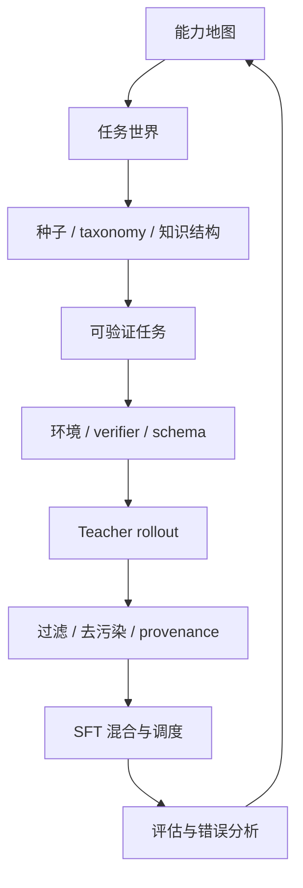

## 在正文之前

最近读了 NVIDIA 的 [《On Data Engineering for Scaling LLM Terminal Capabilities》](https://arxiv.org/abs/2602.21193)。它讲的是 terminal agent 的训练数据，但真正吸引我的不是 terminal 本身，而是它把数据合成写得很工程化。合成数据不是生成更多文本，而是搭一个可以训练行为的世界。先想清楚这个世界要提供什么，再反推任务、环境、轨迹和过滤。

这篇论文的系统叫 Terminal-Task-Gen，产出的数据叫 Terminal-Corpus，最后用这些 SFT 轨迹训练 Nemotron-Terminal。它把任务生成、环境、teacher rollout、过滤、课程学习、长上下文和规模实验放在一起讨论。读这种文章很舒服，因为它没有只给一个结果，而是把一条训练数据管线拆开给人看：哪些数据从旧数据集改造而来，哪些任务按技能合成，teacher 怎么跑，失败样本怎么处理，训练时怎么混。

这篇笔记只讨论 SFT。RL 当然会出现在 agent 训练的后半场，但我这次想先把监督数据本身想清楚。很多时候，模型还没到需要复杂在线优化的阶段，就已经被脏任务、弱测试、混乱轨迹和随手混的数据拦住了。

如果你需要先补齐 SFT、LoRA、显存估算和偏好对齐的整体关系，可以从[《大语言模型后训练与微调实践》](/blog/2024/11/01/llm-post-training-and-finetuning/)开始。本文只沿着合成数据这条线继续展开。

定义任务世界，生成可验证任务，收集可学习轨迹，维护可追踪的数据管线。prompt 仍然重要，但它只是入口。真正决定训练效果的，是这套世界能不能稳定地产生、筛选和回流那些会改变模型行为的数据。以及我们应该如何证明我们的工作是有效的。



## 从任务世界开始

我以前容易把合成数据想成一批 `(instruction, response)`。这曾经勉强够用，但从 2026 年的视角看也不太够。一旦进入代码、工具、终端、数据分析等真实场景，数据就不再只是一段输入和一段答案。模型要学的是在某个环境里怎样做事。环境本身已经成了任务的一部分。

NVIDIA 这篇论文给我补上的概念，是把训练数据拆成三个对象。第一是 task，模型要完成什么，输入输出是什么，边界条件在哪里，成功条件怎样写清楚。第二是 environment，模型能看到哪些文件，能用哪些依赖，命令运行在哪里，测试怎么启动。第三是 trajectory，一个会做这件事的 teacher，在环境里怎样一步步工作。

这三个对象放在一起，数据合成就不太像 prompt 工程了。它更像在设计一个小型训练世界。terminal agent 把这件事表现得最明显，因为 action 和 observation 都落在命令行里。传统 QA agent、RAG、角色对话甚至娱乐型聊天数据也有自己的世界，只是环境从 Docker 变成知识库、用户画像、角色设定、对话历史和风格边界。

## 从指令自举到教学流程

在研究 NV 所做的这些工程之前，我们先来看看之前的研究都做了一些什么，怎样启动任务池，怎样控制复杂度，怎样让数据更可学习，怎样把生成过程拆成可检查的流水线。

### 自举任务池：Self-Instruct

[Self-Instruct](https://arxiv.org/abs/2212.10560) 解决的是起点问题。没有足够人工 instruction 时，它从 175 条人工 seed tasks 出发，让模型自己扩任务池。每一轮生成时，它抽 8 条 instruction 作为上下文，其中 6 条来自人工种子，2 条来自模型之前生成的数据。模型先生成新 instruction，再判断是否符合我们的需求，最后生成 input 和 output。GenAI 可以帮助我们直接生成 QA Data，然后再将其用于训练。

这里有个小细节。普通任务采用 input-first，分类任务采用 output-first，**先给标签再生成输入，避免分类数据总偏向常见标签**。后面再用规则过滤不支持的模态、坏格式和重复任务，并用 ROUGE-L 相似度去重。它最后得到大约 52K 条 instruction 和 82K 个实例。

让模型去合成数据不是重点，重点是如何做。seed pool、generation loop、dedup/filter 这套最小闭环是很好的起点。它的局限也明显：任务复杂度、技能组合、环境状态和 verifier 都管得不多。Self-Instruct 是个很好的开始，但离最新的工程实践还有不短的距离。

### 复杂度编辑：WizardLM / WizardCoder / Textbooks

[WizardLM](https://arxiv.org/abs/2304.12244) 把复杂度变成了可以编辑的对象。Evol-Instruct 从已有指令出发做两种演化：in-depth 让任务更深，比如增加约束、具体化场景、要求多步推理、让输入更复杂；in-breadth 则在同一领域生成新的少见任务。它还用 instruction eliminator 丢掉没有信息增益、模型拒答、只改标点或泄漏 prompt 的样本。

[WizardCoder](https://arxiv.org/abs/2306.08568) 把这个思路迁移到代码场景。它没有照搬通用复杂化模板，而是加入代码任务自己的演化算子：时间和空间复杂度要求、边界输入、错误参考代码、调试和修复、性能约束。这个迁移很重要。复杂度不是抽象词，它必须长在领域里。

[Textbooks Are All You Need](https://arxiv.org/abs/2306.11644) 不一定总被放进 SFT 合成数据讨论里，但它一直提醒我一件事：数据要可学习。phi-1 的训练不是简单堆代码，而是用 GPT-4 标注教育价值，过滤 The Stack 和 StackOverflow，再合成 textbook-style data 和 CodeExercises。它强调清楚、自包含、循序展开、覆盖均衡。对小模型尤其如此，松散的大数据未必比结构好的小数据更有用。

多样性与复杂度可以被拆成可采样的维度。对 QA 来说，可能是证据位置、问题类型、多跳关系、不可回答样本；对角色对话来说，可能是用户关系、情绪状态、上下文跨度和人设边界；对 terminal agent 来说，就是文件状态、工具调用、测试失败和环境恢复。复杂不自动等于有价值，复杂度要和验证、覆盖、训练混合一起看。

### 流水线化教学：AgentInstruct / LAB

[AgentInstruct](https://arxiv.org/abs/2407.03502) 最值得看的地方，是它没有从人工 instruction 开始，而是从 raw seeds 开始。seed 可以是一篇文章、教材章节、网页、代码片段，也可以是一段 API 描述。普通研究者手上往往没有成体系的 instruction 数据，但有大量原始材料。AgentInstruct 想解决的就是怎样把这些材料变成能训练模型的任务。

第一步是 Content Transformation Flow。它先不急着出题，而是把原始材料改造成更适合出题的中间表示。阅读理解里，一篇普通网页可能会被改写成 argument passage、debate、conversation、meeting transcript 或长篇 passage；工具/API 场景里，代码片段可以先被整理成 API description 或 API list。这个中间层很重要。很多失败的数据并不是问题写得不好，而是素材本身不适合直接出题。

第二步是 Seed Instruction Generation Flow。它拿着中间表示，根据技能 taxonomy 生成多样任务。taxonomy 在这里不是事后贴标签，而是采样器。阅读理解可以采 assumption、flaw、inference 这类题型；文本修改可以采 paraphrasing、simplification、redaction、style transfer；工具/API 使用可以采检索、调用、组合、多轮交互。换句话说，taxonomy 决定了模型会在哪些能力区域里"练习"。

第三步是 Instruction Refinement Flow。初始任务出来以后，再交给 suggester-editor 这类角色去改。suggester 提出怎样让任务更难、更绕、更不可回答，或者让问题需要更多步骤；editor 再把这些建议落到具体任务上。这里的 refinement 不是简单润色，而是在任务邻域里继续探索。它让数据不只覆盖"会做的标准题"，也覆盖边界题、陷阱题、工具题和多轮题。

[LAB](https://arxiv.org/abs/2403.01081) 的顺序更像一个 alignment 数据工厂。它先搭 taxonomy，把数据分成 knowledge、foundational skills 和 compositional skills 三条主枝。knowledge 面向文档、手册、教材和领域知识；foundational skills 包括数学、代码、语言能力和推理；compositional skills 则是把知识和基础技能组合起来完成复杂用户请求。每个叶子节点放少量人工例子，作为生成锚点。这个设计让"我要补什么能力"变成一个能增删节点的表，而不是一句模糊愿望。

有了 taxonomy 以后，LAB 再做两类 SDG。Skills-SDG 走四步：先生成 instruction，再评价 instruction，接着生成 response，最后评价 instruction-response pair。Knowledge-SDG 则把 teacher grounded 到文档、手册、书籍里，让模型从外部材料生成领域问答，而不是只靠 teacher 参数知识。这对专业 QA、企业知识库和任何容易 hallucinate 的领域都更稳。

LAB 还有一个训练顺序上的提醒。它先做 knowledge tuning，把 knowledge 和 foundational skills 分成短回答、长回答两个阶段训练；之后再做 skills tuning，用 compositional skills 训练更复杂的能力，并用 replay buffer 带回前一阶段的数据，减少遗忘。这里我只把它当作 SFT 数据调度思路：先让模型熟悉知识和基础动作，再训练组合能力，同时别把前面学到的东西冲掉。

做自己的数据时，可以把流水线写成 `素材池 -> 中间表示 -> 任务生成 -> 任务改写 -> 回答生成 -> 质量门 -> 训练混合`。每一步都留下 metadata 和失败原因。否则最后只会看到"效果不好"，却不知道坏在 seed 内容、任务表述、teacher response、critic，还是训练混合。

## 从覆盖控制到数据策展

第二组工作更接近现在的实践，而不只是一些思想上的指引。如何更好的让数据覆盖目标范围，如何实现动态的难度控制与课程学习，如何思考错误样本与规模的价值，不同的研究往往持有不同的观点。

### 结构化采样：GraphGen / CONDOR

[GraphGen](https://arxiv.org/abs/2505.20416) 面对的是 closed-book knowledge-intensive SFT。随机生成 QA 容易事实错、长尾弱、关系浅。它先从源语料抽实体和关系，构建 knowledge graph，再让 trainee model 做理解评估，用 true、paraphrased、negated statements 等方式估计模型对知识边的掌握程度。之后围绕模型不稳或覆盖不足的边采样 k-hop subgraph，生成 atomic、aggregated、multi-hop QA。

GraphGen 在消融上做得特别扎实。它做了四组消融，每一组回答一个明确的假设：KG 的哪部分结构真正有价值（entity-only vs relation-only vs full KG），训练数据应该瞄准 student 的不稳区域还是全量采样（高 loss 数据更好），输出长度是不是混淆变量（与长度无关），以及边选择策略的影响（三组之间差异不大，诚实报告了 null result）。消融不是为了凑实验数量，而是让审稿人看到你理解自己的方法里哪个组件在起作用、哪个只是摆设。

[CONDOR](https://arxiv.org/abs/2501.12273) 用的是 World Knowledge Tree。它先扩展出大量 topic tags，再把主题和常见聊天场景组合，例如 daily chat、creation、role-playing，并控制难度。生成后再做 Self-Reflection Refinement，让模型先评价回答的优缺点，再重写答案。

这两篇对 QA agent 特别有启发。合成 QA 数据时，问题从哪里采样往往比问题怎么写更早。随机文档片段会带来随机 QA；知识图、主题树、学生短板和用户场景组合起来，才更像训练计划。局限也在这里：图和树本身会带偏数据，构建不好就会把偏差系统化。

### 可执行任务与错误样本：SWE-smith / OpenCodeReasoning / CHIMERA

SWE-bench 通常先找 PR/issue，再为每个 instance 回到历史版本搭环境。[SWE-smith](https://arxiv.org/abs/2504.21798) 反过来，先为真实 Python 仓库搭好可运行环境，再在这个环境里造很多 bug task。它用 LM Modify、LM Rewrite、Procedural Modification、PR Mirror 四种方式制造会打破现有测试的 patch，只保留能触发 Fail-to-Pass tests 的候选，再用 LM 写 GitHub issue 风格的问题描述。

这件事和 Terminal-Corpus 的 Docker 设计很像：先固定世界，再在世界里造任务。环境稳定以后，失败更容易归因，存储和维护成本也低。SWE-smith 还提醒不要把 verifier 暴露得太直白。提供 Fail-to-Pass 测试会让 expert 更容易解题，但学生可能学会跳过复现过程，直接迎合测试。

[OpenCodeReasoning](https://arxiv.org/abs/2504.01943) 则重新思考错误样本的价值。它收集 TACO、APPS、CodeContests 和 CodeForces 等问题得到 28,904 个独特题目，再用 DeepSeek-R1 生成 736,712 条 Python reasoning samples。但实验结果有些让人意外，如果去过滤掉那些没能通过单元测试的修复样本，模型的性能反而更差了，有可能是错误的脏样本让模型性能变得更好了。一个解释是失败样本覆盖了更多困难题，这个结果和 NV 的 trajectory filtering 呼应：正确性是重要信号，但不等于训练价值的全部。

[CHIMERA](https://arxiv.org/abs/2603.00889) 是一个规模上的反提醒。它只构造约 9,225 条 compact synthetic reasoning data，用于跨科学领域推理。流程是先从粗学科扩展到 8 个学科、1,179 个 topics，再生成自包含且答案可验证的问题，用多个模型交叉验证，最后用 thinking model 合成解题轨迹，保留正确轨迹做 SFT。它说明小数据也可以有价值，但前提是覆盖密度和验证质量足够清楚。这篇文章与 OpenCodeReasoning 持有相反的观点，前者尽可能保留而后者在努力清洗与过滤，但过滤与数据的重新组织未尝不是一种 bias，数据清洗与合成也要有理由且关注其中可能产生的 bias。

## 回到 Terminal-Corpus：数据合成工程

现在回到 NVIDIA 这篇文章。Terminal-Task-Gen 不是单靠一个大 prompt 批量生成题目，而是先把数据来源、任务格式、运行环境、teacher 行为和后续过滤都摆在同一条管线上。terminal 与环境密切相关，但与环境密切相关的不止 terminal。Role-Play，QA，RAG-Sys，Chatbot 都有自己的环境，只是隐藏在聊天记录之中，隐藏在先验的世界知识里。

### 广度与深度并重

论文的方法可以先粗略分成两层。第一层是 dataset adaptation，用已有的高质量不同种类的任务数据接入 terminal setting，快速铺开数学、代码、软件工程这些基础能力。第二层是 synthetic task generation，用 seed 和 primitive skills 合成更贴近 terminal agent 的任务。前者解决规模和广度，后者解决技能组合与深度。

直接从零合成所有任务，成本高，也很难知道覆盖是否均衡；只改造旧数据，又会被原始数据集的格式与深度限制。NVIDIA 的做法像是先把地基铺宽，再在缺技能、缺工具交互、缺环境状态的地方补深。数据工程里的很多判断都藏在这个顺序里：哪些东西可以便宜复用，哪些东西必须重新设计。这是我们自己在考虑构建一个数据集时不得不考虑的一环。

特别的，对于这样的数据合成思路，我们务必要为维护合成数据本身的复杂 Schema，以及 task id 和其他的 task 信息。不同来源需要消融，不同难度也需要消融，在合成阶段尽可能多的记录所需的信息，只保存 `(instruction, response)` 和一张表，早期省事，后面排查时极痛。

### Dataset adapters：把任务 prompt 接进 terminal world

先讨论 dataset adapters。论文选择 math、code、SWE 三类 prompt 数据。Math 来自 Nemotron-Cascade 的 math reasoning SFT Stage-2 prompt set，大约 163K unique prompts；这批数据在前处理里去掉了较容易的问题，例如 DeepSeek-R1 回答长度短于 2K tokens 的样本。Code 来自 Nemotron-Cascade 的 code reasoning SFT 数据，原始集合有 79K prompts，进一步过滤和去重后得到 35K。SWE 来自 Nemotron-Cascade 的 SWE code repair SFT 数据，包含 SWE-Bench-Train、SWE-reBench、SWE-smith、SWE-Fixer-Train 等来源，过滤后得到 32K unique prompts。主要的过滤去重手法还是 n-gram（NV 采用 n = 9）与向量相似度上的检查和领域配套的过滤。

adapter 本身不需要 LLM 参与。它把已有 prompt 填进 Terminus 2 的 `{instruction}` 占位符，再按任务类型加一段 suffix。数学题要求把最终答案写到 `/app/solution.txt`，代码题要求把 Python 解法保存到 `/app/solution.py`，SWE 题要求生成 SEARCH/REPLACE edits，并把 diff 保存到 `/app/solution.patch`。

这条路线的好处是便宜、稳定、规模大。它把已有 reasoning 数据转换成 terminal 里的行为数据，让模型练习"读任务、操作文件、按路径交付结果"。短板也很清楚：Nemotron-Cascade 原始数据主要提供 prompt，这些 adapter 任务通常没有配套测试，真实环境状态也不如后面的 synthetic tasks 丰富。它是 terminal world 的基础训练，不是最能体现 agent 能力的部分，但这样的基础训练是必要的。

### Seed-based generation：把题目改造成任务

第二条路线是 seed-based synthetic task generation。这里不是给旧题套壳，而是把已有问题当成灵感，让 LLM 重新写成一个可执行的 terminal task。每个 seed entry 至少有 problem description，也可以带 domain label 和 reference solution。reference solution 只在生成测试期望时使用，不暴露给 agent，避免 agent 直接学到答案。

LLM 在这里扮演 task adapter。它要把抽象题目补成完整工程任务：输入文件放在哪里，输出写到哪里，需要哪些依赖，边界条件有哪些，浮点误差怎么判，格式怎么检查，pytest 测试怎样覆盖正常样例和 edge cases。普通题目说"实现一个算法"，terminal task 则要说清楚"读取 `/app/input.csv`，生成 `/app/output.json`，字段必须满足这个 schema，测试会检查这些行为"。如下所示。

```text
你正在把一个 seed problem 改造成 terminal agent 的 SFT 任务。

输入：
- problem_description
- domain_label，可为空
- reference_solution，只能用于设计测试期望，不能泄漏给 agent

生成：
- task_prompt：自包含，说明输入路径、输出路径、约束、完成条件
- files：任务启动时需要存在的文件
- tests：pytest 检查，覆盖格式、数值容差、边界条件
- metadata：domain、skills、difficulty、source、generation_version

要求：
- 不在 task_prompt 中透露算法或参考实现
- 任务要难解，但测试要能自动判断
- 如果题目太大，拆成可验证的小目标
```

这类 prompt 只是第一步，真正让 seed-based generation 可控的，是 reference solution 的隔离、测试文件的结构、metadata 的记录，以及后面能不能跑 teacher rollout。

### Skill-based generation：从 primitive skills 组合任务

第三条路线是 skill-based generation。它不再依赖已有题目，而是从技能 taxonomy 出发合成新任务。论文定义了 9 个 terminal task domains：data processing、data querying、data science、debugging、dependency management、file operations、scientific computing、security、software engineering。每个 domain 下面维护一组 primitive skills，覆盖 algorithmic、systems、data processing、mathematical、testing、web/security 等维度。

这里的 taxonomy 不是事后贴标签，而是采样器。生成时，LLM 会被要求组合 3 到 5 个 primitive skills，写出一个新场景，并输出 prompt、pytest tests、weights、metadata、files 和 test requirements。比如 data science 任务可能混合文件读取、groupby 聚合、统计检验和图表验证；security 任务可能混合编码解析、认证逻辑、payload 构造和测试判断；software engineering 任务则可能把文件修改、依赖解析、测试修复放在一起。参考如下的提示，具体生成用提示模板参考原文。

```text
你是 [domain] 任务生成器。

可用 primitive skills：
- [skill_1]
- [skill_2]
- [skill_3]
- ...

请组合 3 到 5 个 skills，生成一个真实、具体、可自动验证的 terminal task。

输出：
<prompt>给 agent 看的任务说明</prompt>
<files>初始文件、数据、配置</files>
<tests>pytest 测试与权重</tests>
<metadata>domain、skills、difficulty、expected_tools</metadata>

约束：
- 场景要自然，不要机械拼技能
- 不要泄漏解法、测试细节或参考代码
- 任务应当需要多步操作，而不是一次函数调用
```

复杂度可以被拆成可采样的维度，不笼统地要求生成更难的任务，而决定要组合哪些低层能力、在哪个 domain 里组合、用什么测试观察它们是否真的发生。这样合成出来的数据更像一张训练地图，而不是一堆随机难题。

### 任务格式与环境：先保证能验证

两条 synthetic generation 最后都会落到同一种任务格式：自然语言 task prompt、pytest-based tests、带权重的部分分、补充输入文件，以及一个 domain-specific Docker environment。论文没有为每个任务生成标准答案，它转而追求一种更工程化的目标：任务可以很难解，但验证要尽量清楚。

在 agent 场景里，先拥有 verifier 比标准答案更加实用。只要测试能稳定运行，teacher 成功、teacher 失败、轨迹中断、输出格式错误，都能被记录下来并进入后续分析。没有 verifier，就只能依赖另一个模型打分，很多问题会变成风格判断。

环境设计也服务于这个目标。NVIDIA 没有让 LLM 为每个任务生成 Dockerfile，而是维护 9 个预构建的 domain-specific Docker images。每个 image 预装该 domain 常用依赖，比如 data science 里的 pandas、scikit-learn，security 里的 cryptography libraries。这样省掉每任务 Dockerfile 验证和多轮修复，减少镜像构建成本，也把环境和任务生成解耦。

### Teacher rollout：把会做事的过程留下来

任务生成之后，还需要 teacher 进去做一遍。论文选择 DeepSeek-V3.2，因为它在 Terminus 2 agent framework 的各个数据集上都取得了不错的成绩。teacher 不能随便挑一个强模型，注意看它在目标交互协议里能不能工作。

Trajectory 由 Terminus 2 生成。模型每轮看到任务说明和当前 terminal state，然后输出 JSON，包括 `analysis`、`plan`、`commands` 和 `task_complete`。`commands` 里的 `keystrokes` 会原样发送到终端，系统等待指定时间，再把最新 terminal output 回填给下一轮。训练样本是"状态、思考、计划、动作、观察"的循环。
同时不要只保留最终答案。每一步的 analysis、plan、action、observation、是否成功、token 数、turn 数、耗时和失败阶段，都应该被记录下来。轨迹不一定全进训练集，但它们能让你在后面对"模型为什么学了这个行为"有迹可循。Teacher rollout 也可以形成对难度信息的记录，在训练的时候按照一定权重混合难度和训练顺序也是常见的实验。

压缩后的 trajectory schema 大概是这样。

```json
{
  "analysis": "当前状态、已经完成什么、还缺什么",
  "plan": "下一步为什么要这样做",
  "commands": [
    {
      "keystrokes": "pytest -q\n",
      "duration": 1.0
    }
  ],
  "task_complete": false
}
```

这类 trajectory 教的是工作习惯。模型看目录，读 README 或测试，运行命令，看到错误后回到错误栈，调整文件，最后自检。很多模型会写代码，但在终端环境工作的能力很弱（难以输出终端所需的格式符号）。SFT 轨迹未必让模型突然拥有新智力，但它能把已有能力放到更合适的行为路径上。到这里，数据合成才算完成了一半；另一半发生在训练前后的过滤、混合和调度里。

## 回到 Terminal-Corpus：训练调度策略

NVIDIA 这篇论文的好处是工程上的完整，它没有停在数据生成。它继续把这些轨迹放进 SFT 里试，观察哪些过滤真的有用，课程学习有没有用，长上下文是不是更好，数据规模是否继续带来收益。到这一章，数据工程从怎么造样本变成了怎么让样本进入训练。

论文用 Qwen3-8B 做主要 ablation，再用 Qwen3-14B 和 Qwen3-32B 验证规模是否成立。训练使用 veRL，learning rate 2e-5、weight decay 1e-4、2 epochs、max sequence length 32,768、global batch size 128、AdamW、cosine scheduler 和 10% warmup。

### 先把会污染评估的东西清掉

基础清洗先做去污染。论文删除和 Terminal-Bench 2.0 测试样本有 14-gram overlap 的 prompt，移除 identity leaks，并丢掉 response 中含中文字符的样本作为最基础的过滤。这些规则看着琐碎，但 agent 数据里很常见。teacher 可能在轨迹里暴露自己的身份，也可能把奇怪格式带进训练；评估泄漏更麻烦——一旦混进去，后面的分数就很难解释。我们要保留实验的可信度，自然要让数据足够干净。

### 过滤实验：失败轨迹不一定是废料

改变直觉的是 trajectory filtering。直觉上，只保留完整轨迹或通过测试的轨迹会更干净。实验不是这样。dataset adapters 上，no filter 合并后最好：226,313 条样本，TB2.0 为 9.66；complete-only 为 196,940 条，TB2.0 为 8.09。synthetic tasks 上差距更大：no filter 保留 264,207 条，TB2.0 为 12.4；complete-only 只剩 104,603 条，TB2.0 为 6.74；success-only 只剩 83,448 条，TB2.0 为 5.06。

这不是说失败越多越好。JSON 坏了、身份泄漏、长时间空转、明显胡说，这些留下来会污染模型。但有些失败不是废料。测试失败后如何读错误，路径找错后如何修正，依赖装不上后如何换方案，这些都是 terminal agent 工作的一部分。严格过滤会删掉脏数据，也会删掉困难任务、恢复行为和真实错误状态。

过滤应该被重组为两层，hard reject 负责把明显坏样本扔掉，soft label 负责记录样本状态，最后在训练混合里决定权重。OpenCodeReasoning 里失败代码样本覆盖更多困难题，NVIDIA 这里失败 terminal trajectories 也可能携带恢复模式。两篇文章共同提醒我，正确性是很强的信号，但不是训练价值的完整定义。

### 数据混合与课程学习

数据来源 ablation 给了一个更稳的信号。dataset adapters 里，Math、Code、SWE 单独都有收益，合起来更好：Math 5.39，Code 6.29，SWE 7.02，All 9.66。不同来源提供了互补行为——数学带来推理格式，代码带来实现能力，SWE 带来读文件、改代码、生成 patch 的习惯。

synthetic tasks 里，skill-based 是主要增益来源，139,841 条达到 12.4；seed-based 124,366 条只有 6.18；两者合起来均值仍是 12.4，但方差更低。seed-based 的任务来自已有问题，比较稳，但终究受 seed 空间限制；skill-based 直接按 primitive skills 组合，更容易覆盖 terminal agent 真正缺的动作。两者混合后均值没有继续涨，却让结果更稳，这也是数据工程里经常出现的收益。

课程学习实验也不按直觉走。论文比较 two-stage curriculum 和 single-stage mixed training。前者先训 dataset adapters，再训 synthetic tasks；后者把所有数据混合。Qwen3-8B 上，mixed training 得到 13.03，curriculum 得到 10.39。

这个结果不说明课程学习没用，只说明按数据来源排序不是课程学习。adapter 不一定简单，synthetic task 也不一定更难。真正的难度可能来自文件数、工具调用步数、上下文长度、隐藏测试、多解性、teacher 成功率、base model 初始能力。以后如果要做课程，难度标签最好从轨迹和 verifier 里获取而不是数据来源。

### Long Context Training and Scaling Experiments 

在 1%、5%、10%、100% 的数据比例上观察趋势，用更小的数据比例也能得出结论。如果 10% 的数据就接近 100% 的效果，说明覆盖已经够了，更大的数据只是冗余——这个结论本身就有工程价值。这是对数据规模的消融，是很经典的训练消融技巧，但不是全部。

另外规模消融放在不同模型尺寸（3B + 8B + 14B）上做，能排除"只在一个 size 上成立"的偶然性。同时我们还可以验证 Scaling Law 是否在我们的场景下成立。

不同上下文长度也是消融实验一部分。有些场景下所生成的文本长度会出现很大差别。可能会有小部分轨迹超出了上下文限制，因此被 SFT 算法截断了。如果要做的话可以考虑不使用 YaRN2 的 SFT 模型；使用 YaRN2 的 SFT 模型；以及在评估时仅使用 YaRN2 的基线模型。很多场景下更长的上下文长度已经包含在标准上下文窗口内，长尾数据可能会比较杂乱，其信息量难以带来收益。

在论文里，负面的消融不用藏着。你只需要解释"为什么这个结果是 counter-intuitive 但合理的"——比如课程学习失败是因为数据来源排序不等于难度排序，严格过滤有害是因为困难任务的恢复行为也被一起删掉了。消融实验本来就不一定阳性，negative results 也会有价值。另外，在 8B 规模附近做完整消融一般已经足够了，其他的规模只需要做 Scaling Experiments 。

## 先建立评估基准

读完这些工作以后，我不会一开始就追求十万条数据。更舒服的起点是先把评估和验证的架子搭起来——先知道怎么判断自己做对了，再谈怎么造数据。下面这条路径把"怎么验证自己的工作"和"怎么造数据"放在一起，因为它们在真实的论文里本来就不该分开。

这是最容易被跳过的一步，但它决定了你后面所有实验的可信度。**不要在没有 benchmark 的情况下开始训练**——你连自己在优化什么都不知道。

### Benchmark 与 Dataset 是两件完全不同的事

在做自己的研究之前，先想清楚你在为什么场景造什么东西。

Benchmark 的目的是**衡量能力边界**。它要求小而精，每道题必须可解且验证无误。它的受众是审稿人和社区，版本应该冻结——一旦 benchmark 题目被混入训练数据，所有评估结果就不再可信。Terminal-Bench 2.0 有 89 个任务，每个任务花费约 3 reviewer-hours 做质量保证。SWE-bench 从约 90K 个 PR 出发，经过属性过滤和执行验证，最终只留下 2,294 个 instance。

Dataset 的目的是**改变模型行为**。它要求大到覆盖，可以容忍噪声和失败样本。失败轨迹里有恢复行为，有错误修正模式，这些对训练有价值。Dataset 的受众是模型本身，它应该持续迭代，随着模型能力进化而更新。Terminal-Corpus 最终用了约 490K 条 SFT 样本，但生成过程中的过滤实验表明 no filter 比 success-only 好得多。

一句话总结这个区别：**Benchmark 问你变好了没有，Dataset 负责让你变好。** Benchmark 的质量取决于每道题的验证精度，Dataset 的质量取决于覆盖的广度和轨迹的可学习性。如果你把两者混在一起——比如用训练数据里的题目来评估——那就是循环论证，审稿人一眼就能看出来。

### 最小 Benchmark 怎么起步

先花 1-2 周做 10-20 个可验证的任务。每个任务至少有三个组件：

1. **独立环境**：每个任务有自己干净的运行环境（Docker 或同等隔离），让 agent 不能靠跨任务的记忆过拟合。
2. **人工写的 Oracle solution**：证明任务是确实可解的。不需要复杂，但要保证是一个人类（不是 LLM）确认能通过的解法。Terminal-Bench 要求每个 contributor 确认"My solution.sh was written by a human"。
3. **自动化测试**：让评分可复现。关键设计原则是**测最终状态而非中间过程**——检查"输出文件是否符合 schema"，不检查"agent 有没有执行某个特定命令"。给 agent 留出创造性空间，也避免测试过于脆弱。

Terminal-Bench 的质量门流程可以作为缩放参考：自动化检查（oracle 能跑通、dummy agent 不能蒙混过关）→ LLM 辅助检查（typo、test/description 对齐）→ 人工审核 → 对抗测试（专门跑一个 cheating agent 看能不能绕过测试）。你不必做到 3 reviewer-hours 每任务的标准，但前三步是每个自制 benchmark 都应该走的底限。

### 验证 Benchmark 本身的质量

建好 benchmark 之后，你需要向自己（以及未来的审稿人）证明它是个好的评测工具：

- **区分度检查**：用你的 benchmark 跑至少三类模型——当前最强闭源模型（GPT-5 / Claude Opus）、最强开源模型、以及你后续会用做基座的 base model。分数必须有有意义的分布。如果所有模型都是 0%，benchmark 太难且可能有问题。如果所有模型都是 100%，benchmark 已经饱和，无法衡量进步。
- **Human performance**：如果条件允许，找 1-2 个人类同行为你的 benchmark 做一遍，报告得分作为 upper bound。这个数字对审稿人的说服力远超任何模型间的相对比较。
- **污染防治**：建立基准后立即做 n-gram overlap 检查，确保与任何可能被用于训练的公开数据集无重叠。这是底线——CHIMERA 论文明确报告了 8-gram 和 13-gram overlap 约为 0，这件事不应该是加分项，应该是标配。

### 当 Benchmark 不够完美时

坦白说，大多数自建 benchmark 做不到 Terminal-Bench 的投入。你没有 93 个 contributor，没有 ~3 reviewer-hours 每任务，没有专门的对抗审计。这时你需要靠补充手段来让结论更可信，而不是假装 benchmark 已经无可挑剔。

#### Case Study

选 5-10 个代表性案例，深度对比 base model 和 trained model 的行为差异。要同时展示成功案例和失败案例——只挑好例子会让审稿人立刻起疑。每个案例至少要说清楚：任务是什么、base model 做了什么、trained model 做了什么、这个差异为什么有意义。Case study 不能替代定量评估，但它能告诉读者你的方法"改变了什么行为模式"，而不只是"分数涨了"。

#### LLM-as-Judge 的校准

用一个强模型（GPT-5 / Claude Opus）做自动评分可以大幅降低评估成本，但必须经过校准才能可信。MT-Bench 论文给的基准是：GPT-4 vs human agreement 达到 85%，超过了 human-human agreement 的 81%。如果不能在论文里报告一个可比的数字，审稿人有充分理由质疑你 LLM-as-judge 的可靠性。

校准的做法：先用 3 个人类专家为 50-100 个样本独立打分，计算 inter-annotator agreement（Cohen's κ），再用同批样本测试 judge 和人类的一致性。只有一致性达到可接受水平后，才能把 judge 用于大规模评估。

同时注意 LLM-as-Judge 有三个已知偏误需要处理：
- **Position bias**：judge 倾向于偏好某个固定位置的回答。解决方法是将 A/B 两个回答交换位置各评一次，只有两次都显示 A 更好才算 A 胜出（MT-Bench 用这个方法将一致性从 65% 提升到 77.5%）。
- **Verbosity bias**：judge 倾向于偏好更长的回答。GPT-4 对此相对鲁棒（8.7% 被冗长回答欺骗），但 Claude 容易被骗（91%）。
- **Self-enhancement bias**：judge 倾向于给自己同模型家族的输出打高分。GPT-4 给自己打高约 10%，Claude 约 25%。

#### 多信号三角验证

当你的 benchmark 规模小、case study 案例少、LLM-as-judge 校准不足时，单一信号无法支撑任何结论。但如果 benchmark 分数提升 + case study 显示行为变化 + LLM-as-judge 给出相同方向的评分趋势，三个弱信号合在一起就有说服力。审稿人真正反感的是你用一个不可靠的指标做过强的声称——控制声称为的强度和你的证据强度匹配，这是 pub 策略里最常被忽略的原则。

### 评估与训练迭代

评估不是你实验做完后跑一次就结束的事。**把 error analysis 做成管线的一部分**：训练一个版本 → 跑 benchmark → 分析失败模式 → 识别模型在哪些能力区域仍然弱 → 回到数据合成管线，针对性地补对应的训练样本 → 重训。

这个闭环在概念上很简单，但做起来需要一个前提：你的 benchmark 按能力区域或错误类型做了分类，error analysis 才能追溯回数据缺口。如果 benchmark 只是一个整体的通过率，error analysis 就只能告诉你"还有题没做对"，却没法告诉你该补什么——这也是为什么第一步定义任务空间时就要把能力标签打好。

## 从实验到发表：如何让审稿人信服

这里讲讲把整个流程从一个实验变成一篇论文，工业界的上线可以靠 AB Test，但论文需要从其他角度说服审稿人。

### 建 benchmark 本身就是 contribution

如果你的方向没有现成 benchmark，你不需要为此心虚。大量高引论文的核心贡献之一就是 benchmark：TruthfulQA 定义了对抗性真实性评测，SWE-bench 定义了软件工程 agent 评测，Terminal-Bench 定义了终端 agent 评测。每篇都是先定义问题、再验证问题可解、再在 benchmark 上证明自己的方法有效。

论文结构可以自然地切为两半：前半部分定义问题空间并构建 benchmark（附质量验证、human performance、区分度证明），后半部分提出数据合成与训练方法并在 benchmark 上验证（附消融分析）。这两半放到一起就是一个完整的贡献——不比你找一个现成 benchmark 刷到榜一差。

### 基线对比要公平

不能只比 base model。如果你的方法是合成 SFT 数据，那 baseline 必须包括已有的同类数据合成方法——像 GraphGen 那样同时比 WRAP、Genie、LongForm、EntiGraph 等多个方法。审稿人最常拒绝的论文类型之一就是"A 比 untrained base model 好，所以 A 有效"——不，A 可能只是一种微不足道的改进，需要对比的是"已有的最好数据合成方法"。

同时，确保 baseline 方法在你的任务环境里被公平对待。如果你在 terminal Docker 里测试 baseline 方法生成的数据，但 baseline 方法从来没有为 terminal 环境优化过，这个对比就不公平。解决方式是统一适配条件（比如都给一个相同的 adapter），或者建立两种以上不同的评测来交叉验证。

### 污染防治是信任的底线

一旦审稿人怀疑 benchmark 被污染，整篇文章的所有结果都不再可信。CHIMERA 论文为这个问题做对了示范：明确报告了 8-gram 和 13-gram overlap 接近 0，并提供了检查脚本。Terminal-Corpus 使用 14-gram overlap 删除训练集中与 benchmark 重合的样本。防止训练集与测试集污染，是类似做 SFT Training 的文章的底线。

### 做可靠的消融实验

真消融的特点是：每次只变一个变量、每个实验对应一个预先提出的假设、结果不总是正面、有对 counter-intuitive 结果的解释。假消融的特征：一次性变多个变量、正面的结果被挑出来放大、没有一条负面发现。

你的消融不必面面俱到——GraphGen 做了四组、LIMA 做了三组、Terminal-Corpus 做了六组——但每一组都要回答一个明确的问题。审稿人不会因为消融数量多就加分，但会因为每一组消融都能讲清楚为什么这一组要做了而信任你。

### 小数据也可以发好论文

CHIMERA 只有 9,225 条训练数据，LAB 只有不到 1M 条，LIMA 甚至用 1,000 条就验证了 diversity > quantity。审稿人关心的不是数据量，是你有没有把这 9,225 条数据为什么够讲清楚，以及它们覆盖了什么、没覆盖什么。

小数据的优势在于：你可以把每条数据的 provenance 和质量判断清晰地交代出来。大数据的论文审稿人反而容易怀疑这么多数据你到底有没有看过一眼。

### 开源降低审稿人的疑虑

Terminal-Corpus 开源了数据集和训练配置。这降低了审稿人最核心的顾虑——"你的结论是不是碰巧在你没公开的那批数据上成立的"。如果你能开源，就开源；如果有不能开源的约束（数据版权、隐私等），至少公开数据生成脚本、训练配置和评估代码，让方法论本身是可复现的。


## 写在最后

这篇文章讲的事情很具体：复用已有数据，画技能地图，生成可执行任务，固定环境，让强 teacher 行动，记录轨迹，做去污染和过滤，再用 SFT 训练，最后用 ablation 看哪些选择真的有用。

这条线也可以和我之前写的 [《Reward 与 Training 在真实 Agent 中如何闭环：从数据治理到在线 RL》](/blog/2026/03/22/reward-and-training-in-agent-k-paperbench-amap/) 放在一起读。那篇文章讨论的是更偏 RL 的 agent 训练闭环，环境从 terminal task 换成了带工具、日志、verifier 和 reward 的真实交互系统，但其中关于 taxonomy、去重、难度标注、负样本、trajectory 筛选和 curriculum 的思路，与本文讨论的 SFT 数据治理是连在一起的。

合成数据是一套训练世界的维护工作。prompt， teacher， verifier， schema 都非常重要。数据合成正在变得更加工程，这对普通研究者反而是好消息，只要对问题的认识足够清楚，小规模数据也能开始积累真实的工程经验。

## 参考资料

- Renjie Pi et al., [On Data Engineering for Scaling LLM Terminal Capabilities](https://arxiv.org/abs/2602.21193)
- NVIDIA, [Nemotron-Terminal-Corpus](https://huggingface.co/datasets/nvidia/Nemotron-Terminal-Corpus)
- Terminal-Bench Team, [Terminal-Bench: Benchmarking Agents on Hard, Realistic Tasks in Command Line Interfaces](https://arxiv.org/abs/2601.11868)
- Yizhong Wang et al., [Self-Instruct: Aligning Language Models with Self-Generated Instructions](https://arxiv.org/abs/2212.10560)
- Can Xu et al., [WizardLM: Empowering Large Language Models to Follow Complex Instructions](https://arxiv.org/abs/2304.12244)
- Ziyang Luo et al., [WizardCoder: Empowering Code Large Language Models with Evol-Instruct](https://arxiv.org/abs/2306.08568)
- Gunasekar et al., [Textbooks Are All You Need](https://arxiv.org/abs/2306.11644)
- Zhangchen Xu et al., [Magpie: Alignment Data Synthesis from Scratch by Prompting Aligned LLMs with Nothing](https://arxiv.org/abs/2406.08464)
- Arindam Mitra et al., [AgentInstruct: Toward Generative Teaching with Agentic Flows](https://arxiv.org/abs/2407.03502)
- Shivchander Sudalairaj et al., [LAB: Large-Scale Alignment for ChatBots](https://arxiv.org/abs/2403.01081)
- Yiran Liu et al., [GraphGen: Enhancing Supervised Fine-Tuning for LLMs with Knowledge-Driven Synthetic Data Generation](https://arxiv.org/abs/2505.20416)
- Subhajit Dutta et al., [CONDOR: Enhancing LLM Alignment with Knowledge-Driven Data Synthesis and Refinement](https://arxiv.org/abs/2501.12273)
- John Yang et al., [SWE-smith: Scaling Data for Software Engineering Agents](https://arxiv.org/abs/2504.21798)
- Wasi Uddin Ahmad et al., [OpenCodeReasoning: Advancing Data Distillation for Competitive Coding](https://arxiv.org/abs/2504.01943)
- Xinyu Zhu et al., [CHIMERA: Compact Synthetic Data for Generalizable LLM Reasoning](https://arxiv.org/abs/2603.00889)
- Chunting Zhou et al., [LIMA: Less Is More for Alignment](https://arxiv.org/abs/2305.11206)
- Lianmin Zheng et al., [Judging LLM-as-a-Judge with MT-Bench and Chatbot Arena](https://arxiv.org/abs/2306.05685)
- Anthropic Engineering Blog, [Demystifying evals for AI agents](https://www.anthropic.com/engineering/demystifying-evals-for-ai-agents)
- Soham Bhattacharjee et al., [CuratorKIT: Data Curation and Synthetic Data Generation for LLM Post-Training](https://arxiv.org/abs/2606.21631)
- Hyacehila, [Reward 与 Training 在真实 Agent 中如何闭环：从数据治理到在线 RL](/blog/2026/03/22/reward-and-training-in-agent-k-paperbench-amap/)
- AMAP Team, [AMAP Agentic Planning Technical Report](https://arxiv.org/abs/2512.24957)
