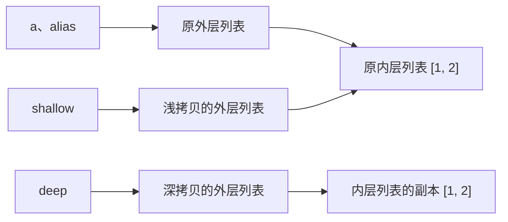

Python 里有一个容易让人困惑的现象：明明已经“复制”了一份列表，修改它时，原来的列表却也变了。要理解这个问题，需要分别看外层容器和容器里面的对象。

## 先分清名字、对象和数据

在 Python 里，整数、字符串、列表等数据都由对象表示。对象有自己的身份、类型和值，变量名则绑定到对象。例如 `a = [1, 2]` 会创建一个列表对象，再把名字 `a` 绑定到它；`a` 这个名字本身并不装着一份列表数据。

因此，“操作对象”和“复制数据”可以同时发生：拷贝也是一种对象操作，会按照对象类型的规则建立副本。对于列表，创建新的外层列表和复制内部元素，是两件可以分开做的事。列表自身保存着对元素对象的引用，新列表可以保存相同的引用，这时外层容器已经独立，元素对象仍然共享。

理解下面几种操作时，先看它是在改变名字的绑定、修改已有对象，还是创建副本：

- **赋值 `b = a`**：让 `b` 绑定到 `a` 当前指向的对象，不执行拷贝。这个规则适用于任何对象，不要求 `a` 是列表；赋值后，两个名字指向同一个对象。
- **重新绑定 `b = []`**：先创建一个新列表，再让 `b` 指向它。如果此前执行过 `b = a`，那么 `a` 仍然指向原对象。这里出现了新对象，但没有复制原列表的内容。
- **原地修改 `b.append(3)`**：假定 `a` 原本指向一个 `list`，并执行过 `b = a`，这里修改的就是二者共享的列表，通过 `a` 也能看到变化。修改列表中的一个位置，如 `b[0] = 9`，同样是在修改列表对象，不是在重新绑定名字 `b`。
- **显式拷贝 `b = a.copy()` 或 `b = copy.deepcopy(a)`**：假定 `a` 是列表，前者创建新的外层列表并复用元素引用，后者递归处理内部对象。它们都包含“取得副本”和“把 `b` 绑定到结果”两个步骤，复制行为来自右侧的拷贝操作，赋值本身只负责绑定。

数字和字符串不可变，要得到不同的值，只能让名字绑定到相应结果。比如假定 `a` 是整数，执行 `b = a` 后再执行 `b = b + 1`，会先计算加法，再重新绑定 `b`，`a` 指向的整数不会被修改。列表则允许原地修改，所以共享引用时会出现前面的联动。

对象身份用 `is` 判断，值是否相等用 `==` 判断。分别执行 `a = [1, 2]` 和 `b = [1, 2]`，会得到两个值相等的列表：`a == b` 为 `True`，`a is b` 为 `False`。这也说明，两份内容相同的数据，可以由两个不同对象承载。

## 浅拷贝和深拷贝差在哪一层

### 外层容器和内层对象分别是什么

对于 `a = [[1, 2], [3, 4]]`，外层是包含两个元素的列表，两个元素又分别指向 `[1, 2]` 和 `[3, 4]` 这两个内层列表。`a[0]` 取得第一个内层列表，`a[0][0]` 则继续取得这个内层列表中的第一个元素。

现在对同一个 `a` 分别做赋值、浅拷贝和深拷贝：

```python
import copy

a = [[1, 2], [3, 4]]
alias = a
shallow = copy.copy(a)
deep = copy.deepcopy(a)

print(alias is a)         # True
print(shallow is a)       # False
print(shallow[0] is a[0]) # True
print(deep is a)          # False
print(deep[0] is a[0])    # False
print(a == shallow == deep)  # True
```

这几个结果说明，值相等和对象相同是两回事。刚创建时，三个列表看起来都是 `[[1, 2], [3, 4]]`，它们之间的引用关系却不同：

- `alias = a` 没有拷贝，二者共享外层列表，自然也通过它访问同样的内层列表。
- `shallow = copy.copy(a)` 新建了外层列表，但其中的两个元素仍然指向原来的内层列表。
- `deep = copy.deepcopy(a)` 在这个例子中，新建了外层列表，也递归复制了两个内层列表。

下图只画出第一个内层列表；第二个内层列表的关系相同。同一个框代表同一个对象，即使两个框里的内容相等，它们也可以是两个不同对象。



### 给外层列表添加元素，修改的是哪个对象

下面每组修改示例都重新创建 `a` 和副本，避免前一组修改干扰后一组。`copy` 模块沿用上面的导入。

```python
a = [[1, 2], [3, 4]]
b = copy.copy(a)

b.append([5, 6])
print(a)  # [[1, 2], [3, 4]]
print(b)  # [[1, 2], [3, 4], [5, 6]]
```

`b.append(...)` 的接收者是 `b` 指向的外层列表。浅拷贝已经让它和 `a` 的外层列表分开，所以只有 `b` 的长度增加。类似地，`b.pop()`、`del b[0]` 修改的也是 `b` 的外层结构，不会删除 `a` 中的位置。

如果把这里的 `b = copy.copy(a)` 换成 `b = a`，两者就共享外层列表，`b.append(...)` 也会让通过 `a` 看到的列表变长。

### 修改内层列表，为什么原数据也会变

```python
a = [[1, 2], [3, 4]]
b = copy.copy(a)

b[0].append(9)
print(a)  # [[1, 2, 9], [3, 4]]
print(b)  # [[1, 2, 9], [3, 4]]

b[0][0] = 100
print(a)  # [[100, 2, 9], [3, 4]]
print(b)  # [[100, 2, 9], [3, 4]]
```

读 `b[0].append(9)` 时，可以分成两步：先从外层列表取出 `b[0]`，再对取出的内层列表调用 `append`。由于 `b[0] is a[0]`，这次添加发生在共享的内层列表上，所以两边都能看到 `9`。

接着执行 `b[0][0] = 100`，修改的仍然是这个内层列表，只是把它的第一个位置改为引用整数 `100`。这里没有把整数 `1` 本身改成 `100`；整数不可变，变化的是内层列表保存的元素引用。`a[0]` 访问的也是同一个内层列表，因此同样看到 `100`。

### 替换整个内层列表，为什么又不影响原数据

```python
a = [[1, 2], [3, 4]]
b = copy.copy(a)

b[0] = [9, 9]
print(a)  # [[1, 2], [3, 4]]
print(b)  # [[9, 9], [3, 4]]
print(b[0] is a[0])  # False
print(b[1] is a[1])  # True
```

`b[0] = [9, 9]` 先创建一个新列表，再替换 **`b` 的外层列表中第一个位置保存的引用**。原来的内层列表 `[1, 2]` 没有被修改，`a` 的外层列表也没有被修改，所以 `a[0]` 仍然指向它。

这和 `b[0][0] = 100` 的区别在于赋值的位置：前者改外层列表的一个位置，后者先取得内层列表，再改内层列表的一个位置。这里 `b` 的第二个位置没有被替换，`b[1]` 与 `a[1]` 仍然共享；浅拷贝后的共享关系可以随着后续操作发生变化。

### 深拷贝如何隔离这些修改

```python
a = [[1, 2], [3, 4]]
b = copy.deepcopy(a)

b[0].append(9)
b[0][0] = 100
b.append([5, 6])

print(a)  # [[1, 2], [3, 4]]
print(b)  # [[100, 2, 9], [3, 4], [5, 6]]
```

这次 `b[0]` 已经是独立的内层列表，所以对它添加元素或替换元素，都不会影响 `a[0]`；添加外层元素也只影响 `b`。对这个由列表和整数组成的例子，深拷贝隔离了外层和内层列表上的修改。

### 多复制一层，也不一定就是深拷贝

当嵌套更深时，对每个元素再调用一次 `.copy()`，只能把复制推进到下一层：

```python
a = [[[1]]]
b = [row.copy() for row in a]

print(b is a)              # False：最外层独立
print(b[0] is a[0])        # False：中间层独立
print(b[0][0] is a[0][0])  # True：最内层仍然共享

b[0][0].append(2)
print(a)  # [[[1, 2]]]
```

列表推导式新建了最外层列表，`row.copy()` 又新建了中间层列表，但最里面的 `[1]` 仍然共享。因此，判断修改会不会影响原数据，需要找到操作实际作用的对象，再检查那个对象是否共享；只检查 `b is a`，还不足以说明内部数据已经独立。

## 常见操作到底复制了什么

下面讨论内置的普通 `list`、`dict` 和 `set`；自定义类型可以有自己的行为。

| 操作 | 外层对象 | 内部对象 |
| --- | --- | --- |
| `b = a` | 共享原对象 | 共享 |
| `a.copy()`（列表、字典、集合） | 新容器 | 仍然共享元素；字典共享键和值 |
| `a[:]`、`list(a)`（列表） | 新列表 | 共享原元素 |
| `dict(d)`、`set(s)` | 新容器 | 共享原键、值或元素 |
| `copy.copy(a)` | 对上述容器做浅拷贝 | 共享原内部对象 |
| `copy.deepcopy(a)` | 对上述容器递归复制 | 按类型规则复制，部分对象会复用 |
| `sorted(a)`、`[x for x in a]` | 新列表 | 放入原元素的引用 |
| `a.sort()`、`a.reverse()`（列表） | 原地修改，返回 `None` | 不复制元素 |

因此，“返回新列表”只能说明外层是新的。列表推导式是否创建新元素，取决于表达式：`[x for x in a]` 直接复用 `x`，`[x.copy() for x in a]` 则对每个元素再做一次浅拷贝。这不能保证更深层的对象也被复制；通用的递归复制可以使用 `copy.deepcopy()`。

## 底层是在复制引用，还是继续遍历对象

### 浅拷贝复制的是列表里保存的引用

以 CPython 3.14 为例，列表内部用一个数组保存元素引用，源码中的 `PyObject *` 可以理解为指向某个 Python 对象的指针。对于 `[[1, 2], [3, 4]]`，外层数组的两个位置指向的是两个内层列表，并没有直接存放它们里面的所有数字。

浅拷贝会分配新的外层列表和引用数组，把原数组里的元素引用放入新数组。于是，两个数组不同，但相应位置仍然指向同一个内层列表。列表切片使用的 `Py_NewRef(v)` 是保留对现有对象 `v` 的引用，并做相应的引用计数处理。深拷贝后的列表也通过引用访问元素。区别在于，它会继续处理引用指向的对象，把处理结果的引用放进新容器；对于这里的内层列表，处理结果就是新建的列表副本。

### deepcopy 每遇到一个对象，会做什么

`deepcopy` 按类型选择处理方式。对于前面的列表和整数例子，可以把入口逻辑理解为三种情况：

1. 遇到整数、字符串等可直接复用的类型，返回原对象。
2. 遇到其他对象，先检查本次复制的 `memo`：如果这个对象已经有对应副本，直接返回那个副本。
3. 尚未处理过，就进入对应类型的复制分支。列表分支创建新列表并递归处理元素；字典分支则递归处理键和值。自定义类还可以通过 `__deepcopy__` 指定自己的规则。

`memo` 是这一次复制过程共享的记录表，核心对应关系是 `id(原对象) → 副本对象`。递归调用时一直传递同一个表，才能知道此前遇到过谁。通常分别调用两次 `copy.deepcopy(a)`，会各自建立一份记录表。

列表分支的关键步骤可以用下面这段代码表示。它只展示如何填充一个列表副本，完整的类型判断和 `memo` 查询由 `copy.deepcopy` 的入口完成：

```python
def copy_list_contents(source, memo):
    result = []
    memo[id(source)] = result
    for item in source:
        copied_item = copy.deepcopy(item, memo)
        result.append(copied_item)
    return result
```

这里先建立空列表，再登记到 `memo`，然后才处理元素。表里保存的是对这个新列表的引用，所以后面向 `result` 添加元素时，记录仍然指向正在被填充的同一个列表。

### 顺着一个普通嵌套列表走一遍

假定执行 `a = [[1, 2], [3, 4]]`，然后执行 `b = copy.deepcopy(a)`，过程可以这样展开：

1. 处理外层列表 `a`：新建空列表 `outer`，记录 `memo[id(a)] = outer`。
2. 处理第一个元素 `a[0]`：它是另一个列表，新建空列表 `first`，记录 `memo[id(a[0])] = first`。
3. 继续处理 `a[0]` 的元素 `1` 和 `2`：整数可以复用，把对它们的引用放进 `first`。现在 `first` 的内容是 `[1, 2]`。
4. 第一个内层列表处理完成，把对 `first` 的引用放进 `outer`。它指向的是新的内层列表，而不是原来的 `a[0]`。
5. 对第二个内层列表重复这个过程，新建 `second`，填入 `3` 和 `4`，再把对 `second` 的引用放进 `outer`。
6. 返回已经填好的 `outer`，赋值语句再把名字 `b` 绑定到它。

所以，深拷贝递归复制的是这些列表对象，并按它们原来的连接关系组织副本。整数仍然可以共享，但 `b[0][0] = 100` 修改的是新的 `first` 列表中的位置，不会影响原来的 `a[0]`。

### 重复引用为什么只产生一份对应副本

```python
shared = [1]
a = [shared, shared]
b = copy.deepcopy(a)
print(b[0] is b[1])       # True：副本内部仍然共享
print(b[0] is shared)     # False：与原来的列表分开
```

处理 `a[0]` 时，`deepcopy` 首次遇到 `shared`，创建对应的新列表，登记到 `memo`，并填入 `1`。处理 `a[1]` 时，遇到的仍然是同一个 `shared`；它的 `id` 已经在表里，所以直接取出刚才的副本，放到第二个位置。

最终，新外层列表的两个位置指向同一个新内层列表。深拷贝隔离了这个内层列表与原列表之间的修改，却保留了副本内部的共享关系。“每个位置都各复制一遍”会产生两个不同列表，那就改变了原来的关系。

### 循环引用为什么不会无限递归

```python
loop = []
loop.append(loop)
cloned = copy.deepcopy(loop)
print(cloned[0] is cloned)  # True：循环指向副本自身
```

`loop` 的第一个元素就是它自己。处理它时，先创建空的 `cloned`，并记录 `memo[id(loop)] = cloned`；接着处理第一个元素，再次遇到 `loop`，查询记录表就能取得 `cloned`，把它添加到自己里面，复制随即完成。

这解释了为什么一定要在递归处理列表元素之前登记副本。如果等所有元素复制完才登记，处理第一个元素时就还查不到 `loop` 的副本，只能继续进入同样的复制过程，无法靠这张表终止循环。

### 递归在哪里停下来

对整数、字符串等对象，CPython 的处理方式是直接返回原对象，递归在这里结束；共享这些不可变对象不会让两份列表因为原地修改它们而联动。只含可复用元素的元组，也可能直接返回原元组。元组里如果包含列表，仍然需要处理那个列表，因为元组不可变只限制它自己的元素引用，不能阻止内部列表被修改。

因此，`deepcopy` 的结果不要求所有对象都有新身份。它按类型规则复制对象、复用对象，并借助 `memo` 维持它们之间的引用关系。

## 需要隔离到哪一层，就复制到哪一层

只想调整外层元素的顺序、增删元素或替换某个位置，浅拷贝通常就够了。需要修改内部列表或字典，又不能影响原数据时，再考虑深拷贝。深拷贝通常会多遍历对象、多分配内存，也可能复制本来希望共享的数据。

还有一个相关的坑：`rows = [[]] * 3` 会把同一个内部列表的引用重复三次，修改一行会影响另外两行。对它做一次深拷贝，三行仍会共享同一个复制出来的列表；要创建三行独立列表，应写 `rows = [[] for _ in range(3)]`。

函数传参也不会自动复制对象。自定义类可以用 `__copy__` 和 `__deepcopy__` 定义复制规则；文件、套接字等资源则不能当作普通嵌套数据随意深拷贝。
