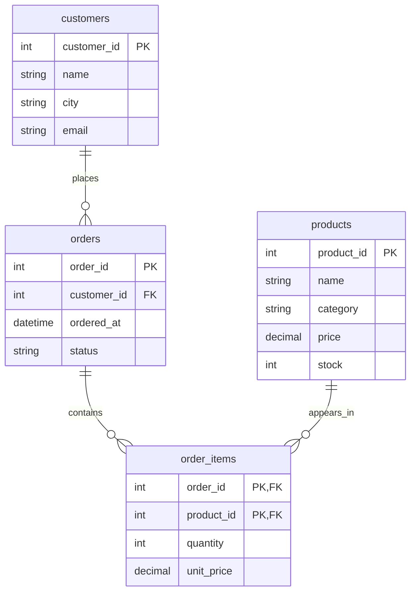

<aside class="translation-notice" role="note">This English version was machine-translated from the Chinese original. Technical terms may require verification.</aside>

Once a backend can handle requests, its data still needs somewhere to live. A Python list or a JSON file can get customers and orders working: append a record when an order arrives, then read the file for a query. How can this become more efficient and reliable? That is the problem a database aims to solve.

These questions go beyond writing data to disk. We need to know which information belongs to the same object, which information may repeat, and which relationships must always hold. This post starts with a small order system to work out how to organize the data. The SQL syntax lives in the companion post, [SQL Basics: Queries, Aggregation, JOINs, and Window Functions](/en/blog/2024/07/29/sql-learning-notes/).

## Files Store Data; a Database Also Manages Rules

A **database** is data organized in a particular structure; a **database management system (DBMS)** is software that manages it. Our order data belongs to the database, while MySQL is a DBMS. Relational databases are only one family: document, key-value, and graph models also have their uses. Here we focus on relational databases, which organize data in tables.

Files can support these tasks, but we would have to implement the rules ourselves. Copying customer details across files creates redundancy and inconsistency. Writing traversal code for every query makes access increasingly complicated. Concurrent writes also require coordination: who writes first, and what happens if a write fails halfway through? A DBMS supplies queries, constraints, transactions, concurrency control, and permissions as a shared entry point for managing data.

There are also different levels of observation. Business code cares about fields and relationships, the logical structure. Disk pages and access paths belong to the physical implementation. Restricting a user to their own orders involves exposed views and permissions. A client sends SQL, the database server processes requests, and administrators manage configuration, access, and maintenance. We begin at the logical level before studying indexes and transaction internals.

## An Order System Example

Suppose a customer can place several orders, and an order can contain several products. We combine repeated occurrences of the same product within an order into one item, using a quantity to record how many were bought. Start with four tables:

| Table | What one row represents | Main fields |
| --- | --- | --- |
| `customers` | One customer | `customer_id`, `name`, `city`, `email` |
| `products` | One product | `product_id`, `name`, `category`, `price`, `stock` |
| `orders` | One order | `order_id`, `customer_id`, `ordered_at`, `status` |
| `order_items` | One product in a particular order | `order_id`, `product_id`, `quantity`, `unit_price` |

Customer 1 might place order 1001 for one keyboard and two mice. `orders` needs one row for the order belonging to customer 1; `order_items` needs two rows describing the products. The customer's name belongs in `customers`, and the current product price belongs in `products`. Neither needs to be repeated throughout the order.

Decide what a row represents before listing its fields. If a row sometimes represents an order and sometimes an order item, it becomes difficult to choose a stable primary key or explain what a query is counting. Defining what each row means and then choosing its primary key is a crucial part of building a database.

## Relational Terms and How They Map to Tables

A table's structure can be understood as a **relation schema**. The complete set of tuples conforming to that structure at a particular moment is a **relation instance**, rather than just one row. A row corresponds to a **tuple**, a column to an **attribute**, and the set of allowed values for an attribute is its **domain**.

For example, `products(product_id, name, category, price, stock)` describes a schema. All four product records form an instance; the keyboard row is a tuple. A price domain means more than something that looks numeric: it includes the chosen type and business restrictions, such as nonnegative amounts.

A theoretical relation is a set of tuples with neither duplicates nor row order. Actual SQL tables and query results do not automatically share those properties. Without constraints, duplicate rows can be stored; ordinary `SELECT` usually preserves duplicate results; final ordering must be specified with `ORDER BY`. Remember the distinction when learning `DISTINCT`, `UNION ALL`, and sorting.

Relational operations also make sense through everyday queries. Keeping products with stock greater than zero is selection. Taking only names and prices is projection. Matching orders to customers by ID is a join. Query results can also be combined by union, intersection, and difference. The result of a relational operation is another relation, so operations can be composed. SQL expresses the data we want; the database decides how to execute it.

SQL also introduces `NULL` for missing or unknown information. It is neither zero nor an empty string, and comparisons may produce UNKNOWN. This three-valued logic affects filtering and aggregation; the SQL post gives concrete examples.

## Keys Identify Objects; Constraints Protect Data Boundaries

A name alone is not a reliable way to find a customer: two people can share a name. Designing `customer_id` as a unique identifier turns "the person called Alice" into "customer 1."

A **superkey** is a set of attributes that uniquely identifies a tuple. If `customer_id` is unique by itself, `{customer_id, name}` is also a superkey, but includes an unnecessary attribute. A minimal superkey, from which no attribute can be removed without losing guaranteed uniqueness, is a **candidate key**. We choose one candidate key as the **primary key**. Minimal refers to the attribute set, not the smallest value in a column.

If the business guarantees a non-null, unique email for every customer, email may also be a candidate key. Our example permits missing emails, so it is not one. An order has the single-column primary key `order_id`. An order item uses `(order_id, product_id)` as a composite primary key: each product occurs once within an order. If a business allows separate lines for the same product, perhaps for different customizations, item identity must be redesigned.

`orders.customer_id` refers to `customers.customer_id`, an example of a **foreign key**. It protects the reference, preventing an order from pointing to a nonexistent customer. Nullability and whether deletion should be blocked or cascaded are separate design decisions. Here every order must have a customer, and deleting referenced records is blocked.

Other constraints include `NOT NULL`, `UNIQUE`, and `CHECK`. `quantity > 0` is an item rule; `stock >= 0` is a product rule. `DEFAULT` supplies a value when a field is omitted and cannot replace those constraints. Declare rules in the database when it can enforce them. A rule such as "an order total must not exceed the customer's credit limit" spans rows and tables and cannot be enforced merely by adding a simple column `CHECK`.

## Derive Four Tables from Entities and Relationships

Customers, products, and orders are distinguishable business objects that can be modeled as **entities**. Names, prices, and order times are attributes. E-R modeling describes relationships between objects before translating them into relation schemas.

A customer can have zero or many orders, while each order belongs to one customer, so the order table contains a customer ID. An order has items, each belonging to one order; a product can also appear in many items. These two one-to-many relationships resolve the original many-to-many relationship between orders and products:



`quantity` and `unit_price` belong to the relationship "this order bought this product," rather than just to the product. Different orders can buy different quantities at different discounts. The diagram permits an order with no items because these foreign keys alone cannot guarantee at least one item per order. A business may allow a draft order before products are added. If submitting an order requires an item, the submission flow must check it.

Attributes can be composite or multivalued, too. An address can be separated into relevant fields if queries need provinces and cities. Multiple customer phone numbers can be modeled in a separate contact table. We leave those requirements out of this example and keep the four core tables.

## Why One Large Table Becomes Hard to Change

If everything is combined into `order_lines`, it might look like this:

| order_id | product_id | customer_id | customer_name | product_name | quantity | unit_price |
| --- | --- | --- | --- | --- | --- | --- |
| 1001 | 101 | 1 | Alice | Keyboard | 1 | 180.00 |
| 1001 | 102 | 1 | Alice | Mouse | 2 | 90.00 |
| 1002 | 103 | 1 | Alice | Database Book | 1 | 100.00 |

Reading an order is convenient, but changing other details is not. Renaming Alice requires updating several rows; missing one creates conflicting information, an **update anomaly**. A new product with no orders cannot naturally be stored here, an **insertion anomaly**. Deleting the last order record for a product can also erase its product details, a **deletion anomaly**.

These problems do not wait for large datasets. They come from putting distinct facts in the same place: customer details change with the customer, product details with the product, and item quantities with the order-product combination. The large table does not express these separate relationships, making queries convenient but modifications painful.

## Functional Dependencies Make Ownership More Precise

If equal X values must imply equal Y values, there is a functional dependency `X → Y`. The requirement comes from business rules. In other words, once X is determined, those rules require Y to be determined as well.

In this system, we can write:

```text
customer_id → name, city, email
product_id → name, category, price, stock
order_id → customer_id, ordered_at, status
(order_id, product_id) → quantity, unit_price
```

In the mixed table, the composite key identifies an item. Product details depend only on `product_id`, order details only on `order_id`, and customer details are determined through `customer_id`. These facts have different owners. Normalization uses such dependencies to check whether a table mixes them together. Following which attributes determine which others, we move distinct facts back to their own tables. In the four tables above, each key determines a group of other attributes; those attributes belong together and can be looked up through that primary key.

### 1NF: Store One Defined Value in Each Position

First normal form requires atomic attribute values. Do not put `"101,102,103"` into an item's `product_id` and ask code to split the string. Represent multiple products with multiple items. That may sound abstract, so consider this incorrect design:

```text
orders
------------------------------------------------
order_id | products
1001     | "P01,P02,P03"
```

Looking up a particular product would mean parsing the string every time, which quickly becomes tedious. Instead, keep `orders` as a separate table and use an order-item table to store each product record:

```text
order_items
-------------------
order_id product_id
1001     P01
1001     P02
1001     P03
```

Atomicity depends on the model. A string has characters inside it, but treating a product code as a whole identifier does not violate 1NF merely because it can be split into characters. Information that needs independent querying and maintenance should be modeled explicitly. The fact that a database can store a string does not establish that the design is sound; do not quietly pack several records into one field.

### 2NF: Non-Prime Attributes Should Not Depend on Part of a Composite Key

Beyond 1NF, second normal form requires non-prime attributes to depend fully on every candidate key, without a partial dependency on a proper subset. A non-prime attribute belongs to no candidate key; it does not simply mean an attribute outside the chosen primary key.

For the large table's `(order_id, product_id)` key, `product_name` depends only on `product_id`, so it belongs in `products`. Order time depends only on `order_id`, so it belongs in `orders`. Item quantity and sale unit price depend on the complete key. The question behind 2NF is this: if A and B together determine C, could A or B determine C on its own? If so, that fact belongs in a separate table rather than being mixed into the composite-key design.

### 3NF: Separate Information Determined through Other Attributes

An order table containing `customer_id`, `customer_name`, and `city` has the dependency chain `order_id → customer_id → customer_name, city`. The order determines customer details indirectly, but those details are owned by customer identity and should move to `customers`.

This is an intuitive example of third normal form. More formally, for every nontrivial dependency `X → A`, 3NF requires X to be a superkey or A to be a prime attribute. Nontrivial means A is not in X. This removes a transitive dependency. The example meets the first two normal forms, but can be decomposed further because the dependency passes through `customer_id`.


## Decomposed Tables Must Reconnect and Preserve Checkable Rules

More tables are not inherently better. A **lossless decomposition** means joining the decomposed relations through the appropriate relationships reproduces exactly the original relation, without losing facts or inventing combinations. Extra incorrect rows are a lossless-join problem too, even if no rows disappear.

After customer details move to `customers`, an order can recover the correct details using the customer ID, which uniquely determines the customer. In contrast, splitting "orders and products" into "orders and categories" and "categories and products" can invent purchases when a category has two products. Keeping all the columns does not make a decomposition lossless if the join keys are wrong.

**Dependency preservation** asks whether checking dependencies separately on each resulting relation guarantees the original functional dependencies, without joining first. It is different from losslessness. Decomposing the earlier `R(A,B,C)` into `CB` and `AC` using `C → B` is lossless, but the dependencies on those two tables alone cannot guarantee `AB → C`. Pursuing BCNF may therefore sacrifice preservation of all dependencies. Here we focus on the tradeoff rather than decomposition algorithms.

Building real tables still requires turning dependencies into keys and constraints, with code handling rules the database cannot directly express. Normal forms reveal structural problems; they do not finish every business design decision automatically.


## From Table Design to a Reliable Modification

Creating an order now means writing an order and its items, and may also require reducing stock. If stock decreases but saving the order fails, the data has not jointly completed the business operation it represents. Transactions organize operations as a whole while dealing with concurrency and failure; they are not a way to wait until code has been tested before committing.

The SQL post introduces `START TRANSACTION`, `COMMIT`, `ROLLBACK`, and autocommit. What concurrent inventory requests see, why locks wait, and how a crash is recovered belong to the later study of transaction implementation.

Before moving on, try answering without the diagram: why does the system need an order-item table? Why not store a customer name in every item? What do primary keys, foreign keys, and `CHECK` each guarantee? Why should an old order total stay the same when current prices change? Explaining these questions connects table design to the SQL you write.
