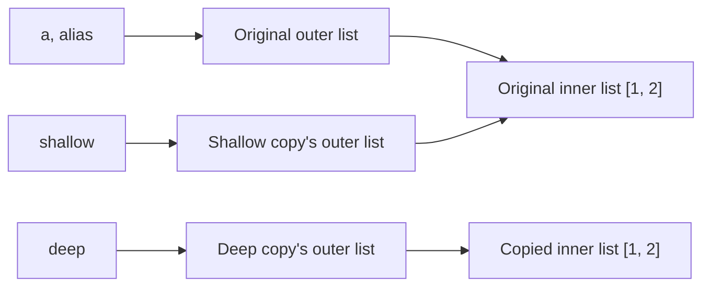

<aside class="translation-notice" role="note">This English version was machine-translated from the Chinese original. Technical terms may require verification.</aside>

Sometimes modifying a “copied” Python list changes the original too. Understanding why requires looking separately at the outer container and the objects inside it.

## Distinguishing names, objects, and data

In Python, data such as integers, strings, and lists is represented by objects. Each object has an identity, a type, and a value; variable names are bound to objects. For example, `a = [1, 2]` creates a list object and binds the name `a` to it. The name itself does not hold a separate copy of the list data.

Operating on objects and copying data can happen together: copying is an object operation that produces a copy according to the object's type. For a list, creating a new outer list and copying the elements inside are separate tasks. The list itself stores references to element objects. A new list can store those same references, making the outer containers independent while their elements remain shared.

For the following operations, distinguish changes to name bindings, mutations of existing objects, and the creation of copies:

- **Assignment, `b = a`**: binds `b` to the object currently referenced by `a`, without copying it. This applies to any object; `a` need not refer to a list. Both names then refer to the same object.
- **Rebinding, `b = []`**: creates a new list and binds `b` to it. If `b = a` was executed earlier, `a` still refers to the original object. A new object has been created, but the original list's contents have not been copied.
- **In-place mutation, `b.append(3)`**: assume `a` originally refers to a `list` and `b = a` has been executed. This changes their shared list, so the change is visible through `a`. Replacing a list item with `b[0] = 9` also modifies the list object, without rebinding the name `b`.
- **Explicit copying, `b = a.copy()` or `b = copy.deepcopy(a)`**: assuming `a` is a list, the former creates an outer list that reuses element references; the latter recursively processes inner objects. Both obtain a copy and bind `b` to the result. Copying comes from the right-hand operation; assignment itself establishes the binding.

Numbers and strings are immutable. To obtain a different value, a name must be bound to the corresponding result. For example, if `a` is an integer, executing `b = a` followed by `b = b + 1` computes the addition and rebinds `b`, without modifying the integer referenced by `a`. Lists allow in-place mutation, which explains the shared changes above.

Use `is` to compare object identity and `==` to compare values. Executing `a = [1, 2]` and `b = [1, 2]` separately creates two lists with equal values: `a == b` is `True`, while `a is b` is `False`. Identical contents can therefore be represented by distinct objects.

## Where shallow and deep copies differ

### What the outer and inner objects are

In `a = [[1, 2], [3, 4]]`, the outer list contains two elements that refer to the inner lists `[1, 2]` and `[3, 4]`. `a[0]` retrieves the first inner list; `a[0][0]` then retrieves that list's first element.

Compare assignment, shallow copying, and deep copying of the same `a`:

```python
import copy

a = [[1, 2], [3, 4]]
alias = a
shallow = copy.copy(a)
deep = copy.deepcopy(a)

print(alias is a)         # True
print(shallow is a)       # False
print(shallow[0] is a[0]) # True
print(deep is a)          # False
print(deep[0] is a[0])    # False
print(a == shallow == deep)  # True
```

Equal values do not imply identical objects. Initially, all three lists look like `[[1, 2], [3, 4]]`, but their references differ:

- `alias = a` performs no copy. Both names share the outer list and access the same inner lists through it.
- `shallow = copy.copy(a)` creates an outer list whose elements still refer to the original inner lists.
- `deep = copy.deepcopy(a)` creates an outer list and recursively copies both inner lists in this example.

The diagram shows only the first inner list; the second follows the same pattern. Each box represents one object. Boxes with equal contents can represent distinct objects.



### Which object changes when you append an outer element

Each modification example below recreates `a` and its copy, so earlier changes do not affect later examples. They use the `copy` import above.

```python
a = [[1, 2], [3, 4]]
b = copy.copy(a)

b.append([5, 6])
print(a)  # [[1, 2], [3, 4]]
print(b)  # [[1, 2], [3, 4], [5, 6]]
```

The receiver of `b.append(...)` is the outer list referenced by `b`. Shallow copying has separated it from the outer list referenced by `a`, so only `b` grows. Similarly, `b.pop()` and `del b[0]` change the outer structure of `b` without removing positions from `a`.

Replacing `b = copy.copy(a)` with `b = a` would make both names share the outer list. Then `b.append(...)` would also increase the length seen through `a`.

### Why mutating an inner list changes the original

```python
a = [[1, 2], [3, 4]]
b = copy.copy(a)

b[0].append(9)
print(a)  # [[1, 2, 9], [3, 4]]
print(b)  # [[1, 2, 9], [3, 4]]

b[0][0] = 100
print(a)  # [[100, 2, 9], [3, 4]]
print(b)  # [[100, 2, 9], [3, 4]]
```

Read `b[0].append(9)` in two steps: retrieve `b[0]` from the outer list, then call `append` on that inner list. Because `b[0] is a[0]`, the addition happens in a shared inner list, and both names expose the added `9`.

Next, `b[0][0] = 100` changes the same inner list by making its first position refer to the integer `100`. It does not transform the integer `1` into `100`: integers are immutable, and the change is to the element reference stored by the inner list. Since `a[0]` accesses that same list, it also exposes `100`.

### Why replacing an entire inner list leaves the original unchanged

```python
a = [[1, 2], [3, 4]]
b = copy.copy(a)

b[0] = [9, 9]
print(a)  # [[1, 2], [3, 4]]
print(b)  # [[9, 9], [3, 4]]
print(b[0] is a[0])  # False
print(b[1] is a[1])  # True
```

`b[0] = [9, 9]` creates a list and replaces **the reference stored in the first position of the outer list `b`**. Neither the original inner list `[1, 2]` nor the outer list `a` is modified, so `a[0]` still refers to the original inner list.

The assignment target differs from `b[0][0] = 100`: one changes a position in the outer list; the other retrieves an inner list and changes a position within it. Here, the second position of `b` remains untouched, so `b[1]` and `a[1]` still share a list. Sharing after a shallow copy can change with subsequent operations.

### How a deep copy isolates these modifications

```python
a = [[1, 2], [3, 4]]
b = copy.deepcopy(a)

b[0].append(9)
b[0][0] = 100
b.append([5, 6])

print(a)  # [[1, 2], [3, 4]]
print(b)  # [[100, 2, 9], [3, 4], [5, 6]]
```

Here, `b[0]` is an independent inner list. Appending or replacing its elements does not affect `a[0]`, and appending outer elements changes only `b`. For this example of lists and integers, the deep copy isolates mutations of the outer and inner lists.

### Copying another level is not necessarily a deep copy

With deeper nesting, calling `.copy()` on each element extends copying by one level:

```python
a = [[[1]]]
b = [row.copy() for row in a]

print(b is a)              # False: outermost lists are separate
print(b[0] is a[0])        # False: middle lists are separate
print(b[0][0] is a[0][0])  # True: innermost list remains shared

b[0][0].append(2)
print(a)  # [[[1, 2]]]
```

The comprehension creates the outermost list, and `row.copy()` creates the middle list, but the innermost `[1]` remains shared. To determine whether a modification affects the original, identify the object the operation acts on and check whether that object is shared. Checking only `b is a` cannot establish independence of the inner data.

## What common operations copy

This table covers ordinary built-in `list`, `dict`, and `set` objects. Custom types can behave differently.

| Operation | Outer object | Inner objects |
| --- | --- | --- |
| `b = a` | Original object | Shared |
| `a.copy()` (list, dictionary, set) | New container | Elements remain shared; dictionaries share keys and values |
| `a[:]`, `list(a)` (list) | New list | Original elements are shared |
| `dict(d)`, `set(s)` | New container | Original keys, values, or elements are shared |
| `copy.copy(a)` | Shallow copy of these containers | Original inner objects are shared |
| `copy.deepcopy(a)` | Recursive copy of these containers | Type-specific copying; some objects are reused |
| `sorted(a)`, `[x for x in a]` | New list | References to original elements |
| `a.sort()`, `a.reverse()` (list) | Modified in place; returns `None` | Elements are not copied |

Returning a new list guarantees a new outer container only. A comprehension's expression determines whether it creates new elements: `[x for x in a]` reuses each `x`, while `[x.copy() for x in a]` makes another shallow copy of each element. This does not guarantee that objects nested more deeply are also copied. For general recursive copying, use `copy.deepcopy()`.

## Copying references or traversing objects

### A shallow copy duplicates the references stored by the list

In CPython 3.14, a list stores element references in an array. The source type `PyObject *` represents a pointer to a Python object. For `[[1, 2], [3, 4]]`, the two outer positions point to inner lists; the outer array does not directly hold all the numbers inside them.

A shallow copy allocates an outer list and reference array, then places the original element references into that array. The arrays differ, but corresponding positions still point to the same inner lists. List slicing uses `Py_NewRef(v)` to retain a reference to the existing object `v` with the corresponding reference-count bookkeeping. A deep-copied list also accesses its elements through references. It processes the referenced objects and places references to the results into the new container. For these inner lists, the results are new list copies.

### What deepcopy does when it encounters an object

`deepcopy` selects a handler by type. For the lists and integers above, its entry logic has three relevant cases:

1. For directly reusable types such as integers and strings, return the original object.
2. For other objects, check this copying operation's `memo`. If a corresponding copy has already been recorded, return it.
3. Otherwise, enter the appropriate copying handler. The list handler creates a list and recursively processes its elements; the dictionary handler processes keys and values. Custom classes can provide their own rules through `__deepcopy__`.

`memo` is a record shared by this copying operation, with the core mapping `id(original object) → copy`. Recursive calls pass the same record to recognize previously encountered objects. Two separate calls to `copy.deepcopy(a)` normally establish separate records.

The list handler's key steps can be expressed by this code. It shows only how a list copy is populated; the `copy.deepcopy` entry handles type selection and `memo` lookups:

```python
def copy_list_contents(source, memo):
    result = []
    memo[id(source)] = result
    for item in source:
        copied_item = copy.deepcopy(item, memo)
        result.append(copied_item)
    return result
```

It creates an empty list, records it in `memo`, and only then processes the elements. The record holds a reference to that list. As elements are added to `result`, the record continues to point to the same list being populated.

### Walking through an ordinary nested list

Consider `a = [[1, 2], [3, 4]]` followed by `b = copy.deepcopy(a)`:

1. Process the outer list `a`: create an empty list `outer` and record `memo[id(a)] = outer`.
2. Process the first element `a[0]`: create an empty list `first` and record `memo[id(a[0])] = first`.
3. Process its elements `1` and `2`: integers can be reused, so place references to them into `first`, producing `[1, 2]`.
4. Place a reference to the completed `first` into `outer`. It points to a new inner list rather than the original `a[0]`.
5. Repeat for the second inner list: create `second`, populate it with `3` and `4`, and place a reference to it into `outer`.
6. Return the populated `outer`. The assignment then binds the name `b` to it.

The deep copy recursively copies these list objects and connects the copies according to the original relationships. Integers can remain shared, but `b[0][0] = 100` changes a position in the new list `first`, leaving the original `a[0]` unchanged.

### Why repeated references produce one corresponding copy

```python
shared = [1]
a = [shared, shared]
b = copy.deepcopy(a)
print(b[0] is b[1])       # True: still shared within the copy
print(b[0] is shared)     # False: separate from the original list
```

When processing `a[0]`, `deepcopy` first encounters `shared`, creates a list copy, records it in `memo`, and populates it with `1`. While processing `a[1]`, it encounters the same `shared` again. Its identity is already recorded, so the existing copy is placed into the second position.

The new outer list therefore holds two references to one new inner list. The copy isolates mutations from the original while preserving sharing within the copy. Independently copying every position would create two separate lists and change the original relationship.

### Why a cycle does not recurse indefinitely

```python
loop = []
loop.append(loop)
cloned = copy.deepcopy(loop)
print(cloned[0] is cloned)  # True: the cycle points to the copy itself
```

The first element of `loop` is itself. Processing it first creates an empty `cloned` and records `memo[id(loop)] = cloned`. Processing the first element encounters `loop` again; the lookup retrieves `cloned` and appends it to itself, completing the copy.

This is why the copy must be recorded before recursively processing list elements. Waiting until all elements had been copied would leave the first recursive encounter without a recorded copy of `loop`, repeating the same process without using the record to break the cycle.

### Where recursion stops

For objects such as integers and strings, CPython returns the original object, ending recursion at that point. These immutable objects cannot be modified in place, so sharing them does not make the two lists change together. A tuple whose elements can all be reused may also be returned unchanged. If a tuple contains a list, that list still needs processing: tuple immutability fixes its own element references but does not prevent an inner list from changing.

Thus, `deepcopy` does not require a new identity for every object. It follows type-specific rules to copy or reuse objects and uses `memo` to maintain their reference relationships.

## Copy to the depth that needs isolation

A shallow copy is usually enough to reorder, add, remove, or replace outer elements. Consider a deep copy when you need to modify nested lists or dictionaries independently. Deep copies generally traverse more objects and allocate more memory, and may copy data intended to remain shared.

Another trap is `rows = [[]] * 3`: it repeats a reference to the same inner list three times. Changing one row changes the others. A single deep copy still leaves the three rows sharing one copied list. Create independent rows with `rows = [[] for _ in range(3)]`.

Passing an object to a function does not automatically copy it either. Custom classes can define `__copy__` and `__deepcopy__`; resources such as files and sockets cannot be deep-copied like ordinary nested data.
